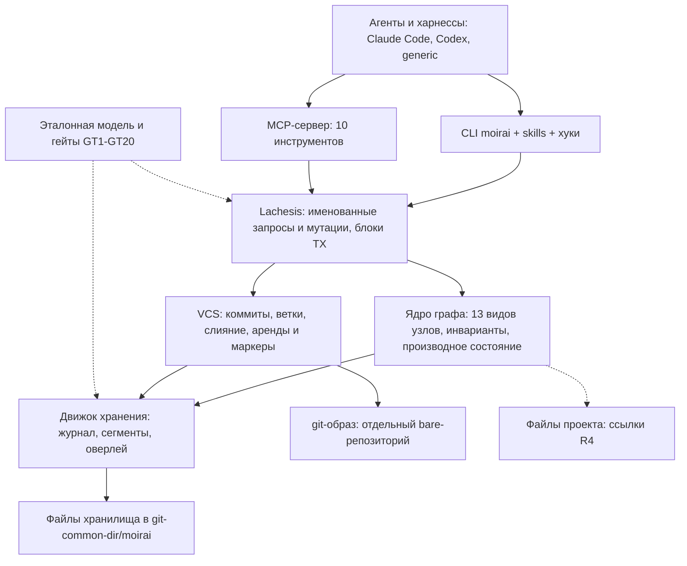

# Архитектура на одной странице

## Что такое moirai

moirai — это один статический бинарник на Rust с собственным движком, написанным с нуля. Примерно за миллисекунду он открывает небольшое хранилище, отображённое в память, и даёт AI-агентам для программирования единый типизированный граф. В графе лежат задачи, подзадачи, блокеры, планы, правила, решения, находки, вердикты и измерения. Видов узлов 13: `task`, `doc`, `note`, `rule`, `decision`, `question`, `finding`, `verdict`, `measurement`, `artifact`, `run`, `lane`, `area`. Видов рёбер 25.

Граф версионируется собственной системой контроля версий, устроенной по образцу git:

- DAG коммитов, адресуемый по содержимому (BLAKE3);
- полноценные ветки для любых данных;
- типизированное трёхстороннее слияние, при котором конфликты хранятся как данные;
- теги, reflog, undo и revert.

Хранилище сериализуется в детерминированный git-образ, который читает человек, и загружается из него обратно. Для самой работы git не нужен. Узел может ссылаться на файл проекта или на место внутри файла, и такая ссылка переживает переименования, перемещения, правки и удаления (R4). Любой вопрос агента задаётся запросом на собственном языке Lachesis (R5).

Система строится под ваш процесс BoykoEngine. В нём девять ролей работают под одним оркестратором, работа делится на кампании и линии (lanes), у каждой линии свой worktree и своя ветка, а на ноутбуке одновременно живут до 16 агентов. Ноутбук — Ryzen 9 5900HS, 16 ГБ; при такой нагрузке свободно ≈ 1,8 ГБ («измерено»). Сегодня состояние процесса разбросано по пяти несвязанным местам, и главный класс сбоев звучит так: «устаревшая или неполная запись выглядит актуальной». moirai собирает всё в один граф и заменяет написанные вручную HDR-блоки бюджетированными контекст-паками.

Агенты работают с moirai через CLI со skill и хуками или через MCP-сервер из десяти инструментов. Поддерживаются Claude Code, Codex и другие харнессы. Каждое решение оценивается по четырём приоритетам: скорость, минимум RAM, корректность и минимум токенов агента. У каждого приоритета есть бюджет и гейт.

Документ описывает предложение D, в котором закрыты все замечания критиков и аудитов. Из четырёх предложений только D выполняет R1–R3.

## Основные компоненты

Сплошные стрелки показывают путь запроса. Пунктир обозначает ссылки на внешние файлы и проверку движка дифференциальным оракулом.

## Архитектура в 14 пунктах

1. **Рамки.** Требования R1–R5 и четыре приоритета. Обязательные правила: собственный движок без сторонних БД; каждый компонент строится один раз по финальной спецификации; до релизного гейта moirai не используется; Windows реализуется сейчас, Linux и macOS проектируются сразу; только pure Rust; независимость от харнесса; операционная политика задаётся в config. Там же явный список того, что не строится: демон, фоновая активность, эмбеддинги, UI, HTTP MCP, автомиграция формата (раздел 1).
2. **Шестнадцать ключевых решений T1–T16.** Для каждого указаны отвергнутые альтернативы и триггеры пересмотра (раздел 2).
3. **Модель данных.** Типизированный граф свойств. У каждого узла 60-байтовый заголовок и две идентичности: `#N` (u32) и `uid` (128 бит). Схема хранится как данные, инвариантов 50. Производное состояние никогда не хранится как истина: `unblocked` лежит в битсете, а `ready` вычисляется при чтении (раздел 3).
4. **Движок хранения.** Единственная истина — журнал операций. Колоночные сегменты неизменяемы и отображаются только на чтение, поверх них в процессе живёт ограниченный оверлей. `HEAD` — кэш из двух слотов. Идентификатор коммита — BLAKE3-256 от канонической формы (раздел 4).
5. **Процессы и долговечность.** Встраиваемая модель без демона. Процесс CLI живёт миллисекунды, MCP-сервер — всю сессию. Запись идёт в три фазы под байтовыми блокировками файла `LOCK`, групповой коммит работает без лидера. Каждая мутация графа подтверждается только после flush. В простое moirai не тратит CPU (раздел 5).
6. **Координация.** Аренды (lease) с fencing-токенами ведутся на уровне хранилища. Маркеры `settled`/`deleted` вместе с векторами absorbed не дают раздать одну задачу дважды на разных ветках. Идемпотентность держится на ключе, хеше payload и ветке (раздел 5).
7. **Собственная VCS (R1, R2).** Ветвится всё, включая `status` и `blocks`. На каждую линию заводится одна ветка через `lane open`. Слияние типизированное, по ключам: база берётся в LCA, при нескольких LCA строится рекурсивная виртуальная база. Слияние в `main` всегда начинается с sync. Структурные нарушения никогда не попадают на ветку, а остаются в staging. Ядро никогда не запускает git (раздел 6).
8. **git-образ (R3).** На каждый узел пишется канонический текстовый файл `.moi`, а трейлеры коммитов несут все хешируемые поля. Слой git-объектов собственный, с SHA-1 и SHA-256. По умолчанию образ пишется в отдельный bare-репозиторий с гранулярностью `checkpoint`. Round-trip проверяют гейты 0–3 (раздел 7).
9. **Файловые ссылки (R4).** Ребро `at` ведёт к файловому узлу. Якорь состоит из цитаты, контекста, окна ±16 строк и области видимости; голый номер строки якорем не бывает. Намерение ссылки версионируется, а её разрешение считается во время работы. Перепривязка ленивая и детерминированная, только по точному доказательству и без watcher'а (раздел 8).
10. **Lachesis (R5).** Язык похож на Cypher и пишет кванторы в стиле GQL. Логика двузначная, с явным отсутствующим значением. Производное состояние доступно только через встроенные функции. Есть грамматика ревизий и защищённые записи блоками `TX`. Каждая команда чтения — именованный запрос, каждая команда записи — именованная мутация (раздел 9).
11. **Интерфейс для агентов.** Роли с Bash работают через CLI, роли без Bash — через MCP. Хуки только ускоряют работу, и у каждого есть запасной путь. Контекст-паки бюджетируются в байтах UTF-8. Права на запись даёт только предъявленная аренда. Для любого харнесса действует контракт C0 (раздел 10).
12. **Бюджеты и проверка.** Для каждого приоритета заданы числовые бюджеты. Качество проверяют каталог гейтов GT1–GT20 и эталонная модель как дифференциальный оракул, а также перебор точек краша, kill-циклы и OS-crash-цикл. Выпуск решает релизный гейт RG1–RG12 (раздел 11).
13. **Кроссплатформенность и конфигурация.** Один формат для трёх ОС, все различия собраны в `moirai-os`. `cargo check` для Linux и macOS — гейт с M0. Операционная политика задаётся ключами `config` с умолчаниями (раздел 12).
14. **План и решения.** Дорожная карта M0–M11, календарь и риски (раздел 13), реестр решений владельца (раздел 14).

## Ключевые числа

| Величина | Бюджет или значение |
|---|---|
| Открытие хранилища | ≤ 1,5 мс при 1e5 узлов, ≤ 3 мс при 1e6 |
| Движковое время команды CLI на `main` | ≤ 5 мс |
| `get #N` | ≤ 5 мкс |
| Долговечный коммит | p50 ≤ пол flush + 0,5 мс; ≈ 2 мс p50 («оценка»), flush на вашем NVMe 0,45–2,0 мс («измерено») |
| Последнее подтверждение в пачке из 16 писателей | p99 ≤ 50 мс, ≈ 2–3 flush на пачку |
| Private RSS процесса CLI или хука | ≤ 4 МБ |
| MCP-сервер / все процессы moirai при 16 сессиях | ≤ 8 МБ + 4 MiB / ≤ 256 МБ |
| Горячий индекс | ≈ 99 Б/узел, 9,9 МБ при 1e5 («оценка») |
| Бриф `SessionStart` / блок в `AGENTS.md` | ≤ 8 000 Б / ≤ 600 Б |
| LQ-Bench (гейт заморозки языка) | ≥ 85 % с первой попытки, ≥ 95 % после повтора, 0 уверенно-неверных записей; ≈ $280 в M0 |
| Объём работ | ≈ 369–508,5 units, P50 ≈ 439 («оценка») |

Полный список гейтов — в разделе 11.

## Что замораживается на выходе M0

На выходе M0 все раскладки на диске замораживаются как формат v1. В него входят:

- `LOCK` v1 и `HEAD` из двух слотов;
- журнал: `RecHdr` 32 Б и трейлер цепочки `group_end`;
- тело коммита, операции с before-images и каноническая форма (пункты 1–10);
- сегменты со всеми секциями и схема как данные;
- формат git-образа: ABNF `.moi`, маркер `.moirai-image`, трейлеры, fan-out;
- модель сбоев `Vfs` (12 пунктов) и протокольные решения;
- параметры хранилища и семантика производного состояния;
- резервы R4 (R-1…R-18), R5 (F1–F18) и кросс-платформенные X-F1–X-F12;
- поля аренд и `actor_src`;
- контракт LQ-0: грамматика v1, таблица ошибок, карточка `moirai-ql`;
- контракт вывода: `--json v1`, коды выхода 0–10, байтовые бюджеты;
- кодек, который выберет измерение 6.

Набор ключей config не замораживается. Замораживаются только синтаксис, приоритет и правило неизвестного ключа.

Изменение формата после M0 считается дефектом спецификации. M0 тогда переоткрывается, все пройденные вехи заново проходят гейты, а хранилища, созданные до релиза, пересоздаются. Читатель отказывается открывать более новую версию формата, автомиграции нет.

Всё, что может изменить эти байты, делается внутри M0:

- эталонная модель целиком, отдельным автором;
- LQ-Bench на Opus 5.5;
- FL-1 с реплеем ваших корпусов;
- 22 измерения на вашей машине.

По результатам измерений решаются лидер, структура T1, кодек и параметры хранилища. Вы подписываете таблицы правил модели и проверяете ядро фикстур GT10.

## Календарь

Вехи идут в порядке зависимостей:

- M0 — контракт и доказательства;
- M1 — хранение;
- M2 — ядро графа;
- M3 — VCS (R1);
- M4 — слой git-объектов;
- M5 — git-образ (R3);
- M6 — файловые ссылки (R4);
- M7 — язык запросов (R5);
- M8 — CLI (R2);
- M9 — интерфейс агентов;
- M10 — MCP;
- M11 — закалка.

Основной календарь рассчитан на две линии сборки на ноутбуке в профиле L («оценка»). В нём M0 заканчивается через 5–11 недель (P50 ≈ 7,5), R1 готов при P50 ≈ 31,5 недели, а релиз и первое использование приходятся на 35,5–76,5 недели (P50 ≈ 52, P90 ≈ 62). Если две линии не поместятся на ноутбуке, релиз сдвинется на 51,5–112,5 недели (P50 ≈ 75,5, P90 ≈ 91).

Скорость 5–8 units в неделю ещё не измерена. Её измерят на выходах M0 и M1 и тогда переиздадут календарь, а до этого планировать нужно по P90. В календарь не входят лидер (+3–4 units), собственный zstd-кодер (+5–8 units), пункты #45 и фаза портов (≈ 52–83 units).

От вас проект потребует ≈ 50–95 часов. Кроме того, от выхода M1 до релиза нужны ≈ 5 ночей в неделю без агентов, всего ≈ 145–195 ночей. Переход на moirai делается один раз, на границе кампании.

## Как согласовывать по этому документу

Разделы 1–14 построены одинаково: решение, отвергнутые альтернативы, что замораживается и когда строится. Числа помечены как «измерено», «заявлено» или «оценка».

Метка «✅ На согласование» стоит у пунктов, которые нужно подтвердить или решить. Большинство из них помечены «Уже решено 2026-09-26»: там достаточно повторного подтверждения, если вы не хотите что-то изменить. Метка «⚠ Расхождение в документах» отмечает несоответствия между исходными документами. Их нужно устранить в ревью спецификации до заморозки на M0; вашего решения требуют только те, что вынесены в ✅.

Раздел 15 — сводный чек-лист всех пунктов на согласование. Действительно открытых вопросов немного:

- повторное ревью [40]/[50] ревизии 2 — до M0 или внутри него;
- коммит конфигурации харнесса с выключенной атрибуцией;
- на каком парсере LQ-Bench работает в M0 и какой список гейтов GT13 нормативный;
- имя side ref образа;
- какие цели реплея R4 обязательны на выходе M0.
