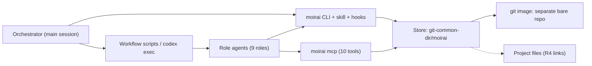

# 1. Что такое moirai: требования, приоритеты, принципы и границы

## 1.1 Что такое moirai и кому он служит

**Коротко.** moirai — это один статический бинарник на Rust. Он примерно за миллисекунду открывает небольшое хранилище, отображённое в память (memory-mapped), и даёт AI-агентам для программирования единый типизированный граф. В графе лежат задачи, подзадачи, блокеры, планы, правила, решения, находки (findings), вердикты и измерения: 13 видов узлов (`task`, `doc`, `note`, `rule`, `decision`, `question`, `finding`, `verdict`, `measurement`, `artifact`, `run`, `lane`, `area`). Граф версионируется собственной системой контроля версий moirai, устроенной по образцу git:

- DAG коммитов, адресуемый по содержимому (BLAKE3); каждый коммит — это типизированный набор изменений с before-image;
- полноценные ветки для любых данных;
- типизированное трёхстороннее слияние, при котором конфликты хранятся как данные;
- теги, reflog, undo и revert.

Хранилище можно сериализовать в детерминированный, читаемый человеком git-образ: один текстовый файл на узел и один git-коммит на коммит moirai или на чекпоинт. Образ можно и загрузить обратно. Для работы самой системы git при этом не нужен.

Агенты работают с moirai через три канала:

- CLI вместе со skill и хуками;
- MCP-сервер из десяти инструментов, для ролей без shell;
- бюджетированные контекст-паки, которые заменяют ваши написанные вручную брифы (HDR-блоки).

Узел может ссылаться на файл проекта и на место внутри файла: символ, заголовок, цитату. Такая ссылка переживает переименования, перемещения, правки и удаления, кто бы их ни сделал (R4). Любой вопрос агента, включая все команды чтения, — это запрос на собственном языке Lachesis (R5).

**Для кого.** Система строится под ваш агентный процесс BoykoEngine ([01], [02]):

- **Конвейер из девяти ролей.** `researcher → architect ⇄ architecture-critic → developer ⇄ code-reviewer → tester → results-analyst → doc-writer`, плюс `project-analyst` только для чтения. Им управляет один оркестратор (главная сессия), а с августа 2026 — ещё и Workflow-скрипты: 347 на диске и ≈ 11 запусков в день в сентябре, «измерено». У трёх из девяти ролей нет Bash, поэтому MCP обязателен.
- **Декомпозиция работы.** Кампании → фазы → линии (lanes; у каждой свой git worktree и своя ветка) → ступени (rungs) → раунды → находки. На момент исследования было 44 worktree и 107 локальных веток, «измерено».
- **Где сегодня живёт состояние.** В пяти не связанных между собой местах: журнал запусков харнесса, scratchpad сессий (до 7,8 ГБ на сессию), git, auto-memory (`MEMORY.md` и 254 тематических файла) и реестры в репозитории (один только `OPEN-QUESTIONS.md` — 68 452 слова). Главный класс сбоев — «устаревшая или неполная запись выглядит актуальной». Отзывы решений не доходят до сводок. Union-слияния возвращают `OPEN` на уже решённые пункты. Передаваемые данные молча обрезаются. Ссылки вида `file:line` гниют: на их починку понадобилась кампания из восьми проходов.
- **Машина.** Ноутбук (Ryzen 9 5900HS, 16 ГБ). При 16 резидентных агентских процессах свободно ≈ 1,8 ГБ, «измерено». В окнах бенчмарков действует правило тишины, поэтому moirai в простое не должен тратить CPU вообще.
- **Другие харнессы.** Ваши рабочие агенты работают и в Codex (GPT-5.6-Luna), поэтому система не может быть привязана к одному харнессу.

**Почему именно эта архитектура.** Все отчёты сходятся в выборе семейства движков. При хранении состояния как Merkle-дерева с копированием пути даже крошечный коммит стоит 4 KiB × глубину (≈ 52 КБ по замеру на DoltLite), а набор изменений стоит байты. Windows запрещает менять размер отображённых в память файлов, поэтому отображаются только неизменяемые файлы. Долговечный сброс (flush) на вашем NVMe занимает ≈ 2 мс, «измерено», поэтому сбросы объединяются в групповой коммит. Запуск процесса стоит 15–73 мс, «измерено», поэтому открытие за O(1) важнее микрооптимизаций.

Предложение D — единственное из четырёх, которое выполняет R1–R3. Критики поставили его первым по всем трём направлениям (7,5 / 7,0 / 7,0). Настоящий документ — это D, в котором закрыты все замечания критиков и аудитов.

**Пять главных рисков (AR §0) и как они закрываются:**

1. **Многопроцессный файловый протокол на Windows** (гонка сброса WAL в SQLite пряталась 16 лет; Beads потерял 7 из 8 подтверждённых закрытий). Читатели не читают дальше `committed_lsn`, перенос ref лежит внутри записи коммита. Симуляция модели сбоев с перебором точек краша, инъекции fsync и задержек блокировок и kill-циклы с 16 писателями гейтят M1 до того, как на нём что-то строится. Цикл падений ОС на реальном стенде (GT15) по вашему решению от 2026-09-27 (В7) отложен до после релиза, поэтому реальная потеря питания до тех пор — явный непроверенный остаточный риск (риск 17). `moirai backup`/`restore` (M1) и ежедневный экспорт образа `main` и каждой линии ограничивают цену падения ОС.
2. **Изоляция веток против процесса:** линии не видят правил и закрытий на `main`, если их никто не синхронизирует. Правила `~main` в каждом паке, уведомления `behind main` в каждом брифе и хуке, маркеры `settled`/`deleted`, гейт `sync --check`. Класс полей `shared` не строится (#1).
3. **Дрейф детерминизма образа** между форматами и хранилищами. В хешируемом содержимом нет локальных данных хранилища; побайтовые round-trip property-тесты; кодировщики сохраняются для каждой версии формата; экспортёр перечитывает то, что записал.
4. **Объём и время до первого использования** (≈ 369–508,5 units, релиз при P50 ≈ 50,5 недели). Порядок зависимостей со второй линией для листовых компонентов; все решения, измерения и эксперименты, формирующие замороженный формат, закрываются до выхода M0; эталонная модель — исполняемая спецификация; проверка на записанных данных вместо живой работы. Обе линии и все гейты делят один ноутбук (риск 40, см. §1.4 правило 4).
5. **Расползание семантики слияния.** Набор типов закрыт, правила слияния — данные схемы.

_Источники: AR §0 (в т.ч. «The biggest risks»), §2.12; [01 §0]; [02 §1, §9]_

## 1.2 Исходное ТЗ и требования R1–R5

**Исходный бриф.** Графовая БД с нуля на Rust, типизированные поля, версионирование как в git, подзадачи, блокеры, CLI/MCP/skills, синхронные ссылки («узел 40 удалён — все об этом знают»), максимальная производительность, минимум RAM, Windows 11.

Затем бриф дополнялся:

- **2026-09-25** — требования R1–R3. Они отменяют все прежние позиции. Модели «один общий ствол + разграничение по происхождению» ([04 §9.3], [08 §7.2], [A T3], [C T3]) и «координационная плоскость никогда не ветвится» ([B §3.1]) больше недопустимы.
- **2026-09-26** — R4 и R5, решения #32 (ОС), #43 (харнессы) и #44 (проверка кросс-таргетов).

| Требование | Что оно означает | Как выполняется | Где / когда |
|---|---|---|---|
| **R1** полное ветвление | Все версионируемые данные ветвятся: create/switch/list/delete/diff/log/merge; желательно также теги, revert, cherry-pick, reflog/undo | Собственный DAG коммитов; ветки `main`, `lane/*`, `plan/*`, `merge/*`, `tags/*`; HEAD у каждого клиента свой; ветвится всё: задачи, статусы, блокеры, правила, решения, схема. Типизированное слияние, конфликты как данные. В релизе есть `tag`, `undo`, `revert`, `cherry-pick`, `reflog`, `op log`/`op restore`; `rebase --onto` не строится (#5) | §5a; веха M3 |
| **R2** своя VCS без git | Ядро не зависит от git | Собственная объектная модель и собственное обнаружение хранилища (`--store`, `MOIRAI_DIR`, `.moirai`; внутри репозитория — `<git-common-dir>/moirai/`, общее для всех worktree). Ядро никогда не запускает `git` и не линкует git-библиотеку. Остаются четыре явных необязательных места запуска git: сетевой транспорт образа, обновление ref в reftable, `doctor lanes --refresh-graph`, `file mv --git` | §5c; линт GT20 (a) с M1, видимо пользователю с M8 |
| **R3** git-образ | Детерминированный git-совместимый образ, который сохраняется в git и загружается из него | Канонический текстовый `.moi` на узел с двухуровневым разбиением по `uid`. Трейлеры коммитов несут все хешируемые поля, поэтому id `Moirai-Commit` можно пересчитать. Собственный внутрипроцессный слой git-объектов (SHA-1 и SHA-256); git CLI служит только тестовым оракулом и сетевым транспортом. По умолчанию образ пишется в отдельный bare-репозиторий | §5b; M4 (слой объектов), M5 (образ) |
| **R4** файловые ссылки | Ссылки из узлов на файлы проекта и места в них переживают перемещения, переименования, правки и удаления | Ребро `at` к файловому узлу. Якоря — цитата + контекст + окно ±16 строк + область видимости, никогда не голый номер строки. Намерение ссылки версионируется, а её разрешение делается в каждом worktree отдельно и только во время работы. Явные `file mv`/`rm` плюс ленивая детерминированная перепривязка только по точным признакам. Нет watcher'а, нет процесса git; ≤ 3 мс на пак из 50 ссылок | §5e, [40]; M0 (FL-1), M2, M3, M5, M6, M7–M10; ≈ 68–93 units, «оценка» |
| **R5** свой язык запросов | Собственный язык запросов | Lachesis (LQ): похож на Cypher и допускает GQL. Производное состояние доступно как встроенные функции (`ready`, `unblocked`, `blockers()`, `link_state()`). Грамматика ревизий в стиле git/jj (`USE lane/x`, `main~5`). Защищённые записи `TX` (один блок = один коммит, `EXPECT`, `IF TIP`, `DRY`). Каждая команда чтения — именованный запрос, каждая команда записи — именованная мутация | §7.7, [50]; M0 (LQ-Bench), M7; ≈ 56–83 units, «оценка» |

Доказательная база R4, «измерено»:

- из 1 180 реальных цитат пара «цитата + контекст» разрешила 96,3 %, номера строк — 27,2 %;
- агенты сделали 148 «сырых» `mv` против 7 `git mv`.

Раньше язык запросов был отвергнут со ссылкой на ≈ 50 % точности Text2Cypher; позже выяснилось, что цифра процитирована неверно и относилась к другой задаче. Требование R5 это решение отменило. Защиту теперь дают встроенные функции, строгие ошибки схемы, именованные запросы и гейт LQ-Bench: ≥ 85 % с первой попытки, ≥ 95 % после одного повтора, 0 уверенно-неверных записей.

Главное последствие R1 такое. Всё, что есть в графе, ветвится, включая `status`/`done` и `blocks`. На уровне всего хранилища живёт только оперативная координация:

- аренды (lease) с fencing-токенами;
- маркеры `settled`/`deleted`: задача, закрытая или удалённая на неслитой ветке, больше не раздаётся ни из одной ветки;
- результаты идемпотентности и курсоры ленты изменений;
- аллокатор `#N`, привязки HEAD, пины и карта git-id.

**Куда пишется образ (R3).** Строится одно назначение — отдельный bare-репозиторий, которым владеет moirai (по умолчанию `<parent of the main worktree>/<project>-moirai.git`; ветки в `refs/heads/`, теги в `refs/tags/`). В нём на каждое экспортирующее хранилище есть нехешируемый служебный ref `refs/moirai/meta/<store-id>` с `meta.moi` и `aliases.moi`. Это имя одинаково во всех назначениях, и экспорт обновляет этот ref в той же транзакции `packed-refs`, что и остальные. Вариант `refs/moirai/*` в репозитории проекта не строится (§1 строка 5, T15, #41; имена зарезервированы).

> ✅ **Подтверждено вами 2026-09-27 (Б4 раздела 15):** все версионируемые данные ветвятся, включая `status`/`done` и `blocks`. «Общей плоскости координации» нет: между ветками действуют только маркеры `settled`/`deleted`, правила `~main` и представления `--across`. Класс полей `shared` не строится (#1). Решено 2026-09-26 (#1, принято по рекомендации вашим ответом «Всё остальное утверждаю, как вы написали»; действует с M0). Модель веток замораживается в формате на диске; после заморозки её изменение — это формат версии 2 с процедурой обновления RG10.

_Источники: AR binding inputs (стр. 63), §0 п. 3, 5, 11, 12, §1 строки 3–5, 16, 17, §2.11, §2.13, §5b.1 (AR:994), §5b.6 (AR:1106), §5b.8, §11 #1, #41; [40]; [50]_

## 1.3 Четыре приоритета владельца

Каждое решение вы оцениваете по четырём приоритетам: **скорость, минимум RAM, корректность, минимум токенов агента**. Первые два были в исходном брифе. Корректность и токены стали отдельными приоритетами 2026-09-26.

У каждого приоритета есть явный бюджет и гейт (тест или бенчмарк). Нормативный список — таблицы §8.3. Масштабы проверки: 1e4, 1e5, 1e6 узлов и ваш трёхлетний масштаб 0,3–0,5 M. Гейты вех M0–M11 проверяются только на Windows. Бюджет политики — это ключ config, контрактный бюджет — фиксированный тест.

Каждому приоритету был посвящён отдельный аудит ([70]–[73], плюс [74] по реализуемости). Все их блокеры и крупные замечания исправлены.

| Приоритет | Ключевые бюджеты (цели дизайна) | Обоснование | Гейт, с какой вехи |
|---|---|---|---|
| **Скорость** | Время движка ≤ 5 мс на команду при 1e5 на `main`. Открытие ≤ 1,5 мс при 1e5 и ≤ 3 мс при 1e6. `get` за 1–5 мкс. Долговечный коммит ≈ 2 мс p50 (один сброс только данных), удержание байта писателя ≤ 5 мс p99. Первое чтение 14-дневной линии, которая синхронизируется с `main` ежедневно (при каждом `SubagentStart`), ≤ 10 мс (фикстура daily-sync); для ветки, отколотой 1k / 7k / 14k / 60k коммитов назад, — ≤ 3 / 10 / 10 / 20 мс. Слияние линии в 2k операций ≤ 50 мс при 1e5. MCP-вызовы идут в уже запущенный сервер. Хуки работают без запуска процесса только как обработчики `mcp_tool`, пока MCP-сервер сессии подключён (появляется в M10; `hooks.transport = auto` — `mcp_tool` в Claude Code и Codex). Иначе это командные хуки, + 25–73 мс p50 на запуск; M9 сертифицирует только командный транспорт, в остальных харнессах — только он | open+map 0,22 мс, flush 1,73–2,0 мс p50, «измерено». Запуск процесса доминирует в пути CLI, поэтому главный рычаг — открытие за O(1) | GT11 с M1 |
| **Минимум RAM** | ≤ 4 МБ private RSS на процесс CLI или хука. MCP-сервер: ≤ 8 МБ + `mcp.overlay-bytes` (4 MiB) в установившемся режиме, пик ≤ 16 МБ. ≤ 256 МБ на все процессы moirai при 16 сессиях. Слияние линии в 2k операций и синхронизация линии, отставшей от `main` на 14 дней, — ≤ 8 МБ каждая. Горячий индекс ≈ 99 Б/узел (9,9 МБ при 1e5), «оценка». Данные лежат в общих read-only страницах памяти, пулов буферов на процесс нет | Свободно 1,8 ГБ при 16 агентах, «измерено». Демону с графом в RAM понадобилось бы 100–300 МБ при 1e5, «оценка» | GT11 с M1; суммарная проба M10; GT14 M11 |
| **Корректность** | Протокол защиты от сбоев заложен в формат: сброшенные группы принимаются целиком или никак; `durable_lsn`; двухслотовый барьер `HEAD`; подтверждение группового коммита только по идентичности. Эталонная модель на Rust — дифференциальный оракул: её пишут первой, пишет отдельный автор, таблицы правил подписываете вы. У каждого инварианта есть точка контроля, функция модели и гейт. Каталог гейтов GT1–GT20 | Beads потерял 7 из 8 подтверждённых закрытий под агентской нагрузкой. Гонка при сбросе WAL в SQLite пряталась 16 лет | GT1, GT3, GT4 с M1 (GT15 отложен до после релиза, В7); GT2, GT6, GT18 (модель с M0); GT10, GT16 с M0; GT14 (72-часовой soak) M11 |
| **Минимум токенов** | Контекст-паки бюджетируются по ролям в байтах UTF-8 (ASCII — 1, кириллица — 2), с квотами по классам и правилом «сначала деградировать, потом отбрасывать». Вывод начинается с id; число отброшенных записей стоит в первой и последней строке. Все MCP-схемы отложены (deferred), инструкции сервера ≤ 512 символов. Блок в `AGENTS.md` ≤ 600 Б. Skills: `moirai` ≤ 800 токенов, `moirai-orchestrate` ≤ 2 000 токенов, карточка `moirai-ql` ≤ 1 000 токенов. Бриф `SessionStart` ≤ 8 000 Б. Результаты работников забираются из файлов и никогда не перепечатываются | По подсчёту аудита [73], сессии на HDR-брифах при прежних умолчаниях — ≈ 380–434k токенов | GT19 (журнал токенов) M9/M11; GT12 M8–M10; GT13 (карточка) M0 |

_Источники: AR §1 строки 12, 13, 18, 19; §2.9; §8.3 (преамбула, строки SPEED, RAM и TOKENS); §9 (M9, M10); §13 (`hooks.transport`); §0 «Why this design»_

## 1.4 Обязательные правила (binding rules)

Это рамки, а не варианты выбора. Большинство из них вы уже приняли решениями от 2026-09-26. Ваши слова ниже приведены в обратном переводе с английского текста AR.

**1. Собственный движок с нуля на Rust.**

- *Пишется вручную:* формат на диске, журнал, сегменты, протокол HEAD/LOCK, оверлей, колоночный граф с CSR, Pearce–Kelly, движок слияния, diff3, кодек `.moi`, CLI, паки; резолвер и сканеры R4 (Rust, Markdown, TOML); весь конвейер LQ — без генератора парсеров и без regex.
- *Разрешённые листовые крейты (все pure-Rust):* `zerocopy`, `blake3` (feature `pure`), `xxhash-rust`, pure-Rust кодек (выбирается в M0), `windows-sys`/`libc`, `serde_json`; `sha1`/`sha2` (без `asm`) в слое git-объектов и модуле `files`; deflate для слоя git-объектов — `zlib-rs` или `miniz_oxide` (выбирает измерение M0). `rmcp` (`default-features = false`, только features `server` и `transport-io`: без HTTP-транспорта и без TLS) + `tokio` (`current_thread`) допускаются только в `moirai mcp` и только если проба M0 покажет ≤ базы + 2 МБ и ≤ 2 потоков ОС. Иначе пишется синхронный цикл JSON-RPC.
- *Только для разработки:* крейт property-тестирования, `hyperfine`, tree-sitter-rust как тестовый оракул сканера Rust в host-only крейте вне проверяемого набора GT20 (e). Лицензии всех зависимостей должны быть совместимы с Apache-2.0 (правило 10).
- *Исключены:* `gix`/`git2`, `petgraph`, `roaring`, `fst`, `tantivy`, tree-sitter (#22), крейт `regex`, асинхронный рантайм в ядре.
- *Почему отвергнуты альтернативы:* у `gix` в продукте не реализован push и не доведён паритет SHA-256/reftable. `git fast-import` в роли бэкенда сделал бы git зависимостью R3 во время работы и оставил бы 74 мс на запуск git («измерено») в каждом некешированном `check`/`stale`.

**2. Никаких сторонних БД — нигде.** SQLite, redb, LMDB/heed, fjall, sled, RocksDB, Turso не используются ни в продукте, ни как временный бэкенд или ступенька, ни как тестовый оракул, ни как бенчмарк или ориентир, ни в дереве, ни вне его. Ваши слова: «Нет, не используем SQLite — сразу делаем свой [движок]».

- Оракул — собственная эталонная модель на Rust.
- Производительность оценивается только по абсолютным бюджетам §8.1/§8.3 и физическим нижним границам, измеренным в M0.
- Правило обеспечивает линт зависимостей GT20 (b): он проверяет каждый `Cargo.lock` проекта, начиная с M0.
- Отвергнут вариант «сначала оракул на одноразовом SQLite за трейтом движка».

**3. Строить один раз, сразу по финальной спецификации, в порядке зависимостей.** Ваши слова: «“Чтобы можно было начать пользоваться как можно раньше” — не важно, надо сразу делать правильно».

- Нет промежуточных стадий, временных режимов, ограничений на число узлов и ослабленных гарантий.
- Ни одна веха не упорядочена по времени до начала использования.
- Веха меняет уже сертифицированную веху только через точки расширения, сертифицированные раньше: реестр секций M1, таблицы валидаторов и правил слияния M2–M3, реестры встроенных функций и именованных запросов M7.
- Порядок вех: **M0** контракт и доказательства (формат v1 заморожен), **M1** движок хранения, **M2** графовое ядро, **M3** VCS (R1), **M4** слой git-объектов, **M5** git-образ (R3), **M6** рантайм файловых ссылок (R4), **M7** язык запросов (R5), **M8** CLI, **M9** агентский интерфейс, **M10** MCP, **M11** финальное усиление.
- Отвергнуты: черновик «движок сначала, ради раннего использования» (стадия с сериализованным доступом и лимитом узлов); R4 как одна поздняя веха (пришлось бы менять пять сертифицированных).
- Если бюджет недостижим, меняется дизайн. Объём работ не урезается ради даты без вашего решения в §11.

**4. Никакого использования до гейта релиза.** Ваш процесс начинает пользоваться moirai только после гейта «complete and hardened». Переход делается один раз, на границе кампаний (#40), после репетиции на копии; день перехода вы назначаете сами. Откат удаляет хуки и регистрацию MCP-сервера; из старого процесса ничего не удаляется. До релиза проверка идёт на записанных данных, а не в живой работе.

- Объём: ≈ 369–508,5 units (P50 ≈ 439), «оценка». Units — единицы трудоёмкости [22 §7.1]; скорость 5–8 units в неделю ещё не измерена.
- Календарь (две линии на ноутбуке, профиль L; переиздан 2026-09-27 без стенда OS-crash, отложенного по В7): релиз через 35–75 недель, P50 ≈ 50,5, P90 ≈ 60,5, «оценка».
- В календарь не входят: лидер (+ 3–4 units в M1, если его потребуют измерения M0), собственный кодировщик формата zstd (+ 5–8 units в линии B, если его выберет пункт 6 M0) и пункты #45, строящиеся по запросу.
- Если две линии не поместятся, одна линия даёт релиз через 51–110,5 недели, P50 ≈ 74,5, P90 ≈ 89,5.
- **Ваше время (профиль L, #34).** Все гейты времени, RAM, нижних границ, сбоев и kill-циклов идут только на вашем ноутбуке. От выхода M1 до релиза им нужно ≈ 5 ночей в неделю без агентов (≈ 145–195 ночей, P50 ≈ 165). Каждая итерация кандидата в релиз требует 3 дня заморозки агентов под 72-часовой soak; 14 последовательных успешных ночных прогонов RG3 идут в обычных окнах без агентов (2,5–3,5 недели). Обе линии собираются только в согласованные с вами окна, никогда рядом с кампанией из 16 агентов и не в окнах бенчмарков, под одним машинным семафором сборки (риск 40). Если пункт 21 M0 покажет, что две линии не помещаются даже в эти окна, линия B встаёт на паузу и действует календарь одной линии. Это главная повторяющаяся просьба к вам.
- **Ваша работа на переходе.** До `links import` вы просматриваете список неоднозначных цитат (#23). По каждому импортированному правилу, текст которого ещё есть в `CLAUDE.md` или файле роли, вы решаете, заменить ли текст на id правила, чтобы правило не внедрялось дважды (#15, [73 F5]).
- Календарь переиздаётся на выходах M0 и M1. Планировать стоит по P90.

**5. Windows реализуется первой, Linux и macOS проектируются сразу (#32).** Ваши слова: «Учти, что система должна работать под macOS и Linux тоже… пока не собирай бинарники под Linux и Mac… не тестируем — нет возможности».

- Один формат на диске и одна семантика протокола; всё это замораживается в M0 (X-F1–X-F12).
- Различия ОС живут только в слое `moirai-os`. Это проверяет линт GT20 (d) с M1.
- Сборка, CI, тесты и краш-гейты в M0–M11 — только на Windows.
- Минимальные версии: Windows 11 x64; Linux ≥ 5.10, 64 бит, static musl; macOS ≥ 14, arm64.
- **Размещение хранилища.** Хранилище отказывается работать на сетевых ФС, FUSE/virtiofs, 9p/WSL `/mnt`, tmpfs, overlayfs, `\\wsl$` и в облачных папках. Репозиторий, в котором лежит хранилище, должен оставаться на NTFS: ReFS (Dev Drive) отклоняется, пока нет краш-гейта для ReFS (#15).
- **Принятый риск (риск 29).** Поведение Linux и macOS, на котором стоит замороженный формат, только задокументировано или выведено, но не измерено. Если порт найдёт поведение ОС, которое требует изменить формат или протокол, M0 открывается заново.
- Порт — отдельная фаза, задокументированная, но не запланированная; релиз она не блокирует. Её объём ≈ 52–83 units (≈ 6,5–16,5 недели при одной линии), «оценка», и она зависит от решения #42 об оборудовании (например, Mac mini ≈ $599 как self-hosted runner). В ту же фазу после релиза по вашему решению от 2026-09-27 (В7) перенесён стенд OS-crash для Windows: «Пока нет возможности это установить, настолько глубокий тест откладываем до релиза, так же как и mac с linux».

**6. Только pure-Rust зависимости и `cargo check` для чужих таргетов (#44).**

- GT20 (e): `cargo check --workspace --all-targets --locked` для `x86_64-unknown-linux-musl`, `aarch64-unknown-linux-musl` и `aarch64-apple-darwin`. C, C++ и ассемблер для этих таргетов «отравлены». Гейт действует с M0 в локальном pre-merge и в PR CI. Бинарник не собирается, тесты не запускаются.
- Бинарный крейт — только композиционный корень (≤ 200 строк).
- Следствия: `zstd` уходит; кодек выбирается в M0 из pure-Rust вариантов (ожидаются `lz4_flex` для тел и `ruzstd` для истории); собственный кодировщик zstd-словарей — только если его потребует бюджет, это + 5–8 units; нет C-аллокатора. tree-sitter допускается лишь как тестовый оракул в host-only крейте.

**7. Независимость от харнесса (#43).** Контракт C0 не требует от харнесса ничего, кроме shell или stdio MCP. В него входят:

- CLI в `PATH`;
- stdio MCP-сервер для обеих эпох протокола, с текстовыми результатами и явными параметрами;
- блок ≤ 600 Б в начале `AGENTS.md`;
- переносимый skill.

Claude Code и Codex — оптимизированные цели Tier A (Codex — через плагин и диспетчеризацию `codex exec`). Остальные харнессы получают только общий рендеринг C0 (`moirai integrate generic`), без шаблонов хуков: Tier B не строится (#45, см. §1.6). Каждый хук — ускоритель с определённым запасным путём. Права на запись дают только предъявленные аренды (lease), выданные сервером, — в том числе оркестратору. LQ-Bench пока проводится только на Opus 5.5 (#38 (a)), поэтому Codex пишет LQ под профилем `unknown`: только именованные мутации.

**8. Операционная политика — это config, а не вопрос владельцу.** Решение владельца нужно только там, где ответ потом не сможет поменять никакой ключ config: формат на диске, модель веток, семантика слияния, схемы идентичности, замороженная поверхность запросов, граница кода и объём работ, деньги и оборудование, данные, покидающие машину, согласие на запись вашей активности (#35), график вашего процесса (#40).

Всё остальное — ключи из §13 с умолчаниями, которые вы меняете в любой момент: хуки, TTL аренд, бюджеты, классы долговечности, назначение образа, окна хранения, строгость слияния и так далее.

- Синтаксис в стиле git-config, две области (store и user), приоритет «флаг > переменная окружения > файл > умолчание», типизированный реестр, классы перезагрузки hot/restart/init/install.
- В M0 замораживаются синтаксис, приоритет, правило неизвестных ключей, формат реестра и `HEAD.config_gen`, но не сам набор ключей.
- 25 бывших вопросов владельцу стали ключами или строками policy-data. Эталонная модель и тесты реализуют каждое допустимое значение каждого ключа.

**9. Публичный репозиторий, без AI-соавторов (#36, #37).**

- Репозиторий `github.com/bluesteelll/moirai`. Каждый коммит — от вашего имени: ни трейлера `Co-Authored-By:` с Claude или другим AI, ни строки «Generated with Claude Code» в PR.
- Агенты коммитят и пушат только по вашей просьбе; `--force` и `--no-verify` — только с вашего явного разрешения (AGENTS.md).
- Проверку `commit-msg` в локальном pre-merge гейте и в PR CI ставит пункт 7 вехи M0 ([60 §3.1]). Первый коммит `d684d98` уже опубликован (`origin/master`), трейлера AI-соавтора нет ни в нём, ни в следующих коммитах `47e704f` и `80d9dcf` (проверено 2026-09-27). Опубликованное дерево вы просмотрели и 2026-09-27 признали приемлемым (А3). Атрибуция выключена в закоммиченной конфигурации харнесса `.claude/settings.json` (одобрено 2026-09-27, А2). Дальше вы проверяете каждое сообщение коммита, пока пункт 7 M0 не установит проверку `commit-msg`.
- Hosted CI делает только синтетическое: сборку, линты, проверку типов и наборы тестов. Никаких гейтов на время, RAM или сбои; ключа API модели нет ни в CI, ни вообще (В1).
- Данные, полученные от вас (корпуса R4, реальные промпты LQ-Bench, инциденты реестров, записанные HDR, профиль нагрузки, содержимое памяти), никогда не попадают ни в репозиторий, ни в CI. Они будут лежать в gitignored-каталоге `/private/` (уже в `.gitignore`). Pre-commit проверку, которая отклоняет пути этого каталога и файлы по хешам из манифеста, ставит пункт 7 вехи M0. До этого защищают только `.gitignore` и ваша проверка.
- **Данные, покидающие машину, — LQ-Bench (#38 (a), В1).** Ваше решение от 2026-09-27: «Не буду покупать по api доступен только claude code по подписке». API-биллинга и API-ключа нет. Бенчмарк идёт через вашу подписку Claude Code в headless-режиме (`claude -p`) на ноутбуке; в M0 это ≈ 53 M токенов квоты (в основном кэшированный вход) плюс ≈ 1 M на повтор выборки, разнесённых на несколько окон внутри M0 в пределах недельных лимитов. Эта оценка ещё не учитывает накладные расходы самого Claude Code (его системный промпт и определения инструментов в каждом вызове): их измеряет первое окно M0, после чего план квоты перевыпускается. ≈ 30 промптов из ваших реальных сессий отправляются в Anthropic (и только туда, через Claude Code); остальные фикстуры синтетические. В репозиторий и CI промпты не попадают, но машину покидают.
- Секреты не коммитятся никогда.

> ✅ **Решено вами 2026-09-27 (А2, А3 раздела 15):** конфигурация харнесса с выключенной атрибуцией закоммичена в репозиторий (`.claude/settings.json`), как требует AR:63; до установки `commit-msg`-проверки пунктом 7 [60 §3.1] вы просматриваете каждое сообщение коммита. Опубликованное в `github.com/bluesteelll/moirai` вы просмотрели и признали приемлемым. AR:63, риск 41 и [60]:363 приведены к этим ответам.

**10. Лицензия.** Apache-2.0, copyright Mark Boyko (`LICENSE`, `NOTICE` в корне; `NOTICE` не трогать). Каждая зависимость должна иметь совместимую лицензию: MIT, Apache-2.0, BSD, ISC, Zlib и подобные.

**11. Прочее.**

- Все агенты, которые строят moirai (дизайн, реализация, ревью), работают на Opus. Это правило не касается моделей ваших рабочих агентов в других харнессах.
- Артефакты репозитория пишутся на английском.

> ✅ **Подтверждено вами 2026-09-27 (Б1 раздела 15):** запрет сторонних БД абсолютный: SQLite и аналоги не используются даже как тестовый оракул или ориентир в бенчмарке. Сравнения «moirai против SQLite/redb» не будет никогда. О скорости судят только по абсолютным бюджетам §8.3 и физическим нижним границам, измеренным в M0.

> ✅ **Подтверждено вами 2026-09-27 (Б2 раздела 15):** до релизного гейта moirai не используется, и календарь принят. Релиз ожидается через 35–75 недель (P50 ≈ 50,5, P90 ≈ 60,5), «оценка»; при одной линии — 51–110,5 недели (P50 ≈ 74,5, P90 ≈ 89,5). Скорость в units не измерена, календарь переиздаётся на выходах M0/M1, планирование — по P90. До релиза ваш процесс остаётся на нынешних файлах и реестрах. Окна машины (окна сборки для двух линий, ≈ 5 ночей в неделю без агентов от выхода M1 до релиза, ≈ 145–195 ночей, и 3 дня заморозки агентов на каждую итерацию кандидата в релиз) остаются ресурсом В4, на который ответа ещё нет.

> ✅ **Подтверждено вами 2026-09-27 (Б12 раздела 15):** реализация и все гейты в M0–M11 делаются только на Windows. Формат и протокол замораживаются в M0 сразу для трёх ОС (X-F1–X-F12), без проверки на Linux и macOS до незапланированной фазы порта. Вы принимаете риск 29: если порт найдёт поведение ОС, требующее изменить формат или протокол, M0 открывается заново. Фаза порта ≈ 52–83 units (≈ 6,5–16,5 недели одной линией) и зависит от оборудования #42 (например, Mac mini ≈ $599). Правило pure-Rust исключает C-библиотеки: кодек выбирается из pure-Rust вариантов, а собственный zstd-кодировщик, если понадобится, добавит + 5–8 units.

> ✅ **Решено вами 2026-09-27 (В1 раздела 15):** «Не буду покупать по api доступен только claude code по подписке». LQ-Bench по-прежнему только на Opus 5.5 (#38 (a), 2026-09-26: «Пока бенчмарки только на Opus 5.5»), но идёт через вашу подписку Claude Code в headless-режиме, без API-ключа; цена — квота подписки (≈ 53 M токенов в M0 до накладных расходов самого Claude Code, которые измеряет первое окно M0), а не деньги. ≈ 30 промптов из ваших реальных сессий уходят только в Anthropic.

_Источники: AR binding inputs (стр. 63), §0 п. 9 и «The biggest risks» (4), §1 строка 14, §2.9, §2.10, §2.13, §8.3 TOKENS («LQ-Bench model calls»), §9 (Calendar, Machine capacity, Release gate, Cutover), §10 (риски 20, 29, 40, 41), §11 (#2, #15, #23, #32, #34, #36, #37, #38, #40, #42, #43, #44, #45 и правило «What is an owner decision»), §13 (преамбула), §14 (фаза порта); AGENTS.md (Git, Data); `.gitignore`; `git rev-parse origin/master`; [60 §3.1] item 7; [73 F5]; [90 §0]_

## 1.5 Трассировка требований (сжато)

Полная таблица — AR §1: в ней 20 строк с доказательствами и строками бюджетов. Ниже — сжатая версия: требование → раздел → вехи.

| # | Требование | Раздел AR | Строится | Гейты (обязательны с вехи) |
|---|---|---|---|---|
| 1 | Графовая БД с нуля на Rust | §2.10, §4 | M0–M11 | GT20 b, e (M0); GT20 a (M1); GT16 (M0) |
| 2 | Типизированные поля, в т.ч. `done` (виртуальное типизированное поле: вычисляется из `status` и отдельно не хранится; запись `done=true` выполняет защищённый переход статуса) | §3 | M2 | GT2, GT6 (M2); GT18 «команда = именованная мутация» (M7) |
| 3 | R1: ветки и слияние | §5a, §2.3 | M3 | GT4, GT6, GT10, GT18 (M3) |
| 4 | R2: своя VCS без git | §5c, §2.14 | M1–M8 | GT20 a (M1; места вызовов в M4–M8), GT20 c «git отсутствует» (M4, M8); GT7 (M4) |
| 5 | R3: git-образ | §5b, §2.15 | M4, M5 | GT7 (M4, M5); GT8, гейты образа 0–3 (M5); оракул GT15 с `git fsck` (после релиза, В7) |
| 6 | Подзадачи (ребро `parent`, глубина ≤ 12, rollup-счётчики) | §3 | M2 | GT6, GT2 (M2) |
| 7 | Блокеры (`blocks`, ацикличность Pearce–Kelly, хранимый битсет `unblocked`, `ready` при чтении) | §3 | M2 | GT6 I5′, GT2 (M2); GT10 (модель M0, M2) |
| 8 | CLI (коды выхода 0–10, id первыми, `--branch`/`--lease`) | §7.1 | M8 | GT12, GT4 через бинарник, GT5 (M8) |
| 9 | MCP-сервер (10 инструментов) | §7.2–7.3 | M10 | GT12, GT4, GT13 через MCP (M10) |
| 10 | Интеграция с харнессами (skills, хуки, диспетчер) | §7.3–7.5, §7.8 | M9, M10 | GT12, GT19 (M9, M10); воспроизведение кампании GT19 (M11) |
| 11 | Синхронные ссылки / «узел 40» | §5d, §6 | M1–M3 | свежесть чтения после сбоя (M1); GT10 (модель M0, M2 — одна ветка, M3 — между ветками); GT18 I26′ (M3) |
| 12 | Максимальная производительность | §8.3 SPEED | с M1 | GT11 по каждой строке (с M1) |
| 13 | Минимум RAM | §8.3 RAM | с M1 | GT11 (с M1); суммарная проба (M10); GT14 (M11) |
| 14 | Windows, Linux, macOS | §14, [80] | спецификация M0, Windows M1–M11; порт позже | GT1, GT4 (M1); GT20 d (M1); GT20 e (M0); GT15 и гейты порта — после релиза |
| 15 | Ваш мультиагентный процесс | §7.6 | M9, M11 | GT10, сквозной сценарий (M9); GT19, RG8 (M11) |
| 16 | R4: файловые ссылки | §5e, [40] | M0 (FL-1), M2, M3, M5, M6, M7–M10 | реплей-корпуса FL-1 (M0); GT17, GT2 (M6); GT17 через бинарник (M8) |
| 17 | R5: язык запросов | §7.7, [50] | M0 (LQ-Bench), M7, M8–M10 | GT13 (M0); GT2, GT9, GT18 (M7) |
| 18 | Корректность | §3.4, §4.2–4.5, §8.2, §8.3 | M0–M11 | GT1, GT3, GT4 (M1); GT2, GT6, GT18 (модель M0, M1–M8); GT10, GT16 (с M0); GT14 (M11); GT15 — после релиза (В7) |
| 19 | Минимум токенов | §7.4, §8.3 TOKENS | M9–M11 | GT19 (M9, M11); GT12 (M8–M10); GT13, карточка (M0) |
| 20 | Работа в Codex и других харнессах | §7.8, [90] | M0, M8–M11 | GT13 на Opus 5.5 (M0); GT20 e, b (M0); GT18 (M2, M8); GT12 (M8–M10); GT19 (M9–M11) |

_Источники: AR §1; §8.3 (каталог гейтов)_

## 1.6 Что сознательно не строится (анти-требования)

Полный список из AR §12:

| Не строится | Почему (одной строкой) |
|---|---|
| Отдельно управляемый демон или автозапускаемый сервер | Типичный источник сбоев в аналогах. Запуск CLI всё равно платный. Жизненный цикл, рассинхрон версий, убийства через job object |
| Любая фоновая активность: опрос, file watcher, таймеры, плановое уплотнение, телеметрия, сетевые вызовы | Правило тишины; `ReadDirectoryChangesW` теряет события. Обслуживание запускается только командой, превысившей порог, и в тихом режиме не работает |
| CoW B+-дерево / prolly-дерево / Merkle-состояние для текущего состояния | 4 KiB × глубину на крошечный коммит; сложнее всего строить; RAM растёт вместе с историей |
| Сторонняя встраиваемая БД (SQLite, redb, LMDB/heed, fjall, sled, RocksDB, Turso) где угодно | Ваше решение от 2026-09-26. Оракул — эталонная модель. Обеспечивает GT20 (b) |
| Промежуточные стадии, временные режимы, лимиты узлов, «полезные первые срезы» | Решение §2.13: каждый компонент строится один раз, по финальной спецификации |
| Git как движок (объекты в ODB проекта как живое хранилище, JSONL в рабочем дереве как источник истины) | Worktree расходятся; merge-драйверы не клонируются, GitHub их игнорирует; Defender бьёт по loose-объектам; Beads от этого пути отказался |
| Автоматические ветки moirai вслед за ветками и worktree git | Неустойчивая идентичность веток (44 worktree, detached HEAD, `wf_*`); молчаливая смена контекста; операции git не отображаются на слияния БД |
| Общая «координационная плоскость» без ветвления или знания с разграничением по происхождению вместо веток | Отменено требованием R1 |
| CRDT-ядро | Слияния, которые никогда не падают, прячут конфликты; документ целиком в памяти; нет защиты от циклов DAG |
| Мягкое удаление как статус | Протекает в каждый фильтр; в версионируемом хранилище не нужно |
| Иерархические id или id с префиксом вида; UUID, показанные агентам | Путают позицию с идентичностью; UUID стоит 24 токена |
| Возможности сверх LQ v1: рекурсивные правила, процедуры и UDF, regex, постоянные запросы, valid time, скрипты, VCS-ритуалы как операторы, `MERGE`/`DETACH DELETE`, очистка истории, значения путей, `SKIP`/`OFFSET`, SQL, соответствие ISO GQL, запросы между хранилищами | Каждая продукция v1 остаётся навсегда. Постоянным запросам нужен демон. `DETACH` молча снимает блокировку с зависимых. Число путей взрывается. Для каждой возможности есть альтернатива в LQ (E004) |
| File watcher, id внутри кода, NTFS object ID и ADS, переписывание упоминаний путей в файлах, удержание файлов проекта открытыми, автогидратация облачных заглушек (R4) | Watcher'ы теряют события; агентские правки уничтожают object ID; переписывание упоминаний даёт длинный хвост ошибочных правок; moirai не трогает ваши файлы |
| Процесс git на путях R4 (кроме явного `file mv --git`); запасной путь через запуск git для предков и переименований; tree-sitter или любой C-парсер в продукте | Запуск стоит 130–750 мс при бюджете `SessionStart` 150 мс и был бы промежуточной стадией. tree-sitter падает на 23,9 % вашего HLSL (#22) |
| Перепривязка ссылки только по равному содержимому, вывод удаления из отсутствия, перепривязка в игнорируемый вывод, Корзину или чужой репозиторий | Неверная ссылка хуже сломанной (DR1); отсутствие файла — не намерение |
| Эмбеддинги или векторный индекс в ядре; `tantivy` | RAM модели доминирует; для траекторий агентов это потеря информации; много файлов |
| Хранение транскриптов, журналов, содержимого scratchpad, артефактов сборки, индексов символов кода, запуска гейтов | ГБ на сессию; этим владеют харнесс, LSP и graphify |
| Переписывание сохранённых фактов силами LLM (сводки вместо источников) | 7 из 13 починок гниения документации записали новую ложь; сводки переживают отзывы |
| Текстовые union-слияния записей с полномочиями; числа без происхождения; одна растущая запись на кампанию | Ваши реальные инциденты |
| Применение политик через блокировку вызовов инструментов | Существующие хуки намеренно ничего не блокируют: moirai отвечает на запросы, решают хуки |
| Вид узла `lease`; `pack` как запись; 28 видов узлов; бюджеты `chars/3.5`; разбор `#N` без правила сигила | Отвергнуто критикой [22]. Аренды тратили бы `#N` (≈ 40k в год); запись в `pack` плодит сирот; 28 видов не выучить по skill; `chars/3.5` неверно для кириллицы; без сигила появляются ложные рёбра-упоминания |
| Автомиграция формата при открытии | В аналогах пользователи застревали; читатели отказываются открывать более новый формат; `migrate` — явная команда |
| Импорт из Beads, синхронизация с GitHub/Linear, HTTP MCP, UI для человека | Вашему процессу в v1 не нужно. Любой живой харнесс умеет запускать stdio MCP и CLI, поэтому HTTP MCP исключён (#41, #43) |
| Хук, плагин, переменная харнесса, ключ `_meta` или журнал Workflow как зависимость корректности или источник прав; список инструментов под конкретный харнесс; `structuredContent` как единственная копия результата; зависимость на C, C++ или ассемблере | #43, #44: у каждого ускорителя есть запасной путь; права дают только аренды; `tools/list` одинаков для всех; три харнесса доставляют `structuredContent` тремя несовместимыми способами; каждая зависимость должна проходить проверку типов для Linux и macOS без кросс-C-тулчейна |
| Хранение секретов или вашей переписки | Не нужно; содержимое, похожее на учётные данные, отклоняется при записи |
| Более слабая гарантия на какой-либо ОС: класс ниже `durable` (`F_BARRIERFSYNC`, обычный `fsync` macOS, откат при `ENOTSUP`), путь direct I/O, требующий выровненного формата, живость по PID, `fcntl`/`flock`-блокировки процесса, абстрактные Unix-сокеты, непроверенная ФС, хранилище, разделяемое ядрами (WSL2 `/mnt/*`, `\\wsl$`, virtiofs), приватные интерфейсы ОС, от которых зависит корректность | Каждый из этих вариантов молча ослабляет гарантию на одной из ОС |

**Также не строится по решению** (§2.13, §9, #1, #5, #11, #17, #18, #30, #33, #41, #45). Пункты #41 можно добавить позже вашим решением «build»: резервы формата для них сохранены. Для E2 (`files.journal`), подсказки при перемещении (`files.hooks.nudge`), дельты `PostToolBatch` (`hooks.post-tool-batch.delta`) и дополнительных назначений образа (`image.dest.<name>.kind`) названы будущие ключи config и оценки (E2 ≈ 1–2 units; подсказка, дельта и второе назначение ≈ 1–3,5 вместе). Для HTTP MCP и записи reftable есть только оценки (≈ 1–2 units каждая). Для сетевого транспорта без git не указано ни то, ни другое. Класс `shared` — только через формат версии 2.

- `rebase --onto`;
- назначения образа tracked-directory и orphan-branch;
- лидер и `watch` — если только измерения M0 не потребуют лидера;
- класс полей `shared`;
- HTTP MCP, запись reftable, сетевой транспорт без git;
- живые писатели с разных машин;
- стирание истории: вместо него отзыв и ротация; тела можно удалить по хешу без изменения id коммитов; `gc --squash-before` не строится (#33);
- представления между проектами: одно хранилище на репозиторий (#17);
- зеркалирование нативных Tasks Claude Code: они игнорируются (#18);
- история аренд: не хранится, `history()` показывает коммиты claim и complete (#30);
- объём харнессов сверх C0 (#45, ничего не строится): шаблоны command-хуков Tier B для Copilot, Cursor, Gemini CLI, Kiro и Goose; Codex cloud; обёртка `moirai dispatch --engine …` (остаётся документированным рецептом); `integrate package` и форматы `cursor`/`copilot`/`kiro` для `export rules`; адаптер `codex-csv` и `moirai mcp --structured`. Пункты (a), (d), (e) можно заказать позже, не раньше M9, со своими units. Другие харнессы, кроме Claude Code и Codex, получают только общий рендеринг C0;
- реализации Linux и macOS — в фазе порта.

Отдельно, с измеряемым триггером пересмотра:

- доказательства из USN-журнала для R4 (E2);
- `PreToolUse`-подсказка при перемещении;
- хук дельты `PostToolBatch`;
- назначение `refs/moirai/*` в репозитории проекта.

> ✅ **Подтверждено вами 2026-09-27 (Б4, Б11 раздела 15):** этот список — граница v1. Особенно важны пункты: нет демона и фоновой активности; нет эмбеддингов и векторного поиска; нет UI, HTTP MCP и синхронизации с GitHub/Linear; нет автомиграции формата; нет LLM-переписывания фактов; нет стирания истории (#33); исключения #41 действуют со своими триггерами; сверх C0 для харнессов ничего не строится (#45). Решено 2026-09-26 (#1, #33, #41 приняты по рекомендации вашим ответом «Всё остальное утверждаю, как вы написали»; #45 подтверждён тогда же). #1 и #33 действуют с M0, и класс `shared` после заморозки формата — это изменение формата версии 2 с процедурой RG10. Пункты #41 и #45 можно добавить и позже без ломки формата (резервы сохранены), каждый своим решением и своими units.

_Источники: AR §12, §2.13, §9 «Not built, by decision», §11 (#1, #5, #11, #17, #18, #30, #33, #41, #45); [22 §2]_
