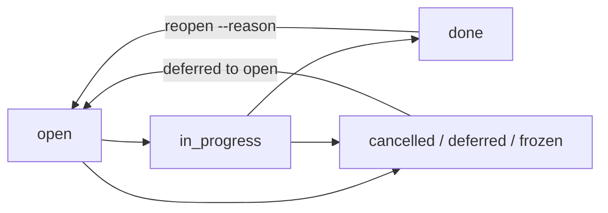

# 3. Модель данных: узлы, рёбра, инварианты, производное состояние

## Обзор: что это и где строится

Модель данных moirai — типизированный граф свойств. В нём 13 видов узлов (у каждого фиксированный 60-байтовый заголовок и блок типизированных полей) и 25 видов бинарных типизированных рёбер двух классов — структурные и исторические. Схема хранится как данные, поэтому версионируется вместе с графом. Всё, что составляет знание (узлы, поля, статусы, рёбра, тела, схема, значения конфликтов), версионируется по веткам. То, что описывает «кто что делает сейчас» (аренды, маркеры `settled`/`deleted`, распределитель `next_id`, таблицы разрешения файловых ссылок), живёт в runtime-таблицах хранилища и не версионируется (§5d.1, T16).

Модель закрывает требования §1: строка 2 (типизированные поля, включая булево `done`), 6 (подзадачи), 7 (блокеры), 11 («узел 40 удалён — все знают») и 15 (рабочий процесс владельца). Кроме того, она даёт опору R1 (всё версионируемое ветвится и сливается), R3 (`uid` как идентичность в образе), R4 (файловый узел и ребро `at`) и R5 (колонки схемы для LQ, `CREATOR`, предикат `unblocked`).

Приоритеты отражены так:
- **скорость**: колоночный заголовок, замороженные битсеты, счётчики, обновляемые инкрементально на ±1 (O(исходящей степени) или O(глубины) на изменение, ≤ 1 мкс на смену статуса — гейт M2), и проверка маркеров для `ready` за O(1) при чтении;
- **RAM**: ≈ 99 Б горячих данных на узел (оценка);
- **корректность**: производное состояние всегда равно пересчёту, 50 инвариантов;
- **токены агентов**: короткие `#N`, виртуальное `done`, один `ready`.

**Где строится.** Эталонная модель реализует всю модель данных уже в M0; на ней же в M0 прогоняются фикстуры GT10. В продукте модель строится вехой **M2 — Graph core** (31.5–41.5 units, 4–8.5 недели, оценка [60 §3.3]). В M2 входят виды узлов, схема с усилением, инварианты, I5′, производное состояние, политики удаления, аренды, идемпотентность, маркеры, лента изменений, `doctor --verify`, графовый слой R4 (FL-3) и продюсеры R5. Маркеры создаются операциями уже в M2, а межветочная семантика (слияние, оракул состояний I26′) сертифицируется в M3. Runtime файловых ссылок строится в M6, язык запросов — в M7.

_Источники: AR §1 (строки 2, 6, 7, 11, 13, 15), §2.16, §3.5, §9 (M0, M2); [60 §3.3]_

## Идентичность: `#N` и `uid` (T4)

У каждого узла две идентичности.

- **`#N`** — u32, глобальный для хранилища. Он выделяется под байтом писателя, никогда не переиспользуется и не версионируется. Это плотный индекс строки (строка = `#N − 1`). `#N` служит отображаемым именем и ключом всех runtime-таблиц: аренд, маркеров `settled` и `deleted`. В хешируемое содержимое git-образа он не попадает (N4).
- **`uid`** — 128-битный идентификатор, случайный при создании и хранимый в холодной колонке (16 Б). Именно он входит в канонический хеш коммита и в git-образ. У файловых и корневых узлов R4 `uid` не случайный, а выводится; так же выводятся uid якорей (`uid_derivation`, см. «Схема как данные» ниже).

Правила (инвариант I1, в который включён I35′):
- `#N` уникален по всем веткам и за всю жизнь хранилища связан не более чем с одним `uid`, включая импорты и GC.
- Если узел с выводимым `uid` создаётся, а хранилище этот `uid` уже знает (на любой ветке), переиспользуется его `#N`. Поэтому `#812` означает один и тот же файл во всех линиях (lanes). Проверка идёт по общему индексу `UIDX` (uid → `#N`) под байтом писателя, так что две неслитые линии, сославшиеся на один файл, получают один `#N` [72 M7].
- Индекс `ALLOC` (`#N → (uid, ref_id, create_seq)`) хранится в runtime и позволяет запросу ответить, на какой ветке живёт id, созданный не в текущем виде (notice N06 в LQ).
- При импорте подсказка `id:` принимается, только если `N ≥ next_id`. Иначе переназначение записывается в alias map, и `show` выводит `#40 (was #17 in store 6f2a…)`.
- Упоминания `#N` в тексте разбираются только для `N < next_id` по правилу сигила: перед `#N` нет буквы или цифры, после него нет `/` или `.цифра` (X6). Префиксов вида и точечной иерархии в id нет.

**Почему так.** Отвергнуты три варианта:
- *Только 128-битные id с короткими хеш-алиасами.* UUID стоит ~24 токена и даёт в 5–10 раз больше ошибок у Haiku [06 §9.1]. Кроме того, плотным массивам и битсетам нужны плотные id.
- *Только `#N` с 64-битным uid.* Для кругового прохода через образ (R3) нужна идентичность, не зависящая от хранилища, а у 64 бит заметен риск коллизий по парадоксу дней рождения между хранилищами.
- *Иерархические точечные id.* Они порождают ошибки «позиция ≠ идентичность» (Beads PR #5131, Task Master #795).

Условие пересмотра — запись с нескольких машин. Тогда `uid` становится первичным. Решение владельца #11 такую запись в релизе исключает, но `uid` хранится с первого дня, так что миграции идентичностей потом не понадобится.

_Источники: AR §2.4 (T4), §3.4 (I1), §5b.6 (шаг 5), §5d.1; [40 §2.3]; [50 §3.6]_

## Заголовок узла: 60 байт, колоночное хранение

Заголовок любого узла имеет фиксированный размер **60 байт**. Он хранится как набор колонок (structure-of-arrays) в сегментах: little-endian, чтение через представления `zerocopy` прямо из отображения файла. Строки не переиспользуются: удалённый узел сохраняет строку с установленным `deleted`.

| Колонка | Тип | Байт | Смысл |
|---|---|---|---|
| `kind` | u8 | 1 | один из 13 базовых видов (< 64) или проектный вид (≥ 64) |
| `status` | u8 | 1 | перечисление, своё для каждого вида; `blocked` и `done` контейнера никогда не хранятся |
| `resolution` | u8 | 1 | для закрытых task и finding: completed, wontdo, duplicate, superseded, obsolete, rework |
| `priority` | u8 | 1 | P0–P4, для планирования |
| `criticality` | u8 | 1 | critical / high / normal / low, порядок показа |
| `confidence` | u8 | 1 | verified / observed / inferred / speculative; у finding — confirmed / plausible |
| `authority` | u8 | 1 | owner / orchestrator / measured / research / agent |
| `flags` | u16 | 2 | bit0 `deleted`, bit1 `suspect`, bit2 `has_dangling`, bit3 `pinned`, bit4 `container`, bit5 `conflicted`, bit6 `archived`, bit7 `frozen`; флагов `claimed`, `proposed`, `stale` нет (они производные или runtime) |
| `rev_seq` | u64 | 8 | `seq` коммита, последним тронувшего узел **в виде читающей ветки**; после слияния равен seq коммита слияния; цель CAS (`--if-rev`) |
| `parent` | u32 | 4 | `#N` родителя или 0 |
| `created_tx`, `updated_tx` | u32 × 2 | 8 | seq-номера коммитов (провенанс хранится на коммите) |
| `last_op_lsn` | u64 | 8 | голова цепочки операций узла в этом виде (blame, as-of) |
| `open_blockers`, `open_blockers_exo` | u16 × 2 | 4 | производные счётчики |
| `children_total`, `children_done` | u16 × 2 | 4 | производные сводки по детям |
| `title_off`, `fields_off`, `body_ref` | u32 × 3 | 12 | смещения в blob заголовков, в блок полей, в таблицу тел |
| резерв | | 3 | зарезервировано |
| **итого** | | **60** | |

**Холодные колонки** — отдельные массивы, которые читают только нуждающиеся в них запросы:
- `uid: u128`;
- `topo: u32` — позиция Pearce–Kelly в графе предшествования;
- `defer_until: u32`, `due: u32`;
- `CREATOR: (actor u32, role u16)` — задаётся при `Create` и не меняется; позволяет фильтровать по автору без чтения коммита ([50] F4). `actor` расширен до u32, потому что символы акторов на прогон вида `wf:r7/dev#1` переполнили бы u16 примерно за четыре года [71 RAM-m6].

Горячий объём на узел ≈ **99 Б**: 60 заголовок + 8 + 30 на рёбра (3 ребра × 2 направления × 5 Б) + ~1 (оценка [20 §1.1]). Это 9.9 МБ при 1e5 узлов и 99 МБ при 1e6. Страницы разделяются всеми процессами через mmap и вытесняемы. Состав колонок взят из предложения B с изменениями D: без `plane` и `proposed`, `rev_seq` расширен до u64 ([D §3 D3]). Версионируемого `claimed` нет ([21] N12).

**Почему колонки, а не B-дерево или демон.** Запросы трогают только нужные колонки. Битсеты и счётчики читаются прямо из отображения. Это держит бюджет приватной RSS CLI-процесса (≤ 4 МБ). Отвергнутые варианты разобраны в T1: B+-дерево с copy-on-write сложнее всего построить с нуля, а резидентный демон занял бы 100–300 МБ при 1e5.

**Колоночная структура ещё не окончательна.** Выбор T1 (вариант A — запечатанные колоночные сегменты плюс оверлей из хвоста журнала) решается до заморозки измерением M0 №14 (layout probes: CSR-проба, AND/popcount замороженных битсетов, сканы колонок, проба оверлея при 1e5/1e6, а также величины триггеров T1 — точечное чтение после полного хвоста и дельта-чекпоинт при 0.5 M узлов). Итог на выходе M0: «вариант A подтверждён или вариант B выбран до заморозки» [60 §3.1]. Условие пересмотра T1 — точечное чтение > 50 мкс после полного хвоста в 4 096 операций, дельта-чекпоинт > 100 мс при 0.5 M узлов или жёсткое требование единообразных путешествий во времени за O(глубины) по всему графу. Тогда берётся вариант B из [05 §16] (B+-дерево с copy-on-write) под тем же протоколом блокировок.

> ⚠ **Расхождение в документах:** в §3.1 `CREATOR` = `(actor u32, role u16)`, то есть 6 Б на узел (ARCHITECTURE-RESEARCH.md:427). Строка секций R5 в §4.4 (ARCHITECTURE-RESEARCH.md:699) по-прежнему считает «4 B + 24 B per node», как и [50] F4 (50-query-language-design.md:2006, `actor u16`).

> ⚠ **Расхождение в документах:** `created_tx`/`updated_tx` названы «commit seq numbers», но имеют ширину u32 (ARCHITECTURE-RESEARCH.md:419). При этом `seq` коммита (:636) и `rev_seq` в той же таблице (:417) — u64, и правило, согласующее ширины, не сформулировано. Кроме того, `role` в заголовке коммита — u8 (:645), а в `CREATOR` — u16 (:427).

> ✅ **На согласование:** двухуровневая идентичность (`#N` u32 + `uid` u128) и 60-байтовый заголовок в перечисленном составе. После выхода из M0 это формат v1, и изменить его можно только через новую версию формата. Согласование колоночного хранения **условное**: его подтверждает (или заменяет на вариант B T1) измерение M0 №14 до заморозки. Нужно также поручить закрыть оба расхождения ширин выше в спецификационном ревью M0, до заморозки.

_Источники: AR §3.1, §4.4, §2.1 (T1), §8.2 (п. 14), §1 (строка 13); [60 §3.1]; [50] F4; [71 RAM-m6]; [20 §1.1]_

## Типизированные поля, виртуальное `done` и тексты (T6)

**Блок полей.** Поля, специфичные для вида, хранятся как `(field_sym varint, type u8, value)`. Набор типов закрыт — 12 типов:

| Тип | Кодирование и слияние |
|---|---|
| `bool` | без байтов значения |
| `int` | zigzag varint |
| `counter` | i64; при слиянии дельты складываются (`Incr`), конфликта не бывает |
| `f64` | 8 байт |
| `enum-with-lattice` | перечисление с порядком решётки для слияния |
| `text` | интернированный символ или байты с префиксом длины; слияние через diff3 |
| `set` | отсортированный список u32; слияние add-wins |
| `ref`, `commit-ref` | ссылка на узел u32; ссылка на коммит |
| `path` (R4) | символ корня u16 + UTF-8 с varint-длиной, точные байты |
| `oid` (R4) | algo u8 + 20 или 32 Б: id содержимого moirai, git blob, git commit |
| `pathmove` (R4) | `{hlc u64, class u8, from path, to path, git oid-or-empty}` |

**Виртуальное `done`.** `done` — типизированное *виртуальное* поле у каждого вида, у которого есть статус. При чтении оно возвращает:
- для task — `status ∈ {done, cancelled}`;
- для question — `answered`;
- для verdict — `accepted`.

Запись `done=true` выполняет охраняемый переход машины состояний. Дважды это значение не хранится никогда. Мотив — инцидент Beads #6105: там три команды по-разному считали ready/blocked, потому что состояние хранилось в двух местах. Поскольку `done` у задачи включает `cancelled`, LQ выдаёт предупреждение W03 («write `t.status = 'done'` for completed only»), если в результате есть строка со статусом `cancelled`.

> ⚠ **Расхождение в документах:** §5d.2 (ARCHITECTURE-RESEARCH.md:1219) пишет «`done` is `status == done`», тогда как §3.1 (:429) и [50 §3.8] (50-query-language-design.md:1285) определяют виртуальное `done` задачи как `status ∈ {done, cancelled}`. Маркер `settled` пишется и для `done`, и для `cancelled`, что согласуется с §3.1.

**Тексты (T6), многоуровнево:**
- Заголовок (≤ 200 Б) и однострочная аннотация всегда лежат в хранилище.
- Тела до **64 KiB** хранятся внутри хранилища как blob с адресацией по содержимому (BLAKE3-128). Они сжаты со словарём (кодек pure-Rust выбирается в M0; для тел ожидается `lz4_flex`) и дедуплицируются между ревизиями и ветками. Тело сначала пишется в неотображаемый хвост журнала, а на чекпоинте копируется в запечатанный `blobs.NNNN` (G7).
- Более крупные файлы оформляются узлами `artifact`.
- Единственная нормализация тела — CRLF → LF при записи. Кодек образа тело не нормализует (I40′).
- В git-образе тело — это хвост `.moi`-файла узла: текст, пригодный для diff.

Отвергнуто:
- *Только указатели в репозиторий или scratchpad.* Для diff3 и защиты от потери вычеркнутого текста нужен текст внутри хранилища, а scratchpad привязаны к сессии, достигают 7.8 ГБ, и указатели на них «гниют».
- *Лимит 16 KiB.* Мал для разделов планов по 24 КБ.
- *Хранить всё.* 1–3 ГБ в год на машине с нехваткой диска.

Условия пересмотра:
- если в M0 коэффициент словаря на реальных заметках окажется меньше 2× и при этом не будет хватать диска, лимит снижается до 16 KiB;
- если владелец захочет держать прозу только в репозитории, остаются только указатели, а правила текстового слияния отбрасываются. Решение владельца #8 («проза в репозитории») закрыло это как «только хранилище»: реестры пересобирает `export md` (M9).

Решение #33 запрещает стирание истории, но тела можно удалить по хешу без изменения id коммитов.

(В тексте T6 у крупных `artifact` ещё значится `sha256`; по [40 §2.2] и §3.2 это поле заменено на `oid`.)

> ✅ **На согласование:** многоуровневая схема хранения текстов. В ней лимит тела 64 KiB внутри хранилища, заголовок ≤ 200 Б, всё крупнее хранится как `artifact`, а переводы строк в теле при записи нормализуются в LF. Это сознательное ограничение формата v1.

_Источники: AR §2.6 (T6), §3.1, §3.4 (I40′), §5a.7, §5d.2, §11 (#8, #33); [40 §2.2]; [50 §3.8]; [90 §11.3]_

## Тринадцать видов узлов

| Вид | Назначение | Основные поля | Статусы (порядок решётки для слияния) |
|---|---|---|---|
| `task` | единица работы; подзадачи — это task с `parent`; кампании, фазы и ступени — task с метками | `work_kind` {design, impl, fix, test, measure, merge, doc, research, review, debt}; `phase_state` (14 состояний процесса из [01 §5.1]: от proposed до documented, включая побочные blocked/frozen/deferred); `assignee`, `acceptance`, `files_owned` set<glob>, `estimate` u16, `reopen_count` counter, `reopen_if`, `pre_registered` bool, `labels` | `open < in_progress < done`; побочные `deferred`, `cancelled`, `frozen` (конфликтуют с `done`) |
| `doc` | план, раздел плана, тело отчёта, патч; разделы — это doc с `parent` | `doc_kind` {plan, section, report, patch}, `heading`, `order` (дробный индекс), `revision`, `changed_in_round`, `targets` list<{metric, value, unit, op}>, `readiness` list<{item, state, reason}> | `draft < current`; побочные `superseded`, `archived` |
| `note` | описательное знание, опасность, урок, чекпоинт, сводка | `note_kind` {note, hazard, lesson, checkpoint, summary}, `symptom`/`mechanism`/`defence`, `incidents` counter, `applies_to` {roles, phases, lanes, globs}, `observed_git_sha`, `review_after` | `active`; побочные `superseded`, `retracted`, `archived` |
| `rule` | нормативное правило («никогда не X») | `text`, `enforcement` {must, should}, `applies_to` (пусто = `*`), `since`, `rationale`, `owner_quote` (обязательно при `authority = owner`) | `proposed < active`; побочные `superseded`, `retracted`, `archived` |
| `decision` | запись в духе ADR; после принятия не правится, только замещается | `context`, `what`, `why`, `tradeoff`, `alternatives` list<{text, rejected_why, measurement_ref, git_tag, revive_condition}>, `owner_quote` | `proposed < accepted`; побочные `rejected`, `superseded` |
| `question` | вопрос владельцу или оркестратору | `q_kind` {values, scope, unclear}, `asked_of` {owner, orchestrator, architect}, `options`, `answer` (дословно) | `open < answered`; побочный `dropped`; `answered` выводится из видимого ребра `answers` |
| `finding` | замечание ревью, первопричина, наблюдение измерения | `local_id` (C1, W2, F3), `severity` {blocker, important, optional}, `f_kind` {correctness, perf, complexity, security, plan, style, debt, test}, `failure_scenario` (обязательно), `what_needed`, `where`, `round`, `evidence` | `open < (confirmed \| refuted) < (fixed \| deferred \| withdrawn)`; `confirmed` и `refuted` несравнимы → `StatusFork` |
| `verdict` | результат гейта от роли | `role`, `round`, `raw_label`, `outcome` {pass, pass_with_conditions, fail_fixable, fail_fundamental, unknown, na}, `return_to` {architect, developer, tester, none}, `criteria`/`conditions` | неизменяем после записи; `open < accepted`; побочный `superseded` |
| `measurement` | число вместе с окружением | `metric`, `value` f64, `unit`, `target`, `command`, `measured_on` (sha + algo), `env` {host, profile, load {quiet, loaded}, scale}, `baseline` | `current`; побочные `moved_declared`, `retracted`; `stale` производный |
| `artifact` | **файловый узел R4**: один логический файл проекта (или вывод прогона) через перемещения и правки; `title` выводится из `path` и не хранится | `uid` выводимый; неизменяемые `origin_path`, `origin_pred`; `root`; наблюдательный композит `path`, `oid`, `bytes`, `observed_git`, `observed_blob`, `relink`; `aliases`; `artifact_kind`; `reason`, `replaced_by`; `excerpt` | `planned < present`; побочный `removed`; `missing`, `moved-*`, `replaced` — состояния ссылки, которые выводятся из дерева и не хранятся |
| `run` | прогон Workflow или вызов агента | `wf_id`, `bg_task_id`, `session_id`, `script_path`, `args_hash`, `journal_path`, `started`, `ended`, `expected_artifacts` | `running < (green \| red \| stopped \| died)` |
| `lane` | worktree + git-ветка + база, привязанные к ветке moirai | `worktree_path`, `git_branch`, `base_sha`, `tip_sha`, `target_dir`, `moirai_branch`; версионируемого счётчика «грязных» файлов нет (runtime-строка `TREES.dirty`, [70 S5]) | `active < ready_to_merge < merge_pending < merged`; побочные `frozen`, `abandoned`, `measuring` |
| `area` | область (подсистема, каталог, тема); также **корневой узел** R4 для каждого корня (`title root:<name>`, uid выводится из имени корня, узел создаётся вместе с первым файловым узлом этого корня) | `path_globs`; у корневых узлов `root` и `path_moves` set<pathmove> (версионируемая история перемещений каталогов) | `active`; побочный `archived` |

Дополнения:
- Мьютексы для ресурсов, не являющихся задачами (слот бенчмарка, очередь слияний), — это `task{work_kind = mutex}` с семантикой аренды.
- «Критическая заметка о проекте» — это `note` или `rule` с `criticality = critical`. Она сортируется первой в каждом брифе и контекст-паке.
- Сущности [02 §12.1] отображаются так: campaign, phase и rung → `task`, candidate → `decision{rejected, revive_condition}`, checkpoint → `note{checkpoint}`.
- Ключ `runs.granularity` (по умолчанию `workflow`) выбирает, заводить ли `run` на каждый прогон Workflow (~11 в день) или на каждый вызов агента (~40k id в год).
- R4 расширяет `artifact` до файлового узла, а `area` получает поля корневого узла. Нового вида при этом не появляется, и число видов остаётся 13. Подробно файловые узлы разобраны в разделе о R4.

> ⚠ **Расхождение в документах:** перечисление `work_kind` у `task` (ARCHITECTURE-RESEARCH.md:435) не содержит значения `mutex`, хотя §3.2 (:449) и [60] (60-roadmap.md:111) определяют мьютексы ресурсов как `task{work_kind = mutex}`.

_Источники: AR §3.2, §2.12 (T12), §5e.2, §13; [40 §2.2]; [01 §5.1]; [60] (строка `resource` mutex)_

## Схема как данные (T12)

Схема лежит на каждой ветке как данные и экспортируется в образ как `schema/*.moi`. В неё входят:
- `kinds`;
- `fields` — тип, порядок решётки, класс слияния;
- `edges` — класс, политика удаления, ацикличность, кардинальность.

Проектный вид получает код `kind ≥ 64`.

**Ослабление и усиление.**
- *Ослабляющие* изменения (новый вид, поле, значение перечисления) применяются сразу и сливаются свободно.
- *Усиливающие* изменения — это операция `Schema{strengthen}`. Она требует `moirai migrate` на ветке и повторной проверки при слиянии (при расхождении — `SchemaConflict`).
- Целые значения перечислений никогда не переиспользуются, символы никогда не собираются GC (I11).

**Расширения от R4 и R5** резервируются в формате v1 заранее:
- R4 ([40] R-2, R-3): набор полей `artifact` из [40 §2.2] (включая `origin_path`, `origin_pred`, `observed_blob`), статусы `planned` и `removed`, поля `area` `root` и `path_moves`; классы слияния `observation` (композит) и `identity` (неизменяемое) и поле вида `uid_derivation ∈ {random, file-key, root-key, anchor-key}`.
- R5 ([50] F1–F3, F18): в строки рёбер — `lq_name`, типы концов, `symmetric`, обратные имена и «прочтение»; в строки полей — `optional`, `default`, `index`, `sort_rank`, `coerce`; элемент `QUERIES` для именованных запросов проекта; классы нарушений `QueryInvalid`, `QueryCycle`.

Схема несёт и **данные политик**: строки политики записи для ролей, а также `edges.blocks.on-src-deleted` и `edges.gates.on-src-deleted` (`flag` | `drop-notify`, по умолчанию `flag`) и `merge.policy.<kind>`. Эти строки версионируются по веткам и перечитываются на лету (hot).

Отвергнуто:
- 28 видов и 35 видов рёбер в v1 (предложение C);
- полностью бессхемная модель: опечатки и отсутствие инвариантов;
- виды только в коде: любое расширение проекта требовало бы релиза.

Условие пересмотра: владелец захочет добавлять виды еженедельно без релиза. Это и так возможно, потому что расширения — данные. Релиз нужен только для новых быстрых колонок.

> ✅ **На согласование:** закрытое ядро — 13 видов узлов, 25 видов рёбер, закрытый набор из 12 типов полей. Проектные расширения идут только через схему-данные (ослабление), а ужесточения — через `migrate`. В M0 замораживается структура схемы (виды; поля с типом, решёткой и классом; рёбра с классом, политикой, ацикличностью и кардинальностью) плюс зарезервированные конкретные наборы: поля `artifact` и `area` из R-2 (включая статусы `planned`/`removed`) и `lane` без версионируемого счётчика «грязных» файлов. Новые поля видов добавляются как данные (ослабление).

_Источники: AR §2.12 (T12), §4.6 (резервирования), §13 (данные политик); [60 §2.5] (строки «Schema as data», «Schema», R-2)_

## Рёбра: 25 видов, два класса

Ребро бинарное и типизированное. Его ключ — `(src, kind, dst)` с семантикой множества. Ребро хранится в обоих направлениях в одном коммите (I-P3): это прямой и обратный CSR, по 5 Б на ребро в каждом направлении.

Разреженная побочная таблица держит свойства рёбер:
- `pinned_commit` (16-байтовый префикс id коммита) у `cites`, `implements` и `derived_from`;
- записи якорей у `at`.

Для `at` ключ дополнен необязательным 128-битным **дискриминатором** (uid якоря), чтобы один узел мог ссылаться на несколько мест одного файла. У остальных видов дискриминатор пуст.

Каждый вид ребра несёт в схеме LQ-имя, которое правильно читается в хранимом направлении, обратные алиасы, «прочтение» и допустимые виды концов. Например, `parent` в LQ называется `CHILD_OF`, а у `BLOCKS` есть алиас `BLOCKED_BY`. `contradicts` и `relates` при чтении симметричны. Источником `blocks` может быть только task или question.

**Структурные** рёбра (9 видов) должны иметь живые концы в одной видимой версии (I2), поэтому у каждого структурного вида есть явная политика на удаление конца (restrict / drop / re-point / flag, см. таблицу); висячим может остаться только помеченное (flagged) ребро-блокер. Restrict действует только при удалении dst у `parent`, `runs_in`, `answers`, `scoped_to` и `duplicate_of`; `blocks`, `gates`, `merge_after` и `depends_on` при удалении dst снимаются. При удалении src снимается любое структурное ребро, кроме `blocks`/`gates`, которые перенаправляются или помечаются. **Исторические** (16 видов, если `refutes`/`confirms` и `produced`/`consumed` считать по отдельности) могут указывать на мёртвый id и тогда показывают надгробие (I3).

| Ребро (src → dst) | Класс | Ацикличность / кардинальность | Удалён dst | Удалён src |
|---|---|---|---|---|
| `parent` (ребёнок → родитель) | структ. | лес, глубина ≤ 12 | **restrict** (`--cascade` удаляет поддерево, `--reparent` поднимает детей) | снимается; сводки пересчитываются |
| `blocks` (A → B: A завершается до старта B) | структ. | часть DAG предшествования (I5′), Pearce–Kelly | снимается (зависимого B нет; `is_blocker` у A пересчитывается) | **re-point** на замену при `--replaced-by`, иначе **flag**: `has_dangling` на B, и B вне `ready` до `resolve` (X4) |
| `gates` (verdict → task: завершение запрещено, пока verdict `open` с `outcome ∈ fail_*`) | структ. | ацикличность проверяется вместе с `blocks` | снимается | flag, как у `blocks` |
| `merge_after` (lane → lane) | структ. | DAG | снимается + уведомление | снимается |
| `runs_in` (run → lane) | структ. | ≤ 1 | restrict | снимается |
| `answers` (decision/note → question) | структ. | ≤ 1 активного | restrict | снимается; вопрос снова открыт |
| `scoped_to` (знание → area) | структ. | много | restrict или `--reassign` на родительскую area | снимается |
| `duplicate_of` (дубль → канонический) | структ. | цепочка длины 1 | restrict или перенаправление на канонический | снимается |
| `depends_on` (section → section) | структ. | DAG | снимается + src `suspect` | снимается |
| `supersedes` (новый → старый) | истор. | ацикл.; **≤ 1 активного заменителя на цель** (X12) | ссылка на надгробие | старый остаётся superseded; `doctor` предупреждает |
| `derived_from` (note/summary/verdict → источник) | истор. | ацикл. по построению | ссылка на надгробие + **src `suspect`** | — |
| `cites` (любой → знание, `pinned_commit`) | истор. | — | ссылка на надгробие + **src `suspect`** | — |
| `implements` (task/artifact → decision/section, `pinned_commit`) | истор. | — | ссылка на надгробие; src `suspect`, если цель замещена | — |
| `refutes` / `confirms` (finding/measurement → finding/decision/rule) | истор. | — | ссылка на надгробие | — |
| `verifies` (measurement/verdict → finding/task/decision) | истор. | — | ссылка на надгробие | — |
| `addresses` (task/artifact → finding) | истор. | — | ссылка на надгробие | — |
| `about` (finding/verdict/measurement/question → цель) | истор. | обычно ≤ 1 | ссылка на надгробие | — |
| `discovered_from` (новый → task) | истор. | ацикл. по построению | ссылка на надгробие | — |
| `produced` / `consumed` (run → узел/artifact) | истор. | — | ссылка на надгробие | — |
| `contradicts` (rule ↔ rule, хранится одно направление) | истор. | — | ссылка на надгробие | — |
| `mentions` (любой → любой; из `#N` в title/abstract/body при записи) | истор. | — | ссылка на надгробие, вывод `#40 (deleted c812 by dev#2: "dup of #52" → #52)` | пересчитывается из текста |
| `relates` | истор. | — | ссылка на надгробие | — |
| `at` (любой → `artifact`; ссылка R4) | истор. | ≥ 1 якоря на ребро (I-F3); одна запись CSR на (src, dst), якоря в `ANCHORS` с ключом (src, dst, anchor) | ссылка на надгробие + **src `suspect`**; файл в статусе `removed` тоже делает ссылающихся `suspect` | якоря сохраняются вместе с исходящими рёбрами надгробия (I39′) |

Существующие поля, содержащие пути, отображаются на `at`:
- `finding.where {file:symbol@sha}` становится ребром `at` с якорем-символом;
- `cites` на файл становится `at` с якорем в режиме `pinned`;
- цели `produced`/`consumed` — файловые узлы;
- `lane.worktree_path` и `run.script_path`/`journal_path` — артефакты с корнем `abs` (проверяется только существование).

Рёбра `verdict derived_from finding` пишет `remember{verdict}` из своих входов (N14).

**Verdict никогда не несёт `blocks` (X5).** `gates` ограничивает только `complete` (exit 6 с именем блокирующего вердикта) и никогда не ограничивает `claim`. Поэтому проваленное ревью не блокирует раунд исправлений, когда аренда истекла или задачу переоткрыли.

_Источники: AR §3.3, §3.4 (I2), §2.12 (T12), §5e.2, §4.4; [40 §2.8]; [50 §2.5]_

## Удаление и «узел 40» (T5)

**Внутри одной ветки удаление — один коммит.** `rm 40`:
1. Писатель обходит обратный список рёбер #40 за O(степени).
2. Структурные виды с политикой restrict отказывают, если не задано `--cascade` или `--reparent`.
3. Рёбра `blocks`/`gates`, выходящие из #40, либо перенаправляются (`--replaced-by`), либо остаются как **помеченное (flagged)** структурное ребро. Такое ребро держит зависимого вне `ready` до `resolve` (X4: удалённый блокер никогда не разблокирует молча).
4. Входящие исторические рёбра остаются и указывают на мёртвый id; источники `cites`/`derived_from` становятся `suspect`.
5. Строка сохраняет только флаг `deleted`. В истории остаётся надгробие с полным before-image (операция `Delete{id, reason, replaced_by, before-image}`), а в сегменте — запись `TOMB` `{id, tx, reason_sym, replaced_by}` на 16 Б.
6. Маркер `deleted`, запись ленты изменений и список `affected = [12, 77, 203, …]` попадают в тот же сбрасываемый групповой коммит.

Любая последующая ссылка на #40 выводится как `#40 (deleted c812 by dev#2: "dup of #52" → #52)`. Запись, которая предполагала живой #40 (`set 40`, `link --blocks 40`, `--if-rev` со старой ревизией), падает с exit 3/4 и текущим значением.

Дополнительные правила:
- `rm` отказывает, пока **любая** живая аренда покрывает узел на **любой** ветке, если не задан `--release` (I32′).
- `rm --dry-run` печатает отчёт о последствиях.
- Транзитивное замыкание `suspect` ограничено бюджетом операций `store.suspect-budget` (10 000). Сверх бюджета пишется запись о нарушении.

**Между ветками.**
- Удаление применяется атомарно на каждой ветке, которая его получает: коммитом, `sync`, `merge` или `import`.
- Другие ветки не меняются (изоляция как в git): там #40 жив. Но маркер `deleted` не даёт им назначать узел в работу и показывать его как живой блокер, пока удаление не поглощено (I26′), а `show 40 --across` печатает `deleted on lane/x c812 by dev#2 (not merged)`.
- При слиянии: если на другой (не удалявшей) стороне узел только читали, побеждает удаление; если его там меняли — `DeleteVsModify` с политикой вида (`delete-wins` для задач и `resurrect` для знаний по умолчанию). Если там к нему добавили структурное ребро — нарушение `DanglingEdge`, и слияние ставится на `merge/*`. Удаление может оказаться и на стороне dst: например, `rm` на `main` и затем `sync`, где линия — dst; правила те же.
- Надгробия экспортируются в образ как файлы вместе с помеченными рёбрами `blocks`/`gates` (I39′, CM4). Поэтому «удалён ≠ отсутствует» переживает git-слияния, а защита X4 — экспорт и импорт.
- `revert` удаляющего коммита выполняет `Undelete` с before-image. Перенаправленные рёбра восстанавливаются, только если их цели ещё существуют; иначе на staging ставится `NotFound`.

Отвергнуто:
- *Drop-and-notify для `blocks`*: разработчик получает задачу, у которой предпосылка ещё открыта.
- *Мягкое удаление как статус*: оно просачивается в каждый фильтр и ослабляет ссылки.
- *Запрет любого удаления узла, на который ссылаются*: лишнее трение для агентов, а тот же эффект даёт restrict на важных структурных видах.

Условие пересмотра T5 («удалённый блокер = больше не нужен») теперь переключается одной строкой данных политики `edges.blocks.on-src-deleted`, без релиза.

> ⚠ **Расхождение в документах:** таблица «узла 40» (ARCHITECTURE-RESEARCH.md:1234) утверждает без оговорок, что `branch -D` снимает маркер `deleted` и что удаление «никогда не доходит до `main`». Однако по §5a.9 (:958) и исправлению M4 `-D` сначала переносит маркер на живую ветку-потомок, содержащую удаляющий коммит, и снимает его, только если такой ветки нет.

> ✅ **На согласование:** семантика удаления. Удаление жёсткое в текущем состоянии, в истории остаётся надгробие, мягкого статуса «удалён» нет. Удалённый блокер по умолчанию **помечается** (`flag`) и держит зависимого вне `ready` до явного `resolve`. Альтернатива `drop-notify` доступна как строка политики.

_Источники: AR §2.5 (T5), §3.3, §5a.7 (строка existence), §5d.1, §5d.3, §5a.7–§5a.9, §13; [50 §3.6]_

## Инварианты

Инварианты проверяются при каждой записи и повторно после каждого слияния, импорта, revert, а также командой `doctor --verify`. У каждого инварианта есть точка проверки, функция в эталонной модели и гейт (§1, строка 18). Всего их 50: 35 из §3.4, 14 из R4 (I-F1…I-F14) и I-P3. Нумерация с пропусками унаследована от ревью, а I35′ вошёл в I1.

| Группа | ID | Суть |
|---|---|---|
| Идентичность | I1 | `#N` уникален и не переиспользуется, один `uid` на `#N` за жизнь хранилища; выводимый uid переиспользует `#N` |
| | I14′ | ключ идемпотентности привязан к хешу полезной нагрузки и ветке; совпадение ключа при другой нагрузке → exit 9 |
| Структура графа | I2, I3 | у структурных рёбер живые концы (исключение — помеченный блокер, который исключает зависимого из `ready`); исторические рёбра могут вести к мёртвым id через надгробие |
| | I4, I5′ | `parent` — лес глубины ≤ 12. Объединённый граф предшествования `blocks ∪ gates ∪ child→parent ∪ {X→D : blocks(X,P), X ∉ subtree(P), D ∈ subtree(P)}` ацикличен: узел не блокирует своего потомка, блокеры наследуются только извне поддерева, `link X --blocks P` на контейнере проверяет всех потомков, `move` переклассифицирует внешние рёбра |
| | I6, I7 | `supersedes(new, old)` в том же коммите ставит `old.status = superseded`, и активный заменитель не больше одного; цель `duplicate_of` каноническая |
| | I-P3, I37′ | обратная смежность равна обращению прямой в каждой видимой версии; при слиянии сначала применяются перемещения `parent` и выводятся неявные рёбра I5′ |
| Состояние и схема | I8, I9 | переходы следуют машине вида; `blocked`, `ready`, `stale`, `claimed` и `done` контейнера не хранятся как истина; все производные счётчики, битсеты, `topo` и обратный CSR равны полному пересчёту |
| | I11 | поля соответствуют версии схемы своего коммита; символы не собираются GC; целые значения перечислений не переиспользуются |
| | I13, I14 | finding с `f_kind ∈ {perf, complexity}` получает `fixed` только при `addresses` от другого актора **и** `verifies` от вердикта ревью; `run` закрывается `green`, только если у каждого `expected_artifacts` есть `produced`-артефакт с перечитанным `oid` |
| | I33′ | на `plan/*` поля `status`/`resolution`/`assignee` и захваты только для чтения, а `blocks`/`parent`/`gates` доступны для записи |
| Коммиты | I10, I12 | каждая мутация принадлежит ровно одному коммиту с провенансом; голова любой ветки всегда удовлетворяет I1–I11, и слияние, импорт, revert или cherry-pick со структурным нарушением ref не двигают |
| | I27′, I42′, I43′ | каждый коммит в журнале после восстановления достижим от ref, reflog или pin либо помечен как сирота и не удовлетворяет поиску идемпотентности; список `affected` полон или коммит несёт `affected_complete = 0`; `append_hlc` монотонен по `seq` |
| Ветки и слияние | I25′, I31′, I34′, I41′ | ключ, не тронутый одной из сторон после LCA, не даёт конфликта, а база ключа — его значение на LCA; одно правило выбора базы при нескольких LCA; `revert`/`cherry-pick` ставятся на staging при `NotFound` и записывают расхождения `DATA` как значения конфликта; staging-ref отдельный на пару (dst, src) |
| | I26′ | определён **на состояниях**: `#N` исключён из `ready`/`claim` на ветке R и не показывается там как живой блокер тогда и только тогда, когда некоторая живая work-ветка X ≠ R держит его done/cancelled/deleted на `tip(X)`, а последний коммит истории X, установивший это состояние, не является предком-или-самим `tip(R)`. Маркеры — лишь кэш этого определения (правила кэша — в разделе о маркерах ниже) |
| | I36′ | маркеры и аренды не версионируются и не экспортируются |
| Аренды | I17′, I32′ | мутация аренды предъявляет текущий fencing-токен, истечение токен не увеличивает, тот же держатель может продлить истёкшую, но не отобранную аренду; `rm` под живой арендой запрещён без `--release` |
| Чтение в прошлом | I18′ | as-of вывод не несёт производных полей, если их не запросили (`--recompute` или проекция в запросе); производный предикат, который запрос использует в прошлом виде, пересчитывается там за счёт бюджета запроса; только runtime-состояние и состояние из дерева в прошлом виде — ошибка E302, а не значение |
| Git-образ | I28′–I30′, I38′–I40′ | id коммита moirai — функция только данных moirai; импорт того же формата воспроизводит id; git-слияние импортируется типизированными правилами; у каждого канонического поля ровно один носитель; надгробие несёт удерживаемые исходящие рёбра; тела переживают круговой проход байт в байт |
| Файловые ссылки (R4) | I-F1…I-F14 | один живой файловый узел на (корень, точный путь) в виде; выводимые uid равны своей деривации; у каждого `at` ≥ 1 якоря; машинно-локальные данные не попадают в версионируемые, хешируемые и экспортируемые данные; чтения ничего не пишут; авто-перепривязка только по точной улике; `removed` не выводится из отсутствия; правила путей; нет якорей из одного номера строки; `resolve` — чистая функция; moirai не блокирует и не отображает файлы проекта; одно назначенное дерево на ветку; нет перепривязки только по содержимому; нет воскрешения |

_Источники: AR §3.4, §1 (строка 18), §5e.8; [40 §2.10]; [21] (I35′); [72 M4]_

## Производное состояние, `unblocked` и `ready`

**Принцип.** Каждый предикат определён в движке ровно один раз и разделяется путём записи, глаголами CLI и LQ. Поддерживается он жадно и только для затронутых узлов. Истиной он не хранится никогда (I8) и обязан совпадать с полным пересчётом (I9; гейт GT6 с M2). Каждый коммит либо перечисляет в `affected` все узлы, у которых изменился какой-либо производный предикат (включая `unblocked`), либо несёт `affected_complete = 0`, и тогда as-of пересчитывает, а не доверяет списку (I42′; [50] F15, F16). На этом строятся лента изменений и as-of.

| Предикат | Определение | Поддержка / стоимость |
|---|---|---|
| `open_blockers[n]` | число входящих `blocks`/`gates`, чей источник не done/accepted, плюс помеченные висячие блокеры | ±1 при смене статуса источника или изменении ребра, O(исходящая степень) |
| `open_blockers_exo[n]` | то же, но без источников внутри поддерева n | решается при добавлении ребра обходом предков источника, O(глубина) |
| **`unblocked`** (хранимый битсет) | `kind = task ∧ status = open ∧ ¬deleted ∧ ¬conflicted ∧ ¬container ∧ open_blockers = 0 ∧` у предков нет `open_blockers_exo > 0` `∧ defer_until ≤ now()`; в битсете только структурные условия, `defer_until` проверяется для кандидата по `now()` вида | корректен в любом виде; при запросе обход ≤ 12 предков |
| **`ready`** (при чтении, только на вершине ветки) | `unblocked ∧` нет живой аренды другого держателя `∧` нет активного непоглощённого маркера `settled`/`deleted` `∧ defer_until ≤` текущее время | одна проба `MARKERS` + один поиск `absorbed[ref_id]` на маркер, O(1), без обхода DAG (CM1); в прошлом виде — E302 с подсказкой `unblocked` |
| `blocked`, `unfinished` | `blocked` = task ∧ unfinished ∧ (`open_blockers > 0` ∨ у предка открыт внешний блокер); `unfinished` = `¬done` | любой вид; из тех же счётчиков |
| `is_blocker` | не done ∧ есть исходящее `blocks` к не-done задаче | O(исходящая степень) |
| `children_total`, `children_done`, `ready_to_close` | прямые дети; контейнер, все дети которого done | O(глубина) при смене статуса ребёнка или переподвешивании |
| `suspect` | цель `derived_from`/`cites`/`implements`/`depends_on` отозвана, замещена, удалена или её коммит ≠ `pinned_commit`; либо файл `at` имеет статус `removed` или удалён; «re-confirm» перезакрепляет ребро | O(замыкание) по обратным рёбрам, бюджет 10k |
| `stale` (measurement, note) | `measured_on`/`observed_git_sha` не предок git-вершины привязанного worktree или файлы под `applies_to` изменились | только по запросу (`stale`, `check`), никогда на пути pack/brief/ready |
| состояние ссылки / якоря (R4) | `ok`, `moved-auto`, …, `unverified`; якоря `fresh`…`orphaned` — выводятся из дерева при чтении | не хранится и не влияет на `ready`; 1 stat на ссылку, ≤ 20 мс файловой работы на команду чтения; кэш `ANCHORRES` |
| `answered`, `conflicted` | виден живой `answers`; есть неразрешённое значение конфликта | O(1) |
| `diverged`, `settled_elsewhere`, `deleted_elsewhere` | иное значение на другой ветке (`--across`); активный маркер, чья позиция ещё не поглощена (`absorbed_R[ref_id] < ref_seq`) | при чтении; ~0.2–1 мкс, независимо от возраста маркера |
| критический путь, завершение цикла ревью, доля опровергнутых | самый длинный открытый путь; `count(finding{confirmed, severity ≥ important, ¬fixed}) = 0`; refuted/raised | по запросу: DP по `topo`, пересечения битсетов |

**Почему `ready` и `unblocked` разделены** (решение владельца #27). Хранимый битсет содержит только структурный предикат `unblocked`. Он корректен в любом виде, включая прошлые. `ready` добавляет runtime-условия (аренды, маркеры, время) при чтении и совпадает с глаголом `moirai ready` и с `t.ready` в LQ. В [16 §4.5] предлагалось обратное разделение (`ready` структурный, `dispatchable` runtime). Оно бы развело `WHERE t.ready` и `moirai ready`, то есть воспроизвело бы сбой «трёх вселенных», от которого защищает единое определение.

Стоимость маркеров: ~30k маркеров в год по 40 Б. В `MARKERS` остаются только непоглощённые; инертные на каждом чекпоинте уходят в холодный `MARKERS_OLD`.

Гейты выхода M2 (время движка):
- `get` ≤ 5 мкс;
- страница `ready` из 20 — ≤ 300 мкс при 1e5 и ≤ 3 мс при 1e6, без изменения при 50 непоглощённых маркерах;
- множество id блокирующих задач ≤ 300 мкс при 1e5 и ≤ 3 мс при 1e6;
- транзитивные блокеры ≤ 200 мкс при 1e5;
- поддержка производного состояния ≤ 1 мкс на смену статуса;
- `doctor --verify` равен инкрементальному состоянию при 1e5 и 1e6 в пределах ≤ 16 / 32 МБ.

> ⚠ **Расхождение в документах:** §1, строка 7 (ARCHITECTURE-RESEARCH.md:102) по-прежнему говорит о «`ready` bitset maintained eagerly», тогда как §3.5 (:533–534), §4.4 (:690, `BM_*`) и строка «Derived-state semantics» [60 §2.5] (60-roadmap.md:259) хранят только `unblocked`, а `ready` вычисляют при чтении. Кроме того, граф предшествования в строке 7 (`blocks ∪ child→parent ∪ implied exogenous edges`) не включает `gates`, которые входят в I5′ (:493).

> ✅ **На согласование:** производное состояние никогда не хранится как истина. `done` у задачи — виртуальное поле, покрывающее и `done`, и `cancelled` (см. расхождение с §5d.2 выше, в разделе о полях). `ready` — «можно брать в работу сейчас»: считается только на вершине ветки и включает аренды и маркеры. `unblocked` — структурный предикат, корректный в любом виде. В M0 эта семантика замораживается строкой «Derived-state semantics» [60 §2.5].

_Источники: AR §1 (строка 7), §3.5, §3.4 (I5′, I8, I9, I18′, I42′), §4.4, §5d.1; [50 §3.8], [50] F15, F16; [60 §2.5, §3.3]; §11 (#27)_

## Маркеры `settled`/`deleted` и векторы поглощения (кэш I26′)

Маркеры — runtime-кэш определения I26′ на состояниях; эталонная модель вычисляет само определение, а не маркеры. Правила кэша подписываются вместе с I26′ в M0.

- **`settled`** `{#N, ref_id, ref_seq, commit, holder, outcome, hlc, seq}` пишется применителем операций для каждого `SetStatus{→ done|cancelled}` задачи — на любой ветке и любым путём (CB3).
- **`deleted`** `{#N, ref_id, ref_seq, commit, seq}` пишется для каждой операции `Delete`.
- Ключ кэша — `(#N, ref_id, commit)`. `Marker{cleared}`, который пишут `reopen` и `Undelete`, действует в пределах `(#N, ref_id)`.
- Маркеры выводятся из итоговых (net) операций коммита; staging-ref маркеров не порождают.
- `undo`, `op restore` и `branch -D` двигают ref, поэтому маркеры пересчитываются: снимаются, выпускаются заново или переносятся на живую ветку-потомок, содержащую коммит (каждый раз с triage-строкой в `doctor`/`brief`).

**Векторы поглощения.** Для каждой ветки R `absorbed_R[ref_id]` — наибольший `ref_seq` ветки `ref_id`, достижимый от `tip(R)`. Правила обновления:
- коммит на R ставит `absorbed_R[R]` равным своему `ref_seq`;
- ответвление Y от X на `ref_seq f` копирует вектор X и ставит `absorbed_Y[X] = f`;
- merge или sync src в dst ставит `absorbed_dst[src] = ref_seq(tip src)`, а каждый прочий элемент — в максимум двух сторон; так маркер, поглощённый `main`, транзитивно доходит до каждой линии при её следующем `sync`;
- `undo` восстанавливает вектор из самой новой записи merge/sync/fork не выше восстановленной вершины и ставит `absorbed_R[R]` в `ref_seq` этой вершины.

Поиск — O(1), ≤ 6 Б × число живых ref на каждый ref; те же числа дают `ahead/behind main` без обхода DAG (CM1). **Поглощение:** маркер активен для R, пока `absorbed_R[ref_id] < ref_seq`. Он поглощён (инертен для R), когда вектор R его покрывает: своя ветка — сразу, `main` — при слиянии, другие линии — при следующем `sync`.

**`blocks` и `gates` между ветками (§5d.2).** `ready(B)` на ветке R использует вид R на статус A **и** маркеры. Если A завершена на `lane/x`, а B живёт на `lane/y`, B становится `ready` на `lane/y` только после `lane/x → main → lane/y` (или прямого перекрёстного слияния). До того `blockers #B --across` печатает `A: done on lane/x (c4470, not merged into your branch)`, а `ready`/`blocking` на `main` не показывают A живым блокером и не выдают её в работу повторно (I26′). Слияние `reopen` против `done` на другой стороне — `StatusFork`. Вердикты (`gates`) версионируются как `blocks`: вердикт `fail_fixable`, записанный на `lane/x`, ограничивает завершение на `lane/x`; назначение идёт на ветке линии (`ready --branch lane/x`), поэтому вердикт виден там, где идёт работа, а оркестратор видит его с `main` через `--across`.

_Источники: AR §3.4 (I26′), §5d.1, §5d.2, §5a.9; [72 M4]_

## Машины состояний

Все переходы охраняемые: движок проверяет их при каждой записи (I8).

- **task**:
  - `open → in_progress → done`;
  - `open|in_progress → cancelled|deferred|frozen`;
  - `deferred → open`;
  - `done → open` только через `reopen --reason` — явную операцию, которая увеличивает `reopen_count`. Результатом слияния переоткрытие не бывает никогда.
  - `complete` отказывает (exit 6), пока открыт хоть один ребёнок или задачу ограничивает (`gates`) открытый вердикт `fail_*`.
  - `phase_state` двигают вердикты; `return_to` явно откатывает его назад.
- **finding**: `open → confirmed|refuted|deferred|withdrawn`; `confirmed → fixed` (при условии I13). Опровержение — это finding с ребром `refutes`. Смена статуса — отдельная охраняемая запись, автоматического переключения нет.
- **question**: `open → answered` (при наличии ребра `answers` и ответа) или `dropped`. Переоткрытие только явное.
- **verdict**: `open → accepted|superseded`.
- **знания** (note, rule, decision, doc):
  - `proposed|draft → active|accepted|current → superseded` — только вместе с ребром `supersedes`;
  - `retracted` — с причиной;
  - `archived`.
- **lane**: `active → ready_to_merge → merge_pending → merged`; побочные `frozen`, `abandoned`, `measuring`.
- **run**: `running → green|red|stopped|died` (I14).
- **measurement**: `current → moved_declared|retracted`.
- **artifact**: `planned < present`, побочный `removed`. `removed` ставят только `file rm`, `links fix --drop`/`--same-as` или (при `files.deletion-inference = main-tree-commits`) коммит удаления, увиденный в главном дереве; из отсутствия файла `removed` не выводится (I-F7).

**При слиянии** статусы объединяются по решётке вида: join, если обе стороны сдвинулись вперёд и значения сравнимы. Иначе возникает значение конфликта `StatusFork`: побочное состояние против продвижения, несравнимые `confirmed` и `refuted`, `reopen` против `done`. Узел с конфликтом получает `conflicted` и выпадает из `ready`.

_Источники: AR §3.6, §3.2, §5a.7, §5d.2, §5e.8 (I-F7); [40 §2.9]_

## Что замораживается в M0, что настраивается и когда строится

| Элемент | Заморожено в формате v1 (выход M0) | Ключ конфигурации или данные политики | Веха в продукте |
|---|---|---|---|
| Заголовок 60 Б, холодные колонки (`UID`, `TOPO`, `DEFER`, `DUE`, `CREATOR`), кодировки 12 типов, операции с before-image | да (§4.4, [60 §2.5]); колоночная структура T1 — после измерения M0 №14 | — | M1 (реестр секций), M2 (реальные продюсеры и семантика) |
| Структура схемы; расширения R4/R5 (включая набор полей `artifact`/`area` и статусы `planned`/`removed` из R-2); `lane` без версионируемого счётчика «грязных» файлов | да | новые виды, поля и значения добавляются как данные | M2 |
| Семантика производного состояния (`unblocked` хранится, `ready` при чтении, полнота `affected` или `affected_complete = 0`) | да | — | M2 |
| `TOMB`, битсеты `BM_*`, `MARKERS`/`MARKERS_OLD` с ключом `(#N, ref_id, commit)`, `ALLOC`/`UIDX` | да | — | M2; межветочная часть — M3 |
| Политика удалённого блокера | нет (данные политики в схеме) | `edges.blocks.on-src-deleted`, `edges.gates.on-src-deleted` (`flag`) | M2 |
| Автоматическое разрешение конфликтов по видам; строгость слияния | — | `merge.policy.<kind>` (opt-in), `merge.strict` (`false`) | M3 |
| Пороги | параметры хранилища, видимые формату | `store.suspect-budget` (10 000), `store.kahn-fallback-edges` (1 000), `store.fts.tier2-nodes` (20 000) | M2 |
| Деривации идентичности, типизированные правила слияния, I32′ | «никогда не ключ» (§13) | — | M2–M3 |
| Состояния ссылок R4, строки состояний | строки заморожены (R-16) | `files.*` (в том числе `files.deletion-inference`) | M6 |

Эталонная модель в M0 реализует всё это по определениям: производное состояние пересчитывается с нуля, I26′ вычисляется по состояниям всех живых ref, а не по маркерам. Выход из M0 требует, чтобы вы подписали таблицы правил и проверили базовые фикстуры GT10 [60 §3.1]. Модель и движок пишут агенты одного семейства моделей, поэтому ваша подпись — независимая проверка. Таблицы — это данные, так что подпись стоит часов, а не дней [60 §4.5].

> ✅ **На согласование:** в ходе M0 вам нужно (а) подписать таблицы правил эталонной модели, относящиеся к этому разделу: машины состояний, матрицу политик удаления и определение I26′ с правилами кэша маркеров (ключ `(#N, ref_id, commit)`, `cleared` в пределах `(#N, ref_id)`, вывод из net-операций, пересчёт при `undo`/`op restore`/`branch -D`, отсутствие маркеров на staging-ref, правила векторов поглощения; вместе с ними подписываются таблица слияния, правила слияния ссылок и классы паков); (б) проверить базовые фикстуры GT10: таблицу «узла 40», инциденты реестра и сквозной пример §7.6. Это критерий выхода из M0.

_Источники: AR §4.4, §4.6, §8.2 (п. 14), §8.3 (GT6, GT10), §9 (M0, M2), §13; [60 §2.5, §3.1, §4.5]_
