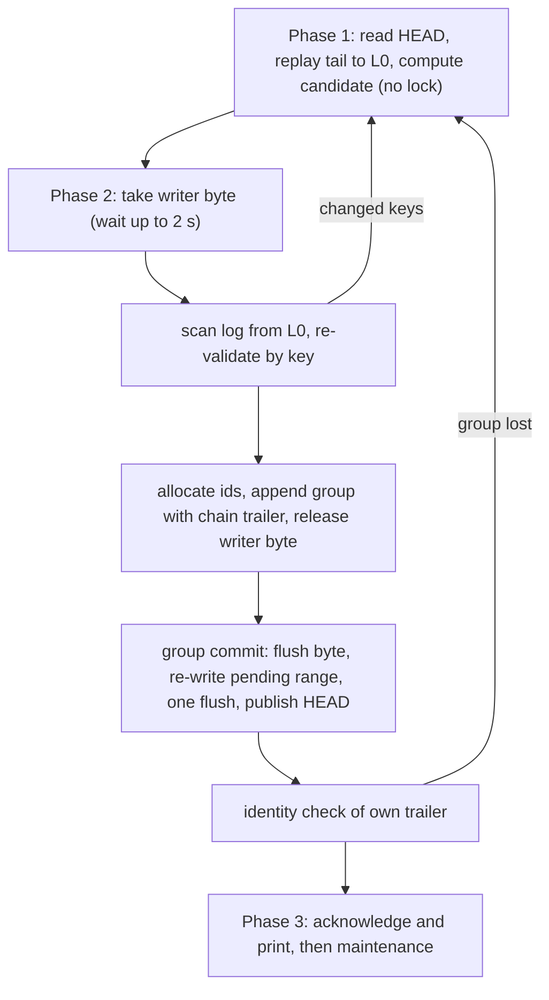

# 4. Движок хранения и формат на диске

## Общая идея: журнал как истина, неизменяемые сегменты и оверлей (T1)

> ✅ **Как читать пункты «На согласование» в этом разделе.** По AR §11 (ARCHITECTURE-RESEARCH.md:2047) 2026-09-26 вы ответили на все открытые решения: #2, #34, #36 и #38 по-своему, все остальные — как рекомендовано. До M0–M11 ни одно решение не осталось открытым. На потом с записанными умолчаниями отложены только #42, пункты #45 «по требованию» и #21 (d). Эксплуатационная политика (классы долговечности, сроки хранения, бюджеты) состоит из ключей `config` с документированными умолчаниями и решением владельца не является. Структуру T1, лидера, словарь, кодек и все параметры хранилища решает замер M0 (:2049). Поэтому отметки ✅ ниже означают повторное подтверждение уже принятого дизайна перед стартом M0, а не новые открытые вопросы.

**Что это.** Хранилище moirai состоит из трёх слоёв.

1. **Журнал операций** (`log.NNNN`, позже `hist.NNNN`) — каноническая история и единственный источник истины. В нём лежат коммиты, движения ref, аренды (lease), маркеры, чекпоинты и служебные записи.
2. **Запечатанные колоночные сегменты**: одна база `seg.base.G` и до трёх ярусных дельт `seg.dK`. Эти файлы неизменяемы, помечены на диске как read-only и отображаются в память только для чтения.
3. **Оверлей** — ограниченная по объёму структура в памяти процесса. Каждый процесс сам воспроизводит её из хвоста журнала, который ещё не свёрнут в сегменты.

Узел ищется по цепочке: оверлей → дельты от новой к старой → база. Сегменты, блоб-файлы и `hist` являются производным состоянием: `repair --rebuild-from-log` перестраивает их из журнала.

**Зачем так.**
- **Скорость.** Открытие ничего не загружает: читается `HEAD`, отображается ≤ 8 файлов и воспроизводится короткий хвост. По бюджету `get #N` занимает 1–5 µs.
- **Минимум RAM.** Колонки читаются из общего страничного кэша ОС. Горячий индекс (≈ 99 B на узел, оценка; 9.9 MB при 1e5 узлов) делят все процессы moirai, и частная память процесса CLI остаётся ≤ 4 MB.
- **Корректность.** Истина одна, это журнал. Всё остальное проверяется и перестраивается из него.

**Правила T1, которые входят в формат, а не остаются опциями:**
- 32-байтовый заголовок записи с LSN, эпохой хранилища и xxh3;
- читатели никогда не заходят дальше `HEAD.committed_lsn`;
- движение ref записано внутри записи коммита;
- индекс коммитов хранится в каждом запечатанном `hist`;
- тела (bodies) лежат в неотображаемом хвосте журнала, и у них свой байтовый порог;
- дельта-чекпоинты выполняются под байтом обслуживания, а байт писателя нужен им только для публикации;
- rollup выполняется только в отдельном процессе `moirai gc`;
- refs, пины и клиентские HEAD вынесены из 4-КиБ слота `HEAD` в таблицы, которые сворачиваются из журнала;
- индекс операций по ref есть в каждом заголовке коммита и в каждой записи `Checkpoint`;
- экстенты журнала по 64 MiB, за хвостом читаются нули;
- эпоха перегенерируется при `init`, `restore` и `repair`.

**Отвергнутые варианты.**
- *Один заранее выделенный файл со страницами copy-on-write B+-дерева и двумя мета-слотами* (схема LMDB). Точечное чтение у неё самое быстрое из известных: 0.64 µs у LMDB, это внешний замер [05 §4.2]. Но написать её с нуля труднее всего: нужны аллокатор, списки свободных страниц, split/merge, межпроцессное освобождение страниц и реестр читателей. Каждая хранимая версия стоит 12–16 KiB, а рост отображения на Windows требует переотображать файл. Хранилищу на 10 MB–1 GB, чей рабочий набор помещается в RAM и которое в основном читается, эта схема ничего не даёт.
- *Полная перезапись базы на каждом чекпоинте* (предложение C). При 1e5 узлов это 0.1–0.3 s под блокировкой писателя, и при таймауте 250 ms писатели детерминированно получают отказы.
- *Резидентный демон с данными в RAM.* В простое он держит в памяти весь набор данных (100–300 MB при 1e5), что нарушает требование к RAM.

**Триггер пересмотра.** Раскладку проверяет замер на M0 (§8.2, пункт 14, подтверждается на выходе M1) на реальной смеси обновлений. Если после полного хвоста в 4,096 операций точечное чтение превысит 50 µs, если дельта-чекпоинт при 0.5 M узлов займёт больше 100 ms или если появится жёсткое требование единообразного O(depth) «путешествия во времени» по всему графу, структура меняется на вариант B из [05 §16] (B+-дерево). Протокол блокировок при этом остаётся прежним, а ветки становятся refcounted-форками в стиле Sanakirja.

> ✅ **На согласование (подтверждение):** структура T1: журнал как истина, неизменяемые отображаемые колоночные сегменты и оверлей в процессе вместо B+-дерева с copy-on-write. Из решений по движку это труднее всего отменить, потому что вся раскладка формата v1 строится на нём. Структура T1 входит в пункты, которые окончательно «решаются замером» на выходе M0 (AR §9, M0; §11). Пересмотр наступает в двух случаях. Первый — замер раскладки M0 (пункт 14, подтверждается на выходе M1) показывает точечное чтение > 50 µs после полного хвоста в 4,096 операций или дельта-чекпоинт > 100 ms при 0.5 M узлов. Второй — появляется жёсткое требование единообразного O(depth) путешествия во времени по всему графу.

_Источники: AR §2.1 (T1), §4.4, §8.1, §9 (M0), §11; [05 §16], [05 §4.2] (через AR)_

## Каталог хранилища и его файлы

Внутри git-репозитория хранилище лежит в `<git-common-dir>/moirai/` (одно хранилище на репозиторий, решение #17), вне репозитория — в `.moirai/`.

| Файл | Размер и рост | Отображается? | Роль |
|---|---|---|---|
| `HEAD` | 2 слота × 4 KiB с контрольной суммой | нет, только `pread` | кэш текущего состояния: последовательность, набор сегментов, указатели на таблицы, счётчики |
| `LOCK` | 36 KiB; создаётся только `init`/`restore`, не удаляется и не меняет размер | нет | байтовые блокировки и слоты живости |
| `log.NNNN` | экстенты по 64 MiB, за хвостом читаются нули; ≤ 4 активных до перевода в `hist` | нет, явный I/O | каноническая история |
| `hist.NNNN` | сжатые кадры ≤ 256 коммитов и ≤ 1 MiB сырых данных + индекс `id16 → lsn` на кадр | да, только чтение | бывшие экстенты журнала; индекс коммитов живёт здесь, а не в базе |
| `seg.base.G` | ≈ 99 B/узел горячих данных + названия (titles) и поля + таблица блобов | да, только чтение | материализованное состояние `main` поколения G |
| `seg.dK` | малые, ≤ 3 живых до свёртки | да, только чтение | затронутые строки, замены списков, ± списки битсетов, новые надгробия (tombstone) и символы |
| `seg.b<ref_id>.K` | набор на каждую повышенную ветку (M1) | да, только чтение | дельта повышенной ветки + битовая карта `TOUCH` |
| `blobs.NNNN` | только тела; файл на дельта-чекпоинт; сливаются при свёртке и rollup | да, лениво, при первом чтении тела | тела, адресуемые BLAKE3-128 и сжатые со словарём |
| `dict.D` | ≤ 64 KiB с LZ4 (32–110 KiB с zstd) | да | словарь «сырого содержимого»; переобучается на rollup, когда тела выросли > 25 %; может отсутствовать (решает M0) |
| `gitmap.NNNN` | 41 B на коммит × алгоритм × назначение | да | отсортированные страницы `(commit_id16, dest, algo, git_oid[32])` с fan-out таблицей; опрашиваются на месте, в хеш-таблицу процесса не грузятся |
| `cs.NNNN` | по одному на **bulk-коммит** (набор изменений > 1 MiB) | да, только чтение | запечатанный набор изменений в раскладке дельты |
| `config` | текст в синтаксисе git-config | нет | ключи уровня хранилища (§13); пользовательские ключи (пути машины, remotes, поиск хранилища) лежат в `%APPDATA%\moirai\config` на Windows и в `$XDG_CONFIG_HOME/moirai/config` на Linux и macOS; перезапись через `tmp/` и долговечную замену-переименование; `HEAD.config_gen` говорит MCP-серверу перечитать файл |
| `trash/<intent>/` | файлы после `moirai file rm --trash` | нет | `gc` чистит их через `gc.trash-expire` (14 d) |
| `tmp/` | прогоны ≤ 1 MiB для внешних сортировок | нет | удаляется orphan sweep |

**`LOCK`, layout v1 (X-F1).**
- По смещению 0 лежит `LockHdr`.
- По 2048 — диагностика писателя `{seq, ProcId, session hash, command, hlc}`. По ней при таймауте печатается, кто держит байт.
- По 3072 — запись лидера (зарезервирована).
- По 4096 — 256 записей слотов живости по 128 B: `{kind, nonce, primary and alias session hashes, ProcId}`.

Сами байты блокировок данных не несут и лежат за концом файла: 2^62 + {0 писатель, 1 лидер (только если его построят), 2 обслуживание, 3 quiet-advisory, 4 **flush**}. Слот i находится на 2^62 + 2^16 + i. По тексту AR §4.1 и [80 §2.2.3] слот всё время своей жизни держит MCP-сервер сессии (это якорь держателя аренды, §6.2) или CLI на время одного файлового намерения. Поправка [90] разрешает брать слот лениво, при первом вызове с идентичностью сессии (см. ⚠ в разделе о заморозке). На Windows используется `LockFileEx`, на Linux и macOS — OFD-блокировки. Внутри процесса владение решается в user space до вызова ядра. Порядок захвата один: слот < лидер < обслуживание < flush < писатель.

**Правила жизни файлов.**
- Файл никогда не усекается и не переименовывается поверх, пока его можно отображать. Хранилище растёт только новыми файлами.
- Освобождение места: пишется новый файл и переключается `HEAD`. Старый файл удаляется, когда `HEAD` уже 60 s указывает в другое место и на файл нет пинов. Delete-pending допускается: файлы открываются с `FILE_SHARE_READ|WRITE|DELETE`.
- Запечатанный файл либо создаётся сразу под финальным монотонным номером, либо переименовывается с барьером каталога (`durable-name` после переименования). Второй способ использует `cs.NNNN` bulk-коммита. В обоих случаях файл становится долговечным (`durable+meta` и `durable-name`) раньше, чем появится запись, которая его называет, после чего получает на диске атрибут read-only (`FILE_ATTRIBUTE_READONLY` / `0444`). На Windows GC снимает этот атрибут перед удалением.
- Заголовок запечатанного файла содержит полную длину `total_len`, и перед отображением она сверяется с `fstat`. Сбой страницы внутри отображения завершает процесс с кодом 7 и именем файла.
- Имена файлов собираются только из десятичных чисел и фиксированных ASCII-слов (X-F10). Поэтому ветка `lane/x` не создаёт подкаталог, а имена, совпадающие без учёта регистра, не сталкиваются на NTFS и APFS.
- Недописанные сегменты живут под временными именами. Orphan sweep удаляет их в следующем процессе, взявшем обслуживание, и в `doctor`.

**Допустимые файловые системы.** Хранилище отказывается работать там, где его гарантии не выполняются, и допускает только ФС, прошедшие краш-гейты:
- **Windows** — только NTFS. ReFS и Dev Drive, FAT, exFAT, сетевые пути, OneDrive, `\\wsl$` и прочие UNC отвергаются.
- **Linux** — ext4, XFS, btrfs. ZFS, f2fs и bcachefs отвергаются до своего гейта; NFS, SMB, FUSE, virtiofs, 9p (включая `/mnt/*` в WSL2), tmpfs и overlayfs — всегда.
- **macOS** — локальная APFS. HFS+ отвергается до своего гейта; нелокальные тома, iCloud Drive, корни File Provider и управляемые iCloud `~/Desktop`/`~/Documents` — всегда.

Байтовые блокировки не пересекают границу ядра, поэтому хранилище трогает только одно ядро. Полная проверка (пробная долговечная запись, синхронизация каталога, проба блокировки; `ENOTSUP` означает отказ) выполняется при `init` и `restore`. Дешёвая классификация и проверка версии ОС — при каждом открытии.

**Число файлов (CL3).** Стабильный набор — около дюжины файлов: `HEAD`, `LOCK`, `config`, ≤ 4 экстента, одна база, ≤ 3 дельты и один словарь. К ним добавляются по одному `hist` на каждый выведенный экстент, ≤ 1 `blobs` на дельта-чекпоинт с последней свёртки (1–2 в день), страницы `gitmap` и файлы, закреплённые ветками и тегами. Процесс отображает только текущий набор и те blob-файлы, которые реально читает. Поэтому O(число чекпоинтов) файлов стоит лишь записей в каталоге, а не отображений и не проверок Defender на пути коммита. Файлов на узел или на коммит нет.

> ✅ **На согласование (подтверждение):** хранилище работает только на ФС, прошедших краш-гейты. На Windows это NTFS; на ReFS/Dev Drive, exFAT, сетевых дисках, OneDrive и `\\wsl$` moirai откажется открывать хранилище и не станет тихо ослаблять гарантии. Для репозиториев это уже зафиксировано в решении #15, но ограничение касается каждого проекта, где вы захотите завести хранилище.

_Источники: AR §4.1, §4.10, §14, §11 (#15, #17); [80 §2.2, §2.5, §2.6, §2.12]; [60 §2.5]_

## Слот `HEAD`: кэш, а не истина

Сокращённая запись (полная раскладка — AR §4.2):

```
HeadSlot {
  magic "MOIR", format u16, flags u16 (bit0 quiet, bit1 fts_tier2, bit2 readonly, bit3 retired),
  slot_seq u64,        // растёт с каждой публикацией; читатель берёт валидный слот с большим значением
  epoch u64,           // эпоха хранилища: случайная при init, заново при restore/repair
  committed_lsn u64,   // граница видимости: читатели дальше не читают
  durable_lsn u64,     // конец последней сброшенной группы
  boot_id [16],        // идентичность загрузки ОС
  config_gen u32,      // растёт при `moirai config set`
  checkpoint_lsn u64,  // первая запись журнала, не свёрнутая в сегмент
  commit_seq u64,      // последний seq коммита (курсор ленты изменений)
  next_id u32,         // аллокатор #N (не версионируется)
  next_anchor u32,     // аллокатор якорей R4 `aN`
  fence u64,           // аллокатор fencing-токенов аренд
  active_log u32, n_segments u8, _ [3]u8,
  segments [SegRef; 8],  // {file_no u32, kind u8, upto_lsn u64, blake3_16} = 29 B каждый
  refs_lsn, pins_lsn, heads_lsn, markers_lsn u64,  // новейшие записи RefTable/Pin/ClientHead/Marker
  image_cursor [4]{dest u8, algo u8, seq u64},
  seq_ring [32]{seq u64, lsn u64},   // недавние коммиты для дешёвого `changes --since`
  reserved …, xxh3_128 [16]
}
```

**Что это и почему так.** `HEAD` — это кэш, а истина лежит в журнале (схема «1PC+C»). Слот пишется после сброса коммита и на пути коммита **не сбрасывается**, поэтому durable-коммит стоит ровно одного flush — журнала. Слотов два. Читатель берёт валидный слот с большим `slot_seq`, поэтому разорванная запись одного слота безвредна. Каждая публикация — это read-modify-write новейшего слота в другой слот под байтом писателя.

**В слоте нет таблиц переменного размера.** Таблица ref хранит на каждую ветку `name → {ref_id u32 (never reused), kind, commit_id, lsn, base_pin, fork_commit, fork_seq, ops_since_fork, overlay_ops, overlay_bytes, ref_seq_next, promoted_seg, gen, absorbed}`: ≈ 68 B плюс 6 B на каждую живую ветку, то есть ≈ 18 KB в `REFS` при 50 ветках. Она, как и таблица пинов (файл сегмента → счётчик ссылок и держатели), таблица клиентских HEAD и таблица маркеров, живёт в записях журнала `RefTable`, `Pin`, `ClientHead`, `Marker`. Слот хранит только lsn новейшей записи каждого вида, а чекпоинт сворачивает эти таблицы в секции `REFS`/`PINS`/`HEADS`/`MARKERS`. Свежий процесс читает секцию и записи после неё. Это стоит одного лишнего `pread` на открытие (10–170 µs).

**Три правила безопасности.** После сбоя ОС слот на диске может оказаться как старше, так и **новее** долговечного журнала, поэтому действуют три правила.
- **Долговечная граница.** `durable_lsn` — конец последней сброшенной группы. Lazy-запись может сдвинуть `committed_lsn` дальше неё, а durable-публикация ставит обе границы. Восстановление никогда не начинает с `committed_lsn`: оно сканирует от `min(durable_lsn, checkpoint_lsn)`.
- **Проверка загрузки.** Перед первым чтением каждый процесс сравнивает `boot_id` с текущей загрузкой (Windows `BootId`, Linux `boot_id`, macOS `kern.bootsessionuuid`). При несовпадении процесс в порядке блокировок берёт байт flush, затем байт писателя. Он сканирует журнал от `min(durable_lsn, checkpoint_lsn)` и переписывает все полные группы в `(durable_lsn, end]`. Затем он **отпускает байт писателя**, сбрасывает журнал, снова берёт байт писателя и перепубликует слот (read-modify-write) с текущим `boot_id`. Байт писателя при сбросе не удерживается: по замороженному правилу блокировок никто, держащий этот байт, не делает flush. После этого `HEAD` один раз сбрасывается — раз за загрузку и вне пути коммита — и только затем начинается чтение. Процесс, который не может прочитать идентичность загрузки, работает в режиме Unknown-boot: он пропускает эту проверку и полагается на правила валидности записей. Так ни один читатель не увидит состояние до сбоя, а подтверждённый коммит, чья публикация потерялась, станет виден первому читателю после перезагрузки.
- **Барьер двух слотов.** Перед удалением любого файла, выводом или переиспользованием экстента обслуживание сначала публикует собственный `Checkpoint`. Затем оно добивается, чтобы **оба** слота называли состояние после удаления (при необходимости делается пустая публикация), и один раз сбрасывает `HEAD` (`durable+meta`) **вне байта писателя**. Так flush `HEAD`, который на macOS занимает 3–20 ms, не тормозит писателей. Если восстановление всё же найдёт слот, который ссылается на отсутствующий файл, набор сегментов пересобирается из долговечных записей `Checkpoint`.

Флаг `retired` ставит `restore` в старом хранилище при подмене. Долгоживущие процессы проверяют его при каждой операции и заново находят хранилище.

_Источники: AR §4.2, §2.8 (T8), §4.10; [80 §2.2.3, §2.7.1, §2.3.2]_

## Журнал: записи, группы и цепочка контрольных сумм

```
RecHdr (32 B): len u32 | kind u8 | flags u8 (bit0 lazy, bit1 group_end) | _ u16 | lsn u64 | epoch u64 | xxh3_64 u64
```

**Валидность записи.** Запись валидна, только если длина и вид правдоподобны, `epoch` равна `HEAD.epoch`, `lsn` равен её позиции в скане и совпадает xxh3. Проверка позиции отсекает запись той же эпохи, оставшуюся от прошлой жизни переиспользованного экстента. Эпоха отсекает записи от *другого* `init`.

**Группы и цепочка.** Записи пишутся **сбрасываемыми группами**: коммит вместе с его записями `Lease`/`Marker`, `RefUpdate` вместе с сопутствующими записями или одна lazy-запись. Последняя запись группы несёт флаг `group_end` и 8-байтовый трейлер `chain`. Трейлер — это XXH3-64 по байтам группы, засеянный значением цепочки предыдущей группы; для первой группы после `init` или смены эпохи используется XXH3-64(epoch). Поэтому группа валидна только позади ровно того предшественника, относительно которого её проверили. Группа не пересекает границу экстента: при ротации старый экстент добивается одной группой `Noop`. Восстановление принимает группу целиком или не принимает вовсе и останавливается на первой невалидной группе. Завершение задачи поэтому никогда не будет принято без своего маркера.

**Виды записей.**

| Группа | Виды |
|---|---|
| Ядро | `Commit`, `RefUpdate` (движения ref без коммита: `branch`, `tag`, `undo`, `op restore`, `branch -d`), `ClientHead`, `Lease`, `Marker` (settled/deleted/cleared), `Idem`, `GitMap`, `Pin`, `Checkpoint` (смена набора сегментов + списки lsn по каждому ref за окно, с `append_hlc` у каждого элемента), `RefTable`, `Lazy`, `Noop` |
| R4, durable | `FsIntent`, `FsIntentDone`, `FsIntentAborted` — протокол безопасных при сбое файловых операций |
| R4, lazy | `FileObs`, `Pending`, `FPrint`, `JournalCursor`, `DirMap`, `TreeReg` (включая эпохи settle и счётчик «грязных»), `PrefixEv`, `GitFacts`, `AnchorRes` |
| Аудиты | `Backup` (durable), `SessionMark` (lazy: какие правила хук `SubagentStart` показал агенту) |

При воспроизведении lazy-записи времени выполнения индексируются по ключу → lsn и декодируются только при обращении.

**Экстенты.** Каждый экстент — 64 MiB (`store.log-extent-bytes`, фиксируется при `init`). Каждая запись журнала целиком помещается в один экстент, и это проверяет скан восстановления. Способ создания зависит от ФС: на NTFS — заполнение нулями и один полный `FlushFileBuffers`, на Linux — `FALLOC_FL_WRITE_ZEROES` или заполнение нулями (на btrfs — разреженный файл), на macOS — разреженный `ftruncate`. Байты за хвостом читаются нулями, и последующие коммиты там, где ФС это позволяет, становятся перезаписью (G11; M0, пункт 11 меряет сброс данных на заполненном нулями экстенте против дозаписи). Экстент становится долговечным (`durable+meta` + `durable-name`) раньше, чем будет подтверждён первый коммит в нём. Активными остаются ≤ 4 экстента.

**`hist`.** Заполненный экстент сжимается в `hist.NNNN`. Кадр содержит ≤ 256 коммитов и ≤ 1 MiB сырых данных. Коммит крупнее этого становится отдельным кадром из независимо распаковываемых блоков ≤ 1 MiB, поэтому декодирование одного коммита никогда не стоит больше 2 MB. У кадра есть индекс `id16 → lsn`, а заголовок несёт `first_seq`, `last_seq`, `first_append_hlc` и `last_append_hlc` (F8). По умолчанию ничего не удаляется.

_Источники: AR §4.3, §4.1, §4.9, §13; [80 §2.3.3, §2.4.3]; [81 B1]_

## Тело коммита, операции и размер коммита

```
commit_id      [32]  BLAKE3-256 по канонической форме
n_parents u8, parents [{id16, lsn}; n]      // 24 B каждый; 2 у слияния, 0 у корня
gen u32                                      // 1 + max(parent.gen)
seq u64                                      // монотонный по всему хранилищу
ref u16, ref_id u32                          // ветка, на которую ложится коммит
ref_old id16                                 // вершина ветки, которую коммит заменяет (N3)
prev_on_ref u64                              // lsn предыдущего коммита на той же ветке (G15)
ref_seq u32                                  // позиция в цепочке ветки; после undo не переиспользуется
kind u8                                      // хешируется: ordinary | merge | sync | revert | cherry-pick
import u8                                    // не хешируется: 0 local | 1 import-native | 2 import-foreign | 3 import-checkpoint
hlc u64                                      // гибридные логические часы (ms << 16 | counter)
actor u32, role u8, session u32              // символы
git {algo u8, head [32], branch u16, worktree u16, base [32]}
foreign_git {algo u8, oid [32]}              // git-объект, из которого пришёл импорт (хешируется)
idem_key [16], idem_payload [16]             // BLAKE3-128 ключа и полезной нагрузки; не хешируются
sync_base id16                               // только sync/merge: поглощённый коммит источника
n_absorbed u16, absorbed [(ref_id u32, ref_seq u32)]   // только merge/sync; ≤ 300 B при 50 ветках
verified u8                                  // native-импорт: канонический хеш совпал с трейлером
stmt_origin u8, stmt_sym u32, stmt_hash [16] // R5, не хешируются: какой глагол/мутация/TX породил коммит
append_hlc u64                               // R5, не хешируется: HLC этого хранилища при дозаписи
msg_len u16, msg
affected_len u32, affected_complete u8, affected [u32]   // для ленты изменений; не хешируется
changeset_digest [32]                        // BLAKE3-256 канонического пункта 10
cs_ref {file u32, len u64, blake3_16}        // только bulk-коммиты: ссылка на cs.NNNN
n_ops u32, ops[]                             // встроенный набор изменений ≤ 1 MiB
```

**Ключевые решения в заголовке.**
- **Движение ref внутри коммита (N3).** Принятие полной записи означает движение `ref_old → commit_id`, проверенное CAS по таблице ref. Если CAS не проходит, коммит паркуется на `orphans/<ref>`. Отдельная запись о движении ветки коммиту не нужна (`RefUpdate` служит только движениям без коммита).
- **`prev_on_ref` и `ref_seq`** дают по каждой ветке цепочку, которая читается без обхода DAG. `absorbed` — вектор поглощённых позиций ветки для слияний.
- **Разделение на хешируемое и нехешируемое.** Всё, что зависит от конкретного хранилища (`seq`, lsn, `ref_id`, символы, флаг `import`, idempotency, поля R5), в `commit_id` не входит.

**Операции** — это tagged varints: `Create`, `Delete`, `Undelete`, `SetField`, `SetStatus`, `Incr`, `SetBody`, `AddEdge`/`RemoveEdge` (с `disc`, дискриминатором якоря R4 на рёбрах `at`), `SetEdgeProps` (R4), `Move`, `Schema{weaken|strengthen|query}`, `Conflict`, `Violation`, `Resolve`. Каждая операция, меняющая значение, несёт before-image и дельту `prev` к предыдущей операции над тем же узлом на этой ветке, так что история узла — это связанная цепочка. Внутри коммита писатель сливает операции по ключу: поле, заданное дважды, сохраняет первый before-image и последнее значение; два `Incr` складываются; `Create` + `SetField` сворачиваются в `Create`. Поэтому хранимый список — это *чистый* набор изменений. Маркеры выводятся из него же, и `TX { REOPEN t; SET t.done = true }` для уже закрытой задачи не порождает ни одного маркера.

**Тела.** Тело идёт в хвосте журнала несжатым, с байтом кодека, и сжимается со словарём только тогда, когда чекпоинт запечатывает его в `blobs`. Ни один пишущий процесс не строит контекст сжатия (для zstd это 1–2 MB). Если замер M0 покажет, что хвост должен хранить сжатые тела, параметры выбранного pure-Rust кодека с наименьшим окном и словарём по ссылке удержат этот объём ≤ 0.5 MB.

**Кодирование и размер (замораживается на M0).** Заголовок начинается с u32-битовой карты присутствия, и пустые необязательные группы (`git`, `foreign_git`, пара идемпотентности, `sync_base`, вектор поглощения, `verified`, `stmt_hash`, `cs_ref`, `msg`, `affected`) опускаются. Целые, кроме `hlc`, пишутся как LEB128 varint; `append_hlc` — дельтой от `hlc`, у локального коммита это один байт. Идентификаторы, дайджесты и `hlc` имеют фиксированную ширину. Размеры такие:
- заголовок со всеми полями ≈ 407 B (32 B `RecHdr` + 375 B при одном родителе, без `msg`, `affected` и операций);
- типичный локальный коммит агента (один родитель, git-происхождение из worktree, ключ идемпотентности, именованная мутация, 2–4 затронутых id) — заголовок ≈ 310 B, а вне репозитория и без ключа ≈ 210 B;
- с коротким сообщением и 1–3 малыми операциями (≈ 40–150 B) небольшой коммит занимает **≈ 0.35–0.5 KB** до сжатия (оценка). Это примерно в 100 раз меньше ~52 KB на однострочный коммит, которые отчёт [04 §3.2] намерил у DoltLite.

Около 200 B каждого заголовка — идентификаторы и дайджесты, которые не сжимаются, поэтому кадры `hist` сжимаются лишь ≈ 1.5–2.5× (оценка). На 1e5 коммитов это ~35–50 MB сырой истории и ~15–30 MB в `hist` (оценка).

**Bulk-коммиты.** Встроенный набор изменений ограничен `store.commit.inline-max-bytes` (1 MiB). Крупнее бывают импорт checkpoint-образа, `migrate` по виду, `rm --cascade` кампании, `file mv` каталога с тысячами ссылок, слияние длинной ветки. Такой набор потоково пишется в запечатанный `cs.NNNN` в раскладке дельты. Файл сбрасывается, переименовывается `rename_noreplace` и фиксируется `durable-name` до записи `Commit`, которая на него ссылается. Читатели отображают его как ещё один слой дельты, а следующий чекпоинт его сворачивает. Если после сбоя сегмент сброшен, а запись нет, orphan sweep удалит бесхозный файл. Агентские глаголы `TX` и `apply` bulk-коммитов не создают: выше бюджета записи они отказывают с E501 и подсказкой, как разбить запись.

> ⚠ **Расхождение в документах:** §4.3 (ARCHITECTURE-RESEARCH.md:664) перечисляет среди случаев bulk-коммита «`TX` сверх его бюджета записи». Но конец того же абзаца и §4.5, шаг 4 (:712) говорят, что `TX` и `apply` bulk-коммитов никогда не создают и отказывают с E501. Выше приведено второе правило, повторённое в документе дважды. Спецификационное ревью M0 должно убрать `TX` из списка.

> ⚠ **Расхождение в документах:** §4.6 (ARCHITECTURE-RESEARCH.md:779) и [90 §10.1] (90-harness-agnostic-design.md:731) резервируют в заголовке коммита нехешируемый байт `actor_src` рядом с `stmt_origin`. Но сама раскладка в §4.3 (:652) и список «Not hashed» в §4.6 (:757) его не содержат, так что цифра ≈ 407 B и замораживаемая раскладка устарели. Кроме того, `role` в заголовке коммита имеет тип u8 (:645), а в колонке `CREATOR`, куда он копируется, — u16 (:427), и причина не указана.

_Источники: AR §4.3, §4.5, §8.1; [71 RAM-B1, RAM-M6] (через AR); [90 §10.1, §11.3]_

## Каноническая форма и идентификатор коммита

**Что это.** `commit_id` = BLAKE3-256 от канонической кодировки с префиксами длины. Кодировка фиксируется в спецификации формата M0 и включает ровно эти поля в этом порядке:

1. `kind` ∈ {ordinary, merge, sync, revert, cherry-pick}. Флаг `import` в неё не входит, поэтому проверенный native-импорт сохраняет исходный вид и id.
2. **Заявленные** id родителей: один у ordinary, revert и cherry-pick; два у merge (вершина приёмника и вершина источника) и у sync (вершина линии (lane) и `sync_base`).
3. `hlc`.
4. actor, role и session как строки.
5. git-происхождение как строки: алгоритм, head, branch, worktree, base.
6. Сообщение, нормализованное при записи: LF, без хвостовых пробелов в строках и без завершающих переводов строки. Сообщение, последний абзац которого начинается с `Moirai-`, отвергается, чтобы блок трейлеров git-образа всегда отделялся.
7. Версия схемы.
8. Исходный коммит для revert/cherry-pick.
9. `foreign_git` для коммитов из чужого или checkpoint-импорта.
10. **Чистый набор изменений.** Одна запись на ключ, узлы названы по `uid` (не по `#N`), сортировка по (uid, класс ключа, имя поля или вида ребра, uid цели, дискриминатор). Классы ключей: поля, статус с резолюцией, счётчики (чистая дельта), тело (BLAKE3-128 новых байтов), рёбра (с `disc` и `props`; у ребра `at` пропсы — блок селектора якоря, где quote, prefix и suffix входят **только** дайджестами BLAKE3-128), существование, иерархия, элементы схемы (включая именованные запросы в переносимой форме), конфликтные значения.

Пункт 10 входит в кодировку своим BLAKE3-256 `changeset_digest`. Поэтому кандидат, которого под блокировкой перевесили на нового родителя, перехешируется за O(1), а bulk-набор хешируется прямо во время потоковой записи. Пункта 11 нет: провенанс ссылок R4 и история перемещений каталогов — это обычные поля внутри пункта 10, а R5 добавляет только элементы схемы.

**Не хешируются:** `#N`, lsn, `seq`, все поля ref, номера символов, смещения, id хранилища, idempotency, `import`/`verified`, векторы поглощения, `affected`, поля R5 (`stmt_*`, `append_hlc`), before-images, операции `Violation`, индекс `ALLOC`, хеш канонического AST именованного запроса, все таблицы разрешения и свидетельств R4 и тексты quote/prefix/suffix якорей (хешируются только их дайджесты).

**Чистый набор = разность состояний.** Для любого вида коммита канонический список операций равен типизированной разности между состоянием первого родителя и состоянием коммита. Особый случай — `sync`: он хранит только остаток (ключи, где слитое значение отличается от того, что дало бы одно окно `main`), но хеширует **полную** разность. Она вычисляется из той же свёртки, что уже делает sync, без лишнего I/O и хранения; sync проверяет равенство «окно ⊕ остаток = разность», а `doctor --verify` перепроверяет его. Внутри одного uid классы ключей идут в порядке строк `.moi`, поэтому импортёр хеширует узел за узлом с памятью O(1). Остальные bulk-производители сортируют внешне прогонами ≤ 1 MiB.

**Зачем.** Два хранилища, импортировавшие один и тот же git-образ, получают одинаковые id (I28′, I38′). Это делает git-трейлер `Moirai-Commit` проверяемым и проверяется для каждого вида коммита до любых round-trip корпусов (gate 0 в §5b.7). Хеш-функция — BLAKE3 из крейта `blake3` с фичей `pure` (решение #44): pure Rust, без AVX-512 и NEON. Её пропускную способность на вашем CPU меряет M0, пункт 13.

_Источники: AR §4.6, §4.3, §11 (#44); [90 §11.3]; [72 M5, M6] (через AR)_

## Раскладка сегментов

```
SegHdr { magic "MSEG", format u16, seg_kind u8 (base|delta|branch|hist|blobs; + changeset), n_rows u32,
         base_seq u64, upto_lsn u64, total_len u64,
         n_sections u16, sections: [{tag u16, flags u16 (bit0 derived-optional), off u64, len u64, xxh3 u64}], blake3 [32] }
```

**Расширяемость без смены версии.** Секция с флагом **derived-optional** перестраивается из журнала, и читатель, не знающий её тега, её пропускает. Новый производный индекс (например, индекс истории аренд) поэтому является аддитивным изменением, а не новой версией формата; `repair --rebuild-from-log` строит его.

**Секции `seg.base`.** Строки плотные по `#N`; удалённые строки сохраняют заголовок с надгробием.

| Секция | Раскладка | Байт на строку (оценка) |
|---|---|---|
| `NODE` | `[NodeHdr; n]`, фиксированные 60 B (колонки §3.1) | 60 |
| `UID` | отсортированные `[(u128, u32)]`, холодная | 20 |
| `TOPO`, `DEFER`, `DUE` | по u32, холодные | 12 |
| `TITLE_OFF` + `TITLE_BLOB` | u32 + UTF-8 с varint-длиной (≤ 200 B) | 4 + ~60 |
| `FIELDS_OFF` + `FIELDS_BLOB` | u32 + блоки tagged-varint | 4 + ~24 |
| `BODY_REF` → `BLOBTAB` | u32 → `(blake3_16, file, off, len, raw_len)` | 4 + на уникальное тело |
| `OUT_OFF`/`OUT_DST`/`OUT_KIND` | CSR: `[u32; n+1]`, `[u32; e]`, `[u8; e]`, сортировка (kind, dst) | 4 + 5 на ребро |
| `IN_OFF`/`IN_SRC`/`IN_KIND` | обратный CSR | 4 + 5 на ребро |
| `EDGE_PROPS` | разреженные `(edge idx, pinned_commit)` | редко |
| `BM_*` | замороженные битсеты: по виду, по (виду, статусу), `unblocked`, `is_blocker`, `deleted`, `suspect`, `conflicted`, `container`, `has_dangling` (~80 наборов) | ≤ 128 KiB на набор при 1e6 |
| `SYMTAB` | отсортированная таблица строк | мало |
| `TOMB` | `{id, tx, reason_sym, replaced_by}`, 16 B | на удалённый узел |
| `IDEM` | открытая адресация `(key16, payload16, branch_sym, result blob ref)`, хранение 30 дней | 40 B на ключ |
| `LEASES`, `MARKERS`, `MARKERS_OLD` | аренды с якорем держателя (32 B), fencing-токеном, сроком `{wall, boot_hash, mono}`, `run`, `branch`, захваченными глобами `files_owned`; **активные** маркеры `{#N, ref_id, commit, kind, ref_seq, hlc, seq}`; инертные уходят в `MARKERS_OLD` | ~64 / 40 B на живую строку |
| `REFS`, `PINS`, `HEADS` | свёрнутые таблицы из `HEAD` | мало |
| `ANCESTRY` | ленивые факты `(sha32, sha32) → bool` | редко |
| `TERMS`, `POST` | полнотекстовый поиск tier 2 (от 20k узлов), с `DOCLEN` и байтом версии токенизатора | ~135 + 6 B/узел |
| Секции R4 | `PATHIDX`, `ALIASIDX`, `ANCHORS`, `ANCHOR_UID`, `GLOBIDX` (версионируемые); `FILEOBS`, `PENDING`, `FSINTENT`, `FPRINT`, `JOURNALCUR` (зарезервирована, E2 не строится), `DIRMAP`, `TREES`, `PREFIXEV`, `GITRENAMES`, `ANCHORRES` (runtime) | ~55 B на путь + 16 B на якорь; 96–150 B на (файл, дерево) |
| Секции R5 | `CREATOR`, диапазоны тегов `FCOL.<field>`/`FIDX.<field>`, `STATS`, `CONFLICTS`, `ALLOC` + `UIDX` | 4 B + 24 B/узел (холодные) + ~1–5 B на индексируемое поле; `STATS` ~4–8 KB |

**Замороженный битсет** написан вручную. Каждый чанк в 65,536 id — это либо отсортированный массив u16 (≤ 4,096 членов), либо битовая карта 8 KiB. 16-байтовый индекс чанков хранит кардинальность каждого чанка, а заголовок сегмента — итог по битсету (F6), так что планировщик запросов получает точные счётчики за O(чанков). Запросы идут прямо по отображению. Поэтому `ready` сводится к AND битсетов, короткому обходу предков и O(1)-пробе маркеров, без обхода DAG (§8.1).

**Дельта-сегменты** хранят только затронутые строки (отсортированный массив `IDS`), **полные** прямые и обратные списки затронутых узлов (семантика замены списка), ± списки битсетов и новые тела, символы, надгробия, аренды и маркеры.

**Итог по памяти.** Горячие байты на узел: 60 (заголовок) + 8 (смещения CSR) + 30 (3 ребра × 2 направления × 5 B) + ~1 (битсеты) ≈ **99 B**. Горячий индекс в общем страничном кэше занимает 1.0 / 9.9 / 99 MB при 1e4 / 1e5 / 1e6 узлов, всё хранилище целиком — ~5.5 MB / ~55 MB / ~0.55 GB (~540 B/узел; резидентны только прочитанные страницы). Файл базы весит ~12 MB при 1e5 и ~115 MB при 1e6 (оценки).

> ⚠ **Расхождение в документах:** строка `LEASES` в §4.4 (ARCHITECTURE-RESEARCH.md:694, повтор в :1203) не содержит полей `kind` (task | role), `role`, `bound` и корневой сессии, которые §4.6 (:779) и [90 §10.1] (90-harness-agnostic-design.md:729) замораживают в формате v1. К тому же она отсортирована только по `#N`, а у ролевых аренд `#N` задачи нет. Строка секций R5 (:699) оценивает `CREATOR` в 4 B на узел, хотя после расширения actor до u32 это `(actor u32, role u16)` = 6 B (§3.1, :427). В заголовке узла `created_tx`/`updated_tx` имеют тип u32 (:419), а `seq` и `rev_seq` — u64 (:636, :417), и правила, которое согласует ширины, нет.

_Источники: AR §4.4, §3.1, §8.1, §5a (стоимость пинов); [50 §8.1] F4–F7, F12, F17; [40 §2.11] R-8, R-18_

## Долговечность: классы и групповой коммит (T8)

**Классы долговечности** с точными вызовами под каждую ОС:

| Класс | Что в него входит | Windows / Linux / macOS |
|---|---|---|
| `durable` | каждая мутация графа, claim/complete/release, удаление, движение ref, движение клиентского HEAD, маркеры `settled`/`deleted`, пакеты `apply` | `NtFlushBuffersFileEx(FLUSH_FLAGS_FILE_DATA_SYNC_ONLY)` / `fdatasync` / `fcntl(F_FULLFSYNC)` — никогда не слабее |
| `lazy` | heartbeat, курсоры, отметки сессий, runtime-свидетельства R4 | дописываются и публикуются сразу, если нет ожидающей durable-группы; **теряются** при потере питания, сбое ОС или неудачном flush (так и документировано) |
| `durable+meta` | создание экстентов, смена размера, барьер `HEAD` (вне байта писателя) | `FlushFileBuffers` / `fsync` / `F_FULLFSYNC` |
| `durable-name` | create, rename или unlink, от которых зависит durable-запись | flush каталога (`FILE_FLAG_BACKUP_SEMANTICS` + запись; 0.07 ms, измерено) / `fsync(dirfd)` / `fsync(dirfd)` + барьер `F_FULLFSYNC` |

**Понижения нет.** Если место не может дать класс (`ENOTSUP`, неподходящая ФС), хранилище там не открывается. Мутации графа всегда durable (это правило), а состав lazy-класса задаётся ключом `durability.lazy-kinds` (по умолчанию heartbeat, cursor и session-mark).

**Подтверждение.** Durable-коммит подтверждается только после трёх шагов: его покрыл flush, прошла публикация, и писатель заново прочитал свой цепной трейлер позади этой публикации. `HEAD` при этом не сбрасывается.

**Групповой коммит — без лидера и на всех ОС.** Писатель, чья группа ещё не покрыта, берёт байт **flush**, затем байт писателя. Он сканирует диапазон `(durable_lsn, end]` и заново переписывает каждый его байт. Потом он отпускает байт писателя, делает **один** flush за все группы, дописанные до него, и публикует `HEAD` через read-modify-write, сворачивая эффекты всех покрытых групп. Группа, потерянная после неудачного flush другого процесса, никогда не подтверждается, а читатели не видят durable-группу, пока её не покрыл flush. В результате пачка из 16 писателей стоит ≈ 2–3 flush вместо 16.

**Цифры.**
- Пол flush: Windows 0.45–2.0 ms p50 (измерено); Linux 0.45–2.8 ms на потребительском NVMe и микросекунды на дисках с защитой от потери питания (заявлено); macOS `F_FULLFSYNC` 3.1–3.9 ms p50 и 11.6 ms p99 на M3/M5, ≈ 17–20 ms на M1 (заявлено).
- Durable-коммит (движок): ~2.0 ms p50, ~6 ms p99, 13.7 ms max при 1e4–1e5 и ~2.2 ms при 1e6, из них один `DATA_SYNC_ONLY` flush. Стоимость закрытия файла под Defender ждёт замера M0 (U10).

**Отвергнуто.**
- *Последовательный flush под байтом писателя* (прежняя позиция): пачка стоит 16 × время flush, то есть 50–65 ms p50 на современных Mac и ≈ 300 ms на M1, и не проходит гейт в 50 ms.
- *Групповой коммит только через лидера*: CLI в песочнице на Linux (seccomp блокирует `AF_UNIX`) и на macOS (Seatbelt) до лидера не достучится.
- *Параллельные flush без байта flush*: больше сбросов устройства, а на macOS flush, успешный после чужого неудачного, может оставить диапазон потерянным.
- *Подтверждение по позиции LSN*: после неудачного flush страницы могут откатиться, и та же позиция будет держать чужую группу.
- *`FlushFileBuffers` на каждый коммит*: медленнее без выигрыша в долговечности.
- *`FILE_FLAG_WRITE_THROUGH`*: 0.14 ms, но на потребительских дисках ему нельзя доверять.
- *`F_BARRIERFSYNC` или обычный `fsync` на macOS*: они дают только упорядочивание, а данные остаются в кэше диска.
- *`O_DIRECT` + `RWF_DSYNC`*: требует выровненных по блокам групп, то есть смены формата.

**Триггер пересмотра.** Если замеренный p99 последнего подтверждения при 16 писателях выйдет за гейт своей ОС, для клиентов вне песочницы добавится пересылка через лидера. Если вы согласитесь на окно потерь 100 ms для всех записей, все коммиты станут lazy со сроком.

> ⚠ **Расхождение в документах:** тег `[C]` из легенды [80] («сторонние данные», 80-cross-platform-design.md:24) стоит в трёх местах AR: у полов flush для Linux и macOS в §8.3 (ARCHITECTURE-RESEARCH.md:1946), у стоимости последовательной пачки flush в T8 (:198, «[C, X17 §3.9]»: 50–65 ms p50 на современных Mac, ≈ 300 ms на M1) и у риска 32 (:2032, «[C, X17 §3.2]»). По соглашениям AR (:59) буквы [A]–[D] обозначают только предложения A–D, поэтому во всех трёх местах должно стоять «claimed» (заявлено).

> ✅ **На согласование (подтверждение):** контракт долговечности. Каждая мутация графа durable: один сброс данных через групповой коммит без лидера, подтверждение только после flush, публикации и проверки трейлера. `HEAD` на пути коммита не сбрасывается. Heartbeat, курсоры и отметки сессий (lazy) после потери питания, сбоя ОС или неудачного flush теряются. Правило «мутация графа подтверждается только после flush» — это правило проектирования (контрактная половина бывшего решения #12), которое не меняет ни один ключ. Состав lazy-класса и тихие окна — ключи конфигурации (`durability.lazy-kinds` и др.). Альтернатива — окно потерь 100 ms для всех записей (все коммиты lazy) — предусмотрена только как ваше решение, по триггеру пересмотра T8.

_Источники: AR §2.8 (T8), §4.5, §8.1, §8.3, §10 (риск 32), §11, §13, §14; [80 §2.3, §2.4]; [81 B1, M6]_

## Путь записи: одна команда, один коммит, три фазы

Каждый пишущий глагол работает в три фазы: простые записи, `claim`, `complete`, `apply`, `TX`, `rm`, `merge`, `sync`, `revert`, `cherry-pick`, импорты и settle. Байт писателя держится только на скан, повторную проверку и дозапись (и коротко на публикацию), а flush делается вне его. Это обобщение `DRY` + `IF TIP` из `TX`, и лидер для этого не нужен.



**Фаза 1 — вычисление до блокировки.**
1. `pread` обоих слотов `HEAD`, выбор валидного с большим `slot_seq`. Если `boot_id` другой, сначала выполняется восстановление. Затем отображается набор сегментов, и `(replayed_lsn, committed_lsn]` воспроизводится в **компактный оверлей**: отсортированный индекс `#N → lsn новейшей записи` (12–16 B на операцию) плюс ± списки производного состояния. Значения декодируются из кэшированных страниц журнала при обращении, и весь компактный оверлей (индекс вместе с ± списками) занимает ≤ 60 B на операцию. Эта граница называется L0.
2. Предварительная проверка идемпотентности на L0: при попадании сохранённый результат возвращается сразу, а обязательная проверка повторяется в фазе 2.
3. Определяются ветка клиента, привязка и git-происхождение; `TX` разбирается, связывается и планируется.
4. **Кандидат** вычисляется против снимка L0 в copy-on-write слое, где копируются только затронутые ключи. Сюда входит вся валидация (схема, CAS-охрана `--if-rev`/`--if-status`/`--if-holder`/`--if-tip`, fencing-токен аренды, политики ролей, машина статусов, Pearce–Kelly для каждого нового ребра предшествования), смежность, счётчики, битсеты, `affected`, **маркеры из чистых операций**, записи `Lease`, для слияний и sync — вся логика слияния, а также каноническая форма и `changeset_digest`. Рабочий набор ограничен **бюджетом записи `wmem`**: min(1 MiB, запас по RSS-гейту), не меньше 256 KiB, для агента максимум 4 MiB. Явные bulk-глаголы выше этого бюджета переходят на bulk-коммит, а `TX` и `apply` отказывают с E501. Файловая работа settle, включая ожидание затишья ≥ 50 ms, тоже делается здесь, а не под блокировкой.

**Фаза 2 — коммит.**
5. Захват байта писателя с ограниченным ожиданием `lock.writer-wait-ms` = 2 s: на Windows это overlapped `LockFileEx`, на Linux и macOS — поток-ожидатель в `F_OFD_SETLKW`. При таймауте процесс выходит с кодом 7 и называет держателя.
6. Скан от L0 до конца журнала по правилу цепочки групп. Опубликованные группы применяются к оверлею. **Ожидающие** группы (дописанные, но ещё не покрытые flush или брошенные умершим писателем) воспроизводятся только в черновой слой, который выбрасывается при отпускании байта, так что оверлей чтения никогда не заходит за `committed_lsn`. Если значение цепочки на L0 больше не совпадает, оверлей перестраивается из сегментов. Невалидная группа в `(durable_lsn, end]` означает конец журнала (потерянный lazy-хвост или группу, не пережившую сбой) и перезаписывается. Невалидная запись ниже `durable_lsn` — это порча: выход 7 и `moirai repair`. **Только после этого** проверяется ключ идемпотентности, по просканированному журналу вместе с ожидающими группами. Попадание в ожидающую группу возвращается только после того, как эта группа пройдёт проверку идентичности шага 10.
7. **Повторная проверка по ключам.** Если скан не нашёл за L0 ничего — ни новых опубликованных, ни ожидающих групп, — кандидат остаётся как есть. Одного `committed_lsn` = L0 для этого мало, потому что ожидающие группы лежат за ним. Иначе воспроизводится `(L0, L1]`, где L1 — конец просканированного журнала (обычно несколько записей). Кандидат перевешивается за O(1), если выполнены три условия. Первое: ни один узел, ребро, маркер или аренда, прочитанные или записанные кандидатом, не изменились. Второе: вершина ветки та же, или это простая запись, чей родитель может сдвинуться. Третье: ни один коммит окна не затронул вид, поле или вид ребра, которые читает `MATCH` из `TX`. При перевешивании меняются `ref_old`, `prev_on_ref`, `ref_seq`, `seq`, `hlc` и хеш заголовка при неизменном `changeset_digest`. Иначе кандидат пересчитывается один раз под блокировкой в пределах `tx.max-work-in-lock` (5e5 единиц работы), либо байт отпускается и фаза 1 повторяется (не больше двух раз), после чего следует выход 4 с текущими значениями. `EXPECT` поэтому всегда выполняется против той вершины, на которую коммит реально ложится.
8. Выделяются `#N` из `next_id`; производный uid, уже присутствующий в `UIDX`, получает свой прежний `#N`. Выделение записывается в `ALLOC`, и идёт финальная проверка идемпотентности.
9. Группа (`Commit` или запись bulk-коммита, затем её записи `Lease`/`Marker`, на последней — `group_end` с цепным трейлером) дописывается одной операцией записи в конец валидного журнала. Запоминаются её конец и значение цепочки. Lazy-группа публикуется сразу (`committed_lsn` = её конец), если нет ожидающей durable-группы; иначе её публикует покрывающий flush. Байт писателя отпускается.
10. **Групповой коммит** — для durable-группы и для lazy-группы, дописанной позади ожидающей durable-группы. Best-effort записи свидетельств его пропускают и становятся видны со следующим покрывающим flush. Процесс перечитывает `HEAD`: если группу уже покрыл чужой flush, он сразу идёт к проверке идентичности. Иначе он берёт байт flush (`lock.flush-wait-ms`, 2 s; при таймауте выход 7 с исходом `pending`, и повтор с тем же ключом завершит запись), затем байт писателя. Процесс сканирует `(durable_lsn, E]` и, если его группа там на месте, **переписывает** все байты диапазона. Затем он отпускает байт писателя, делает один flush всех затронутых экстентов, снова берёт байт писателя и публикует новый слот, где `durable_lsn` = max(slot, E), а счётчики и lsn-указатели не убывают. **Проверка идентичности:** `pread` своего 8-байтового трейлера; если он совпадает с запомненным, коммит подтверждается. Если нет, группа потеряна до того, как стала долговечной: фазы 1–2 повторяются с тем же ключом (не больше двух раз), а затем следует выход 7 «outcome unknown: retry with the same key». Сбой самого flush завершает процесс, и следующий держатель переписывает диапазон и сбрасывает его.

**Фаза 3 — после отпускания.**
11. Печать `{commit_id, seq, rev_seq per touched node, affected, newly_ready}`.
12. Обслуживание, если порог пересечён и тихий режим выключен:
    - **дельта-чекпоинт**, когда хвост превысил `store.checkpoint.ops` (4,096), `store.checkpoint.bytes` (4 MiB записей; для тел отдельный порог 32 MiB) или `store.tail.max-overlay-bytes` (1 MiB компактного оверлея);
    - **только runtime-свёртка**, когда lazy-записи R4 превысили `store.tail.runtime-bytes` (2 MiB);
    - **повышение** ветки по её счётчикам.

    **Как публикуется чекпоинт.** Обслуживание берёт байт обслуживания и пишет сегмент под финальным номером. Затем оно делает сегмент долговечным (`durable+meta`, `durable-name`) и read-only. После этого оно на микросекунды берёт байт писателя, дописывает запись `Checkpoint` (со списками lsn по каждому ref) и делает её долговечной групповым коммитом (шаг 10). Новый набор сегментов становится виден только с публикацией, покрывающей `Checkpoint`, а до неё читатели продолжают работать со старым набором.

    MCP-сервер берёт обслуживание уже при 1× порога, возобновляемыми срезами ≤ 5 ms между запросами. CLI и хуки берут его только выше `maintenance.cli-threshold-multiplier` (2×), так что вызовы агентов редко несут эту нагрузку. Исключение — sync, пересекающий порог повышения: он повышает ветку прямо в синхронизирующем процессе. Rollup здесь не запускается никогда: когда дельты превысили `maintenance.rollup-threshold` (25 % базы), процесс запускает отсоединённый дочерний `moirai gc --rollup --if-needed` и возвращается. В тихом режиме ничего не выполняется до 8× порога или 2 MiB оверлея; после этого один ограниченный дельта-чекпоинт всё равно проходит.

**Группировка сбросов.** Каждый глагол даёт одну сбрасываемую группу. `lane open` пишет `RefUpdate`, привязку и коммит узла линии одной группой; слияние с предварительным sync пишет оба коммита одной группой; `apply` сбрасывает весь пакет один раз. `file mv`/`file rm` по протоколу сбрасывают дважды: намерение, затем коммит.

**Цифры и гейты.** Движок без flush тратит на небольшой коммит десятки микросекунд (оценка). Байт писателя удерживается на десятки µs у простой записи. Гейты выхода M1 такие:
- durable-коммит p50 ≤ пол flush + 0.5 ms и p99 ≤ p99 пола + 1 ms;
- ≤ 1 flush на durable-коммит: ровно один у одиночного писателя, ≤ 3 на пачку из 16;
- удержание байта писателя p99 ≤ 5 ms и max ≤ 20 ms. Для простых записей гейт обязателен с M1, для merge и sync — с M3, для глаголов с settle — с M6, для `TX` — с M7;
- ожидание писателя p99 ≤ 50 ms при 16 писателях; с M3 — плюс одно параллельное слияние.

_Источники: AR §4.5, §2.2 (T2), §8.1, §8.3, §13; [60 §3.2, §5.4]; [80 §2.2, §2.4.3]; [70 S2, S9, S13], [71 RAM-M5, RAM-M6] (через AR)_

## Путь чтения и открытие хранилища

**Чтение.**
1. `pread` `HEAD` (10–170 µs).
2. Отображение сегментов из списка, если они ещё не отображены, после сверки размера с `total_len`. Отображение стоит 0.22 ms на файл (измерено) и кэшируется в процессе, пока набор не меняется. Промах из-за delete-pending означает «перечитать `HEAD` и повторить», число повторов ограничено.
3. Воспроизведение `(replayed_lsn, committed_lsn]` в компактный оверлей, по микросекундам на операцию и никогда дальше `committed_lsn`. Невалидная запись в `(durable_lsn, committed_lsn]` — это конец видимого журнала, а не ошибка. Читатель, увидевший новый `slot_seq`, сверяет значение цепочки на своей границе и при расхождении перестраивает оверлей.
4. Определение ветки. Её оверлей строится при первом использовании в процессе.
5. Ответ из отображённых колонок и оверлея.

При этом соблюдаются такие правила:
- строки заимствуются прямо из отображения, а структуры узлов не материализуются;
- `SYMTAB` опрашивается на месте бинарным поиском и не грузится в карту процесса;
- каждое тело для `pack`/`brief` распаковывается в один переиспользуемый буфер 64 KiB и сразу отображается или деградирует до L1/L0, так что тела не копятся;
- читатели не берут блокировок.

**Стоимость открытия** складывается из четырёх частей:
- пол: 2 чтения `HEAD` по 4 KiB и ≤ 8 отображений по 0.22 ms;
- поиск хранилища и git-происхождения: пробы при подъёме по каталогам, `.git`/`commondir`, git `HEAD` и его loose ref (`packed-refs` читается только при отсутствии loose ref);
- один `pread` свёрнутых таблиц;
- воспроизведение хвоста ≤ `store.checkpoint.ops` операций.

Итог — ≤ 1 / 1.5 / 3 ms в тёплом состоянии при 1e4 / 1e5 / 1e6 узлов с полным хвостом плюс ≤ 0.5 ms на поиск и происхождение через бинарник. Порог чекпоинта выбирает замер M0 (пункт 10) именно так, чтобы открытие при 1e6 уложилось в ≤ 3 ms; до замера порог 4,096 операций / 4 MiB оценивался в 3–5 ms. Число открытий файлов на команду считает `Vfs`: ≤ 10 при чтении `main`, ≤ 14 на линии, ≤ 18 с гейтом дерева. **Ни один шаг не стоит O(истории) или O(узлов).** Это главный рычаг скорости: в CLI доминирует запуск процесса, поэтому открытие должно быть O(1).

**Память.** Частный RSS процесса CLI или хука на `main` ≤ 4 MB при 1e4–1e6. Оценка: 1.5–3.6 MB при 1e4 и 1e5 и 1.6–4.1 MB при 1e6, то есть при 1e6 верхняя граница оценки подходит вплотную к гейту 4 MB. Слагаемые: база Rust 1.0–1.5 MB (у нативной консоли 0.69 MB, измерено), компактный оверлей хвоста ≤ 1 MiB, состояние распаковки 0.1–0.2 MB и рабочая память ≤ 1 MiB. Чтение линии добавляет ≤ 1 MiB.

_Источники: AR §4.7, §1 (строки 12–13), §8.1, §8.2 (пункт 10), §8.3; [80 §2.5]; [70 S10], [71 RAM-m6, RAM-m7] (через AR)_

## Индексы

Индексы живут в секциях сегментов (отображаемых и общих для всех процессов), в кадрах `hist`, в собственных файлах `gitmap` и в оверлее процесса поверх них.

| Индекс | Структура | Где |
|---|---|---|
| id → строка | прямой доступ по плотному `#N` в базе; отсортированный `IDS` в дельтах; хеш-карта в оверлее | сегменты / процесс |
| uid → id | колонка `UID` на представление; по всему хранилищу — `UIDX` по всем uid, когда-либо выделенным на любой ветке | сегменты + хвост |
| смежность вперёд/назад | CSR + ± векторы оверлея | сегменты + процесс |
| вид, статус, unblocked, blocker, deleted, suspect, conflicted | замороженные битсеты с кардинальностями чанков + ± списки оверлея | сегменты + процесс |
| значения индексируемых полей; статистика | `FCOL`/`FIDX`; `STATS` | сегменты |
| путь → файловый узел; прежние пути; якоря; глобы | `PATHIDX`, `ALIASIDX`, `ANCHORS` + обратная смежность `at`, `GLOBIDX` | сегменты |
| результаты якорей | `ANCHORRES` | сегменты + хвост |
| `#N` → ветка и коммит, где выделен | `ALLOC` | сегменты (холодные) |
| порядок предшествования | `TOPO` | сегменты / оверлей |
| commit id → lsn | fan-out индекс на кадр в `hist`; для активного экстента `(id16 → lsn)` в оверлее | история / процесс |
| цепочка коммитов ветки | ссылки `prev_on_ref` + списки lsn по ref в `Checkpoint` | журнал / `hist` |
| цепочка операций узла | `NODE.last_op_lsn` → ссылки `prev` | журнал / `hist` |
| идемпотентность, аренды, маркеры, refs, пины, HEAD | свёрнутые секции + записи хвоста | сегменты + процесс |
| текст | tier 1 — скан; tier 2 — `TERMS`/`POST` на дельта-сегмент | сегменты |
| кэш git-предков; git id map | `ANCESTRY`, `GITFACTS`/`GITRENAMES`; `gitmap.NNNN` + записи `GitMap` | сегменты / свои файлы |

_Источники: AR §4.8_

## Чекпоинт, rollup, история, пины и GC

**Дельта-чекпоинт** выполняется автоматически, под байтом обслуживания и вне байта писателя. Оверлей сворачивается в `seg.dK`, а тела хвоста запечатываются в один `blobs.NNNN` (сжатие происходит именно здесь). Байт писателя берётся лишь на микросекунды, чтобы дописать запись `Checkpoint` после того, как сегмент стал долговечным и read-only. Читатели видят новый набор только с публикацией, покрывающей эту запись (подробно — шаг 12 пути записи). Свёртка ярусная: когда появляется d3, d1..d3 сворачиваются в новый d1 (всегда под новым номером, а не под именем в delete-pending), и их blob-файлы сливаются в один. Стоимость — 5–30 / 10–50 / 20–100 ms при 1e4 / 1e5 / 1e6 (оценка; гейт ≤ 30 / 50 / 100 ms) и ≤ 8 MB частной памяти. В той же свёртке инертные маркеры уходят в `MARKERS_OLD`, а ветки, чьи счётчики пересекли порог, повышаются. В MCP-сервере чекпоинт идёт возобновляемыми срезами ≤ 5 ms.

**Rollup.** Строятся новая база, заново собранные битсеты и `TOPO`, переобучается словарь, пересчитываются термы tier 2. Rollup **никогда** не выполняется внутри MCP-сервера или процесса CLI/хука, только в процессе `moirai gc`. Процесс `gc` запускается явно или, когда дельты превысили `maintenance.rollup-threshold` (25 % базы), тихий режим выключен и `maintenance.rollup = auto`, как отсоединённый дочерний процесс `moirai gc --rollup --if-needed`. Такой процесс работает с пониженным приоритетом CPU, памяти и I/O (`BELOW_NORMAL_PRIORITY_CLASS`, `MEMORY_PRIORITY_LOW`, фоновый I/O; на Linux `nice` 10 и idle-класс I/O, на macOS фоновая политика Darwin). Из CLI в чужом PID-namespace дочерний процесс не запускается никогда. Процесс берёт байт обслуживания (второй запуск сразу выходит), потоково делает rollup и завершается. Ритуал слияния в `main` явно запускает `moirai gc --rollup --if-needed`. В тихом режиме rollup отвергается. Rollup потоковый: CSR и колонки сливаются построчно, битсеты перестраиваются по чанкам в 65,536 id, `TOPO` перенумеровывается одной сортировкой, словарь обучается на ограниченной выборке (`store.dict.train-sample-bytes`, 4 MiB). Затраты — ≤ 24 / 24 / 32 MB частной памяти и 10–30 ms / 0.1–0.3 s / 1–3 s при 1e4 / 1e5 / 1e6 (оценка по [05 §7]). После rollup дочерний процесс повышает все живые ветки, всё ещё закреплённые на старой базе, так что в страничном кэше резидентны не больше двух баз. При `maintenance.rollup = explicit` `brief` и `doctor` предупреждают о превышении порога.

**Вывод истории.** Полный `log.NNNN` сжимается в `hist.NNNN`. **По умолчанию ничего не удаляется.**

**Пины.** Каждое слияние в `main` и каждый `tag --pin` закрепляют новейший запечатанный набор чекпоинта (со счётчиком ссылок на файл). Форк ветки закрепляет новейший набор с `upto_seq ≤ fork_seq`, а повышение переносит `base_pin`. При ~50 живых ветках пины стоят 25–60 MB диска при 1e5 и 0.25–0.6 GB при 1e6 (оценка), а RAM не тратят, пока ветку не читают.

**GC** (`moirai gc`, явный).
- Достижимо всё, что есть в refs, в записях reflog моложе `gc.reflog-expire` (90 d) и в пинах.
- Файлы сегментов со счётчиком 0 удаляются после 60 s delete-pending **и** после барьера двух слотов `HEAD`. На Windows перед удалением снимается атрибут read-only.
- Кадры `hist` переписываются без недостижимых коммитов старше `gc.cruft-delay` (14 d); заголовки коммитов сохраняются, если не указан `--prune-headers`.
- Удаляются тела, на которые больше ничто не ссылается; `gitmap` уплотняется.
- Удаляются строки `MARKERS_OLD` старше `gc.reflog-expire`.
- Чистятся устаревшие отпечатки, git-факты и результаты якорей R4, строки `FILEOBS` деревьев, простаивающих дольше `gc.fileobs-idle-expire` (30 d), и `trash/` старше 14 d.
- Сметаются бесхозные `cs.NNNN` и файлы в `tmp/`.

**Массовые проходы** (rollup, `backup`, полный экспорт, вывод `hist`, repair, `links check --all`) идут с низким приоритетом памяти и последовательным сканированием, а `backup` копирует без буферизации, так что проход по 1 GB не вытесняет страницы агентов.

**Умолчания роста диска и фонового обслуживания — это ключи конфигурации, а не пункт согласования.** История по умолчанию хранится вся (~15–30 MB `hist` на 1e5 коммитов, оценка), GC только явный, а rollup при `maintenance.rollup = auto` запускается отсоединённым фоновым процессом `moirai gc` с низким приоритетом. Документированные умолчания (§13): `gc.reflog-expire` 90d, `gc.cruft-delay` 14d, `gc.trash-expire` 14d, `gc.fileobs-idle-expire` 30d, `maintenance.rollup = auto` (альтернатива `explicit`), `maintenance.rollup-threshold` 25 %. По правилу владельца от 2026-09-26 сроки хранения и режим rollup — эксплуатационная политика. Половина бывшего решения #14 о сроках хранения явно переведена в ключи, и вы можете поменять эти значения в любой момент без согласования.

_Источники: AR §4.9, §4.5 (шаг 12), §5a (стоимость пинов), §8.1, §8.3, §11 (правило владельца, #14), §13; [71 RAM-M1, RAM-M3, RAM-m5] (через AR)_

## Защита от сбоев и слой ОС

**Модель сбоев `Vfs`** — это часть спецификации формата. Её обеспечивает `Vfs` в памяти, и на ней идут все краш-гейты. Двенадцать пунктов, коротко:
1. после сбоя может потеряться любое подмножество несброшенных 4-КиБ секторов, и один сектор на файл может быть разорван;
2. `sync(Data)` делает долговечными данные в пределах текущего размера, а create/rename/unlink долговечны только после `sync_dir` родителя;
3. после неудачного flush содержимое диапазона неопределённо навсегда;
4. чтение, параллельное записи, может вернуть смесь секторов;
5. любая запись, flush или создание файла может получить disk-full;
6. процесс может остановиться между двумя вызовами на любое время;
7. стенные часы могут прыгать, монотонные — нет, и идентичность загрузки может быть нечитаема;
8. снятие блокировки после смерти процесса может задерживаться неограниченно;
9. чтение через отображение может убить процесс;
10. другой процесс может усечь файл;
11. несколько процессов могут иметь ожидающие группы и умирать в любой момент;
12. ошибка чтения ниже `durable_lsn` — это порча, выше — конец журнала.

**Правила.**
- **Записи и группы.** У каждой записи есть длина, LSN, эпоха и xxh3, и валидна она только на своей позиции. Восстановление сканирует от `min(durable_lsn, checkpoint_lsn)` и принимает целые группы, **переписывая** их: повторный flush сам по себе ничего не доказывает, это урок ATC'20. Эпоха отвергает записи чужого `init`. `restore`/`repair` перегенерируют эпоху и обнуляют переиспользуемые экстенты.
- **Долговечность пространства имён.** Сброс данных журнала не фиксирует rename или delete другого файла. Поэтому за каждым create, rename или delete, от которого зависит durable-запись, следует `durable-name` родительского каталога. Единственное переименование на пути коммита — `cs.NNNN` у bulk-коммита. `file mv` делает переименование без замены и `durable-name` обоих родителей; нужен ли на Windows ещё и `MOVEFILE_WRITE_THROUGH`, решает калибровка M0 (пункт 17).
- **Проверки.** `doctor --verify` пересчитывает всё производное состояние и все вершины веток, а также перепроверяет тождество остатка sync (§4.6) и кэш маркеров против определения состояния I26′. Работает он по чанкам в 65,536 id (≤ 16 MB при 1e5, ≤ 32 MB при 1e6). `doctor --fsck` сверяет контрольные суммы колонок и BLAKE3-футеры. `repair --rebuild-from-log` перестраивает все сегменты, блобы и `hist` из журнала с lsn 0 через обычный конвейер чекпоинтов и завершается потоковым rollup (≤ 32 MB). Это путь восстановления на случай дефекта в писателе сегментов.
- **`backup`/`restore`.** `backup` сбрасывает каждый скопированный файл и каталог и дописывает durable-запись `Backup`, поэтому предупреждение о возрасте бэкапа правдиво. `restore DIR --into EMPTY_DIR` сам подменяет хранилище под байтами писателя и обслуживания и ставит старому хранилищу `HEAD.retired`. Для подмены используется exchange-rename, если он есть в ФС; иначе делаются два переименования, защищённые файлом намерения.

**Слой ОС.** Весь ОС-специфичный код находится только в крейте `moirai-os`, и это проверяет гейт GT20 (d).
- **Блокировки.** Только байтовые и только на `LOCK` за концом файла. Никогда не используются привязанные к процессу `fcntl`-блокировки, `flock` или `File::lock`, который на Windows блокирует весь диапазон. Ожидание ограничено и называет держателя.
- **Сброс.** Только через классы долговечности. `FILE_FLAG_WRITE_THROUGH`, `F_BARRIERFSYNC` и простой `fsync` на macOS долговечностью не считаются.
- **Отображения.** Только read-only, целиком файл, только запечатанные файлы, без изменения размера, с проверкой `total_len` и обработчиком сбоя (выход 7).
- **Файлы на пути коммита.** Никакой лавины создания и удаления файлов; на Windows ограниченные повторы на ошибках 5/32.

**Проверка (M1).**
- GT1: перебор ≥ 1e5 состояний сбоя по модели сбоев без потерянных подтверждённых коммитов.
- GT3: многопроцессная симуляция ≥ 1e6 шагов.
- GT4: kill-loop на Windows, 10,000 итераций в трёх вариантах.
- GT5: фаззеры записей, `HEAD` и сегментов, по 24 h чисто.
- GT15: ≥ 1,000 циклов реального сбоя ОС в гостевой ВМ.
- Засеянные ошибки протокола (пропуск flush, публикация до flush, удаление до барьера `HEAD`, тринадцать ошибок группового коммита и другие) должны ловиться все.
- Идентификаторы коммитов движка и независимого канонического кодировщика эталонной модели совпадают байт в байт.

_Источники: AR §4.10, §14; [60 §2.5] (модель сбоев), [60 §3.2]; [80 §2.3, §2.3.2, §2.4.4]_

## Что замораживается на M0 как format v1

**Принцип.** На выходе M0 все раскладки на диске из этого раздела замораживаются как **format version 1**. Читатель отказывается открывать более новую версию, при открытии ничего не мигрирует автоматически, а `moirai migrate` существует только для ужесточения схемы (это данные, а не формат). Всё, что понадобится R4 (файловые ссылки) и R5 (язык запросов), резервируется заранее, до первого записанного байта.

**Управление изменениями (P4).** Ни одна веха данные не мигрирует. Изменение формата после M0 до релиза считается дефектом спецификации. M0 открывается заново, каждая пройденная веха перепрогоняет свои гейты, а хранилища, созданные до релиза, перегенерируются и никогда не мигрируют. Только после релиза изменение формата идёт по процедуре обновления, отработанной в RG10. Это учения на синтетическом формате v2: новая производная секция применяется через `repair --rebuild-from-log`, изменение журнала или канонической формы — через `image export --with-oplog` → `image import`, откат — через восстановление бэкапа. Поэтому цена пропущенного резервирования — повторное прохождение всех вех, уже пройденных к этому моменту.

**Что входит в заморозку:**

| Группа | Что заморожено |
|---|---|
| Ядро | `LOCK` v1; `HEAD` (два слота, раскладка G18, флаги, прочие биты — reserved-zero); журнал (экстенты, `RecHdr` 32 B, трейлер `group_end`, виды записей); тело коммита §4.3; все операции с before-images и значения закрытого набора типов; каноническая форма, пункты 1–10; `SegHdr` и все секции §4.4; `hist`, `blobs`, словарь, `gitmap`; схема как данные; формат git-образа v1; раскладка каталога и имена файлов; синтаксис `config`, приоритет и правило неизвестного ключа; формат файла-указателя (`moiraidir: <path>`, `store-id: <128-bit hex>`, решение #17); пути пользовательского config по ОС (`%APPDATA%\moirai\config`, `$XDG_CONFIG_HOME/moirai/config`) |
| Модель сбоев и протокол | 12 пунктов модели сбоев `Vfs`; протокольные решения (a)–(m): переписывание при принятии; конец журнала против порчи; барьер `HEAD` до удаления (и вне байта писателя); разорванный слот; часы; disk-full; восстановление после смены загрузки; барьер каталога; трёхфазная запись; контракт и порядок блокировок; групповой коммит без лидера; политика отображений и допуск ФС |
| Параметры хранилища | каждый порог, переключающий путь кода: фиксируемые при `init` лежат в `HEAD`, настраиваемые являются ключами `config`; тестовый профиль с крошечными порогами (чекпоинт на 8 операциях, экстенты 64 KiB и т. п.), чтобы эталонная модель проходила все ветви |
| Аудиты приоритетов ([70]–[74]) | `durable_lsn`, `boot_id`, `config_gen`, `retired`; слоты `LOCK`; `group_end` и проверка позиции; `actor u32`, `changeset_digest`, `cs_ref`, вид `cs.NNNN` и `store.commit.inline-max-bytes`; кадры `hist` с ограничением в байтах; флаг `derived-optional`; `overlay_ops`/`overlay_bytes`; `MARKERS`/`MARKERS_OLD` и ключ маркера `(#N, ref_id, commit)`; поля `LEASES`; `ALLOC` с uid и `UIDX`; `ANCHORRES`, `GLOBIDX`, эпохи и «грязная» строка `TREES`; записи `AnchorRes`, `Backup`, `SessionMark`; дайджесты текста якорей; порядок ключей внутри uid; схема `lane` без версионируемого счётчика «грязных»; `sync_dir` и пространство имён модели сбоев; синтаксис `config` (но **не** набор ключей); правило идентичности E3d |
| R4 (R-1…R-18, [40 §2.11]) | типы `path`, `oid`, `pathmove`; поля `artifact` и `area`; `uid_derivation`; ребро `at` с 128-битным дискриминатором и `SetEdgeProps`; `HEAD.next_anchor`; записи `FsIntent*` и lazy-записи R4; секции R4; класс блобов «отпечаток»; селектор якоря в пункте 10 (**пункта 11 нет**); строки `.moi`; инварианты I-F1…I-F14; ключи `roots.*`, `files.*`, `image.dest.<name>.anchor-text`; таблица констант резолвера; расширение строки привязки; замороженные строки состояний; словарь провенанса `relink` |
| R5 (F1–F18, [50 §8.1]) | поля схемы рёбер и полей; `QUERIES` и `Schema{weaken, query}`; `CREATOR`; `FCOL`/`FIDX`; кардинальности чанков; `STATS`; границы seq/HLC в кадрах `hist`; `append_hlc` в `Checkpoint`; `stmt_*`, `append_hlc`, `affected_len u32` + `affected_complete`; `CONFLICTS`; `DOCLEN`; `ALLOC`; классы нарушений `QueryInvalid`, `QueryCycle` |
| Порты (X-F1…X-F12, решение #32) | `LOCK` v1; якоря, `ProcId`, правило идентичности загрузки и Unknown-boot, срок аренды по часам загрузки; групповой коммит с цепочкой; контракт и порядок блокировок; классы долговечности; политика отображений с `total_len` и допуск ФС; каноническая форма путей; `OsFileId` и runtime-раскладки R4; имена файлов именованных запросов и правило имён ref; числовые имена файлов; расположение пользовательского config; правила shell-транспорта |
| Харнесс-независимый интерфейс ([90 §10.1], решения #43, #44) | поля `LEASES` `kind`, `role`, `run`, `anchor` (session \| session-ttl \| none), `bound`, корневая сессия; поправка к X-F2 (хешируется пространственно-именованная идентичность процесса: сессия Claude Code, поток Codex; слоты берутся лениво); байт `actor_src`; правила контракта вывода (единицы в байтах, both-ends, ASCII, страницы `--ids`); код отказа для неизвестной модели и два текста отказа exit 5; написание карточки; **кодек**, выбранный пунктом 6 M0 среди pure-Rust вариантов (значения байта кодека, форматы кадров `hist`/`blobs`, форма `dict.D`) |

**Что остаётся ключами конфигурации, а не форматом:** значения порогов и сроков (`store.checkpoint.*`, `store.tail.*`, `store.promotion.*`, `maintenance.*`, `lock.writer-wait-ms`, `lock.flush-wait-ms`, `gc.*`, `durability.lazy-kinds`, `tx.max-work-in-lock` и др.) с умолчаниями из §13. Набор ключей не заморожен, заморожены только синтаксис, приоритет и правило неизвестного ключа. `store.log-extent-bytes`, `store.hist-frame-commits` и `store.hist-frame-bytes` фиксируются при `init`.

**Кодек (решение на выходе M0 по замеру, пункт 6).** Вариант (1) по умолчанию: тела — блоки `lz4_flex` с сырым словарём `dict.D` ≤ 64 KiB, `hist` — `ruzstd` на уровне Fastest без словаря; ≈ 0.5–1 units. Тела при этом крупнее, чем у zstd со словарём (оценка ≈ 1.2–1.6×), зато распаковываются в разы быстрее. Вариант (3) — своё кодирование в формате zstd со словарём, **+5–8 units** в линии B до выхода M1 — выбирается, только если с (1) не выполняется бюджет, а (3) по замеру-прокси его выполняет. Вариант (2), `ruzstd` без словаря, — только если словарь даёт < 1.2×. Причина развилки в том, что ни один pure-Rust крейт сегодня не пишет zstd-кадры со словарём, а C-библиотека `zstd` запрещена правилом pure Rust (решение #44).

> ⚠ **Расхождение в документах:** [80], нормативный для слоя ОС, в §3.1 и §2.7.2 (80-cross-platform-design.md:633, :425) всё ещё описывает замороженный пункт X-F2 до поправки [90]: виды якоря только none/session/intent/leader, без `session-ttl`, `session_hash` u64, слоты удерживаются от старта сервера. Слова о том, что слот держит MCP-сервер сессии всё время своей жизни, стоят и в таблице блокировок [80 §2.2.3] (:162), и в строке `LOCK` AR §4.1 (ARCHITECTURE-RESEARCH.md:569). [90 §4.4, §10.1] (90-harness-agnostic-design.md:386, :730) и AR §4.6 (:779) замораживают поправку: BLAKE3-128 от пространственно-именованной идентичности, ленивые слоты, якоря `session-ttl`. Правка [80] в список изменений [90] не попала, а журнал ревизий [80] (§8.3–8.4, :979, :983) после решений #43/#44 прямо пишет «No frozen item changes». Кроме того, 32-байтовый якорь X-F2 `{kind u8, os u8, slot u16, _ u32, nonce u64, session_hash u64, boot_hash u64}` (он же в строке `LEASES`, AR :694) отводит под хеш сессии 8 B и не вмещает 16-байтовый BLAKE3-128. [90] говорит только, что раскладка записи слота не меняется, а как 16-байтовый хеш поместится в 32-байтовый якорь, документы не говорят.

> ✅ **На согласование (подтверждение):** заморозка формата v1 на выходе M0 со всеми перечисленными резервированиями, без автомиграции и с отказом читателя от более новой версии. По правилу P4 изменение формата после M0 до релиза — дефект спецификации. M0 открывается заново, все пройденные вехи перепрогоняют гейты, хранилища до релиза перегенерируются и не мигрируют. После релиза изменение формата идёт по процедуре обновления из RG10. Перед заморозкой спецификационное ревью M0 должно устранить расхождения, отмеченные в этом разделе:
> - `actor_src` в раскладке коммита;
> - поля `LEASES`;
> - размер `CREATOR`;
> - ширина `created_tx`/`updated_tx` и `role`;
> - текст X-F2 в [80] и в AR §4.1, включая 16-байтовый хеш в 32-байтовом якоре;
> - `TX` в списке bulk-коммитов.

> ✅ **На согласование (подтверждение):** правило выбора кодека на M0 (вариант (1) `lz4_flex` + `ruzstd` по умолчанию; своё zstd-кодирование за +5–8 units только при провале бюджета). В [90] и в AR §11 (:2049) кодек отнесён к решениям по замеру, а не к решениям владельца. Но от него зависят условная стоимость и компромисс «диск против скорости распаковки», поэтому его стоит подтвердить явно.

_Источники: AR §4.6, §4.3, §2.14 (файл-указатель), §9 (M0), §10 (риск 15), §11, §13, §14; [60 §1.2 (P4), §2.5, §6 (RG10)]; [90 §4.4, §10.1, §11.3]; [80 §2.2.3, §3, §8.3–8.4]_

## Когда это строится

- **M0 — контракт и доказательства.** В этой вехе:
  - пишется спецификация формата v1, и по ней hex-фикстуры, написанные вручную, декодирует и перекодирует независимый оракул формата;
  - эталонная модель на Rust получает независимый кодировщик канонической формы;
  - задаётся модель сбоев `Vfs`, и краш-перечислитель должен найти каждую засеянную ошибку, включая принятие после неудачного flush и удаление до долговечного `HEAD`;
  - проводятся замеры: пункт 1 (стоимость закрытия под Defender, нужен ли лидер), 2 (групповой коммит при 16 писателях), 6 (кодек), 10 (порог хвоста), 11 (физические полы), 12 (задержка снятия блокировки), 13 (BLAKE3/xxh3), 14 (раскладка и триггер T1), 17 (калибровка краш-стенда), 18 (инъекция сбоя flush), 22 (пробы слоя ОС).
  - По замерам решаются: нужен ли лидер, окончательна ли структура T1, словарь, кодек, пороги и где сжимаются тела.
- **M1 — движок хранения** (56–74 units; 7–15 недель). Сюда входит весь движок: реализация слоя ОС для Windows и точка сертификации `Vfs`, продуктовый кодек `moirai-format`, трёхфазная запись с групповым коммитом без лидера, восстановление, компактный оверлей, bulk-коммиты, все файлы, физическая машинерия веток (refs, пины, `ClientHead`, индекс по ref, повышение), реестр секций и записей со всеми зарезервированными видами (их наполняют генерические производители), rollup, GC с барьером, `backup`/`restore`/`repair`. Лидер строится, только если его потребует M0 (+3–4 units).
  - Кроме гейтов, названных выше, выход M1 требует следующего:
    - восстановление после kill с полным хвостом ≤ 10 ms;
    - `backup` ≤ 0.3 s при 1e5;
    - `repair --rebuild-from-log` воспроизводит сегменты байт в байт, включая каждую зарезервированную секцию;
    - первое чтение ref, ответвлённого 1k / 7k / 14k / 60k коммитов назад, ≤ 3 / 10 / 10 / 20 ms при 50 параллельных писателях;
    - декодирование одного коммита из `hist` ≤ 2 MB;
    - ноль CPU-времени и ноль переключений контекста за 10 минут у простаивающего долгоживущего читателя, считая с 15 s после его последнего запроса.
- **M2** подключает реальные производители секций графа (включая R5 `CREATOR`, `FCOL`/`FIDX`, `STATS`, `ALLOC`), **M3** — исторические (`CONFLICTS`, метки времени кадров и чекпоинтов, нехешируемые поля заголовка), **M6** — runtime-таблицы и записи R4 через реестр M1, **M7** — производители языка запросов (валидаторы `QueryInvalid`/`QueryCycle`, правила слияния элементов запросов, реестры отношений и именованных запросов). По принципу P10 сертифицированные вехи только расширяются. M2, M3, M5, M6 и M7 в своих критериях выхода заново сертифицируют гейты ранних вех (побайтную пересборку, бюджеты M1 и краш-гейты) со своими реальными производителями. Например, M2 перепроверяет гейты M1 с реальными секциями графа, M3 — с `CONFLICTS` и метками времени, M6 — гейты M1–M3 с runtime-секциями R4, M7 — с производителями запросов.

_Источники: AR §9 (M0, M1, M2, M3, M6, M7); [60 §1.2 (P10), §2.6, §3.1, §3.2]_
