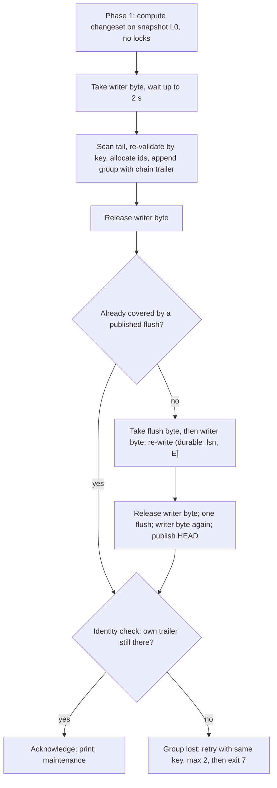

# 5. Процессы, конкурентность, аренды, координация и долговечность

## 5.1 Модель процессов: встраиваемое хранилище без демона

**Что это.** moirai — чисто встраиваемая многопроцессная система (решение T2). Фонового сервиса нет. Каждый вызов `moirai` из Bash агента, из хука или из скрипта оркестратора — отдельный процесс, живущий миллисекунды: он сам открывает файлы хранилища и сам пишет в журнал. Процессы координируются через роль-байты файла `LOCK`, два слота `HEAD` (кэш, который публикуется без flush) и сам журнал. Журнал — истина: под writer-байтом каждый писатель сам сканирует и перепроверяет его хвост по правилу цепочки, включая ожидающие группы других писателей и их chain-трейлеры, и по этому же просканированному журналу проверяет ключ идемпотентности (§5.2, §5.9).

| Процесс | Время жизни | Блокировки |
|---|---|---|
| CLI `moirai` (Bash-вызовы агентов, command-хуки, скрипты оркестратора) | мс | writer-байт только на фазу коммита; flush-байт при любой долговечной записи (групповой коммит, §5.2); liveness-слот на всё время намерения при `file mv`/`file rm` (якорь вида `intent`, §5.4); maintenance-байт для обслуживания, когда порог превышен вдвое |
| `moirai mcp` (один на сессию Claude Code и все её сабагенты; в Codex один на поток) | сессия | то же, плюс собственный байт liveness-слота (§5.4) |
| лидер (опционально, §5.3) | сессия | leader-байт плюс writer- и flush-байты группового коммита |

**Файл `LOCK`** (36 KiB, layout v1, X-F1). Его создают только `init`/`restore`; он никогда не удаляется и не меняет размер. Сами байты-замки лежат за концом файла, начиная с 2^62. Поэтому обязательные (mandatory) byte-range-блокировки Windows не мешают бэкапу, антивирусу или `doctor` читать настоящие байты.

```
Данные LOCK (смещения):
  0      LockHdr (64 B)
  2048   WriterDiag {seq, ProcId, session hash, command, hlc} - кто держит writer-байт
  3072   LeaderRec (резерв; используется, только если лидер построен)
  4096   SlotRec[256] x 128 B {kind, nonce, primary/alias session hash, ProcId, ...}
Байты-замки (без данных, за EOF):
  2^62 + 0 writer | +1 leader | +2 maintenance | +3 quiet-advisory | +4 flush | +5..+63 резерв
  2^62 + 2^16 + i  liveness-слот i, i < 256
Порядок: slot < leader < maintenance < flush < writer
```

Правила замков (X-F4): ждать можно только роль-байт и только «вверх» по порядку; writer-байт самый внутренний — его держатель ничего не ждёт и не делает flush; владение сначала решается внутри процесса (таблица выдачи), поэтому два клиента одного процесса конфликтуют одинаково на всех ОС; справедливость в контракт не входит — гарантируются только граница ожидания и exit 7 с именем держателя.

**Ожидание писателя (G1)** блокирующее и ограниченное, без sleep-backoff. На Windows это overlapped `LockFileEx` с `WaitForSingleObject(2 s)` и `CancelIoEx`. На Linux и macOS отдельный поток-ожидатель блокируется в `F_OFD_SETLKW` на собственном open file description. По таймауту процесс завершается с exit 7 и называет держателя из `WriterDiag`, а также печатает живость его якоря (§5.4).

**Читатели не берут блокировок.** Корректность обеспечивают неизменяемые сегменты, граница видимости `committed_lsn` и монотонный `seq`. Кэш процесса обновляется переигрыванием хвоста до `committed_lsn`. Сбрасывать его целиком не нужно: запечатанные сегменты не меняются. Гейт: p99 чтения во время всплеска 16 писателей ≤ 2× от значения в простое (GT11, M1).

**Трёхфазная запись** (§4.5):
1. Changeset вычисляется по снимку до взятия замка.
2. Под writer-байтом процесс только сканирует хвост, перепроверяет изменения по ключам и дописывает запись (плюс короткая публикация). Flush выполняется вне writer-байта.
3. Печать и обслуживание — после освобождения замка.

Если прочитанное за время фазы 1 не изменилось, кандидат переподвешивается за O(1); иначе пересчитывается под замком или фаза 1 повторяется (до двух раз), затем exit 4. Writer-байт удерживается десятки мкс для простой записи. Гейт для любого класса глаголов, включая merge, sync и `TX`: p99 ≤ 5 мс, максимум ≤ 20 мс.

**Ноль CPU в простое.** Ни у одного процесса нет таймеров, и никакой поток не работает вне команды; исключения (рабочие потоки явных массовых глаголов R4 `links check|sync --all`, `--deep`, и поток-ожидатель замка на Unix со стеком 64 KiB) заканчиваются вместе с командой. У MCP-сервера не более двух потоков ОС — runtime и читатель stdin, в простое оба заблокированы.

**Что отвергнуто:**
- *Демон на репозиторий.* Демоны — повторяющаяся причина отказов у аналогов (Beads удалил около 24 тыс. строк кода демона, а потом снова предложил его; у Windows-демона Claude Code есть ошибка с pipe). К тому же демон не избавляет от запуска CLI и экономит лишь около 1 мс на открытии.
- *Лидер в v1 по умолчанию.* Он заранее тянет в протокол безопасность pipe, форвардинг и failover, хотя ни одно измерение пока не показало, что они нужны.
- *Ожидание со sleep-backoff.* При всплеске из 16 агентов возникает конвой, p99 100–300 мс (оценка).

**Заморожено в M0:** X-F1 и X-F4. По X-F11 раскладка и порядок замков никогда не станут ключами конфигурации. **Ключи:** `lock.writer-wait-ms` (2 000), `maintenance.cli-threshold-multiplier` (2). **Веха:** M1 — Windows-реализация `LockBytes` и трёхфазная запись. Измерения M0: п. 12 проверяет границу 2 с по задержке освобождения замка после `TerminateProcess`, п. 22 — сами байты-замки.

_Источники: AR §2.2, §2.8, §4.1, §4.5, §6.1, §8.3; [80 §2.1–§2.2, §3.1]_

## 5.2 Долговечность: классы и групповой коммит без лидера

**Классы долговечности** (T8, §6.5):

| Класс | Что в него входит | Гарантия | Вызов: Windows / Linux / macOS |
|---|---|---|---|
| `durable` | любая мутация графа, `claim`/`complete`/`release`, `rm`, движения ref, `ClientHead`, маркеры `settled`/`deleted`/`cleared`, `Idem`, `Pin`, `GitMap`, `Checkpoint`, пакеты `apply` (один flush на пакет) | подтверждается только после покрывающего flush, его публикации и проверки идентичности; до публикации покрывающего flush невидим читателям; переживает потерю питания | `NtFlushBuffersFileEx(FLUSH_FLAGS_FILE_DATA_SYNC_ONLY)` / `fdatasync` / `fcntl(F_FULLFSYNC)` |
| `lazy` | виды из `durability.lazy-kinds` (heartbeats, курсоры чтения, session marks) и runtime-свидетельства R4 | публикуется сразу, если нет ожидающей durable-группы, иначе — публикацией покрывающего flush; после публикации виден всем и переживает падение процесса, но может потеряться при потере питания, падении ОС или неудачном flush в любом процессе (задокументировано) | запись без flush; сбрасывается следующим покрывающим flush |
| `durable+meta` | создание экстентов, изменение размера, барьер `HEAD` (вне writer-байта) | как `durable`, плюс размер и выделение места | `FlushFileBuffers` / `fsync` / `F_FULLFSYNC` |
| `durable-name` | create, rename или unlink, от которых зависит долговечная запись | операция с именем переживает потерю питания | flush каталога-родителя (`sync_dir`) |

Мутации графа всегда `durable`. Это правило проекта, а не ключ: `durability.lazy-kinds` выбирается только из {heartbeat, cursor, session-mark}. **Понижения класса нет:** если место хранения не может дать класс (`ENOTSUP`, файловая система не из списка разрешённых), хранилище не открывается. На macOS класс `durable` всегда использует `F_FULLFSYNC` и никогда не обходится простым `fsync` или `F_BARRIERFSYNC`: они дают только упорядочивание, а данные остаются в кэше диска. Простой `fsync` встречается только в `durable-name` (`fsync(dirfd)`) и в `sync_group` (`fsync` каждого члена), и там за ним всегда следует `F_FULLFSYNC`.

**Видимость.** Читатели никогда не видят durable-группу, пока не опубликован покрывающий её flush: долговечный коммит невидим другим процессам, пока он не сброшен. Lazy-группа публикуется сразу (`committed_lsn` = её конец), только если нет ожидающей durable-группы; иначе она ждёт публикации покрывающего flush.

**1PC+C: `HEAD` на пути коммита не сбрасывается.** Журнал — истина, `HEAD` — кэш. Поэтому в `HEAD` хранятся `durable_lsn` (конец последней сброшенной группы) и `boot_id`. После перезагрузки первый процесс восстанавливает хранилище от `min(durable_lsn, checkpoint_lsn)`: переписывает и сбрасывает хвост, один раз сбрасывает `HEAD` и только после этого что-либо читает. Так ни один читатель не увидит состояние, которое было до краша. Если процессу не удаётся прочитать идентичность загрузки (например, в песочнице), он работает в режиме Unknown-boot: не выполняет восстановление и не переписывает `boot_id`, а опирается на правила валидности записей. Его писатели сканируют журнал до конца и при своём следующем flush публикуют подтверждённую, но неопубликованную группу (её публикация потерялась при падении ОС). Единственная потеря: пока не запустится такой писатель или процесс вне песочницы (MCP-сервер, хук), этот коммит остаётся невидимым для читателей этого процесса. Дедлайны аренд в этом режиме решает стенная компонента (§5.4).

**Групповой коммит без лидера** (X-F3, одинаковый для всех ОС). Дописав свою группу, писатель выполняет шаги:
1. Читает `HEAD`. Если опубликованный flush уже покрыл его группу, переходит к шагу 5.
2. Берёт **flush-байт** (`lock.flush-wait-ms`, 2 с), затем writer-байт. При таймауте — exit 7 с исходом `pending`: группа уже дописана, и повтор с тем же ключом завершит коммит.
3. Под writer-байтом сканирует диапазон `(durable_lsn, E]` и **переписывает** каждый его байт из буфера сканирования. Так чинится предшественник, который умер или чей flush не удался.
4. Отпускает writer-байт и делает **один** flush — за всех, кто дописал свои группы до его начала. Затем снова берёт writer-байт и публикует `HEAD` операцией read-modify-write над новейшим слотом, сворачивая в него эффекты всех покрытых групп.
5. **Проверка идентичности.** Читает 8-байтовый chain-трейлер своей группы. Если трейлер совпал, коммит подтверждается. Если нет, группа потеряна: после чужого неудачного flush страницы откатились, были инвалидированы или вытеснены. Тогда запись повторяется с тем же ключом идемпотентности (не более двух раз), а затем — exit 7 `outcome unknown`.

**Таймера накопления нет:** flush покрывает всё, что было дописано к моменту его начала. Поэтому групповой коммит совместим с нулевым CPU в простое и отсутствием таймеров (§5.10).

Каждая группа заканчивается трейлером `chain`. Это XXH3-64 по байтам группы с затравкой из предыдущего значения цепочки. Поэтому группа валидна только за тем предшественником, с которым её проверял писатель. Если flush не удался, процесс завершается; повторного flush на том же дескрипторе нет. Следующий держатель flush-байта не просто повторяет сброс, а переписывает диапазон. Экстенты журнала по 64 MiB создаются так, что байты за хвостом читаются как нули; на NTFS для этого записываются нули и выполняется один `FlushFileBuffers` (G11).



**Числа:**

| Показатель | Значение |
|---|---|
| Нижняя граница времени flush на Windows | 0,45–2,0 мс p50 (измерено) |
| Долговечный коммит | p50 ≤ нижняя граница flush + 0,5 мс (гейт M1) |
| Число flush на коммит | ≤ 1; ровно 1 при одиночном писателе; ≤ 3 на всплеск из 16 писателей |
| Последнее подтверждение при 16 писателях | гейт на Windows: p99 ≤ 50 мс; ≈ 4–8 мс на NVMe владельца (оценка); ≈ 25–35 мс p99 на современных Apple silicon и ≈ 40–60 мс на M1 (оценка, [80 §2.4.2]) |
| Гейт для портов | p99 ≤ max(50 мс, 3 × p99 flush + 5 мс); `F_FULLFSYNC` — 3,1–3,9 мс p50 и 11,6 мс p99 на M3/M5, ≈ 17–20 мс на M1 (заявлено) |

**Что отвергнуто:**
- *Последовательный flush внутри writer-байта* (прежняя позиция T8). Это 16 flush на всплеск: 50–65 мс p50 на современных Mac и ≈ 300 мс на M1 (заявлено). Гейт 50 мс не проходит.
- *Групповой коммит только через лидера.* CLI в песочницах до лидера не достучатся: на Linux seccomp блокирует `AF_UNIX`, на macOS мешает Seatbelt.
- *Параллельные flush без flush-байта.* Устройство получает больше flush. Кроме того, на macOS успешный flush после чужого неудачного может оставить диапазон потерянным.
- *Подтверждение по позиции LSN.* После неудачного flush по той же позиции может оказаться чужая группа.
- *`FILE_FLAG_WRITE_THROUGH`* (0,14 мс): на потребительских дисках ему нельзя доверять.
- *`O_DIRECT` + `RWF_DSYNC`*: требует выравнивания групп по блокам, то есть изменения формата.

**Условия пересмотра:** p99 последнего подтверждения при 16 писателях выше гейта ОС даже с групповым коммитом — форвардинг через лидера для клиентов вне песочницы; согласие владельца на окно потери 100 мс — все коммиты `lazy` с дедлайном.

**Проверка.** Перечислитель крашей должен находить тринадцать внесённых ошибок группового коммита начиная с M0. Далее работают гейты GT1 (перечисление крашей, ≥ 10⁵ состояний), GT3 (многопроцессная симуляция, ≥ 10⁶ шагов), GT4 (kill loop, 10 000 итераций в каждом из трёх вариантов) и GT15 (≥ 1 000 циклов краша ОС к выходу из M1).

**Заморожено в M0:** X-F3 (протокол и трейлер `group_end`), X-F5 (теги классов и модель отказов), поля `HEAD` `durable_lsn` и `boot_id`. Отображение классов на вызовы ОС никогда не станет ключом. **Ключи:** `durability.lazy-kinds`, `lock.flush-wait-ms` (2 000). **Веха:** M1. Решающие измерения M0: п. 1 (Defender), п. 2 (16 писателей), п. 18 (неудачный flush), п. 22 (идентичность загрузки).

> ⚠ **Расхождение в документах:** в §8.3 (AR:1946) и T8 (AR:198) цифры по macOS/Linux помечены `[C]` в смысле «заявлено» (легенда [80]), а T8 (AR:198) вдобавок помечает сведения из документации вендора тегом `[D, X17 §3.1]`. По соглашениям AR (AR:59, V16 на AR:2559) одиночные буквы [A]–[D] означают только предложения A–D и никогда не класс источника; для документации вендора предусмотрен `[doc]`. Здесь такие цифры помечены «заявлено».

> ⚠ **Расхождение в документах:** последнее подтверждение при 16 писателях на Apple silicon оценено по-разному. §6.1 (AR:1330) и [80 §2.4.2] (80:257) дают ≈ 25–35 мс p99 на современных Mac, а [80] для M1 — ≈ 40–60 мс. Заметки по ОС в таблице §8.3 (AR:1947) дают ≈ 40 мс на M3/M5 и ≈ 65–80 мс на M1 (оценка). Гейт порта (p99 ≤ max(50 мс, 3 × p99 flush + 5 мс)) от этого не меняется.

> ✅ **На согласование:** контракт долговечности. Каждая мутация графа подтверждается только после долговечного сброса (flush) и до публикации покрывающего flush невидима другим процессам; это правило, а не ключ. Heartbeats, курсоры и session marks (`lazy`) могут потеряться при потере питания, падении ОС или неудачном flush. Понижения класса нет: хранилище не откроется на ФС или томе, которые не дают нужный класс. Неудачный flush завершает процесс.

_Источники: AR §2.8, §4.2, §4.5, §6.1, §6.5, §8.3; [80 §2.3–§2.4, §2.7.1, §3.1]_

## 5.3 MCP-сервер как долгоживущий клиент и опциональный лидер

**MCP-сервер** `moirai mcp` — обычный клиент хранилища, только долгоживущий. Он обслуживает все запросы сессии и работает как обработчик каждого `mcp_tool`-хука. Хранилище открывается лениво, при первом вызове инструмента (≤ 1,5 мс при 1e5 узлов). Что сервер держит «тёплым»:
- отображения сегментов;
- оверлей `main`;
- LRU оверлеев веток, ограниченный по байтам: `mcp.overlay-bytes` 4 MiB, не более 8 оверлеев (`mcp.overlay-lru`, G19). Вытесненная линия пересобирается за 1–3 мс.

Структуры на запрос живут в регион-арене, которая освобождается целиком в конце запроса. Обслуживание сервер ведёт сам — возобновляемыми кусками не длиннее 5 мс между запросами: дельта-чекпоинты, продвижения (promotion), settle. `links_sync` ограничен 200 мс на вызов. Rollup сервер не запускает никогда: он порождает отдельный процесс `moirai gc --rollup --if-needed`. Сервер завершается и при EOF на stdin, и при выходе родительского процесса. Родителя он отслеживает событийно, без таймеров: на Windows — handle процесса, на Linux — `pidfd_open`, на macOS — `kqueue`. Поэтому его liveness-слот живёт ровно столько, сколько сессия.

В Codex сервер запускается на каждый поток, и часть серверов висит после закрытия сабагента; профиль `codex` (`mcp.overlay-bytes.codex = 0`) освобождает всё в конце запроса, так что сервер в простое занимает ≤ 3 MB. Гейты M10: у сервера Claude Code steady RSS ≤ 8 MB + 4 MiB, пик ≤ 16 MB; MCP p99 ≤ 25 мс при всплеске, когда ожидает обслуживание.

**Опциональный лидер.** Это процесс с leader-байтом и точкой IPC, опубликованной в `LOCK` (`LeaderRec`):
- на Windows — именованный pipe с DACL на пользователя, `FILE_FLAG_FIRST_PIPE_INSTANCE` и `PIPE_REJECT_REMOTE_CLIENTS`;
- на Linux и macOS — Unix-сокет по пути в каталоге пользователя с правами 0700.

Лидер умеет рассылать изменения и форвардить записи с 128-битным ключом, который генерирует клиент (G13). Групповой коммит **не** является функцией лидера. Клиенты в песочнице всегда идут прямым путём, а он полноценен. Лидер **никогда не нужен для корректности**. Он строится только если этого потребуют измерения M0: п. 1 (стоимость закрытия файла под Defender, G8: CLI-коммиты > 20 мс) и п. 2/14 (ожидание при 16 писателях с G1). Тогда он входит в M1 вместе с протоколом, который меняет; это +3–4 units, не заложенные в календарь. Изменение после M1 заново открывает M1 и перезапускает его гейты. Без лидера не строятся push-лента и `watch`.

**Условия пересмотра T2:** p99 ожидания писателя > 50 мс при 16 писателях уже с G1 и групповым коммитом; p50 инструмента MCP > 5 мс из-за догоняния оверлея; CLI-коммиты > 20 мс по измерению Defender; появление в харнессе push-канала, который доходит до модели.

> ✅ **На согласование:** встраиваемая модель без демона. Лидер, push-лента и `watch` не строятся, если измерения M0 (пп. 1, 2, 14) их не потребуют. Если потребуют, лидер входит в M1 и стоит +3–4 units сверх календаря. Решение принимается по измерению, а не владельцем.

_Источники: AR §2.2, §6.1, §6.3, §9 (M1, M10); [80 §2.7.2, §2.8]; [90 §4.5]_

## 5.4 Аренды (leases), fencing-токены и живость держателя

**Захват.** `claim 12 [--branch R] --agent A [--ttl 15m|run] [--start]` — один долговечный коммит, который пишет **только запись `Lease`** (CL5). Условия: задача жива и готова (`ready`) на ветке R, то есть на ней нет чужой живой аренды и нет непоглощённого маркера `settled`/`deleted`; `gates` на `claim` не влияют. Версионируемый статус не меняется, пока не указан `--start` (он добавляет `open → in_progress`). Без `--start` этот переход выполняет первый `set` или `complete` под арендой. Результат: `{lease: L-<n>, token: <fence>, branch: R, expires}`. Повторный `claim` тем же держателем идемпотентен. В строку аренды копируются globs `files_owned` задачи, поэтому список «не трогать» в контекст-паке читается из одной таблицы `LEASES`.

**Fencing.** Токен выдаётся монотонно на всё хранилище (`HEAD.fence`), и истечение аренды его не увеличивает. Тот же держатель может продлить истёкшую, но никем не перехваченную аренду (I17′). `complete`, `set --lease` и `release` обязаны предъявить аренду. Устаревший токен даёт exit 5 с именем текущего держателя. Кроме того, любая мутация принимает CAS-условия `--if-rev`, `--if-status`, `--if-holder`, `--if-tip`. Если условие не выполнено, команда возвращает exit 4, текущее значение, что изменилось и кем.

**Сроки.**
- Самозахват живёт 15 мин (`lease.ttl-default`).
- Захват диспетчером — на прогон (`--ttl run`): многочасовым прогонам владельца 60 минут мало. Такую аренду освобождает **только** `apply` (для аренд своего пакета), `run close` или явный `reclaim --run`/`--older-than` (`lease.reclaim-older-than` 30 мин). moirai не следит за живостью фоновых задач харнесса, потому что для этого понадобился бы поллинг.
- `heartbeat` — lazy-запись. Любая запись, предъявляющая аренду с TTL, продлевает дедлайн, если прошло больше половины TTL. Поэтому самозахват без MCP живёт, пока держатель пишет. Держатель, который работает дольше TTL без единой записи в moirai, выполняет `moirai heartbeat L`; этому учит блок `AGENTS.md` из C0.
- `SubagentStop` снимает или помечает аренды, которые держит останавливающийся `agent_id`, — только там, где этот хук срабатывает; агентов Workflow покрывает правило аренд на прогон.

**Живость держателя** ([72 B2]; проверяется при чтении, без поллинга). CLI завершается примерно через 0,2 с после `claim`, а в песочнице Linux каждая команда получает свой PID namespace, поэтому аренда ссылается не на процесс, а на **якорь держателя** (32 B):
- MCP-сервер сессии держит один liveness-слот `LOCK` всю свою жизнь и пишет по смещению 4096 запись `{kind, nonce, primary session hash, alias hash, ProcId}`.
- CLI или хук одним `pread` читает таблицу слотов и ищет свою идентичность харнесса: `CLAUDE_CODE_SESSION_ID` для Claude Code, `CODEX_THREAD_ID` для Codex. Идентичность хешируется с пространством имён `<harness>:<id>`.
- После `/clear` хук `SessionStart(clear)` записывает новый id как alias, а аренда хранит primary, поэтому переживает любое число очисток.
- У серверов Codex якорь `session-ttl`: аренда жива, пока слот занят **и** не прошёл дедлайн, который продлевают вызовы самого потока. Поэтому аренды повисшего сервера истекают.
- Без идентичности харнесса или без сервера якорь `none`: аренда живёт по TTL или по прогону.

| Состояние | Когда |
|---|---|
| Alive | загрузка совпадает (или проверяющему неизвестна), и занятый слот с валидной записью называет primary-сессию |
| Dead | загрузка другая, или ни одна запись занятого слота не называет сессию |
| Unknown | `LOCK` нельзя прочитать или проверить (`ERROR_ACCESS_DENIED`, `EPERM` из песочницы) |

**Unknown никогда не завершает аренду досрочно.** Завершить её могут только дедлайн, окончание прогона или `reclaim`. Поле `expires = {wall, boot_hash, mono}`, где `mono` — часы загрузки, которые идут и во сне. В пределах одной загрузки решает `mono`, поэтому переводы стенных часов ни на что не влияют. Процесс в режиме Unknown-boot (§5.2) судит о дедлайне по стенной компоненте `wall`. После перезагрузки все аренды, кроме привязанных к прогону, становятся Dead и снимаются при первом чтении со строкой триажа. `FsIntent` использует якорь вида `intent`: слот держит CLI, выполняющий `file mv`/`file rm`. Проверка слота на Windows — 2–9 мкс (измерено); 256 слотов при 16–50 держателях — заполнение ≤ 0,2.

**Нехватка слотов.** Сервер берёт первый свободный слот, начиная с `hash(session) mod 256`, намерение — с `hash(nonce) mod 256`. Если все 256 слотов заняты, сервер работает без слота и его аренды получают якорь `none`, а `file mv` завершается с exit 7 «no liveness slot free». `doctor agents` сообщает занятость слотов и кандидатов в утёкшие серверы (сервер потока Codex, который держит слот, хотя все аренды на его якоре истекли).

**Виды аренд и права** ([90 §4.3]): аренда задачи; ролевая аренда на прогон (`claim --role R --run ID`); сессионная ролевая аренда оркестратора (`claim --role orchestrator --session`). Для неё `lease.orchestrator-ttl` (12 ч с продлением использованием) действует только там, где сессионную аренду не держит слот; там, где харнесс называет потоки (Codex), она привязана к потоку, который её выпустил. Права на запись дают **только предъявленные аренды**. Вызывающий без аренды получает строку `general-purpose`, а метки хуков права только сужают. Это защита от честных ошибок, а не от враждебного агента.

**`complete 12 --lease L --outcome done|failed|abandoned --summary - [--evidence …]`** пишет `done` на ветке аренды, освобождает аренду **в маркер `settled`** и возвращает задачи, ставшие готовыми на этой ветке. `complete` из `open` — составной переход `open → in_progress → done` в одном коммите. Если вызывающий передаёт дайджест, который напечатал его контекст-пак, ответ дополнительно перечисляет критические правила, решения владельца и блокеры, изменившиеся с этого пака (`pack.staleness-notice`). Settle ссылок завершённого поддерева идёт отдельным коммитом под CAS-условием (§5e.3), поэтому CLI `complete` и MCP `write{tx: CALL tx.complete(…)}` дают один и тот же коммит. Пока открыт дочерний узел или задачу блокирует вердикт `fail_*`, команда отказывает с exit 6. Мьютексы (слот бенчмарка, очередь слияний) — это задачи с `work_kind = mutex` и той же семантикой аренд.

**Почему аренды — runtime уровня хранилища, а не история.** Аренда ключуется по `#N` и видна со всех веток. `claim` проверяет готовность на ветке захватчика и запоминает её; `complete` и `set --lease` пишут на ветку аренды, а `--move-lease` требует явной ветки и предупреждает. Отвергнуты два варианта. *Версионируемые аренды:* после слияния линии аренда стала бы захватом от, возможно, мёртвого процесса, а на `plan/*` не имела бы смысла. *Аренды на ветку:* две параллельные ветки обе стали бы собирать #12. `rm` отказывает, пока на `#N` есть живая аренда на любой ветке, если не указан `--release` (I32′). Это правило, а не ключ. При удалении ветки её аренды снимаются с записью для триажа. История аренд не хранится (#30). Условие пересмотра: владелец захочет параллельные what-if-ветки на одну задачу. Тогда ключ станет `(#N, ref_sym)` с предупреждением между ветками, без изменения стоимости.

**Заморожено в M0:** раскладка `LEASES` (якорь, `expires`, globs; виды, роль, `bound` по [90 §10.1]), X-F2 вместе с поправкой [90]. **Ключи:** `lease.ttl-default` (15m), `lease.reclaim-older-than` (30m), `lease.orchestrator-ttl` (12 ч, продлевается использованием; только где сессионную аренду не держит слот). **Данные политики** (строки схемы, версионируются по веткам, hot; меняются как версионируемые данные, а не как ключи конфигурации): `policy.self-claim-roles` (`developer`, `tester`; самозахват без роли — `developer`), `policy.mint.role-lease` (`orchestrator`, `owner`). **Вехи:** M1 — слоты `LOCK` и трёхзначная живость; M2 — аренды с fencing, TTL и прогоном (GT18 «lease liveness»); M8 — CLI-глаголы видов аренд и политика выдачи; M10 — слот держит MCP-сервер, `session-ttl`.

> ⚠ **Расхождение в документах:** строка `LEASES` в §4.4 (AR:694) и в §5d.1 (AR:1203) не содержит полей `kind`, `role`, `bound` и корневой сессии и ключуется только по `#N`. При этом §4.6 (AR:779) и [90 §10.1] (90:729) резервируют эти поля в формате v1, а у ролевых аренд нет `#N` задачи.

> ⚠ **Расхождение в документах:** X-F2 в [80] (80:633, 80:425) перечисляет виды якоря 0 none, 1 session, 2 intent, 3 leader, без `session-ttl`, и хранит в 32-байтовой записи якоря `session_hash u64`. Поправка [90 §4.4]/§10.1 (90:386, 90:730) требует BLAKE3-128 от `<harness>:<id>` и ленивый захват слота. AR §4.6 (AR:779) резервирует идентичность с пространством имён и ленивые слоты, но ширину хеша не называет. В [80] поправка не внесена.

> ⚠ **Расхождение в документах:** [90 §10.2] (90:745) относит виды аренд, якоря и `bound` в `LEASES` к M2 без units, а AR §9 (AR:1979) — к M8.

> ✅ **На согласование:** до заморозки формата v1 в M0 нужно устранить три расхождения выше. Раскладку `LEASES` в §4.4/§5d.1 и X-F2 в [80] нужно привести к резервированию AR §4.6 и [90 §10.1]. Для видов аренд нужно выбрать одну веху (M2 по [90] или M8 по AR §9) и учесть её в units.

> ✅ **На согласование:** аренды ведутся на уровне хранилища по `#N`, без версий и без привязки к ветке. Живость проверяется по слоту MCP-сервера, и Unknown никогда не снимает аренду. Аренды на прогон снимаются только `apply`, `run close` или `reclaim`: moirai сознательно не следит за фоновыми задачами харнесса.

_Источники: AR §2.16, §5d.1, §6.2, §9, §13; [80 §2.7.1–§2.7.2]; [90 §2.3, §4.3–§4.4, §10.1–§10.2]_

## 5.5 Версионируемое и runtime-состояние; маркеры `settled`/`deleted` и векторы absorbed

**Принцип (T16).** Всё, что составляет историю, версионируется по веткам: узлы, все типизированные поля, включая `status`/`done`/`resolution`/`assignee`/`phase_state`, все рёбра, включая `blocks`/`gates`/`parent`, тела, схема, значения конфликтов, `rev_seq`. Runtime уровня хранилища допускается только с обоснованием «кто что делает или сделал сейчас». Сюда входят:
- refs, теги, reflog и клиентские heads — указатели версий, которые хранятся на уровне хранилища; они экспортируются с образом (`--with-oplog` для heads и reflog);
- аренды, fencing-токены, результаты идемпотентности, `seq` ленты изменений и курсоры;
- `next_id`, привязки клиентских HEAD (`session:<id>` истекают вместе с окном идемпотентности), флаг quiet, пины, `gitmap`, карта алиасов, кэш предков;
- таблицы разрешения и свидетельств R4 (`TREES`, `FILEOBS`, `PENDING`, `FSINTENT` и др.): записи `FsIntent` долговечны (прерванный `file mv`/`rm` восстанавливается, а не теряется), остальные lazy и выводимы; их пишут только settle, файловые глаголы и хуки свидетельств, но никогда не чтения (I-F5); они никогда не версионируются, не сливаются, не хешируются и не экспортируются (I-F4);
- `ALLOC`/`UIDX` R5: какая ветка выделила `#N`; один `#N` на производный uid ещё до слияния (I1).

`claimed` — производное от таблицы аренд, а не версионируемый флаг. Ни маркеры, ни аренды никогда не экспортируются (I36′); импортирующее хранилище выводит их заново из импортированных операций.

**Маркер `settled`** `{#N, ref_id, ref_seq, commit, holder, outcome, hlc, seq}` пишет исполнитель операций для **каждого** `SetStatus{→ done|cancelled}` задачи. Неважно, какой путь к этому привёл: `complete`, `set --done`, `set --status`, MCP `write`, `apply`, cherry-pick, revert, merge, sync или импорт образа («десять дверей», CB3). На любой ветке R, которая ещё не поглотила маркер, `ready`/`claim`/`blocking`/`brief` видят `#N` как `done on <branch> (c…, unmerged)`: задачу нельзя захватить, и она не считается живым блокером. Жизненный цикл маркера:
- **поглощён** — для своей ветки сразу, для `main` при слиянии, для других линий при следующем `sync`;
- **заменён** маркером `cleared` с областью `(#N, ref_id)` при `reopen` или `Undelete`;
- **пересчитан** при `undo`, `op restore` и `branch -D` — очищен, выпущен заново или переписан на живой форк, содержащий коммит, каждый раз со строкой триажа.

Маркер **`deleted`** `{#N, ref_id, ref_seq, commit, seq}` работает так же для каждой операции `Delete`.

**Векторы absorbed.** `absorbed_R[ref_id]` — наибольший `ref_seq` этого ref, достижимый из `tip(R)`. Вектор хранится в таблице ref и обновляется так:
- коммит на R ставит `absorbed_R[R]`;
- форк Y от X в точке f копирует вектор X и ставит `absorbed_Y[X] = f`;
- merge или sync из src в dst ставит `absorbed_dst[src] = ref_seq(tip src)`, остальные записи берут максимум, так что поглощённое веткой `main` доходит до каждой линии транзитивно;
- `undo` восстанавливает вектор с ближайшей записи merge/sync/fork.

Поиск O(1), ≤ 6 B × число живых ref на каждый ref. Те же числа дают `ahead/behind main` без обхода DAG.

**Определение на состояниях (I26′).** `#N` исключается из `ready`/`claim` на ветке R, если на некотором живом ref X ≠ R вида `work` задача done, cancelled или удалена, а коммит, последним установивший это состояние на X, не является предком `tip(R)` или самим `tip(R)`. Маркеры и векторы — лишь **кэш** этого определения. Эталонная модель вычисляет само определение, а GT18 сверяет движок с ней: ≥ 10⁶ историй, M0 на модели, M3 на движке.

**Стоимость:** около 30 тыс. маркеров в год по 40 B. В `MARKERS` остаются только непоглощённые (десятки). Глобально инертные маркеры на каждом свёртывании чекпоинта уходят в холодный `MARKERS_OLD`. `brief_triage` укладывается в ≤ 50 мкс при 90 тыс. инертных и 100 активных маркерах. `ready` с 50 устаревшими незлитыми завершениями стоит столько же, сколько без них: одна проверка и один поиск в векторе на кандидата. Гейт M2: страница `ready` ≤ 300 мкс при 1e5 и 50 устаревших маркерах.

**Зачем это нужно.** Аренда предотвращает двойную работу, *пока она жива*. Маркер `settled` предотвращает её *после* того, как `complete` освободил аренду, но до слияния. Именно на этом месте провалилось утверждение предложения D, что «двойная работа невозможна» (N2/D1). По решению владельца #1: изоляция веток, маркеры, правила `~main` и представления `--across`. Класс полей `shared` не строится; выбрать его после релиза — изменение формата v2.

**Заморожено в M0:** раскладки `MARKERS`/`MARKERS_OLD` (ключ маркера `(#N, ref_id, commit)`), вектор absorbed в теле коммита, виды записей `Lease`, `Marker` (settled/deleted/cleared) и `Idem`, `ALLOC` с uid и `UIDX`. **Вехи:** M2 — маркеры от исполнителя операций на всех путях; M3 — §5d целиком (векторы, пересчёт при движениях ref, GT18 через десять дверей).

> ✅ **На согласование:** координация между ветками строится на изоляции, маркерах `settled`/`deleted`, векторах absorbed и представлениях `--across` (решение #1). Класса `shared` нет. Удаление или завершение на одной ветке никогда не **меняет** другую ветку, но и не даёт ей повторно выдать задачу в работу.

_Источники: AR §2.16, §3.4 (I26′, I36′), §4.4, §5d.1; [60 §3.3–§3.4]_

## 5.6 Статус задач и `done` между ветками и при слиянии

- **`status` версионируется**; виртуальное `done` задачи означает `status ∈ {done, cancelled}` (§3). Задача, завершённая на `lane/x`, — `done` на `lane/x` и `settled` на всех остальных ветках. `main` узнаёт о ней при `merge lane/x --into main` по решётке `done > in_progress > open`. Сочетания `cancelled`/`deferred`/`frozen` против `done` дают конфликт `StatusFork`, молчаливого выбора нет. Завершения из `main` линия получает при `sync`.
- **`blocks` между ветками.** `ready(B)` на ветке R учитывает и то, как R видит статус A, и маркеры. Если A закрыта на `lane/x`, а B живёт на `lane/y`, B станет готовой на `lane/y` после цепочки `lane/x → main → lane/y` (или прямого перекрёстного слияния). До этого `blockers #B --across` печатает `A: done on lane/x (c4470, not merged into your branch)`, а `ready`/`blocking` на `main` не показывают A живым блокером и не выдают её повторно. Хуки добавляют одну строку `behind main by N commits (k completions, m rules, j deletions touching your nodes)`, только если счётчики изменились.
- **`reopen`** — явная операция. Её слияние против `done` с другой стороны — `StatusFork`.
- **`gates` версионируются**, как `blocks`. Вердикт критика `fail_fixable`, записанный на `lane/x`, блокирует завершение на `lane/x`. Выдача задач идёт на ветке линии (`ready --branch lane/x`), а оркестратор видит вердикт из `main` через `--across`.
- **Правила и решения владельца**, записанные на `main`, приходят в линии при `sync`. До этого каждый контекст-пак показывает незлитые критические правила с пометкой `~main`: ветвление не скрывает решения владельца.
- На ветках `plan/*` поля `status`/`resolution`/`assignee` и захваты только для чтения, а `blocks`/`parent`/`gates` можно менять с валидацией (I33′). `undo` по умолчанию требует `--expect <tip>`.

_Источники: AR §5d.2, §2.16; §3.4 (I33′)_

## 5.7 История «узел 40»: внутри ветки и между ветками

**Внутри одной ветки** удаление — это один коммит:
1. Писатель проходит обратный список #40 за O(degree). Ограничивающие виды рёбер отказывают без `--cascade`/`--reparent`.
2. `blocks`/`gates`, исходящие из #40, перенаправляются через `--replaced-by` или помечаются (X4).
3. Исторические входящие рёбра остаются и указывают на мёртвый id; источники `cites`/`derived_from` получают пометку `suspect`.
4. Надгробие (tombstone) `{40, tx, reason, replaced_by}`, маркер `deleted` и запись ленты с `affected = [12, 77, 203, …]` попадают в одну сброшенную группу.

Три уровня распространения:
- **L1.** Любой другой процесс перед следующей операцией читает `HEAD` и переигрывает запись (мкс). Ссылка на #40 рендерится как `#40 (deleted c812 by dev#2: "dup of #52" → #52)`.
- **L2.** `changes --since` и дельты хуков несут эту строку. Они отфильтрованы по релевантности и ограничены 600 B.
- **L3.** Запись, рассчитанная на живой #40, получает exit 3/4 и текущее значение.

| Случай | Итог |
|---|---|
| `rm 40` на `lane/x`, а `main` и `lane/y` на #40 ссылаются | другие ветки не меняются, но маркер держит #40 вне `ready`/`blocking`/`claim` везде; `show 40 --across` печатает `deleted on lane/x c812 by dev#2 (not merged)`. При слиянии: если `main` только читал #40, побеждает удаление; если менял — конфликт `DeleteVsModify`; если добавил структурное ребро — нарушение `DanglingEdge`, которое ставится на `merge/main/from/lane/x` с подсказкой `resolve … --take repoint:#52` |
| `rm 40` на `main` | линии не меняются до `sync`. Хук сообщает `behind main: 1 deletion touching your #12`, маркер держит #40 вне выдачи. `sync` применяет те же правила; помеченный блокер держит #12 вне `ready` до `resolve` |
| #40 в аренде у `dev#2` на `lane/y` | `rm` **отказывает** (`leased by dev#2 on lane/y (L-19)`). `--release` снимает аренду с записью триажа, прикреплённой к надгробию #40, и продолжает (I32′). При слиянии — `DeleteVsModify`, если `lane/y` меняла #40 |
| `lane/x` удалена без слияния | удаление не доходит до `main`. `branch -D` предупреждает об отброшенных удалениях |
| файл #40 удалён вручную в git-образе | импорт создаёт внешний `Delete{image:file-removed}` на импортированном ref |
| `revert` удаляющего коммита | `Undelete #40` с прежним образом узла; перенаправленные рёбра восстанавливаются, если их цели живы, иначе ставится `NotFound` |

**Гарантия движка** на голове каждой ветки после каждого коммита: ни одно структурное ребро не указывает на мёртвый узел, кроме помеченного блокера, который держит зависимую задачу вне `ready`. Каждый ссылающийся на надгробие узел его рендерит, а производные счётчики равны пересчёту (I2, I12, I9). «Максимальная синхронность» при R1 означает: удаление никогда не *изменяет* чужую ветку; ветка, получившая удаление, применяет его атомарно; любая другая ветка может увидеть удаление по запросу; и ни одна ветка не выдаёт в работу узел, который удалила или завершила другая живая ветка.

**Вехи:** M0 — фикстуры на модели, базовый набор проверяет владелец (GT10), таблицы правил модели подписывает владелец; M2 — таблица на одной ветке; M3 — между ветками.

> ⚠ **Расхождение в документах:** строка таблицы §5d.3 (AR:1234) без оговорок говорит, что `branch -D` очищает маркер `deleted`. По §5a.9 (AR:958) и исправлению M4, `-D` сначала переписывает маркер на живой форк `lane/x`, содержащий удаляющий коммит, и очищает его, только если такого форка нет.

> ✅ **На согласование:** в M0 владелец лично проверяет базовый набор фикстур GT10: инциденты из реестра, таблицу «узел 40» (на одной ветке и между ветками) и сквозной пример [AR §7.6]. Кроме того, к выходу из M0 он подписывает таблицы правил модели: таблицу слияния, машины статусов, матрицу политик удаления, правила слияния ссылок, классы паков и определение состояния I26′ с правилами кэша маркеров. Эта подпись прямо покрывает правила координации §5.5–§5.7. Ожидания пишутся по спецификации.

_Источники: AR §5d.3, §5a.9, §8.3 (GT10), §9 (M0); [60 §3.1, §3.3–§3.4]_

## 5.8 Лента изменений

У каждого коммита есть `seq`, сквозной для всего хранилища. Каждая запись ленты содержит операции, `ref` и `affected`: разблокированные зависимые, ссылающиеся на надгробие, источники с пометкой `suspect`, задачи, ставшие готовыми. Туда же попадают события аренд и маркеров. Движения ref (слияния, `undo`, удаление ветки) — тоже записи ленты. `changes --since <seq> [--branch R|--all] [--about #..] [--for-agent A]` по умолчанию показывает ветку вызывающего ∪ `main`. Последние 32 коммита читаются из `HEAD.seq_ring`, более старые — из индекса коммитов `hist`. Лента фильтруется по релевантности (что агент захватил, чем заблокирован, что создал или процитировал) и печатается по одной строке на изменение. Заголовок каждой команды показывает текущий `seq`.

Файлового наблюдателя нет: на Windows он теряет события. Поллингового процесса тоже нет. Хуки забирают ленту сами на границах `UserPromptSubmit` и `SubagentStart` — не более `hooks.delta.max-commits` (2 000) коммитов и 600 B (`hooks.delta.budget`); остаток уходит в строку `N older changes: moirai changes --since S`. Дельта `PostToolBatch` не строится (решение #41). Push есть только у опционального лидера. Курсоры сессий хранятся в памяти MCP-сервера или в lazy-записях, которые пишутся с try-lock и пропускают продвижение, если writer-байт занят. **Веха:** M2 (лента с `affected`); хуки — M9/M10.

_Источники: AR §6.3, §5d.1; [60 §3.3]_

## 5.9 Идемпотентность и возобновление Workflow

Каждый пишущий глагол и `apply` принимают ключ (в MCP — `idempotency_key`). Писатель хеширует ключ и полезную нагрузку (BLAKE3-128 каждый) и привязывает запись к ветке. Нагрузка — это **канонический связанный AST** блока LQ `TX` со значениями параметров. Форматирование, комментарии, регистр, варианты написания Cypher/GQL, порядок параметров и имена переменных в хеш не входят. Записываются только закоммиченные результаты, поэтому отклонённый блок можно повторить с тем же ключом.

| Повтор | Результат |
|---|---|
| тот же ключ и нагрузка | исходный результат, `replayed: true` |
| другая нагрузка | exit 9 с исходным результатом |
| другая ветка | exit 9, кроме случаев, когда исходная ветка слита в ветку вызывающего или удалена после слияния: тогда успех (N13e) |

Предварительная проверка ключа делается ещё до замка (попадание сразу возвращает сохранённый результат). Окончательная проверка — только после сканирования хвоста под замком, с учётом ожидающих групп (порядок X2/F-B7). Попадание на ожидающую группу возвращается только после её проверки идентичности. Записи живут 30 дней (`idempotency.retention`) и занимают 40 B каждая. Причина такого срока: Workflow, возобновлённый через 7 с лишним дней, перезапускает всех завершённых агентов. Пакет `apply` с локальными `$refs` применяется по принципу «всё или ничего» и получает один ключ на прогон (`run:<id>`). Он попадает на ветку, выведенную из прогона (`run --runs_in--> lane --moirai_branch`), если `--branch` не задаёт другую. Пакет, в котором ветка аренды отличается от ветки пакета, отклоняется до записи (D6). Агенты Workflow используют ключи по хешу содержимого (X3), чтобы повторно запущенный критик с другими находками не получил старые результаты. Для записи без ключа действует **ключ по умолчанию**: BLAKE3 от сессии с пространством имён, потока или агента (или actor) и канонического AST. Он действует `idempotency.default-window` (10 мин; `--no-dedupe` отключает). Упавший процесс печатает `outcome unknown: re-run with the same key or check moirai changes`. **Веха:** M2 (ключ + хеш + ветка, I14′).

_Источники: AR §6.4, §4.5; [60 §3.3]; [90 §4.1]_

## 5.10 Тихий режим и нулевой CPU в простое

`moirai quiet on|off` ставит `HEAD.flags.quiet`. Линия в статусе `measuring` включает его неявно (`quiet.from-lane-measuring`), но явный флаг главнее. В тихом режиме:
- автоматических дельта-чекпоинтов нет, пока хвост не превысит 8× порога (`quiet.tail-cap-multiplier`) или 2 MiB компактного оверлея (`store.tail.max-overlay-bytes.quiet`). После этого всё равно выполняется ровно один ограниченный дельта-чекпоинт (G10);
- нет rollup, продвижений, GC, экспорта и импорта без `--force`;
- MCP-сервер остаётся резидентным при 0 % CPU: его куски обслуживания и дочерний rollup подавлены;
- хуки свидетельств R4 и блоки git-хуков выходят сразу после чтения флага, а `SessionStart` делает только stat — без хеширования, перечисления и записей;
- `links check|sync --deep|--all` отклоняются без `--force`.

Поскольку фоновой работы нет ни в каком режиме, правило простоя из окон бенчмарков владельца [02 §9] выполняется по построению. Флаг лишь подавляет то обслуживание, которое запустил бы активный писатель. Гейты M1: долгоживущий читатель в простое не тратит CPU и не делает переключений контекста за 10 минут (замер начинается через 15 с после последнего запроса); RSS короткоживущего процесса ≤ 4 MB, в том числе при хвосте на пороге тихого режима. Прежний вопрос владельца #12 (классы долговечности и тихие окна) теперь решается ключами конфигурации. **Веха:** M1 (порог G10).

_Источники: AR §6.6, §2.2, §4.5 (шаг 12), §13; [60 §3.2]_
