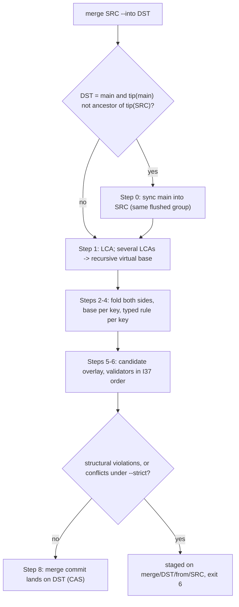

# 6. Собственный контроль версий и ветки (R1, R2)

## 6.1 Обзор: что решено и почему

Требование R1 — полноценное ветвление всего графа, R2 — работа без git и вне git-репозитория. Решение T3′ выполняет R1 буквально: `main` — обычная ветка, и ветвится всё: узлы, поля, рёбра, тела, элементы схемы (включая именованные запросы R5). Ветка — это ref (ссылка ветки) на коммит в едином для всего хранилища DAG коммитов. Форк стоит одну запись в журнал и один пин (pin) чекпоинта: около 2 мс, ничего не копируется (оценка).

Опорные решения раздела:

- **Вид (view) ветки** = запечатанный набор сегментов `main` + операции журнала. Операции ветки находятся через индекс по ref (G15), поэтому первое чтение ветки стоит O(её собственные коммиты + синхронизированные окна `main` с последнего продвижения), а не O(весь трафик хранилища с момента форка).
- **Слияние** — типизированное трёхстороннее, по ключам (T7). Конфликты значений записываются в данные как значения-конфликты, а структурные нарушения никогда не попадают на ветку и откладываются на промежуточный ref `merge/<dst>/from/<src>`.
- **Слияния в `main` всегда идут через sync-first**: сначала `main` вливается в ветку-источник, поэтому на ежедневном пути у слияния один LCA.
- **Аренды (lease) и маркеры `settled`/`deleted`** — рантайм-состояние хранилища, а не история. Они делают двойную раздачу задачи между ветками невозможной (подробно — в разделе о координации). Здесь они упоминаются только там, где их пересчитывают `undo`, `op restore` и `branch -D`.
- **Независимость от git** (T14, §5c): ядро никогда не запускает `git` и не линкует git-библиотеку. Процесс `git` запускается только в четырёх явных необязательных местах.

**Отвергнутые варианты (T3′).**

| Вариант | Почему отвергнут |
|---|---|
| Общий живой ствол + фильтрация по происхождению (proposals A, C; [04 §9.3], [08 §7.2]) | противоречит R1. Оверлеи `exp/*` «перебазируются при чтении» без снимка в точке форка, поэтому каждое чтение стоит O(операции ствола с форка), а у удаления на стволе нет определённой семантики для операции ветки над исчезнувшим узлом [21 §4.1] |
| Две плоскости: координация никогда не ветвится (proposal B) | противоречит R1. Снимок `exp/` на ветку стоит 12–55 МБ при 1e5 узлов (оценка) |
| Автоматическая ветка moirai на каждый git worktree или git-ветку | 44 worktree и 107 веток (подсчёт [08], [22 §11]), многие detached или созданы харнессом: они закрепили бы наборы сегментов и породили бы ритуалы слияния, о которых никто не просил |
| Копировать свёрнутые изменения `main` в каждую линию (lane) при `sync` | рост истории в 3–10 раз при 50 линиях (F-D2, оценка) |

**Условие пересмотра.** Если в какой-то кампании staged-слияния и конфликты `sync` будут занимать основное время оркестратора (даже после N1/N7) или правила из `main` будут хронически не доходить до линий, можно ввести опциональный класс полей `shared`: статус и `blocks` живут в `main` для всех веток. По решению владельца #1 этот класс не строится. Если выбрать его после релиза, это будет изменение формата версии 2 с процедурой обновления, отработанной на релизном гейте. Возврата к «плоскостям» не будет. Индекс G15 можно упростить, если M0 покажет, что сканирование перемешанного журнала занимает < 3 мс на реальных возрастах линий. В формате он остаётся в любом случае, это 8 байт на коммит.

**Вехи** (подробно в 6.16). M1 строит физическую часть. M3 «Version control (R1)» строит всё остальное: 38–45,5 units, 5–9 недель. M4 — собственный слой git-объектов (15,5–22 units, параллельный поток работ от сертификации `Vfs` в M1). M8 — CLI и обнаружение хранилища.

> ✅ **Уже решено владельцем** (2026-09-26, решения #1 и #5 приняты «как рекомендовано»; ответ владельца: «Everything else I approve as you wrote it»): модель веток. Ветка moirai открывается только явно, по одной на линию, через `lane open`, и никогда не создаётся автоматически по git worktree или git-ветке. Scratch- и `wf_*`-worktree пишут в `main`. Координация изолирована по веткам и защищена маркерами `settled`/`deleted`, `~main`-правилами и видами `--across`. Класс `shared` не строится, а его введение после релиза — это формат v2. Нового согласования здесь не требуется: пункт приведён для сведения и нужен, только если вы захотите изменить решение.

_Источники: AR §2.3 (T3′), §9, §11 #1 и #5; [60 §3.2, §3.4, §3.5]_

## 6.2 Объектная модель

| Объект | Идентичность | Содержимое | Где хранится |
|---|---|---|---|
| **коммит** | BLAKE3-256 канонической формы (§4.6); префикс `id16` в индексах; показывается как `c<8 hex>` | заголовок (родители, kind, `gen`, `seq`, `ref`, `ref_old`, `prev_on_ref`, `hlc`, actor, role, session, git-провенанс, idem, `sync_base`, сообщение, версия схемы) + changeset (типизированные операции с before-images) | `log` / `hist` |
| **операция changeset** | позиция в коммите | `Create`, `Delete`, `Undelete`, `SetField`, `SetStatus`, `Incr`, `SetBody`, `AddEdge`, `RemoveEdge`, `SetEdgeProps` (якоря R4), `Move`, `Schema` (включая именованные запросы R5), `Conflict`, `Violation`, `Resolve` | внутри коммита |
| **blob** | BLAKE3-128 сырых байтов | тело, сжатое со словарём | `blobs.NNNN` / хвост журнала |
| **ref** | имя: `main`, `lane/<n>`, `plan/<n>`, `merge/<dst>/from/<src>`, `import/<n>`, `orphans/<n>`, `tags/<n>` | `{ref_id (никогда не переиспользуется), kind, commit_id, lsn, base_pin, fork_commit, fork_seq, ops_since_fork, ref_seq_next, promoted_seg, gen, absorbed[(ref_id, ref_seq)]}` | записи `RefTable` → секция `REFS` |
| **запись reflog** | `(ref, seq)` | коммиты сами несут своё движение ref (`ref`, `ref_old`); прочие движения — записи `RefUpdate {ref, old, new, reason, actor, hlc}` | журнал |
| **client head** | `blake3_16(канонический каталог)` (по компонентам, с именами на диске; каталог ищется сначала по его file id, [80 §2.10] P9), `--client <name>` или `session:<id>` (истекает вместе с окном идемпотентности) | `ClientHead {key, ref \| detached commit, hlc}` | журнал → `HEADS` |
| **тег** | имя под `tags/` | ref вида `tag` с необязательным сообщением; `--pin` закрепляет набор чекпоинта | как ref |
| **пин** | файл сегмента | счётчик ссылок + держатели | записи `Pin` → `PINS` |
| **рантайм-записи** | `#N` | аренда, `settled`, `deleted`, `cleared` | журнал → `LEASES`/`MARKERS` |

Сегменты пути `main`, `lane`, `plan`, `merge`, `import`, `orphans`, `tags` и `from` зарезервированы и не могут быть именами линий и веток. Родители коммита могут лежать на любых refs: DAG общий для всего хранилища. Поэтому ветку можно форкнуть от ветки, `main` можно многократно вливать в линию, а линию — обратно в `main`. Поле `gen = 1 + max(parent.gen)` устроено как generation numbers в git commit-graph и отсекает обходы предков: если `gen(A) ≥ gen(B)`, то A не предок B.

Каждая операция, меняющая значение, несёт before-image (как changeset в SQLite, [04 §3.13]) и дельту `prev` к предыдущей операции узла на этом ref. Благодаря этому история узла — связная цепочка, а `revert` точно обращает операции. Внутри коммита писатель сводит операции по ключу, так что хранится **чистый** changeset. Для всех видов коммитов, кроме `sync`, он совпадает с каноническим списком операций.

**Идентичность коммита.** `commit_id` — это BLAKE3-256 от канонической байтовой кодировки, куда входят: kind, заявленные id родителей, `hlc`, actor/role/session, git-провенанс, сообщение, версия схемы, исходный коммит для revert/cherry-pick, `foreign_git` и чистый changeset (через `changeset_digest`). **Не хэшируются** положение на ветке (`ref`, `ref_id`, `ref_old`, `prev_on_ref`, `ref_seq`), `#N`, `lsn`, `seq`, absorbed-векторы, before-images и операции `Violation`: последние существуют только на staging-refs. Поэтому два хранилища, импортировавшие один образ, получают одинаковые id. У коммита `sync` хранится только остаток (см. 6.5), но хэшируется полный state diff относительно родителя в линии.

_Источники: AR §5a.1, §4.3, §4.6, §5d.1; [80 §2.10]_

## 6.3 Виды веток и маски записи

| Вид | Refs | Что можно писать |
|---|---|---|
| `work` (по умолчанию) | `main`, `lane/*` | всё |
| `plan` | `plan/*` | `status`, `resolution`, `assignee`, аренды и claims — только чтение. Всё остальное, включая `blocks`/`parent`/`gates`, пишется и валидируется (I33′) |
| `merge` / `import` | `merge/<dst>/from/<src>`, `import/<ref>` | промежуточные (staging) refs; пишет только механизм слияния или импорта |
| `tag` | `tags/*` | неизменяемы |

Зачем `plan/*`: это ветка координации, где оркестратор перестраивает структуру зависимостей, но не может «закрыть» работу. Маска отказывает в записи координационных полей ещё в момент записи. Поэтому такие поля никогда не возникают на `plan/*`, и движку слияния не нужно правило `PlanStatusIgnored`. `orphans/<ref>` — служебный ref восстановления: если при воспроизведении журнала CAS движения ref не проходит, коммит паркуется там (I27′).

Правило одной ветки на линию: ветку moirai создаёт `lane open`, и никогда — сама git-ветка или git worktree. Scratch- и `wf_*`-worktree пишут в `main`.

_Источники: AR §5a.1, §2.3, §2.7, §4.5; §3.4 (I33′)_

## 6.4 Как коммит попадает на ветку: refs, CAS, reflog

- **CAS под байтом писателя.** Каждый обычный коммит несёт `ref` и `ref_old`. Посадка коммита — это compare-and-swap записи в таблице refs (`old == ref_old`), выполняемый под байтом писателя (writer byte) в той же публикации. Коммит вычисляется до взятия блокировки (трёхфазная запись §4.5), а под байтом только сканируется хвост, перепроверяется и дописывается. Сброс идёт вне байта, через групповой коммит.
- **Родитель обычной записи — вершина ветки после воспроизведения хвоста под байтом писателя** (G20). Два агента, коммитящие в одну линию, упорядочиваются на байте писателя так же, как на общем стволе, и никогда не падают с ошибкой «кто-то закоммитил раньше». Упасть может только явный guard `--if-tip <commit>`: exit 4 с текущей вершиной.
- **`RefUpdate`** пишется только для движений без коммита: создание и удаление ветки, `tag`, `undo`, `op restore`. Он попадает в ту же сбрасываемую группу, что и сопровождаемый коммит.
- **`ref_seq`** — позиция коммита в цепочке его ref. Он выдаётся из `ref_seq_next` и **никогда не переиспользуется**: `undo` отводит вершину назад, но не сбрасывает счётчик, так что `(ref_id, ref_seq)` навсегда называет один коммит (CM1). «Впереди/позади `main`» считается арифметикой над этими числами, без обхода DAG: `ref_seq(tip main) − absorbed_L[main]` и `ref_seq(tip L) − absorbed_main[L]`.
- **Absorbed-вектор** ref R: `absorbed_R[ref_id]` — наибольший `ref_seq` ref с идентификатором `ref_id`, достижимый из `tip(R)`. Коммит на R ставит `absorbed_R[R]`. Форк Y от X копирует вектор X и ставит `absorbed_Y[X] = f`. Слияние или sync src в dst ставит `absorbed_dst[src] = ref_seq(tip src)`, а остальные записи — в максимум двух сторон. Поиск O(1), ≤ 6 байт × число живых refs на ref.
- **`moirai reflog <ref>`** обходит цепочку ref по `prev_on_ref` и его записи `RefUpdate`. Последние 32 движения каждого ref кэшируются в `REFS`, так что `undo` стоит O(1).

Поля заголовка коммита, которые обслуживают ветвление (формат v1, замораживается в M0):

```
ref u16, ref_id u32      // ветка посадки: символ + никогда не переиспользуемый id
ref_old id16             // вершина, которую коммит заменяет (N3); CAS против таблицы refs
prev_on_ref u64          // lsn предыдущего коммита на том же ref (G15)
ref_seq u32              // позиция в цепочке ref; монотонен, не переиспользуется после undo (CM1)
kind u8                  // ordinary | merge | sync | revert | cherry-pick (хэшируется)
sync_base id16           // только sync/merge: поглощённый коммит src (G17)
n_absorbed u16, absorbed [(ref_id u32, ref_seq u32)]  // только merge/sync; ≤ 300 B при 50 refs
```

_Источники: AR §5a.2, §4.3, §4.5, §5d.1_

## 6.5 Как ветка живёт на движке

```
view(X) = SEG(pin_X)                       // запечатанный набор чекпоинта main при seq P ≤ fork_seq(X)
        ⊕ ops(main, (P, fork_seq(X)])      // операции ствола от чекпоинта до коммита форка
        ⊕ свёртка собственных коммитов X по порядку:
              обычный коммит c  → ops(c)
              sync-коммит s_k   → ops(main, (M_{k-1}, M_k]) ⊕ resolutions(s_k)   // merge-by-reference (G17)
        ⊕ tail(X)                          // оверлей этого процесса для X с последнего воспроизведения
view(Y, форкнутой от X) = view(X)@fork_Y ⊕ ops(Y)   // рекурсивно; продвижение X делает это дешёвым
view(main) = SEG(current) ⊕ tail(main)
```

- **Форк** (`moirai branch lane/l5np [--from main|<commit>]`): одна долговечная запись `RefUpdate` (create) и один инкремент `Pin` на новейшем запечатанном наборе с `upto_seq ≤ fork_seq`. Около 2 мс, без копирования (оценка). Пин не даёт этому набору исчезнуть при последующих rollup-ах `main`.
- **Построение оверлея** при первом чтении X в процессе. Читаются записи `Checkpoint` с последнего продвижения X (несколько КБ каждая, 1–2 в день), собственные коммиты X через `pread` и коммиты `main` окон sync через индекс `main` по ref. Всё декодируется в компактный оверлей. Стоимость — O(коммиты X + коммиты `main` в синхронизированных окнах **с последнего продвижения X**), от трафика других веток она не зависит. Но второе слагаемое — это весь трафик `main` для линии, которая синхронизируется, а линии синхронизируются на каждом чистом `SubagentStart`. Без продвижения 14-дневная линия с ежедневным sync воспроизводила бы 4,2–8,4 тыс. коммитов `main` (10–33 тыс. операций): 30–120 мс и 1,5–5 МБ на первое чтение (оценка, [70 S1], [71 RAM-M1]). С продвижением первое чтение любой линии ≤ 10 мс и оверлей ≤ 1 MiB (гейты M1/M3), свежие линии — 1–3 мс (оценка); построитель идёт потоком через фиксированный буфер.
- **Продвижение (promotion).** Таблица refs за O(1) на коммит и на sync ведёт счётчики `overlay_ops`/`overlay_bytes`: сколько вид должен воспроизвести сверх продвинутого сегмента. X продвигается, то есть пишется `seg.b<ref_id>.K` и `base_pin` переносится на новейший чекпоинт `main`, когда срабатывает любой из порогов:
  - `overlay_ops` > `store.promotion.overlay-ops` — задаётся в M0 из гейта 10 мс, оценка 3 000–5 000 операций;
  - `overlay_bytes` > `store.promotion.overlay-bytes` (1 MiB);
  - X отстаёт от головы более чем на `store.promotion.age-checkpoints` (16) чекпоинтов (G16).

  Sync, пересёкший порог, продвигает ветку в своём процессе после освобождения байта писателя, под байтом обслуживания; держатель обслуживания также продвигает такие ветки на каждом дельта-чекпоинте. Стоимость 10–100 мс и ≤ 8 МБ (оценка), никогда под байтом писателя. После rollup-а продвигаются все ветки на старой базе, поэтому резидентны не более двух баз. `doctor --verify` сверяет pin ⊕ ops с каждым продвинутым сегментом.
- **`sync`** (`merge main --into <lane>`) дописывает в линию sync-коммит с `sync_base = tip(main)` и **только остатком**: ключами, где слитое значение отличается от того, что дало бы одно окно `main`. Это ключи, которых касались обе стороны, плюс результаты односторонней композиции (glob или путь R4 через записанные `path_moves` другой стороны) и перепривязки производных uid. Обычно их десятки. Операции `main` не копируются (G17). Sync проверяет, что окно ⊕ остаток равно каноническому state diff, так что вид линии, канонический список операций, дерево образа и эталонная модель совпадают. История линии растёт только на её собственную работу и остатки: ~0,1–0,2 ГБ/год при 50 линиях вместо 0,2–1 ГБ (оценка, F-D2). Хук применяет чистый sync автоматически, только если тот затрагивает ≤ `hooks.sync-auto-keys` (2 000) ключей, у него ноль конфликтов и ноль нарушений. Иначе хук печатает `behind main: N commits, 1 conflict on #91 -> moirai sync` (D5). `sync --refork` (опционально, только для неэкспортированных линий) вместо этого переносит пин на вершину `main`, если предпросмотр чист и изменения не пересекаются.
- **`merge lane → main`** копирует свёрнутые операции линии в merge-коммит на `main`: так данные попадают на ствол, O(операции линии) один раз на линию.
- **Свёртка стороны от LCA (F-D11, CM9)** — это обход DAG по сегментам цепочек refs. Он начинается у вершины стороны и идёт по `prev_on_ref`. У первого коммита ref обход прыгает на `fork_commit` родительского ref и продолжает по его цепочке. Каждый встреченный sync раскрывается по ссылке в окно `main`. Обход останавливается на LCA. Для Y, форкнутой от X, `merge Y --into main` несёт и сегмент X от `fork_Y` до LCA, то есть слияние идёт с правильной базой.

> ⚠ **Расхождение в документах:** AR:873 (§5a.3) приписывает автоприменению sync в хуке «≤ 8 MB for a lane 14 days behind», но это гейт *явного* sync. Для любого хука, включая автоприменение sync, AR:1845 (§8.3) и AR:2250 (§13, `hooks.sync-auto-keys`) задают ≤ 4 МБ. Порог 2 000 ключей существует именно для того, чтобы удержать хук в 4 МБ ([71 RAM-M6]).

_Источники: AR §5a.3, §4.2, §4.9, §7.5, §8.3; [70 S1], [71 RAM-M1, RAM-M6]_

## 6.6 HEAD на клиента и checkout

Общей текущей ветки (checkout) у хранилища нет: HEAD *ветки* у каждого клиента свой («HEAD is per client», §5a.4). Файл `HEAD` самого хранилища (§4.2, слот 4 KiB) — это слот коммита и публикации, а не указатель ветки: по нему хранилище находят при обнаружении (каталог `.moirai` с `HEAD`, 6.14), на нём построен двухслотовый барьер GC (6.12). Ветка вызова определяется по **порядку записи** — строке Branch в [90 §4.1]. Эталонная модель кодирует этот порядок как данные. Побеждает первое совпадение:

1. явный `--branch <ref>` (в MCP — `branch`);
2. ветка предъявленной аренды (`--lease L`, `lease` или `MOIRAI_LEASE`). Если явная ветка расходится с веткой аренды — exit 5; исключение — `--move-lease <ref>`, который выдаёт предупреждение;
3. Codex `sandboxCwd` или `cwd` из штампа Claude — через привязку каталога;
4. `MOIRAI_BRANCH`;
5. маркер диспетчеризации в `ctx` (`moirai:… branch=lane/l5np`), проставленный на `SubagentStart`;
6. `--client <name>` / `MOIRAI_CLIENT`;
7. зарегистрированная привязка текущего каталога (`moirai worktree bind`, самый длинный префикс);
8. привязка git worktree, если есть подсказка `.git`;
9. ключ `default-branch` (по умолчанию `main`).

Унаследованное окружение никогда не перевешивает предъявленную аренду ([91] M2). MCP-вызов с `lease` без `branch` идёт в ветку аренды (D3). MCP-сервер разрешает ветку на каждый вызов в том же порядке (§7.2). Чтения, для которых ветка не разрешилась, идут в checkout сессии (ключ `session:<harness>:<id>`). Первая строка каждого результата — `branch: lane/l5np | rev 4471 | …`.

Ключи клиента (6.2): ключ каталога — `blake3_16(канонический каталог)`, и каталог ищется сначала по его file id ([80 §2.10] P9); `--client <name>`; ключ сессии. Головы сессий истекают вместе с окном идемпотентности (§5d.1), привязки каталогов не версионируются.

**Назначенное дерево (R4).** Привязка дополнительно хранит ожидаемый git ref и базовый коммит дерева ([40] R-15). У каждой ветки не больше одного назначенного дерева, и каждое дерево назначает не больше одной ветки. Деревья определяются по их точному git top-level: привязка по самому длинному префиксу всё равно определяет *ветку* команды, но никогда не делает вложенный worktree назначенным деревом. Перепривязки файловых ссылок пишет только назначенное дерево, и только пока его HEAD стоит на ожидаемом ref (I-F12, §5e.4).

`moirai checkout <ref|commit>` пишет долговечный `ClientHead` для ключа клиента. Читать detached можно. Запись на detached-голове отклоняется, если не указан `--branch-new <name>`. Процессы на разных ветках строят только свои оверлеи, а записи сериализуются на байте писателя. `moirai branch --list` печатает вершину, вид, точку форка, ops-since-fork, ahead/behind `main` (O(1)), удерживаемые непоглощённые маркеры, последнего актора, привязанные каталоги и живые аренды.

> ⚠ **Расхождение в документах:** §5a.1 (AR:841) и §5d.1 (AR:1211) записывают ключ сессии как `session:<id>`, а §5a.4 (AR:880) — как `session:<harness>:<id>`. Смысл один (голова сессии харнесса), но форму ключа стоит свести к одной в спецификации.

_Источники: AR §5a.4, §5a.1, §5d.1, §2.3, §5e.4; [90 §4.1]; [80 §2.10]; [60 §3.4]_

## 6.7 Журнал операций, undo, op restore, revert, cherry-pick

Журнал коммитов **и есть** журнал операций: каждая запись агента — один коммит, так что два уровня jj схлопываются в один. Вместе с записями `RefUpdate` и `ClientHead` он образует полный op log в стиле jj, по которому восстанавливается любой прошлый набор вершин refs.

| Команда | Что делает | Стоимость |
|---|---|---|
| `undo [--ref R] [N] [--expect <tip>]` | возвращает R на значение N движений назад (по умолчанию — ветка клиента, N = 1); CAS по `--expect` (по умолчанию — вершина, которую клиент читал последней, N13f); пишет `RefUpdate{reason: undo}` с пересчитанным absorbed-вектором R: `absorbed_R[R]` = `ref_seq` восстановленной вершины, а остальные записи берутся из новейшей записи merge, sync или fork на восстановленной вершине или ниже неё, найденной обходом `prev_on_ref`, — O(коммиты после этой записи), что приемлемо для явной и редкой команды. Именно это сохраняет верными маркеры и ahead/behind после `undo`. **Пересчитывает маркеры R на сдвинутом диапазоне**: `cleared` для завершений или удалений, покинувших историю R, и повторный `settled`/`deleted` для вернувшихся, если состояние на новой вершине ещё держится (так отмена `reopen` снова исключает задачу везде) — с triage-строкой. Ничего не переписывается; отменённые коммиты живут до GC | 1 долговечный коммит; O(коммиты в диапазоне) |
| `op log` / `op restore <seq>` | список изменений набора refs по всему хранилищу; возврат всех refs к значениям на `seq` с пересчётом маркеров в обе стороны | скан; 1 коммит |
| `revert <commit> [--onto R]` | дописывает обратный changeset (before-images делают обращение точным) после валидаторов. Цель исчезла → `NotFound`: revert откладывается на `merge/<R>/from/<commit>`. Before-image не совпал → `DATA`: садится конфликт `FieldEdit` (I34′). Отказ со списком зависимых, если более поздний коммит структурно зависит от отменяемого: добавил структурное ребро или ребёнка к созданному им узлу, завершил переоткрытую им задачу или разрешил внесённый им конфликт. **Merge** можно отменить только с `--mainline 1` (CL8), `--mainline 2` запрещён. **Sync** отменить нельзя: он хранит только остаток, поэтому используется `undo` на линии | 2 мс + O(ops) |
| `cherry-pick <commit> [--onto R]` | трёхстороннее применение с базой = первый родитель; те же правила, валидаторы и обработка `NotFound`/`DATA`; новый коммит `kind: cherry-pick` с источником в трейлере | как revert |
| `reflog R` | история движений ref с актором, причиной, hlc | O(движения) |
| `rebase --onto` | **не строится**: это переписывание истории и единственная команда, которая меняла бы id коммитов линии в образе | — |

Пример ритуала отката. Первые две строки — ритуал из skill оркестратора (§7.5): севшее слияние отменяется `revert <merge> --mainline 1`, а sync — `undo` на линии. Две последние строки — иллюстрация: `reflog REF` есть в листинге CLI §7.1, а `op restore <seq>` определён в §5a.5.

```
$ moirai revert <merge-commit> --mainline 1   # отменить уже севшее слияние в main (§7.5)
$ moirai undo --ref lane/l5np                 # откатить неудачный sync на линии (§7.5; sync не отменяется revert)
$ moirai reflog lane/l5np                     # история движений ветки (иллюстрация, §7.1)
$ moirai op restore <seq>                     # вернуть все refs к состоянию на этот seq (иллюстрация, §5a.5)
```

> ✅ **Уже решено владельцем** (2026-09-26, решения #5 и #33 приняты «как рекомендовано»): история не переписывается. `rebase --onto` не строится. `undo` и `op restore` двигают только refs, а отменённые коммиты доживают до GC. `revert` создаёт обратный коммит, merge отменяется только с `--mainline 1`, sync — только через `undo`. Стереть историю нельзя, есть лишь retract и rotate; тела можно удалить по хэшу без смены id коммитов, `gc --squash-before` не строится. Здесь ничего не ждёт согласования, если только вы не хотите изменить эти решения.

_Источники: AR §5a.5, §2.7, §7.1, §7.5, §11 #5 и #33; [60 §1.3]_

## 6.8 История: log, diff, show, blame, as-of

- `log [R] [--graph] [--node #N] [--actor] [--since seq] [--all-branches]` идёт от вершины по `prev_on_ref` и родителям (очередь с приоритетом по `gen`). `--node` проходит цепочку операций узла и на sync-коммите переключается в сегмент `main`. O(правки узла); холодный `hist`-фрейм декодируется за ≤ 0,1–0,5 мс (оценка).
- `diff A..B` (A — предок B) сворачивает changesets пути и группирует их по ключам в типизированные hunks. `diff A...B` находит LCA gen-отсекаемым обходом и показывает свёртки обеих сторон рядом, со столбцом `both` для ключей, которых касались обе стороны. Это и есть предпросмотр слияния.
- `show #N@<commit|seq|time> [--branch R]` обратно применяет цепочку узла, пока не пройдёт цель. O(правки после цели).
- `blame #N [field]` показывает последнюю операцию по каждому полю или ребру с метаданными коммита.
- **Весь граф на момент в прошлом**: `--at REV` на любой читающей команде и `USE <revspec>` в LQ. Ревизии: `main`, `lane/x`, `c<hex>`, `s<seq>`, `REF~n`, `REF^n`, `REF@n`, `REF@<time>`, диапазоны `a..b`/`a...b`. Реализация: обратное применение от ближайшего более позднего закреплённого набора в пределах 50 тыс. операций, иначе прямое воспроизведение от ближайшего более раннего пина. Каждое слияние в `main` и каждый `tag --pin` закрепляют набор, так что расстояние ограничено шагом пинов. Производные поля в таком выводе не показываются без `--recompute` (I18′). Гейт: as-of у закреплённого набора ≤ 50 мс.

_Источники: AR §5a.6, §3.4 (I18′), §8.3_

## 6.9 Алгоритм слияния

`moirai merge <src> [--into <dst>] [--policy P] [--strict] [--base <commit>] [--message M]`; `moirai sync` = `merge main --into <текущая линия>`.



0. **Sync-first для слияний в `main`.** Если `tip(main) ∉ ancestors(tip(src))`, слияние сначала выполняет `sync` (вливает `main` в src). Оба шага вычисляются до взятия байта писателя и фиксируются **одной сбрасываемой группой**. Если sync откладывается (staged), откладывается и всё слияние, а сообщение говорит, какой шаг отложен. После sync LCA(src, main) = `tip(main)`, и слияние в `main` не может конфликтовать: для каждого ключа dst равен базе, значит берётся сторона src. Отказ всё же возможен, если на src остались неразрешённые узлы `conflicted` (их перечисляет `merge-check`). Параллельный sync из хука не может устроить гонку, так как хуки выполняют только `sync --check` (D5). Sync линии L отклоняется, пока существует *её собственный* `merge/<L>/from/main`. Staged-sync другой линии или staged `merge/main/from/<L>` его не блокируют (I41′, CM5).
1. **LCA** `tip(src)` и `tip(dst)` ищется gen-отсекаемым двунаправленным обходом. Если LCA несколько, строится **рекурсивная виртуальная база** (см. 6.10). `--base` переопределяет базу.
2. **Changesets**: каждая сторона сворачивается от LCA обходом сегментов (6.5). Sync-коммиты раскрываются по ссылке, но при dst = `main` операции `main` в окнах — собственная история dst, и они пропускаются. Каждая свёртка — отображение `ключ → итоговое значение`.
3. **База по ключу** — значение в состоянии LCA. Его получают обратным применением цепочки узла стороны dst от `tip(dst)` до LCA: O(правки с LCA) на затронутый ключ. На ежедневном пути LCA — это пин или отстоит от пина не более чем на 4 тыс. операций (I25′, N1).
4. **Разбиение по ключам.** Непересекающиеся ключи коммутируют и применяются напрямую. Одинаковые ключи обрабатываются типизированным правилом (6.10).
5. **Применение** к кандидату-оверлею над видом dst («коммит без продвижения метки», как в TerminusDB).
6. **Валидация в порядке I37′**:
   - применить все перемещения `parent`;
   - заново вывести неявные экзогенные рёбра;
   - проверить каждое добавленное ребро `blocks`/`gates` и каждое неявное ребро со сдвинутыми концами инкрементальным Pearce–Kelly. Если слияние затрагивает > `store.kahn-fallback-edges` (1 000) рёбер предшествования, выполняется полный Kahn: 10–50 мс при 1e6 (оценка);
   - I2 (висячие структурные рёбра);
   - I4 (лес);
   - I6/I7 (кардинальности);
   - I-F1 (притязания на пути);
   - схема;
   - затронутые именованные запросы (`QueryInvalid`, `QueryCycle`);
   - `plan/*` только для чтения;
   - подсказки `Duplicate`/`Contradiction`.

   Движок слияния никогда не читает файловую систему или git. Поэтому конфликты R4, которые может разрешить только файловая система, садятся как конфликты значений.
7. **Эмиссия** одного merge-коммита с двумя родителями. Он содержит слитые операции, по одной операции `Conflict` на конфликт значения и `Violation` на структурную проблему, `affected` для ленты изменений, маркеры, следующие из чистых операций (staging-ref маркеров не порождает — их порождает коммит посадки), и новый absorbed-вектор dst. `rev_seq` каждого затронутого узла становится `seq` merge-коммита.
8. **Продвинуть или отложить.** Ноль нарушений (и ноль конфликтов при `--strict`) — коммит садится на dst через CAS на вершине, узлы с конфликтами получают `conflicted` и выходят из `ready`. Иначе коммит ложится на **`merge/<dst>/from/<src>`**, dst не трогается, CLI печатает нарушения с предложенными исправлениями и завершается с exit 6. Слияние в `main` закрепляет получившийся набор чекпоинта.

**Стоимость (оценка):** слияние линии на 2 тыс. операций против 5 тыс. операций ствола — 5–20 мс при 1e4, 10–40 мс при 1e5, 20–80 мс при 1e6 (+5–50 мс при полном Kahn). Всё вычисляется до байта писателя. Гейты §8.3: слияние ≤ 20 / 50 / 130 мс (1e4 / 1e5 / 1e6, последнее с полным Kahn), `sync` ≤ 20 / 40 / 80 мс. Удержание байта писателя p99 ≤ 5 мс, ожидание писателя при 16 писателях и параллельном слиянии p99 ≤ 50 мс. Частная память ≤ 8 МБ при 1e5 и ≤ 16 МБ при 1e6. Не больше одного сброса на sync-first слияние.

_Источники: AR §5a.7, §2.7, §4.5, §8.3; [60 §3.4]_

## 6.10 Типизированные правила трёхстороннего слияния

Ключи слияния: `(uid, field)`, рёбра `(uid, kind, uid)`, `(uid, existence)`, `(uid, parent)`, `(uid, body)`, элементы схемы. **База ключа — его значение в состоянии LCA** (N1, I25′), а не «самый ранний before-image». Гарантия I25′: если сторона S не трогала ключ с LCA, конфликта по нему не будет.

| Тип поля | Правило | При расхождении |
|---|---|---|
| status (решётка своего вида из схемы) | join, если оба хода вперёд и сравнимы | конфликт-значение `StatusFork`: боковое состояние против хода вперёд; несравнимые (`confirmed` против `refuted`); `reopen` против `done` |
| enum / число (скаляр) | равны → взять; одна сторона = база → взять другую | `FieldEdit{base, ours, theirs}` |
| счётчик (`Incr`) | сумма обеих дельт поверх базы | никогда не конфликтует (X11) |
| множество | объединение add-wins, удаления относительно базы | никогда не конфликтует |
| текст | построчный diff3 против базового blob; для тел `doc.section` дополнительно проверка удалённого текста | `TextHunk`; нарушение `RemovedTextNotInBase` |
| `parent` / `order` | перемещение Клеппмана в порядке HLC; перемещение, создающее цикл, пропускается и журналируется | нарушение `HierarchyCycle` |
| существование | удаление против изменения → `DeleteVsModify`; `--policy delete-wins\|resurrect` по виду (по умолчанию задачи delete-wins, знания resurrect) | конфликт-значение на (воскрешённом) узле |
| структурное ребро к узлу, удалённому другой стороной | — | `DanglingEdge` (структурное); предлагается политика удаления ребра или `--replaced-by` |
| `supersedes` | второй активный заместитель → `SupersedeFork` | конфликт-значение |
| поля авторитета владельца (`authority = owner`, `owner_quote`) | при `dst = main` побеждает `main` | иначе `OwnerFieldEdited` |
| схема | ослабления объединяются | усиление с обеих сторон → `SchemaConflict` (структурное) |
| `pinned_commit` цитат | theirs, если ours = база | иначе `FieldEdit` |

Строки R4 и R5 (FL-7, [40 §5.5], [50 §4.4]). Композит наблюдения файла (`path`, `oid`, … как один ключ): изменила одна сторона — берётся её значение; обе, один путь — значение dst; обе, разные пути при покрывающем `path_moves` — пути **компонуются**, иначе `FieldEdit`. Производный uid, созданный на обеих сторонах, становится одним узлом; созданный на одной стороне и удалённый на другой — **перепривязывается, но не воскрешается**. `planned` против `present` даёт `present`, а `present` против `removed` — `StatusFork`. Два живых узла на одном точном пути дают `PathClaim`. Якоря, glob-ы и `path_moves` сливаются по add-wins. Определение именованного запроса — одно атомарное значение: одинаковый хэш канонического AST означает чистое слияние, `DROP` против изменения — `DeleteVsModify`.

**Как читать правила на примерах.**

- *Статус.* `in_progress` на одной стороне и `done` на другой при базе `open` дают `done` (решётка `done > in_progress > open`). `cancelled`/`deferred`/`frozen` против `done` дают `StatusFork`. Параллельные опровергатели находки (`confirmed` против `refuted`) тоже получают `StatusFork`, а не гонку «кто последний».
- *Счётчик.* База 10, `+2` у ours, `+3` у theirs — итог 15, без конфликта.
- *Множество.* База `{a, b}`; ours удалил `b` и добавил `c`; theirs добавил `d` — итог `{a, c, d}`.
- *Перемещение Клеппмана* — алгоритм перемещений в реплицированных деревьях (Kleppmann et al., [04]). Ходы упорядочены по HLC, небезопасный ход, создающий цикл, пропускается и журналируется. Если в итоге возникает `HierarchyCycle`, это структурное нарушение: слияние откладывается на `merge/<dst>/from/<src>` с exit 6 и никогда не садится на ref (§5a.8, T7).

**Несколько LCA: рекурсивная виртуальная база** (I31′ в редакции [60 §3.4]) — единственное правило. LCA сливаются попарно в порядке `gen` (при равенстве — по наименьшему id коммита) этими же типизированными правилами, и результат становится базой. Ключ, чьё значение в виртуальной базе — конфликт-значение, чист, когда обе стороны держат одно и то же значение, и конфликтует, когда они различаются. Почему не «новейший LCA как база» (прежняя позиция): при criss-cross, если LCA L1 и L2 расходятся по ключу k, а A выбрала значение L1, B — значение L2, выбор L1 базой делает A «неизменённой» и молча берёт значение B. Git избегает этого виртуальной базой. На пути в `main` criss-cross невозможен из-за sync-first, но достижим через слияния между линиями и ветки от веток (CM9). Проверяется свойствами GT6: результат не зависит от порядка перебора LCA, по-разному разрешённый criss-cross всегда конфликтует, одинаково разрешённый — никогда. Стоимость: 1–2 units.

> ✅ **На согласование:** семантика слияния. Слияние типизированное, по ключам, с базой в LCA и рекурсивной виртуальной базой при нескольких LCA. Слияния в `main` всегда sync-first. Конфликты значений по умолчанию садятся на ветку как данные (`merge.strict = false`), структурные нарушения не садятся никогда. Сами типизированные правила — **не** ключ конфигурации. Из параметров слияния ключ конфигурации хранилища только один — `merge.strict` (бывший вопрос владельца #10 о режиме по умолчанию стал этим ключом). `merge.policy.<kind>` — не ключ, а opt-in данные политики по видам: строки схемы, которые версионируются по веткам и сливаются вместе с ними (§13, «Policy data»); в тестах они прогоняются попарно с `merge.strict`. Отвергнуты «всегда сажать, включая структурные классы» (A/C) и «блокировать по умолчанию» (Dolt-strict). **Условие пересмотра T7** оставляет вам два пути: «всегда сажать» допустимо только вместе с fallback-ами без топологического порядка для помеченных компонент, а «строго» — это просто смена флага по умолчанию (`merge.strict = true`). Перед согласованием учтите расхождение в примере слияния (см. ⚠ в 6.11).

> ✅ **Действие владельца:** на выходе M0 **и на каждом выходе вехи, который меняет одну из таблиц**, вы подписываете таблицы правил эталонной модели: таблицу слияния, машины статусов (решётки), матрицу политик удаления, правила слияния ссылок, классы паков, определение состояния I26′ с таблицей правил кэша маркеров (по исправлению M4 она входит в подписываемые таблицы). Вы также проверяете ядро фикстур GT10. Таблицы — это данные, так что подпись занимает часы, а не дни. Это независимая проверка против риска, что модель и движок, написанные агентами одного семейства, одинаково неверно поняли спецификацию.

_Источники: AR §2.7 (T7), §5a.7, §5a.8, §3.4, §11, §13, Review log M4; [60 §3.1, §3.4, §2.6, §4.5], [60] M-4; [04 §9.3]_

## 6.11 Конфликты как данные и структурные нарушения

| Класс | Род | Садится на ref? | Разрешение по умолчанию |
|---|---|---|---|
| `FieldEdit`, `StatusFork`, `TextHunk`, `DeleteVsModify`, `SupersedeFork`, `OwnerFieldEdited` (dst ≠ main), `DATA` (revert/cherry-pick), `PathClaim` (R4) | конфликт значения | да, если нет `--strict`; узел `conflicted`, вне `ready` | `resolve` агентом; автополитики по видам как данные схемы (`theirs` для находок, `ours` для правил — opt-in) |
| `DanglingEdge`, `Cycle`, `HierarchyCycle`, `IdCollision` (импорт), `SchemaConflict`, `RemovedTextNotInBase`, `ImageParse` (импорт), `NotFound` (revert/cherry-pick), `TombstoneRemoved` (импорт, если на узел ссылаются), `QueryInvalid`, `QueryCycle` (R5) | структурное нарушение | **никогда**; откладывается на `merge/<dst>/from/<src>` или `import/<ref>` | печатается предложенное исправление; `resolve --policy` |
| `Duplicate`, `Contradiction`, `ForeignMerge` | подсказка | да, как строка журнала | нет |

**Почему такое разделение.** Если сажать и структурные нарушения, на ref может попасть цикл, а это ломает предусловие Pearce–Kelly (X10). Висячие структурные рёбра на вершине нарушили бы I2, а I12 требует, чтобы голова каждой ветки всегда удовлетворяла I1–I11. Блокировать же каждое слияние на любом текстовом hunk нельзя: автономные агенты встали бы. Поэтому конфликт значения — это данные, с которыми граф остаётся корректным (узел просто выходит из `ready`), а нарушение структуры — никогда.

**Как выглядит конфликт.** `show` показывает `~conflict: base=… ours=… theirs=… (moirai resolve '#91.body' …)`. Паки показывают конфликтный узел знаний одной строкой с **базовым** текстом и подсказкой resolve, без маркеров `<<<<<<<` (N15). git-маркеры видны только в `show --full --markers`.

**Staging на пару (I41′, CM5).** Промежуточный ref существует на пару `(dst, src)`. Sync линии L откладывается на `merge/<L>/from/main`, слияние L в `main` — на `merge/main/from/<L>`. Две линии со staged-sync сосуществуют, отклоняется только второе слияние той же пары. `resolve <key> --take ours|theirs|base|--value V` и `resolve --all --policy P` дописывают коммиты `Resolve` на staging-ref. `merge --continue [SRC [--into DST]]` заново выполняет шаги 5–8 **против текущей вершины dst**, накладывая staged-разрешения как оверлей (идея ребейзера SQLite). Без аргументов пара берётся из единственного открытого staging-ref текущей ветки, иначе её нужно назвать явно. `merge --abort` удаляет staging-ref.

Пример из спецификации CLI (§7.1):

```
$ moirai merge lane/l10 --into main
merge lane/l10 (c4455f02) into main (c9b2e6c1)
  step 0: lane/l10 behind main by 31 commits -> sync first: 212 keys, 3 typed (status join x2, add-wins x1), 0 conflicts, 0 violations -> c4456 on lane/l10
  step 1: base c4456 (unique); applied 188 keys disjoint
  1 violation -> staged on merge/main/from/lane/l10 (exit 6):
  DanglingEdge: main added `#203 blocks #40`; lane/l10 deleted #40 ("dup of #52", replaced_by #52)
    suggested: moirai resolve 'edge:#203:blocks:#40' --take repoint:#52 && moirai merge --continue
```

> ⚠ **Расхождение в документах:** этот пример (§7.1, AR:1474–1479) противоречит шагу 0 (AR:911). В нём `main` добавила `#203 blocks #40`, а lane/l10 удалила #40. Sync-first сначала вливает `main` в линию, то есть применяет типизированные правила с линией в роли dst, и строка «структурное ребро к узлу, удалённому другой стороной» даёт `DanglingEdge` уже на этом sync. Тогда sync откладывается на `merge/lane/l10/from/main`, а по шагу 0 «если sync откладывается, откладывается и всё слияние, и сообщение говорит, какой шаг». Пример же печатает для sync «0 violations» и откладывает нарушение на `merge/main/from/lane/l10`, что противоречит и утверждению шага 0, что после sync слияние в `main` конфликтовать не может. Так же поступает таблица узла 40 в §5d.3 (AR:1231): `DanglingEdge` откладывается на `merge/main/from/lane/x`. Вы согласуете именно эту семантику, поэтому пример и таблицу нужно исправить до подписи таблиц правил в M0.

Ритуал оркестратора: `lane open → sync --check/sync → merge-check → merge → resolve → merge --continue → branch -d → image export`. `merge-check` проверяет зелёные гейты, отсутствие открытых подтверждённых находок, пины, правила `main`, которые линия ещё не видела, предпосылки `merge_after` и конфликтные узлы.

_Источники: AR §5a.8, §5a.7 шаги 0 и 8, §5d.3, §2.7, §7.1, §7.5, §7.6_

## 6.12 Теги, удаление веток, GC

- `tag <name> [commit] [-m] [--pin]` создаёт ref вида `tag`. `--pin` закрепляет набор чекпоинта для быстрого as-of.
- `branch -d <name>` отклоняется, если ветка не влита в `main` (для этого случая есть `-D`), и освобождает счётчик пина. Reflog хранит вершину в течение `gc.reflog-expire`. **Живые аренды на ветке освобождаются с triage-заметкой.** `-D` переатрибутирует каждый ещё не поглощённый маркер `settled`/`deleted` живому ref, который содержит коммит маркера (ветке, форкнутой после него, `absorbed_Y[X] ≥ ref_seq`). Очищаются только маркеры, которых больше не держит ни один живой ref, каждый с triage-строкой в `doctor`/`brief` (N13d, I26′). Так завершение, уцелевшее на форке удалённой ветки, продолжает блокировать повторную раздачу, а отброшенное перестаёт блокировать, но не теряется. `-D` предупреждает, сколько коммитов, завершений и удалений отбрасывается.
- `lane close|freeze <name>` ставит статус узла линии и снимает привязку каталога. `apply` для run, привязанного к закрытой линии, уходит в ветку, куда линия была влита (N13e).
- **GC** (`moirai gc`, явно). Достижимо: refs ∪ записи reflog моложе `gc.reflog-expire` (90 д) ∪ пины. Файлы сегментов со счётчиком 0 удаляются после 60 с отсрочки и после двухслотового барьера `HEAD`. `hist`-фреймы переписываются без недостижимых коммитов старше `gc.cruft-delay` (14 д); заголовки коммитов при этом сохраняются, если не указан `--prune-headers`. Экспортированные коммиты из образа не исчезают никогда. Истечение reflog и cruft-задержка — единственные места, где коммит moirai может пропасть.

> ⚠ **Расхождение в документах:** таблица узла 40 в §5d.3 (AR:1234) без оговорок говорит, что `branch -D` «clears the `deleted` marker» и удаление «never reaches `main`». По §5a.9 (AR:958), таблице маркеров (AR:1204) и исправлению M4, если есть живой форк, содержащий удаляющий коммит, маркер переатрибутируется этому форку, а не очищается.

_Источники: AR §5a.9, §4.9, §5d.1, §11 #33_

## 6.13 Стоимость веток (оценка; входы [05 §2], [20 §1.6])

| Операция | 1e4 | 1e5 | 1e6 |
|---|---|---|---|
| `branch` (форк), `checkout`, `undo`, `tag` | 2–3 мс (один долговечный коммит) | то же | то же |
| первое чтение свежей линии / 14-дневной линии с ежедневным sync / 60-дневной `plan/*` | 1–3 / ≤ 10 / ≤ 10 мс; оверлей ≤ 1 MiB | то же | то же |
| последующие чтения (долгоживущий процесс) | как `main` + проба оверлея ~0,2 мкс | | |
| `sync` (merge-by-reference, десятки операций разрешения) | 5–20 мс | 10–40 мс | 20–80 мс |
| `merge lane → main` (линия 2 тыс. ops) | 5–20 мс | 10–40 мс | 20–80 мс (+ Kahn) |
| продвижение (на пороге оверлея) | 10–40 мс | 20–60 мс | 30–100 мс; ≤ 8 МБ |
| `log --node` | 10–50 мкс на показанную правку (+ ≤ 0,5 мс на холодный `hist`-фрейм) | | |
| as-of у закреплённого набора | 5–50 мс | | |
| 50 живых веток: диск | ~5 МБ | 25–60 МБ | 0,25–0,6 ГБ |
| 50 живых веток: RAM | 0 до чтения; ≤ 1 MiB на прочитанную ветку в процессе; LRU MCP ≤ `mcp.overlay-bytes` (4 MiB) и ≤ `mcp.overlay-lru` (8) оверлеев; ≤ 2 базы в page cache | | |

При ~50 живых ветках `REFS` занимает ≈ 18 КБ: ≈ 68 байт фиксированных полей плюс absorbed-вектор ≈ 6 байт × 50 refs на каждый ref. `doctor` перечисляет пины, которые держат брошенные ветки. Гейты M3: `branch`/`checkout`/`undo`/`tag` ≤ floor сброса + 1 мс, чтение линии ≤ `main` + 1 MiB, ≤ 2 базы после rollup.

_Источники: AR §5a.10, §5a.3, §4.2, §8.3, §13_

## 6.14 Независимость от git: обнаружение и размещение хранилища (T14)

**Обнаружение** — побеждает первое совпадение, промах **никогда не создаёт хранилище**:

1. `--store <dir>`;
2. `MOIRAI_DIR`;
3. подъём по каталогам в поисках `.moirai`: каталога с `HEAD` или файла-указателя с первой строкой `moiraidir: <path>` и второй `store-id: <128-bit hex>`. Устаревший указатель с несовпадающим store id сообщается, но не используется;
4. только как подсказка, если разрешает пользовательский ключ `discovery.git-hint` (или `MOIRAI_GIT_HINT`; по умолчанию `true`). Ключ пользовательский, потому что ключ хранилища не может управлять поиском самого хранилища ([74 A10]). `.git` читается как текст (`gitdir:`, затем `<gitdir>/commondir`), затем пробуется `<git-common-dir>/moirai/`, а если его нет — `<main-worktree>/.moirai/`;
5. exit 7 с ожидаемыми путями, найденным по подсказке хранилищем и командой `moirai init --link <store>`.

**Размещение (CM6).** `moirai init` внутри git-репозитория по умолчанию создаёт хранилище в **`<git-common-dir>/moirai/`**. Там оно вне всех рабочих деревьев, так что `git add -A` и скрипты разбиения коммитов владельца не затянут бинарные сегменты. Все связанные worktree видят его через шаг 4, без файлов-указателей: и `<lanes-dir>/*`, и `.claude/worktrees/*`. `init --here` создаёт `.moirai/` в текущем каталоге, но только в главном worktree или вне репозитория. В связанном worktree это запрещено, потому что хранилище на worktree — это именно «фантомное хранилище» Beads. При этом `.moirai/` дописывается в `<git-common-dir>/info/exclude`, никогда в отслеживаемый `.gitignore`. Вне репозитория создаётся `./.moirai/`, подкаталоги находят его через файлы-указатели `init --link`. `init` отказывается создавать хранилище, если шаг 3 или 4 уже находит существующее, если не указано `--force --shadow` (D4). `doctor store` перечисляет все достижимые хранилища и отмечает затенение, хранилище внутри рабочего дерева без exclude и хранилище на сетевом пути или в OneDrive.

**Провенанс** (`git.head`, `git.branch`, `git.worktree`, `git.base`) читается из `HEAD`/`refs/heads/*`/`packed-refs` как текст (~60 строк кода).

**Предки для `check`/`stale` (CM7).** Эти две явные команды отвечают на вопрос «является ли коммит X предком вершины привязанного worktree». Источники проверяются по порядку:

1. кэш ленивых фактов `ANCESTRY`;
2. `objects/info/commit-graph`, если там есть оба коммита. Git пишет граф на `gc` и `commit-graph write`, но не на `git commit`, так что свежий коммит обычно отсутствует: commit-graph владельца не содержит ни одной свежей HEAD (измерено, [41 §1]);
3. обход коммитов с отсечением по generation через слой git-объектов — in-process, без запуска git (M4).

Ответ кэшируется как ленивый факт, поэтому `check` — пишущая команда: она дописывает только факты `ANCESTRY`. `pack`/`brief`/`ready`/`blocking`/`get` и хуки никогда не запускают git и не обходят предков. Они печатают кэшированный вердикт или `unverified` с командой `moirai check`. Функция LQ `staleness()` на путях паков и брифов тоже читает только кэш ([70 S6]). `doctor lanes --refresh-graph` может явно запустить `git commit-graph write --reachable`, но только как ускоритель: никогда автоматически и никогда в тихом режиме. Без репозитория `stale` отвечает «unknown».

**Отвергнуто.** Хранилище только в `<git-common-dir>/moirai/` (A, C): требует git-раскладки, что нарушает R2. `git merge-base --is-ancestor` на пути запроса или хука (B): 74 мс на вызов (измерено), ≈ 2,2 с в хуке на 30 пинов (оценка, F-B6). `check`/`stale` без источника предков для свежих коммитов (позиция синтеза, молча зависевшая от более позднего читателя паков): пины никогда не проверялись бы на ежедневном пути (CM7). Спавн `git merge-base` как постоянный fallback: ~74 мс на пару без кэша против миллисекунд in-process. Автоматическое следование git-веткам.

> ⚠ **Расхождение в документах:** T3′ (AR:148) и строка `discovery.git-hint` в §13 (AR:2157) говорят о 44 worktree. Это ранний подсчёт [13 §1.3]. §5c (AR:1193), строка M4 (AR:1970) и §8.2 (AR:1778) дают также 46 по [41 §1]. На обоснование это не влияет.

> ✅ **Уже решено владельцем** (решение #17, 2026-09-26, «как рекомендовано»): одно хранилище на репозиторий, по умолчанию в `<git-common-dir>/moirai/`, без межпроектных видов в релизе. Хранилище **умирает вместе с `.git`**. Компенсация — `backup`/`restore` в движке (M1) и ежедневный экспорт образа всех линий (CM8). Альтернатива при инициализации — `init --here` (`.moirai/` в главном worktree, в `info/exclude`). Согласовывать заново не нужно. Менять в любой момент можно только пользовательский ключ `discovery.git-hint` (по умолчанию `true`), который управляет поиском по подсказке git.

_Источники: AR §2.14 (T14), §5c, §13, §11 #17; [04 §3.1]; [70 S6]_

## 6.15 Что работает без git и четыре точки запуска git (§5c)

**Работает без бинарника `git`, без git-библиотеки и вне любого репозитория:**

- `init`, все читающие и пишущие команды;
- ветки, merge, sync, теги, revert, cherry-pick, undo, reflog;
- GC, doctor, хуки, MCP-сервер, паки и брифы;
- `image export`/`image import` в локальный каталог или bundle;
- `check`/`stale` (предки in-process через слой git-объектов);
- все запросы LQ и `TX`;
- файловые ссылки. Без git нет tree gate и git-свидетельств переименований, поэтому пропавший файл всегда проходит каскад свидетельств и никогда не считается удалённым.

Без `.git` поля провенанса пусты, а `stale` честно отвечает «unknown».

**Читает git-*файлы* in-process, никогда не запускает git:**

- подсказку обнаружения;
- провенанс (текстом или reftable через слой git-объектов);
- предков из commit-graph, иначе обходом с отсечением по generation (кэшируется ленивыми фактами);
- для R4 — поиск в дереве HEAD по пути, точные переименования на цепочке первых родителей и предков для голов новее commit-graph (settle кэширует их как `GITFACTS`).

**Запускает `git`, только если он есть, и только в четырёх явных необязательных местах:**

1. сетевой транспорт образа (`image push/pull`); без git печатается точная команда (пользовательский ключ `image.transport.spawn-git`, по умолчанию `true`);
2. обновление refs в reftable-назначении образа (G22): собственная запись reftable не строится (#41);
3. `doctor lanes --refresh-graph`;
4. `moirai file mv --git` (R4, только по запросу; иначе `file mv` git-индекс не трогает).

Ни одно из этих мест не лежит на пути pack, brief, ready, blocking, get, claim, check, stale, query, разрешения ссылок или хука, и ни одно не находится в core crate. **Гейт GT20.** Lint спавнов допускает `git` ровно в этих четырёх точках, а других процессов — только отсоединённого потомка `moirai gc`. Lint `Cargo.lock` запрещает любую git-библиотеку (`gix`/`git2` исключены из продукта по T10) и любой crate встраиваемой БД. Потоки GT2 и GT4 прогоняются также с `git`, убранным из `PATH`, и без `.git`.

**Независимость веток.** У refs moirai своё пространство имён и свой жизненный цикл: ничего не создаётся, не переключается и не удаляется из-за действий git. Все удобства явные:

- `lane open <name> --worktree <dir> [--git-branch <b>] [--base <sha>]` = `branch lane/<name>` + `worktree bind` + узел `lane` с git-фактами;
- `worktree bind|unbind|--list`;
- `hook git-post-merge` запускает `merge-check` и предлагает `moirai merge`;
- `hook git-post-checkout` обновляет провенанс привязки;
- `doctor lanes` показывает привязки с исчезнувшими каталогами и worktree без линии.

Слой git-объектов пишется вручную (решение #3, M4). Он покрывает loose objects, packs, idx, commit-graph (split chains), refs и bundles, SHA-1 и SHA-256, чтение reftable и предков. Гейты M4: совпадение с git CLI (переименования = `git diff-tree -M100%`, предки = `git merge-base` для каждой HEAD worktree), предки ≤ 1 мс с commit-graph и ≤ 5 мс без. Git CLI используется только как тестовый оракул и сетевой транспорт.

> ⚠ **Расхождение в документах:** §5c (AR:1191), §5e.5 (AR:1280) и §12 (AR:2122) называют `file mv --git` единственным исключением для R4-путей. Но §5e.3 (AR:1265) говорит без оговорки «no R4 path spawns git», а §2 (AR:214) ссылается на это исключение как на §5e.7, где его нет: оно описано в §5e.5.

> ✅ **Уже решено** (решения #3 и #41 приняты «как рекомендовано» 2026-09-26; чистый Rust для всех зависимостей — решение владельца #44; граница ядра — T10): ядро moirai никогда не запускает `git` и не линкует git-библиотеку, а `gix`/`git2` исключены. Вместо них в M4 пишется собственный слой git-объектов (15,5–22 units). Запись reftable и сетевой транспорт без git не строятся (#41). `git` запускается только в четырёх необязательных точках, которые охраняет lint GT20. Следствие: `check`/`stale` вычисляют предков только в явных командах и кэшируют результат, а паки, брифы и хуки показывают `unverified`, пока `check` не выполнен. Нового согласования этот пункт не требует.

_Источники: AR §5c, §2.10 (T10), §2.14, §9 (M4), §11 #3, #41 и #44, §13; [60 §3.5]_

## 6.16 Что замораживается в M0, что остаётся ключами, где строится

**Замораживается в формате v1 на выходе M0** ([60 §2.5]):

- поля тела коммита `ref_old`, `prev_on_ref`, `ref_seq`, `sync_base`, absorbed-вектор, `foreign_git`, `verified`, `import`;
- виды записей `Commit`, `RefUpdate`, `ClientHead`, `Marker`, `Pin`, `Checkpoint` (со списками lsn по ref), `RefTable`;
- операции с before-images и дельтами `prev`;
- закрытый набор типов значений {bool, int, counter, f64, enum-with-lattice, text, set, ref, commit-ref};
- секции `REFS`/`PINS`/`HEADS`/`MARKERS`, сегмент продвинутой ветки и битовая карта `TOUCH`;
- счётчики `overlay_ops`/`overlay_bytes`;
- каноническая форма коммита;
- правило имён ref (X-F9).

Пороги, переключающие путь кода, — это параметры хранилища, видимые в формате, а не константы компиляции: пороги продвижения, fallback Kahn, окна хранения reflog. В тестовом профиле они крошечные (продвижение на 16 операциях, Kahn на 4 рёбрах), чтобы эталонная модель проходила каждую ветку кода.

**Никогда не ключ:** типизированные правила слияния, каноническая форма, хэш-алгоритмы.

**Ключи конфигурации:**

| Ключ | Значение по умолчанию | Область |
|---|---|---|
| `merge.strict` | `false` | хранилище |
| `default-branch` | `main` | хранилище |
| `discovery.git-hint` | `true` | пользователь |
| `store.promotion.overlay-ops` / `.overlay-bytes` / `.age-checkpoints` | из M0 / 1 MiB / 16 | хранилище |
| `store.kahn-fallback-edges` | 1 000 | хранилище |
| `hooks.sync-auto-keys` | 2 000 | хранилище |
| `gc.reflog-expire` / `gc.cruft-delay` | 90d / 14d | хранилище |
| `mcp.overlay-bytes` | 4 MiB | хранилище |
| `mcp.overlay-lru` | 8 (int 1–8; потолок числа оверлеев рядом с байтовой границей) | хранилище |
| `image.transport.spawn-git` | `true` | пользователь |

**Данные политики, а не ключ** (строки схемы, версионируются по веткам и сливаются вместе с ними, §13): `merge.policy.<kind>` — автополитики разрешения конфликтов по видам, opt-in. В тестах они прогоняются попарно с `merge.strict`.

**Вехи.**

| Веха | Что строится для VCS |
|---|---|
| M0 | формат v1 со всеми резервациями; полная эталонная модель: ветки воспроизведением с генезиса, слияния по таблице §5a.7 над материализованными состояниями, виртуальная база по определению, порядок разрешения ветки как данные; измерение 3 задаёт `store.promotion.overlay-ops`; подпись таблиц правил (и повторная подпись на каждом выходе, меняющем таблицу) |
| M1 | refs, пины, `ClientHead`, индекс по ref, построение видов, физическое продвижение, GC с барьером `HEAD` |
| M3 | всё §5a и §5d: команды веток, reflog, `undo --expect`, `op log`/`op restore`, теги, log/diff/show/blame/as-of, типизированное слияние с виртуальной базой, sync-first, sync по ссылке, staging на пару, валидаторы I37′, `resolve`/`--continue`/`--abort`, `merge-check`, revert/cherry-pick, absorbed-векторы, политика продвижения, FL-7, постоянный тестовый драйвер VCS (16 клиентов на разных ветках). База размера: семантика VCS ≈ 9 + движок слияния 14 + cherry-pick/`op restore`/`plan/*` ≈ 3 + виртуальная база 1–2 units. Гейты GT6, GT4 (16 привязанных каталогов), GT10, GT16 ≥ 90 % |
| M4 | слой git-объектов и предки для `check`/`stale` |
| M8 | CLI-команды, обнаружение и размещение, `check`/`stale` in-process |

_Источники: [60 §2.5, §3.1, §3.4, §3.5, §4.5]; AR §4.6, §9, §13 (ключи и «Policy data»)_
