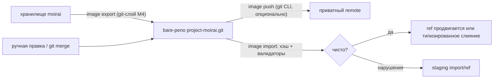

# 7. Git-совместимый образ (R3)

## 7.1 Зачем нужен git-образ и каким он должен быть

Требование R3 звучит как «сохранять в git и загружать из git». В moirai оно решено так: каноническим остаётся собственное хранилище, а git-образ является производным и детерминированным отображением коммитов, веток и тегов moirai в обычные git-объекты (blob, tree, commit, ref). Git служит только целью хранения и транспорта: ни на один запрос moirai не отвечает чтением из git.

Цели в порядке приоритета:

1. **Детерминизм.** Каждый коммит, ветка и тег отображаются чистой функцией от данных moirai и формата объектов. Два хранилища с одним и тем же коммитом производят побайтно одинаковые объекты (инвариант I28′).
2. **Читаемость.** Образ читается и диффится любым git-инструментом.
3. **Импорт правок с git-стороны.** Ручная правка или `git merge` в образе импортируются как полноценный коммит moirai. Его проверяют тот же движок слияния и те же валидаторы.
4. **Хранилище каноническое.** Образ производный и никогда не бывает рабочей копией. Это урок Beads с двумя источниками правды [03 §8.2].

Каким требованиям и приоритетам это служит:
- R3 и корректность: хэш каждого коммита проверяем, round-trip закреплён гейтами 0–3.
- R2: экспорт и импорт в локальный каталог или bundle работают без git.
- Скорость: инкрементальный экспорт ≤ 50 мс, без запуска процессов.
- RAM: у экспорта и импорта явные потолки приватной памяти (§7.10).

**Отвергнутые варианты (T15):**
- *Бинарные `hist`/сегменты под `refs/moirai/data`* (предложения A, B, C). Это бэкап, а не читаемый образ с диффами и импортом правок, поэтому R3 не выполняется.
- *Отслеживаемый каталог в проекте как умолчание.* В нём неизбежны текстовые git-слияния `.moi`. Это безопасно только при гранулярности `checkpoint` и с журнальной формой счётчиков N6.
- *Коммиты 1:1 для каждой линии (lane) в проектный репозиторий.* Это ~4 ГБ в год без дельт до `git gc`, а на машине и так не хватает диска (D9, F-D7).
- *Нестандартные заголовки коммита в стиле jj.* Их сохраняет не весь git-инструментарий.

**Триггеры пересмотра.** Если вам важнее всего PR-ревью образа, умолчанием становится отслеживаемый каталог с гранулярностью `checkpoint`. Если нужна покоммитная археология, включается гранулярность `commit` на отдельном репозитории.

_Источники: AR §2.15 (T15), §5b; [60 §1.3]_

## 7.2 Раскладка дерева образа

```
.moirai-image                        маркер формата (§7.4): версия формата, формат объектов, версия схемы
schema/kinds.moi  fields.moi  edges.moi     схема как данные, отсортированные строки, файл на таблицу
schema/queries/<q>.moi               именованные запросы проекта; q = 32 hex BLAKE3-256(имени), имя в строке name:
nodes/<h1>/<h2>/<uid>.moi            h1 = uid hex[0..2], h2 = uid hex[2..4]; uid = 32 hex в нижнем регистре
refs/heads.moi  refs/tags.moi        только в образах checkpoint: строки таблицы ref-ов moirai (name, kind)
```

**Fan-out.** Два уровня по 8 бит по `uid` дают 65 536 листовых деревьев. При 1e4 узлов в большинстве листьев 0–1 запись, при 1e5 ≈ 1,5, при 1e6 ≈ 15. Коммит, затрагивающий k узлов, переписывает корень, не более k промежуточных деревьев и не более k листьев. Корень при ≥ 1e5 узлов занимает ≈ 7,4 КБ в SHA-1 и ≈ 10,5 КБ в SHA-256 (сырые байты). Так стоимость копирования пути ограничена fan-out, а не числом узлов. **Fan-out входит в версию формата.**

**Правила раскладки:**
- **Пишутся только исходящие рёбра**, в файле узла-источника. `A blocks B` переписывает только `A.moi`. Входящие рёбра восстанавливаются при импорте, иначе правило, на которое ссылаются 10k узлов, менялось бы при каждой новой ссылке.
- **Надгробия (tombstone) остаются файлами навсегда.** Они хранят исходящие рёбра, которые хранилище держит для мёртвого узла: помеченные `blocks`/`gates` с отметкой `flagged`, исторические как есть (I39′, CM4). Поэтому защита X4 и обратный индекс переживают round-trip. Если файл *исчез*, это чужое жёсткое удаление: настоящее удаление в moirai всегда пишет надгробие.
- **Тело лежит в хвосте файла узла.** Один blob на узел, поэтому число объектов ≈ N, а `git diff` показывает прозу.
- Нет файлов с именами `#N` (номера локальны для хранилища) и нет каталогов по видам узлов (виды меняются).

**Нехэшируемый side ref.** В каждом назначении есть по одному такому ref на экспортирующее хранилище: `refs/moirai/meta/<store-id>`. Имя одно во всех назначениях, включая отдельный bare-репозиторий образа, и шаг импорта 5 ищет side ref по шаблону `refs/moirai/meta/*`. Дерево side ref содержит `meta.moi` (`store-id`, `granularity` по каждому ref, `moi-format`, `last-export-seq`) и `aliases.moi` (строки `uid #N`). Всё локальное для хранилища или назначения лежит только там (CB2). В дерево коммита он не входит никогда, и импортёр читает его только как подсказку. Git-атрибуты `*.moi -text diff` пишутся в `info/attributes` назначения, а не в дерево (CL1).

_Источники: AR §5b.1; [50 §4.4]; [80 §2.10 P11, X-F9]_

## 7.3 Формат узлового файла `.moi` (канонический текст, версия 1)

Канонические байты пишет только экспортёр. Импортёр принимает и нормализует надмножество: CRLF, хвостовые пробелы, переставленные строки.

**Правила:**
1. UTF-8 без BOM, без нормализации Unicode. **Заголовок** использует только LF, не содержит хвостовых пробелов и заканчивается ровно одним LF. Блочные строки (`<<` … `>>`) и **тело** сохраняются побайтно (I40′, CM3).
2. Первая строка `moirai-node 1`. Затем строки `key: value` в фиксированном порядке: `uid`, `kind`, `title`, `status`, `resolution`, `priority`, `criticality`, `confidence`, `authority`, `parent`, `order`, `created`, `updated`, `deleted`, `flags`. Пустые значения опускаются. В `flags` попадают только исходные `archived`, `frozen`, `pinned`. **Строки `id:` нет** (N4): номер `#N` локален, и одинаковые данные хэшировались бы по-разному.
3. Далее идут группы, каждая отсортирована побайтно:
   - `field <name>: <value>`;
   - `label <value>` (без двоеточия);
   - **журнальные строки `incr <field> <+k|-k> c<commit>`** для счётчиков, по одной на операцию `Incr`, отсортированы по id коммита. Значение равно сумме и строкой `field` не пишется. Чужая правка может записать вместо `c<commit>` любой токен (N6);
   - `edge <kind> -> <uid> [pin=c<commit>] [flagged]`, отсортированы по (имя вида, uid назначения, свойства);
   - `conflict <key> class=… base=… ours=… theirs=…`, отсортированы по ключу. Ключ — это `field.<name>`, `status`, `body`, `parent`, `edge.<kind>.<uid>` или `existence`. Все значения однострочные: значение с переводом строки экранируется как JSON-строка. Поэтому конфликт тела — это три JSON-строки в одной строке, а раздел тела `---` на время конфликта тела **опускается**. **Пока для ключа есть `conflict`, его обычная строка `field`/`edge` или тело опускаются** (N12).

   Строк `violation` не бывает: нарушения живут только на staging-ветках, которые не экспортируются (CB1).
4. Значения:
   - целые числа — в десятичной записи;
   - числа с плавающей точкой — в кратчайшей round-trip форме (Ryu), с обязательной `.` или экспонентой;
   - булевы — `true`/`false`;
   - время — RFC 3339 UTC (`Z`) с миллисекундами;
   - ссылка на узел — 32-hex `uid`, ссылка на коммит — `c<64 hex>`;
   - `order` — дробный индекс base-62 (набор символов `[0-9A-Za-z]+`, сравнение побайтное, порождается между соседями как fractional index в стиле Figma), никогда не перенормализуется;
   - множества — `[a, b, c]` с побайтной сортировкой;
   - строки — голыми, если в них нет управляющих символов, нет ведущих и хвостовых пробелов, они не начинаются с `"`, `[` или `{` и занимают не больше 4 096 байт; иначе JSON-экранированными;
   - многострочный текст — в блочной форме: `field why: <<`, затем сырые строки с отступом в два пробела, затем `>>`. Блочная форма выбирается тогда и только тогда, когда значение содержит перевод строки.
5. `created`/`updated`/`deleted` имеют вид `c<commit-id>` плюс HLC-время для читаемости. Импортёр читает только id.
6. Производное состояние (`ready`, `suspect`, rollup-ы, `rev_seq`, `lsn`, `claimed`, `settled`, `stale` и т. п.) не пишется никогда (I36′).
7. Тело идёт после строки `---` и кодируется как **байты тела плюс ровно один LF**. Декодер снимает ровно один LF, поэтому переживают всё: жёсткие переносы Markdown, внутренние `---`, лишние финальные переводы строки. `git diff` никогда не показывает `\ No newline at end of file`. Единственная нормализация тела происходит в **хранилище** при записи: CRLF и одиночный CR заменяются на LF (документированное правило хранилища). Образ никогда не нормализует содержимое тела, а файл с CRLF, пришедший с git-стороны, импортёр нормализует ровно так, как это сделало бы хранилище.
8. Надгробие содержит `uid`, `kind`, `title`, `deleted`, `field reason`, `field replaced_by` и сохранённые исходящие рёбра. Тела у надгробия нет.
9. **Формы R4 и R5** (часть ABNF M0).
   - Файловые и корневые узлы являются обычными узловыми файлами. У артефакта нет `title` (он выводится из `path`), `origin_pred` пишется, только если он был у вывода.
   - `path_moves` пишется блоком по одному JSON-массиву на запись: `["<hlc, 20 цифр с ведущими нулями>","<class>","<from/>","<to/>","<git oid>"]`, с сортировкой по (hlc, from, to).
   - Якоря (anchor) пишутся строками в файле **ссылающегося** узла: `anchor <anchor uid> -> <dst uid> kind=… mode=… watch=… [scope=…] [quote_h=…] [prefix_h=…] [suffix_h=…] [quote=…] [prefix=…] [suffix=…] [hint=…] [window=…] [span=…] [blob=…] [git=…] captured=… v=<resolver>`. Строки сортируются по (uid назначения, uid якоря). Значения голые, если безопасны, иначе JSON-экранированы; `window` пишется в base64url без выравнивания. Смежность `at` следует из якорей, поэтому строки `edge at` нет.
   - В каждой строке якоря есть дайджесты `quote_h`/`prefix_h`/`suffix_h` (BLAKE3-128), носители канонической формы. Если назначение настроено как `image.dest.<name>.anchor-text = hash-only`, текст цитат опускается. В режиме `full` импортёр сверяет каждый текст с его дайджестом, несовпадение даёт `ImageParse`.
   - Якорь, импортированный без текста, находится в подсостоянии `text-unavailable`: он разрешается только по подсказке, окну и области и никогда не бывает `fresh` по цитате, пока `links fix --repin --at …` не снимет цитату заново из дерева ([72 M6]).
   - Именованный запрос — это файл `moirai-query 1`: заголовок (имя, версия грамматики, сигнатура параметров, форма, класс бюджета), `---`, переносимый текст LQ; только LF, побайтно. Вне строковых литералов и комментариев в нём никогда не встречается `#`, за которым идёт цифра.
   - **R4 и R5 не добавляют ни трейлеров, ни аннотаций коммита.**

**Пример из AR:** задача `#12` после удаления `#40` с `--replaced-by #52`, файл `nodes/01/8f/018f3c2e7a117b3c9d5e4c2f1a0b9e77.moi`:

```
moirai-node 1
uid: 018f3c2e7a117b3c9d5e4c2f1a0b9e77
kind: task
title: Byte-range lock protocol
status: in_progress
priority: 1
criticality: normal
parent: 018f3c2e7a117b3c9d5e4c2f1a0b9e09
order: a0V
created: c9b2e6c1d4f0a7e3b5c8d1f2a9e4b7c6d3f0a1e2b5c8d7f4a3e6b9c2d5f8a1b4 2026-09-21T14:02:11.483Z
updated: c4470a11e2f3b4c5d6e7f8091a2b3c4d5e6f708192a3b4c5d6e7f8091a2b3c4d 2026-09-25T14:02:40.011Z
field acceptance: writer and flush bytes locked per range; a dead holder's range freed by the OS
field assignee: dev#1
field estimate: 3
field files_owned: [src/lock.rs, src/vfs/lock_bytes.rs]
field phase_state: implementing
field work_kind: impl
label l5np
label storage
incr reopen_count +1 c4470a11e2f3b4c5d6e7f8091a2b3c4d5e6f708192a3b4c5d6e7f8091a2b3c4d
edge blocks -> 018f3c2e7a117b3c9d5e4c2f1a0b9e51
edge cites -> 018f3c2e7a117b3c9d5e4c2f1a0bd3a5 pin=c4410f0e2d3c4b5a69788796a5b4c3d2e1f0a9b8c7d6e5f4a3b2c1d0e9f8a7b6
edge implements -> 018f3c2e7a117b3c9d5e4c2f1a0b9e40
edge mentions -> 018f3c2e7a117b3c9d5e4c2f1a0b9e52
---
Writers lock byte ranges of LOCK, never the whole file.
See #52 for the reader registry this depends on.
```

В `git diff` коммита удаления файл `…9e40.moi` схлопывается в надгробие с историческими рёбрами. Без `--replaced-by` в нём осталось бы `edge blocks -> …9e77 flagged`, и `#12` после любого импорта оставалась бы вне `ready`. В `…9e52.moi` добавляется одна строка `edge blocks -> …9e77`: перенаправленное ребро `#52 blocks #12` лежит в файле своего источника. Сам `…9e77.moi` выше не меняется, и больше ничего не меняется: входящие рёбра выводятся. Пример согласован со сквозным сценарием AR §7: там `#40 --blocks-> #12`, `#12` блокирует только `#51`, а ключ разрешения — `edge:#40:blocks:#12` (формат `edge:<источник>:blocks:<цель>`). Приёмка, `files_owned` и тело описывают протокол блокировок, как и заголовок; `#12` блокирует `#51` (`…9e51`), родитель — `#9` (`…9e09`, как в Q21 [50]), а `#52` в теле — реестр читателей, заменивший `#40`. uid случайны: у `#9`, `#40`, `#51` и `#52` их последние цифры повторяют номера только для читаемости, все остальные суффиксы, включая собственный `#12`, произвольны. Тексты в примере иллюстративны: golden-фикстуры M0 строятся по правилам, а не по прозе.

**Грамматика (CL1).** Спецификация M0 включает ABNF `.moi` и golden-файлы для:
- каждого вида узла;
- надгробия с помеченными и историческими рёбрами;
- скалярного конфликта и конфликта тела;
- журнальных и блочных строк;
- файловых узлов и якорей по [40] (R-11);
- именованных запросов по [50] (F3).

Энкодер, декодер и фаззер генерируются из одной грамматики.

_Источники: AR §5b.2, §7 (сквозной сценарий); [40 §5.7, R-11]; [50 §4.4]; [60 §3.1 п. 1]; [72 M6]_

## 7.4 Маркер `.moirai-image` и правила детерминизма

```
moirai-image 1
object-format: sha1
schema-version: 3
```

Хэшируются только эти три строки. `store-id` и `granularity` вынесены в side ref (CB2). Гранулярность каждого коммита импортёр узнаёт из трейлера `Moirai-Kind`. Поэтому два хранилища с одним коммитом пишут одно и то же корневое дерево, и это проверяет property-тест.

**Правила детерминизма (§5b.5):**
1. Записи дерева сортируются по правилу git. Режимы только `100644`/`040000`: без исполняемых битов и символьных ссылок.
2. Формат объектов берётся из `extensions.objectFormat` назначения. Форматы не смешиваются, а `gitmap` хранит алгоритм и назначение.
3. Экспортёр повторно парсит каждый записанный файл и сверяет результат.
4. В объектах нет `gpgsig`, `encoding` и нестандартных заголовков.
5. `gitmap` выводим из трейлеров `Moirai-Commit`. Команда `image doctor --rebuild-map` восстанавливает его и сообщает о коммитах с несовпавшим хэшем.
6. **Все прошлые энкодеры `.moi` хранятся навсегда.** Старый коммит переэкспортируется энкодером версии своего назначения (O5). Смена версии формата даёт новое назначение и никогда не переписывает существующее.
7. В хэшируемом содержимом нет локальных данных: ни `#N`, ни `seq`/lsn, ни store id, ни гранулярности. Запросы хранятся в переносимой форме: `#N` → `#u:<uid>`, reflog-формы отвергаются. Вывод идентичностей R4 не читает машинно-локальных данных.
8. Каждый вид коммита восстановим из трейлеров и диффа дерева с первым родителем (I38′).

_Источники: AR §5b.3, §5b.5; [60 §2.5]_

## 7.5 Отображение коммитов и трейлеры

`commit_id` — это BLAKE3-256 над каноническим кодированием десяти полей (§4.6). Главное свойство отображения: **у каждого хэшируемого поля ровно один носитель в git-коммите** (CB1, I38′). Благодаря этому импортёр может пересчитать хэш и сверить его с трейлером `Moirai-Commit`.

| Поле git | Значение |
|---|---|
| `tree` | дерево образа; неизменённые поддеревья сохраняют id |
| `parent` × n | git-id родителей через `gitmap`. У merge **и `sync`** два родителя: первый — tip назначения или линии, второй — tip источника или `sync_base` |
| `author` | имя `moirai/<actor>`, email `<role>@moirai.invalid`, время `hlc >> 16` мс в секундах, tz `+0000` |
| `committer` | равен `author`, иначе часы или личность экспортёра меняли бы хэш |
| сообщение | сообщение moirai, пустая строка, блок трейлеров; **без `Moirai-Seq`** (N4) |

Отделимость блока трейлеров обеспечивает запись (§4.6 п. 6): сообщение с последним абзацем, начинающимся на `Moirai-`, отклоняется. Импортёр отрезает последний абзац, начиная с его первой строки `Moirai-Commit:` (у чекпоинтов — с `Moirai-Kind:`), и берёт как сообщение всё, что стоит до разделяющей пустой строки.

**Носители полей:**
1. `kind` → `Moirai-Kind`.
2. Заявленные id родителей → git-родители со своими `Moirai-Commit`.
3. `hlc` → **`Moirai-Hlc`** (секунд автора для хэша недостаточно).
4. Actor/role/session → `Moirai-Actor`/`-Role`/`-Session`.
5. Git-провенанс → `Moirai-Git-Head`/`-Git-Branch`/`-Worktree`/`-Git-Base`.
6. Сообщение → абзацы до трейлеров.
7. Версия схемы → `Moirai-Schema`.
8. Источник → `Moirai-Origin`.
9. `foreign_git` → `Moirai-Foreign-Git`.
10. Чистый changeset → **дифф дерева с деревом первого родителя** через кодек `.moi`. `Moirai-Ops` служит дешёвой предпроверкой.

`Moirai-Ref` и `Moirai-Idem` информационные: они не хэшируются и никогда не понижают коммит.

Порядок трейлеров фиксирован: `Moirai-Commit`, `Moirai-Kind`, `Moirai-Ref`, `Moirai-Hlc`, `Moirai-Actor`, `Moirai-Role`, `Moirai-Session`, `Moirai-Git-Head`, `Moirai-Git-Branch`, `Moirai-Worktree`, `Moirai-Git-Base`, `Moirai-Origin`, `Moirai-Sync-Base`, `Moirai-Foreign-Git`, `Moirai-Schema`, `Moirai-Ops`, `Moirai-Idem`. Пустые трейлеры опускаются. Шаблон хвоста сообщения (значения — плейсхолдеры, набор строк зависит от вида коммита):

```
<сообщение moirai>

Moirai-Commit: <id коммита moirai>
Moirai-Kind: ordinary|merge|sync|revert|cherry-pick
Moirai-Ref: <ref, куда лёг коммит>
Moirai-Hlc: <u64 decimal>
Moirai-Actor: <actor>
Moirai-Git-Head: <algo>:<hex>
Moirai-Git-Base: <algo>:<hex>
Moirai-Sync-Base: c…
Moirai-Schema: <n>
Moirai-Ops: <n>
```

**Особые виды коммитов:**
- **Чекпоинты** несут `Moirai-Kind: checkpoint`, `Moirai-Head`, `Moirai-Ref` и `Moirai-Folded: <n> commits from c… to c…`. Трейлера `Moirai-Commit` у них нет, потому что нет собственного id (N13a).
- **`sync` (CM2)** экспортируется как коммит с двумя родителями (tip линии, `sync_base`). Его каноническим списком операций является полный дифф с первым родителем, поэтому он проверяется так же, как merge.
- **Чужие (foreign) коммиты** получают детерминированный id: вид `ordinary`/`merge`, `hlc = max(committer_time << 16, max(parent.hlc) + 1)`, актор `git:<author email>`, `foreign_git` = oid. Два хранилища получают одинаковый id.
- **Импорт чекпоинта** тоже получает детерминированный id: локальный вид `checkpoint` (`import = checkpoint`), родитель — id предыдущего чекпоинта, `foreign_git` — oid чекпоинта, актор `image:checkpoint`; происхождение берётся из `Moirai-Head`/`Moirai-Folded`. Такой коммит никогда не считается подделанным (N13a).

**Ref-ы.** В отдельном репозитории образа ref-ы лежат под `refs/heads/` и `refs/tags/`, поэтому обычный `git clone` забирает всё. Теги лёгкие, с `--annotated` теггер задаётся по правилу автора. Опциональный `refs/moirai/ops/<store-id>` (`--with-oplog`, входит в релиз) переносит историю reflog.

Staging-ветки (`merge/*`, `import/*`, `orphans/*`) для экспорта недоступны. Операции `Violation`, before-images, `#N`, seq/lsn, поглощённые векторы (absorbed vectors), маркеры, аренды (lease) и таблицы разрешения R4 не экспортируются никогда.

_Источники: AR §5b.4, §5b.6, §4.6_

## 7.6 Встроенный git-слой объектов (M4) и роль git CLI

**Что это.** Рукописный слой, работающий внутри процесса. Он поддерживает:
- loose-объекты;
- pack v2 + idx v2: чтение OFS/REF-дельт и запись pack;
- commit-graph со split-цепочками и данными поколений;
- loose refs и `packed-refs` по протоколу `<ref>.lock` с проверкой чтением после записи (G21);
- bundles v2/v3;
- SHA-1 и SHA-256;
- чтение reftable. Обновление ref в reftable-назначении делегируется `git update-ref --stdin`, без git оно отклоняется (G22);
- дифф деревьев с точными переименованиями;
- предков и merge-base с отсечением по поколениям, включая головы новее commit-graph.

Хэши считают `sha1`/`sha2` без `asm`. Deflate выполняет `zlib-rs` или `miniz_oxide`: выбор делает замер M0 (§8.2 п. 9).

Память ограничена так:
- LRU дельта-баз ограничен в байтах (`git.delta-cache-bytes`: 256 KiB в CLI и хуках, 1 MiB в MCP);
- объекты крупнее кэша обрабатываются потоково;
- pack, idx и commit-graph отображаются в память только для чтения;
- экспорт закрывает pack каждые `store.pack-objects-max` (65 536) объектов.

**Зачем.** У слоя три потребителя: образ (R3), предки для `check`/`stale` и дерево-гейт с rename-свидетельствами R4. Для R4 это жёсткая зависимость.

Прежний план D10 был таким: `git fast-import`/`cat-file` сейчас, собственный слой позже за трейтом `ImageBackend`. [60] его отменил. Без промежуточных стадий этот план стал бы окончательным и принёс бы три проблемы:
- git стал бы runtime-зависимостью R3;
- в `check`/`stale` остался бы spawn 74 мс (измерено) на каждую некэшированную пару предков (ответы кэшируются как ленивые факты);
- дерево-гейт R4 остался бы без источника предков.

`gix` отвергнут: большая зависимость, push не реализован, паритет SHA-256/reftable не достигнут. Git-библиотеки запрещены линтом GT20 (b). **Второй реализации и трейта-бэкенда нет.**

**Роль git CLI.** У него две роли:
- **независимый оракул тестов (GT7):** `git fsck --strict`, `cat-file --batch`, `rev-list`, `verify-pack`, `merge-base --is-ancestor`, `diff-tree -M100%`;
- **опциональный сетевой транспорт** `image push/pull`, если git установлен (`image.transport.spawn-git = true`). Без git команда печатает точную git-команду.

Во всём продукте `git` запускается только в четырёх местах и только если он установлен: `image push/pull`, обновление ref в reftable, `doctor lanes --refresh-graph` и `file mv --git`. Это гарантирует линт GT20 (a).

**Выход M4:**
- всё записанное проходит `git fsck --strict` и `git verify-pack`;
- чтение совпадает с `git cat-file --batch` объект в объект на ваших репозиториях (только чтение) и на синтетических SHA-1/SHA-256 (после `gc --aggressive`, со split commit-graph, `packed-refs` и reftable);
- ответы о предках совпадают с `merge-base --is-ancestor` на ≥ 1e4 пар и на головах вашего trunk и активных линий;
- точные переименования совпадают с `git diff-tree -M100%`;
- ref-ы не портятся и не теряют обновлений при параллельном `git`;
- внедрённый откат записи loose-ref антивирусом обнаруживается и повторяется;
- на shallow/partial-клонах ответ `unknown`, никогда не `false`.

Бюджеты M4:
- предки ≤ 1 мс с commit-graph и ≤ 5 мс без него;
- поиск в дереве, обход предков и окно переименований на 2 000 коммитов ≤ 1 MiB каждый;
- запись pack не медленнее измеренной в M0 пропускной способности deflate минус 20 %.

Гейты M4:
- фаззеры GT5 гоняются по 24 ч на каждый формат (на уровне релиза GT5 требует ≥ 7 CPU-дней на фаззер, AR §8.3);
- GT20 (c) обязателен с M4: потоки GT2 гоняются без `git` в `PATH` и без `.git`, `stale` при этом отвечает `unknown`.

Трудоёмкость 15,5–22 units, 2–4,5 недели. Работа идёт во второй линии от точки сертификации `Vfs` в M1.

Чтение SHA-256 и reftable обосновано тем, что Git 3.0 делает их умолчаниями для новых репозиториев (заявлено). Исторический отчёт [74] называет RC от 2026-09-11 то «Git 3.0 rc» (74-audit-feasibility-config.md:226), то «2.56-rc0» (:848); нормативные документы ни одно из этих имён не повторяют, и на дизайн это не влияет.

> ✅ **Подтверждено вами 2026-09-27 (Б8 раздела 15):** git-слой пишется с нуля. Это веха M4: 15,5–22 units, 4–6 тыс. строк плюс фаззинг. Git-библиотек нет, CLI служит только оракулом и опциональным транспортом, запись reftable не строится (#41). Решение принято как рекомендованное (§11 #3), но оно стоит отдельной вехи. Его риск (расхождение с git: риск 9 в [60], риск 24 в AR §10) закрывают GT7 и фаззеры.

_Источники: AR §5b.6, §2.10 (T10), §5c, §8.3; [60 §1.3, §2.4, §3.5]_

## 7.7 Экспорт и импорт



**Экспорт.** Команда `moirai image export [--to <gitdir|bundle>] [--refs …] [--granularity checkpoint|commit] [--object-format sha1|sha256] [--create] [--if-older <duration>]` выполняет шаги:

1. `--create` создаёт bare-скелет. В нём явно заданы `objectFormat` и `refStorage = files`, а также `gc.auto = 0`, `gc.autoPackLimit = 0`, `pack.threads = 2`, `pack.windowMemory = 64m` и файл `info/attributes`.
2. Сначала проверяется, что последняя запись `gitmap` указывает на объект, который действительно есть в назначении. Если объекта нет, экспорт повторяется с предыдущей записи, поэтому потерянный при bugcheck pack не оставит образ тихо сломанным ([72 M9]). Затем идёт обход от tip каждого ref до коммита, уже отображённого в `gitmap`; начальный seq даёт `image_cursor`. При гранулярности `commit` обход идёт по обоим родителям.
3. Дерево строится применением changeset к экспортированному дереву первого родителя (для `sync` — развёрнутое окно плюс остаток). Читаются только корень и затронутые промежуточные и листовые деревья (G24). Затронутые файлы `.moi` кодируются из вида ветки на момент этого коммита (as-of, O(правок) на затронутый узел). При гранулярности `checkpoint` получается один коммит на `main` и по одному на линию, и родителем каждого служит предыдущий чекпоинт.
4. Ref-ы обновляются через git-слой. Каждый ref защищён CAS против последнего виденного oid этого ref в этом назначении. При несовпадении экспорт завершается с кодом выхода 6 и советует `moirai image import`. Способ записи зависит от назначения:
   - в bare-репозитории образа, которым владеет moirai, **все ref-ы прогона, включая side ref, обновляются одной транзакцией `packed-refs`** (один lock-файл, одно переименование, loose refs удаляются);
   - в живом проектном репозитории используется протокол git `<ref>.lock` отдельно для каждого ref с проверкой чтением после записи (G21);
   - в reftable-назначении используется `git update-ref --stdin`, если git установлен, иначе отказ (G22).
5. **Порядок долговечности:** сначала pack и idx сбрасываются на диск и переносятся через `rename_noreplace` со сбросом каталогов, затем `packed-refs.lock` (или `<ref>.lock`) и `rename_replace`, и **только потом** записи `gitmap` фиксируются одним долговечным коммитом. Вызовы для каждой ОС берутся из [80 §2.3.2]; на Windows к переименованиям вдобавок к сбросу каталога добавляется `MOVEFILE_WRITE_THROUGH`, пока калибровка стенда (п. 17, по вашему решению от 2026-09-27 отложена вместе со стендом до после релиза) не покажет, что он не нужен. После сбоя назначение может опередить `gitmap`, но никогда не отстаёт. Следующий экспорт это видит и переотображает (идемпотентно).
6. Экспорт не держит байт обслуживания: он опирается на pin-ы и 60-секундную отсрочку удаления (G26). В тихом режиме (quiet mode) экспорт без `--force` отклоняется. Байт писателя экспорт и импорт берут только для добавления коммитов, так что агенты работают даже во время экспорта 1e6 узлов.

Экспорт всегда инкрементален от `image_cursor` (шаг 2), поэтому отдельного флага для этого нет; синопсис §5b.6 и сводка глаголов §7.1 перечисляют один и тот же набор флагов.

**Импорт.** Команда `moirai image import [--from <gitdir|bundle>] [--refs …]`:

1. Идёт обход до oid, уже лежащего в `gitmap`. Oid каждого ref запоминается как «последний виденный» (N13b).
2. **Родной** коммит (с трейлером `Moirai-Commit`) диффится с первым родителем; это правило одно для всех видов, включая `sync`. Переходы файла в диффе дают операции (N5):
   - отсутствует → живой: `Create` с полями и рёбрами;
   - изменённые строки: `SetField`/`SetStatus`/`AddEdge`/`RemoveEdge`/`Move`/`SetBody`; новые строки `incr` — `Incr` с суммарной дельтой; строки `conflict` — значения конфликта; рёбра надгробия — помеченные или исторические рёбра (I39′);
   - живой → надгробие: `Delete`; надгробие → живой: **`Undelete`**;
   - живой → отсутствует: чужой `Delete{image:file-removed}`; надгробие → отсутствует: подсказка `TombstoneRemoved`.

   Настоящее удаление в moirai всегда пишет файл надгробия, поэтому исчезнувший файл — всегда чужое действие. Из диффа и трейлеров восстанавливается канонический вид и проверяется BLAKE3.
   - Совпадение: коммит получает тот же id и канонический вид, `import = native`, `verified = 1`. Для `sync` хранилище сохраняет остаток G17 с `sync_base` = второй родитель: второй родитель импортируется первым, и импортёр вычитает окно `main`, которое уже держит.
   - Несовпадение: **только этот коммит** понижается до чужого с новым id (`verified = 0`), а его дети сверяются с заявленными id родителей и записывают `parent_actual` (N5, I29′).
   - Чекпоинты (`Moirai-Kind: checkpoint`, без `Moirai-Commit`) импортируются как `import = checkpoint` с детерминированным id (§7.5) и происхождением из `Moirai-Head`/`Moirai-Folded`; подделанными они не считаются никогда (N13a).
   - Записи merge и `sync` обновляют поглощённый вектор (absorbed vector) локального ref ровно так же, как локальное слияние. Импортированные операции пишут маркеры, поэтому импортированный `status: done` становится `settled` везде (CB3).
3. **Чужой** коммит с двумя родителями импортируется как типизированное трёхстороннее слияние состояний родителей. Git-дерево нужно только для конфликтов `TextHunk`, которые человек уже разрешил. Счётчики берутся из объединения журналов, никогда из текстового слияния (I30′, N6).
4. **Валидаторы** проверяют каждый импортированный коммит относительно вида его родителя: `ImageParse` (например, оставшиеся `<<<<<<<` или испорченная строка `anchor`), `SchemaConflict`, `DanglingEdge`, `Cycle`, `HierarchyCycle`, `IdCollision`, `PathClaim`, `QueryInvalid`/`QueryCycle`. Уточнения:
   - `IdCollision` (uid жив с другим коммитом `created`) не применяется к видам R4 с выводимым uid: там `Create` существующего uid — это равное существование плюс слияние полей. Uid файла, корня или якоря, который не совпадает со своим выводом из хранимых входов, принимается как чужой, считается случайным и помечается `image doctor`;
   - строка `anchor` с неизвестным uid назначения считается ссылкой на надгробие (`at` исторический);
   - каждый импортированный именованный запрос разбирается и связывается; текст с локальными для хранилища данными даёт `ImageParse`.

   Дальше три исхода:
   - всё чисто и локальный tip — предок цепочки: ref продвигается;
   - всё чисто, но локальный ref ушёл вперёд: цепочка ложится на `import/<ref>` и сливается типизированно (`image.import-merge = auto`, а `stage` отправляет в staging всегда);
   - есть нарушения: staging на `import/<ref>`, дальше `resolve` + `merge --continue`.

   Локальные коммиты не теряются, и заявленные родители сохраняются всегда ([72 M10]). Первый импорт в пустое хранилище идёт одним bulk-коммитом с потолком ≤ 8 / 16 / 32 МБ при 1e4 / 1e5 / 1e6.
5. **Номера.** Идентичностью служит `uid`. Подсказка из `aliases.moi` принимается, только если `N ≥ next_id`. Иначе номер переназначается, и `show` печатает `#40 (was #17 in store 6f2a…)` (N11). `mentions` берутся только из строк `edge mentions`, `#N` в чужой прозе не перепарсивается (CL2). Тела, импортированные из другого хранилища, помечаются `origin:<store-id>` и отображаются с `#N`, переназначенными через карту алиасов. Импорт образа другого хранилища входит в релиз, и это правило входит в корпус M5. Живые писатели с разных машин остаются вне рамок (#11).
6. `gitmap` получает записи и для чужих коммитов, поэтому их повторный экспорт — пустая операция.

Сессия из сквозного примера AR (полный вывод импорта):

```
$ moirai image export
export main tags/* lane/* (checkpoint, sha1) -> <parent of the main worktree>/BoykoEngine-moirai.git
  main: 1 checkpoint commit (Moirai-Folded: 53 commits c9b2e6c1..c9c0aa17), 171 blobs, 402 trees; lane/l10: 1 checkpoint (12 blobs); lane/l7: unchanged
  via the in-process pack writer (0.41 s); refs updated: refs/heads/main 3e1f..., refs/heads/lane/l10 77ab...; refs/moirai/meta/6f2a... rewritten; gitmap +54 | cursor seq 4471

$ moirai image import
import refs/heads/main: 2 new git commits
  a91c... native   Moirai-Commit c9c0... verified -> applied on main
  b402... foreign  author git:<owner> "fix typo in rule #212" -> 1 op SetField(#212.text) -> applied on main as c9c1 (import-foreign)
import refs/heads/lane/l10: 1 new git commit
  c77d... foreign merge (2 parents) -> typed 3-way over parents: 4 keys, 1 TextHunk resolved from the git tree, incidents ledger union 3+1+1=5
  nodes/01/8f/...9e40.moi: parse error line 9 (git conflict marker) -> staged on import/lane/l10 (ImageParse)
```

Строки про `lane/l10` — единственная конкретная иллюстрация шагов импорта 3–4: чужое слияние с двумя родителями выполнено как типизированное трёхстороннее, один `TextHunk` разрешён по git-дереву, счётчик `incidents` взят из объединения журналов (3 + 1 + 1 = 5), а файл с оставшимся маркером конфликта git ушёл в staging `import/lane/l10` как `ImageParse`.

_Источники: AR §5b.6, §7 (пример), §7.6; [72 M9, M10]; [80 §2.3.2]_

## 7.8 Гарантии round-trip и гейты 0–3

| Данные | Без потерь? | Механизм |
|---|---|---|
| узлы, поля, метки, счётчики (журналы), тела (побайтно), рёбра, помеченные висячие рёбра, надгробия, конфликты, схема; намерения ссылок R4 (файловые узлы, якоря, `path_moves`); запросы R5 | **да** (R4 — при любой гранулярности) | канонический `.moi` |
| состояние разрешения R4 (file id, stat-кэши, отпечатки) | **нет, намеренно** (I-F4) | импортирующее хранилище разрешает заново |
| DAG коммитов и метаданные | **да** при `commit`, для всех видов, включая `sync` | трейлеры + родители, `Moirai-Commit` |
| id коммитов, имена и виды веток и тегов | **да** | пересчёт хэша; ref-ы, `refs/heads.moi`/`Moirai-Ref` |
| номера `#N` | **по возможности** | алиас-ref, карта алиасов |
| reflog, журнал операций | только с `--with-oplog` | `refs/moirai/ops/<store-id>` |
| нарушения, выборы `Resolve` | **нет, намеренно** | нарушения живут только на staging-ветках, которые не экспортируются; разрешение экспортируется как полученное им значение |
| аренды (lease), маркеры, поглощённые векторы (absorbed vectors), результаты идемпотентности, курсоры, `next_id`, fencing-токены, pin-ы, сегменты, lsn/seq | **нет, намеренно** | runtime-состояние (I36′); восстанавливается в импортирующем хранилище (маркеры и поглощённые векторы выводятся заново из импортированных операций и слияний) |
| промежуточные коммиты между чекпоинтами | **нет** при `checkpoint` | головное состояние точное, путь к нему нет |

**Гейты выхода M5 (GT8, в обоих режимах anchor-text):**
- **Гейт 0** проходит до любого корпуса. Для каждого вида коммита (ordinary, merge, `sync`, revert, cherry-pick, foreign, import-checkpoint) из трейлеров и диффа дерева восстанавливается хэш и сравнивается с исходным. Фикстуры берутся из таблицы носителей M0, включая R4 и R5.
- **Гейт 1** (гранулярность `commit`): `export → свежий import → export` даёт **побайтно идентичные** объекты и ref-ы. Масштаб: 1e5 узлов и 1e5 коммитов в SHA-1 и SHA-256. В корпусе синхронизированные линии, надгробия, тела без финального LF, конфликты, якоря и запросы.
- **Гейт 2** (`checkpoint`, умолчание): **совпадение состояния**. Головное состояние каждого ref совпадает с исходным, зависимые от помеченных блокеров не попадают в `ready`, а головные деревья воспроизводятся побайтно.
- **Гейт 3:** `import(export(St1)) ⊕ import(export(St2))` равно их `merge`. Два хранилища, импортировавшие один bundle, экспортируют идентичные объекты и выводят одинаковые идентичности файлов и якорей. Кодек фаззится.
- **Режим `hash-only`:** после импорта 100 % родных коммитов проходят повторную проверку хэша (GT8).

Дополнительно проверяется импорт на разошедшийся ref: локальные коммиты не теряются и не меняют родителей, id чужого коммита совпадает во втором хранилище, а результат равен слиянию в эталонной модели. Каждый случай отказа из §5b.8 ведёт себя по спецификации, `git fsck` чист.

Оракул GT15 (цикл аварий ОС) дополнительно проверяет `git fsck --strict` на образе и `gitmap` ⊆ назначение; по вашему решению от 2026-09-27 (В7) GT15 отложен до после релиза, поэтому этот оракул сначала работает там, а до релиза целостность образа после сбоя проверяют GT1/GT3/GT4 и гейты образа. **Пересертификация:** GT1/GT3/GT4 повторяются с экспортами и импортами в потоках (экспорт опирается на pin-ы и отсрочку удаления, G26).

> ✅ **Подтверждено вами 2026-09-27 (Б8 раздела 15):** round-trip намеренно неполон. Номера `#N` переносятся только по возможности и при коллизии меняются. Не переносятся: состояние разрешения R4 (его заново вычисляет импортирующее хранилище); нарушения и выборы `Resolve` (нарушения живут только на staging-ветках, разрешение переносится как полученное значение); аренды, маркеры, поглощённые векторы и прочее runtime-состояние (маркеры и векторы выводятся заново при импорте). Образ логический и не заменяет `backup`/`restore`.

_Источники: AR §5b.7, §8.3 (GT8, GT15); [60 §3.6]; [40 §5.7]_

## 7.9 Назначения, гранулярность, формат объектов, отказы

| Назначение | Статус | Ref-ы | Клонируется по умолчанию? | Трогает рабочее дерево | PR-ревью |
|---|---|---|---|---|---|
| **отдельный bare-репозиторий** `<parent of the main worktree>/<project>-moirai.git` | **умолчание, строится только оно** | `refs/heads/*`, `refs/tags/*` | да | нет | да |
| проектный репозиторий, `refs/moirai/*` | не строится (#41), пока #16 не впишет проектный remote или не изменится #11; имя зарезервировано ([74 A17]) | `refs/moirai/heads/*` | нет (нужен refspec) | нет | через `git log refs/moirai/heads/main` |
| orphan-ветка `moirai/image` | не строится | `refs/heads/moirai/image` | да | нет | да |
| отслеживаемый каталог `docs/moirai/` | не строится | — | да | да | **да** |

В проектном репозитории пространство `refs/moirai/` держит образ вне `git branch`, но клонам нужен fetch-refspec `+refs/moirai/*:refs/moirai/*`. `doctor image` проверяет доступные конфиги клонов и предупреждает о `push --mirror` из клонов без этого refspec (та же оговорка, что у Dolt с `refs/dolt/data`). Это назначение предусмотрено только для гранулярности `checkpoint`.

**Умолчания.** Экспортируются ref-ы `main` + `tags/*` + `lane/*` с гранулярностью `checkpoint`.
- **`main`:** чекпоинт на каждое слияние в `main` (`image.export.on-merge-to-main = true`), раз в день и при явном экспорте.
- **Живая линия:** раз в день и при явном экспорте. Это один маленький коммит поверх предыдущего чекпоинта, поэтому у неслитой работы всегда есть копия вне хранилища (CM8, риск 13).

Таймера у «ежедневного» экспорта нет:
- основной запуск делает первый `SessionStart` после `image.export.max-age` (1 день), вне тихого режима;
- без хуков его заменяет `image export --if-older` на первом шаге orchestrate-skill, в `apply`, `run close` и ритуале слияния. Это best effort: отказ песочницы даёт одну строку triage;
- последний рубеж — предупреждение о возрасте экспорта в `brief`/`doctor`.

Гранулярность `commit` включается отдельно для каждого назначения.

**Гранулярность — ключ конфигурации, а не решение владельца.** Умолчание `image.dest.<name>.granularity = checkpoint` (AR:2299): промежуточные коммиты в образ не попадают. Оценка для 1e5 узлов: ≈ 4 МБ изменённых файлов в день, то есть ≈ 1,5 ГБ в год без дельт и ≈ 0,2 ГБ после repack. Для `commit` при 365 тыс. коммитов в год: ≈ 6 ГБ без дельт (SHA-1), 0,3–0,6 ГБ после repack. По правилу владельца от 2026-09-26 назначение и гранулярность образа — runtime-политика, которую можно поменять в любой момент (AR:2047); бывший вопрос #4 стал ключом конфигурации (AR:2049). Подтверждать это умолчание не нужно.

**Формат объектов.** SHA-1 используется для всего, что покидает машину: документ git о переходе на новую хэш-функцию пока не рекомендует SHA-256 на публичных серверах, и `doctor image` предупреждает о push SHA-256-образа на remote без поддержки. SHA-256 допустим для локальных репозиториев. Каждый формат — отдельное назначение.

**Отказы (§5b.8):**
- ручная правка `.moi` импортируется как чужой коммит; ошибка разбора даёт `ImageParse` с путём;
- `git merge` превращается в типизированное слияние; оставшиеся маркеры дают `ImageParse`;
- удалённый в git файл даёт чужой `Delete{image:file-removed}` с надгробием; настоящее удаление moirai всегда пишет файл надгробия, так что отсутствие файла — всегда чужое действие;
- после rebase или filter-repo трейлеры выживают; коммиты, чьё дерево совпало с пересчитанным, переотображаются в `gitmap`, остальные становятся чужими; незнакомый ref CAS не сдвинет до импорта;
- `push --mirror` из клона без `refs/moirai/*`: `doctor image` предупреждает; хранилище каноническое, и свежий экспорт восстанавливает ref-ы; умолчание с отдельным репозиторием этого избегает;
- после `gc` образа недостающие объекты переэмитируются;
- второе хранилище, пишущее в то же назначение, сначала импортирует (родные id проверяются), затем экспортирует;
- несовпадение формата объектов: каждый формат — отдельное назначение со своим столбцом `gitmap`, форматы не смешиваются;
- CRLF/autocrlf: `*.moi -text diff` лежит в `info/attributes` (bare-репозиторий) или в `.gitattributes` *вне* поддерева образа (отслеживаемый каталог); импортёр нормализует CRLF в заголовках и телах так же, как хранилище при записи; экспортёр всегда пишет LF;
- reftable-репозиторий: слой читает reftable, обновление ref делегируется `git update-ref --stdin` при наличии git, иначе отказ (G22); `image export --create` пишет `refStorage = files`;
- откат записи ref антивирусом ловит проверка чтением после записи с одной повторной попыткой; `image doctor` сверяет `gitmap` с ref-ами (G21);
- `git gc` во время тихого окна: автоматически он не запускается никогда (конфиг пишет moirai), а `moirai image gc` в тихом режиме отказывает (G23).

**Глаголы обслуживания образа (M8):**
- `moirai image doctor [--rebuild-map]`: восстанавливает `gitmap` из трейлеров, сообщает о коммитах с несовпавшим хэшем, сверяет `gitmap` с ref-ами и помечает uid R4, не совпавшие со своим выводом;
- `moirai image show COMMIT`: дифф `.moi` коммита moirai в том виде, в каком его показал бы git; имя ветки даёт `Moirai-Ref`;
- `moirai image gc`: repack образа; в тихом режиме отказывает (G23);
- `moirai image push|pull [REMOTE]`: опциональный транспорт через git (§7.6).

> ✅ **Уже решено (#41, принято как рекомендованное 2026-09-26), подтверждено 2026-09-27 (Б8 раздела 15):** строится **одно** назначение — отдельный bare-репозиторий. `refs/moirai/*`, orphan-ветка и отслеживаемый каталог не строятся, их ключи и имена зарезервированы. PR-ревью образа возможно только через ветки этого репозитория. Триггер пересмотра для `refs/moirai/*`: назначение не строится, пока решение #16 не впишет проектный remote или не изменится #11 (AR:268, AR:1143). Ответ нужен, только если вы хотите переоткрыть это решение.

> ✅ **Уже решено (#16, принято как рекомендованное 2026-09-26), подтверждено 2026-09-27 (Б8 раздела 15):** данные покидают машину только по вашему действию: только приватный remote, `image.allowed-remotes` изначально пуст, push делаете вы. Умолчание `anchor-text = full` (ключ `image.dest.<name>.anchor-text`) кладёт в образ строки якорей R4 вместе с текстом цитат из исходников. Намерения ссылок R4 в полном экспорте занимают ≈ 0,45 КБ на файловый узел плюс ≈ 0,52 КБ на строку якоря. При вашем масштабе (≈ 2,2 тыс. цитируемых файлов, 10–35 тыс. цитат) это ≈ 1 МБ плюс от ≈ 5 до ≈ 18 МБ сырых (оценка); текст цитат — лишь часть каждой строки якоря. Для назначений с другими правами доступа есть `hash-only`. Подтверждать заново нужно, только если вы хотите это изменить.

_Источники: AR §5b.8, §5b.4, §5b.9, §2.15, §7.5, §7.6, §11 #16, #41, §13; [13] (синопсис `image show`); [90 §2.5]; [74 A17, A22]_

## 7.10 Стоимость, бюджеты, заморозка, вехи

Оценки (SHA-256 1,94 ГБ/с — измерено):

| Величина | 1e4 | 1e5 | 1e6 |
|---|---|---|---|
| объекты полного экспорта | ~1e4 blob + ~9k tree | ~1e5 + ~66k | ~1e6 + ~66k |
| сырые / упакованные | 5–6 / ~2 МБ | ~58 / 20–25 МБ | ~565 / 200–250 МБ |
| полный экспорт | 0,1–0,3 с | 1–2,5 с | 10–25 с |
| полный импорт | 0,3–1 с; ≤ 8 МБ | 2–7 с; ≤ 16 МБ | 25–70 с (+ финальный rollup); ≤ 32 МБ |
| инкрементальный чекпоинт `main` + 2 линии | ≈ 32 КБ сырых / ≈ 17 КБ упакованных на изменённый чекпоинт; ≈ 20–50 мс, ≤ 1 МБ (из p50 переименования 3,9–9,5 мс, измерено) | так же | так же |
| чекпоинт на слияние + ежедневно | | ≈ 4 МБ/день изменённых файлов → ≈ 1,5 ГБ/год без дельт, ≈ 0,2 ГБ после repack | |
| гранулярность `commit`, 365 тыс. коммитов/год | | ≈ 6 ГБ без дельт (SHA-1), ≈ 0,3–0,6 ГБ после repack | |
| импорт одного коммита | 5–20 мс, ≤ 4 МБ | так же | так же |
| `gitmap` | 41 Б на коммит на (назначение, алгоритм) | | |
| намерения ссылок R4 в полном экспорте | ≈ 0,45 КБ на файловый узел + ≈ 0,52 КБ на строку якоря; при вашем масштабе (≈ 2,2 тыс. файлов, 10–35 тыс. цитат) ≈ 1 + до 18 МБ сырых | | |

Примечание к `gitmap`: ширины полей строки из §4.1 (AR:577, `commit_id16, dest u8, algo u8, git_oid[32]`) в сумме дают 50 Б, а не 41 Б. Это стоит сверить при заморозке.

**Гейты (GT11 и выход M5):**
- инкрементальный экспорт ≤ 50 мс;
- полный экспорт ≤ 0,3 / 3 / 25 с;
- полный импорт ≤ 1 / 7 / 70 с;
- память полного экспорта ≤ 2 / 6 / 10 МБ;
- импорт ≤ 4 МБ на коммит, импорт образа-чекпоинта в свежее хранилище ≤ 8 / 16 / 32 МБ.

**Замораживается в M0 (формат образа v1):**
- ABNF `.moi` с golden-файлами;
- маркер `.moirai-image`;
- набор и порядок трейлеров;
- раскладка side ref;
- fan-out;
- таблица носителей гейта 0 с фикстурой на каждый вид коммита;
- канонический вид коммита;
- имена `schema/queries/<q>.moi` и правила ref-имён (X-F9).

Замерами M0 выбираются порог loose/pack — ключ `store.image.loose-pack-threshold`, умолчание 8 (§8.2 п. 8; в T15: pack при более чем ~8 объектах) — и кодек deflate (§8.2 п. 9).

**Ключи конфигурации:**
- `image.dest.<name>.path`, `.refs`, `.granularity`, `.anchor-text`, `.git.pack-threads`/`.pack-window-memory`;
- `.object-format` и `.kind` задаются только при init;
- `image.export.on-merge-to-main`, `image.export.max-age`, `image.import-merge`, `image.allowed-remotes`, `image.transport.spawn-git`, `store.pack-objects-max`, `store.image.loose-pack-threshold`, `git.delta-cache-bytes.cli`/`.mcp`.

**Вехи:**
- **M0:** спецификация и измерения;
- **M4:** git-слой;
- **M5:** образ целиком (17,5–22,5 units, 2–4,5 недели), включая FL-8 и гейты 0–3;
- **M7:** `QueryCycle`;
- **M8:** глаголы `image …`;
- **M9:** хук экспорта после слияния;
- **M11:** ночной экспорт в 72-часовом soak.

> ✅ **Подтверждено вами 2026-09-27 (Б3, Б8 раздела 15):** формат образа v1 замораживается в M0 и практически необратим. Новая версия формата означает новое назначение, а все старые энкодеры хранятся навсегда (O5). Имя side ref одно во всех назначениях — `refs/moirai/meta/<store-id>` (§7.2; исправлено 2026-09-27, А5 п. 7).

_Источники: AR §5b.9, §5b.6, §8.3, §13, §4.1, §2.15 (T15); [60 §2.5, §3.5, §3.6]_
