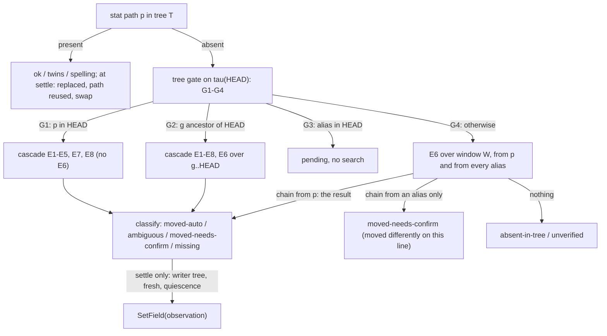

# 8. Файловые ссылки, устойчивые к перемещениям (R4)

## 8.1 Требование, механизм и гарантия

**Что требуется (R4, ваше требование от 2026-09-26).** Узел может ссылаться на файл проекта целиком или на место внутри него: диапазон строк, символ, раздел Markdown, цитату. Ссылка переживает переименования, перемещения (в том числе перемещения каталогов и смену одного лишь регистра) и правки содержимого, кто бы их ни сделал: moirai, вы в Explorer или IDE, агент (`mv`, `Move-Item`, `os.rename`, `Edit`/`Write`) или git (`checkout`, `switch`, `merge`, `rebase`, `stash`, `reset`, `apply`, `cherry-pick`). При удалении файла об этом узнают все ссылающиеся узлы. Нормативным документом является [40] (ревизия 2, которая отвечает на все замечания ревью [41]); AR §5e даёт только сводку.

**Почему выбран гибрид.** Одних явных команд недостаточно. В транскриптах агенты сделали 148 «сырых» `mv` против 7 `git mv` и 63 переименований через Python. Операции git, переписывающие дерево (`apply` ×189, `merge` ×85, `stash` ×43, …), примерно втрое многочисленнее явных перемещений (измерено, [13 §1.1–§1.2]). Поэтому явные глаголы точно фиксируют намерение, а всё остальное ловит ленивая детерминированная перепривязка. Watcher, демон, таймер и опрос отвергнуты (DR3, нулевой CPU в простое): `ReadDirectoryChangesW` теряет события [08 §4 W10], а watcher, который держит дескрипторы подкаталогов, ломает переименование каталогов-предков с ошибкой 5 (измерено, [13 §1.4]).

**Три принципа.**
- **P1: чтения вычисляют, запись делают только settle-точки.** `show`, `pack`, `brief`, `get`, `find`, `q`, `links check` и чтения MCP вычисляют состояние ссылок на лету и ничего не пишут в журнал (I-F5). Перемещённый или исчезнувший файл виден каждому ссылающемуся при его следующем чтении: это правило «node 40» в применении к файлам.
- **P2 / I-F13: автоматически перепривязывает только точное доказательство.** Нужен единственный точный кандидат, при ничьей перепривязки нет. Совпадение содержимого само по себе точным доказательством не считается.
- **P3 / I-F7: отсутствие файла никогда не означает удаления.** Если путь занят посторонним содержимым, ссылка получает состояние `replaced` и никогда не остаётся молча `ok`.

**Гарантия владельцу** [40 §0.2]:
- перемещение или удаление, сделанное через moirai в привязанном дереве, попадает в один коммит, который видят все ссылающиеся узлы; вместе с удалением записывается намерение (`reason`, `replaced_by`);
- перемещение, сделанное чем-то другим, правильно показывается при следующем чтении и записывается при следующем settle в дереве-писателе ветки;
- **ни одна ссылка не указывает молча на чужой файл или чужой текст.** У каждой ссылки не в состоянии `ok` есть состояние и однострочный следующий шаг. Догадка, принятая агентом, остаётся помеченной, пока её не подтвердит другая роль. Дерево, которое ещё не получило перемещение, прямо об этом сообщает.

**Задокументированное исключение** [40 §2.6, §4.6]. На Windows чтения используют `GetFileAttributesExW`, который возвращает размер, mtime, время создания и атрибуты, но не file id. Поэтому обмен местами двух файлов с одинаковыми размером и mtime чтению не виден (ссылка показывается как `ok`) до следующего settle: settle читает перечисление каталога с id и распознаёт `ambiguous(swap)`. На Linux и macOS `statx`/`lstat` возвращают id, и чтения такой обмен видят.

_Источники: AR §5e, §5e.1; [40 §0.1, §0.2, §1.1, §1.3, §2.6, §4.1, §4.6]_

## 8.2 Модель данных: два слоя, файловый узел и ребро `at`

**Два слоя** [40 §2.1]. Главное решение модели: *git версионирует файлы, moirai версионирует ссылки*.

| Слой | Что входит | Версионируется, сливается | Хэшируется, экспортируется в образ |
|---|---|---|---|
| **Намерение ссылки** | файловые узлы, корневые узлы с `path_moves`, рёбра `at` с якорями, намерение удаления | да, по веткам | да |
| **Разрешение и доказательства** | состояния по деревьям, OS file id (идентификаторы файлов ОС) и id родительских каталогов с ключами томов, stat-четвёрка, последний наблюдённый `oid`, предложения, отложенные наблюдения, намерения файловых операций, отпечатки, курсоры журналов, кэши фактов git | нет: это runtime на уровне хранилища | нет (I-F4) |

Где файл лежит в конкретной рабочей копии, это факт о рабочей копии; сливать его как данные значило бы дублировать git. А то, о каком файле и каком фрагменте идёт речь, это знание, и оно должно ветвиться, сливаться и переноситься.

**Файловый узел** — это расширенный вид `artifact`, так что число видов остаётся 13. Его поля:
- неизменяемые входы идентичности `origin_path` и `origin_pred`;
- `root`;
- **композит наблюдения** из шести полей (`path`, `oid`, `bytes`, `observed_git`, `observed_blob`, `relink`). Это один ключ слияния, потому что перемещение меняет путь, происхождение и обычно содержимое одновременно;
- `aliases`: прежние пути. Они разрешают старые упоминания и никогда не захватывают новый файл;
- `artifact_kind`: к прежним видам добавлены `source`, `doc`, `asset`, `generated`, `dir`;
- статус `planned < present` и боковой статус `removed` с полями `reason`/`replaced_by`.

`relink` хранит происхождение текущего пути из замороженного словаря R-17: `explicit/intent`, `lazy/file-id`, `lazy/dir-id`, `git/r100`, `git/case`, `hook/file-id`, `agent/similarity/0.81`, `confirmed/…`, `merge-observation/<evidence>` и т. д.

**Производная идентичность** [40 §2.3]:

```
lp(x)       = u32-le(len x) ‖ x                      -- у каждого поля префикс длины
uid(файл)   = BLAKE3-128(lp("moirai-file-v1") ‖ lp(root) ‖ lp(origin_path) ‖ lp(origin_pred | пусто))
uid(корень) = BLAKE3-128(lp("moirai-root-v1") ‖ lp(root))
captured    = BLAKE3-128(lp(file uid) ‖ lp(kind) ‖ lp(scope) ‖ lp(quote.exact) ‖ lp(end.exact) ‖ lp(occurrence))
uid(якорь)  = BLAKE3-128(lp("moirai-anchor-v1") ‖ lp(src uid) ‖ lp(captured))
```

- `origin_path` берётся байт в байт так, как его пишет дерево HEAD в git, если файл отслеживается git; иначе — как вернуло перечисление каталога. Свёртки регистра нет. Поэтому один и тот же закоммиченный путь даёт один uid на Windows, на Linux и в другом хранилище.
- Предшественник выбирается среди узлов, которые когда-то занимали этот путь (удалённых, стёртых движком, с этим путём в `aliases`). Побеждает тот, чьё последнее изменение сделано коммитом с наибольшей парой (generation, commit id). Это не зависит от хранилища.
- Мёртвые uid не создаются заново (I-F14).
- **Зачем производные uid:** параллельные линии (lanes) часто ссылаются на один файл. Они создают один и тот же uid, и слияние видит один узел. Известный uid переиспользует свой `#N` (I1).
- Остаточный случай: один файл зарегистрирован на двух ветках под разными путями. Получаются два узла; их объединяет `links fix --same-as`, а при точном переименовании в git это делает сам settle.

**Содержимое** [40 §2.5]. `oid` — хэш в форме git-блоба. Для текстовых файлов байты сначала нормализуются: CRLF → LF по статистике git `convert_is_binary`. Хэш SHA-1 или SHA-256 выбирается по репозиторию. Нормализация нужна потому, что 72 % файлов вашего рабочего дерева имеют CRLF при `core.autocrlf=true` (измерено). Равенство `oid` и id блоба git никогда не предполагается: все сравнения с git используют собственные id блобов git (`observed_blob`). Отпечаток `FPRINT` (≈ 300 B: bottom-64 скетч строк, размеры, веса) — runtime и может быть пересчитан.

**Корни и пути** [40 §2.4]. Корни бывают трёх видов:
- `project` — само дерево;
- именованные, которые на каждой машине задаются в `roots.<name>`;
- `abs` — локальный абсолютный путь; для него проверяются только существование и `oid`.

Правила путей: путь хранится относительно корня, с разделителем `/`, в точных байтах UTF-8 и без нормализации Unicode. Единственное исключение — NFC для неотслеживаемых имён на macOS. При привязке на всех ОС отвергаются компоненты с `\` или управляющими символами C0 и не-UTF-8 имена; такой путь, уже лежащий в git, показывается как `unrepresentable path` и кандидатом не бывает. Имена, которые какая-либо поддерживаемая ОС не может хранить (имена устройств Windows, точка или пробел в конце, `<>:"|?*`, компонент длиннее 255 байт, сосед, равный под `fold_v1`), `file mv` отказывается создавать, а `link`/`file add` о них предупреждают. Политику задаёт ключ `files.portable-names = refuse | warn` (по умолчанию `refuse`), а `--allow-nonportable` отменяет её для одной команды. Такие пути, уже лежащие в git, остаются привязываемыми и там, где существовать не могут, показываются как `missing (not representable on this OS)`.

Регистр. В версионированных данных пути сравниваются по точным байтам, а индекс `PATHIDX` упорядочен по свёртке `fold_v1` (полная свёртка регистра и NFD, Unicode 17.0.0). Различие только в регистре на диске даёт `ok (spelling differs on disk)`. Такая разница записывается, лишь когда её содержит закоммиченный HEAD дерева-писателя или когда она сделана через `file mv`: при `core.ignorecase=true` git сохраняет старое написание (измерено, [41 §1]). «Близнецы» с другой ОС (`Plan.md`/`plan.md`, NFC/NFD) разрешаются только по содержимому. Сессионные scratchpad-каталоги по умолчанию запрещены как цели (`files.scratchpads`).

**История перемещений каталогов — версионированное состояние.** Это поле корневого узла `path_moves`: множество записей `{hlc, class, from/, to/, git}`.

| Класс | Кто записывает | Переписывает glob-поля и участвует в композиции слияния |
|---|---|---|
| `explicit` | `file mv` каталога | да |
| `confirmed` | `links fix --prefix` | да |
| `committed` | settle увидел, что все отслеживаемые файлы под `from/` переименованы в `to/` в одном коммите git | да |
| `observed` | settle точно перепривязал все связанные узлы под `from/` (накапливается в `PREFIXEV`) | нет: только aliases и доказательство E5 |

Класс `observed` введён потому, что карантин внутри дерева для ленивого наблюдателя выглядит как перемещение каталога. `path_moves` — обычное множество с семантикой add-wins, поэтому ему не нужны ни свой op, ни трейлер, ни аннотация коммита. Glob-поля (`files_owned`, `applies_to`, `area.path_globs`) переписываются по литеральному префиксу в том же коммите. Glob, которому ничего не соответствует, показывается как `[glob matches nothing]`. Упоминания путей в тексте узлов никогда не переписываются: пакет лишь дописывает к ним `(now …)`.

**Ребро `at`** (любой узел → `artifact`) относится к историческому классу и несёт ≥ 1 якорь (I-F3). uid якоря служит дискриминатором ключа ребра, поэтому один узел может ссылаться на несколько мест в одном файле, а одинаковые захваты на двух линиях сливаются в один якорь. `finding.where` становится ребром `at` с якорем-символом, `cites` на файл — ребром `at` в режиме `pinned`.

_Источники: AR §5e.2; [40 §2.1–§2.6, §2.8]_

## 8.3 Якоря: захват и разрешение

**Как агенты пишут ссылки** [40 §2.7]. Формы взяты из того, что агенты и так пишут:

| Форма | Вид якоря |
|---|---|
| `path` | `file` |
| `path:L-M` | `quote` (≤ 4 содержательных строки и ≤ 128 B), иначе `range`; `lines`, если текста нет |
| `path::Type/fn` | `symbol` (элементы Rust, ключи TOML) |
| `path#H1/H2` | `heading` (Markdown) |
| `path@<commit>:L-M` | `quote` с `mode = pinned` (историческая цитата, не переразрешается) |
| `--quote-file PATH` | `quote` из буквального текста |

**Что хранит якорь.** Поля: вид, режим (`live|pinned`) и наблюдение (`header` для символов и заголовков, `span` для остального). Кроме того, область видимости (scope) от рукописных сканеров Rust, Markdown и TOML и цитата в стиле W3C: `exact` ≤ 64 B, а `prefix`/`suffix` расширяются, пока цитата не станет уникальной, затем добавляются scope и индекс вхождения. Также хранятся окно из ±16 строк в виде u16-хэшей, подсказка строки, `oid` и коммит на момент захвата, хэш фрагмента, дайджест захвата и версия резолвера. Размер 265–415 B, типично ≈ 345 B. Для ваших 34 195 цитат это ≈ 11,8 MB на диске и 0 B резидентно в простое (оценка). **Голый номер строки никогда не служит идентичностью (I-F9).**

**Захват** выполняется при записи, на дереве вызывающего:
1. Базовое имя, которое совпадает с несколькими файлами, отвергается (exit 2): 15,9 % ваших цитат были неоднозначны уже в момент написания (измерено, [11 §2.1]).
2. Цитата делается уникальной: с контекстом ±2 строки уникальны 98,7 % строк Rust, 99,9 % Markdown и 98,9 % HLSL (измерено).
3. Текст передаётся через `--quote-file`. У него отрезается BOM, а ввод с U+FFFD отвергается, потому что PowerShell 5.1 заменяет не-ASCII на `?`.

Захват стоит ≈ 0,1 ms плюс сканирование scope.

**Окно вместо старых блобов.** Здесь [40] отходит от отчёта [11]. Для разрешения дублей цитат нужен был бы diff со старой версией файла, а без git (R2) она недоступна. Поэтому хранится окно хэшей строк. Это проектное допущение [I], и у него есть гейт: на реплее ваших цитат разбор ничьих по окну должен совпадать с полным diff в ≥ 99 % случаев.

**Сканеры scope пишутся вручную** (решение #22): tree-sitter принёс бы в продукт C-рантайм и +1,8 MB, `tree-sitter-md` тратит 722 ms против 0,17 ms на одном файле, а на 23,9 % ваших шейдеров HLSL разбор падает (измерено). tree-sitter остаётся только тестовым оракулом.

**Каскад разрешения якоря** [40 §4.5]. Результаты кэшируются в runtime-таблице `ANCHORRES` по ключу (якорь, `oid` файла, версия резолвера). Шаги по порядку:
1. подсказка;
2. точная цитата сначала внутри однозначно разрешённого scope, затем во всём файле; дубли разбираются по согласию prefix/suffix, затем по выравниванию окна, затем по записанному индексу вхождения. **Выбор «ближайшего к подсказке» запрещён**: он выбрал не тот из 8 дублей;
3. нечёткое сравнение Майерса (сходство ≥ 0,75 с отрывом). Для переименованного символа или заголовка сравниваются только заголовки того же вида с отрывом 0,1, поэтому `acquire` никогда молча не привяжется к `acquire_shared`;
4. совпал только scope → `edited`;
5. ничего не найдено → `orphaned`.

При наблюдении `header` растущая функция или раздел остаются `fresh`, при `span` любое изменение фрагмента даёт `edited`.

**Пределы размера** [40 §2.5]. Файл читается потоком, и массив хэшей строк ограничен `files.max-line-hashes` (65 536 строк = 512 KiB); в файле длиннее этого якоря, опирающиеся только на окно, получают `unverified (size)`. `files.max-read-bytes` (16 MiB) — наибольший файл, содержимое которого вообще исследуется (это предел размера файла, а не буфера). Под `--deep` одновременно работают не больше 2 читателей содержимого.

**Измеренная основа.** Цитата с контекстом разрешила 96,3 % из 1 180 реальных цитат и 90,1 % тех, чьи файлы менялись. Номера строк дали 27,2 % (измерено, [11 §2.3]). За 4 месяца каскад был прав в 95,1 % случаев и ошибся в 0,9 %, тогда как валидными остались 27,7 % якорей по строкам (измерено, [10 §5.10]). Вариант «сначала только номера строк» сгноил бы 72 % якорей за 4 месяца.

_Источники: AR §5e.2, §5e.3; [40 §2.5, §2.7, §2.7.1, §4.5, §9.2]_

## 8.4 Состояния ссылок

Строки состояний заморожены в контракте вывода (R-16) [40 §2.9]:

| Состояние | Смысл | Пишется в версию? |
|---|---|---|
| `ok` | путь на месте (детали: `changed since c…`, `spelling differs on disk`) | нет |
| `moved-auto` | найден в другом месте по точному доказательству | при следующем settle в дереве-писателе |
| `moved-needs-confirm` | один сильный или слабый кандидат (`identical copy`, `edited+moved`, `similar 0.81`, `split`, `merged`) | нет, это предложение в `FILEOBS` |
| `ambiguous` | ≥ 2 кандидата (`rename-over`, `swap`, `merge conflict`, `case collision`, `path reused; original at q`) | нет |
| `deleted` | статус `removed` с причиной и заменой | да |
| `replaced` | путь на месте, но файл пересоздан с посторонним содержимым | нет |
| `stale-anchor` | файл разрешён, якорь `edited`/`ambiguous`/`orphaned` | нет |

Относительно дерева эти состояния дополняют ещё пять: `missing`, `absent-in-tree` (`behind` сворачивается в счётчик заголовка, `diverged` помечается у каждой ссылки), `pending`, `planned`, `unverified`. Состояния якоря: `fresh`, `moved`, `edited`, `ambiguous`, `orphaned`. Когда нужно свести несколько состояний в одно, побеждает самое тяжёлое в порядке `missing, replaced, deleted, ambiguous, moved-needs-confirm, stale-anchor, unverified, pending, planned, absent-in-tree, moved-auto, ok`.

**На ссылающиеся узлы влияют два механизма.** Файловый узел в статусе `removed` или удалённый движком (tombstone, например через `moirai rm`) делает источник `suspect`: это состояние графа, оно поддерживается в пути записи. Всё остальное — предикат времени чтения, производный от дерева. Он **никогда не блокирует `ready`**, существует только на вершине ветки с разрешённым деревом и показывается в пакетах.

**Как это видит агент** [40 §6.2]. Заголовок выглядит так: `files @ <lanes-dir>/l5np: 38 ok | 2 moved | 1 missing | 3 absent-in-tree(behind)`. Метка ставится только у ссылок не в состоянии `ok`, например `[moved? -> storage-v2.md 0.81 | verify #815]`. **Ни одна метка не печатает команду, которая принимает догадку**: предложения печатают команду просмотра доказательств (`moirai file where N --evidence`). Типичный пакет с 1–3 проблемными ссылками прибавляет 15–50 токенов.

_Источники: AR §5e.2; [40 §2.9, §6.2]_

## 8.5 Разрешение: гейт дерева и каскад доказательств



Диапазоны E1–E5 и E1–E8 взяты из [40] как есть; E2 в них зарезервирован, но не строится (§8.9).

**Гейт дерева идёт первым** [40 §5.2]. До любого поиска резолвер читает закоммиченное дерево τ(HEAD) через git-слой внутри процесса (M4):

| Строка | Условие | Итог |
|---|---|---|
| G1 | путь есть в τ(HEAD), но не на диске | это дерево переместило или удалило файл без коммита → поиск E1–E5, E7, E8 (без E6) |
| G2 | `observed_git` — предок HEAD | поиск E1–E8, с переименованиями по коммитам (E6) на `observed_git..HEAD` |
| G3 | в τ(HEAD) есть alias | перемещение сделано на линии, которую дерево ещё не получило → `pending`, без поиска |
| G4 | иначе | E6 по окну интеграции W от p и от каждого alias (чинит `git apply` ×189, rebase, squash): цепочка от p — сама результат поиска (дерево держало p, значит, оно fresh для узла); цепочка только от alias → `moved-needs-confirm (moved differently on this line)`; ничего → `absent-in-tree` (или `unverified (commit not in this repository)`, если коммита наблюдения нет в локальном хранилище объектов) |

Предок определяется за ≤ 1 ms с commit-graph и за ≤ 5 ms без него. Ваш commit-graph не покрывает ни одного свежего HEAD (измерено, [41 §1]). Работа с git считается в единицах `fs`. **Чтение** может использовать не больше одной некэшированной пары предков и не больше 32 коммитов E6 на команду (≤ 10 ms p99). Остальное показывается как `unverified (git: moirai links sync | moirai check)` — никогда не неверно.

**Каскад доказательств** [40 §4.3] работает только по *несвязанным* кандидатам, то есть по путям, которые не являются текущим путём другого живого узла. Кандидаты берутся только внутри корня, никогда в игнорируемом выводе, облачных заглушках, Корзине и среди «никогда не кандидатов» (`*.tmp`, `*.bak`, `*~`, `*.orig`, `*.swp`, `4913`, `.#*`, `~$*`, `sed??????`, конфликтные копии OneDrive, старое имя + суффикс).

| Источник | Доказательство |
|---|---|
| **E1** | записанное намерение (`FSINTENT`) и доказательства хуков (`PENDING`). Точным считается только записанное намерение или цепочка file id; строка хука, разобранная из argv, — лишь сильное доказательство |
| ~~E2~~ | цепочка журнала USN — **не строится** (§8.9) |
| **E3d** | id родительского каталога: NTFS сохраняет его при перемещениях каталога и предков, поэтому один `OpenFileById` (0,17–0,40 ms, измерено) перепривязывает все файлы под перемещённым каталогом; точно только если у `D′/basename(p)` совпадает file id, размер+mtime или `oid`. Иначе там выполняется проверка `replaced`, которая даёт `replaced` или `moved-needs-confirm (directory moved, file replaced)` |
| **E3** | собственный file id (всегда весь тегированный `OsFileId`), проверенный размером+mtime или `oid`: слоты MFT переиспользуются (один слот — 165 раз за 2 000 циклов, измерено) |
| **E4** | соседние каталоги и цели aliases |
| **E5** | записанные `path_moves` |
| **E6** | точные переименования по коммитам из деревьев git; группы с одинаковым блобом → `ambiguous`, никогда не спариваются по порядку |
| **E7** | поиск по `oid` среди файлов, созданных после последнего settle (никогда при первом settle дерева) |
| **E8** | новый файл с тем же basename и containment скетча ≥ 0,8 в обе стороны → `moved-needs-confirm (edited+moved)` |

**Почему одинаковое содержимое само по себе ничего не перепривязывает (правило копии, I-F13).** У агентов есть резервные копии, зеркала и вендорные копии; 1,2 % ваших файлов входят в группы точных дубликатов (измерено, [10 §5.1]). Кандидат с равным `oid` считается точным только в трёх случаях:
- git показывает переименование внутри одного коммита;
- его называет записанное намерение;
- для близкого кандидата на Windows совпадает время создания при условии, что это время уникально в просмотренной области.

На Linux и macOS совпадение времени создания даёт максимум сильное доказательство. Кандидат, который существовал одновременно с оригиналом, считается копией и целью не бывает никогда. В остальных случаях получается предложение `identical copy`.

**Три ОС** [40 §2.11 R-14, §4.3]. Семантика резолвера одна, доказательства поставляют провайдеры каждой ОС. На Windows это `OpenFileById`; на macOS — `fsgetpath`, а время создания засчитывается правилом копии только там, где оно туннелируется, а не копируется, и без признака клона; на Linux, где нет непривилегированного открытия по id, — фронтир изменившихся каталогов по `DIRMAP`, причём попадание засчитывается только вместе с сохранённым дайджестом file handle, потому что ext4 переиспользует номера inode. Идентичность — всегда весь тегированный `OsFileId`, никогда не один номер inode. Эти правила — константы R-14 и замораживаются в M0. В M6 строится только реализация для Windows; Linux и macOS реализуются в незапланированной фазе порта (решение #32).

**Классификация** [40 §4.4]:
- точный и единственный кандидат → `moved-auto`;
- точная ничья → `ambiguous`;
- сильное доказательство → `moved-needs-confirm`; применяется автоматически только при `files.policy.auto = strong`;
- разделение (split): при settle — неточная пара E6, коммит которой добавил ещё ≥ 1 файл, причём у ≥ 2 добавленных файлов new-in-old ≥ 0,8, а их доли old-in-new в сумме ≥ 0,6 → `moved-needs-confirm (split)`, разрешается через `links fix --split`;
- слияние в файл-хозяин (merged): old-in-new ≥ 0,8 и new-in-old < 0,5 → `moved-needs-confirm (merged)`;
- слабое доказательство: лучшее сходство в [0,3; 0,5) или отрыв < 0,2 (а также пара git на 20–49 %, подтверждённая containment) → `moved-needs-confirm` или `ambiguous`;
- крошечный файл (< 5 нормализованных строк или < 64 B): точным бывает только по E1, E2, E3, E3d и E6, иначе `ambiguous`/`missing`;
- ничего (сходство ниже 0,3) → `missing`;
- кончился бюджет → `unverified`, никогда не догадка.

Сходство (bottom-64 скетч; ≥ 0,5 с отрывом ≥ 0,2 — это порог git в 50 %, выше p90 фона несвязанных файлов) считается только под `--deep` и только предлагает. `replaced` ставится, когда изменились и `oid`, и file id, оба содержимых — текст из ≥ 5 строк, а containment ниже 0,29 в обе стороны; артефакты `generated` исключены. Если на месте файла чужой file id, а оригинал жив в другом месте, получается `ambiguous (path reused; original at q)`: так случай `mv storage storage_old; mv storage_v2 storage` не оставит ссылку `ok` на чужом файле. Все пороги, списки шаблонов и `fold_v1` — константы версии резолвера (R-14), поэтому `resolve(link, tree snapshot, resolver version)` является чистой функцией (I-F10). Смена версии объявляется.

> ✅ **Подтверждено вами 2026-09-27 (Б9 раздела 15):** замораживаемые в формате v1 инварианты I-F13 (равенство содержимого само по себе никогда не перепривязывает автоматически; сосуществовавшая копия никогда не становится целью) и I-F6 (автоматическая перепривязка — только деревом-писателем ветки, только когда оно fresh для узла, только после проверки тишины, на `main` — только закоммиченное наблюдение). Какие доказательства применяются автоматически, формат не фиксирует: это ключ конфигурации `files.policy.auto` (AR §11 относит политику автопривязки к runtime-политике, а [40 §9.2] переводит решение 1 в ключ). `exact` — лишь значение по умолчанию; вы можете в любой момент переключить ключ на `strong`, и тогда автоматически применяются и единственные сильные кандидаты, помеченные как догадки до подтверждения. При `exact` совпадение содержимого без подтверждения, сходство и файл, отредактированный и перемещённый без хука, дают только предложения, которые должен подтвердить агент или человек. Цена — больше ручных подтверждений (edit-then-move — 5,0 % разрешимых перемещений, измерено). Выгода — отсутствие молча неверных ссылок.

_Источники: AR §5e.3, §11, §13 (`files.policy.auto`); [40 §2.10, §2.11 R-14, §4.3, §4.4, §5.2, §9.2 решение 1]_

## 8.6 Settle-точки и единственное дерево-писатель

**Когда выполняется работа** [40 §4.2]:

| Триггер | Вид | Бюджет и особенности |
|---|---|---|
| `show`, `pack`, `brief`, `get`, `find`, `q`, чтения MCP | чтение, ничего не пишет | ≤ 20 ms файловой работы на команду, дальше `unverified (budget)` |
| хук `UserPromptSubmit` (дельта) | чтение, ничего не пишет | изменения состояний ссылок, процитированных или арендованных агентом, с прошлого промпта сессии; ≤ 600 B |
| `SessionStart` | settle ссылок брифа и `files_owned` линии; остальное — если полный settle старше `files.settle.others-after` (24 h) | жёсткий потолок 150 ms вместе с ожиданием тишины |
| `links sync` | settle | 2 s из CLI; ≤ 200 ms на вызов MCP с курсором продолжения |
| `link`, `file *`, `links fix` | settle своих ссылок | в коммите команды |
| `complete` | settle ссылок поддерева | **отдельным коммитом после коммита `complete`** |
| ритуал слияния, git `post-commit` (если установлен) | settle | 2 s / 200 ms |
| хуки доказательств | пишут только runtime-строки | 100 ms / 0,3–0,7 ms |

**Тихий режим** (AR §6.6): хуки доказательств и блоки git-хуков читают флаг из `HEAD` и выходят до любого другого ввода-вывода; `SessionStart` делает только stat (без хэширования, перечисления, E6 и записей); `--deep` и `--all` отвергаются без `--force`.

**Что пишет settle.** Только `SetField(observation)` (+ `aliases`), переход `planned → present` и подходящие записи `path_moves` с перезаписью glob-полей. Переход `planned → present` при первом settle в дереве-писателе, которое нашло путь, выполняется, **только если** HEAD этого дерева происходит от коммита планирования или файл создан позже этого коммита; поэтому устаревшее дерево с историческим файлом по этому пути его никогда не привяжет [40 §3.2]. Каждая перепривязка защищена CAS по `rev_seq` узла, прочитанному в начале разрешения; при несовпадении она отбрасывается до следующего settle. Перед записью идёт **повторная проверка тишины (quiescence)**: через ≥ 50 ms источник проверяется снова, и перепривязка отменяется, если он вернулся (атомарные сохранения убирают оригинал на миллисекунды). Settle пишет одну эпоху `TreeReg` и строки `FILEOBS` только для изменившихся файлов, поэтому неизменное дерево стоит < 16 KB журнала и 5–30 ms. Файлы читаются потоком через один буфер 128 KiB, так что файл размером 16 MiB стоит ≤ 4 MB приватной памяти, а не 32 MiB.

**Деревья** [40 §5.1]. Дерево определяется точным git top-level; вложенный `.claude/worktrees/*` считается отдельным деревом. У вас 46 worktree (измерено, [41 §1]); 36 из 44, насчитанных в [13], были устаревшими предками trunk и отставали на 272–1 036 коммитов. Дерево команды выбирается по цепочке `--tree` → cwd → аренда (lease) → run → линия (`lane.worktree_path`) → назначенное дерево ветки → `files.main-tree` для `main`.

Работу по ссылкам получает только подходящее (eligible) дерево: назначенное дерево какой-либо ветки, git worktree репозитория, в общем каталоге которого лежит хранилище, дерево, у которого уже есть строки `FILEOBS`, или дерево, явно названное через `--tree`. Иначе (например, после импорта образа на машину без файлов) заголовок говорит `files: no tree bound (moirai worktree bind DIR BRANCH)`, каждая ссылка — `unverified (no tree)`, и никакие stat, перечисления и поиск не выполняются. Без git `moirai init` привязывает собственный каталог как назначенное дерево `main`. Каждый результат с файлами называет своё дерево и число грязных файлов: `files @ <lanes-dir>/l5np (u/l5np 7c1e0a, dirty 3 4m ago)`. Это число читается из runtime-строки `TREES.dirty` вместе с её возрастом: ни одно чтение не сканирует worktree, а `links check --dirty` пересчитывает его по запросу.

**Что нужно настроить вам.** Задайте `files.main-tree` (например, trunk-worktree) и проверьте `files.main-ref` — git-ref, на котором должно стоять дерево `main`, чтобы писать перепривязки (по умолчанию ветка, выбранная при `init`, например `integ/unified`). Если `files.main-tree` не задан, `main` использует главный worktree, который может отставать от trunk на сотни коммитов, и `doctor` об этом предупреждает.

**Кто может записать перепривязку (I-F6, I-F12)** [40 §5.3]. Только единственное **назначенное дерево** ветки, пока его HEAD стоит на ожидаемом git-ref привязки. После `git switch` дерево становится читателем: `reading only: tree on u/other, branch expects u/l5np`. Дополнительные условия:
- дерево **fresh** для узла, то есть уже получило наблюдение, на котором основано текущее значение;
- прошла проверка тишины;
- на `main` записываются только наблюдения, закоммиченные в HEAD дерева-писателя. Иначе незакоммиченное наблюдение ушло бы во все линии при `sync` и было бы перепривязано обратно.

Все остальные деревья (`wf_*`, harness-worktree, вложенные) — читатели. Их наблюдения становятся строками `PENDING` и продвигаются, когда дерево-писатель видит то же перемещение точно. Поэтому перемещения из harness-worktree доходят до ветки вместе с кодом, но не раньше. Строки `PENDING` — это доказательства, а не намерение, и хранятся 30 дней; ссылка в состоянии `pending` старше `files.pending-escalate` (14 дней) показывается со своим возрастом.

**Жизненный цикл линии** [40 §5.4]:
- `merge-check` перечисляет перепривязки на незакоммиченных наблюдениях («commit the move first»); `--strict-links` дополнительно отказывает при `missing`, `ambiguous`, `replaced`, `stale-anchor`;
- между `moirai merge` и `git merge` дерево trunk видит перемещённую ссылку как `pending` (G3) и не перепривязывает её обратно;
- после git merge выполняется `moirai links sync --tree <trunk> --since <pre-merge HEAD>`.

**Слияние** [40 §5.5]. Движок слияния **никогда не читает ФС и git**, поэтому слияние остаётся чистой функцией истории (I28′, I30′). Правила:
- композит наблюдения берётся с изменившейся стороны или составляется через записанные `path_moves`; иначе получается конфликт `FieldEdit`, который позже разрешает settle в дереве, fresh для всех сторон;
- узел, созданный на одной стороне и удалённый на другой, **перекодируется (re-key), а не воскрешается**;
- `present` против `removed` даёт `StatusFork`, и присутствие пути никогда его не разрешает;
- два живых узла на одном пути дают `PathClaim`;
- якоря, glob-поля и `path_moves` — множества add-wins.

> ✅ **Подтверждено вами 2026-09-27 (Б9 раздела 15):** у ветки ровно одно дерево-писатель (I-F12), и `main` принимает только закоммиченные наблюдения. Цена: перемещения в harness-worktree и других деревьях-читателях остаются `pending`, пока код не дойдёт до дерева-писателя, а `main` отражает перемещение только после git merge. Альтернатива «писать сразу» отвергнута, потому что она пишет в ветку непроверенные факты (DR1).

_Источники: AR §5e.3, §5e.4, §6.6; [40 §2.6, §2.9, §3.2, §4.2, §5.1–§5.5, §7.2]_

## 8.7 Явные глаголы и crash-safe протокол намерений

**Глаголы** [40 §3.1]. Они вынесены в отдельные пространства имён, потому что `add`, `rm`, `move`, `link` уже заняты глаголами узлов:
- `link ID --at SPEC`, `unlink ID --at aN|PATH`;
- `file add|mv|rm|relink --after|revert|where [--evidence]`;
- `links check|sync|fix|mentions|import`;
- `hooks install --git`.

`links check` никогда не пишет; `links mentions` только сообщает об упоминаниях (у вас 188 висячих ссылок в тексте, измерено) и файлы не переписывает. Глаголы, меняющие ФС (`file mv|rm|revert`), доступны **только из CLI** и выполняются **только в дереве-писателе** ветки вызывающего. В любом другом месте они отказывают (exit 5) и печатают команду привязки; это решение #20, принято. «Сырой» `mv` остаётся возможен и ловится лениво.

**Протокол `file mv`** [40 §3.4]. Транзакции ОС, охватывающей переименование и коммит, не существует (TxF устарел). Поэтому шаги такие:
1. **План**, только чтение: дерево-писатель, источники, отсутствие цели, затронутые узлы по диапазону `PATHIDX` и пробе `ALIASIDX`, затронутые glob-поля.
2. Долговечная запись **`FsIntent`** в отдельной сбрасываемой группе (≈ 2 ms).
3. Переименование без замены: `MoveFileExW` без флагов replace/copy; на Linux и macOS `renameat2(RENAME_NOREPLACE)`/`renamex_np(RENAME_EXCL)`. Затем `durable-name` обоих родительских каталогов, чтобы переименование стало долговечным до фиксирующего его коммита. Каталог переносится одним переименованием: 9,5 ms на 1 000 файлов (измерено). При ошибках 5/32 — ограниченные повторы с диагнозом; перенос файла между томами идёт как копия → сброс → проверка `oid` → удаление.
4. **Один коммит**: новые наблюдения узлов, старые пути в `aliases`, запись `explicit` в `path_moves` для каталога, перезапись glob-полей и `FsIntentDone`, каждый узел под CAS.

Намерение хранит якорь живости — слот, который CLI держит всё время жизни намерения, а не pid. При следующем открытии писателем или в `doctor` намерение, чей якорь мёртв, восстанавливается по состоянию ФС:

| Состояние ФС | Решение |
|---|---|
| источник на месте, цели нет | `FsIntentAborted` |
| источника нет, цель на месте | докатить коммит, `explicit/intent-recovered` (при изменённом `oid` — с деталью `content changed after the move`) |
| оба на месте | `ambiguous`, ничего не удаляется |
| нет ни того, ни другого | `missing` |

Итог: намерение никогда не теряется, и граф никогда не применяется наполовину; это проверяется перебором точек краха. Стоимость — два сброса (≈ 4 ms) плюс переименование (p50 4–10 ms под нагрузкой).

**`file rm`** [40 §3.5]. Без `--yes` работает как пробный прогон и показывает затронутые ссылки, якоря, glob-поля и упоминания. С `--yes` выполняются `FsIntent`, удаление (или `--trash`), сброс родительского каталога и один коммит: `removed{reason, replaced_by}`, при `--replaced-by` — переброска якорей на замену, а ссылающиеся узлы становятся `suspect` через обратный индекс. Это правило «node 40» для файлов.

**Индекс git** не трогается никогда, кроме опционального `--git` (ключ `files.mv-git`, по умолчанию `false`): изменение индекса по умолчанию рискует повторить записанный у вас инцидент, когда было закоммичено staged-удаление чужого агента. Это единственный процесс git во всём R4: ни один путь разрешения ссылок git не запускает (AR §5e.3, §5e.5, §5c).

**`links fix`** записывает доказательство от человека или агента:
- `--accept` работает только вместе с `--expect PATH` и только если лучшее предложение, пересчитанное заново, всё ещё равно PATH;
- также есть `--to`, `--confirm`, `--accept-replacement`, `--drop`, `--same-as`, `--split`, `--repin` (после нечёткого совпадения только с `--at`), `--pin`, `--restore`, `--prefix`;
- неточная перепривязка, принятая агентом, показывается как `[accepted guess … · confirm: moirai links fix 815 --confirm]`, пока её не подтвердит другой актор с ролью из `files.confirm-roles` (по умолчанию orchestrator, owner).

```
$ moirai file mv docs/plan docs/archive/plan
intent i-19 | 1 directory rename (9 ms) | 14 links re-pointed | path_moves += explicit project:docs/plan/ -> docs/archive/plan/
2 globs rewritten (files_owned of #89, applies_to of #212) | commit c4475
hint: git add -A -- docs/plan docs/archive/plan
```

_Источники: AR §5e.5; [40 §3.1–§3.8]_

## 8.8 История, git-образ, работа без git и неприкосновенность файлов

**Глаголы истории никогда не трогают рабочее дерево** [40 §5.6]. После `undo`, `revert` или `cherry-pick` коммита, который перемещал файлы, следующий settle перепривязывает ссылку туда, где файл реально лежит (P5: ссылки следуют за файлами). Файлы на диске возвращает `file revert COMMIT`; простой `revert` об этом предупреждает.

**Образ (R3)** [40 §5.7]:
- файловые и корневые узлы — обычные файлы `.moi`; якоря — строки `anchor` в `.moi` *ссылающегося* узла;
- надгробия (tombstone) сохраняют свои строки якорей;
- R4 не добавляет трейлеров и аннотаций коммитов, и ничего машинно-локального не хэшируется и не экспортируется;
- намерение ссылки проходит круг экспорт → импорт без потерь при любой гранулярности, а импортирующее хранилище разрешает ссылки по своим деревьям.

Отпечатки не экспортируются: импортирующее хранилище пересчитывает их по содержимому, которое может прочитать. Поэтому файл, исчезнувший до того, как импортирующее хранилище его хоть раз увидело, там можно перепривязать только по точному доказательству и истории git, но никогда по сходству; это заявленное ограничение [40 §2.5].

Текст цитат входит в каноническую форму только как дайджесты BLAKE3-128, поэтому `image.dest.<name>.anchor-text = hash-only` не меняет id коммитов. Якорь, импортированный без текста, находится в подсостоянии `text-unavailable`. На вашем масштабе образ ссылок весит ≈ 1 + 18 MB (оценка).

**Без git** [40 §5.8] работает всё, кроме гейта дерева, E6, сходства по старым блобам и обнаружения разделения файлов при settle. Отсутствующий файл тогда всегда проходит каскад и никогда не считается удалённым. Правила игнорирования берутся из `.gitignore`-подобных файлов, а без них из `files.ignore` (`target/`, `node_modules/`, `build/`).

**Git-читатель внутри процесса — жёсткая зависимость, а не ускоритель** [41 B2]. Запасной вариант со spawn стал бы промежуточной стадией и сломал бы бюджет `SessionStart` в 150 ms: один spawn стоит 130–750 ms (измерено).

**Руки прочь от ваших файлов** (DR9, I-F11, решение #21 (a)–(c): нет/нет/нет):
- файлы открываются только с `FILE_SHARE_READ|WRITE|DELETE` и закрываются до следующего; не отображаются в память, не блокируются и не пишутся;
- никаких id внутри файлов, NTFS object ID, альтернативных потоков и переписанного текста;
- облачные заглушки (OneDrive `RECALL_*`, macOS `SF_DATALESS`) автоматический путь не открывает (`unverified (cloud-only)`); явным глаголам нужен `--allow-hydrate`.

Открытым остаётся решение #21 (d): ставить ли на связанные файлы macOS document id (`UF_TRACKED`), чтобы он переживал сохранения с переименованием поверх. Оно стоит в AR §11 в разделе «Later», срок — порт на macOS, по умолчанию «нет». От него не зависит ни один замороженный байт (`OsFileId.docid` зарезервирован).

_Источники: AR §5e.6, §5e.7, §11 #21 (d); [40 §2.5, §5.6–§5.8, §4.6, §9.2 решение 3]_

## 8.9 Что сознательно не строится и почему

| Не строится | Причина | Что остаётся |
|---|---|---|
| **E2 — воспроизведение журнала USN** | на D: лежат все репозитории, и журнала на нём нет; журнал C: размером 32 MB хранит только 1–2 h под нагрузкой, поэтому на ваших деревьях E2 не дал бы ничего ([74 A13]) | зарезервированы `JournalCursor`/`JOURNALCUR`; условие пересмотра — привязанное дерево на томе с журналом, который живёт дольше медианного интервала settle; сборка потом ≈ 1–2 units и ключ `files.journal` |
| **FSEvents (macOS)** | E2 исключён на всех ОС до срабатывания условия; на Linux нет непривилегированного постоянного журнала | описано в [40 §4.7] |
| **Watcher, демон, опрос, `FileChanged`** | DR3; watcher ломает переименование каталогов-предков (ошибка 5) | ленивая перепривязка |
| **Подсказка через хук `PreToolUse` при перемещении** | исключена решением ([74 A17]) | правило в skill; условие пересмотра — измеренная доля сырых `mv` связанных файлов |
| **tree-sitter в продукте** | C-рантайм, +1,8 MB, сбои на HLSL | только тестовый оракул |
| **Переписывание упоминаний путей, маркеры в файлах, NTFS object ID** | решение #21 | `links mentions` только сообщает |
| **Семантическое отслеживание кода** (символ перенесён в другой crate и переименован) | вне объёма [40 §1.4] | многие такие случаи ловят поиск по цитате и по scope; для остального остаются языковые серверы |
| **Перепривязка вне корней** | вне объёма [40 §1.4] | для корня `abs` — только проверка существования и `oid`; перенос за пределы корня даёт `missing (moved outside root)` |
| **Гидратация облачных заглушек в автоматических путях** | вне объёма [40 §1.4] | `unverified (cloud-only)`; явным глаголам нужен `--allow-hydrate` |
| **Файл, переписанный до неузнаваемости и перемещённый без записанного намерения** | вне объёма [40 §1.4] | остаётся `missing` с кандидатами, решение за человеком или агентом |

Необязательные ускорители (каждый — ключ конфигурации, корректность от них не зависит):
- хук `PostToolUse` для доказательств при `mv`/`rm`/`Move-Item`/`Rename-Item`/`Remove-Item`: включён, срабатывает на ≈ 0,9 % вызовов оболочки;
- хук `Write|Edit` (`files.hooks.edit-evidence = auto`): включён, только когда хуки работают как `mcp_tool` без spawn (0,3–0,7 ms на правку). С командными хуками каждая из 23 754 правок переписи стоила бы spawn в 25–73 ms;
- под Codex матчер `PostToolUse` — регулярное выражение только по имени инструмента, поэтому хук перемещений совпадает с каждым вызовом оболочки (`^Bash$`) и должен быть обработчиком `mcp_tool`, который фильтрует `${tool_input.command}` внутри процесса, либо быть выключен: командный хук запускал бы `cmd.exe` и moirai на каждый вызов. Правки в Codex приходят через `apply_patch`, его строки `*** Move to:` — точное доказательство перемещения, а хук на `^apply_patch$` ставится только после того, как проба P5 [90 §10.5] подтвердит его поле ввода;
- блоки git-хуков: их ставите только вы через `moirai hooks install --git`.

> **Примечание (исторические отчёты, не нормативные документы):** отчёты расходятся в вопросе доступа к USN — [09]:16 измерил чтение без прав администратора, [12]:34 и [13]:47 утверждают обратное. [40 §4.7] и [80 §2.11.1] следуют измерению [09]. На решение это не влияет: E2 в M0–M11 не строится, а причина исключения — отсутствие журнала на D:.

> ✅ **Уже решено (2026-09-26, AR §11 #41, «Decided as recommended»), подтверждено 2026-09-27 (Б9, Б11 раздела 15):** E2 (USN), FSEvents, любые watcher и хук-подсказка `PreToolUse` не строятся; условия пересмотра и резервы формата сохраняются. Действовать нужно, только если вы захотите это решение пересмотреть. Следствие: перемещения вне moirai видны только при следующем чтении и записываются при следующем settle, а «правка, затем перемещение» без хука `Write|Edit` превращается в предложение, а не в автоматическую перепривязку.

_Источники: AR §5e.7, §11 #41, §13; [40 §1.4, §4.7, §9.2]; [90 §3.7, §10.5]_

## 8.10 Инварианты I-F1…I-F14

Инварианты замораживаются в спецификации формата (R-12) и проверяются тестами свойств:

| ID | Суть |
|---|---|
| I-F1 | на каждом представлении ветки не больше одного живого `present`/`planned` узла на (root, точный путь); после слияния дубль даёт `PathClaim` |
| I-F2 | каждый uid файла, корня и якоря равен своей производной от хранимых входов; `Create` известного uid переиспользует `#N` |
| I-F3 | у каждого `at` ≥ 1 якорь; каждый якорь принадлежит ровно одному `at` |
| I-F4 | OS file id, ключи томов, mtime, время создания, кэши, состояния, предложения и все runtime-таблицы никогда не попадают в версионированные, хэшируемые и экспортируемые данные |
| I-F5 | глаголы чтения ничего не добавляют в журнал |
| I-F6 | автоматическая перепривязка — только по точному доказательству (или при `files.policy.auto = strong`), только деревом-писателем, только когда оно fresh, после проверки тишины, на `main` — только закоммиченное |
| I-F7 | `removed` никогда не выводится из отсутствия: только `file rm`, `links fix --drop`/`--same-as` или `files.deletion-inference = main-tree-commits` |
| I-F8 | правила путей (относительно корня, `/`, точные байты UTF-8; `abs` — единственное исключение) |
| I-F9 | ни у одного живого якоря-фрагмента голый номер строки не является единственным селектором |
| I-F10 | `resolve` — чистая функция; пороги — константы версии резолвера |
| I-F11 | файлы открываются только с полным разделением доступа, не отображаются и не блокируются; облачное содержимое автоматически не открывается |
| I-F12 | у ветки не больше одного назначенного дерева, у дерева не больше одной ветки |
| I-F13 | ни одна автоматическая перепривязка не опирается только на равенство содержимого; сосуществовавшая копия никогда не становится целью |
| I-F14 | удалённый производный uid не оживает через регистрацию или слияние; вернуть его можно только через `links fix --restore` или `Undelete` |

_Источники: AR §5e.8; [40 §2.10]_

## 8.11 Что замораживается, бюджеты, стоимость и размещение по вехам

**Замораживается в формате v1 на выходе M0** [40 §2.11]: резервы R-1…R-18. В них входят:
- типы значений `path`, `oid`, `pathmove`;
- поля `artifact` и корневого узла;
- функции вывода uid и правило re-key;
- вид ребра `at` с дискриминатором и раскладка якоря, где цитаты хранятся только дайджестами;
- `HEAD.next_anchor`;
- виды записей журнала (`FsIntent*` долговечные, остальные ленивые) и секции сегментов (`PATHIDX`, `ANCHORS`, `FILEOBS`, `ANCHORRES` и др.);
- грамматика `.moi`;
- инварианты;
- таблица констант резолвера (R-14: пороги, `is_text`, `fold_v1`, список «никогда не кандидатов», пауза тишины 50 ms, окно E6 в 2 000 коммитов, правила для разных ОС);
- строки состояний (R-16), словарь `relink` (R-17), раскладка `FILEOBS` (R-18).

**Остаются ключами конфигурации** (R-13, AR §13): `files.policy.auto`, `files.hooks.*`, `files.deletion-inference`, `files.mv-git`, `files.confirm-roles`, `files.cloud`, `files.scratchpads`, `files.portable-names`, все бюджеты времени и памяти, `roots.<name>`, `files.main-tree`/`main-ref`, `image.dest.<name>.anchor-text`.

**Бюджеты** (гейты GT11 на вашем ноутбуке, профиль L):

| Показатель | Гейт |
|---|---|
| ссылки в пакете из 50 ссылок: все на месте / все под перемещённым каталогом / 10 файлов правились | ≤ 3 ms p50 в простое и ≤ 5 ms под нагрузкой / ≤ 5 ms p50 / ≤ 5 ms p50 |
| работа с git на пути чтения | ≤ 10 ms p99 |
| settle при `SessionStart` | ≤ 150 ms под нагрузкой 16 агентов; ≤ 16 KB журнала, если ничего не изменилось |
| `links check --all` при 1e4 | ≤ 0,7 s в тёплом состоянии |
| приватный RSS | ≤ 4 MB для чтений (в том числе якоря в файле 16 MiB) и хуков; ≤ 8 MB `--all`; ≤ 16 MB `--deep` при 1e5 |
| журнал от чтений / CPU в простое / процессы | 0 байт / 0 % / ни одного spawn, кроме `file mv --git` |

**Диск:** ≈ 345 B на якорь, ≈ 260 B на файловый узел, ≈ 12 MB якорей на вашем масштабе, 0 B резидентно в простое.

**Размещение и стоимость** (оценка по слоям, без дельт [60 §7.1]: ≈ 22–30k строк продуктового Rust плюс 10–14k строк тестов, **≈ 68–93 units**) [40 §8.1]:

| Веха | Что строится | units |
|---|---|---|
| M0 | FL-0 (резервы, ABNF, константы резолвера, логика ссылок в эталонной модели с переборным резолвером якорей); FL-1 — чистые библиотеки (правила путей, `is_text`/`oid`, скетчи, захват и разрешение якорей, Майерс, histogram diff, общий с diff3 из M3, сканеры, gitignore) | 19–25 |
| M1 | виды записей и секции R4 в реестре (≈ 0,5k строк) | в составе M1 |
| M2 | FL-3: файловые и корневые узлы, производные uid, `at` и якоря, индексы, `suspect` | 6–9 |
| M3 | FL-7: правила слияния | 3–4,5 |
| M4 | API git для R4 (≈ 0,3k строк) | в составе M4 |
| M5 | FL-8: носитель в образе | 2,5–3,5 |
| M6 | FL-2 `ProjectFs` с детерминированным симулятором (вторая линия (lane) с выхода M0) и FL-4: резолвер, settle, гейт, каскад, протокол `FsIntent` | 29–39 |
| M7 | FL-6: встроенные функции LQ (`link_state()`, `links()`, …) | ≈ 1,5 |
| M8 | FL-5: CLI-глаголы | 3–4,5 |
| M9 | FL-9: пакеты, хуки, `links import` (решение #23: запускается при переходе после вашего просмотра неоднозначных) | 3–5 |
| M10 | операции MCP | ≈ 1 |

[60 §7.1] добавляет дельты аудитов и кроссплатформенности (M6: + 1–2,5 units каждая, итого M6 31–44 вместо 29–39). Промежуточных режимов нет (DR13): рабочие таблицы и протокол намерений появляются вместе с первым файловым глаголом, а правила писателя, свежести и копии — в первом же резолвере. FL-2 и FL-4 в M6 — это реализация для Windows; правила для Linux и macOS замораживаются в M0 (R-14), а сами реализации строятся в незапланированной фазе порта (решение #32).

> ✅ **Подтверждено вами 2026-09-27 (Б9 раздела 15):** R4 обходится ≈ 68–93 units по слоям (≈ 22–30k строк + 10–14k строк тестов) плюс дельты [60 §7.1] (в M6 ещё +2–5 units: M6 31–44), из них 19–25 units (FL-1) — в M0, до любого кода движка. Замораживаемые в M0 резервы R-1…R-18 (формула uid по точным байтам пути, правило `oid`, `fold_v1` на Unicode 17.0.0, раскладка якоря с дайджестами, строки состояний) после M0 меняются только повторным открытием M0 и перепрогоном гейтов всех пройденных вех.

_Источники: AR §5e.9, §8.3, §9, §13; [40 §2.11, §7.3, §7.4, §8.1, §8.2]; [60 §7.1]_

## 8.12 Что проверяется в M0 на ваших корпусах

**Зачем проверять до заморозки.** Корпуса могут изменить замороженные байты: константы резолвера и раскладку якоря. Поэтому FL-1 строится в M0, и реплей проходит до заморозки формата. Корпуса реплея — это read-only обходы ваших репозиториев и транскриптов. Они получены из ваших данных, поэтому хранятся только в gitignored-каталоге на ноутбуке и никогда не попадают ни в публичный репозиторий, ни на hosted-раннеры (решение #37); гейты, которые их используют, запускаются на ноутбуке.

| Корпус [40 §8.3.4] | Цель | Гейтует |
|---|---|---|
| 201 переименование git (186 точных), реплей по коммитам | 100 % точных → `moved-auto`, 0 неверных | выход M0 (FL-1) |
| выборка из 1 180 цитат | ≥ 96 % разрешено; разбор ничьих по окну совпадает с полным diff в ≥ 99 %; 0 молча неверных в точном классе | выход M0 (FL-1) |
| 188 дословных ссылок на перемещённые пути | `links mentions` находит все | выход M0 (FL-1) |
| 301 путь памяти, 58 мёртвых с уникальной цепочкой переименований | 58 перепривязаны; в M0 цепочку переименований даёт тестовая выгрузка истории через git CLI (пункт 12 [60 §3.1]), а перепривязку — FL-1 и точное разрешение эталонной модели; E6 продукта (вход резолвера FL-4, строится в M6 поверх git API из M4) повторяет цель в M6 | выход M0 (FL-1) |
| 34 случая «удалён, затем добавлен снова» на всех ref (4 — на первой родительской линии trunk) | `replaced`, если новое содержимое постороннее | выход M6 (корпус готовится в M0) |
| 46 HEAD worktree | каждое решение гейта совпадает с переборным вычислением (оракул `git merge-base`), включая 7, которые не покрыл commit-graph | выход M6 (корпус готовится в M0) |
| перепись транскриптов | каждое разрешимое edit-then-move → `moved-needs-confirm (edited+moved)` | выход M6 (корпус готовится в M0) |
| сканер Rust против tree-sitter-rust на 1 573 файлах | совпадение ≥ 99,5 % элементов | выход M0 (FL-1) |

Кроме того, парсеры FL-1 должны пройти 24 h фаззинга, а GT16 должен убить ≥ 90 % мутантов FL-1. Измерение M0 №15 дополнено: `OpenFileById` на каталогах, поведение времени создания при `mv`/`cp`/инструментах Claude Code и туннелирование на вашем томе D:, стабильность id каталогов, биты заглушки OneDrive. В M6 корпуса прогоняются повторно уже на продукте — пять целей M0 и впервые три цели, которые опираются на резолвер M6, — вместе с матрицей из 36 сценариев перемещений и правок (на симуляторе и реальном NTFS), свойствами P1–P7, P9, P11, P12, P15 (в том числе P1 «ни одной неверной автоматической перепривязки» на ≥ 10⁶ операций; P8, P10, P13, P14 проверяются в M2, M3 и M5) и перебором точек краха протокола намерений.

> ✅ **Решено вами 2026-09-27 (А7 раздела 15, как рекомендовано):** на выходе M0 обязательны пять целей реплея FL-1 из [60 §3.1] — переименования, выборка 1 180 цитат с разбором ничьих, `links mentions`, 58 путей памяти и сканер Rust. Три цели, которые опираются на логику резолвера M6, — `replaced` для 34 случаев delete-then-re-add, решения гейта на 46 HEAD worktree и edited+moved в переписи транскриптов — гейтуют выход M6. [40 §8.1], [40 §8.3.4], [60 §3.1], [60 §3.7] и AR §9 приведены к этому решению.

> ✅ **Решено вами 2026-09-27 (А1 раздела 15, вариант (a)):** повторное ревью [40] ред. 2 (и [50] ред. 2) не условие входа в M0: оно проходит внутри независимого спецификационного ревью M0 (пункт 8 [60 §3.1]) и закрывается без открытых blocker и major до заморозки формата. Вход M0 в [60 §3.1], риск 4 [60] и риск 18 AR приведены к этому решению.

> ✅ **На согласование (ресурс В6 раздела 15, ответа ещё нет):** для реплея нужны ваши репозитории и транскрипты на ноутбуке (только чтение) в `/private/` и ваш том D: для измерения №15.

> ✅ **На согласование (ресурс В3 раздела 15, ответа ещё нет):** на выходе M0 вы подписываете таблицы правил, включая правила слияния полей ссылок ([40 §5.5]): композиция путей через `path_moves`, re-key вместо воскрешения, `StatusFork` без разрешения по присутствию пути, `PathClaim`, add-wins для якорей. Классы слияния и правило re-key входят в спецификацию формата (R-2, R-3), поэтому их изменение после M0 — это изменение формата, которое повторно открывает M0.

_Источники: AR §9 (M0, M6), §8.2 п. 15, §11 #37, риск 18; [40 §8.1, §8.3, §8.3.4, §8.3.6]; [60 §3.1, §8 риск 4]_
