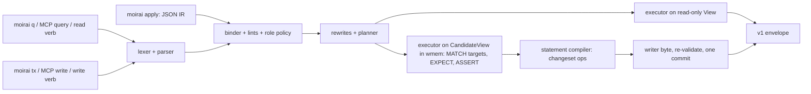

# 9. Язык запросов Lachesis (R5)

## 9.1 Зачем свой язык и почему он похож на Cypher

Требование владельца R5 (2026-09-26): «у нашей графовой БД должен быть и язык запросов». Язык называется **Lachesis** (LQ, файлы `*.lq`) — по имени мойры, которая *отмеряет* нить. R5 отменяет одну строку прежнего дизайна: T11 отвергал «Text2Cypher / язык запросов», опираясь на точность около 50 %, но эта цифра была неверно процитирована и измеряла другую задачу [14 §1]. Прежние доводы теперь определяют не «быть ли языку», а *как* им пользоваться: встроенные функции вместо ручных определений, строгие ошибки схемы, громкие предупреждения, именованные запросы.

Рассмотрены строгий ISO GQL, Cypher, Datalog, revsets в стиле jj, конвейерный DSL, JSON-AST и гибрид [14 §6]. Выбрано **ядро паттернов Cypher со спеллингом кванторов GQL плюс добавки moirai**:
- **Априорное знание моделей.** На Stack Overflow 9,920 вопросов с тегом `cypher` и 23,006 с `neo4j` против 542 с `gql` (измерено; это лишь косвенный признак обучающих данных); при zero-shot генерации GQL 85 % отказов — синтаксические ошибки (данные публикаций). Поэтому LQ принимает спеллинги Cypher и **сохраняет их смысл везде, где принимает спеллинг**.
- **Datalog отвергнут**: материализация `ancestor` при 1e6 узлов стоит 0.58–0.76 с и 37 MiB (измерено), magic sets со стратификацией — ещё 2–3 тыс. строк, а априорное знание моделей слабое.
- **Полное соответствие ISO GQL отвергнуто** (решение #26, D5): 814 продукций и 228 необязательных возможностей (заявлено), а каждая продукция v1 вечна.
- **Краткость**: семь эталонных задач [14 §5] стоят 242 прокси-токена в LQ v1 против 252 у гибрида [14] и 363 у строгого GQL (измерено).

Главная угроза — не синтаксис, а запрос, который *валиден, но не о том*: валидационный гейт ловит 100 % ошибок разбора и ссылок на схему и 0 % валидных-но-неверных запросов (CYGNET), а одна повторная попытка по тексту ошибки исправляет 91.7 % провалов (LAST-CQ; оба — данные публикаций). Отсюда стратегия: **переводить каждую правдоподобную ошибку агента из тихого неверного ответа в ошибку, предупреждение или уведомление**. На десяти типичных ошибках из ревью [51] первая редакция давала шесть тихих неверных ответов, нынешняя — ни одного (три дают верный ответ, четыре — предупреждение, уведомление или эхо чтения, три — ошибку с исправлением).

**Грамматика v1 содержит только трассируемые продукции**: каждая группа ссылается на требование EX1–EX16, на стандартный именованный запрос или на данные LQ-Bench. Причина: сохранённый именованный запрос записывает версию грамматики, и любой будущий парсер обязан разбирать v1 с семантикой v1. Размер: 54 синтаксические продукции для чтения и ревизий, 15 для транзакций, 13 лексических (измерено) — порядок revset-грамматики jj. Не вошли и отклоняются с E004/E113 и готовым LQ-переписыванием: переменные путей и `SHORTEST`, `SKIP`/`OFFSET`, списковые включения и срезы, `XOR`, `%`, `FOR`/`LET`/`FILTER`, `MERGE`, `DETACH DELETE`, подзапросы `CALL {}`, регулярные выражения, процедуры в стиле APOC. Вернуть форму можно только аддитивной новой версией грамматики.

> ✅ **Уже решено 2026-09-26 (#26; D5 и D13 «как рекомендовано»); подтверждать заново — только если хотите пересмотреть, и только до заморозки на M0:** грамматика v1 — намеренно урезанное трассируемое подмножество. После заморозки на M0 каждая её продукция вечна, а отсутствующие формы (пути, `SKIP`, `MERGE`, regex, процедуры) возвращаются только новой версией грамматики.

_Источники: AR §7.7, §7.7.1, §11 #26; [50 §0.2–§0.4, §1.2–§1.4, §2.3.1, §2.8, §9.2]; [14 §6]_

## 9.2 Форма запроса, паттерны и выражения

```
[EXPLAIN | PROFILE]
[USE <revspec>]
MATCH <pattern>, ... [WHERE <expr>]
OPTIONAL MATCH ... | CALL f(...) YIELD ... | UNWIND <list> AS x | WITH ...
RETURN [DISTINCT] <expr> [AS name], ... [GROUP BY ...] [ORDER BY ...] [LIMIT n]
[UNION [ALL] | EXCEPT | INTERSECT  <another query part>]
```

Отдельный `CALL f(...) [YIELD ...] [WHERE ...]` — тоже целый запрос. Один оператор на вызов: `;` или второй оператор — E005.

**Лексика.** UTF-8, BOM срезается; `--` — не комментарий, а ненаправленное ребро Cypher. Литералы узлов: `#40` (локальный номер в хранилище) и `#u:<32 hex>` (переносимый uid). Параметры `$name` никогда не подставляются в текст. Строки предпочтительно в `'…'` (без экранирования в JSON MCP). Литералы ревизий распознаются только в позициях ревизий (§9.5), поэтому `s1` и `cafebabe` остаются идентификаторами (измерено фикстурами).

**Узлы.** 13 видов: `task doc note rule decision question finding verdict measurement artifact run lane area` плюс псевдометка `DELETED`. Вид у узла ровно один: `:note:rule` — E004 с подсказкой `:note|rule`. Поле задач `labels` — отдельное множество (`'l5' IN t.labels`); `'l5' IN labels(t)` даёт E102 с этим переписыванием.

**Рёбра читаются в направлении хранения** (`CHILD_OF`, `BLOCKS`, `GATES`, `SUPERSEDES`, `AT`…) и имеют **обратные алиасы** (`BLOCKED_BY`, `PARENT_OF`, `SUPERSEDED_BY`…), которые канонизируются до типизации. Направление проверяется слоями: (1) где виды концов исключают направление — E106 с развёрнутым паттерном; (2) на рёбрах «вид → тот же вид» (`BLOCKS`, `CHILD_OF`…), где типы разворот не видят, каждое заякоренное звено печатает под заголовком строку **эха чтения**, а N07 срабатывает, если звено ничего не нашло, а в обратную сторону рёбра есть; (3) симметричные `CONTRADICTS` и `RELATES` совпадают при любой стрелке. Имя `parent` как ребро — E107. Пример Q4 — «чего ждёт #51» через обратный алиас; эхо сообщает прочитанный смысл (вывод приведён в замороженном формате конверта F13, §9.8):

```
MATCH (#51)-[:BLOCKED_BY]->(b) RETURN b
```
```
branch: main | rev 4480 | 2 rows
reads: b BLOCKS #51 (written #51 BLOCKED_BY b) | b must finish before #51 starts
#12 task in_progress P1 "Byte-range lock protocol" parent:#9 lease:dev#1(L-9)
#17 task open P2 "HEAD slot format" parent:#9
```

> ⚠ **Расхождение в документах:** все 38 примеров заголовков в [50] (например, Q4 в §2.9, 50-query-language-design.md:590) остались в доаудитном виде `branch: main · rev 4480 · c9c0aa17 · 2 rows`: с разделителем `·` и повторённым id коммита; строки `reads:` в примерах тоже разделены `·`. Замороженный конверт [50 §6.4] (:1862, :1864) и аудит F13 (AR:2500, «examples converted») требуют ASCII-разделителя ` | ` и не повторяют id коммита на чтениях; так же выглядит пример в AR (AR:1502: `branch: main | rev 4480 | 1 row`). Примеры [50] в формат F13 не переведены.

**Кванторы**: `+`, `*`, `{m,n}`, `{m}`, `{,n}`, спеллинг Cypher `*m..n` и квантифицированные группы с `WHERE` на каждом шаге: `((a)-[:BLOCKS]->(b) WHERE a.unfinished){1,5}`. **Выражения**: `AND/OR/NOT`, сравнения, `IN`, `STARTS/ENDS WITH`, `CONTAINS`, проверка вида `x:a|b`, `CASE`, `any/all/none(x IN list WHERE p)`, `EXISTS {}`/`COUNT {}` и паттерн-предикаты Cypher (`WHERE NOT (t)<-[:BLOCKS]-()` = `NOT EXISTS {…}`), списки и карты. Агрегаты с неявной группировкой; явный `GROUP BY` принимается и проверяется; `WITH … WHERE` играет роль `HAVING`. Режимы `WALK/TRAIL/ACYCLIC/SIMPLE` принимаются без эффекта с W02. Какой спеллинг кванторов печатает сам moirai (Cypher `*1..` или GQL `->+`) в карточке, `--show-query` и переписываниях ошибок, решает абляция LQ-Bench; канонический вид и хеши от этого не зависят.

_Источники: AR §7.7.1, Review log (F13); [50 §2.1–§2.5, §2.7, §2.8, §2.9 Q4, §6.4]_

## 9.3 Семантика: снимок, подсчёт, отсутствующее значение, рекурсия

**Снимок.** Запрос один раз читает `HEAD`, берёт `committed_lsn` и вычисляет все части по этому снимку; читатели не берут блокировок и не видят половину коммита.

**Подсчёт — как в Cypher и GQL** (решение #29, D11). Фиксированная часть паттерна связывается один раз на каждое сопоставление *всех* её элементов, включая анонимные; внутри одного `MATCH` рёбра различны, узлы могут повторяться. `RETURN`/`WITH` — мультимножества, `DISTINCT` удаляет дубликаты (N09 подсказывает, если на странице есть повторы). Квантифицированные части связывают **пары концов**, а не пути (число путей взрывается на DAG с «короткими» рёбрами); агрегат над ними даёт N08. Множественная семантика первой редакции тихо расходилась с привычками Cypher — это был блокер ревью [51 B3]. Пример Q29:

```
MATCH (t:task)<-[:BLOCKS]-()
WHERE t IN subtree(#88)
RETURN t.id, count(*) AS blockers
ORDER BY blockers DESC, t.id
LIMIT 3
```
Одна привязка на каждое ребро `BLOCKS`: анонимный блокер считается, ответ совпадает с Cypher (измерено на игрушечном графе [51]).

**Границы переходов — длины обходов (walks).** `{m,n}` допускает конец, достижимый обходом длиной m…n. На ациклических видах (`CHILD_OF`, `BLOCKS`, `GATES`, `MERGE_AFTER`, `DEPENDS_ON`, `SUPERSEDES`, `DERIVED_FROM`, `DISCOVERED_FROM`) это ответ Cypher: 1,500 из 1,500 случайных DAG; против полного перебора обходов — 3,000 из 3,000 случайных графов (измерено). На циклических исторических видах (`RELATES`, `CITES`, `MENTIONS`…) результат LQ — надмножество ответа Cypher (различие в 128 из 1,500 графов, измерено). Вычисление — послойный фронт, который всегда завершается, поэтому ограничитель (`TRAIL`, `ACYCLIC`) не нужен. Пример Q5b — «косвенные блокеры» на DAG с коротким ребром:

```
MATCH (x:task)-[:BLOCKS]->{2,}(#93)
RETURN x
```
#98 попадает в ответ: обход длины 2 ведёт к #93, хотя кратчайшее расстояние равно 1; правило «BFS-расстояния» первой редакции возвращало пустоту.

**Двузначная логика с явным отсутствующим значением (absent)** (решение #28, D8). Колонки заголовка узла всегда заполнены; отсутствовать могут только необязательные поля вида и переменные `OPTIONAL MATCH`. Для отсутствующего `x`: `x = v`, `IN`, `STARTS WITH`, `CONTAINS` и порядковые сравнения — ложь; `x <> v` и `NOT IN` — истина; `IS NULL` проверяет отсутствие; `= NULL` — ошибка E118; все отсутствующие образуют одну группу и сортируются последними. Смысл: `t.assignee <> 'dev#1'` включает задачи без исполнителя — то, что агент почти всегда имеет в виду; в трёхзначной логике SQL/GQL такие строки тихо пропадают. Цена — асимметрия (`NOT (x < 3)` истинно, `x >= 3` ложно), поэтому W01 считает строки, судьбу которых решило отсутствие. `/` всегда даёт дробное (`3 / 2 = 1.5`), деление на ноль даёт absent и N10, переполнение целых — E103.

**Удалённые узлы и чужие ветки.** Удалённый узел связывается только под псевдометкой `:DELETED` (надгробие (tombstone) с `deleted_by`, `replaced_by`…). Литерал удалённого id — 0 строк и N01; id, созданный на другой ветке, — 0 строк и **N06** с веткой и коммитом из индекса `ALLOC` (F17); никогда не выделенный id — E111.

**Порядок и курсоры.** У каждого результата полный детерминированный порядок. Курсоры обычных запросов **закреплены** за видом (страницы не пропускают и не повторяют строк, вывод побайтно повторяем — это дружелюбно к кешу промптов); запросы, читающие состояние времени выполнения или дерева файлов, получают **живые** курсоры, пометку `live` и W06 на следующих страницах.

> ✅ **Уже решено 2026-09-26 (#28 и #29 «как рекомендовано», действуют с M0); подтверждать заново — только если хотите пересмотреть:** LQ сознательно расходится с Cypher: двузначная логика с absent вместо `null` (#28), `/` всегда дробное, `{m,n}` на циклических видах считает обходы (надмножество ответа Cypher); подсчёт мультимножествами (#29) совпадает с Cypher. Всё видно агенту (W01, N08, карточка, EXPLAIN) и перепроверяется абляциями LQ-Bench, но после заморозки на M0 меняется только новой версией грамматики.

_Источники: AR §7.7.1, §11 #28, #29; [50 §3.1–§3.7, §2.9 Q5b, Q29, §9.2]_

## 9.4 Встроенные функции: производное состояние и файловые ссылки

Производное состояние движка доступно **только через встроенные функции, которые делят код с путём записи**, поэтому запрос и глагол не могут разойтись (правило [06 §10] «одно определение на предикат»).

| Группа | Встроенные |
|---|---|
| Готовность (решение #27, D7) | `t.ready` — ровно то, что `moirai ready` (можно выдать сейчас: `unblocked`, нет чужой живой аренды (lease), нет неусвоенного маркера `settled`/`deleted`, `defer_until` наступил), только на вершине ветки; `t.unblocked` — структурный предикат, валиден на любой версии |
| Статусы | `blocked`, `unfinished` (= `NOT done`), `done` (done **или cancelled**; W03, если в результате есть отменённые), `open_blockers`, `is_blocker`, `suspect`, `conflicted`, `children_total/done` |
| Графовые | `subtree()`, `descendants()`, `ancestors()`, `children()`; табличная `blockers(n, transitive:)` с унаследованными, помеченными (flagged) и закрытыми на другой ветке блокерами, со столбцами `via` и `depth` |
| Области и роли | `applies(k, glob)`, `applies_role()`, `applies_phase()`, `fits_role()`, `glob_match()` |
| Прочие | `search()`, `text_match()`, `staleness()`, `relevant_to()`, `now()`, `me()` |
| R4 | `file(path)`, переменные рёбер `AT` с полями якоря (`a.kind`, `a.scope`, `a.quote`…), `link_state(x)`, `f.state`, `a.state`, `links(scope:)`, `root_moves(root)` |
| Табличные отношения | `history`, `blame`, `log`, `diff`, `changes`, `conflicts`, `violations`, `across`, `refs`, `leases()`, `markers()`, `schema()`, `queries()` |

Пара `ready` + `unblocked` выбрана так, чтобы `WHERE t.ready` и `moirai ready` возвращали одно и то же; вариант [16] (`ready` структурный + `dispatchable`) отвергнут именно из-за этого расхождения. Рукописная проверка готовности («нет входящих `BLOCKS`») получает **W07**: она пропускает унаследованные и помеченные блокеры, маркеры, аренды, `defer_until` и контейнеры.

Состояние времени выполнения (аренды, маркеры, `ready`) и состояние, производное от дерева файлов (`link_state()` и др.), существуют **только на вершине ветки**; на прошлом виде это ошибка E302 (для `ready` — с подсказкой `unblocked`), а не значение `unknown`: в двузначной логике `unknown` удовлетворил бы `link_state(a) <> 'ok'` и превратил бы любой исторический аудит в список «сломанных» ссылок. Функции от дерева читают файлы в разрешённом дереве вызывающего и списывают это с бюджета `fs`. Пример Q9 — запрос из [40 §6.5], ставший `std.links_broken`:

```
MATCH (n)-[a:AT]->(f) WHERE n IN subtree(#88) AND link_state(a) <> 'ok' RETURN f, a, link_state(a)
```
Одна строка на якорь (ключ ребра `AT` несёт 128-битный дискриминатор якоря); `moirai links check --scope 88` рендерит тот же запрос, и их равенство — тест.

**Чтения никогда не пишут.** `moirai q` и MCP `query` принимают только грамматику чтения (операторы записи и `tx.*` — E006), а исполнитель держит только read-only `View`: запрос не может взять блокировку писателя, ничего не дописывает в журнал (I-F5), не записывает фактов, не двигает курсоров, не берёт аренд и не порождает процессов. Вне хранилища он читает лишь git-объекты проекта через встроенный читатель и файлы разрешённого дерева через резолвер R4.

_Источники: AR §7.7.1; [50 §2.6, §3.1, §3.2, §3.8, §2.9 Q9]_

## 9.5 Версии: грамматика ревизий и исторические отношения

Грамматика ревизий git/jj распознаётся только после `USE`, `TX ON`, `IF TIP` и в аргументах-ревизиях стандартных отношений:

| Форма | Смысл |
|---|---|
| `main`, `lane/l5np`, `tags/v1.2` | вершина ref на момент старта запроса |
| `HEAD` | разрешённая ветка вызывающего |
| `c9b2e6c1` / `s4466` | коммит по префиксу id (≥ 7 hex; неоднозначный — E301) / по порядковому номеру хранилища |
| `main~5`, `main^2` | n-й предок по первому родителю / n-й родитель коммита слияния |
| `REF@3`, `REF@2026-09-25T10:00Z` | reflog: n перемещений назад / положение на это время |
| `a..b`, `a...b` | `log`: достижимое из b, но не из a; `diff`: от a или от LCA (N05) / обе стороны от LCA со столбцом `side` — предпросмотр слияния |

Сегмент ref не может содержать `..`, поэтому `main..lane/l5np` — всегда две ревизии и диапазон (в первой редакции `main...lane/l10` лексировалось как одно имя).

`USE` задаёт **один вид на часть запроса**; `--branch` лишь поставляет вид по умолчанию для частей без `USE`, поэтому конфликта нет (E307 выведена из употребления). Внутри `EXISTS {}`/`COUNT {}` `USE` запрещён (E308). Составной запрос сравнивает версии частями, каждая по своему виду, над одним снимком. Пример Q15 — задачи, ставшие незаблокированными за последние пять коммитов `main`:

```
MATCH (t:task) WHERE t.unblocked RETURN t
EXCEPT
USE main~5 MATCH (t:task) WHERE t.unblocked RETURN t
```

Пример Q13 — предпросмотр слияния: ключи, которые тронули обе стороны, и изменения существования узлов:

```
CALL diff(main...lane/l10)
YIELD change, node, aspect, name, before, after, side
WHERE side = 'both' OR aspect = 'exists'
```

Прошлые версии читаются одной из трёх стратегий (обход цепочки узла; обратный оверлей затронутых ключей, учитываемый в `mem`; прямой повтор от закреплённого набора). Обратный оверлей и повторённые операции списываются с `mem` (≈ 6.9k операций при умолчании 1 MiB, ≈ 14k при максимуме CLI 2 MiB) при потолке 16,000 операций в CLI и 100,000 в MCP-сервере; дальше — E303 (выход 10) с подсказкой `moirai tag <name> <rev> --pin` (as-of по закреплённому набору стоит 5–50 мс) или MCP-сервер. Производное состояние на прошлом виде пересчитывается только в «конусе затронутого»; если хоть у одного коммита окна сброшен бит `affected_complete` (F16), пересчёт полный (W05). `across()` читает не более 4 ref по умолчанию (8 максимум), держа в памяти один оверлей за раз. История аренд не хранится (решение #30, D9, с M7): `history()` показывает коммиты claim и complete.

Коммиты, `s…`, `~n`, `@n`, `@time`, теги и `import/*` — виды только для чтения (запись в них — E305, §9.6). `conflicts()` перечисляет неразрешённые конфликтные значения вида, а `violations()` существует только на staging-ref `merge/<dst>/from/<src>`, потому что staged-нарушения никогда не доходят до ветки назначения (I12).

_Источники: AR §7.7.1, §11 #30; [50 §2.2, §2.4, §3.9, §5.8, §2.9 Q13, Q15]_

## 9.6 Запись: блоки TX

Решение #24 (D1): язык пишет, но через **отдельную точку входа** (`moirai tx`, MCP `write`), чтобы правила разрешений харнесса отличали чтение от записи по глаголу или инструменту. Отвергнуты «только чтение» (пакетные записи остались бы в дрейфующем ad-hoc JSON) и DML в той же точке входа (read-only стал бы классификацией во время выполнения, невидимой правилам разрешений).

```
TX [ON <branch>] [KEY '<idempotency key>'] [IF TIP <commit>] [IF TARGETS '<digest>'] [LEASE '<L-n>'] [MESSAGE '<text>'] {
  <statement>; <statement>; ...
} [DRY]
```

Блок — **один коммит на одной ветке, всё или ничего**:
- **`EXPECT` обязателен** для целей `MATCH` (E007): точное число, диапазон `2..5`, `<= n`, `>= n`. Цели вычисляются по снимку до блокировки и **перевычисляются под ней**, если с тех пор коммит тронул прочитанные вид, поле или вид рёбер; вне границы — E401 (выход 4) с фактическими совпадениями и текущими значениями.
- **Охрана**: предикаты `WHERE` (CAS по `status`/`rev`); `IF TIP` (E402, если ветка сдвинулась); `IF TARGETS <digest>` (E402, если множество целей отличается от показанного `DRY` — защита от подмены целей при том же их числе, [72 m1]); `LEASE` — fencing-токен (устаревший — E407, выход 5); `ASSERT expr [ELSE 'msg']` (E403, выход 6).
- **`DRY`** выполняет всё на кандидатском оверлее без блокировки и возвращает будущий diff и дайджест целей; повтор с `IF TARGETS` (или грубее — `IF TIP`) — дисциплина plan/apply.
- **Закрытый набор операторов** компилируется в операции changeset'а §4.3, поэтому каждая запись записываема в журнал, обратима `revert` и сливаема: `CREATE … [UNDER p] [UNLESS EXISTS {…}]` (создать-или-связать; `MERGE` нет), `SET`/`REMOVE`, `SET t.done = true` (охраняемый переход), `SET c = c + k` (`Incr`, не конфликтует при слиянии), `PATCH x.body REMOVE $old ADD $new`, `CREATE`/`DELETE` ребра, `MOVE … UNDER`, `REOPEN … REASON`, `DELETE … POLICY … REPLACED BY … RELEASE` (политики рёбер из схемы; `DETACH` нет), `RESOLVE`, `CALL tx.*`, `DEFINE`/`DROP QUERY`. Маркеры порождаются итоговыми операциями блока (CB3). Захват якорей, репины и переносы каталогов R4 — только глаголами (они читают или двигают файлы); поля наблюдения в `TX` — E115 с именем глагола.
- **Порядок проверок.** На каждой операции сразу: схема и типы, политика ролей с allowlist полей (E406, выход 6), машина статусов и охраняемые переходы (E404, выход 6: открытые дети, gating-вердикт `fail_*`, `PATCH` без подстроки), ацикличность каждого добавленного ребра предшествования по Pearce–Kelly. В конце блока, в порядке I37′: перемещения `parent`, неявные экзогенные рёбра, висячие структурные рёбра (I2), глубина леса (I4), кардинальности (I6, I7), а для `DEFINE QUERY` — граф вызовов (`QueryCycle`); всё это E405 (выход 6). Узловой `DELETE` на ограниченную ссылку — E409 со списком влияния; `UNLESS EXISTS`, совпавший больше чем с одним узлом, — E410. Любой отказ ничего не пишет и называет оператор (с 1) и правило.
- **Идемпотентность**: `KEY` привязан к BLAKE3-128 канонического связанного AST и к ветке; повтор с тем же содержимым — `replayed`, выход 0; иное содержимое — выход 9; тот же `KEY` на другой ветке — выход 9, если исходная ветка не слита в ветку вызывающего (N13e). Записываются только закоммиченные результаты, поэтому отказанный блок можно повторить с тем же ключом.
- **Отказы и повторы при записи.** Истекло ожидание байта писателя (`lock.writer-wait-ms`) — выход 7, ничего не дописано. Если со снимка L0 появились новые группы, кандидат переподвешивается за O(1), когда они не тронули читаемые блоком вид, поле или вид рёбер; иначе блок перевычисляется под байтом писателя в пределах `tx.max-work-in-lock` либо байт отпускается и вычисление кандидата повторяется (не более двух раз), после чего — E401/E402 с текущими значениями. Потерянная при групповом коммите группа перезапускается с тем же ключом идемпотентности (не более двух раз), затем выход 7 `outcome unknown`.
- **Какие виды принимают запись.** Вершина ветки вида `work` — да; вершина `plan/*` — кроме замаскированных полей (I33′); коммиты, `s…`, `~n`, `@n`, `@time`, теги и `import/*` — только чтение (E305 для `TX ON` на них, выход 6); staging-ref `merge/<dst>/from/<src>` принимает только `RESOLVE`.
- **Пределы**: 1,000 операторов и 10,000 операций по умолчанию; перевычисление под блокировкой ≤ `tx.max-work-in-lock` (5e5 units, ≈ 2–10 мс, оценка); кандидат ≤ `wmem` (min(1 MiB, запас RSS), не ниже 256 KiB); больше — E501 с предложением разбить. Стоимость: один долговечный коммит (~2 мс p50, измерено), удержание байта писателя ≤ 5 мс p99.
- **Политика ролей** проверяется по оператору, операции и полю (E406) по роли **предъявленной аренды**; вызывающий без аренды получает строку `general-purpose`, метки хуков могут только сужать права. Узловой `DELETE`, `RESOLVE` и `DEFINE`/`DROP QUERY` — только оркестратор и владелец и только через CLI; узловой `DELETE` через MCP отклоняется для всех ролей; массовые цели (`EXPECT` > 10 или без верхней границы) — только оркестратор. Это умолчания данных политики, а не решения владельца.

**Матрица политики ролей** (данные политики [AR §7.3]; свободный `q` разрешён всем ролям; allowlist полей не шире AR §7.3 и расширяется строкой `policy.role.developer.fields`):

| Роль | Операторы `TX` сверх именованных мутаций | Поля, которые может менять `SET` | Никогда |
|---|---|---|---|
| orchestrator, owner | всё, включая узловой `DELETE`, `RESOLVE`, `DEFINE`/`DROP QUERY` (только CLI), массовые `MATCH … EXPECT` | любое записываемое | — |
| architect | `CREATE` doc, decision, question, deviation finding; `CREATE`/`DELETE` рёбер `DEPENDS_ON`, `IMPLEMENTS`, `ABOUT` от своих узлов | поля своих doc, decision и question | вердикты, `finding` → fixed, статус задач |
| architecture-critic, code-reviewer | `CREATE` finding (с `failure_scenario`), verdict (+ `DERIVED_FROM`, `GATES`) | `status` своих findings → `withdrawn` | текст плана, `finding` → fixed, вердикты на свою задачу |
| refuter | `CREATE` `REFUTES`/`CONFIRMS` | `status` finding → `confirmed`/`refuted` | другие виды |
| developer | `CALL tx.complete` с арендой; `CREATE` note, question, deviation finding; `DELETE` своих якорей `AT` (ссылки создаются `moirai link --at`) | только `files_owned` арендованной задачи | вердикты, `finding` → fixed на своей задаче; прочие поля задачи (`parent`, `status`, `priority`…), пока их не расширит `policy.role.developer.fields` |
| tester | `CREATE` measurement (`env`, `measured_on` обязательны), test finding; `tx.complete` своего claim | — | вердикты, статус других задач |
| researcher, project-analyst, doc-writer, results-analyst | как в AR §7.3 | как в AR §7.3 | как в AR §7.3 |
| без аренды (`general-purpose`) | только `CREATE` finding, note, question | — | всё остальное |

Пример Q18 — охраняемое завершение задачи:

```
TX ON lane/l5np KEY 'wf:r7/dev1/complete-89' LEASE 'L-18' {
  MATCH (t:task {id: #89}) WHERE t.status = 'in_progress' AND t.rev = 4466 EXPECT 1
  SET t.done = true
}
```
Если другой агент успел первым: `error[E401 expect_mismatch]: statement 1 matched 0 bindings, expected 1`, текущие значения #89, «nothing was written», выход 4.

_Источники: AR §7.7.1, §7.3, §11 #24; [50 §2.1, §3.9, §3.10, §5.9, §6.5, §9.2 D1, §2.9 Q18]_

## 9.7 Одна поверхность: глаголы — это именованные запросы

Каждый глагол чтения CLI — именованный запрос встроенной библиотеки `std`, написанный на LQ; каждый глагол записи — именованная мутация `tx.*`. `moirai ready --scope 88` — это `moirai q ready scope=88` — это `std.ready`; пакеты `apply` — JSON-форма того же IR; MCP `write` принимает текст `TX` или именованную мутацию. Итог: **один парсер, binder, планировщик и исполнитель для всех чтений и один компилятор для всех записей**, без ранней отдельной реализации глаголов, которую пришлось бы потом заменять. `--show-query`/`--show-tx` печатают LQ за глаголом — так агенты и учатся языку. Именованный запрос имеет типизированные параметры, порядок, форму вывода и класс бюджета (`light` ≤ 2e5 units, `medium` ≤ 2e6, `heavy` ≤ 2e7):

```
DEFINE QUERY ready($scope: node? = NULL, $role: text? = NULL, $limit: int = 20) SHAPE node AS {
  MATCH (t:task)
  WHERE t.ready
    AND ($scope IS NULL OR t IN subtree($scope))
    AND ($role IS NULL OR fits_role(t, $role))
  RETURN t ORDER BY t.priority, t.topo, t.id LIMIT $limit
}
```

Библиотека `std` покрывает все глаголы чтения (`ready`, `blocking`, `blockers`, `tree`, `show`, `find`, `notes`, `changes`, `stale`, `conflicts`, `history`/`blame`, `log`, `diff`, `across`, `loop`…), хук `delta` и пресеты R4 (`links_broken`, `links_pending`, `files_removed`…). Классы кандидатов контекст-паков и brief (C1–C8, `brief_triage`) — тоже именованные запросы, так что `pack --explain` называет запрос, давший элемент. Имена `std` и `tx` зарезервированы.

**Проектные именованные запросы** (решение #25, D4) — версионированные данные схемы (`QUERIES`, F3): живут в хранилище, ветвятся вместе с данными, определяются оркестратором и владельцем через CLI (строка политики `policy.role.<role>.define-query`). Хранятся в **переносимой форме**: `#N` → `#u:<uid>`, порядковые номера и префиксы коммитов → полные id коммитов, reflog-ревизии отклоняются (E117). Экспортируются как `schema/queries/<q>.moi`, где q — 32 hex BLAKE3-256 от имени (файл по имени дал бы коллизии `Foo`/`foo` на нечувствительных к регистру ФС). При слиянии определение — один атомарный объект: равные хеши канонического AST не конфликтуют, разные определения — `FieldEdit`. Алгоритм канонического AST заморожен для каждой версии грамматики. После каждого слияния, sync, импорта и revert валидатор ставит `QueryInvalid` и `QueryCycle` в staging, как `Cycle`. Роль можно ограничить только именованными запросами (`query.safelist.<role>`, по умолчанию `off`).

_Источники: AR §7.7.2, §11 #25; [50 §1.4, §4.1–§4.4]_

## 9.8 Интерфейсы, вывод и обучение агентов

**CLI.** `moirai q NAME k=v …`: аргументы именованных запросов проходили без кавычек в Git Bash и Windows PowerShell 5.1 (измерено) — диапазоны `prio=..1`, ревизии `range=main...lane/l10`, списки `ids=40,41,52`. Id в argv голые (`show 40`): `#40` без кавычек — комментарий в обеих оболочках. Произвольный текст: quoted heredoc в Bash (`moirai q - <<'EOF'`), here-string в пайпе под PowerShell-инструментом Claude Code, строка MCP. `-f FILE.lq` вне рабочего дерева — для агентов **только на Windows** и только для не-ASCII литералов или при предупреждении о `?` (стандартный пайп PowerShell 5.1, как у агентов Codex, превращает кириллицу в `?`). **Агенты на Linux и macOS файлов запросов не пишут и всегда используют quoted heredoc**, потому что процесс в песочнице и процесс вне её видят разные `TMPDIR`, а инструмент Write не раскрывает переменную. Скрипты и люди могут использовать `-f` на любой ОС; временный файл запроса скрипта кладётся в `tmp/` хранилища ([80 §4] T5). Файл внутри рабочего дерева даёт W08. `@file` удалён из контракта. `--ids` выдаёт страницу по `output.ids-max-bytes` (24,000 B) с подвалом в stderr.

**Прочие оболочки, Linux и macOS** ([80 §4], правила T1–T10: bash, dash, zsh — как его запускает агент и интерактивный, fish, PowerShell 7 на Unix, cmd). Id голые; ни один токен не начинается с `#`, `~`, `=`, `@` или `!`, и ни один токен, кроме путей, — с `/`; никаких незакавыченных символов glob, фигурных скобок и перенаправлений (zsh прерывается на glob без совпадений, bash подставляет имена файлов). Интерактивный zsh с `EXTENDED_GLOB` считает `#` внутри слова glob-оператором, поэтому `scope=#88` принимается, но не преподаётся. Свободный текст идёт на stdin из quoted heredoc в bash и zsh, в прочих оболочках — через `-f` или пайп: у fish нет heredoc, а dash 0.5.13 портит UTF-8 внутри heredoc, и E003 делает это громкой ошибкой. Вывод побайтно одинаков на всех ОС, кроме golden-подстановок T7.

**MCP** — по-прежнему десять инструментов: `query` заменяет `find` (`mode: run|explain|check|profile`; explain — режим, потому что правила разрешений Claude Code не видят параметров MCP); `write` принимает `TX` или именованную мутацию, удаляет рёбра, но отказывает в узловом `DELETE`, `RESOLVE` и определениях запросов; `moirai mcp --read-only` скрывает пишущие инструменты; `notifications/cancelled` ставит флаг отмены между срезами без новых потоков.

**Вывод** — замороженный v1-конверт [AR §7.1] и [40 §6.1], расширяемый только аддитивно: заголовок `branch: <ref> | rev <seq> | …` с ASCII-разделителями ` | ` (аудит F13; ≤ 60 байт без `files @`), id коммита на чтениях не повторяется (он есть в `--json`, `show` и результатах записи); строка эха `reads: <паттерн> | <прочтение>`; JSON `{"v":1,"branch","rev","data","next","dropped",…}` плюс `commit`, `view`, `live`, `reads`, `cols`, `notices`, `warnings`, `budget`. Свободный текст экранируется и обрезается (~120 байт), тела выводятся в ограждении — это данные, а не инструкции.

**Ошибки — канал повторной попытки.** Формат: `error[<code> <name>]`, позиция, фрагмент ±60 символов вокруг каретки, `= help:` с ≤ 5 вариантами из *текущей* схемы; ≤ 600 B, ASCII; ровно одно исправление. Коды: E001–E009 разбор и форма (выход 2), E101–E118 привязка (2), E201–E202 планировщик (10), E301–E308 виды (3, 2, 10 или 6), E401–E410 транзакции (4, 5, 6 или 9), E501–E505 бюджеты (10); W01–W08 — предупреждения, N01–N11 — уведомления. Коды выхода [AR §7.1] не изменены; добавлен **10**: результат неполный (бюджет, отказ до выполнения, отмена, исчерпание `fs`), сколько бы строк ни было напечатано.

**Обучение.** Основной skill говорит: «предпочитай глаголы; для остального — `moirai-ql`». Карточка `moirai-ql` ≤ 1,000 токенов (максимум по токенизаторам Claude и o200k) и ≤ 3,500 байт, с семью примерами на незнакомые части (`#N`, встроенные, `USE`, диапазоны, `TX`); `reference-ql.md` грузится только по требованию (длинный справочник может снижать точность); `CALL schema()` показывает виды, поля, рёбра, обратные алиасы и чтения ветки.

> ⚠ **Расхождение в документах:** две мелкие неточности [50]. Замер карточки (3,003 символа, 439 слов; 50-query-language-design.md:1919, :1928, :2180) не совпадает с напечатанным текстом (:1931–1966: 3,013 символов, 442 слова); на гейт это не влияет, он считается реальным токенизатором. §6.1 (:1808) называет удалённое поле `dirty_files` вместо runtime-счётчика `TREES.dirty` (AR:2420, AR:775).

_Источники: AR §7.7.3, §7.1, Review log (F13); [50 §2.2, §5.2, §6.1–§6.6, §7.1–§7.3]; [80 §4]_

## 9.9 Исполнение и бюджеты

Движок написан вручную: байтовый лексер; рекурсивный спуск с Pratt-выражениями и восстановлением после ошибок (вложенность ≤ 64, рекурсия на явных стеках — глубокий ввод даёт выход 2 или 10, а не переполнение стека); binder по схеме-как-данным (множества видов, типизация направления, приведение литералов по типу: `'P1'`, `P1` и `1` против `priority` — одно значение), линты, классификация pinned/live, предпроверка политики ролей; переписывания по правилам (паттерн-предикаты → `EXISTS`, проталкивание фильтров, `ORDER BY + LIMIT` → top-k, `COUNT(*)` → popcount); выбор якоря по точным счётам битсетов (F6) и `STATS` (F7); однопоточный pull-исполнитель пачками по 1,024 id с алгеброй битсетов, CSR-обходами и leapfrog-пересечением. **Нет кеша планов, JIT, потоков и новых зависимостей.**



Путь записи: разбор, привязка и план — вне всякой блокировки; затем исполнитель вычисляет цели `MATCH`, `EXPECT` и `ASSERT` не на read-only `View`, а на копируемом при записи `CandidateView` поверх оверлея писателя (учёт в `wmem`); операторы компилируются в операции changeset'а, а под байтом писателя после повторной проверки публикуется один коммит (`DRY` останавливается до блокировки). Пакет `apply` в JSON — та же IR и входит минуя текстовый парсер.

**Бюджеты считаются, а не засекаются**, поэтому детерминированы: тот же закреплённый запрос на том же виде останавливается на той же строке с тем же курсором.

| Бюджет | По умолчанию | Максимум агента |
|---|---|---|
| work units | 2e6 (≈ 10–40 мс) | 2e7 |
| `mem` — всё приватное: арена, состояние операторов, visited-множества, as-of оверлей, скретч R4 | min(1 MiB, запас до RSS-гейта), не ниже 256 KiB | 2 MiB CLI / 4 MiB MCP |
| строки / байты на страницу | 50 / 8,000 B | 500 / 24,000 B |
| посещённые узлы | 1e5 | 1e6 |
| ref в запросе | 4 | 8 |
| `fs` units | 400 | 10,000 |
| дедлайн (только страховка) | 2 с CLI, 5 с MCP | — |

Умолчания — ключи `config` (`query.budget.default.*`), потолки оркестратора и владельца — `query.caps.<role>.*` (10× максимума агента); это не решения владельца. Поскольку `mem` берётся из измеренного запаса, запрос не выводит процесс за RSS-гейт, если процесс до запроса не был ближе 256 KiB к гейту. Планы, выдающие строки в порядке якоря, при исчерпании бюджета возвращают строки, подвал и курсор (выход 10); блокирующие планы (сортировка, агрегат) — выход 10 без строк, с отрывком EXPLAIN и способом исправить. Отказ до выполнения (E201) — только по истинной нижней оценке работы, никогда по прогнозу.

> ⚠ **Риск: базовая линия RSS.** Собственные пессимистичные цифры AR (≈ 4 MB для CLI на `main` при 1e5 плюс до 1 MiB оверлея ветки при чтении линии) уже достигают гейта ≤ 4 MB или превышают его **без всякого запроса** ([50 §5.12], AR риск 26); правило «256 KiB» тогда ничего не гарантирует. Это вопрос замеров базовой линии на M0 ([60 §5.2]). Гейтом служит составной случай GT11: вид линии с 14 днями истории, as-of `USE main~40` на пределе `mem` и полная арена `mem` при 1e5; он проходит, если процесс остаётся в пределах гейта всякий раз, когда его базовая линия до запроса была не выше «гейт − 256 KiB». При 1e6 базовая линия CLI — 3–6 MB (AR §8.1); LQ добавляет не больше `mem`.

Гейты (время движка, тёплый кеш; AR §8.3, GT11): LQ parse + bind + plan ≤ 20 мкс для запросов ≤ 1 КБ в тёплом процессе и ≤ 200 мкс вместе с первой загрузкой схемы (пробный парсер — 3.9 мкс, измерено); страница `ready` (50 неусвоенных маркеров, 90k инертных и 100 активных) ≤ 50 мкс / ≤ 300 мкс / ≤ 3 мс при 1e4 / 1e5 / 1e6 (≈ 1 мкс на любом масштабе — замер пробы, а не гейт); хорошо заякоренный паттерн в 2–3 перехода ~10 мкс / ~30 мкс / ≤ 0.3 мс при 1e4 / 1e5 / 1e6 (плохо заякоренный план того же паттерна в 20–150× медленнее, измерено — этого должен избегать планировщик); строки [50 §5.12] — в пределах 2× от оценки; `brief_triage` ≤ 50 мкс на каждом масштабе, сколько бы ни было истории маркеров, потому что сканирует только активные маркеры (GT11 на фикстуре истории маркеров; скан — M2, запрос — M7); `TX` — один долговечный коммит (~2 мс p50) с удержанием байта писателя ≤ 5 мс p99.

> ⚠ **Расхождение в документах:** [50 §8.2] (строка LQ-6, 50-query-language-design.md:2037) и [50 §8.3] (GT11, :2055) по-прежнему требуют `brief_triage` ≤ 5 мс при 1e5; гейт записи — ≤ 50 мкс при 1e4, 1e5 и 1e6 (AR:1804, AR:1649).

> ⚠ **Расхождение в документах:** гейт SPEED «≤ 5 мс времени движка для `q` с бюджетом по умолчанию» (AR:1791) не называет набор запросов, тогда как бюджет по умолчанию рассчитан на ≈ 10–40 мс (AR:1648, 50-query-language-design.md:1730); гейту нужен определённый набор, например строки [50 §5.12].

_Источники: AR §7.7.4, §8.1, §8.3, §10 (риск 26), §13; [50 §5.1–§5.12, §8.2, §8.3]; [60 §5.2]_

## 9.10 LQ-Bench: что замораживается на M0

LQ-Bench — постоянный тестовый актив. Его задача — **заморозить грамматику v1, семантику, тексты ошибок, линты и карточку до того, как написан исполнитель** (M0), заодно закрепив кодировку канонического AST до заморозки формата. Затем он перезапускается на продукте (M7), бинарнике (M8), через MCP (M10), при каждом изменении карточки, грамматики, текстов ошибок или линтов и перед релизом; результаты хранятся как узлы `measurement` в самом moirai.

**Состав.** Генерируемое хранилище-фикстура ~2,000 узлов в форме работы владельца (линии (lane) с 14 днями истории, слияния с конфликтными значениями, staged-нарушение, удалённые узлы, помеченные блокеры, маркеры settled-elsewhere, файловые ссылки во всех состояниях R4, кириллица в 10 % тел). Задачи: 150 синтетических × 3 формулировки (буквальная — словами предметной области владельца, никогда словами LQ; короткая; перефразированная); ~30 вопросов из записанных сессий в исходных словах; 40 состязательных задач с тегом ловушки (развёрнутые рёбра, подсчёт анонимных элементов, `= NULL`, рукописный `ready`, id с другой ветки, состояния в прошлом, `#` в argv…). Синтетические задачи оцениваются по эталонным *результатам* и разбиты на десять страт: поиск по ключу (15), фильтры и порядок (20), обход и замыкание (20), производное состояние и блокеры (15), агрегация и подсчёт (15), текстовый поиск (10), файловые ссылки (10), версии и история (20), конфликты и слияние (10), охраняемые записи (15, оцениваются по `DRY`-diff). Итого 520 промптов: полностью — для базового прогона, двух решающих абляций (логика absent, подсчёт), **двух альтернативных поверхностей** (LQ со строгими спеллингами GQL и JSON IR на входе) и абляции спеллинга кванторов; стратифицированная половина из 260 — для прочих абляций. Плюс **транспортная страта**: по 20 буквальных промптов в Claude Code и в скриптовом stdio-клиенте (0 транспортных сбоев). Агент получает только карточку и реальную поверхность инструментов, до 3 ходов.

**Модели и цена** (решение #38 (a): «пока бенчмарки только на Opus 5.5»): все гейты — на Opus 5.5; нет «нижнего» уровня и ветки Codex; ≈ 53 M токенов, ≈ $280 по прейскуранту на M0 (≈ $160–540), оплата через API. GPT-5.6-Luna не измерена, поэтому сессии Codex пишут LQ под профилем `unknown`: только именованные мутации, пара `DRY` → `IF TARGETS` по выбору, эхо чтения всегда включено. ~30 реальных промптов — слова владельца: они лежат только в gitignored-каталоге на ноутбуке, не попадают ни в публичный репозиторий, ни на хостовые раннеры (#37) и отправляются только в Anthropic.

**Профили моделей — конфигурация, а не решения.** Каждый прогон записывает умолчания `lq.model-profile.<family>`: `gated` — модель гейт-уровня, прошедшая гейты записи; `compatible` — семейство с ≥ 75 % после одного повтора на каждой страте; `unknown` — остальные и неизмеренные. `lq.model-profile.default.<client>` сопоставляет сессии, не объявившей модель, измеренную модель её харнесса: `claude` → профиль Opus 5.5, `codex` и `generic` → `unknown`. Свободные записи модели `unknown` отклоняются отдельным кодом ошибки; правило задаёт `query.safelist.model.<profile>` (`off` | `named-only` | `dry-targets`; для `unknown` по умолчанию `named-only`, `dry-targets` включает пару `DRY` → `IF TARGETS`). Эхо чтения всегда включено для `compatible` и `unknown`; каждая ошибка с механическим исправлением печатает текст замены.

**Гейты заморозки:** точность с первой попытки ≥ 85 % и ≥ 95 % после одной повторной — на буквальных и коротких формулировках и на страте реальных сессий; confident-wrong ≤ 2 % на чтениях и ≤ 5 % на каждый тег конструкции, **0 на записях**. Confident-wrong — итоговый ответ выполнился с выходом 0, ни предупреждение, ни уведомление, ни эхо чтения не противоречат вопросу, а результат отличается от эталона; неверные ответы, которые разоблачило предупреждение, уведомление (например, N07 или N08) или эхо, считаются hedged-wrong и в этот гейт не входят. Далее: использование именованного запроса ≥ 80 %, где он есть; ни одна страта ниже 75 % после повтора; карточка ≤ 1,000 токенов. **Проваленный гейт может менять всё, кроме самого бенчмарка**: карточку, текст ошибки, линт, встроенную функцию, таблицу совместимости или семантику. После заморозки изменение семантики — новая версия грамматики; определения v1 навсегда сохраняют семантику v1.

**Абляции** решают оставшиеся развилки: карточка и 0/4/7 примеров, терпимость к спеллингу Cypher, двух- против трёхзначной логики, мультимножества против множеств, обходы против BFS-границ, обратные алиасы, эхо чтения, подсказки в ошибках, W07, **BM25 против скорера без статистики** (решает, остаётся ли `DOCLEN` в формате v1) и **спеллинг кванторов** в выводе (Cypher сохраняется, если GQL не лучше больше, чем на разброс между прогонами).

> ⚠ **Расхождение в документах (известная проблема):** на каком парсере идёт LQ-Bench на M0. [50] §7.4 п. 3 и строка LQ-Bench в §8.2 (50-query-language-design.md:1985, :2034) говорят «LQ-1 + LQ-2 + LQ-3», «реальный парсер и binder», но та же таблица ставит LQ-1 и LQ-2 в M7 (:2031–2032), а LQ-3 описывает лишь вычислитель без парсера (:2033). AR §7.7.6 и §9 M0 (AR:1657, :1966) и [60] (60-roadmap.md:367 п. 9, :1728 M-2) говорят о собственном парсере и binder эталонной модели внутри LQ-3, а AR §7.7.5 (AR:1653) повторяет формулировку [50] «real parser and binder». Неясно, чьи тексты ошибок и линты замораживаются на M0 и учтён ли парсер модели в размере LQ-3.

> ⚠ **Расхождение в документах:** строка GT13 в AR §8.3 (AR:1884) и критерий выхода M0 (AR:1966) опускают гейты «именованные запросы ≥ 80 %» и «ни одна страта < 75 %» и то, что 85/95 % относятся к буквальным и коротким формулировкам и страте реальных сессий (AR:1653, [50 §7.4] п. 6). Критерий выхода M0 в [60] (60-roadmap.md:382) — дорецензионный: без линтов и семантики среди допустимых исправлений, без ≤ 5 % на конструкцию, страты реальных сессий и гейта карточки, зато с гейтом «в пределах 5 пунктов от лучшего кандидата» (кандидаты — LQ, LQ со строгими спеллингами GQL и JSON IR, то есть как раз две альтернативные поверхности, которые [50] и AR прогоняют на всех 520 промптах), которого нет ни в [50], ни в AR.

> ⚠ **Расхождение в документах:** пакет LQ-1 и гейт GT5 опираются на пробные скрипты `lqcheck2.py`/`fixtures2.py` (47 фикстур; 50-query-language-design.md:174, :2031, :2052), но [50] сам говорит, что они не опубликованы (:11, :2175); в репозитории их нет, и плана добавить или портировать их до M7 тоже нет.

> ✅ **Уже решено 2026-09-26 (#38 (a), слова владельца: «пока бенчмарки только на Opus 5.5»); подтверждать заново — только если хотите пересмотреть:** LQ-Bench только на Opus 5.5: ≈ $280 (≈ $160–540) по API на M0; агенты Codex до отдельного решения пишут только именованными мутациями (профиль `unknown`); спеллинг кванторов замораживается по результату Opus. От вас нужна только оплата прогона; варианты (b) и (c) добавляются позже аддитивно.

> ✅ **На согласование (открытый вопрос):** нужно выбрать, на каком парсере LQ-Bench работает на M0: на собственном парсере и binder эталонной модели (так в AR §9 и [60]) или на продуктовых LQ-1/LQ-2 (так в [50]; тогда их придётся перенести в M0). И нужно утвердить единый нормативный список гейтов GT13 (полный — из AR §7.7.5 / [50 §7.4]), включая судьбу гейта [60] «в пределах 5 пунктов от лучшего кандидата» для альтернативных поверхностей. От этого зависят объём и стоимость M0 и то, какие тексты ошибок и линты фактически замораживаются.

_Источники: AR §7.7.5, §8.3, §9, §11 #37, #38, §13; [50 §7.4, §8.2, §8.3]; [60 §3.1]_

## 9.11 Резервирования формата, пакеты и вехи

**В формате v1 на M0 замораживаются F1–F18:**

| # | Что резервируется |
|---|---|
| F1–F2 | строки схемы рёбер: `lq_name`, виды концов, `symmetric`, обратные имена, шаблон чтения; строки полей: `optional`, `default`, `index`, `sort_rank`, `coerce` |
| F3 | элемент `QUERIES` (версия грамматики u16, сигнатура, форма, класс бюджета, переносимый текст — хешируются; хеш канонического AST — производный, не хешируется), файл `schema/queries/<q>.moi` |
| F4–F7 | холодная колонка `CREATOR`; `FCOL`/`FIDX` для продвинутых полей; `card u32` на чанк битсета; секция `STATS` |
| F8–F10, F14 | seq и HLC в заголовках кадров `hist`; `append_hlc` в чекпоинтах и коммитах; нехешируемые `stmt_origin`/`stmt_sym`/`stmt_hash` (`via tx.complete` в истории) |
| F11–F13 | секция `CONFLICTS`; статистика FTS (`DOCLEN`, df, байт версии токенизатора); `PATHIDX`/`ALIASIDX`/`ANCHORS` из [40] |
| F15–F18 | инвариант полноты `affected` (или `affected_complete = 0`); `affected_len` u32 и бит `affected_complete`; индекс `ALLOC`; классы нарушений `QueryInvalid`/`QueryCycle` |

Кроме того, на M0 замораживаются контракт LQ-0 (грамматика v1, таблица ошибок, конверт, сигнатуры `std`/`tx`, ABNF `.moi` для запросов) и имя (решение #31: `*.lq` и `moirai-ql` входят в замороженную поверхность). Ключами `config` и строками политики остаются бюджеты и потолки (`query.budget.default.*`, `query.caps.<role>.*`, `tx.max-*`, `output.ids-max-bytes`), safelist (`query.safelist.<role>`, `query.safelist.model.<profile>`), профили моделей (`lq.model-profile.*`) и права ролей (`policy.role.<role>.define-query`, `policy.role.developer.fields`).

> ⚠ **Расхождение в документах:** F4 в [50] (50-query-language-design.md:2006) — `CREATOR = (actor u16, role u16)`, 4 B/узел; после аудита RAM-m6 AR §3.1 (AR:427) расширил `actor` до u32 (6 B/узел), но строка секций R5 в AR §4.4 (AR:699) по-прежнему считает 4 B.

| Пакет | Содержимое | Веха |
|---|---|---|
| LQ-0 | контракт | M0 |
| LQ-3 | эталонный вычислитель в `moirai-model` (вложенные циклы; по AR — с собственным парсером и binder), пишет отдельный автор модели | M0 |
| LQ-Bench | генератор фикстур, 520 промптов, скорер; GT13 | M0 |
| продюсеры F4–F7, F12, F15–F17 / F8–F11, F14 | графовая / историческая сторона | M2 / M3 |
| LQ-1 | лексер, парсер, диагностика, фаззер | M7 (вторая линия с выхода M0) |
| LQ-2, LQ-4, LQ-5, LQ-6 | binder, ядро исполнителя, графовые операторы, планировщик | M7 (с выхода M2) |
| LQ-7, LQ-9, LQ-10, LQ-11 | транзакции, версионные запросы, встроенная ancestry, элементы образа и валидаторы | M7 |
| FL-6 (LQ-13 в [50]) | встроенные R4 | M7 |
| LQ-8 | `q`, `tx`, `std` за каждым глаголом | M8 |
| LQ-12 | классы паков и brief, карточка | M9 |
| LQ-14 | MCP `query`, `write` с `TX` | M10 |

**Размер** (оценка): ≈ 15–21.5k строк продуктового Rust в M7 плюс ≈ 2.5–4k в других вехах; R5 ≈ 56–83 units (LQ-Bench 3–5 в M0 плюс парсер и вычислитель модели внутри её 16–20; продюсеры 2–3 в M2–M3; M7 без FL-6 48–68.5; LQ-8 2–3 в M8; LQ-12 0.5–1 в M9; MCP 1–2 в M10). Это базовые оценки; с дельтами аудитов вся веха M7 (включая FL-6) = 51–72.5 units, 6.5–14.5 недели. Тесты: дифференциальное сравнение с эталонной моделью (GT2), фаззинг парсера 24 ч (GT5), свойства (GT9: глагол = именованный запрос; `p`/`NOT p` разбивают вход; одинаковый хеш определения в двух хранилищах; ноль байт журнала от любого чтения), golden-тесты каждого кода (GT10, GT12), скорость и RAM на ноутбуке (GT11).

**Риски R5**, которые принимает одобрение дизайна (реестр AR §10):

| Риск AR | Вероятность / влияние | Смягчение | Сигнал |
|---|---|---|---|
| 25 — уверенно-неверный ответ: валидный запрос не о том (развёрнутые рёбра, подсчёт анонимных элементов, рукописная готовность, absent, runtime-состояние на прошлом виде) | средняя / высокое | подсчёт и границы переходов как в Cypher/GQL; производное состояние только встроенными; обратные алиасы, эхо чтения, N07; W01, W03, W07, N06, N08, N09; E118, E102, E302; гейт confident-wrong по конструкциям (≤ 5 %, 0 на записях) с правом менять семантику до заморозки | доли confident-wrong в LQ-Bench |
| 26 — запрос или `TX` ломает гейт бюджета: процесс выше RSS-гейта, удержание байта писателя, план в 20–150× медленнее | средняя / среднее | один бюджет `mem` из измеренного запаса RSS; составной случай RSS как гейт; 5e5 units под блокировкой, `DRY` вне её; выбор якоря по точным счётам, предпроверка нижней оценки, EXPLAIN/PROFILE, бенчмарк выбора плана | промахи GT11; доля выходов 10 |
| 27 — R4 и R5 снова расходятся (состояния, спеллинги, правила чистоты, конверт) | средняя / среднее | [40 §6.5] — R4-часть LQ; словарь состояний, конверт и замороженные строки — один контракт M0; `links check` = `std.links_broken` как тест; эталонная модель вычисляет оба по одной таблице правил | провалы контрактных тестов |
| 36 — не-Claude модель пишет уверенно-неверный LQ | низкая, пока клиент `codex` = `unknown` / среднее | профили моделей с умолчаниями по клиентам; только именованные записи для `unknown`; эхо чтения для `compatible` и `unknown`; ошибки с текстом замены | отклонённые свободные записи по клиентам в журнале; LQ-Bench по семействам, когда модель добавят |

[50 §9.1] добавляет 14 рисков с их смягчениями: уверенно-неверные чтения; агенты пишут формы Cypher вне LQ; свободные запросы вытесняют глаголы; `TX` слишком долго держит блокировку писателя; запрос ломает RSS-гейт; планировщик выбирает плохой якорь; расползание объёма к полному GQL; транспорт оболочки портит запрос; prompt injection через хранимый текст; проектные именованные запросы ломаются после изменения схемы, конфликтуют при слиянии или связываются не с тем узлом в другом хранилище; изменения токенизатора или ранжирования; дрейф R4/R5; размер сборки; живые результаты путают агентов. Риск трудоёмкости — AR риск 30.

**Решения владельца по R5** приняты 2026-09-26 «как рекомендовано»: #24 (TX), #25 (запросы в хранилище), #26 (объём грамматики), #27 (`ready`/`unblocked`), #28 (absent), #29 (подсчёт), #31 (имя) — действуют с M0; #30 (история аренд не хранится) — с M7. D2 (кто пишет TX), D3 (safelist), D6 (потолки бюджетов) и D12 (поля разработчика) — данные политики или ключи `config`.

> ✅ **На согласование:** стоимость R5 — ≈ 56–83 units (базовая оценка: LQ-Bench 3–5 в M0, продюсеры 2–3 в M2–M3, M7 без FL-6 48–68.5, LQ-8 2–3, LQ-12 0.5–1, MCP 1–2); вся веха M7 с дельтами аудитов — 51–72.5 units (6.5–14.5 недели); в M0 — LQ-Bench 3–5 units плюс парсер и вычислитель в эталонной модели. Календарь пересматривается по скорости на выходах M0 и M1.

_Источники: AR §7.7.6, §9, §10 (риски 25–27, 30, 36), §11, §13; [50 §8.1–§8.3, §9.1, §9.2]; [60 §3.8]_
