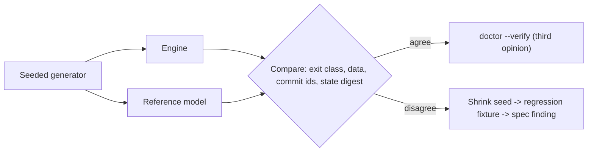

# 11. Бюджеты, гейты и проверка качества

> **Черновик.** Раздел написан и проверен по источникам, но найденные проверкой ошибки (6) и пропуски (13) ещё не внесены. Исправленная версия заменит этот файл.

## 11.1 Как устроены бюджеты и гейты

Каждое решение в moirai оценивается по вашим четырём приоритетам: **скорость, минимальная RAM, корректность, минимум токенов агента**. У каждого приоритета есть явный числовой бюджет и механизм проверки — гейт. Документы делят эту работу на два уровня:

- **AR §8.1** — таблица бюджетов с выводом каждой цифры для масштабов 1e4 / 1e5 / 1e6 узлов. Из неё видно, почему бюджет достижим: из каких операций складывается время и из каких частей складывается память процесса.
- **AR §8.3** — **нормативный** список гейтов, по одной таблице на приоритет. Каждая строка называет механизм и веху («From»). «GT11» означает бюджет, измеренный по протоколу M0 ([60 §5.1]); «счётчик `Vfs`» — величину, которую подсчитывает инструментирование, а не секундомер. [60 §5.4] перечисляет те же строки по вехам.

Гейт становится обязательным со своей вехи и **остаётся обязательным дальше**. Провал гейта блокирует выход этой вехи и всех последующих ([60 §3.13]). Различаются два вида бюджета. *Policy budget* — это config-ключ §13 с дефолтом (например, `pack.budget.<role>`, `mcp.overlay-bytes`, `hooks.sync-auto-keys`). *Contract budget* — фиксированный тест.

**Базовые условия.** Все числа относятся к вашей машине: Ryzen 9 5900HS, 16 GB (при 16 агентских процессах по 3.5 GB private свободно ≈ 1.8 GB — «измерено»), consumer NVMe без защиты от потери питания, NTFS, Defender real-time включён, загрузка CPU во время замеров 30–100 %. Модель данных: 3 ребра на узел, хранимые дважды; заголовки 60 B; поля 24 B; тела 1 KiB в сыром виде, ≈ 340 B со словарём zstd (коэффициент «заявлено»; pure-Rust кандидаты, ожидаемо `lz4_flex` со словарём, «оценка» ≈ 400–550 B, меряются в M0); ~10 коммитов за жизнь узла; ~1k коммитов в день на всё хранилище («оценка»); 3–5 живых линий (lanes); ~50 живых ref в худшем случае. Ваш реальный масштаб через три года — 0.3–0.5 M узлов, между столбцами 1e5 и 1e6. Порождение процесса (15–73 ms нативно и ещё ~109 ms через Git-Bash-обёртку агента, «измерено») в движковые времена не входит: оно доминирует в каждом вызове CLI, но находится вне движка.

**Трактовка.** Движковые времена берутся на тёплом кэше и без spawn. «Loaded» означает воспроизведённую 16-агентную нагрузку. RAM — пиковые private bytes (`PeakPagefileUsage`), рядом с которыми сообщается heap-only high-water mark. В M0–M11 гейты действуют **только на Windows**. Для Linux и macOS AR §8.3 даёт per-OS notes — гейты фазы портирования ([80 §5.3]), которые релиз не блокируют.

**Никаких сторонних точек сравнения.** Установка «обогнать SQLite» удалена. Ни SQLite, ни redb, ни heed/LMDB не собираются и не запускаются ни для какой цели, даже как информационный бенчмарк вне дерева ([60 §5.5]). Это обеспечивает линт зависимостей GT20 (b). Производительность оценивается только по абсолютным бюджетам и по физическим «полам», которые перемеряются в том же прогоне.

_Источники: AR §8.1, §8.3 (вводные абзацы); [60 §3.13, §5.4, §5.5]_

## 11.2 Протокол измерений и физические полы

Протокол пишется и **замораживается в M0** ([61 M-6]). По нему меряются все критерии выхода, касающиеся времени, памяти и поведения Windows, и все ночные регрессии.

| Элемент | Правило |
|---|---|
| Нагрузка | «Loaded» — **16-агентная нагрузочная фикстура**: записанный профиль CPU, диска и памяти реальной кампании из 16 агентов (только ресурсы, без контента; решение #35). Её воспроизводит генератор при удерживаемых ≈ 1.8 GB свободной RAM. «Idle» — только базовая нагрузка ОС |
| Размер выборки | по длительности ([74 A04]): n ≥ 10,000 ниже 1 ms; ≥ 1,000 на 1–50 ms (гейт по p99); ≥ 200 на 50 ms–1 s (p95 и максимум); ≥ 20 выше 1 s (максимум). 5 повторов ниже 1 s, 3 повтора выше; гейт берётся по медиане повторов. Строки 1e6 и 0.3–0.5 M гоняются раз в неделю и на M11 |
| Полы | перемеряются **чередуясь** с гейтируемой операцией в том же прогоне |
| Idle CPU | нулевое приращение CPU-времени (`GetProcessTimes`) **и** ноль переключений контекста (ETW) за 10 мин, начиная через 15 s после последнего запроса |
| RSS | пиковые private bytes на выходе процесса; для MCP-сервера также steady state в конце скриптовой сессии; агрегаты по всем процессам moirai в 16-сессионной фикстуре; разбивка VMMap в M0 и M11 |
| Счётчики | сбросы на коммит, байты, прочитанные при открытии, и байты лога, дописанные читающими командами, считает `Vfs`, а не выводит из времени |
| Spawn | `hyperfine -N --warmup 5`, напрямую и через Git-Bash |
| Полоса шума | разброс 5 повторов для каждой величины на ноутбуке и на hosted-раннерах меряется в M0 (п. 16). Ночная регрессия за пределами полосы блокирует. Решение о выходе вехи принимается **только по значению с ноутбука** |

**Гейты относительно пола** ([60 §5.3]). Движковый бюджет задаётся дважды: абсолютным числом и расстоянием от пола. Медленный день диска тогда не скроет регрессию движка, а быстрый её не оправдает.

| Пол (п. 11) | Гейт | Веха |
|---|---|---|
| data-only flush p50 / p99 | долговечный коммит p50 ≤ пол + 0.5 ms, p99 ≤ пол p99 + 1 ms; ≤ 1 сброс на коммит (ровно 1 для одиночного писателя) | M1 |
| data-only flush p99 | последний ack при 16 писателях p99 ≤ 50 ms (Windows); в портах ≤ max(50 ms, 3 × пол p99 + 5 ms) | M1 |
| `HEAD` pread + map 8 файлов | open ≤ пол + replay хвоста; ≤ 1.5 ms при 1e5, ≤ 3 ms при 1e6 | M1 |
| data-only flush p50 | `branch`/`checkout`/`undo`/`tag` ≤ пол + 1 ms | M3 |
| spawn пустого exe (напрямую) | spawn-to-exit читающей команды при 1e5 ≤ пол + 5 ms | M8 |
| spawn через Git-Bash | только сообщается: это вне moirai | M8 |

_Источники: AR §8.1, §8.2 (вводный абзац); [60 §5.1, §5.3]_

## 11.3 Скорость (SPEED)

Ключевые строки нормативной таблицы. Значения — гейты (цели); для долговечного коммита в скобках дана оценка из §8.1.

| Метрика | 1e4 | 1e5 | 1e6 | С вехи |
|---|---|---|---|---|
| Движковое время чтения CLI на `main` (`get`, `ready`, `blocking`, `q` с дефолтным бюджетом); через бинарник: spawn-to-exit ≤ пол пустого exe + 5 ms | ≤ 5 ms | ≤ 5 ms | ≤ 5 ms | M1, M8 |
| Полный вызов CLI через Git-Bash агента | ≈ 136–189 ms p50 | = | = | только сообщается |
| Open с полным хвостом | ≤ 1 ms | ≤ 1.5 ms | ≤ 3 ms | M1 |
| Открытий файлов на команду (счётчик `Vfs`) | ≤ 10 (`main`), ≤ 14 (lane), ≤ 18 (tree gate) | = | = | M1, M8 |
| Восстановление после kill с полным хвостом | ≤ 10 ms | = | = | M1 |
| Долговечный коммит (оценка в §8.1: ~2.0 ms p50, ~6 ms p99 при полу 0.45–2.0 ms p50, «измерено») | p50 ≤ пол + 0.5 ms, p99 ≤ пол p99 + 1 ms | = | = | M1 |
| Сбросов на команду | ≤ 1 на коммит, ровно 1 для одиночного писателя, ≤ 3 на пачку из 16 писателей; `file mv`/`rm` — 2 | = | = | M1, M3, M6 |
| Удержание writer-байта, любой класс команд | p99 ≤ 5 ms, max ≤ 20 ms | = | = | M1…M7 |
| Ожидание писателя: 16 писателей + одно слияние | p99 ≤ 50 ms | = | = | M1, M3 |
| Читатель p99 во время пачки 16 писателей | ≤ 2× idle | = | = | M1 |
| `get #N` | ≤ 5 µs | ≤ 5 µs | ≤ 5 µs | M2 |
| Страница `ready` (50 непоглощённых и 90k инертных маркеров) | ≤ 50 µs | ≤ 300 µs | ≤ 3 ms | M2 |
| `blocking --ids`; транзитивные блокеры | ≤ 50; ≤ 50 µs | ≤ 300; ≤ 200 µs | ≤ 3; ≤ 2 ms | M2 |
| Первое чтение линии: 14-дневная линия с sync на каждом `SubagentStart`; 60-дневная ветка `plan/*`; ref, ответвлённые 1k / 7k / 14k / 60k коммитов назад | ≤ 10 ms; ≤ 10 ms; ≤ 3 / 10 / 10 / 20 ms | = | = | M1, M3 |
| Слияние линии в 2k op; `sync` | ≤ 20; ≤ 20 ms | ≤ 50; ≤ 40 ms | ≤ 130 ms с полным Kahn; ≤ 80 ms | M3 |
| Rollup (только в дочернем `moirai gc`); `backup` | ≤ 0.03 s; ≤ 0.1 s | ≤ 0.3 s; ≤ 0.3 s | ≤ 3 s; ≤ 3 s | M1 |
| Ancestry на пару коммитов | ≤ 1 ms с commit-graph, ≤ 5 ms без | = | = | M4 |
| Инкрементальный экспорт образа (`main` + 2 линии); полный экспорт / импорт | ≤ 50 ms; ≤ 0.3 / 1 s | ≤ 3 / 7 s | ≤ 25 / 70 s | M4, M5 |
| R4: работа со ссылками в паке на 50 ссылок (все на месте / все пропали под одним перемещённым каталогом / 10 правленых файлов) | ≤ 3 ms p50 idle и ≤ 5 ms loaded / ≤ 5 ms / ≤ 5 ms | = | = | M6, M9 |
| R4: settle на `SessionStart` | ≤ 150 ms (жёсткий потолок под нагрузкой); ≤ 16 KB лога, если ничего не изменилось | = | = | M6, M9 |
| LQ parse + bind + plan; якорный шаблон в 2–3 хопа | ≤ 20 µs (≤ 200 µs с первой загрузкой схемы); ~10 µs | =; ~30 µs | =; ≤ 0.3 ms | M7 |
| `pack`/`brief` на `main`; пак линии с оверлеем | ≤ 5; ≤ 12 ms | ≤ 8; ≤ 20 ms | ≤ 12; ≤ 30 ms | M9 |
| Хуки под нагрузкой: `SessionStart`; `SubagentStart`; `UserPromptSubmit`; stamp | ≤ 300 ms p50 / ≤ 500 ms p99; ≤ 150 ms p99 (command) / ≤ 40 ms (`mcp_tool`); ≤ 120 / ≤ 5 ms; ≤ 110 / ≤ 2 ms | = | = | M9, M10 |
| MCP: неподписанное чтение; под пачкой 16 субагентов | p50 ≤ 5 ms; p99 ≤ 25 ms, max ≤ 100 ms | = | = | M10 |
| Idle CPU любого процесса moirai | ноль CPU и ноль переключений за 10 мин | = | = | M1 (MCP — M10) |

Почему бюджеты такие. Процесс CLI живёт миллисекунды, и агент ждёт его вывода, поэтому считается каждое открытие файла и каждый сброс на диск. Долговечный коммит упирается в физический flush, и гейт требует от движка не больше 0.5 ms сверх пола. Групповой коммит нужен, чтобы 16 параллельных писателей платили ≈ 2–3 сброса на пачку, а не 16 («оценка» в §8.1: последний ack ≈ 4–8 ms). Нулевой idle CPU следует из архитектуры: нет таймеров, наблюдателей и опроса.

> ⚠ **Расхождение в документах:** строка SPEED «≤ 5 ms для `q` с дефолтным бюджетом» (ARCHITECTURE-RESEARCH.md:1791) не называет набор запросов, а дефолтный рабочий бюджет запроса 2e6 units рассчитан на ≈ 10–40 ms (ARCHITECTURE-RESEARCH.md:1648). Допускаемый бюджетом `q` может превысить гейт в 2–8 раз. Гейту нужен определённый набор запросов, например строки [50 §5.12].

_Источники: AR §8.1, §8.3 SPEED; [60 §5.4]_

## 11.4 Память (RAM)

| Метрика | Бюджет (1e4…1e6, если не указано) | С вехи |
|---|---|---|
| CLI или хук, чтение на `main` (в том числе с хвостом на quiet cap и после settle, записавшего 1e4 runtime-строк) | ≤ 4 MB private; оценка 1.5–3.6 MB (1.6–4.1 при 1e6): база Rust 1.0–1.5 MB (нативная консоль 0.69 MB, «измерено») + компактный оверлей хвоста ≤ 1 MiB + распаковка 0.1–0.2 MB + `mem` ≤ 1 MiB | M1, M6, M8 |
| CLI на 14-дневной линии; оверлей ветки в любом процессе | строка `main` + 1 MiB; ≤ 1 MiB с учётом окон синхронизации | M3 |
| Базовых сегментов на живые ветки после rollup | ≤ 2 | M3 |
| Бюджет записи `wmem`; запись CLI с телом; `TX` с дефолтным потолком | ≤ min(1 MiB, запас), ≥ 256 KiB, агентский максимум 4 MiB; ≤ 4 MB; ≤ 4 MB | M2, M7 |
| Запись коммита; кадр `hist`; декодирование коммита | ≤ 1 MiB inline (больше — bulk commit); ≤ 256 коммитов и ≤ 1 MiB; ≤ 2 MB | M0 (формат), M1 |
| Слияние линии в 2k op; sync линии, отставшей на 14 дней | ≤ 8 MB (≤ 16 MB при 1e6 с полным Kahn); ≤ 8 MB | M3 |
| Delta checkpoint / promotion; дочерний rollup | ≤ 8 MB; ≤ 24 MB (≤ 32 MB при 1e6) | M1 |
| `doctor --verify`; `repair --rebuild-from-log` | ≤ 16 MB (≤ 32 MB при 1e6); ≤ 32 MB | M2, M1 |
| Любой хук, в том числе авто-применение sync (≤ 2,000 ключей) | ≤ 4 MB | M9 |
| R4: чтение с якорями в файле 16 MiB; `links check --all`; `--deep` | ≤ 4 MB; ≤ 8 MB; ≤ 16 MB | M6 |
| LQ `mem` на запрос | ≤ min(1 MiB, запас), ≥ 256 KiB; максимум 2 MiB CLI / 4 MiB MCP | M7 |
| MCP-сервер: steady после fan-out на 16 линий; пик; потоки | ≤ 8 MB + `mcp.overlay-bytes` (4 MiB); ≤ 16 MB с запросом 4 MiB; ≤ 2 OS-потока | M10 |
| Простаивающий MCP-сервер; сценарий утечки Codex (проба P8) | ≤ 3 MB; Σ ≤ 100 MB | M10 |
| **Все процессы moirai вместе** | 16 простаивающих MCP Σ ≤ 128 MB; 16 серверов после fan-out Σ ≤ ≈ 196 MB; 16 одновременных CLI/хуков Σ ≤ 64 MB; всё под 16-сессионной фикстурой Σ ≤ 256 MB | M10, M11 |
| Слой git-объектов на процесс | delta cache ≤ 256 KiB (CLI, хуки) / ≤ 1 MiB (MCP) | M4 |
| Тестовая инфраструктура на ноутбуке | гейт-задания рядом с агентами ≤ 1 GB суммарно; ни одна задача не стартует при < 1.5 GB свободной RAM или < 25 GB диска; линковку или тестовый бинарник в каждый момент запускает не больше одной линии; эталонная модель ≤ 512 MB на кейс | M0 |
| Idle RAM CLI и хуков | 0: процесса нет | по построению |

Логика бюджета. Данные разделяются через read-only отображения (горячий индекс ≈ 99 B/узел, 99 MB при 1e6 в общем page cache, вытесняемый и общий для всех процессов). Поэтому private RAM процесса почти не зависит от размера хранилища. Агрегат ≤ 256 MB — это ≤ 15 % тех 1.8 GB, что остаются свободными при 16 агентах. Rollup живёт только в отдельном дочернем процессе `moirai gc` и никогда в MCP-сервере или CLI, поэтому эти процессы не раздуваются. Лидер (опционален) добавил бы +2–8 MB («оценка», не измерено).

> ⚠ **Расхождение в документах:** §5a.3 (ARCHITECTURE-RESEARCH.md:873) приписывает правилу авто-применения sync в хуке цифру «≤ 8 MB для линии, отставшей на 14 дней». Однако §8.3 (:1845), §13 (:2250) и [71 RAM-M6] ограничивают хук 4 MB, а порог в 2,000 ключей введён ровно ради этого. 8 MB — гейт для *явного* `sync`.

_Источники: AR §8.1, §8.3 RAM; [60 §3.15, §5.4]_

## 11.5 Токены агента (TOKENS)

Бюджеты задаются в **байтах UTF-8** (ASCII — 1 байт, кириллица — 2 байта). Лимит каждого харнесса проверяется в его собственной единице: у Claude Code — в токенах Claude, у Codex — в байтах. Строки стоимости считает токенизатор модели, на которой работает харнесс (Claude; o200k или usage, которое сообщает Codex). **Токен-леджер (GT19)** в хук-фикстурах M9 и в replay кампании на M11 записывает каждый байт, который moirai кладёт в контекст агента: `additionalContext` хуков, stdout CLI в том виде, в каком его доставляет Bash tool, результаты MCP, загруженные skill, инструкции сервера, записи `tools/list`. Затем он сверяет строки на спавн и на сессию для каждого харнесса.

| Поверхность | Бюджет | С вехи |
|---|---|---|
| Список имён MCP-инструментов | ≤ 250 B | M10 |
| Инструкции MCP-сервера; блок в `AGENTS.md` | ≤ 512 chars (фактически 435, в профиле `codex` 507; собственный потолок Claude Code — 2,048); ≤ 600 B с маркерами (556) | M10; M9 |
| Всегда загружаемые MCP-схемы | 0 при дефолтном конфиге | M10 |
| Схема всех десяти инструментов | ≤ 5,000 B (`core` ≤ 3,000 B), описание ≤ 200 chars | M10 |
| Skills | ≤ 3 skill; `moirai` ≤ 800 токенов, `moirai-orchestrate` ≤ 2,000, карточка `moirai-ql` ≤ 1,000 | M9 (карточка — с M0) |
| Бриф `SessionStart`; при resume; в диспетчеризованном воркере | ≤ 8,000 B; заголовок + дельта ≤ 600 B; пак роли ≤ 3,000 B | M9 |
| Дельта `UserPromptSubmit` | ≤ 600 B, 0 байт, если пусто | M9 |
| Пак через CLI | `min(pack.budget.<role>, pack.cli.max-bytes = 24,000 B)`; предварительные дефолты 16,000 B (developer, tester, code-reviewer) и 24,000 B (architect, architecture-critic) | M9 |
| Пак через MCP | ≤ `pack.mcp.max-bytes` (25,000 B), под `codex` 16,000 B; id-плотный вывод постранично по 8,000 B | M10 |
| Stdout при ненулевом коде выхода; текст ошибки LQ | ≤ 8,000 B; ≤ 600 B, ≤ 5 подсказок | M8; M7 |
| Вывод `agent-launched`, `fs-evidence`, stamp | 0 байт | M9 |
| Накладные moirai на спавн без пака | ≤ 2,000 токенов (роль с Bash), ≤ 1,500 (роль с MCP) | M9, M10 |
| Накладные на старт сессии | ≤ 3k токенов | M9 |
| Токенов на диспетчеризацию (хук + пак) | медиана ≤ медианы базы M0 (HDR + чтения плана) | M9 |
| Текст moirai на спавн с паком | медиана ≤ 7,000 токенов | M11 |
| На сессию оркестратора (3 линии, 30 спавнов, 2 раунда ревью, слияние) | ≤ 220,000 токенов и не больше записанной HDR-сессии (≈ 380–434k при прежних дефолтах) | M11 |

Часть порогов — config-ключи §13 (`pack.budget.<role>`, `pack.cli.max-bytes`, `pack.mcp.max-bytes`), остальные — контрактные тесты. Окончательные дефолты паков по ролям устанавливаются по полноте на записанных диспетчеризациях. Per-harness notes уточняют лимиты: у Claude Code предупреждение MCP на 10k токенов и потолок 25k, лимит хука 10,000 символов, Bash ≈ 30,000 inline и ≈ 10,000 при ошибке. У Codex лимиты считаются как bytes / 4: хук 2,500 ≈ 10,000 B, shell и code-mode `exec` ≈ 40,000 B, MCP ≈ 48,000 B. Для generic-харнессов значения только сообщаются.

**Стоимость LQ-Bench** — тоже строка TOKENS: ≈ 53 M токенов на M0 на Opus 5.5 (≈ 45 M на нейтральном раннере, ≈ 8 M в двух транспортных плечах). По прейскуранту это ≈ $280, диапазон ≈ $160–540. Изменение карточки, грамматики, текста ошибок или линта обходится в ≈ 5 M (≈ $28), прогон перед релизом — в ≈ 13 M (≈ $40).

> ✅ **На согласование:** оплата LQ-Bench по API billing: ≈ 53 M токенов (≈ $280, диапазон $160–540) на M0, ≈ $28 за каждое изменение поверхности языка и ≈ $40 перед релизом. ~30 реальных промптов из ваших сессий уходят только в Anthropic. Ключ API есть только на ноутбуке: в CI ключа нет. Вариант (a) уже решён (#38); расширения (b) и (c) остаются аддитивными опциями на потом.

_Источники: AR §8.3 TOKENS и Per-harness notes, §7.7.5, §11 #38; [60 §3.15]_

## 11.6 Эталонная модель — дифференциальный оракул

**Что это.** Маленькая, заведомо корректная **исполняемая спецификация** логической семантики moirai. Она лежит в крейте `moirai-model` (`publish = false`) рядом с `moirai-format-oracle`, независимым декодером каждой замороженной структуры. Оба крейта — dev-зависимости только тестовых крейтов: **никогда не линкуются в бинарник и никогда не служат backend**. Модель реализует тот же логический `Store` API, что и движок. Она заменяет SQLite в обеих ролях, которые ему отводил прежний план (эталон корректности и консервативная семантика), и получает третью: каждое правило сначала пишется в ней. Модель **пишется первой и целиком в M0, отдельным автором** только по спецификации. После M0 она меняется лишь через findings по спецификации. Модель не является эталоном производительности и не является многопроцессным эталоном: это задачи GT1/GT3/GT4/GT15.

**Почему именно так.** SQLite был бы независимой реализацией. Модель же пишется из тех же документов агентом того же семейства моделей. Поэтому защита от общего непонимания строится явно:

- **другие алгоритмы**: определяющий алгоритм вместо оптимизированного, так что любое расхождение — либо баг движка, либо двусмысленность спецификации;
- **никакого общего кода**: у модели свой парсер и binder LQ, свой энкодер канонической формы (≈ 300 строк, commit id сравниваются побайтно с M1) и свой декодер формата;
- **разделение контекстов**: автор модели не читает код движка, и наоборот;
- **таблицы правил, подписанные вами**, и **ядро фикстур GT10, проверенное вами**;
- **полностью независимые оракулы** там, где они есть: git CLI для объектов и образов, ground truth симулятора `ProjectFs` для идентичности файлов, tree-sitter (только в тестах) для Rust scope scanner;
- мутационное тестирование и **засеянные баги в реальном движке**. Каждое расхождение модели и движка сначала разбирается как finding по спецификации.

| Область | Движок | Модель |
|---|---|---|
| Текущее состояние | base + delta-сегменты + оверлей | `BTreeMap<#N, Node>`, свёртка чистых changeset от генезиса |
| Производное состояние (`ready`, `is_blocker`, rollups…) | инкрементально, замороженные bitsets | **пересчёт с нуля на каждый запрос**, дословная транскрипция AR §3.5 и [50 §3.8] |
| Ацикличность (I5′) | Pearce–Kelly, выше порога полный Kahn | DFS по всему графу |
| Вид ветки | `SEG(pin) ⊕ ops(main) ⊕ own ops` | `state_at(tip)` replay DAG от корня, мемоизация на tips и каждом k-м коммите, ≤ 512 MB на кейс |
| Кросс-веточное исключение (I26′) | маркеры как кэш, absorbed vectors | **само определение состояния**: обход всех живых ref, никогда не через маркеры |
| Слияние / sync | свёртки по сегментам, типизированные правила | три материализованных состояния, таблица слияния **как данные**, рекурсивная virtual base по определению |
| Запросы и `TX` | парсер, binder, планировщик, векторный исполнитель | свой наивный парсер и binder (≈ 1–1.5k строк), nested-loop evaluator |
| Файловые ссылки | ленивый каскад, фингерпринты | разрешение по точным признакам над симулированным деревом; **brute-force перебор всех вхождений якоря** (P11) |

Вне области модели: байты на диске (их только декодирует format oracle), блокировки, время и процессы, сегменты, чекпоинты, GC, производительность, рендеринг CLI, `.moi`-байты, реальная ФС и слой git-объектов. Каждая из этих областей покрыта другим гейтом.

**Сравнение** ([60 §4.4]). Seeded-генератор выдаёт смесь команд `Store` API, включая невалидные, повторы по ключу идемпотентности, краши, AST запросов (M7) и события ФС (M6). Параметры хранилища берутся из тестового профиля или из производственных значений. Детерминированные часы делают HLC и commit id воспроизводимыми. Каждая команда выполняется в lock-step на движке и на модели. Сравниваются класс выхода, данные `--json v1`, commit id и дайджест `state(ref)` каждого затронутого ref. Для коммита в полёте во время краша модель держит два кандидата: «применён» и «не применён». Подтверждённый коммит никогда не должен пропасть. Третье мнение даёт `doctor --verify`, который пересчитывает производные структуры внутри движка. Падающие seed сжимаются до минимальных последовательностей и становятся регрессионными фикстурами. Масштаб модели — ≤ 1e4 команд и ≤ 2e3 узлов на кейс. Все пороги (FTS tier 2, promotion, чекпоинты, Kahn fallback…) — параметры хранилища, поэтому тестовый профиль делает каждый путь с порогом достижимым на этом масштабе.

**Размер и цена:** ≈ 8–10k строк в M0 («оценка»), только `std` плюс `blake3`, `sha1`, `sha2`, без `unsafe`. Одна функция на правило со ссылкой на раздел, правила оформлены таблицами данных. На каждом выходе вехи проверяется покрытие и рост модели: если модель переросла бюджет, упрощают модель, а не спецификацию. Трудоёмкость ≈ 16–20 units в M0 и ≈ 1–2 units поддержки позже.

> ✅ **На согласование:** ваш личный вклад в M0 — это часть механизма корректности, а не формальность. Вы подписываете таблицы правил модели (таблица слияний, машины статусов, матрица политики удаления, правила слияния ссылок, классы паков, определение состояния I26′ с правилами кэша маркеров; ≈ 15–25 ч, потом 1–2 ч на каждой вехе, меняющей таблицу), верифицируете ядро фикстур GT10 и выборку эталонных ответов LQ-Bench (≈ 10–20 ч) и участвуете в ревью спецификации (≈ 8–16 ч). Без подписи M0 не выходит.

_Источники: AR §8.2 «Reference model and baselines»; [60 §4.1–§4.6, §3.15]_

## 11.7 Сбои, краши и конкуренция: симуляция, kill-loops, OS-crash

**Модель сбоев `Vfs`** входит в спецификацию формата и замораживается в M0. Её 12 пунктов определяют, что может сделать с данными ОС или железо:

- (1) после краша может пропасть любое подмножество секторов по 4 KiB, записанных после последнего успешного flush, и один сектор на файл может оказаться разорванным с гранулярностью 512 B;
- (2) create, rename и unlink долговечны только после `sync_dir` родителя, а до этого может потеряться любое подмножество несинхронизированных операций в любом порядке;
- (3) после неудачного flush содержимое диапазона неопределено навсегда;
- (4) чтение, конкурентное записи, видит смесь старых и новых секторов;
- (5) disk-full на любой записи или сбросе;
- (6) пауза процесса любой длины;
- (7) скачки настенных часов;
- (8) освобождение блокировки после смерти процесса задерживается неограниченно;
- (9) чтение через отображение может убить процесс;
- (10) посторонний процесс может обрезать или переписать файл;
- (11) несколько незавершённых групп, и держатель flush может умереть до, во время или после сброса;
- (12) ошибки чтения.

In-memory реализация `Vfs` навязывает эти правила всем гейтам краша.

**GT1 — перебор точек краша.** Один процесс над in-memory `Vfs`. Краш вызывается на каждой границе write/flush/publish, в том числе между двумя appends одной сброшенной группы. В каждой точке перебирается **каждое подмножество** несброшенных секторов файла, пока их ≤ 12 (4,096 состояний), а за этой границей берутся ≥ 10⁴ случайных подмножеств. Оба слота `HEAD` перебираются исчерпывающе (9 состояний в каждой точке барьера), добавляются ограниченные произведения по файлам и последовательности «ошибка flush, ещё коммиты, краш». Всего ≥ 10⁵ состояний краша. После каждого проверяется **свежесть чтения после краша**: любое чтение процесса, стартовавшего после краша, до запуска первого писателя отражает каждую подтверждённую долговечную запись. Маркеры и аренды (leases) сверяются с моделью. Префиксы по файлу — быстрый уровень для PR.

**Засеянные баги.** «Харнесс, который ничего не нашёл, ничего не доказал». В M0 перебор на игрушечном логе должен найти **≥ 12 засеянных багов протокола**, среди них:

- гонка checkpoint/reset класса WAL-reset SQLite;
- разорванное перемещение ref;
- читатель за `committed_lsn`;
- adoption повторным flush после неудачного flush;
- удаление файла до долговечного барьера `HEAD`;
- добавления аудитов;
- тринадцать багов группового коммита из [80 §2.4.4].

На выходе M1 те же классы багов засеваются в **реальный движок** и все должны быть пойманы.

**GT3 — многопроцессная симуляция.** N симулированных процессов под seeded-планировщиком: lock-free читатели, чекпоинты, GC, pins, promotion. Инжектируются краши, ошибки fsync, задержки освобождения блокировок, sharing violations, delete-pending, паузы, disk-full, скачки часов и чтения смешанных секторов. Модель перевычисляет каждое чтение на его `seq`. Объём: ≥ 10⁶ шагов на выходе M1, ≥ 10⁷ за ночь для RG3. Метод детерминированной симуляции опробован на известном случае: гонку WAL-reset в SQLite он нашёл примерно за 15 минут [08 §3.1].

**GT4 — Windows kill-loops.** 16 процессов писателей и читателей в 16 каталогах, привязанных к разным веткам, на 1e4 узлов. На каждый вариант приходится 10,000 итераций за 1 ч, вариантов три:

- `TerminateProcess` в случайных точках;
- `NtSuspendProcess` случайных процессов на 1–120 s;
- скачки часов на ±1 ч.

Каждый процесс сообщает харнессу каждый подтверждённый **долговечный эффект** — коммит, токен аренды, перемещение ref, эффект маркера, исход `FsIntent`, запись `gitmap`, бэкап — по pipe **до** того, как его напечатать. Критерий: ноль потерянных эффектов, ноль повреждённых открытий, чистый `doctor --verify`. Кроме того, `backup` посреди цикла восстанавливает всё, что подтверждено до его `committed_lsn`, а аренда, взятая через CLI, переживает выход CLI. Охват растёт по вехам: M1 (драйвер хранилища), M3 (ветки), M5 (экспорт и импорт), M6 (файловые intents), M8 (бинарник CLI), M10 (открытый MCP-сервер). Disk-full в профиле L не входит в число вариантов: подключение маленького VHDX требует повышения прав на Windows Home. Его покрывают GT1/GT3 и один ваш прогон RG7. Unix kill-loops с `SIGKILL`/`SIGSTOP` относятся к гейтам портирования.

**GT15 — цикл OS-crash.** Гость Windows Server 2025 Core evaluation (build 26100, ≈ 2 GB, 180 дней + один rearm) в VirtualBox 7, VMware Workstation Pro для перекрёстной проверки. I/O-кэш хоста выключен, flush гостя честно исполняется. Гость выполняет нагрузку GT4 данной вехи и всплески evidence-хуков прямо перед выключением. Хост в случайный момент вызывает bugcheck (NotMyFault) или жёсткое выключение питания. После перезагрузки проверяется:

- все записанные эффекты на месте;
- чтения до первого писателя свежие;
- `doctor --verify` чист;
- `git fsck --strict` образа чист, `gitmap` ⊆ назначения;
- `FsIntent` совпадает с ФС;
- последний бэкап восстанавливается.

Объём: ≥ 1,000 циклов на выходе M1 (≈ 3–5 мин на цикл, ≈ 50–83 ч), затем каждую ночь, ≥ 5,000 кумулятивно для RG3. **Калибровка стенда** (п. 17 M0): за ≥ 100 выключений заведомо несброшенная запись, rename или delete должны потеряться хотя бы раз, а защищённые барьером — ни разу. Если калибровка не проходит ни с одним гипервизором, вопрос о стенде возвращается к вам: лицензию не покупали.

> ✅ **На согласование:** заявленное допущение «накопитель честно выполняет FLUSH». Стенд GT15 не видит ни потери выданных, но не сброшенных записей, ни потери собственного volatile-кэша диска. Правильность расстановки сбросов удостоверяет только GT1 (симулятор), а потерю кэша накопителя покрывает только симулятор. На consumer NVMe без защиты от потери питания это осознанное ограничение, и RG3 фиксирует его явно.

_Источники: AR §8.2 «Correctness gates», §8.3 CORRECTNESS; [60 §2.5, §3.1 items 3–4, §3.13 GT1/GT3/GT4/GT15, §3.15]_

## 11.8 Свойства, дифференциал с git, фаззинг, мутации

**Property-тесты (GT6) и оракулы состояния (GT18).** Дифференциально против модели, с порогами, прогоняемыми и по тестовому профилю, и по производственным значениям. Проверяются, в частности:

- производное состояние совпадает с полным пересчётом после 1e5 случайных операций;
- обратный CSR равен инверсии прямого;
- `invert(changeset)` восстанавливает состояние;
- pin ⊕ ops совпадает с replay от генезиса;
- слияние детерминировано, а чистое слияние равно последовательному применению через функции композиции и перекеивания;
- после каждого `sync` выполняется `view(lane)` = `state_at(sync)` модели = экспортированное `.moi`-дерево;
- каждый uid привязан ровно к одному `#N` за всю жизнь хранилища;
- I12, I25′, I31′, I37′.

**I26′** проверяется оракул-генератором: ≥ 10⁶ историй, ≥ 5 ref, через все десять «дверей» завершения задачи и все перемещения ref. Для образа: `export → import → export` побайтно идентичен на гранулярности commit.

**Дифференциал с git (GT7).** Для каждого экспортированного образа — `git fsck --strict`, `verify-pack`, `cat-file --batch`. `gix` допустим только как оракул чтения в тестах. Для R4: точные rename на каждом коммите равны `git diff-tree -M100%` по вашей истории, ancestry равна `git merge-base --is-ancestor` для каждого HEAD из `git worktree list` (46 по подсчёту [41 §1]), включая 7, которые пропускает commit-graph. На shallow- и partial-клонах, replace refs и grafts ответ — `unknown`, никогда не `false`.

**Дифференциал LQ (GT2, M7).** Генератор выдаёт AST, модель их вычисляет, принтер отдаёт текст продукту. ≥ 10⁶ запросов по всем видам представлений плюс блоки `TX` сравниваются по строкам, порядку и кратности. Метаморфические проверки GT9: разбиение `p` / `NOT p`, одинаковая точка остановки и курсор при исчерпании бюджета. Каждая CLI-команда записи даёт тот же коммит, что и её `TX`-развёртка.

**R4 (GT17).** Строки 1–36 матрицы перемещений и правок гоняются на симуляторе `ProjectFs` и на реальном NTFS, в scratch-каталогах харнесса и никогда в пользовательском репозитории. К ним добавляются свойства P1–P15. Главное из них — **P1: никакой ошибочной автоматической перепривязки** (precision 1.0 в классе exact, с генераторами бэкапов, зеркал и вендорных копий).

**Фаззеры (GT5).** Цели по вехам:

- M0: селекторы якорей и path specs;
- M1: записи, `HEAD`, сегменты;
- M4: объекты git, packs, idx, commit-graph, refs, bundles;
- M5: `.moi`;
- M6: фингерпринты;
- M7: грамматика запросов с тождеством parse → print → parse;
- M8: argv и транспорт;
- M10: MCP JSON.

Критерий: 0 падений и зависаний, ≥ 7 CPU-дней на фаззер. В сумме ≈ 18 целей и ≈ 3,000 CPU-часов («оценка»).

**Мутационное тестирование (GT16).** Выполняется на каждом выходе вехи начиная с M0 и только в тестовых заданиях, никогда в продуктовой сборке. Берутся все мутанты в функциях, изменённых с прошлого выхода, плюс случайная выборка из 1,000 мутантов по семантическим крейтам (граф, VCS и слияние, резолвер ссылок, binder и executor, кодек образа, FL-1). Дифференциальные и property-наборы должны убить точечную оценку ≥ 90 % при нижней 95 %-границе ≥ 88 %. Выборка стоит ≈ 6–29 ч на выход; все мутанты обошлись бы в 20–230 ч. Крейты хранилища гейтируются засеянными багами протокола.

**Replay ваших инцидентов.** Union-слияние, воскресившее RESOLVED как OPEN в 10 местах, и счётчик 185→188→191 должны давать правильный результат через `sync` + `merge` и через git-слияние образа.

_Источники: AR §8.2 «Correctness gates»; [60 §3.13 GT2, GT5–GT7, GT9, GT16–GT18]_

## 11.9 Каталог гейтов GT1–GT20

| Гейт | Что проверяет (одной строкой) | С вехи | Где |
|---|---|---|---|
| GT1 | перебор точек краша над `Vfs` по модели сбоев; 0 потерянных подтверждённых записей | M1 (игрушечный лог — M0) | CI (префиксы) + ночью (полный) |
| GT2 | дифференциал против модели; ≥ 10⁶ команд на веху, ≥ 10⁷ для RG4 | M1, расширяется в M2, M3, M6–M9 | CI + ночью |
| GT3 | многопроцессная симуляция с инъекциями | M1 | ночью |
| GT4 | Windows kill-loop, 16 процессов, 3 варианта | M1; M3, M5, M6, M8, M10 | ночью |
| GT5 | фаззеры по компонентам | по компоненту | непрерывно на свободных ядрах |
| GT6 | property-тесты производного состояния, слияний, инвариантов | M2, M3 | CI + ночью |
| GT7 | git CLI как независимый оракул | M4, M5 | CI (синтетические репо) + ноутбук (ваши репо) |
| GT8 | гейты образа 0–3 в обоих режимах anchor-text; импорт на разошедшийся ref | M5 | CI |
| GT9 | метаморфика запросов и replay бюджета | M7 | CI |
| GT10 | фикстуры, проверенные владельцем (node-40, инциденты реестров, walk-through §7.6, HDR против паков) | с вехи функции; ядро — M0 | CI (синтетика) + ноутбук (ваши данные) |
| GT11 | все бюджеты §8.3/§5.4 по протоколу; идёт эксклюзивно, первым за ночь | по строке | окна ноутбука и каждый выход |
| GT12 | контракт CLI и соответствие харнессам (Claude Code, Codex, generic stdio), golden outputs, коды выхода 0–10, argv в Git-Bash / PowerShell 5.1 / 7 | M8 (хуки M9, MCP M10) | CI + ноутбук (живые Claude Code и Codex) |
| GT13 | LQ-Bench: точность языка запросов агентами | M0 (на модели), M7, M8, M10, при каждом изменении | при изменении (ноутбук) |
| GT14 | 72-часовой soak | M11 | релиз |
| GT15 | цикл OS-crash в госте Server 2025 Core | M1 (≥ 1,000 циклов) | ночью; ≥ 5,000 для RG3 |
| GT16 | мутационное тестирование, ≥ 90 % / ≥ 88 % | каждый выход с M0 | на выходе |
| GT17 | матрица паттернов R4, строки 1–36, симулятор + NTFS | M6 (драйвер), M8 (бинарник) | ночью |
| GT18 | оракулы состояния: I26′, эквивалентность остатка sync, uid → `#N`, конкуренция settle, живучесть аренд, целостность целей `TX`, «команда = named mutation» | M0 (модель), M2, M3, M6–M8 | CI + ночью |
| GT19 | токен-леджер против строк TOKENS | M9, M10, M11 | на выходе |
| GT20 | (a) git запускается только в четырёх местах; (b) нет git-библиотек и встроенных БД, только pure Rust; (c) GT2/GT4 проходят без `git` в PATH; (d) OS-код только в `moirai-os`; (e) `cargo check` для linux-musl x86_64/aarch64 и aarch64-apple-darwin | (b), (e) M0; (a), (d) M1; (c) M4/M8 | CI + локальный pre-merge (a, b, d, e); ночью (c) |

Кроме GT в CORRECTNESS есть гейты без номера:

- состояния барьера `HEAD`: 0 открытий удалённого файла во всех 9 состояниях слотов;
- семантика долговечного коммита (I-G1, I-G2);
- `doctor --verify` чист после каждого случая;
- **покрытие инвариантов**: у каждого инварианта §3.4 и §5e.8 есть точка enforcement, функция модели и ≥ 1 гейт (100 %, проверяется на ревью M0 и на каждом выходе);
- «чтения ничего не дописывают» (I-F5);
- проба хэндлов и отсутствие гидратации облачных плейсхолдеров (I-F11);
- калибровка стенда (M0).

Критерии LQ-Bench (GT13) по AR §7.7.5:

- ≥ 85 % с первой попытки и ≥ 95 % после одного повтора на буквальных и коротких формулировках и на страте реальных сессий;
- confident-wrong ≤ 2 % на чтениях и ≤ 5 % на конструкцию, **0** на записях;
- использование named query ≥ 80 % там, где оно есть;
- ни одна страта не ниже 75 % после повтора;
- карточка ≤ 1,000 токенов;
- 0 транспортных сбоев в транспортной страте.

Проваленный гейт до заморозки может изменить карточку, текст ошибки, линт, built-in, таблицу совместимости или семантику. После заморозки семантическое изменение — это новая версия грамматики.

> ⚠ **Расхождение в документах:** нормативная строка GT13 в §8.3 (ARCHITECTURE-RESEARCH.md:1884) не содержит гейтов «named query ≥ 80 %» и «ни одна страта < 75 %» из §7.7.5 (:1653) и [50 §7.4] и не ограничивает 85/95 % буквальными и короткими формулировками. Критерий выхода M0 в [60 §3.1] (60-roadmap.md:382) излагает гейты в дорецензионной форме: в remedy-клаузе нет линтов и семантики, нет ≤ 5 % на конструкцию, страты реальных сессий и лимита карточки ≤ 1,000 токенов, зато добавлен гейт «в пределах 5 пунктов от лучшего кандидата», которого нет ни в [50], ни в AR.

_Источники: AR §8.3 CORRECTNESS, §7.7.5; [60 §3.13]_

## 11.10 Измерения M0 (1–22) и что каждое решает

Все измерения делаются на вашей машине по протоколу §11.2, в idle и под нагрузкой. Они заменяют «оценки» решениями до заморозки формата.

| # | Что меряется | Что решает |
|---|---|---|
| 1 | open → append → `DATA_SYNC_ONLY` flush → close на логе 64 MiB (цена закрытия под Defender, G8/U10) | нужен ли форвардинг CLI к лидеру (лидер в M1, вместе с п. 2) |
| 2 | групповой коммит: 16 писателей через writer- и flush-байты, last-ack p50/p99, сбросы на пачку, справедливость | границы 2 s (`lock.writer-wait-ms`, `lock.flush-wait-ms`); лидер |
| 3 | построение оверлея в зависимости от возраста ветки (1k–60k коммитов, 50 писателей) и 14-дневная линия с sync на каждом `SubagentStart` | пороги G15/G16; `store.promotion.overlay-ops` из гейта 10 ms |
| 4 | байты `sync` на линию в день при merge-by-reference | подтверждение размера G17 |
| 5 | закреплённые файлы и диск: 50 веток за 40 чекпоинтов | политика pin и GC |
| 6 | кодеки (`lz4_flex` с/без словаря, `ruzstd` Fastest, `zstd` CLI level 1 как прокси) на ваших заметках и кадрах `hist`; байты на токен для 4 синтетических классов (Claude, o200k, usage Codex) | кодек, словарь и его форма; перевод токен-гейтов в байты |
| 7 | `git` на PATH; exec-form разрешение `moirai.exe`; подстановка `${CLAUDE_PLUGIN_DATA}`; срабатывают ли `SubagentStart`/`SubagentStop` для Workflow `agent()`; эксперимент `mcp_tool`; лимиты Bash tool; по AR — пробы Codex P1–P7, P10, P11 | дизайн хуков и путь входа хуков и MCP; маршрут stamp; дефолт `integrate.codex.store-writes` |
| 8 | создание и rename loose-объектов под Defender (n = 1,000); полный `git gc` на 1e5 коммитов | порог loose/pack; рекомендации `image gc` |
| 9 | deflate: `zlib-rs` против `miniz_oxide` | кодек слоя git-объектов |
| 10 | replay полного хвоста при кандидатных порогах чекпоинта | порог, при котором open на 1e6 ≤ 3 ms (дефолт 4,096 op / 4 MiB оценён в 3–5 ms) |
| 11 | физические полы: flush, directory flush, `FlushFileBuffers`, open + map 8 файлов, `HEAD` pread, spawn пустого exe напрямую и через Git-Bash, с подписью и без; VMMap | полы гейтов §11.2; #39 (подпись бинарника) |
| 12 | задержка освобождения блокировки после `TerminateProcess` | граница 2 s; параметры инъекции задержки в GT3/GT4 |
| 13 | пропускная способность BLAKE3 (`pure`) и xxh3 | бюджеты хеширования |
| 14 | layout-пробы (CSR, bitset AND/popcount, колонки, оверлей) при 1e5/1e6 и величины триггеров T1/T2 | подтверждение раскладок до заморозки; структура T1 (вариант A или B) и лидер — до M1 |
| 15 | стоимость ФС для R4 через `Vfs`: stat, перечисление с file id, rename файла и каталога из 1,000 файлов; по [40 §8.3.6] также `OpenFileById` каталогов, creation-time, tunneling и стабильность directory-id на D:, биты OneDrive placeholder | бюджеты R4 |
| 16 | запись и валидация 16-агентной фикстуры; полосы шума на ноутбуке и hosted-раннерах | нагрузка для всех «loaded»; полосы шума CI |
| 17 | калибровка стенда OS-crash (≥ 100 выключений) | видит ли GT15 потери; нужен ли `MOVEFILE_WRITE_THROUGH` |
| 18 | инъекция отказа flush на VHDX, отключаемом посреди сброса | параметры пункта (3) модели сбоев |
| 19 | форма MCP-рантайма: rmcp на tokio против ручного синхронного JSON-RPC цикла | фронт MCP: выше baseline + 2 MB или 2 потоков — берётся цикл |
| 20 | токен-база: контекст ≥ 20 записанных диспетчеризаций (HDR, промпт роли, чтения плана) реальным токенизатором | токен-гейты M9 |
| 21 | пик RAM и CPU одной и двух линий сборки | `CARGO_BUILD_JOBS`, окна сборки или пауза линии B (календарь одной линии) |
| 22 | пробы соответствия OS-слоя Windows: байты `LOCK` у 2^62, seal-атрибут, in-page-error, `total_len`, environment guard (NTFS, ReFS, exFAT, `subst`, UNC, OneDrive), boot clock, `BootId` через скачок часов, sleep, гибернацию и перезагрузку | conformance OS-слоя в M1; источник boot identity (иначе Unknown-boot mode) |

Позже измеряются: в M3 — RSS as-of replay на 8k и 16k op; в M6 — удельные стоимости R4 на продукте; в M7 — калибровка query work unit; в M11 — все бюджеты на релизном бинарнике при 1e4 / 1e5 / 1e6 и 0.3–0.5 M.

> ⚠ **Расхождение в документах:** строка 7 таблицы [60 §5.2] (60-roadmap.md:763) не содержит проб Codex и решения `integrate.codex.store-writes`, хотя [60 §3.1] п. 5 и AR:1750 их туда включают. Там же сказано, что маршрут stamp перезапускается в M9, а по [60 §3.11] и AR:1750 эксперимент `mcp_tool` перезапускается в M10. Строка 15 (60-roadmap.md:771) не отражает расширение из [40 §8.3.6] и AR:1758. Кроме того, «M0 item N» в AR обычно означает пункт измерения §8.2, но в AR:63 — пункт 7 состава работ [60 §3.1].

> ✅ **На согласование:** вам нужно предоставить данные, которые хранятся только в gitignored-каталоге ноутбука и никогда не попадают в коммиты и CI (#37). Это запись профиля ресурсов реальной 16-агентной кампании без контента (#35, п. 16), ≥ 20 записанных диспетчеризаций для токен-базы (п. 20), ~30 реальных вопросов из сессий для LQ-Bench, а также ваши заметки для выбора кодека (п. 6) и ваши репозитории для replay-корпусов R4 ([60 §3.1] п. 12). Без п. 16 нет ни одного «loaded» измерения, без п. 20 нет токен-гейтов M9.

_Источники: AR §8.2 (пункты 1–22); [60 §3.1, §5.2]_

## 11.11 Где что запускается: CI против ноутбука

**Hosted GitHub Actions — только Windows-раннеры** (бесплатны для публичного репозитория, #36). Они запускают на каждом PR сборку, линты GT20 (a, b, d), кросс-таргетную проверку типов GT20 (e) и unit-, property- и дифференциальные наборы с короткими seed. **Только синтетические данные**, в CI нет ключа API модели и нет ваших данных. CI даёт **сигнал корректности, но никогда не решает гейты времени, RAM, пола, краша и kill-loop**: образы hosted-раннеров — Windows Server, а не гейтируемый профиль Windows 11 + Defender. Linux- и macOS-раннеров в M0–M11 нет (#32).

**Ноутбук, профиль L (#34)** — единственная машина для всего остального. На нём выполняются:

- GT11 (все тайминги и RAM);
- полы, GT4, GT15, GT17 на реальном NTFS;
- все гейты на ваших данных: GT7 на ваших репозиториях, фикстуры GT10 на ваших данных, GT13.

Ночной график в окнах без агентов (≈ 8 ч на окно, ≈ 5 окон в неделю от выхода M1 до релиза, ≈ 145–195 ночей, P50 ≈ 165):

1. сначала эксклюзивно GT11 (≤ 2 ч);
2. затем параллельно с лимитами CPU и RAM — GT15 на одном госте, GT4 в трёх вариантах (≈ 3 ч), потом GT17, GT3 (≥ 1e7 шагов) и фаззеры на оставшихся потоках.

Строки 1e6 и 0.3–0.5 M гоняются еженедельно. Каждая итерация релиз-кандидата требует 3-дневной заморозки агентов под soak. На выход каждой вехи нужно 2–4 окна ноутбука. Днём обе линии сборки работают в согласованных окнах с машинным семафором сборки и лимитом `CARGO_BUILD_JOBS`, без `rust-analyzer` в worktree линий. Фаззеры идут без санитайзера максимум на 2 целях с `-rss_limit_mb=256`. Всё отказывается стартовать при < 1.5 GB свободной RAM или < 25 GB диска.

**Цена альтернатив** (по AR §9). Тестовый хост (не куплен) дал бы релиз P50 ≈ 47 недель вместо ≈ 52. Перенос синтетических длинных seed (GT1, GT3, фаззинг, выборочный GT16) на hosted-раннеры вернул бы ≈ 2.5 недели, но это учитывается только после проверки ёмкости в M0.

Правила репозитория, защищающие данные: pre-commit-проверка отказывает путям локального каталога и файлам, хеш которых есть в его манифесте; `commit-msg`-проверка и PR-проверка отказывают AI co-author trailer.

> ✅ **На согласование:** профиль L требует от вас регулярного ресурса. Это ≈ 5 ночных окон без агентов в неделю по ≈ 8 ч (≈ 145–195 ночей), 3-дневная заморозка агентов на каждую итерацию релиз-кандидата и 2–4 окна на выход каждой вехи; на организацию (выдача окон, настройка VHDX, просмотр дерева перед первым push) документы закладывают ≈ 3–7 ч вашего времени суммарно. Число окон в неделю — записываемый параметр: меньше окон растягивает календарь.

_Источники: AR §8.1 «Budget gates and where they run», §9 «Machine capacity and infrastructure», §11 #32, #34, #36, #37; [60 §3.1 item 7, §3.13, §3.15]_

## 11.12 Релизный гейт RG1–RG12

Ваш рабочий процесс начинает использовать moirai **тогда и только тогда**, когда все критерии ниже выполнены на релизном бинарнике, установленном по стабильному пути на вашей машине.

| # | Критерий | Доказательство |
|---|---|---|
| RG1 | Объём завершён: M0–M10 вышли со всеми гейтами; каждый пункт «in release» построен; **ничего не отложено из-за графика** | записи выходов вех |
| RG2 | R1–R5 продемонстрированы сквозь реальный бинарник, хуки и MCP: жизненный цикл линии; весь набор команд вне git-репозитория без `git` в PATH; export → свежий import → export побайтно на гранулярности commit; replay записанной кампании перемещений; LQ-Bench через CLI и MCP | скриптовые прогоны, логи |
| RG3 | Краш-безопасность: GT3 каждую ночь ≥ 4 недель, последние 14 подряд чистые (≥ 1e7 шагов); GT1 исчерпывающе; GT4 чист 14 ночей; **GT15 ≥ 5,000 циклов**, последние ≥ 1,000 на кандидате; **72 ч soak**. Всё на коммите-кандидате; изменение перезапускает гейты затронутых крейтов | ночные логи |
| RG4 | Семантика: GT2 и GT6 ≥ 1e7 кейсов на компонент, 0 открытых расхождений; GT16 ≥ 90 %; все GT10 зелёные | история CI |
| RG5 | Парсеры: каждый фаззер ≥ 7 CPU-дней, 0 открытых падений | корпуса и логи |
| RG6 | Каждая строка AR §8.3 и [60 §5.4] выполнена на релизном бинарнике при 1e4 / 1e5 / 1e6 и 0.3–0.5 M, в idle и под нагрузкой; токены на леджере replay; полы; нулевой idle CPU; **ни одного числа в AR §8 с пометкой «claimed» или «pending»** | отчёт измерений M11 |
| RG7 | Учения по восстановлению: backup → restore; `repair --rebuild-from-log` после удаления всех сегментов; export → import по другому пути, результат state-identical; disk-full во время коммита на маленьком VHDX | логи учений |
| RG8 | Replay записанной кампании BoykoEngine (оркестратор, 16 агентов, линии, критики через MCP, `apply`, слияния, export, перемещения, запросы) без нарушений инвариантов и двойной диспетчеризации; вы оцениваете полноту паков против HDR | транскрипт; ваша подпись |
| RG9 | Итоговое ревью реализации тремя линзами [20]–[22]: 0 открытых blocker и major | документы ревью |
| RG10 | Эксплуатация и апгрейд: бинарник с PE-метаданными (без подписи, если п. 11 не покажет иного, #39); `doctor`; предупреждение о возрасте бэкапа; runbooks; отказ по версии формата; **учения апгрейда на синтетический формат v2** двумя путями и откат | чек-лист, логи |
| RG11 | Отрепетированный переход: импорт правил, пинов, линий, открытых вопросов и `links import` после вашего просмотра списка неоднозначностей, на копии | запись репетиции |
| RG12 | Нет открытых дефектов уровня major и выше | трекер в собственном тестовом хранилище moirai |

Порты Linux и macOS имеют собственный гейт: RG1–RG12 для каждой ОС с гейтами [80 §5.3]. Этот релиз они никогда не блокируют. Переход выполняется на границе кампании, которую вы выбираете. Откат — снять хуки и запись MCP, ничего из старого процесса не удаляется.

> ⚠ **Расхождение в документах:** AR §9 «Machine capacity» (ARCHITECTURE-RESEARCH.md:1987) помещает в 3-дневную заморозку и «14 consecutive completed runs» RG3, и soak. По [60 §3.12] (60-roadmap.md:580) и RG3 в [60 §6] в заморозке идёт только soak, а 14 ночей — это завершённые прогоны в обычных окнах без агентов (2.5–3.5 недели).

> ✅ **На согласование:** RG1–RG12 — единственное условие перехода на moirai. Ничего не откладывается ради графика, к релизу не остаётся ни одного числа со статусом «claimed»/«pending», а любое изменение кандидата перезапускает затронутые гейты. Это задаёт срок: релиз через 35.5–76.5 недель (P50 ≈ 52, P90 ≈ 62) при двух линиях в профиле L.

_Источники: [60 §6]; AR §9 (Calendar, Machine capacity); AR §11 #34, #39_
