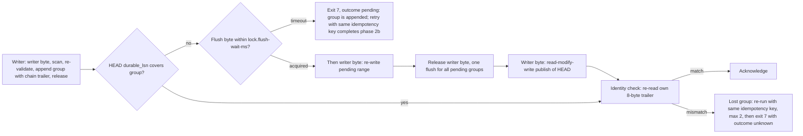

# 12. Кроссплатформенность (Windows, Linux, macOS) и конфигурация

## 12.1 Решение #32 и принципы X1–X9

Ваше решение #32 (2026-09-26): moirai проектируется сразу под три ОС. В M0–M11 реализуется и проходит гейты только Windows. Linux и macOS идут в отдельной фазе портирования, которая не включена в календарь. В записи AR (обратный перевод ваших слов): «Учти, что система должна работать и под macOS, и под Linux» и «Бинарники под Linux и Mac пока не собирай, просто учти, что это нужно будет реализовать. Но пока мы это не тестируем — нет возможности». Прежние варианты («релиз только под Windows с подстраховками» и «Linux/macOS как полноправные платформы релиза») отозваны.

Архитектурное следствие: **один формат на диске и одна семантика протокола**, которые нативно отображаются на все три ОС и замораживаются в M0. Поэтому порт никогда не меняет ни байта, ни правила. Девять принципов [80 §1]:

| # | Принцип | Что это даёт или запрещает |
|---|---|---|
| X1 | Одна раскладка байтов: little-endian, 64 бита, без зависимости от размера страницы и разделителя пути. Runtime-строки ОС несут тег ОС, и строка с чужим тегом читается как отсутствующая | бэкап восстанавливается на другой ОС, образ импортируется где угодно; big-endian и 32-битные цели не поддерживаются |
| X2 | Один протокол, написанный под **самую слабую** ОС: явная долговечность каталогов, откат или исчезновение страниц после неудачного flush, усечение отображённых файлов, сколь угодно долгая задержка снятия блокировки, переиспользуемые inode | симулятор реализует модель отказов «слабейшей ОС», так что GT1 и GT3 на Windows уже с M1 проверяют и Unix-семантику отказов |
| X3 | Различия ОС живут только в `moirai-os` | проверяется линтом GT20 (d) |
| X4 | Реализация выбирается при компиляции и никогда не подменяется | на пути коммита нет динамической диспетчеризации |
| X5 | Ничего не ослабляется молча: если ОС не даёт гарантию, хранилище отвергается или ответ помечается (`unverified`, `Unknown`, Unknown-boot) | нет отката `F_FULLFSYNC` → `fsync`, нет `flock`, нет истечения по PID, нет непроверенных ФС |
| X6 | Контракт задаёт самый слабый клиент: песочница, чужое пространство имён PID, другой принципал | прямой путь полон, лидер — только оптимизация |
| X7 | Windows строится сейчас, Linux и macOS специфицированы и портируются позже | M0 замораживает формат для трёх ОС |
| X8 | Порт не меняет формат и протокол. Если находка порта требует такого изменения, это дефект спецификации: M0 переоткрывается, и все пройденные вехи перезапускают гейты ([60] P4) | поэтому уже сейчас заморожено даже то, что нужно только Linux/macOS: `DIRMAP`, дайджест Linux-хэндла, поле `docid`, вид FSEvents в `JOURNALCUR`, запись Unix-эндпоинта |
| X9 | В продукте только публичные документированные интерфейсы | единственное недокументированное чтение — macOS `kern.bootsessionuuid`; если его нет, процесс работает в Unknown-boot mode |

Поведение Linux и macOS **никто не измерял**: WSL не установлен, Mac нет. Все их цифры ниже помечены «заявлено» (сторонние данные) или «оценка».

> ✅ **Подтверждено вами 2026-09-27 (Б12 раздела 15):** формат и протокол для Linux и macOS замораживаются в M0 только по документации и чтению исходников, без единого измерения на этих ОС. Это риск 29 (вероятность medium, ущерб high). Смягчения: заморозка всех байтов и правил, модель отказов «слабейшей ОС» в симуляторе, Unknown-boot mode, прогон `VolumeCaps` в GT2 с M6, линт слоя ОС GT20 (d) и кросс-целевая проверка типов GT20 (e) — гейт с M0. Если порт найдёт несовместимость, M0 переоткроется, и гейты всех пройденных вех перезапустятся. Этот риск вы приняли.

_Источники: AR §14, §11 #32, §10 риск 29; [80 §0, §1, §5.5]_

## 12.2 Слой `moirai-os` и его границы

Весь код, зависящий от ОС, лежит в одном крейте `moirai-os`. В нём подпапки `windows/`, `unix/` (общий код Linux и macOS), `linux/`, `macos/` и платформонезависимая часть: внутрипроцессная таблица блокировок и записи-свидетельства. Модулей двенадцать. Основные стоят за двумя швами, `Vfs` и `ProjectFs`; эти трейты существуют потому, что у каждого есть симулятор:

| Модуль | Назначение | Шов |
|---|---|---|
| `os::fs`, `os::lock`, `os::map`, `os::env` | файловый ввод-вывод и классы долговечности; байтовые блокировки; отображение запечатанных файлов; защита окружения и проверка версии ОС | `Vfs` |
| `os::path`, `os::project` | преобразование путей и канонический корень; идентичность файлов проекта, перечисление, переименование для R4 | `ProjectFs` |
| `os::proc` | `ProcId`, идентичность загрузки, boot clock, слежение за родителем | внедряется |
| `os::ipc`, `os::mem`, `os::spawn`, `os::term`, `os::test_host` | IPC (только для лидера); учёт памяти; фоновый `moirai gc`; консоль и UTF-8; `kill`/`suspend`/малый том (только в тестовых сборках) | — |

**Правила границы.** `windows-sys` и `libc` прямыми зависимостями объявляют только `moirai-os` и точка входа бинарника. Транзитивно (например, через tokio во фронтенде MCP) они допускаются лишь по проверенному allow-list. Нигде не используются `File::lock` (на Unix это `flock`: на macOS он конфликтует с OFD-блокировками, а на Linux им невидим) и `std::fs::rename` (на Unix он молча заменяет существующий файл; для этого есть явная операция `rename_replace`). Слой добавляет только один вид потока, и только на Unix: поток-ожидатель блокировки со стеком 64 KiB. Он существует, пока ожидает спорный захват. **Брошенный** ожидатель (вызывающий уже вышел по таймауту) остаётся припаркованным, пока не получит байт, и сразу его отпускает. Поэтому он живёт не дольше, чем другой процесс держит этот роль-байт: секунды для writer- и flush-байтов, а maintenance-байт никто никогда не ждёт. Правило простоя учитывает такой поток, пока он существует. В простое нет ни таймеров, ни потоков, кроме читателя stdin у MCP-сервера.

**Кратко по ОС** (полная таблица вызовов — в [80 §2]):

| Задача | Windows (M1–M11) | Linux (порт) | macOS (порт) |
|---|---|---|---|
| Байты блокировок | `LockFileEx`; ожидание через overlapped + `WaitForSingleObject` + `CancelIoEx` | OFD (`F_OFD_SETLK[W]`), поток-ожидатель | OFD из публичного SDK macOS 14, поток-ожидатель |
| `durable` / `durable+meta` | `NtFlushBuffersFileEx(DATA_SYNC_ONLY)` / `FlushFileBuffers` | `fdatasync` / `fsync` | `F_FULLFSYNC` / `F_FULLFSYNC` |
| `durable-name` | `FlushFileBuffers` на хэндле каталога | `fsync(dirfd)` | `fsync(dirfd)` + барьер `F_FULLFSYNC` |
| Rename без замены / замена / обмен | `MoveFileExW` без `REPLACE_EXISTING` / с ним / два rename + intent | `renameat2(RENAME_NOREPLACE)` / `renameat` / `RENAME_EXCHANGE` | `renamex_np(RENAME_EXCL)` / `rename` / `RENAME_SWAP` |
| Запечатанные файлы | `FILE_ATTRIBUTE_READONLY`; `EXCEPTION_IN_PAGE_ERROR` → exit 7 | `0444`; `SIGBUS` → exit 7 | как Linux |
| ФС хранилища | NTFS | ext4, XFS, btrfs | APFS |
| Идентичность загрузки; boot clock | счётчик `BootId` (+ `MachineGuid`); `QueryInterruptTimePrecise` | `/proc/sys/kernel/random/boot_id`; `CLOCK_BOOTTIME` | `kern.bootsessionuuid` (иначе Unknown-boot); `mach_continuous_time` |
| Слежение MCP-сервера за родителем | ожидание на хэндле процесса | `pidfd_open(getppid())` | `kqueue EVFILT_PROC` |
| IPC (только лидер) | именованный канал, DACL пользователя | Unix-сокет в каталоге 0700 | Unix-сокет в пользовательском temp |
| Гейт приватной памяти | `PeakPagefileUsage` | cgroup-v2 `memory.peak`, относительно пола | `ledger_phys_footprint_peak`, относительно пола |
| Идентичность файла R4 | `FILE_ID_128`; `OpenFileById` | `f_fsid`, inode + дайджест хэндла; фронтир изменённых каталогов | UUID тома + file id; `fsgetpath` |
| Временные файлы; пользовательский config | `<store>/tmp/`; `%APPDATA%\moirai\config` | `<store>/tmp/`; `$XDG_CONFIG_HOME/moirai/config` | как Linux |

_Источники: AR §14; [80 §2.1, §2.12]_

## 12.3 Блокировки, долговечность и модель отказов

**Блокировки.** Все блокировки — эксклюзивные однобайтовые блокировки файла `LOCK`. Байты лежат **за концом файла**, начиная с 2^62, поэтому обязательные байтовые блокировки Windows не мешают бэкапу, антивирусу или `doctor` читать сам файл. Роли: writer (+0), leader (+1), maintenance (+2), quiet (+3), **flush (+4)**, резерв до +63; 256 слотов живучести по адресу 2^62 + 2^16 + i. Владение **сначала решается в пространстве пользователя**: общая для процесса таблица выдаёт второму клиенту того же процесса `Busy` или внутрипроцессное ожидание ещё до вызова ядра. Так нереентерабельный отказ Windows и слияние OFD-блокировок никогда не возникают, и два клиента в одном процессе ведут себя одинаково на всех ОС. Порядок один: slot < leader < maintenance < flush < writer. Ждать можно только роль-байт и только «вверх». Держатель writer-байта никогда ничего не ждёт и не делает flush. `probe` не узнаёт, кто держит байт: ядро держателя не раскрывает, поэтому его ищут в записях `LOCK`, а отказ по правам даёт `Unknown`, а не `Free`. Справедливость очереди в контракт не входит. После смерти держателя Windows снимала блокировку не позже чем через 32 мс, p99 1–8 мс (измерено). Но на любой ОС crash reporter может держать процесс неограниченно долго, и это вписано в модель отказов. Таймауты задают `lock.writer-wait-ms` и `lock.flush-wait-ms` (по 2 000 мс; значения предварительные, их подтверждают M0 item 2, а для writer-байта ещё и item 12).

**Классы долговечности** (одинаковая гарантия на всех ОС):
- `lazy` — видно всем после публикации и переживает крах процесса. Может пропасть при крахе ОС, потере питания или неудачном flush **в любом процессе**.
- `durable` — подтверждается только после записи на носитель. На macOS это всегда `F_FULLFSYNC`: никогда не простой `fsync` (данные остаются в кэше диска) и никогда не `F_BARRIERFSYNC` (он только упорядочивает).
- `durable+meta` — плюс размер файла и его выделение.
- `durable-name` — create, rename или unlink переживает потерю питания.
- `sync_group` — на macOS группа из нескольких `fsync` и одного завершающего `F_FULLFSYNC`.

Класса «только упорядочивание» нет, пути через `O_DIRECT` + `RWF_DSYNC` тоже нет: для этого нужен выровненный формат, а это изменение формата. **Любая ошибка не-lazy класса аварийно завершает процесс без подтверждения.** `ENOTSUP` никогда не понижается до более слабого вызова, как это делают Go и SQLite: хранилище отвергается с exit 7. Каждая точка протокола с переименованием на всех ОС делает rename без замены, а затем `durable-name` обоих родительских каталогов. Исключение — точки, которые заменяют или обменивают: у них свои операции, `rename_replace` (перезапись `<store>/config`, а при экспорте образа — `packed-refs.lock` → `packed-refs` и loose `<ref>.lock` → `<ref>` по протоколу блокировок git) и `swap_dirs` (обмен каталога хранилища при `restore`), и за каждой тоже следует `durable-name`. `FILE_FLAG_WRITE_THROUGH` для долговечности не используется. Экстенты журнала всегда читаются нулями за хвостом: на NTFS их заполняют нулями с flush; на ext4 и XFS используют `FALLOC_FL_WRITE_ZEROES` (ext4 ≥ 6.17, XFS ≥ 7.3, заявлено) или нули; на btrfs и APFS — разреженный `ftruncate`.

**Модель отказов** (поправки заморожены в M0, X-F5). Метаданные каталога долговечны только после `sync_dir`, до этого может потеряться любое подмножество операций. Правило NTFS «префикс порядка выдачи» отброшено, потому что на btrfs и ext4 с fast-commit оно неверно. После неудачного flush чтения могут вернуть старые **или** новые байты, и результат может меняться между чтениями: btrfs откатывает страницы, macOS инвалидирует буферы, ext4 и XFS вытесняют «чистые» страницы. Любая запись и любой flush могут получить disk-full. Чтение через отображение может убить процесс. Чужой процесс может усечь файл хранилища. Чтение может вернуть `EIO`. Единое правило для всех ОС: неудачный flush убивает процесс, а следующий держатель flush **перезаписывает** весь незафиксированный диапазон из прочитанного и только потом делает flush. Как Windows ведёт себя после сбоя flush, определит M0 item 18. `MOVEFILE_WRITE_THROUGH` на Windows используется поверх flush каталога, пока калибровка стенда (item 17) не покажет, что он не нужен; калибровка вместе со стендом OS-crash по вашему решению от 2026-09-27 (В7) отложена до после релиза.

_Источники: AR §14, §8.2 items 17–18, §13; [80 §0 п. 4, §2.2, §2.3, §3.1 X-F5]_

## 12.4 Групповой коммит: без лидера, через flush-байт, подтверждение по идентичности

**Почему это решается в M0 для всех ОС.** В исходном AR §4.5 писатель держал writer-байт на время записи, flush и публикации. Тогда последнее подтверждение из пачки 16 писателей стоит около 16 flush. На macOS `F_FULLFSYNC` занимает 3,1–3,9 мс p50 и 11,6 мс p99 на M3/M5 и ≈ 17–20 мс на M1 (заявлено). Получается ≈ 50–65 мс p50, а на M1 ≈ 290–320 мс, и гейт 50 мс не проходит. Протокол один для всех ОС и замораживается в M0, поэтому ждать измерений на Windows нельзя.

| Вариант | Итог |
|---|---|
| A. Последовательный flush под writer-байтом | 16 flush на пачку; на macOS гейт не проходит |
| B. Обязательный лидер | **отвергнут**: песочные CLI на Linux (seccomp даёт `EPERM` на `socket(AF_UNIX)`) и macOS (Seatbelt) до него не достают |
| C. Параллельные flush без блокировки | больше flush, слабее семантика отказов на macOS |
| **D. Выбран:** flush-байт, цепочка групп, подтверждение по идентичности | ≈ 2–3 flush на пачку; на macOS M3/M5 ≈ 8 мс p50 и ≈ 25–35 мс p99, на M1 ≈ 40–60 мс (оценка); IPC нет |

**Формат.** Запись с `group_end` заканчивается 8-байтовым трейлером `chain`. Это XXH3-64 по группе, засеянный значением цепочки перед ней. Поэтому группа валидна только за тем предшественником, против которого её проверял писатель. Группа никогда не пересекает экстент: при ротации старый экстент добивается группой `Noop`. **В `HEAD` не добавляется ни одного поля**: хватает `durable_lsn` и `committed_lsn`. Каждая публикация — это read-modify-write новейшего слота, который сворачивает эффекты всех покрытых групп. Цепочка и проверка идентичности закрывают сценарии [81] B1: подтверждение по позиции потерянного коммита и два долговечных захвата одной задачи. Инварианты I-G1–I-G6, в том числе «не больше одного flush журнала одновременно». К проверкам добавлены 13 засеянных ошибок, сценарий потерянной группы в GT1 и перечисление точек краха в GT1/GT3. Цена для одиночного писателя: две лишние операции блокировки (мкс), один pread `HEAD`, один 8-байтовый pread и XXH3 по группе. Гейты: удержание writer-байта p99 ≤ 5 мс, max ≤ 20 мс; не больше одного flush на коммит и ≤ 3 на пачку из 16; последнее подтверждение пачки p99 ≤ 50 мс на Windows и ≤ max(50 мс, 3 × flush p99 + 5 мс) в портах. Для macOS граница гейта 3 × flush p99 + 5 мс составляет ≈ 40 мс на M3/M5 (то есть гейт остаётся 50 мс) и ≈ 65–80 мс на M1 (оценка): на Mac с M1 последнее подтверждение допускается заметно медленнее, чем на Windows. Это значения границы; ожидаемое последнее подтверждение ниже — ≈ 25–35 мс p99 на M3/M5 и ≈ 40–60 мс на M1 (таблица вариантов выше). Строится в M1.

**Что видит агент при конкуренции.** Если flush-байт не удалось взять за `lock.flush-wait-ms`, процесс завершается с exit 7 и исходом `pending`. Группа уже дописана в журнал, и повтор с тем же ключом идемпотентности находит её и завершает фазу 2b (flush, публикация, проверка идентичности). Потерянная группа не подтверждается: процесс заново проходит фазы 1–2 с тем же ключом, не больше двух раз, а затем завершается с exit 7 и `outcome unknown: retry with the same idempotency key`. Повтор подтверждает ожидающую группу только через проверку идентичности.

Протокол заменяет шаги 5–10 и публикацию шага 12 в AR §4.5. Он же снижает вероятность, что измерения M0 потребуют лидера в M1; если лидер уйдёт из M1, это сэкономит 3–4 units. На macOS каждый долговечный коммит всё равно стоит 3–20 мс (риск 32), и более слабый класс не предлагается.

**Риск 31** (вероятность medium, ущерб severe): сам протокол (ожидающие группы, flush-байт, цепочечная валидность, подтверждение по идентичности, публикации read-modify-write) может скрывать ошибку потерянного подтверждения или видимости. Это новая поверхность краха (пункты модели отказов 3, 11 и 12), а первая редакция [80] подтверждала по позиции и после неудачного flush могла потерять или дважды применить коммит ([81] B1). Смягчения: инварианты I-G1–I-G6; GT1 с несколькими ожидающими группами, держателями flush и неудачными flush, после которых страницы откатываются, инвалидируются или вытесняются при продолжающихся дописываниях; 13 засеянных ошибок группового коммита; GT3 и kill-циклы с 16 писателями; проверки модели, что «подтверждено» значит долговечно, видимо и стоит за тем префиксом, против которого проверялось.

_Источники: AR §14, §8.3 (per-OS notes), §10 риски 31, 32, §13; [80 §2.4]_

## 12.5 Отображение, защита окружения, живучесть, IPC, метрики

**Отображение в память (X-F6).** Отображаются только **запечатанные** файлы, только на чтение и целиком. Файл запечатан, когда он полностью записан, прошли `durable+meta` и `durable-name` и его назвал долговечный `Checkpoint` или коммит. На диске запечатанный файл read-only, поэтому случайный `cp` или сохранение из редактора получают `EACCES`, а не роняют читателей. Заголовок каждого запечатанного файла содержит `total_len u64`, и перед отображением размер сверяется с ним: это Unix-аналог защиты, которую на Windows даёт сама ОС. Отображённые байты читаются только через типы, для которых допустим любой битовый паттерн (`zerocopy::FromBytes`), и все смещения проверяются. Обработчик `SIGBUS` или `EXCEPTION_IN_PAGE_ERROR` печатает одну строку и завершает процесс с **exit 7**. Размер страницы в формат не входит: на macOS arm64 страницы по 16 KiB.

**Защита окружения.** Действует allow-list, в котором **каждая разрешённая ФС покрыта краш-гейтом**: NTFS (M1); ext4, XFS, btrfs; APFS с `MNT_LOCAL`. Отвергаются с названием причины: ReFS/Dev Drive, FAT/exFAT, сетевые тома и UNC (включая `\\wsl$`), OneDrive; ZFS, f2fs, bcachefs, NFS, SMB, любой FUSE (virtiofs, Docker Desktop), 9p (WSL2 `/mnt/*`), tmpfs, **любой overlayfs**; HFS+, iCloud Drive и папки File Provider. Новая ФС добавляется только изменением кода с краш-доказательствами (варианты GT4 и GT15), **никогда ключом конфигурации**. В M0–M11 NTFS допускается на доказательствах модели сбоев GT1/GT3 и GT4 на настоящем NTFS; его вариант GT15 пойдёт вместе со стендом OS-crash, отложенным до после релиза (В7 раздела 15, AR §10 риск 17). Полная проба идёт при `init`/`restore`. При каждом открытии выполняется дешёвая классификация, ≤ 20 мкс (оценка). Общий доступ к хранилищу из Windows и WSL2 запрещён, потому что блокировки живут в разных ядрах. Песочный писатель без прав получает exit 7 с точной строкой `sandbox.filesystem.allowWrite`. Читатели в песочнице продолжают работать: они открывают хранилище только на чтение и не берут блокировок. На Linux и macOS запись вне хранилища тоже требует разрешения: `image export` в назначение по умолчанию (рядом с main worktree), `backup DIR` вне хранилища и обмен каталогов при `restore`. Песочный CLI в этих случаях завершается с exit 7 и печатает точную запись `allowWrite` для родителя назначения; ежедневный экспорт из `SessionStart` и так идёт в хуке без песочницы.

**Риск 33** (вероятность medium, ущерб medium): песочница Claude Code может запретить то, что нужно прямому пути, — правило Seatbelt для блокировок, хранилище или назначение экспорта вне набора записи, нечитаемую идентичность загрузки, rollup-потомка, убитого вместе со своим пространством имён PID. Всё это не проверено. Смягчения: отказ с точным исправлением (exit 7 и запись `allowWrite`), читатели без блокировок, Unknown-boot mode, никакого rollup-потомка из чужого пространства имён PID; пробы песочниц — первая задача порта ([80 §5.2]).

**Живучесть и идентичность загрузки (X-F2).** В песочнице Claude Code на Linux каждая команда получает новое пространство имён PID, а на macOS Seatbelt отвечает `EPERM`. Поэтому проверка по `(pid, start)` дала бы ложный Dead. Живучесть **привязана к блокировкам**: блокировка принадлежит inode и видна сквозь пространства имён. Сессионный якорь жив, если захваченный слот содержит запись с хэшем сессии. Intent-якорь (его держат `file mv`/`file rm`) жив, если запись слота несёт его nonce. Ответы: `Alive`, `Dead` или `Unknown`, и `Unknown` никогда ничего не освобождает. Таблица слотов 32 KiB читается одним `pread`, проба стоит 2–9 мкс на Windows (измерено). `ProcId` (32 B) нужен только для диагностики. **Идентичность загрузки** постоянна в пределах одной загрузки и не меняется при переводе часов, сне и гибернации. На Windows это BLAKE3-128 от счётчика `BootId` и `MachineGuid`, а не время загрузки: время загрузки сдвигается при установке часов, и все аренды живого агента стали бы Dead. Процесс, который не может прочитать идентичность, работает в **Unknown-boot mode** и не отвергает хранилище: он не публикует `boot_id`, не запускает восстановление после перезагрузки, а проверки загрузки для аренд отвечают `Unknown`. Его писатели сканируют журнал до конца, поэтому подтверждённый коммит, чья публикация потерялась при крахе ОС, публикует следующий flush. Цена режима одна: до запуска процесса без песочницы (MCP-сервер, хук) или любого писателя такой коммит остаётся невидимым для читателей этого процесса. Сроки аренды `{wall, boot_hash, mono}` считаются по boot clock, который включает сон. Поэтому 15-минутная аренда на уснувшем ноутбуке истекает по прошедшему времени одинаково на всех ОС. Проверку на Windows (перевод часов, сон, гибернация, перезагрузка) делает M0 item 22. MCP-сервер завершается вместе с родителем через событие, без таймеров (`PR_SET_PDEATHSIG` не используется); это строится в M10.

> ✅ **Решено командой дизайна 2026-09-27, принято вами (А5)** (подтверждает спецификационное ревью M0 при заморозке формата): поправка [90 §4.4, §10.1] перенесена в X-F1 и X-F2 [80]. Хэш сессии — BLAKE3-128 от идентичности с пространством имён `<harness>:<id>` (16 B, той же ширины, что хэш `bound`); CLI или хук ищет свой слот по хэшу `claude:` + `CLAUDE_CODE_SESSION_ID` или `codex:` + `CODEX_THREAD_ID`. Вид якоря `session-ttl` добавлен со значением 4, прежние значения (0 none, 1 session, 2 intent, 3 leader) не меняются. Сервер потока Codex берёт слот лениво, при первом вызове с `_meta.threadId`. Размеры не меняются: якорь — 32 B (у `session` и `session-ttl` 16-байтовый хэш занимает место диагностического nonce и u64-хэша; у `intent` и `leader` остаётся nonce, по которому проверяется живучесть, а рядом — 8-байтовый диагностический префикс хэша); `SlotRec` — 128 B (первичный и алиасный хэши расширены до 16 B за счёт резерва, `xxh3` остаётся в последних 8 байтах, поля после хэшей сдвигаются на 16 B); таблица слотов — 32 KiB, смещения `LOCK` прежние. `WriterDiag` несёт 16-байтовый хэш в пределах своих ≤ 512 B.

**IPC** нужен только лидеру, если его когда-нибудь построят. На Windows это именованный канал с DACL пользователя, на Unix — сокет по пути в каталоге 0700 (`$XDG_RUNTIME_DIR/moirai/` или `/tmp/moirai-<uid>/`; на macOS пользовательский temp из `confstr`). Никогда не используются абстрактные сокеты и `$TMPDIR`. Песочный клиент уходит на прямой путь, который полон.

**Метрики.** Windows сохраняет абсолютные RSS-гейты (`PeakPagefileUsage`). В портах гейт считается относительно пола: пик команды минус пик пустого Rust-бинарника ≤ гейт Windows минус пол Windows. Для строки CLI при 1e5 это 4 MB − 0,69 MB ≈ 3,3 MB. Переносимый `heap_peak` выводится рядом; `ru_maxrss` гейтом не бывает. Аллокатор — системный: mimalloc и jemalloc написаны на C и исключены решением #44.

_Источники: AR §14, §8.2 item 22, §10 риск 33; [80 §2.5–§2.9]; [90 §4.4]_

## 12.6 Пути и файловая идентичность R4

**Пути (X-F7).** Сходятся три правила эквивалентности. NTFS не различает регистр (флаг на каталог), но различает нормализацию: NFC- и NFD-`café.txt` там два файла (измерено). Linux сравнивает байты, кроме casefold-каталогов. APFS по умолчанию не различает регистр и нормализацию. Общий знаменатель — **написание git**. Правила P1–P12 делают хранимый путь, производный uid и байты образа одинаковыми на трёх ОС:
- отслеживаемый файл хранится в написании дерева git (P2); неотслеживаемый — на APFS как NFC (P3);
- `\`, управляющие символы и не-UTF-8 имена отвергаются (P4);
- `file mv` не создаёт имя, которое какая-либо ОС не удержит: `CON`, завершающая точка, `<>:"|?*`, коллизия регистра. Политику задаёт ключ `files.portable-names = refuse` (P5);
- `PATHIDX` сворачивает имена функцией `fold_v1 = NFD(full_casefold(NFD(x)))` на Unicode 17.0.0, только для поиска коллизий и порядка, не для идентичности (P6);
- корень канонизируется по компонентам с дисковыми именами и ищется сначала по id корня (P9);
- имена файлов именованных запросов хэшируются (`schema/queries/<q>.moi`), а ref-имена, совпадающие после свёртки, запрещены (P11, X-F9);
- `abs`-пути машинно-локальны (P12).

**Идентичность файлов для R4 (X-F8).** Резолвер один. Он видит нормализованные записи-свидетельства и `VolumeCaps` тома, а не вызовы ОС. Если источника нет, он ничего не вносит, но правила не меняются. `OsFileId` (57 B) = `{kind, vol_key[16], id[16], parent[16], aux, docid}`, идентичность — равенство всего `OsFileId`.
- **Windows:** `FILE_ID_128` (номер последовательности отличает переиспользованный слот MFT), `OpenFileById` для E3/E3d.
- **Linux:** `ino ‖ hgen`, где `hgen` — дайджест хэндла из непривилегированного `name_to_handle_at`, несущего поколение inode. Поэтому переиспользованный номер inode — это другой объект. `open_by_handle_at` требует `CAP_DAC_READ_SEARCH`, так что путь по id находится через **фронтир изменённых каталогов** (`DIRMAP`): POSIX-rename меняет mtime обоих родителей.
- **macOS:** file id и `fsgetpath`. Поле `docid` зарезервировано. Решение #21 (d) — ставить ли на связанные файлы `UF_TRACKED`, чтобы document id macOS переживал сохранения через rename-over, — остаётся открытым и отложено до порта macOS (вариант по умолчанию «нет»). Ни один замороженный байт от него не зависит.

Журнал E2 (USN, FSEvents) не строится (#41). Время создания подтверждает перенос только на Windows и только если оно уникально; на Linux и macOS (клоны его копируют) — никогда. «Близнецы» по регистру или нормализации из другой ОС не резолвятся по одному совпадению написания. Гарантия на всех ОС одна: **ссылка никогда молча не указывает на чужой файл**. Различается лишь момент, когда перенос становится точным: сырой rename на Windows и macOS точен уже при чтении, а на Linux — при settle или если фронтир укладывается в `files.read-budget-ms`. В M6 строятся `VolumeCaps` как вход резолвера, теговые строки `OsFileId` и прогон GT2 по профилям трёх ОС.

> **Примечание (исторические отчёты, не нормативные документы):** отчёты расходятся в том, можно ли читать журнал USN без прав администратора: [09]:16 измерил, что `FSCTL_READ_UNPRIVILEGED_USN_JOURNAL` работает, а [12]:34 и [13]:47 утверждают, что нужны права администратора. [80 §2.11.1] и [40 §4.7] следуют измерению [09]. На M0–M11 это не влияет, потому что E2 не строится.

**Оболочки (X-F12).** Правила T1–T10 входят в замороженный контракт вывода:
- id в argv — голые числа (`show 40`);
- ни один токен не начинается с `#`, `~`, `=`, `@`, `!`;
- свободный текст передаётся через stdin из heredoc в кавычках;
- вывод — UTF-8 с LF, побайтно одинаковый на всех ОС.

_Источники: AR §14, §11 #21 (d); [80 §2.10, §2.11, §4]_

## 12.7 Что M0 замораживает для портов (X-F1–X-F12)

| # | Содержание |
|---|---|
| X-F1 | раскладка `LOCK` v1: 36 KiB, создаётся только `init`/`restore`, никогда не удаляется; `LockHdr`, `WriterDiag`, резерв `LeaderRec`, 256 × 128 B `SlotRec`; байты ролей за EOF |
| X-F2 | якоря (32 B; хэш сессии BLAKE3-128 от `<harness>:<id>`, виды none/session/intent/leader/session-ttl), `ProcId`, правило идентичности загрузки, Unknown-boot mode, срок аренды по boot clock |
| X-F3 | групповой коммит, трейлер `chain`, инварианты I-G1–I-G6 |
| X-F4 | контракт блокировок (сначала пространство пользователя) и порядок |
| X-F5 | классы долговечности по точкам протокола (rename без замены, `rename_replace`, `swap_dirs`), запрет понижения, пункты модели отказов (2), (3), (5), (7)–(12) |
| X-F6 | политика отображения (`total_len`), allow-list ФС с краш-гейтами |
| X-F7 | каноническая форма путей P1–P10, P12; `fold_v1` на Unicode 17.0.0 |
| X-F8 | теговые runtime-раскладки R4 (`OsFileId`, `JOURNALCUR`, `DIRMAP`), правила резолвера по ОС |
| X-F9 | хэшированные имена файлов запросов, переносимые ref-имена без совпадений после свёртки |
| X-F10 | имена файлов хранилища только из десятичных чисел и фиксированных ASCII-слов |
| X-F11 | расположение пользовательского config по ОС (сами ключи не заморожены) |
| X-F12 | транспортные правила оболочек T1–T10 |

Проверено и не требует изменений для портов: каноническая форма коммита, кодек `.moi`, заголовки записей, слот `HEAD` (новое поле не добавляется), слой объектов git, коды выхода 0–10, симуляторы `Vfs`/`ProjectFs`.

> ✅ **Подтверждено вами 2026-09-27 (Б3, Б12 раздела 15):** список X-F1–X-F12 войдёт в формат v1 на выходе M0 и больше не меняется. В него входит и протокол группового коммита (X-F3, вариант D), выбранный до измерений на Windows; его собственный риск — 31 (medium / severe, §12.4), а цену долговечного коммита на macOS описывает риск 32. Любое изменение после заморозки переоткрывает M0, пройденные вехи перезапускают гейты, а хранилища до релиза пересоздаются, а не мигрируют.

_Источники: AR §14, §10 риски 31, 32; [80 §3]_

## 12.8 Минимальные версии и файловые системы

| | Windows | Linux | macOS |
|---|---|---|---|
| Минимум | Windows 11 x64 (гейты на сборке владельца 25H2, build 26200) | ядро ≥ 5.10, 64 бита, статический musl | macOS 14 Sonoma |
| Архитектуры | x64 (arm64 не тестируется) | x86_64, aarch64 | только arm64 (Intel — часть решения #42) |
| ФС хранилища | только NTFS | ext4, XFS, btrfs | APFS |

Код формирует только минимум macOS 14: это первый публичный SDK с OFD-блокировками. Бинарник линкуется с минимумом 14 и проверяет версию при открытии; диапазон 10.13–13 с приватными OFD-константами не используется. Порт может поднять минимум, но не опустить его ниже технического. **На Windows в M0–M11 допускается только NTFS**: ReFS, а значит и Dev Drive, отвергается, пока нет ReFS-вариантов GT4 и GT15, и они не запланированы. Значит, каждый репозиторий с хранилищем остаётся на NTFS (§11 #15).

> ✅ **Подтверждено вами 2026-09-27 (Б12 раздела 15):** матрица поддержки такая: только Windows 11 x64; хранилище только на NTFS (Dev Drive/ReFS запрещены, ваши репозитории остаются на NTFS); Linux ≥ 5.10 как статический musl; macOS ≥ 14 только arm64.

_Источники: AR §14, §1 строка 14, §11 #15; [80 §2.6, §2.13]_

## 12.9 Почему в M0–M11 только Windows и что защищает от «Windows-only» кода

Решение #32 прямо запрещает сейчас собирать и тестировать бинарники под Linux и macOS. **Ничто в M0–M11 не собирает, не запускает, не тестирует и не краш-тестирует бинарник под Linux или macOS.** Чтобы к порту в общих крейтах не накопился Windows-специфичный код, есть три меры, и ни одна не собирает бинарник:

- **(a) GT20 (d), линт слоя ОС, с M1.** Сканирование исходников: `cfg(windows|unix|target_os)` и `std::os::*` допустимы только в `moirai-os`. Отдельно проверяются прямые зависимости через `cargo metadata`. Стоит ≈ 0,5 unit.
- **(b) GT20 (e), кросс-целевая проверка типов, гейт с M0** (решение #44: «Сделай cargo check для Linux и Mac»). Выполняется `cargo check --workspace --all-targets --locked` для `x86_64-unknown-linux-musl`, `aarch64-unknown-linux-musl` и `aarch64-apple-darwin` рядом с хостом Windows. Компиляторы C, C++ и ассемблера каждой цели «отравлены» (`CC_<target>` и др. указывают на фиктивный компилятор `moirai-no-c-compiler`). Проверяются все крейты, кроме бинарного: он лишь корень композиции, `main.rs` ≤ 200 строк, связывающий `moirai-os` с проверяемым `moirai-app`, и до порта проверяется только под Windows. Кроме того, исключены хост-крейты оракулов и инструментов из `xtask/host-only.toml`; продуктовый крейт туда внести нельзя. Гейт работает в локальном pre-merge (`xtask gate`) и в PR CI на бесплатных hosted Windows-раннерах (репозиторий публичный, #36). На выходе только `.rmeta`: **ни бинарника, ни линковки, ни тестов**. Ловит Windows-only API `std`, типы Windows в общих сигнатурах, ошибки `cfg`, недостающие для других целей элементы трейтов и любой C/C++/asm в графе зависимостей. Семантику (регистр, `\`, блокировки, долговечность) не ловит: её держат замороженные правила, симулятор и прогон `VolumeCaps`.
- **(c) Прогон `VolumeCaps` в GT2, с M6.** Дифференциал ссылок гоняется с профилями трёх ОС как чистыми данными, ≈ 1 unit.

**Цена GT20 (e) и правила «только чистый Rust»** (оценка): `rustup target add` ×3 по ≈ 100–200 MB; отдельные target-каталоги по ≈ 0,5–1 GB; 1–3 мин на цель с холодного старта и 5–30 с инкрементально, то есть ≈ 15–90 с на прогон pre-merge; настройка ≈ 0,5–1 unit плюс ≈ 0,5–1 unit на отравление, линты и выделение корня композиции. Следствия для зависимостей:
- `blake3` только с `pure` (без AVX-512 и NEON; скорость измеряет M0 item 13);
- C-библиотека `zstd` уходит, и кодек выбирается в M0 среди чисто-Rust вариантов (`lz4_flex`, `ruzstd`);
- `sha1`/`sha2` без `asm`;
- нет C-аллокатора;
- каждый build script требует записи в `xtask/native-allow.toml`.

**Риск 37** (вероятность high — это наверняка; ущерб low–medium): ни один чисто-Rust крейт не пишет zstd-кадры со словарём (`ruzstd` 0.9 сжимает только на уровне Fastest и без словарей), поэтому кодек меняется ещё до заморозки. Ожидаемый выбор, который M0 item 6 проверит на ваших данных: `lz4_flex` со словарём сырого содержимого для тел и кадры `ruzstd` для истории. Если с ними не пройдёт какой-то бюджет, запасной вариант (3) — собственный кодер словарных кадров формата zstd: **+ 5–8 units** (≈ 1,5–2,5 тыс. строк с тестами и фаззингом) в линии B до выхода из M1.

**Сколько проектирование под три ОС добавляет к M0–M11** (оценка, уже в календаре §9): M0 5–7,5 units плюс 0,5–1 на GT20 (e); M1 2,5–5 (flush-байт и групповой коммит, таблица владения, обработчик in-page error, `total_len`, NTFS allow-list, счётчик загрузки Windows, линт); M6 1–2,5; M10 0,5. Итого ≈ 9,5–16,5 units, или ≈ 1,2–3,3 недели на критическом пути одной линии (lane).

> ✅ **Подтверждено вами 2026-09-27 (Б12 раздела 15):** правило «каждая зависимость — чистый Rust» (#44) и его цена: +15–90 с на каждый pre-merge, ≈ 1,5–3 GB диска, нет mimalloc, jemalloc и C-`zstd`, `blake3` без AVX-512 и NEON. Кодек выбирается в M0 из чисто-Rust вариантов и может дать худшее сжатие (риск 37, наверняка). Если бюджет не пройдёт с `lz4_flex` + `ruzstd`, собственный кодер формата zstd обойдётся в + 5–8 units до выхода из M1.

_Источники: AR §14, §8.3 GT20, §10 риск 37, §11 #44; [80 §5.5, §5.4]; [90 §11, §11.3]_

## 12.10 Фаза портирования

**Статус.** Фаза описана, но не запланирована, не входит в релизный гейт RG1–RG12 и не блокирует релиз или переход. В ту же фазу после релиза по вашему решению от 2026-09-27 (В7: «Пока нет возможности это установить, настолько глубокий тест откладываем до релиза, так же как и mac с linux») перенесён стенд OS-crash для Windows: GT15 на госте Windows Server 2025 Core в VirtualBox 7 с VMware Workstation Pro для перекрёстной проверки, его калибровка (измерение 17), вопрос лицензии гостя и выбор состояния WSL2 и Memory Integrity на ноутбуке. Он тоже не блокирует релиз, а все поля формата и правила протокола, которые он проверяет, замораживаются в M0, как и для портов. Условия входа: пройден релизный гейт Windows, есть ответ на #42 (железо, CI, покрытие платформ; это деньги) и выполнены предпосылки. Порт никогда не меняет формат или протокол, не добавляет ослабляющих ключей и не снижает объёмы гейтов без вашего решения.

**Содержание.** Сначала пробы, без кода: полы flush, пачка из 16 писателей и её справедливость, снятие блокировки после краха при включённых `systemd-coredump`/ReportCrash, стоимость фронтира, эффективная гранулярность mtime, пол RSS, системный аллокатор на musl. Затем **пробы песочниц Claude Code** (риск 33): OFD в bubblewrap и Seatbelt, читаемость `kern.bootsessionuuid`, отказ `socket(AF_UNIX)`. После этого общий Unix-слой, специфичные для ОС `Vfs`/`ProjectFs` с профилями симулятора ext4 и APFS и дистрибуция. **Гейты для каждой ОС:** соответствие `Vfs`, GT1–GT4, GT11 на железе «пола» (не на hosted-раннере), GT12 по оболочкам, GT15 (LazyFS, dm-log-writes, dm-flakey, QEMU/KVM ≥ 1 000 циклов на выходе; на Mac — Virtualization.framework), GT17 по ФС, 72-часовой soak и **G-X**: побайтовая идентичность формата между ОС (бэкап, хранилище и образ одной ОС открываются на другой).

| Работа | Units (оценка) |
|---|---|
| Linux (пробы, общий Unix-слой, `Vfs`, `ProjectFs`, CI и краш-слои, гейты, musl) | 32–50,5 |
| macOS (после общего слоя) | 20,5–32,5 |
| **Итого** | **≈ 52–83** |

При 5–8 units в неделю это Linux ≈ 4–10 недель, затем macOS ≈ 2,5–6,5; вместе ≈ 6,5–16,5 недели на одной линии или ≈ 5–10 на двух. Не учтены сроки поставки железа и исправления дефектов движка, найденных портом. **Вариант по умолчанию для #42** (срок — фаза порта): Mac mini (≈ $599 разово) как self-hosted раннер и VZ-стенд; бесплатные hosted Linux-раннеры с `/dev/kvm` для краш-слоёв; Linux класса «пол» на dual-boot разделе вашего ноутбука, если порт не купит машину; macOS только arm64. Остальные варианты решения: облачные Mac вместо своего (Scaleway ≈ €0,22/ч, минимум 24 ч), Intel-раннер и сборка universal2, Apple Developer Program ($99/год) — только если moirai распространяется. Кроме #42, на фазу порта отложено решение #21 (d) (`UF_TRACKED`, §12.6).

> ✅ **Подтверждено вами 2026-09-27 (Б12, В7 раздела 15):** порт на Linux и macOS (≈ 52–83 units, 6,5–16,5 недели) и стенд OS-crash для Windows не входят ни в календарь, ни в релиз. Решение #42 о деньгах (Mac mini ≈ $599, Linux на dual-boot разделе) и решение #21 (d) откладываются до начала фазы.

_Источники: AR §14, §10 риск 33, §11 #42, #21 (d); [80 §5.1–§5.4]_

## 12.11 Конфигурация: принцип и механизм

**Принцип** (ваше правило 2026-09-26). Решение владельца — только то, что никакой ключ потом не изменит: формат, модель веток, семантика слияния, схемы идентичности, замороженная поверхность запросов, границы продукта, деньги, данные, покидающие машину, согласие на запись вашей активности (#35: она остаётся локальной, но разрешить запись можете только вы) и график вашей работы (#40: дата перехода). **Любая runtime- и операционная политика — это ключ `config` или строка policy-data с документированным значением по умолчанию**, которое вы меняете когда угодно. Эталонная модель и тесты реализуют каждое допустимое значение. Так 25 бывших вопросов к вам стали ключами или строками policy-data.

**Механизм** (специфицируется в M0; параметры хранилища читаются в M1; команда `moirai config` появляется в M8):
- **Синтаксис** как у git-config (`[files]` `policy.auto = exact`), UTF-8, комментарии `#`. Парсер ручной, ≈ 300 строк, без TOML-крейта. **В M0 замораживаются** синтаксис, приоритеты, правило неизвестного ключа, формат реестра и `HEAD.config_gen`. **Набор ключей не замораживается**: вехи добавляют ключи без изменения формата.
- **Две области, у каждого ключа ровно одна.** *store* (`<store>/config`, общий для всех worktree и процессов): всё, что меняет версионные записи или общее поведение, чтобы все писатели одного хранилища вели себя одинаково. *user* (`%APPDATA%\moirai\config`; `$XDG_CONFIG_HOME/moirai/config`): машинно-локальные пути и тома, политика безопасности для данных, покидающих машину, и обнаружение хранилища. Такие ключи не переезжают с восстановленным хранилищем, а ключ store не может управлять обнаружением, которое это хранилище находит.
- **Приоритет:** флаг > переменная окружения (если реестр её называет) > файл области > встроенное значение.
- **Типизированный реестр в бинарнике** хранит тип, значение по умолчанию, область, класс перезагрузки и однострочную документацию; `moirai config list --defaults` печатает его. `config set` проверяет значение (exit 2). Неизвестный ключ в файле даёт предупреждение (exit 0); неверное значение при чтении откатывается к значению по умолчанию с отчётом в `config check`/`doctor`. В `--json` есть аддитивный ключ `config` с влиявшими нестандартными значениями.
- **Классы перезагрузки:** *hot* — CLI и хук читают config на каждую команду, MCP-сервер перечитывает при смене `HEAD.config_gen` (ручная правка ловится stat при открытии, 17–67 мкс); *restart* — при перезапуске MCP-сервера; *init* — фиксируется при создании хранилища или назначения образа; *install* — применяется `moirai hooks install`, который регистрирует только включённые хуки.
- **Прогон (sweep):** каждый ключ по одному уводится от значения по умолчанию, взаимодействующие пары гоняются попарно (например, `files.policy.auto` × `files.deletion-inference`, `merge.strict` × `merge.policy.<kind>`), полный объём гейтов гоняется на профиле по умолчанию.

**Никогда не ключ:** константы версии резолвера R4, грамматика и тексты ошибок LQ, каноническая форма, кодек `.moi`, хэши и выводы идентичности, долговечность мутаций графа, типизированные правила слияния, I32′, отсутствие таймеров и потоков в простое. Из [80 §2] сюда же входят класс долговечности каждой точки протокола и её вызовы по ОС, раскладка и порядок `LOCK`, правила группового коммита и цепочки, правила живучести и идентичности загрузки, allow-list ФС.

**Policy-data** — строки схемы, версионируемые по веткам: `policy.self-claim-roles` (`developer`, `tester`), `policy.mint.role-lease` (`orchestrator`, `owner`), `policy.role.<role>.*`, `edges.blocks.on-src-deleted` / `edges.gates.on-src-deleted` (`flag`), `merge.policy.<kind>` (включается по желанию).

_Источники: AR §13, §11 (вступление); [60 §2.5, §3.1, §3.2]; [74 A10]_

## 12.12 Основные группы ключей и значения по умолчанию

Колонка «Зачем»: S — скорость, R — RAM, C — корректность, T — токены агентов. Пометка «M0 item N» значит, что значение предварительное и его задаёт или подтверждает измерение M0.

| Ключ | По умолчанию | Область / перезагрузка | Зачем |
|---|---|---|---|
| `discovery.git-hint` | `true` | user / hot | S: общее хранилище находится из всех ваших worktree (44 по [13 §1.3], 46 по [41 §1]) без файлов-указателей |
| `default-branch` | `main` | store / hot | C: куда пишет непривязанный клиент |
| `files.cloud` | `metadata-only` | user / hot | C/S: автоматические пути никогда не гидрируют облачные файлы |
| `store.checkpoint.ops`, `.bytes`, `.body-bytes` | 4 096 (M0 item 10), 4 MiB, 32 MiB | store / hot | S/R: длина хвоста при открытии против частоты чекпоинтов |
| `store.promotion.overlay-ops`, `.overlay-bytes`, `.age-checkpoints` | из M0 item 3 (оценка 3 000–5 000), 1 MiB, 16 | store / hot | S: первое чтение линии ≤ 10 мс; R: оверлей ≤ 1 MiB; диск: один продвинутый файл на продвижение |
| `store.tail.max-overlay-bytes` | 1 MiB | store / hot | R: потолок оверлея хвоста в каждом процессе |
| `store.log-extent-bytes` | 64 MiB | store / init | R/диск: размер экстента журнала |
| `durability.lazy-kinds` | heartbeat, cursor, session-mark | store / hot | S: нет flush на каждый heartbeat; C: эти записи могут пропасть при потере питания (мутации графа долговечны всегда) |
| `maintenance.rollup` | `auto` | store / hot | S/R: фоновый низкоприоритетный `moirai gc` |
| `lock.writer-wait-ms`, `lock.flush-wait-ms` | 2 000 (M0 items 2, 12), 2 000 (M0 item 2) | store / hot | S/C: ограниченное ожидание против ложного exit 7 (для flush-байта — exit 7 с исходом `pending`) |
| `lease.ttl-default`, `lease.reclaim-older-than` | 15m, 30m | store / hot | C: мёртвые захваты освобождаются раньше, но медленная работа может истечь |
| `lease.orchestrator-ttl` | 12 h, продлевается использованием | store / hot | C: оркестратор без хуков держит аренду весь день |
| `gc.reflog-expire`, `gc.trash-expire` | 90d, 14d | store / hot | C: глубина undo против диска |
| `idempotency.retention` | 30d | store / hot | C: повтор воспроизводит результат, а не дублирует |
| `backup.max-age`, `image.export.max-age` | 1d, 1d | store / hot | C: предупреждения `doctor`/`brief` и автоэкспорт |
| `mcp.overlay-bytes` | 4 MiB (`codex`: 0) | store / hot | R: тёплые оверлеи веток сервера |
| `tx.wmem-max` | 4 MiB | store / hot | R: потолок кандидата записи |
| `query.budget.default.work`, `.deadline-cli`, `.deadline-mcp` | 2e6, 2 s, 5 s | store / hot | S/R/T: ограниченные запросы против exit 10 |
| `tx.max-ops` | 10 000 (агент — до 50 000) | store / hot | S: удержание writer-байта |
| `files.policy.auto` | `exact` | store / hot | C: `strong` применяет ещё и сильных кандидатов как догадки |
| `files.portable-names` | `refuse` | store / hot | C: `file mv` создаёт только имена, переносимые на три ОС |
| `files.read-budget-ms` | 20 | store / hot | S: работа с файлами на одно чтение |
| `files.hooks.edit-evidence` | `auto` | store / hot | S/C: точный edit-then-move через `mcp_tool` |
| `hooks.transport` | `auto` | user / install | S: `mcp_tool` без spawn против 25–73 мс p50 на spawn |
| `hooks.<hook>.enabled` | `true` каждый | store / install | T/C: выключение заменяется pull-путями §7.5 |
| `hooks.sync-auto-keys` | 2 000 | store / hot | R: автосинк хуком укладывается в 4 MB хука |
| `hooks.stamp.permission`, `.ask-for` | `allow`; {owner-authority} | user / hot | C: человек в цикле для записей от имени владельца |
| `hooks.session-start.path-export` | `true` | user / hot | C: голый `moirai` находится (macOS Dock-запуск) |
| `pack.budget.<role>` | 16 000 / 24 000 B (предварительно; итог в M9) | store / hot | T против полноты |
| `pack.cli.max-bytes` | 24 000 (≤ 28 000) | store / hot | T/C: CLI-пак всегда приходит целиком |
| `pack.mcp.max-bytes`, `mcp.result-max-bytes` | 25 000; `mcp.result-max-bytes.codex` 16 000 | store / hot | T: ниже предупреждения Claude Code в 10k токенов |
| `brief.budget`, `brief.lang` | 8 000; `en` | store; user / hot | T: русский стоит примерно вдвое больше токенов на символ |
| `client.profile` | `auto` | user / hot | T: потолки и тексты под харнесс |
| `lq.model-profile.default.<client>` | `claude` → gate-модель; `codex`, `generic` → `unknown` | store / hot | C: неизмеренные модели пишут только именованными мутациями |
| `integrate.codex.store-writes` | `writable-root` | user / install | C/безопасность: минимальная выдача прав |
| `image.dest.<name>.path` | `<родитель main worktree>/<project>-moirai.git` | user / hot | машинно-локально |
| `image.dest.<name>.granularity`, `.object-format` | `checkpoint`; `sha1` | store / hot; init | диск против археологии по коммитам; совместимость |
| `image.allowed-remotes` | пусто | user / hot | исполняет #16: ничего не уходит на неразрешённый remote |
| `merge.strict` | `false` | store / hot | C: при `true` автономные агенты встают на каждом конфликте |
| `runs.granularity` | `workflow` | store / hot | T/C: один `run` на Workflow (~11 в день) |

> ✅ **Подтверждено вами 2026-09-27 (Б14 раздела 15):** принцип «операционная политика — ключ с умолчанием» и список «никогда не ключ», включая значения по умолчанию, у которых есть видимые последствия: `durability.lazy-kinds` (heartbeat, курсоры и отметки сессии могут пропасть при потере питания), `image.allowed-remotes` пуст (ничего не уходит с машины), `merge.strict = false` (конфликты становятся значениями-конфликтами, а не останавливают работу), `files.policy.auto = exact`. Параметры хранилища вы не подтверждаете: по AR §11 любой из них решает измерение M0, а не вы. Поэтому часть значений в таблице предварительна: `store.checkpoint.ops` (M0 item 10), `lock.writer-wait-ms` (items 2 и 12), `lock.flush-wait-ms` (item 2), пороги продвижения `store.promotion.*` (item 3).

_Источники: AR §13, §11 (вступление); [80 §3.1 X-F11]; [90 §6.4, §10.8]_
