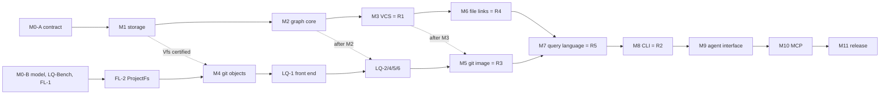

# 13. Дорожная карта M0–M11, календарь и риски

## 13.1 Принцип: каждый компонент строится один раз, в порядке зависимостей

Дорожная карта опирается на два решения, которые вы приняли 2026-09-26 (здесь они даны обратным переводом с английской цитаты в источнике): «Нет, SQLite не используем — сразу строим свой [движок]» и «"Чтобы можно было начать пользоваться как можно раньше" — не важно, надо сразу делать правильно». [60 §1.2] выводит из них правила P1–P10. Для согласования важны следующие:

| Правило | Суть | Что это значит на практике |
|---|---|---|
| P1 — одна реализация на задачу | трейт допускается только на шве, у которого есть тестовый двойник (`Vfs`, `ProjectFs`, `View`, `Store` API), и никогда не служит точкой подмены между двумя продуктовыми реализациями | нет трейта движка, нет `ImageBackend`, нет «временного бэкенда» |
| P2 — сначала финальная спецификация | компонент стартует, когда готовы его спецификация, решения владельца и измерения, которые его формируют; решение нужно принять до первой вехи, которую оно может изменить | эталонная модель несёт все логические правила с M0, поэтому почти все решения нужны до M0 |
| P3 — гейты раньше зависимых | полный набор гейтов проходит до старта компонентов, которые на нём строятся; гейт, ставший обязательным, остаётся обязательным при любом последующем изменении | каталог GT1–GT20 с вехой, начиная с которой гейт обязателен |
| P4 — формат замораживается на выходе M0 | все байтовые раскладки, включая резервы, модель сбоев `Vfs` и параметры хранилища | ни одна веха не мигрирует данные. Изменение формата после M0 считается дефектом спецификации: M0 переоткрывается, все пройденные вехи заново прогоняют свои гейты, а до-релизные хранилища пересоздаются, а не мигрируют |
| P5 — эталонная модель идёт первой | модель пишется целиком в M0; фича без аналога в модели не проходит гейт | расхождение модели и движка разбирается как находка в спецификации |
| P6 — измерения на вашей машине по замороженному протоколу | каждый критерий выхода, касающийся времени, памяти или поведения Windows, измеряется на вашем ноутбуке по протоколу, замороженному в M0, без нагрузки и под воспроизведённой нагрузкой 16 агентов | измерения идут в согласованных окнах, которые никогда не пересекаются с окнами ваших бенчмарков; ночные регрессионные прогоны идут на том же ноутбуке в выделенных вами окнах без агентов |
| P8 — сокращение объёма решает только владелец | реакция на сроки не может убрать гарантию | «заранее согласованного списка сокращений» нет |
| P10 — сертифицированная веха только расширяется | поведение добавляется только через точку расширения, сертифицированную раньше | M2, M3, M5, M6 и M7 проходят повторную сертификацию (re-certification) предыдущих вех |

Точек расширения пять. Все они — таблицы внутри одной реализации:

- реестр производителей секций и свёрток записей (M1);
- таблица валидаторов (M2–M3);
- таблица правил слияния (M3);
- реестр отношений и встроенных функций (M7);
- реестр именованных запросов (M7).

M1 сертифицирует реестр ещё до появления поздней семантики. Для этого постоянная тестовая инфраструктура — обобщённые физические производители — наполняет каждую зарезервированную секцию и каждый вид записи синтетическими данными. Позже вехи регистрируют настоящих производителей и заново прогоняют побайтовую пересборку, бюджеты M1 и гейты сбоев.

Отвергнутые альтернативы ([60 §7.3]):

- **Oracle-first-план** на SQLite давал первое использование через 5–7 недель, но бэкенд выбрасывался на этапе S6.
- **Adoption-driven-черновик [60d]** давал первое использование через 6,5–10 недель ценой режима сериализованного доступа и лимита узлов.
- **Issue 1 плана [60]** оценивался в 196–262 units с заглушками вместо R4/R5; его ревью [61] нашло 2 blocker и 9 major.

Текущий план крупнее: 369–508,5 units. Ни одна добавка в нём не промежуточный этап, и ни одну нельзя убрать, не потеряв гарантию (P8). Units — единицы трудоёмкости из [22 §7.1], где предложение A = 100. Цена такого подхода — позднее первое использование (риск 3 в таблице §13.7). Её компенсируют проверкой на записанных данных, а не ранним внедрением.

Часть прироста объёма объясняется тем, что всё, что старый план откладывал, теперь входит в релиз ([60 §1.3]):

- promotion веток `seg.b*` + `TOUCH` (M1 — физика, M3 — политика);
- рукописный слой git-объектов с вычислением предков внутри процесса вместо spawn `git merge-base` (M4);
- `op log`/`op restore` и рекурсивная виртуальная база слияния (M3);
- FTS уровня 2 и миграции усиления схемы (M2);
- образы SHA-256 и bundles (M4/M5);
- `--with-oplog` и правила импорта между хранилищами (M5).

По решению, а не из-за сроков, не строятся:

- `rebase --onto` (#5);
- назначения образа tracked-directory и orphan-branch;
- лидер и `watch` (если M0 не потребует лидера; порог — в §13.3);
- класс полей `shared` (#1);
- HTTP MCP, запись reftable и сетевой транспорт без git;
- живые писатели с разных машин (#11);
- embeddings;
- tree-sitter в продукте (#22);
- реализации Linux/macOS (фаза портов вне календаря);
- стенд OS-crash для Windows (GT15 и его калибровка): по вашему решению от 2026-09-27 (В7) перенесён в ту же фазу после релиза, спецификация и все замораживаемые поля сохраняются;
- исключения R4 ([40 §1.4]) и LQ ([50 §1.3]).

Четыре исключения имеют измеримый триггер пересмотра, и их резервы сохранены:

- E2 — USN-журнал как доказательство для R4 (триггер: привязанное дерево на томе с журналом, который живёт дольше медианного интервала settle);
- move nudge в `PreToolUse` (триггер: доля сырых `mv` связанных файлов выше измеренной после выпуска карточки skill);
- дельта-хук `PostToolBatch` (триггер: доля конфликтов guard, которые предотвратила бы дельта посреди хода);
- назначение образа `refs/moirai/*` в проектном репозитории (триггер: решение #16 включит project remote или изменится #11).

Исключения, не привязанные к отдельному решению (назначения образа, HTTP MCP, запись reftable, сетевой транспорт без git, E2, nudge и `PostToolBatch`), не строятся по решению #41. `rebase --onto` исключён решением #5.

_Источники: AR §2.13, §9; [60 §0, §1.1–§1.3, §2.6, §7.3]_

## 13.2 Граф зависимостей, критический путь и две линии (lane)

Компоненты C0–C11 соответствуют вехам M0–M11. Порядок задают технические зависимости:

- **C1 → C2.** Операции графа применяются через оверлей и запечатываются в столбцы сегментов. Содержимое секций производит C2 и более поздние компоненты, поэтому C1 выставляет сертифицированный реестр, а не зашивает секции.
- **C1 → C3.** Refs, пины, promotion и построение представлений — это механика хранилища, поэтому они попадают в симуляцию и kill-циклы M1.
- **C1 → C4.** Слою git-объектов нужен только сертифицированный `Vfs`, поэтому M4 может стартовать от точки сертификации `Vfs` внутри M1.
- **C1–C4 → C6.** Tree-гейт R4 не имеет другого источника предков на ежедневном пути.
- **C2, C3, C4, C5, C6 → C7.** Биндер читает схему как данные. `USE`, history-отношения и `RESOLVE` являются объектами VCS. Built-ins ссылок вызывают резолвер C6.
- **C7 → C8.** Глаголы CLI — это именованные запросы и мутации.
- **C5–C8 → C9.** Паки показывают ссылки и выполняют settle (C6). Brief и паки — именованные запросы (C7). Хук после слияния вызывает экспорт (C5). Хуки — это вызовы CLI (C8).
- **C7, C9 → C10.** MCP-инструменты `query` и `write(TX)` опираются на C7, инструменты `brief`/`pack` и stamp-хук — на C9.

От предложенного порядка (формат → хранилище → граф → ядро языка → CLI → VCS → образ → файловые ссылки → агентный интерфейс → MCP) план отходит в шести местах, каждый раз на основании доказательств ([60 §2.4]):

1. VCS идёт раньше языка запросов и CLI: язык включает ревизии и history-отношения.
2. Слой git-объектов стал отдельной вехой M4. У него три потребителя: образ, `check`/`stale` и tree-гейт R4. Путь «сначала `git fast-import`, потом рукописный слой за трейтом» был бы выбрасываемым этапом.
3. Физическая половина ветвления (refs, пины, promotion, GC) перенесена в M1.
4. Образ (M5) идёт сразу после VCS и M4, до языка и CLI. Гейт 0 рано доказывает каноническую форму.
5. R4 разнесён по вехам, которые его несут: FL-0/FL-1 в M0, FL-3 в M2, FL-7 в M3, FL-8 в M5, FL-2/FL-4 в M6, FL-6 в M7, FL-5 в M8, FL-9 в M9/M10. Одна поздняя веха R4 была бы вынуждена менять пять уже сертифицированных вех [61 B1].
6. Всё, что может изменить замораживаемые байты (LQ-Bench, replay-корпуса R4, величины триггеров T1/T2, таблица носителей гейта 0), собирается в M0.

Отдельно зафиксировано, почему M9 идёт раньше M10, хотя в брифе порядок CLI → MCP → skills. Инструменты `pack`/`brief` MCP-сервера и его `mcp_tool`-обработчики обслуживают логику M9. MCP, построенный первым, потребовал бы заглушек, то есть промежуточного этапа.

Критический путь при двух линиях ([60 §1.4]):

Линия A ведёт цепочку «контракт → хранилище → граф → VCS → файловый рантайм». Линия B последовательно проходит эталонную модель, LQ-Bench и FL-1 часть 2. Затем она берёт FL-2, M4 (от точки сертификации `Vfs` в M1), фронтенд языка (LQ-1, в любой момент), биндер, ядро исполнителя, графовые операторы и планировщик (LQ-2/4/5/6, после M2), а после M3 и M4 — образ. Остаток M7, M8 и M9 обе линии делят между собой. Начиная с M0 параллельно идёт тестовый поток: симулятор модели сбоев, перечисление сбоев, kill-циклы, фаззеры, мутационное тестирование, эталонная модель и дифференциальный стенд. OS-crash-цикл (GT15) по вашему решению от 2026-09-27 (В7) идёт только после релиза. Если линия одна, вехи идут строго по порядку: M0, M1, …, M11.

_Источники: AR §9; [60 §1.4, §2.1–§2.4, §7.1]_

## 13.3 M0 — «Контракт и доказательства» (подробно)

**Размер** (оценка, со всеми дельтами [60 §7.1]): 68,5–95,5 units. Это 8,5–19 недель при одной линии или 4,5–10,5 недели при двух, плюс окна выхода профиля L. По календарю записи (две линии, профиль L) выход M0 приходится на 5–11 недель, P50 ≈ 7,5, P90 ≈ 9.

### Условие входа и его статус

[60 §3.1] после ваших ответов 2026-09-27 требует для входа в M0:

- [40] переработан по ответам [41] (blocker B1–B4 и изменения резервов из [41 §5]);
- [50] прошёл независимое ревью, его edit-листы для [AR] и [60] согласованы;
- решение #32 принято;
- приняты все решения, которые нужны до M0, включая #34. Профиль L нужен уже на входе, потому что обеспечение инфраструктуры (пункт 7) начинается сразу;
- AR вместе с нормативными [40], [50], [60], [80] и [90] утверждена вами как спецификация M0 (А4);
- окна сборки двух линий согласованы с вами на старте M0 (А8; сами окна ещё не назначены).

Статус на 2026-09-27: [40] rev 2 отвечает на [41], [50] rev 2 отвечает на [51], edit-листы применены при интеграции, спецификация утверждена (А4). Повторное ревью ревизий 2 условием входа больше не является: оно проходит внутри пункта 8 (А1).

> ✅ **Решено вами 2026-09-27 (А1 раздела 15, вариант (a), как рекомендовано):** M0 стартует без отдельного шага повторного ревью. Повторное ревью [40] rev 2 и [50] rev 2 входит в независимое ревью спецификации M0 (пункт 8) и должно закрыться без открытых blocker и major до заморозки формата; резервы R4/R5 замораживаются только на выходе M0, поэтому ревью всё равно проходит до заморозки. Вход M0 в [60 §3.1], риск 4 [60] и риск 18 AR приведены к этому решению.

### Что замораживается на выходе M0 (формат v1)

На выходе M0 замораживаются ([60 §2.5]; подробности в разделах о хранилище):

- `LOCK` v1 (X-F1);
- `HEAD`: два слота по 4 KiB, `durable_lsn`, `boot_id`, `config_gen`;
- журнал: `RecHdr` 32 B, трейлер цепочки `group_end`, все виды записей;
- тело коммита, операции и кодировки значений, каноническая форма (пункты 1–10);
- сегменты со всеми секциями, схема как данные, формат образа v1;
- раскладка хранилища и синтаксис конфигурации — **но не набор ключей**: ключи остаются конфигурацией с дефолтами;
- модель сбоев `Vfs`; протокольные решения (a)–(m): (a)–(f) из [60 §2.5], (g)–(i) из аудитов, (j)–(m) для портов, где (m) — политика mapping и environment guard с проверкой сбоями; параметры хранилища вместе с тестовым профилем, таблица носителей гейта 0, семантика производного состояния;
- резервы R4 (R-1…R-18), R5 (F1–F18), кросс-платформенные X-F1–X-F12 и резервы [90 §10.1];
- кодек, который выберет измерение 6.

Читатели отказываются открывать более новую версию формата, автоматической миграции нет.

### Объём M0: пункты 1–12

| № | Линия | Что делается | Результат |
|---|---|---|---|
| 1 | A | **Спецификация формата v1** на уровне байтов по всем строкам [60 §2.5]: модель сбоев `Vfs`, протокольные решения, параметры хранилища, таблица носителей гейта 0. Золотые фикстуры **пишутся вручную в hex** по тексту спецификации автором, который не пишет ни оракул формата, ни продуктовый кодек. Сюда же входят ABNF `.moi` v1 с золотыми файлами (включая файловые узлы, anchor-строки, именованные запросы), дополнение о рекурсивной виртуальной базе и спецификация OS-слоя для трёх ОС ([80 §2], X-F1–X-F12) | замороженный контракт и фикстуры, по которым в M1 пишется единственный продуктовый кодек |
| 2 | A | Логический **`Store` API**: типизированные команды и результаты в форме `--json v1`, снимок `state(ref)`, инжектируемые детерминированные часы | общий интерфейс движка и модели |
| 3 | A | **Шов `Vfs`** (классы долговечности, `sync_dir`, `sync_group`, `rename_replace`, `swap_dirs`, `LockBytes` с flush-байтом, `map_sealed`, проверка окружения — environment guard) и его in-memory-реализация, соблюдающая модель сбоев. **Перечислитель сбоев**: каждое подмножество несброшенных секторов, пока их ≤ 12; ≥ 10⁴ случайных подмножеств сверх этого; оба слота `HEAD` исчерпывающе; последовательности «сбой flush → ещё коммиты → крах»; несколько ожидающих групп. Скелет Windows-реализации | основа GT1 |
| 4 | A | **Валидация тестовой обвязки (harness validation)**: перечислитель на игрушечном журнале должен найти **≥ 12 внесённых (seeded) протокольных ошибок** и 13 ошибок группового коммита из [80 §2.4.4]. Среди них: гонка класса SQLite WAL-reset, рваный перенос ref (N3), читатель за `committed_lsn`, принятие записи повторным flush после сбоя, удаление файла до долговечного барьера `HEAD` | доказательство, что стенд вообще способен находить ошибки: «стенд, который ничего не находит, ничего не доказывает» |
| 5 | A | **Измерения 1–22** ([60 §5.2]; измерение 17, калибровка стенда, отложено вместе со стендом до после релиза, В7) под протоколом измерений, который M0 пишет и замораживает. Также layout-пробы и фикстура нагрузки 16 агентов. В пункт 7 измерений входят Codex-пробы P1–P7, P10, P11 с тестовым stub-сервером | числа, которые принимают решения (см. ниже) |
| 6 | A | **FL-1, часть 1** (продуктовый код в финальной спецификации): правила путей и регистра, нормализация EOL и `oid`, захват и разрешение якорей, бит-параллельный матчер Майерса, histogram line diff (общий с diff3 в M3), scope-сканеры Rust/Markdown/TOML, gitignore-матчер | первая часть продукта R4 |
| 7 | A | **Инфраструктура профиля L** — см. следующий подраздел | репозиторий, CI, ночные задания |
| 8 | A | **Независимое ревью спецификации** тремя линзами [20]–[22]: формат, модель сбоев и протокольные решения, замороженная поверхность запросов, резервы R4; включает повторное ревью [40] rev 2 и [50] rev 2 (А1) | условие выхода |
| 9 | B | **Эталонная модель целиком**: семантика графа, производное состояние, VCS со слияниями и рекурсивной базой, маркеры, аренды (lease), идемпотентность, схема, ролевая политика записи. Для R4 — намерение ссылки с разрешением по точным доказательствам и перебором якорей. **Свои парсер, биндер и nested-loop-вычислитель LQ, независимый кодировщик канонической формы и оракул формата.** Около 8–10 тыс. строк (оценка), 16–20 units | оракул для всех дифференциальных гейтов |
| 10 | B | **LQ-Bench** (GT13): генератор фикстурного хранилища на модели, 150 задач × 3 формулировки, около 30 вопросов из реальных сессий и 40 адверсариальных, всего 520 промптов. Прогон **только на Opus 5.5** (#38 (a)) на собственных парсере, binder и вычислителе модели (LQ-3, п. 9; LQ-1 и LQ-2 остаются в M7 — решение А6). Полные 520 идут на базовую линию, абляции D8 и D11, две альтернативные поверхности и абляцию отображаемого написания. Стратифицированная половина (260) идёт на прочие абляции, включая BM25 против скорера без статистики (решает судьбу `DOCLEN` в формате v1). Транспортная страта — по 20 literal-промптов в Claude Code и в скриптовом generic stdio-клиенте, обе на Opus 5.5; её гейт — 0 транспортных сбоев. Floor-уровня и Codex-арма нет. Около 53 млн токенов, в основном кэшированный вход, плюс ≈ 1 млн на повтор выборки из 52 промптов — ещё без накладных расходов самого Claude Code (его системный промпт и определения инструментов в каждом вызове), которые измеряет первое окно M0 перед перевыпуском плана квоты, — **через вашу подписку Claude Code в headless-режиме, без API-биллинга и API-ключа** (В1); прогон разносится на несколько окон внутри M0 в пределах недельных лимитов | заморозка грамматики, текстов ошибок и карточки |
| 11 | B | **FL-1, часть 2**: скетчи, token winnowing, similarity и containment. Это та половина, которую модель не проверяет | вторая часть FL-1 |
| 12 | B | **Replay-корпуса** [40 §8.3.4] на FL-1: пять целей FL-1 из критериев выхода; три корпуса, зависящие от резолвера (34 случая delete-then-re-add, 46 HEAD worktree, перепись транскриптов), здесь готовятся, а гейтуют впервые в M6 (А7). Только чтение ваших репозиториев; git CLI используется как тестовый источник данных | валидация R4 на реальных данных |

> ✅ **Решено вами 2026-09-27 (А6 раздела 15, вариант (a)):** LQ-Bench на M0 проверяет собственные парсер и биндер эталонной модели (LQ-3). Продуктовые LQ-1 и LQ-2 остаются в M7 и должны воспроизвести замороженные тексты ошибок и линты. [50 §7.4] п. 3 и строка LQ-Bench в [50 §8.2] приведены к этому.

### Пункт 7: инфраструктура профиля L

- **Репозиторий** публичный, `github.com/bluesteelll/moirai` (#36). Каждый коммит авторизован владельцем, без соавтора-ИИ. Атрибуция харнесса выключена в закоммиченной конфигурации `.claude/settings.json` (одобрено вами 2026-09-27, А2); до установки проверок этого пункта вы просматриваете каждое сообщение коммита. `commit-msg`-проверка в локальном pre-merge-гейте и проверка в PR CI отклоняют трейлер `Co-Authored-By:` с ИИ и строку «Generated with Claude Code».
- **Hosted GitHub Actions Windows runners** (бесплатны для публичного репозитория) выполняют только синтетические проверки: сборку, линты GT20 (a, b, d), кросс-таргетную проверку типов GT20 (e), unit-, property- и дифференциальные наборы с короткими seed. Гейты времени, RAM, floor, сбоев и kill-циклов там не запускаются: образы раннеров — Windows Server, а не гейтуемый профиль Windows 11 + Defender. В CI нет ни ключа API модели (его нет вообще, В1), ни данных владельца.
- **Данные владельца** (replay-корпуса, промпты реальных сессий, инциденты, HDR, фикстура нагрузки) лежат только в gitignored-каталоге на ноутбуке (#37). Pre-commit-проверка отклоняет его пути и файлы, чьи хэши есть в манифесте. Опубликованное дерево вы просмотрели и 2026-09-27 признали приемлемым (А3).
- **Ноутбук** (Ryzen 9 5900HS, 8C/16T, 16 GB, NVMe без PLP, Defender включён) выполняет ночные задания в выделенных вами окнах без агентов: около 5 в неделю, начиная с выхода M1; число окон в неделю — записываемый параметр. На нём же идут все измерения времени, RAM и floor, а также GT4 и GT17. Здесь же, в окнах внутри M0, идёт LQ-Bench через подписку Claude Code (В1).
- **Стенд OS-сбоев в M0 не разворачивается.** По вашему решению от 2026-09-27 (В7: «Пока нет возможности это установить, настолько глубокий тест откладываем до релиза, так же как и mac с linux») он отложен до после релиза вместе с фазой портов. Отложены: гость Windows Server 2025 Core в ознакомительной редакции в VirtualBox 7 с VMware Workstation Pro для перекрёстной проверки, калибровка измерением 17, вопрос лицензии гостя и выбор состояния WSL2 и Memory Integrity. Спецификация GT15 сохраняется, и все поля формата и правила протокола, которые проверял бы стенд, замораживаются как прежде. VHDX, который настраиваете вы (В8), нужен измерениям 18 и 22 и учению RG7, а не стенду, поэтому остаётся.
- `rustup target add` для `x86_64-unknown-linux-musl`, `aarch64-unknown-linux-musl`, `aarch64-apple-darwin`. Ничего в M0–M11 не собирает, не запускает и не тестирует бинарники Linux/macOS.

> ✅ **Решено вами 2026-09-27 (А2, А3 раздела 15):** конфигурация харнесса с выключенной атрибуцией закоммичена в репозиторий (`.claude/settings.json`), как требует AR:63, до первых коммитов агентов; до установки `commit-msg`-проверки пунктом 7 вы просматриваете каждое сообщение коммита. Опубликованное дерево вы просмотрели и признали приемлемым. AR:63, риск 41 и [60 §3.1] п. 7 приведены к этому. (Нумерация: AR называет этот пункт «[60 §3.1] item 7», а «M0 item N» везде означает измерение N из §8.2.)

### Измерения 1–22 и что каждое решает

| № | Измеряется | Решает |
|---|---|---|
| 1 | open → append → flush → close журнала 64 MiB под Defender | нужен ли лидер в M1 |
| 2 | групповой коммит при 16 писателях: p50/p99, flush на пачку, передача flush-байта | границы 2 s (`lock.writer-wait-ms`, `lock.flush-wait-ms`); лидер |
| 3 | построение оверлея в зависимости от возраста ветки (1k–60k коммитов, 50 писателей); 14-дневная daily-sync-фикстура | пороги G15/G16; `store.promotion.overlay-ops` |
| 4–5 | байты `sync` в день; число пинов и диск при 50 ветках | размеры G17; политика пинов и GC |
| 6 | кодек из pure-Rust-вариантов (`lz4_flex` ± словарь, `ruzstd`, прокси собственного энкодера); байты на токен | кодек, словарь, конверсии токен-гейтов |
| 7 | git в PATH, exec-form hooks, `${CLAUDE_PLUGIN_DATA}`, срабатывание хуков для Workflow `agent()`, эксперимент `mcp_tool`, лимиты Bash; Codex-пробы P1–P7, P10, P11 | маршрут stamp (Workflow-эксперимент повторяется в M9, эксперимент `mcp_tool` — в M10); `integrate.codex.store-writes` |
| 8–9 | loose-объекты под Defender, `git gc`; throughput deflate (`zlib-rs` против `miniz_oxide`) | порог loose/pack; кодек git-слоя |
| 10 | replay полного хвоста при разных порогах чекпоинта | пороги чекпоинта, при которых open на 1e6 ≤ 3 ms |
| 11 | **физические floors**: flush, directory flush, map, spawn-to-exit (подписанный и неподписанный), VMMap | floors для относительных гейтов; #39 (подпись) |
| 12 | задержка освобождения lock после `TerminateProcess` | граница 2 s; параметры инъекций GT3/GT4 |
| 13 | BLAKE3 (`pure`) и xxh3 | бюджеты хэширования |
| 14 | layout-пробы и величины триггеров T1/T2 | раскладки §2.5; структура T1 (вариант A или B); лидер |
| 15 | стоимость ФС для R4 (stat, перечисление, переименования) | бюджеты R4 |
| 16 | запись и валидация фикстуры нагрузки 16 агентов; полосы шума | «нагруженные» измерения; шум CI |
| 17 | калибровка стенда OS-сбоев (≥ 100 жёстких выключений) — **отложена до после релиза** вместе со стендом (В7) | способен ли GT15 видеть потерю несброшенных данных; можно ли убрать `MOVEFILE_WRITE_THROUGH` (до тех пор он используется) |
| 18 | инъекция сбоя flush на VHDX | параметры пункта (3) модели сбоев |
| 19 | runtime MCP (rmcp против синхронного цикла) | фронтенд MCP (≤ baseline + 2 MB, ≤ 2 потока) |
| 20 | токен-baseline ≥ 20 записанных диспетчеризаций | токен-гейты M9 |
| 21 | пиковая RAM/CPU одной и двух линий сборки | лимит сборки и окна; пауза линии B |
| 22 | conformance-пробы OS-слоя Windows, `BootId` | источник идентичности загрузки (иначе Unknown-boot mode) |

**Решается на выходе M0 измерениями и бенчмарком, без вас:**

- лидер (измерения 1–2): он строится в M1, только если стоимость close под Defender делает коммит CLI дольше 20 ms или p99 ожидания при 16 писателях превышает 50 ms при G1 и групповом коммите ([60 §1.3]); для корректности лидер не нужен никогда. Структура T1 (14);
- кодек из pure-Rust-вариантов, сжатие со словарём и его форма, место сжатия тел (6); кодек deflate (9);
- граница ожидания lock (2, 12);
- производственные значения всех параметров хранилища. Порог чекпоинта подбирается под бюджет open ≤ 3 ms на 1e6; дефолт 4 096 op / 4 MiB оценён в 3–5 ms и при необходимости понижается (10);
- G15/G16 и `store.promotion.overlay-ops` (3); порог loose/pack (8);
- грамматика, тексты ошибок, карточка и написание (GT13); BM25 или скорер без статистики;
- константы резолвера R-14 и раскладка якорей (replay-корпуса);
- форма MCP-runtime (19), маршрут stamp (7), дефолт `integrate.codex.store-writes` (P7).

**Не строится в M0:** движок и продуктовый код, кроме FL-1. Кодек M0 — это только тестовый оракул формата. Продуктовый кодек пишется один раз, в M1.

### Критерии выхода M0

- Ревью спецификации, включая повторное ревью [40] rev 2 и [50] rev 2 (А1), закрыто с нулём открытых blocker/major до заморозки формата. Вы **подписали таблицы правил модели**: таблицу слияния, машины состояний, матрицу политик удаления, правила слияния ссылок, классы паков, определение I26′. Вы также **проверили ядро фикстур GT10**: инциденты реестра, таблицу node-40, walk-through [AR §7.6].
- Спецификация OS-слоя для трёх ОС прошла ревью с нулём blocker/major. Измерение 22 проверило источник идентичности загрузки Windows (иначе используется Unknown-boot mode).
- Оракул формата декодирует каждую рукописную hex-фикстуру и побайтово кодирует её обратно. Канонический кодировщик модели воспроизводит каждый commit id.
- Перечисление на игрушечном журнале находит все внесённые ошибки, включая оба сценария [61 B2]. Модель проходит свой набор фикстур.
- **GT13** на LQ-3 выполнен по нормативному списку AR §7.7.5 и [50 §7.4] п. 6 (А6): точность ≥ 85 % с первой попытки и ≥ 95 % после одного повтора на literal- и short-формулировках и на real-session-страте; confident-wrong ≤ 2 % на чтениях, ≤ 5 % на каждую конструкцию и 0 на записях; named-query ≥ 80 %, где такой запрос есть; ни одна страта не ниже 75 % после повтора; 0 транспортных сбоев в транспортной страте; карточка ≤ 1 000 токенов. Гейта «в пределах 5 пунктов от лучшего кандидата» нет: альтернативные поверхности — абляции. До заморозки проваленный гейт может изменить карточку, тексты ошибок, линты, built-ins, таблицу совместимости или семантику, но не сам бенчмарк.
- **FL-1** достигает пяти replay-целей M0 (А7; три цели, зависящие от резолвера, — критерии выхода M6): каждое точное переименование (186 из 201 переименования в истории git) перепривязано, ни одного ошибочного; ≥ 96 % из выборки 1 180 цитат разрешены без тихих ошибок; tie-break совпадает с полным diff в ≥ 99 % случаев; `links mentions` находит все 188 ссылок на перемещённые файлы; перепривязаны 58 мёртвых путей памяти с однозначной цепочкой переименований (в M0 цепочки берутся из тестовой выгрузки истории через git CLI, пункт 12, и перепривязываются через FL-1 и точное разрешение модели; E6 продукта повторяет эту цель в M6); scope-сканер Rust совпадает с tree-sitter-rust на ≥ 99,5 %. Парсеры FL-1 выдержали 24 ч фаззинга, GT16 убивает ≥ 90 % мутантов.
- Измерения 1–16 и 18–22 записаны без нагрузки и под нагрузкой (измерение 17 отложено вместе со стендом, В7). Реестр конфигурации специфицирован.
- Инфраструктура работает: CI зелёный, ночные задания укладываются в окна, проверки авторства и локального корпуса отклоняют свои внесённые нарушения, модель укладывается в ≤ 512 MB на случай. Измерение 21 задало лимит сборки двух линий (или показало, что линию B нужно поставить на паузу).
- **Скорость (velocity) измерена, календарь переиздан.**

> ✅ **Решено вами 2026-09-27 (А6, А7 раздела 15):** критерии выхода M0 в [60 §3.1] приведены к источникам. Гейты LQ-Bench — нормативный список AR §7.7.5 и [50 §7.4] п. 6 (с линтами и семантикой среди допустимых исправлений, ≤ 5 % confident-wrong на конструкцию, стратой реальных сессий и карточкой ≤ 1 000 токенов, без гейта «в пределах 5 пунктов»). Критерий FL-1 — пять целей реплея M0; три цели, опирающиеся на рантайм FL-4 и tree-гейт (`replaced` для 34 событий delete-then-re-add, решения гейта на 46 головах worktree, edited+moved в переписи транскриптов), гейтуют выход M6.

### Гейты, обязательные с M0; размер

Гейты: GT10 (фикстуры для того, что уже есть); валидация стенда внесёнными ошибками; GT13; GT5 и GT16 на FL-1; GT20 (b) — lint зависимостей `Cargo.lock` с pure-Rust-правилом; GT20 (e) — кросс-таргетная проверка типов; GT18 на модели, включая оракул состояния I26′.

Размер по базе до аудитов:

- линия A — 28–38 units: спецификация и фикстуры 7–9, симулятор и перечислитель 5–7, измерения 2–3, инфраструктура 2–3, ревью 1–2, FL-1 ч. 1 11–14;
- линия B — 27–36 units: модель 16–20, LQ-Bench 3–5, FL-1 ч. 2 8–11;
- дельты: аудиты +4–6,5, кросс-платформенный дизайн +5,5–8,5, [90] +4–6,5.

Разворачивание и калибровка стенда OS-crash, отложенные по В7, остаются в этих цифрах запасом до переиздания календаря на выходе M0.

> ✅ **На согласование (ресурсы В2 и В3 раздела 15, ответа ещё нет):** ваша нагрузка в M0 (оценка):
> - ревью спецификации — 8–16 ч;
> - подписи таблиц правил — 15–25 ч (в M0 полностью, затем 1–2 ч на каждом выходе, где меняется таблица);
> - ядро фикстур GT10 и выборка золотых ответов LQ-Bench — 10–20 ч;
> - профиль L и публичный репозиторий — часть из 3–7 ч за проект: выделение окон и заморозок, ваша настройка VHDX для измерений 18 и 22 и drill заполнения диска (RG7); просмотр опубликованного дерева уже сделан (А3);
> - обзор скорости и переиздание календаря на выходе M0 — часть из 2–4 ч (вторая часть — на выходе M1).
>
> Всего за проект около 50–95 ч (§13.6). Без ваших подписей и проверки фикстур M0 не завершится.

> ✅ **Решено вами 2026-09-27 (В1 раздела 15):** «Не буду покупать по api доступен только claude code по подписке». Бюджет вызовов модели — квота вашей подписки Claude Code, а не деньги: около 53 млн токенов на LQ-Bench в M0 (в основном кэшированный вход; плюс ≈ 1 млн на повтор выборки; без накладных расходов самого Claude Code, которые измеряет первое окно M0; прейскурант ≈ $280, диапазон $160–540, только ориентир), около 5 млн на перезапуск при изменении поверхности (M7, M8, M10), около 13 млн перед релизом. Раннер — Claude Code в headless-режиме (`claude -p`); при каждом результате записывается, что это меняет: системный промпт харнесса присутствует, сэмплинг не управляется, токены — по отчёту Claude Code, версия Claude Code закреплена и записана, один раннер на все армы. Если квоты не хватит, набор промптов сокращается по документированному правилу [50 §7.4] п. 5 с указанием статистической мощности, но ни один гейт не пропускается. Реальные промпты сессий уходят только в Anthropic.

_Источники: AR binding inputs (ответы 2026-09-27), §9, §7.7.5–§7.7.6; [60 §1.3, §2.5, §3.1, §3.13, §3.15, §4, §5.2]; [40 §8.3.4]; [50 §7.4]; [90 §8.3]_

## 13.4 Вехи M1–M11: объём, размер, выход, гейты

Размеры и недели указаны по одной линии (оценка, units/(5–8 в неделю), со всеми дельтами [60 §7.1]).

| Веха | Требование | Units | Недели | Линия |
|---|---|---|---|---|
| M1 Хранилище | — | 56–74 | 7–15 | A |
| M2 Ядро графа | — | 31,5–41,5 | 4–8,5 | A |
| M3 Управление версиями | **R1** | 38–45,5 | 5–9 | A |
| M4 Слой git-объектов | (R3, R4, `check`/`stale`) | 15,5–22 | 2–4,5 | B, от точки сертификации `Vfs` в M1 |
| M5 git-образ | **R3** | 17,5–22,5 | 2–4,5 | B, после M3 и M4 |
| M6 Рантайм файловых ссылок | **R4** | 31–44 | 4–9 | A (FL-2 в B от выхода M0) |
| M7 Язык запросов | **R5** | 51–72,5 | 6,5–14,5 | обе (LQ-1 в B от выхода M0; LQ-2/4/5/6 от выхода M2) |
| M8 CLI | **R2** | 17–25 | 2–5 | обе |
| M9 Агентный интерфейс | — | 17,5–26 | 2–5 | обе |
| M10 MCP | — | 12,5–16 | 1,5–3 | — |
| M11 Релизное укрепление | релиз | 13–24 | 4–7,5 (4–8,5 в профиле L) | — |

**Размеры R4 и R5** — двух крупнейших требований (оценка по базе до аудитов, около 3 units на 1 тыс. строк продукта вместе с тестами; AR §9):

- **R4 ≈ 68–93 units** (≈ 22–30 тыс. строк продукта и 10–14 тыс. строк тестов, [40 §8.1]): FL-1 19–25 в M0, FL-3 6–9 в M2, FL-7 3–4,5 в M3, FL-8 2,5–3,5 в M5, вся M6 29–39, FL-6 ≈ 1,5 в M7, FL-5 3–4,5 в M8, FL-9 и `links import` 3–5 в M9, MCP-операции ≈ 1 в M10.
- **R5 ≈ 56–83 units** (≈ 15–21,5 тыс. строк в M7 и ≈ 2,5–4 тыс. в других вехах, [50 §8.2]): LQ-Bench 3–5 в M0 (плюс собственные парсер и вычислитель LQ модели внутри её 16–20), производители 2–3 в M2–M3, M7 без FL-6 48–68,5, LQ-8 2–3 в M8, LQ-12 0,5–1 в M9, инструменты `query`/`TX` 1–2 в M10.

Дельты [60 §7.1] доводят M6 до 31–44 units, а M7 — до 51–72,5.

**M1 — хранилище.** Состав:

- Windows-реализация OS-слоя (`LockFileEx` на байтах `LOCK` v1, классы долговечности, mapping запечатанных файлов, окружение: NTFS разрешена; ReFS, сеть, UNC, FAT/exFAT и OneDrive отклоняются). **Точка сертификации `Vfs`** открывает старт M4.
- Продуктовый кодек.
- Многопроцессный протокол: трёхфазная запись, групповой коммит без лидера, восстановление с протокольными решениями (a)–(i).
- Физическая машинерия веток и реестр секций.
- GC с двухслотовым барьером `HEAD`.
- `backup`/`restore`/`repair --rebuild-from-log`.
- Лидер — только если его потребует M0.

Выход:

- долговечный коммит p50 ≤ floor + 0,5 ms при ≤ 1 flush на коммит (≤ 3 на пачку 16 писателей);
- open ≤ 1,5/3 ms на 1e5/1e6 с полным хвостом;
- первое чтение ветки, ответвлённой 1k/7k/14k/60k коммитов назад, ≤ 3/10/10/20 ms; 14-дневная daily-sync-фикстура ≤ 10 ms при оверлее ≤ 1 MiB;
- writer-wait p99 ≤ 50 ms;
- RSS короткоживущего процесса ≤ 4 MB; ноль CPU у простаивающего читателя;
- `repair --rebuild-from-log` побайтово воспроизводит сегменты, включая все зарезервированные секции;
- все внесённые протокольные ошибки пойманы;
- commit id совпадают с моделью.

**GT15 больше не критерий выхода M1.** По вашему решению от 2026-09-27 (В7) цикл OS-сбоев с ≥ 1 000 циклами отложен до после релиза. Краш-безопасность на выходе M1 держится на переборе точек краша GT1 (со свежестью чтения в каждом состоянии после краша), GT3, GT4, подтверждении только после покрывающего flush с проверкой идентичности и `backup`/`restore`; реальная потеря питания — явный остаточный риск (риск 17 AR).

С этой вехи обязательны:

- GT1 по модели сбоев;
- GT2 на уровне хранилища: ≥ 1e6 физических операций против представления хранилища в модели, commit id включены; дальше GT2 расширяется на каждой вехе;
- GT3 (≥ 1e6 шагов);
- GT4 (три варианта);
- GT5 — фаззеры записей, `HEAD` и сегментов, по 24 ч без находок;
- GT20 (a, b, d).

GT15 — после релиза (В7). Units обвязки GT15 (2–3 в M1) остаются в цифрах запасом до переиздания календаря на выходе M0.

GT16 по крейтам хранилища идёт как отчётный (гейтуют внесённые ошибки); проверяются строки GT11 для M1.

**M2 — ядро графа.** 13 видов узлов, схема с усилением, инварианты, I5′, производное состояние, аренды с fencing-токенами, маркеры, FTS уровней 1–2, `doctor --verify`, FL-3, производители [50]. Выход: `get` ≤ 5 µs; `ready` ≤ 300 µs на страницу при 1e5 с 50 маркерами; производное состояние равно пересчёту на 1e5 и 1e6. Обязательны GT2 (семантический дифференциал ≥ 1e6 команд) и GT6.

**M3 — VCS (R1).** Слияние с базой в LCA или рекурсивной виртуальной базой, sync-first, staging, `op log`/`op restore`, `revert`/`cherry-pick`, FL-7, постоянный VCS-драйвер (16 клиентов). Выход:

- реплей двух ваших инцидентов реестра;
- оракул I26′ (≥ 10⁶ историй) через «десять дверей»;
- merge ≤ 50 ms и sync ≤ 40 ms на 1e5;
- чтение lane на 14-дневной фикстуре ≤ 10 ms и ≤ `main` + 1 MiB;
- merge ≤ 8 MB на 1e5 (≤ 16 MB на 1e6).

Обязательны GT6 для VCS и GT4 через VCS-драйвер.

**M4 — git-объекты.** SHA-1/SHA-256, packs, commit-graph со split-цепочками, reftable (только чтение), bundles, предки для голов новее commit-graph. Выход по GT7 против git CLI: всё записанное проходит `git fsck --strict` и `git verify-pack`; чтение совпадает с `git cat-file --batch`; предки совпадают с `git merge-base` на ≥ 1e4 парах и на всех головах worktree; точные переименования совпадают с `git diff-tree -M100%`. Бюджеты: предки ≤ 1 ms с commit-graph и ≤ 5 ms без него. Обязательны GT7 и GT20 (c) — работа без `git` в PATH.

**M5 — git-образ (R3).** Полный §5b, FL-8, именованные запросы как данные схемы. Выход — гейты образа 0–3:

- гейт 0 — восстановление хэша из трейлеров для каждого вида коммита;
- гейт 1 — `export → fresh import → export` побайтово идентичен на 1e5 узлов и 1e5 коммитов в SHA-1 и SHA-256;
- гейт 2 — совпадение состояния (state-identical) на гранулярности чекпоинтов;
- гейт 3 — импорт двух экспортов равен их слиянию.

Бюджеты: полный экспорт 1e5 ≤ 3 s, импорт ≤ 7 s. Обязателен GT8. Оракул GT15 для образа (`git fsck --strict` после сбоя ОС) работает после релиза вместе со стендом (В7).

**M6 — файловые ссылки (R4).** FL-2 `ProjectFs` с симулятором, FL-4 (resolve/settle, протокол `FsIntent`, доказательство E6 через git). E2 исключено решением #41, резервы сохранены. Выход:

- **ноль ошибочных автоматических перепривязок** (P1);
- состояния якорей совпадают с перебором модели (P11);
- матрица 1–36 проходит на симуляторе и на реальной NTFS;
- пак на 50 ссылок с 10 изменёнными файлами ≤ 5 ms p50;
- git-работа на пути чтения ≤ 10 ms p99;
- settle в `SessionStart` ≤ 16 KB журнала, если ничего не менялось;
- replay-корпуса [40 §8.3.4] на продукте проходят пять целей M0 и впервые три цели, зависящие от резолвера: `replaced` для 34 случаев delete-then-re-add, решения гейта на 46 HEAD worktree (совпадают с оракулом `git merge-base`), edited+moved в переписи транскриптов (А7).

Обязательны GT2 для ссылок и GT17.

**M7 — язык запросов (R5).** Пакеты LQ-1, -2, -4…-7, -9, -10, -11 и FL-6. Выход: parse + bind ≤ 20 µs; якорные запросы ≤ 0,3 ms на 1e6; LQ-Bench на продукте проходит гейты M0; конкурентные `TX` не допускают потерянных обновлений. Обязателен GT2, сгенерированный по AST.

**M8 — CLI (R2).** Контракт вывода, `q`/`tx`, глаголы образа и файлов, резолвер контекста вызывающего, клиентские профили. Выход: golden-выводы; транспорт в Git-Bash, PowerShell 5.1/7 и cmd; spawn-to-exit ≤ floor + 5 ms; RSS ≤ 4 MB; `check` только что сделанного коммита — без spawn. Обязательны GT4 через бинарник (10 000 итераций, в том числе без `git`) и GT12.

**M9 — агентный интерфейс.** Паки, brief, хуки на командном транспорте, три skill, `moirai integrate`, `links import`. Выход:

- хуки: `SessionStart` ≤ 300 ms p50 и `SubagentStart` ≤ 150 ms p99;
- бюджеты паков по ≥ 20 диспетчеризациям: ≥ 90 % без `--more`, медиана токенов ≤ baseline M0;
- карточка `moirai-ql` ≤ 1 000 токенов;
- хуки fail open: при отсутствующем, заблокированном или повреждённом хранилище выдают пустой вывод и exit 0;
- вы оцениваете полноту паков как минимум на трёх записанных диспетчеризациях.

Гейты: GT12 (фикстуры хуков), GT2 для классов паков, GT19 (токен-ledger). M9 сертифицирует только командный транспорт; бюджеты `mcp_tool` проверяются на выходе M10.

**M10 — MCP.** Десять инструментов, `mcp_tool`-обработчики. Выход:

- review-раунд без Bash;
- RSS ≤ 8 MB + 4 MiB в устойчивом режиме;
- Σ для 16 сессий ≤ 256 MB;
- схема ≤ 5 000 B;
- p99 ≤ 25 ms под пачкой при ожидающем обслуживании;
- `mcp_tool`-хуки: `SubagentStart` ≤ 40 ms p99, `UserPromptSubmit` ≤ 5 ms p99, stamp ≤ 2 ms p99;
- дефолт `hooks.transport = auto` с откатом на командные хуки, если сервер отключён.

Обязательны GT12 (conformance в Claude Code, Codex и generic stdio-клиенте) и GT4 с открытым сервером.

**M11 — релизное укрепление.** Ничего нового не добавляется. Состав: 72-часовой soak-прогон, синтетический реплей кампании, финальное ревью тремя линзами, drill обновления до синтетического формата v2 с откатом, репетиция перехода. Выход — релизный гейт RG1–RG12:

- объём завершён (RG1), требования показаны сквозными сценариями (RG2);
- устойчивость к сбоям (RG3): 14 чистых ночей на коммите-кандидате (GT3, GT4, GT17), soak; ≥ 5 000 циклов OS-сбоев в RG3 больше не входят — стенд отложен до после релиза (В7), реальная потеря питания записана как остаточный риск (риск 17 AR);
- ≥ 1e7 дифференциальных случаев (RG4); ≥ 7 CPU-дней на фаззер (RG5);
- все бюджеты (RG6); drills восстановления (RG7); реплей кампании (RG8); ревью (RG9);
- обновление (RG10); репетиция перехода (RG11); нет открытых дефектов уровня major (RG12).

**Правило перезапуска кандидата в релиз** (RG3). 14 ночей и soak должны пройти на коммите-кандидате в релиз. Любое изменение перезапускает гейты тех крейтов, чьи хэши исходников изменились:

- крейты хранилища, графа или VCS — перезапуск всего;
- кодек образа — GT8, GT4 с экспортами и GT5 для `.moi`;
- резолвер — дифференциал ссылок, GT17, GT4 с намерениями и GT5 для отпечатков;
- крейты запросов — дифференциал запросов, GT9 и GT13.

Какие крейты изменились, доказывает lint зависимостей из M1. От числа итераций кандидата зависят длительность M11 и дата релиза по P90.

Порты Linux/macOS и стенд OS-сбоев для Windows (В7) идут в фазе после релиза и релиз не блокируют.

**Переход (cutover)** (AR §9; RG11; риск [60] 17 «переход — один шаг»). Выполняется один раз, на релизном гейте и на границе кампании. С этого момента начинается первое использование moirai. Шаги:

- резервная копия;
- отрепетированный импорт постоянных правил, текущих пинов, живых lane и открытых вопросов к вам, а также существующих цитат через `links import` (решение #23, после вашего просмотра списка неоднозначных);
- репетиция перечисляет каждое импортированное правило, текст которого ещё есть в `CLAUDE.md` или ролевом файле. По каждому такому правилу вы решаете, заменить ли текст на id правила, чтобы правило не внедрялось дважды;
- установка хуков, skills и MCP-сервера;
- `OPEN-QUESTIONS.md`, `BACKLOG.md`, `MEASUREMENT-QUEUE.md` и блок возобновления в MEMORY.md заменяются сгенерированными представлениями (`export md`). Представления перегенерируются, а не сливаются;
- 254 файла памяти остаются архивом только для чтения, связанным узлами `artifact`.

Откат удаляет хуки и запись MCP; ничего из старого процесса не удаляется. Репетиция на копии (RG11) идёт в M11, до перехода.

> ✅ **На согласование (позже, на релизе):** переход требует ваших решений: момент перехода на границе кампании, просмотр списка неоднозначных цитат перед `links import` и решение по каждому импортированному правилу, чей текст остаётся в `CLAUDE.md` или ролевых файлах.

**Работа для независимости от харнесса** (#43, #44; около 15–23,5 units, уже в календаре) распределена по вехам так:

- **M0:** Codex-пробы, резервы [90 §10.1], LQ-Bench с транспортными армами Claude Code и generic, выбор кодека, GT20 (e) с pure-Rust-линтом;
- **M1:** выбранный кодек;
- **M2:** таблица `LEASES` со всеми полями [90 §10.1] (они есть с format v1); сами виды аренд здесь не реализуются;
- **M7:** политика профилей моделей, код отказа L2, тексты замены L4 и правило эха L8 — внутри пакетов LQ-2, LQ-4 и LQ-7;
- **M8:** резолвер контекста вызывающего, виды аренд, политика их выдачи и правило привязки, клиентские профили, байтовые потолки, тексты exit-7 для каждого харнесса, `apply --from` с `result.v1`;
- **M9:** `moirai integrate` для Claude Code, Codex и generic C0, блок `AGENTS.md`, Codex-хуки;
- **M10:** портируемые схемы, Codex `_meta`, ленивое открытие, ленивый слот потока с продлением `session-ttl`, RAM-гейты на тред (idle-сервер Codex ≤ 3 MB), conformance в трёх клиентах;
- **M11:** матрица харнессов в релизном гейте.

Веха видов аренд исправлена в [90 §10.2] по AR §9 (M8, а ленивый слот с `session-ttl` — M10).

> ✅ **Решено командой дизайна 2026-09-27, принято вами (А5):** работа M7 (профили моделей, L2, L4, L8) остаётся в M7, как её ставит таблица [90 §8], и отдельных units не получает. Это один ключ конфигурации и один код отказа (L2), тексты замены в существующих сообщениях об ошибках (L4) и ещё одно условие для уже существующего эха чтения (L8), то есть расширения пакетов LQ-2, LQ-4 и LQ-7 из [50]. Цифры календаря не меняются; если размер этих пакетов окажется больше, поправка попадёт в перевыпуск календаря на выходе M0 по измеренной скорости.

_Источники: AR §9 (включая «Sizes of R4 and R5», «Release gate», «Cutover»); [60 §3.2–§3.13, §6, §8]_

## 13.5 Календарь

**Основа** (всё оценка):

- Units взяты из [22 §7.1]. R4 оценён по [40 §8.1], R5 — по [50 §8.2] rev 2, примерно по 3 units на 1 тыс. строк продукта вместе с тестами. Весь проект — около 66–99 тыс. строк продукта плюс 38–55 тыс. строк тестов.
- **Скорость — 5–8 units в неделю.** Это оценка из прежнего плана, а не измерение. Ранние этапы того плана опирались на SQLite, а это проще работы над собственным движком. Скорость измеряется на выходах **M0 и M1**, и тогда же календарь переиздаётся.
- P50/P90 получены Монте-Карло по диапазонам units (20 000 розыгрышей; скорость одна на весь проект, равномерно из 5–8). Диапазоны считаются несмещёнными, хотя история плана этого не подтверждает: issue 1 недооценил работу на 75–100 units. Поэтому **до измерения скорости планировать нужно по P90**.
- Итог: **369–508,5 units (P50 ≈ 439)**. Он складывается из базы до аудитов 321,5–428 и дельт: аудиты +23–40,5, кросс-платформенный дизайн +9,5–16,5, [90] +15–23,5, всего +47,5–80,5.
- Не включены: лидер (+3–4 units в M1, около 0,5–1 недели), собственный zstd-энкодер (+5–8 units в линии B до выхода M1, если его выберет измерение 6), пункты #45 по запросу и фаза после релиза: порты (около 52–83 units) и стенд OS-сбоев (≈ 250–400 гостевых часов).

**Календарь записи — две линии на ноутбуке, профиль L.** 2026-09-27 календарь переиздан тем же Монте-Карло (те же seed, 20 000 розыгрышей, темп, расписание, units и дельты) без машинного времени стенда OS-сбоев, который вы отложили до после релиза (В7). Недели до каждой возможности ([60 §7.2]):

| Возможность (выход вехи) | 2 линии, L: границы | 2 линии, L: P50 / P90 | 1 линия, L: P50 / P90 | 2 линии с тест-хостом (не куплен): P50 / P90 |
|---|---|---|---|---|
| M0 формат заморожен | 5–11 | 7,5 / 9 | 13 / 16 | 7 / 9 |
| M1 хранилище сертифицировано | 12–26,5 | 17,5 / 22 | 23,5 / 28,5 | 17 / 21 |
| M2 ядро графа | 16–35,5 | 23,5 / 29 | 29,5 / 36 | 22,5 / 28 |
| **M3 R1** | 21–45 | 30,5 / 37 | 36 / 44 | 29 / 35,5 |
| M4 git-объекты | 10–22 | 14,5 / 18 | 39,5 / 48 | 14 / 17 |
| **M5 R3** | 23,5–50 | 34 / 41 | 42,5 / 52 | 32 / 39,5 |
| **M6 R4** | 24–52 | 35 / 42,5 | 49 / 59,5 | 33 / 41 |
| **M7 R5** | 25,5–54,5 | 37 / 45 | 58,5 / 71,5 | 34,5 / 42,5 |
| **M8 R2** | 27–59 | 39,5 / 48 | 62,5 / 75,5 | 37 / 45,5 |
| M9 | 29–63 | 42 / 51 | 66 / 80 | 39,5 / 48,5 |
| M10 | 30,5–66,5 | 44,5 / 54 | 68,5 / 83 | 41,5 / 51 |
| **M11 релиз, первое использование** | **35–75** | **50,5 / 60,5** | **74,5 / 89,5** (границы 51–110,5) | 47 / 57 |

Как менялся P50/P90 для двух линий по шагам: база 39 / 47,5 → с аудитами 43 / 52,5 → с кросс-платформенным дизайном 45 / 54,5 → с [90] 47 / 57 → с профилем L и циклами стенда на выходе M1 52 / 62 (выпуск 2026-09-26) → без стенда, отложенного 2026-09-27, **50,5 / 60,5** — календарь записи. Одна линия в профиле L: 74,5 / 89,5 (со стендом было 75,5 / 91).

Машинное время профиля L размещено в расписании там, где оно реально возникает:

- каждый выход M0–M10 — это 2–4 окна ноутбука (+0,2–0,5 недели на линии, которой принадлежит выход);
- 14 ночей RG3 и soak занимают 2,5–3,5 недели вместо 2,5: 14 подряд завершённых ночных прогонов идут в обычных окнах без агентов, а 3-дневная заморозка агентов нужна только для 72-часового soak ([60 §3.12], AR §9). Эти прогоны идут на коммите-кандидате, и изменение после них перезапускает гейты изменённых крейтов (правило перезапуска кандидата, §13.4).

В сумме это около +3,5 недели (P10–P90: +3,1…+4,2). Прежние 1 000 циклов GT15 на выходе M1 (1,25–2,1 недели на одном госте ноутбука вместо 0,3–0,6 на тест-хосте) из расчёта ушли вместе со стендом: с ними было около +5 недель (P10–P90: +4,3…+5,5) и релиз 52 / 62, без них релиз наступает примерно на 1,2 недели раньше (P10–P90: 0,9…1,6). Последние 1 000 циклов стенда на кандидате шли внутри 14 прогонов RG3, которые по-прежнему держат GT3, GT4, GT17 и заморозка под soak, поэтому RG3 остаётся 2,5–3,5 недели; выход M0 сохраняет свои 2–4 окна (калибровка делила их с 24-часовым фаззингом FL-1). Units обвязки GT15 в M1 (2–3) и разворачивание стенда в M0 остаются в цифрах запасом до переиздания на выходе M0 (без них релиз сдвинулся бы ещё примерно на 0,4 недели раньше). Если перенести длинные синтетические seed (GT1, GT3, фаззинг, выборочный GT16) на бесплатные hosted runners, можно вернуть около 2 недель (P50 ≈ 48,5, P90 ≈ 58,5). В календаре это не учитывается, пока проверка ёмкости в M0 не покажет, что раннеры выдерживают нагрузку. Запасной вариант с одной линией включается, если измерение 21 покажет, что две линии на ноутбук не помещаются.

> ✅ **Подтверждено вами 2026-09-27 (Б2 раздела 15), переиздано в тот же день без стенда OS-сбоев (В7):** календарь записи. Релиз и первое использование moirai вашим рабочим процессом наступают через 35–75 недель (P50 ≈ 50,5, P90 ≈ 60,5, оценка при неизмеренной скорости), а до релизного гейта moirai не используется совсем. Если M0 стартует 2026-09-27, это примерно 15.09.2027 при P50 и 24.11.2027 при P90 (даты посчитаны здесь). Планирование ведётся по P90. Календарь переиздаётся на выходах M0 и M1 по измеренной скорости. Объём при срыве сроков сокращается только вашим решением (P8).

_Источники: AR §9; [60 §3.12, §6, §7.1–§7.3]_

## 13.6 Часы владельца и машинное время

**Ваши часы** (оценка, без надзора за линиями сборки: его уже учитывает скорость 5–8 units в неделю):

| Что | Когда | Часы |
|---|---|---|
| Оставшиеся решения (#42, #45 по запросу, #21 (d), повторные вопросы по итогам измерений: #39; лицензия стенда — в фазе после релиза, В7) | фаза портов; по запросу | 2–6 |
| Профиль L и публичный репозиторий: около 5 окон без агентов в неделю и 3-дневные заморозки, настройка VHDX для измерений 18 и 22 и drill, просмотр дерева (сделан 2026-09-27, А3) | M0; еженедельно с выхода M1 | 3–7 |
| Ревью спецификации M0 | M0 | 8–16 |
| Подписи таблиц правил | M0 полностью; 1–2 ч на последующих выходах | 15–25 |
| Ядро фикстур GT10 и выборка золотых ответов LQ-Bench | M0 | 10–20 |
| Оценка «пак против HDR» | M9 | 3–6 |
| Реплей кампании (RG8), репетиция перехода (RG11), drill обновления (RG10) | M11 | 6–12 |
| Обзоры скорости и переиздания календаря | выходы M0, M1 | 2–4 |
| **Итого** | | **≈ 50–95** |

**Машинное время** (оценка):

- **Ноутбук, ночное расписание.** Около 5 окон без агентов в неделю от выхода M1 до релиза — примерно 29–39 недель (P10–P90), то есть около 145–195 ночей (P50 ≈ 165), по 8 ч на окно. Сначала эксклюзивно идёт GT11 (≤ 2 ч). Затем параллельно, с лимитами CPU и RAM: GT4 в трёх вариантах (около 3 ч), GT17, GT3 (≥ 1e7 шагов), фаззеры. GT15 на госте Server Core в ночи до релиза не входит (В7). Строки 1e6 и 0,3–0,5 M прогоняются еженедельно. На каждую итерацию кандидата в релиз нужна 3-дневная заморозка агентов для soak.
- **Мутационное тестирование:** около 6–29 ч на выход.
- **Фаззинг (RG5):** около 18 целей × 7 CPU-дней, примерно 3 000 CPU-часов (около 9 недель окон). Днём он тоже идёт, но не более чем на 2 целях с `-rss_limit_mb=256`, и не лежит на критическом пути.
- **OS-сбои:** в M0–M11 — ничего (стенд отложен до после релиза, В7); в фазе после релиза 1 000 циклов по 3–5 мин — около 50–83 ч, до ≥ 5 000 циклов — около 250–400 гостевых часов.
- **Измерения на выходе вехи:** 1–2 окна по 4–8 ч; благодаря размерам выборок по длительности сессия выхода укладывается в ≤ 8 ч.
- **Диск:** ≤ 25 GB на ноутбуке; ночные задания не стартуют, если свободно меньше 25 GB.
- **Hosted runners:** $0.
- **Запас RAM.** При 16 резидентных агентах свободно около 1,8 GB (измерено), а собирающейся линии нужно 1–3 GB на пике link (оценка). Меры: линии собирают только в окнах, согласованных с вами, и никогда рядом с кампанией из 16 агентов или в окна ваших бенчмарков; общесистемный build-семафор (одновременно линкуется или гоняет тесты только одна линия); лимит `CARGO_BUILD_JOBS`, который задаёт измерение 21; никакого `rust-analyzer` в worktree линий (для BoykoEngine он держал 2,9 GB, измерено); сборка ждёт, пока свободно меньше 1,5 GB; дневной фаззинг останавливается, пока линия линкует.

> ✅ **На согласование (ресурс В4 раздела 15, ответа ещё нет):** подтвердите, что готовы выделять около 5 ночных окон без агентов в неделю, начиная с выхода M1 (около 145–195 ночей), по одной 3-дневной заморозке агентов на каждую итерацию кандидата в релиз и дневные окна сборки для двух линий. Число окон в неделю — записываемый параметр (сигнал риска [60] 14). Если окон будет меньше, вырастет машинное время профиля L (сейчас около +3,5 недели при P50), но план не переключится на одну линию. Календарь одной линии (P50 ≈ 74,5, P90 ≈ 89,5) действует, только если измерение 21 покажет, что две линии сборки не помещаются на ноутбуке даже в согласованных окнах.

_Источники: AR §9; [60 §3.1 п. 7, §3.15, §7.1, §8 риски 14 и 19]_

## 13.7 Главные риски плана (10 из 41 в AR §10 и 20 в [60 §8])

| # | Риск | Вероятн. / влияние | Основные меры | Сигнал |
|---|---|---|---|---|
| 1 | Собственный движок займёт намного больше времени, чем оценено, а он лежит на критическом пути всего (AR 5; [60] 2) | высокая / высокое | контрактом служит формат, а не движок (заморожен в M0); движок разрезан по швам M1/M2/M3, и каждая часть сертифицируется до следующей; листовые компоненты идут во второй линии; объём режется только вашим решением | выходы вех против [60 §7.2] |
| 2 | Оценки занижены, скорость не измерена (AR 19; [60] 15) | высокая / среднее | пересчёт по [40]/[50]; планирование по P90; измерение скорости на выходах M0/M1 с переизданием календаря | скорость на M0/M1 |
| 3 | До релиза moirai не используется (35–75 недель) (AR 14; [60] 1) | высокая / среднее | проверка на записанных данных: LQ-Bench на Opus 5.5 и replay-корпуса (M0), матрица шаблонов (M6), сравнение HDR с паками (M9), реплей кампании (M11); демонстрация на синтетическом хранилище на каждом выходе | ваша оценка на демонстрациях |
| 4 | Многопроцессный протокол теряет подтверждённую запись (AR 1; [60] 6) | средняя / тяжёлое | модель сбоев `Vfs` заморожена в M0; GT1/GT3/GT4 как гейт выхода M1, повторяемые в M3, M5, M6, M8, M10; `backup`/`restore`/`repair`; OS-crash-цикл — после релиза (В7) | сбой DST или kill-цикла блокирует выход |
| 5 | OS-сбой или потеря питания теряют подтверждённые коммиты; групповой коммит скрывает ошибку; стенд OS-сбоев неверен (AR 17, 31; [60] 7, 8) | средняя / тяжёлое | перечисление подмножеств несброшенных записей; протокольные решения M0; 13 внесённых ошибок группового коммита; подтверждение только после покрывающего flush; `backup`/`restore` и ежедневный экспорт образа. Стенд GT15 (калибровка измерением 17, второй гипервизор, ≥ 1 000 / ≥ 5 000 циклов) отложен до после релиза (В7), поэтому **реальная потеря питания — явный непроверенный остаточный риск**. Триггер запустить стенд раньше: потерянный эффект или находка `doctor --verify` после настоящего сбоя ОС или потери питания; находка GT1/GT3 в пути flush, барьера или восстановления после выхода M1; изменение этого протокола; появилась возможность установить ВМ | сбои GT1; потерянный эффект или находка `doctor --verify` после настоящего сбоя ОС |
| 6 | Заморозка M0 что-то упустит, или дизайны R4/R5 ещё изменятся (AR 15, 18; [60] 3, 4) | средняя / среднее | всё, что может изменить формат, выполняется до заморозки; независимое ревью, включая повторное ревью [40]/[50] rev 2 (А1); формат, изменённый после M0, переоткрывает M0 и перепрогоняет гейты | запросы на изменение формата; открытые находки на заморозке |
| 7 | Ноутбук делят две линии сборки, ваши кампании и ночные гейты; нехватка машинного времени (AR 40, 20; [60] 19, 14) | высокая / среднее | измерение 21; согласованные окна; build-семафор; лимит `CARGO_BUILD_JOBS`; порог 1,5 GB; PR-проверки на hosted runners; при необходимости пауза линии B | время ожидания сборки, paging, доля завершённых ночных прогонов |
| 8 | Модель и движок одинаково неверно поймут спецификацию (оба пишут агенты Opus) (AR 16; [60] 5) | средняя / среднее | разные алгоритмы, общего кода нет, разные авторы, подписанные вами таблицы, git CLI и симулятор `ProjectFs` как независимые оракулы, мутационное тестирование | расхождения модели и движка, kill-rate |
| 9 | Харнессы меняются за год разработки (Claude Code, Codex) (AR 12; [60] 10) | высокая / среднее | агентный интерфейс и MCP строятся последними; явные параметры и аренды; реестр харнессов; эксперименты перезапускаются в M9/M10; GT12 на каждом релизе | сбои GT12, `integrate --check` |
| 10 | Публичный репозиторий опубликует лишнее: данные владельца, секрет или коммит с соавтором-ИИ (AR 41; [60] 20) | средняя / высокое | gitignored-каталог для данных владельца; ключа API нет вообще (В1); закоммиченная конфигурация харнесса без атрибуции (А2); pre-commit, `commit-msg` и PR-body-проверки; опубликованное дерево просмотрено (А3) | отказы pre-merge-гейта |

**Правило эскалации по бюджетам** (риск [60] 12, 60-roadmap.md:966). Если на выходе вехи бюджет не достигается специфицированным дизайном, ослаблять гарантию нельзя. Триггеры пересмотра AR меняют дизайн по результатам измерения, после чего гейты проходятся заново. Менять ли сам бюджет, решаете только вы. Сигнал — промахи GT11.

Прочие риски ведёт реестр AR §10: неверное слияние (4), неверная автоматическая перепривязка R4 (21), confident-wrong ответ LQ (25), дрейф токен-бюджетов (28), порты Linux/macOS (29), Codex (34–36) и другие. Риск [60] 17 («переход — один шаг») закрывают репетиция на копии (RG11), резервная копия и откат (§13.4, «Переход»). Риск [60] 16 («M0 велик: 68,5–95,5 units до первого кода движка») смягчают две линии и то, что всё сделанное в M0 — модель, оракул формата, FL-1, симулятор, LQ-Bench, инфраструктура — остаётся в проекте навсегда. Это цена заморозки формата на основе доказательств. Риск 20 AR (машинное время) учитывает, что публичный репозиторий `github.com/bluesteelll/moirai` уже существует (#36), но CI в нём ещё нет: M0 подключает к нему hosted CI для синтетических проверок.

_Источники: AR §10; [60 §8 (риски 12, 14, 16, 17), §9]_
