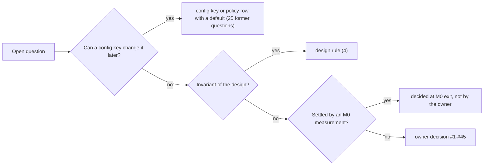

# 14. Реестр решений владельца

## 14.1 Что считается решением владельца

С 2026-09-26 действует ваше правило. Решением владельца считается только вопрос, ответ на который **никакой ключ конфигурации потом не изменит**. Сюда входят формат на диске, модель веток, семантика слияния, схемы идентичности, замороженная поверхность запросов, граница кода и объём продукта, трата денег и покупка железа, выход данных за пределы машины. Сюда же относятся согласие на запись вашей активности (#35) и ваш рабочий график (#40, дата перехода). Всё остальное является ключом `config` или строкой политики с документированным умолчанием, которое вы меняете в любой момент (`moirai config get|set|unset|list|check`, §13). Эталонная модель и тесты реализуют каждое допустимое значение каждого ключа.

Как вопросы разошлись по классам:

- **Нумерация стабильна.** Решения #1–#31 взяты из прежнего списка, #32–#45 добавлены позже. Список дедуплицирован по AR, [40 §9.2], [50 §9.2], [60 §3.14] и аудиту [74 §5]. «Former #42» и «former #43» из журнала ревью [80] решениями не являются: номера #42 и #43 принадлежат только решениям AR §11.
- **Срок решения** по правилу P2: до первой вехи, чей формат, протокол, код или расходы оно может изменить.
- **Аудит [74 §5.2]** разобрал 50 пунктов C01–C50. Из них 24 реальных решения, 22 ключа или строки политики, 2 разделены на реальную и конфигурируемую части (#3, #25), 1 правило дизайна и 1 решается измерением. После переклассификации до M0 осталось ≈ 23 реальных вопроса, а вам это сэкономило ≈ 3–5 из 15–25 часов, заложенных на решения (оценка).
- **Никогда не может стать ключом** ([74 §5.4], AR §13):
  - константы резолвера R4 (пороги, 50 ms покоя, `is_text`, свёртка регистра, шаблоны never-candidate, правило идентичности E3d, граница окна E6);
  - грамматика, логика, подсчёт, границы переходов и тексты ошибок LQ;
  - каноническая форма, кодек `.moi`, алгоритмы хэшей и выводы идентичностей;
  - правило «подтверждено = сброшено» для мутаций графа;
  - типизированные правила слияния;
  - I32′, [40] #10/#11;
  - отсутствие таймеров, потоков и наблюдателей в простое;
  - по [80 §2]: класс долговечности каждой точки протокола и её вызовы для каждой ОС, раскладка `LOCK` и порядок блокировок, правила группового коммита и цепочки, правила живости и идентичности загрузки, allowlist хранилища, закрытый краш-гейтом.
- **Как устроены ключи** (§13): синтаксис git-config, две области (*store* для всего, что влияет на версионируемые записи; *user* для машинных путей и политики выхода данных), классы перезагрузки hot/restart/init/install. В M0 замораживаются синтаксис и правила, **но не набор ключей**.

> ✅ **На согласование:** все 25 бывших вопросов (§14.6) закрыты умолчаниями из §13 без вашего явного выбора по каждому. Среди них `merge.strict = false`, `hooks.stamp.permission = allow`, `brief.lang = en`, `runs.granularity = workflow`, `gc.reflog-expire = 90d`. Подтвердите, что такое разграничение и эти умолчания вас устраивают. Любое из них можно поменять позже без изменения формата. Ключ `image.allowed-remotes` (по умолчанию пуст) к этим 25 не относится. Он исполняет ваше решение #16: «только приватный remote; список начинается пустым» (§14.4).

_Источники: AR §11 (стр. 2047–2049, 2083), §13 (стр. 2306, 2318); [60 §3.14]; [74 §5.2, §5.4, §5.6]; [90 §10.7]_

## 14.2 Ваши ответы 2026-09-26 и обязывающие вводные

Документы хранят ваши слова только в английском «дословном переводе», поэтому ниже дан **обратный перевод**, и формулировки могут отличаться от исходных. Ответы на §11 от 2026-09-26 целиком:

> «Пока никакая дополнительная машина использоваться не будет, всё здесь. Две линии параллельно. Пока бенчмарки только на Opus 5.5. Сам проект moirai будет храниться в публичном репозитории на GitHub. Зафиксируй, что все коммиты должны делаться БЕЗ соавторства Claude. Всё остальное утверждаю так, как вы написали».

Прочие ваши слова того же дня, на которые ссылаются решения:

- **#2:** «Нет, SQLite не используем, сразу делаем свой [движок]». «„Чтобы начать пользоваться как можно раньше“ не важно, надо сразу делать как следует».
- **#32:** «Учти, что система должна работать и под macOS и Linux». «Бинарники под Linux и Mac пока не собирай, просто учитывай, что это нужно будет реализовать. Но это мы пока не тестируем, нет возможности».
- **#43:** «Должно работать не только для Claude Code, но и для Codex и других харнессов».
- **#44:** «Сделай cargo check для Linux и Mac».

Что ответы изменили в документах (запись журнала ревью от 2026-09-26):

- #34 закрыт профилем L, #2 закрыт двумя линиями на ноутбуке, календарь перевыпущен тем же Monte Carlo с машинным временем профиля L.
- #38 закрыт вариантом (a), #36 публичным GitHub.
- Остальные 27 открытых решений перенесены в таблицу «как рекомендовано» (§14.4).
- Замороженные байты формата от ответов не изменились.
- Проверочный проход после ответов нашёл 2 major и 7 minor расхождений и исправил все. Два примера. GT4 в профиле L сокращён до трёх вариантов, а disk-full закрывают инъекции GT1/GT3 и ваше учение RG7. Места запуска GT7, GT10 и GT12 разделены: синтетика идёт на hosted CI, ваши данные и живые Claude Code и Codex на ноутбуке.

Три вводные обязательны, но решениями §11 не являются:

- **Правило репозитория.** Каждый коммит авторства владельца без ИИ-соавтора. Запрещены трейлер `Co-Authored-By:` с Claude или другим ИИ и строка «Generated with Claude Code» в описании PR. Правило действует с первого коммита, а он предшествует M0. Меры действуют вместе, а не на выбор:
  - настройки атрибуции харнесса отключены в закоммиченной конфигурации репозитория ещё до первого коммита (изменение конфигурации, которое одобряете вы; Claude Code по умолчанию добавляет трейлер соавтора);
  - до того как M0 item 7 поставит проверку `commit-msg` в локальном pre-merge-гейте и проверку тела PR в CI, вы просматриваете каждое сообщение коммита;
  - перед первым push вы просматриваете, что публикует дерево, включая документы дизайна: они цитируют вас и описывают вашу машину и рабочий процесс (§10 risk 41);
  - корпуса и фикстуры из ваших данных живут только в gitignored-каталоге на ноутбуке (#37). Pre-commit-проверка отклоняет пути в этом каталоге и файлы, чей хэш перечислен в его манифесте;
  - CI никогда не получает ваших данных и API-ключа модели: LQ-Bench и все гейты на ваших данных идут локально. Это обязательство M0 item 7.
- **Лицензия:** Apache-2.0, copyright Mark Boyko. Все зависимости должны иметь совместимые лицензии.
- **Постоянное указание:** каждый агент, который проектирует, строит и ревьюит moirai, работает на Opus. Модели ваших рабочих агентов в других харнессах (GPT-5.6-Luna в Codex) это указание не регулирует.

> ⚠ **Расхождение в документах:** AR:63, AR:2654 и 60-roadmap.md:363 утверждают, что настройки атрибуции харнесса отключены в закоммиченной конфигурации репозитория ещё до первого коммита. Однако ни один коммит репозитория (d684d98 в `master` и следующий за ним коммит на рабочей ветке) не содержит конфигурации харнесса. В них нет `.claude/settings.json`, а из файлов для харнессов есть только `CLAUDE.md` и `AGENTS.md`. Пока не установлена проверка `commit-msg`, правило держится только на тексте `AGENTS.md` и на вашем просмотре. Кроме того, d684d98 уже есть в `origin/master` (`github.com/bluesteelll/moirai`), то есть первый push, по-видимому, уже состоялся. Просматривали ли вы дерево перед ним, документы не фиксируют.

> ✅ **На согласование:** одобрите коммит конфигурации харнесса с отключённой атрибуцией. AR:63 уже исходит из того, что вы одобрили это изменение. Ручной просмотр каждого сообщения коммита и дерева перед первым push остаётся в любом случае, пока M0 item 7 не поставит проверку. Это дополнительная мера, а не альтернатива. Если оставить только ручной просмотр, это будет отступлением от обязывающей вводной, и тогда AR:63 и [60 §3.1] item 7 придётся исправить.

_Источники: AR binding inputs (стр. 63), §10 risk 41 (стр. 2041), §11, Review log (стр. 2637–2657); [60 §3.1] item 7 (стр. 363); AGENTS.md_

## 14.3 Решения, принятые вами явно (7)

Все семь решений приняты 2026-09-26. Столбец «С вехи» взят из [60 §3.14].

| # | Вопрос | Решение | Последствия | С вехи |
|---|---|---|---|---|
| 2 | Порядок сборки; линии и машины | Сразу свой движок: без SQLite, без стадий раннего внедрения. Две контролируемые линии Opus, обе собирают на ноутбуке, линия B берёт листовые компоненты | Каждый компонент строится один раз по финальной спецификации в порядке M0–M11. Вы начинаете пользоваться moirai только после гейта релиза. Варианты S1–S5 на временном SQLite и adoption-driven черновик отозваны. M0 item 21 измеряет RAM и CPU одной и двух линий и задаёт лимит сборки. Если две линии не помещаются, линия B встаёт на паузу | M0 |
| 32 | Linux и macOS | Проектируются сейчас. Windows строится и гейтится в M0–M11, Linux и macOS реализуются позже | Один формат и одна семантика протокола; X-F1–X-F12 замораживаются в M0. Различия между ОС только в OS-слое. Гейты сборки, CI, тестов и краш-тестов только на Windows. Порт-фаза не имеет расписания и не блокирует релиз | сразу (2026-09-26) |
| 43 | Интерфейс агента, независимый от харнесса | Работает в Claude Code, Codex и других харнессах | Контракт C0: CLI в `PATH`, stdio MCP с текстовыми результатами, блок в начале `AGENTS.md`, переносимый skill. Tier A: Claude Code и Codex. Хуки служат ускорителями. Права берутся только из предъявленных аренд (lease). Бюджеты в байтах. #38 переоткрыто | сразу (2026-09-26) |
| 44 | Кросс-таргетная проверка типов как гейт; только pure-Rust | `cargo check` для Linux и Mac | GT20 (e) для `x86_64-unknown-linux-musl`, `aarch64-unknown-linux-musl`, `aarch64-apple-darwin` в локальном pre-merge и PR CI с M0; бинарник не собирается, тесты не запускаются. `zstd` исключается, и кодек выбирается в M0 из pure-Rust вариантов. `blake3` в режиме `pure`. C-аллокатора нет | сразу (2026-09-26); гейт с M0 |
| 34 | Тестовое железо и лицензии | Профиль **L**: без тестового хоста и без покупки лицензии гостя | Ночные гейты идут в окнах без агентов: ≈ 5 в неделю с выхода M1, всего ≈ 145–195 ночей. На каждую итерацию release candidate нужна 3-дневная заморозка агентов. GT15 работает на одном госте Windows Server 2025 Core (VirtualBox 7, сверка на VMware Workstation Pro). GT4 гоняет 3 варианта; disk-full закрывают симулятор и одно учение RG7, которое вы проводите на своём VHDX. Релиз сдвигается на ≈ + 5 недель по P50: 35.5–76.5 недели, P50 ≈ 52, P90 ≈ 62 (оценка). С тестовым хостом было бы 33–69.5 недели | вход в M0: обеспечение инфраструктуры (item 7) является первой задачей M0 |
| 36 | Где живут репозиторий и CI | Публичный `github.com/bluesteelll/moirai` | Исходники покидают машину по вашему выбору. Бесплатные hosted-раннеры Windows выполняют сборку, линты GT20 a/b/d, GT20 (e), юнит-, property- и дифференциальные тесты на синтетике. Гейты времени, RAM, floor, краш-тестов и kill-loop на них не запускаются никогда. В CI нет API-ключа модели. #37 становится критичным | M0 |
| 38 | LQ-Bench: модели, бюджет, вендоры | Вариант (a): только Opus 5.5 | В M0 ≈ 53 M токенов, ≈ $280 (≈ $160–540, оценка) по API-тарифу. Транспортные страты Claude Code и скриптового generic stdio-клиента; без floor-тира и без Codex-арма. Codex пишет LQ в профиле `unknown`: только именованные мутации, `DRY` → `IF TARGETS` по opt-in, эхо чтения включено. ~30 реальных промптов уходят только в Anthropic. Проверка соответствия Codex в GT12 и пробы P4, P10 по-прежнему гоняют вашу модель Codex, но как контрактные тесты и измерения; точность LQ они не гейтят | M0 |

Детали профиля L и двух линий:

- **Стоимость машинного времени в профиле L** (оценка):
  - ≥ 1,000 циклов GT15 на выходе M1 идут на одном госте ноутбука и занимают 1.25–2.1 недели вместо 0.3–0.6 на хосте;
  - каждый выход M0–M10 требует 2–4 окна ноутбука (+ 0.2–0.5 недели на выход);
  - RG3 занимает 2.5–3.5 недели.
- **Резерв по времени.** Прогон длинных синтетических seed-ов на бесплатных hosted-раннерах вернул бы ≈ 2.5 недели (P50 ≈ 49.5). В календарь это не заложено, пока M0 не покажет, что раннеры выдерживают нагрузку.
- **Риск нехватки RAM на ноутбуке для двух линий** (§10 risk 40): свободно ≈ 1.8 GB при 16 агентах (измерено), одна собирающая линия берёт 1–3 GB (оценка). Защита: общий семафор сборки, `CARGO_BUILD_JOBS` по item 21, без `rust-analyzer` в worktree линий, ожидание при свободной памяти < 1.5 GB, никаких сборок рядом с 16-агентной кампанией.
- **Порт-фаза (#36):** публичный репозиторий позволяет ей использовать бесплатные hosted-раннеры Linux.

> ✅ **На согласование (деньги):** #38 (a) стоит ≈ $280 в M0. Кроме того, повторные прогоны в M7, M8, M10 и при изменениях поверхности стоят ≈ 5 M токенов и ≈ $28 каждый, прогон перед релизом ≈ 13 M и ≈ $40 (оценка). Подтвердите этот бюджет и то, что точность LQ у Codex-агентов не измеряется. Варианты на будущее: (b) + ≈ 62 M токенов, + ≈ $30; (c) это (b) плюс ≈ 15 M и ≈ $50. Оговорка к (b): его floor-тиру нужно железо, которое по #34 не куплено, или hosted open-weight модель другого вендора. Поэтому выбор (b) или (c) может заново открыть #34 или вопрос о выходе данных за пределы машины.

_Источники: AR §11 (стр. 2052–2061), §9; [60 §3.14] (стр. 614–629), §3.15; [90 §10.7]_

## 14.4 Решения, принятые как рекомендовано (27)

Эти решения закрыты фразой «Всё остальное утверждаю так, как вы написали» (2026-09-26). Альтернативы и их последствия остались в [40 §9.2], [50 §9.2], [74 §5], [80 §5.4], [90 §10.7].

| # | Вопрос | Решение и последствие | С вехи |
|---|---|---|---|
| 1 | Живость координации при полном ветвлении | Изоляция плюс маркеры `settled`/`deleted`, правила `~main`, представления `--across`. Класс полей `shared` не строится; выбрать его после релиза значит перейти на формат v2 по процедуре RG10 | M0 |
| 5 | Ветка на линию и глаголы R1 | Одна ветка на линию (`lane open`). В релизе есть `tag`, `undo`, `revert`, `cherry-pick`, `reflog`, `op log`/`op restore`; `rebase --onto` нет | M0 |
| 11 | Запись в граф с нескольких машин или из облачных агентов | Не в релизе. `uid` хранится с первого дня, поэтому будущая синхронизация не потребует миграции идентичностей | M0 |
| 17 | Одно хранилище на репозиторий или одно глобальное | На репозиторий (`<git-common-dir>/moirai/`). Кросс-проектных представлений нет | M0 |
| 20 | R4: файловые глаголы вне writer-дерева | Отказ (exit 5 с командой привязки). Альтернатива добавила бы поля `pending_*` в формат v1 | M0 |
| 21 (a)–(c) | R4: может ли moirai писать в файлы репозитория | Нет / нет / нет. `links mentions` только сообщает | M0 |
| 22 | R4: области кодовых символов | Рукописные сканеры для Rust, Markdown, TOML. tree-sitter только как тестовый оракул | M0 |
| 24 | R5: может ли язык писать | Послойный `TX` через отдельную точку входа | M0 |
| 25 | R5: где хранятся именованные запросы | В хранилище, с версиями по веткам и экспортом в переносимой форме | M0 |
| 26 | R5: объём грамматики | Трассируемое по требованиям Cypher-подобное подмножество, терпимое к GQL. Новые продукции появляются только в аддитивной версии грамматики | M0 |
| 27 | R5: имена предикатов | `ready` и `unblocked` | M0 |
| 28 | R5: отсутствующие значения | Двузначная логика с явным absent, E118, W01; подтверждается абляцией | M0 |
| 29 | R5: семантика подсчёта | Мультимножества Cypher/GQL; подтверждается абляцией set-vs-bag | M0 |
| 31 | R5: имя | Lachesis (LQ) | M0 |
| 33 | Стирание истории | Стирания нет: retract и rotate. Тела можно удалить по хэшу, id коммитов при этом не меняются. `gc --squash-before` не строится | M0 |
| 35 | Запись 16-агентной нагрузочной фикстуры | Да: профиль CPU, диска и памяти без содержимого, хранится локально | M0 |
| 37 | Где хранятся корпуса и фикстуры из ваших данных | Никогда в репозитории и на hosted-раннерах. Только gitignored-каталог на ноутбуке с pre-commit-проверкой | M0 |
| 3 | Git object I/O | Рукописный слой внутри процесса: loose, pack, idx, commit-graph, refs, bundle; SHA-1 и SHA-256. Git CLI служит только тестовым оракулом и сетевым транспортом | M4 |
| 16 | Могут ли заметки и дословные цитаты уходить с машины через образ | Только в приватный remote. `image.allowed-remotes` пуст, пока вы его не заполните. Публичным (#36) является только репозиторий исходников, git-образ хранилища живёт в отдельном bare-репозитории | M5 |
| 30 | R5: история аренд | Не хранится. Индекс можно добавить позже, аддитивно, через флаг `derived-optional` | M7 |
| 8 | Проза в репозитории | Только в хранилище; реестры регенерирует `export md` | M9 |
| 15 | Миграция и генерируемые представления | ~50 правил, уроки, пины, живые линии и открытые вопросы импортируются как узлы после вашего просмотра. 254 файла памяти уходят в архив только для чтения. `OPEN-QUESTIONS.md`, `BACKLOG.md`, `MEASUREMENT-QUEUE.md` и блок возобновления MEMORY.md становятся генерируемыми представлениями. По каждому правилу вы решаете, заменять ли его текст в `CLAUDE.md` на id. Репозиторий остаётся на NTFS | M9 (инструменты), M11 (прогон) |
| 18 | Нативные Tasks Claude Code | Игнорируются | M9 |
| 23 | R4: существующие цитаты (34,195 `path:line`, 188 висячих, 301 путь памяти) | Импорт после вашего просмотра неоднозначных: `links import` строится в M9 и запускается при переходе (cutover) | M9 |
| 39 | Подпись релизного бинарника | Без подписи, стабильный путь установки | M11 |
| 40 | Дата перехода | На границе кампании после репетиции RG11; день назначаете вы | M11 |
| 41 | Исключения объёма от команды дизайна | Не строятся (резервы в формате и триггеры пересмотра сохраняются): E2 (M6), nudge `PreToolUse` и дельта `PostToolBatch` (M9), HTTP MCP (M10), запись reftable и транспорт без git (M4), назначения образа tracked-directory, orphan-branch и `refs/moirai/*` (M5). Если позже что-то из этого решат строить, это принесёт свой ключ и units (оценка: E2 ≈ 1–2; nudge, дельта и второе назначение ≈ 1–3.5 вместе; HTTP MCP и reftable ≈ 1–2 каждое) | M4–M10 |

Почему рекомендованы именно эти варианты (по источникам):

- **#1.** Изоляция веток плюс маркеры сохраняет R1 без возврата к неветвящейся «плоскости координации». Триггер пересмотра: кампания, где staged-слияния и конфликты `sync` отнимают основное время оркестратора, или правила с `main` систематически не доходят до линий. Тогда появится opt-in `shared`: статус и `blocks` живут на `main`.
- **#17.** Раскладка хранилища, пространство `#N` и область блокировки писателя замораживаются в M0.
- **#20.** Альтернатива добавила бы в формат v1 два составных поля и путь продвижения.
- **#21.** (a) даёт длинный хвост промахов и ложных срабатываний. (c) NTFS object ID не переживает правок агентов (измерено).
- **#22.** tree-sitter означает C-код в продукте: + 1.8 MB, 8.9 MB с пятью грамматиками, ошибки разбора на 23.9 % HLSL (измерено).
- **#24.** Без `TX` пакетные изменения ушли бы в самодельный JSON. С одной точкой входа «только чтение» стало бы классификацией во время выполнения, которую не видят правила разрешений.
- **#26.** Соответствие ISO GQL добавило бы сотни продукций, а каждая продукция v1 остаётся навсегда.
- **#27.** Альтернатива дала бы разные множества для `WHERE t.ready` и `moirai ready`.
- **#28.** Трёхзначная логика молча теряет строки в сравнениях `<>`.
- **#33.** Squash переписывает id коммитов, то есть меняет идентичность.
- **#3.** Два объектных бэкенда (сначала `git fast-import`) были бы выбрасываемой стадией по построению.

> ✅ **На согласование:** решения #1, #11, #17, #20–#22, #24–#29, #31 и #33 вступают с M0 и закрепляются в формате v1, замороженной грамматике LQ или границе продукта, которые фиксируются на выходе M0. Изменить их потом можно только через формат v2 с процедурой обновления RG10, новую версию грамматики или новое решение владельца о границе продукта. Подтвердите, что ваше «всё остальное утверждаю» относится и к этим необратимым пунктам.

> ⚠ **Расхождение в документах:** §1 row 5 (AR:100) называет `refs/moirai/*` одним из способов выполнить R3. Однако #41 (AR:2093), §2.13 (AR:244) и T15 (AR:268) исключают это назначение из сборки. Строится только отдельный bare-репозиторий.

_Источники: AR §11 (стр. 2063–2093), §9 (Cutover, Not built); [60 §3.14]; [40 §9.2]; [50 §9.2]_

## 14.5 Отложенные решения с зафиксированным умолчанием (3)

Ни одна веха M0–M11 этих решений не ждёт.

| # | Вопрос | Умолчание | Когда |
|---|---|---|---|
| 42 | Железо, CI и покрытие платформ для порт-фазы (деньги) | Mac mini (≈ $599) как self-hosted раннер и VZ-стенд. Бесплатные hosted-раннеры Linux с `/dev/kvm`. Floor-замеры Linux на dual-boot разделе ноутбука, если порт не купит машину. macOS только arm64. Альтернативы: арендованные облачные Mac (Scaleway ≈ €0.22/ч, минимум 24 ч); Intel-раннер macOS и сборка universal2. Apple Developer Program ($99/год) нужна только при распространении moirai | порт-фаза |
| 45 | Объём поддержки харнессов | Ничего не строится (подтверждено 2026-09-26). (b) Codex cloud исключён. (c) `moirai dispatch` заменён документированным рецептом. (a) шаблоны Tier B: 1.5–2.5 units плюс golden-файлы пяти харнессов в каждом GT12. (d) 1–1.5 units, (e) 0.5 каждый. Всё это по запросу | по запросу, не раньше M9 |
| 21 (d) | R4: document id на macOS (`UF_TRACKED`) | Нет. Ни один замороженный байт от этого не зависит | порт на macOS |

_Источники: AR §11 (стр. 2095–2102); [90 §10.7]; [80 §5.4]_

## 14.6 Бывшие вопросы, ставшие ключами или правилами

Решения #4, #6, #7, #9, #10, #12, #13, #14 и #19 больше не являются вопросами к вам. Они **специфицированы, а не решаются**: у каждого есть ключ, тип, умолчание, область действия и класс перезагрузки.

| # | Бывший вопрос | Ключ или строка политики | Умолчание | Правило дизайна |
|---|---|---|---|---|
| 4 | Назначение образа | `image.dest.<name>.{path, refs, granularity, object-format, kind}` | `<project>-moirai.git` рядом с главным worktree; `main,tags/*,lane/*`; `checkpoint`; `sha1`; `bare-repo` | — |
| 6 | Режим разрешений MCP-хука stamp | `hooks.stamp.permission`, `.ask-for` | `allow`; {owner-authority} | — |
| 7 | Роли без Bash пишут через MCP | `policy.role.<role>.mcp-write` | да для architect, architecture-critic, researcher, project-analyst | — |
| 9 | Удаление источника `blocks`/`gates` | `edges.{blocks,gates}.on-src-deleted` | `flag` | `rm` под живой арендой отклоняется (I32′) |
| 10 | Слияние: land или strict | `merge.strict` | `false` | — |
| 12 | Классы долговечности, тихие окна | `durability.lazy-kinds`, `quiet.*` | {heartbeat, cursor, session-mark}; 8; `true` | мутации графа подтверждаются только после сброса (flush) |
| 13 | Язык и полномочия; правило коммитов | `brief.lang`, `policy.role.*.authority-owner`. Правило коммитов ключом не является: это содержимое, которое вносится при переходе (cutover) | `en`; ваша главная сессия с `--owner-quote` | — |
| 14 | Хранение; squash | `gc.reflog-expire`, `gc.cruft-delay`, `idempotency.retention` | 90d, 14d, 30d | squash вошёл в #33 |
| 19 | Гранулярность `run` | `runs.granularity` | `workflow` | — |
| 3 (часть) | Может ли `image push/pull` запускать git | `image.transport.spawn-git` | `true` | — |
| 25 (часть) | Кто определяет именованные запросы | `policy.role.<role>.define-query` | оркестратор, владелец | — |

Сюда же относятся 10 бывших вопросов из [40 §9.2] и 4 из [50]: `files.policy.auto` (без решения перепривязка только по точным свидетельствам), `roots.<name>` и `files.scratchpads`, `files.hooks.*`, `files.deletion-inference` (удаление только явное), `files.mv-git` (без `--git` индекс не трогается), `files.cloud` (только метаданные), `image.dest.<name>.anchor-text` (`full`), `files.confirm-roles` (оркестратор или владелец, но не принявший догадку); [40] #5 и #8 (USN-журнал, nudge) не строятся по #41; [50] D2/D12 `policy.role.<role>.tx` и узкий allowlist разработчика, D3 `query.safelist.<role>`, D6 `query.caps.<role>.*`.

За 25 бывшими вопросами последовали четыре правила дизайна, которые менять нельзя:

- I32′ из #9;
- контракт «подтверждено только после сброса» из #12;
- [40] #10 и #11: их альтернативы записывали бы непроверенные факты (DR1, I-F6).

_Источники: AR §11 (стр. 2049), §13 (policy data, стр. 2316); [60 §3.14] (стр. 642); [74 §5.2]_

## 14.7 Что может вернуться к вам по условию

- **#34, стенд для краш-тестов ОС.** Если калибровка (item 17) не проходит ни на VirtualBox 7, ни на VMware Workstation Pro, стенд возвращается к вам, потому что лицензия стоит денег. Отключение WSL2 или Memory Integrity тоже решаете вы.
- **#39, подпись бинарника.** Если item 11 покажет, что подпись меняет spawn-to-exit, покупка возвращается к вам.
- **#2, две линии.** Если item 21 покажет, что две линии не помещаются, линия B встаёт на паузу. Релиз тогда займёт 51.5–112.5 недели, P50 ≈ 75.5, P90 ≈ 91 (оценка).
- **#38.** Более поздним решением можно добавить (b) или (c), то есть Luna и Codex-арм. LQ-Bench перезапускается при смене гейт-модели.
- **#1, #26, #30.** Если позже понадобится `shared`, это формат v2. Новая продукция LQ появляется только в аддитивной версии грамматики. Индекс истории аренд добавляется аддитивно.
- **#41.** Каждое исключение имеет измеряемый триггер пересмотра. Для `refs/moirai/*` это ваше внесение remote проекта в #16 или изменение #11.
- **T8.** Ленивый класс долговечности для мутаций графа ключом не станет. Если его захотят ввести, это будет решение владельца с изменением протокола.
- **Бюджеты.** Если измерение на выходе вехи покажет, что бюджет не выполним, меняется дизайн. Сократить объём ради даты можно только решением владельца, записанным в §11.
- **#15.** Репозиторий с хранилищем остаётся на NTFS. Dev Drive (ReFS) окружение отклоняет, пока нет краш-гейта для ReFS.
- **Порт-фаза (#32).** Если находка порта потребует изменить формат или протокол, это переоткрывает M0 (правило P4 из [60]).
- **Ваши действия, заложенные в решения:** просмотр списка импорта (#15, #23), назначение дня перехода (#40), внесение приватного remote (#16), а также #42, #45 и #21 (d).

_Источники: AR §11, §2.3 (стр. 150), §2.13 (стр. 250), §9 (Not built), §10 risks 29 и 40; [60 §3.1] item 7; [74 §5.4]_

## 14.8 Что решают измерения M0, а не вы

Эти решения фиксируются на выходе M0 и записываются в AR §8.2, §13 и [60 §2.5].

| Что решается | Чем | Правило |
|---|---|---|
| Лидер в M1 | items 1–2 | Лидер строится, только если коммит CLI дольше 20 ms из-за close под Defender или p99 ожидания 16 писателей больше 50 ms при групповом коммите. Тогда + 3–4 units (оценка) |
| Структура T1 | item 14 | Option A подтверждается. Option B выбирается, если точечное чтение после полного хвоста в 4,096 операций больше 50 µs или дельта-чекпоинт при 0.5 M узлов больше 100 ms |
| Кодек, словарь, место сжатия тел | item 6 (#44) | Только pure-Rust. Ожидаются `lz4_flex` со словарём для тел и `ruzstd` для истории. Свой энкодер zstd-формата (+ 5–8 units) делается, только если его потребует бюджет |
| Deflate-кодек git-слоя | item 9 | `zlib-rs` или `miniz_oxide` |
| Порог чекпоинта и все параметры хранилища | item 10 и др. | open при 1e6 с полным хвостом ≤ 3 ms. Умолчание 4,096 операций / 4 MiB оценено в 3–5 ms |
| Граница ожидания блокировки | items 2, 12 | подтверждает 2 s |
| G15/G16, `store.promotion.overlay-ops`; порог loose/pack | items 3, 8 | — |
| Грамматика, тексты ошибок, карточка и её написание; BM25 или скорер без статистики | GT13 / LQ-Bench | От выбора скорера зависит, останется ли `DOCLEN` в формате v1 |
| Константы резолвера R4 (R-14), раскладка якорей | корпуса реплея | — |
| Форма MCP-рантайма | item 19 | Если rmcp на tokio превышает базовую линию больше чем на 2 MB или 2 потока, используется синхронный цикл |
| Маршрут stamp; `integrate.codex.store-writes` | item 7 (`mcp_tool`), проба P7 | — |
| Лимит сборки и окна линий | item 21 | или пауза линии B |
| Нужен ли `MOVEFILE_WRITE_THROUGH` помимо сброса каталога | item 17 (калибровка стенда) | — |
| Источник идентичности загрузки на Windows | item 22 | Иначе Windows работает в режиме Unknown-boot |

На выходе M0 также измеряется скорость (сколько units выдано против оценки), и календарь перевыпускается. Повторно это происходит на выходе M1.

_Источники: AR §11 (стр. 2049), §2.1, §8.2; [60 §3.1] (стр. 372), [60] стр. 115; §10 risk 37_

## 14.9 Что нужно от вас для старта M0

Все решения, которые должны быть приняты до M0, приняты. Для входа в M0 и выхода из него нужно ещё следующее:

1. **Повторное ревью [40] и [50] ревизии 2.** Документы расходятся в том, нужно ли оно до старта (см. ниже).
2. **Правило репозитория** (§14.2): конфигурация харнесса с отключённой атрибуцией в репозитории; до M0 item 7 вы просматриваете каждое сообщение коммита, а перед первым push вы просматриваете, что публикует дерево, включая документы дизайна (§10 risk 41).
3. **Время.** По [60 §3.15] (оценка) проект потребует от вас ≈ 50–95 часов, из них в M0:
   - спецификационное ревью: 8–16 ч;
   - подпись таблиц правил эталонной модели (таблица слияния, машины статусов, матрица политик удаления, правила слияния файловых ссылок, классы контекст-паков): 15–25 ч в M0 и 1–2 ч на каждом следующем выходе, который меняет таблицу;
   - проверка основных фикстур GT10 (инциденты реестров, таблица node-40, разбор из AR §7.6) и выборки gold-результатов LQ-Bench: 10–20 ч;
   - профиль L и публичный репозиторий: окна без агентов и 3-дневные заморозки, настройка небольшого VHDX для учения RG7 (в профиле L disk-full закрывает оно, #34), просмотр дерева перед первым push — 3–7 ч (M0 и еженедельно с выхода M1);
   - обзоры скорости и перевыпуск календаря на выходах M0 и M1: 2–4 ч.
4. **Данные:** запись 16-агентной фикстуры (#35) и локальные корпуса (#37). Ни то ни другое не попадает ни в коммит, ни в CI.

> ⚠ **Расхождение в документах:** по AR:1966 (§9, вход в M0) условия входа уже выполнены: [40] переработан после [41], [50] прошёл независимое ревью. Правило P2 (60-roadmap.md:85) требует того же и повторного ревью ревизии 2 не требует. Однако Entry в 60-roadmap.md:354 требует, чтобы [40] был переработан «и повторно отрецензирован», и отмечает, что ни одна ревизия 2 ещё не рецензировалась повторно. Risk 4 (60-roadmap.md:958) говорит, что M0 не может начаться, пока обе ревизии не устоялись. AR:2018 (risk 18) включает обе ревизии в спецификационное ревью M0 и называет его критерием и входа, и выхода, хотя строка M0 в §9 ставит это ревью только в критерии выхода.

> ✅ **На согласование:** решите, проводить ли повторное ревью [40]/[50] ревизии 2 до старта M0, как требуют Entry и risk 4 в [60], или в рамках спецификационного ревью M0 (item 8, критерий выхода), как следует из строки M0 в AR §9 и P2.

> ✅ **На согласование:** подтвердите, что готовы выделить в M0 ≈ 33–61 час на ревью, подписи и фикстуры, плюс 3–7 ч на профиль L и публичный репозиторий (включая настройку VHDX для RG7 и просмотр дерева перед первым push) и 2–4 ч на обзоры скорости на выходах M0 и M1. С выхода M1 нужно давать ≈ 5 окон без агентов в неделю и 3-дневную заморозку на каждую итерацию release candidate.

_Источники: AR binding inputs (стр. 63), §9 (стр. 1773, 1966), §10 risks 18 и 41; [60] P2 (стр. 85), [60 §3.1] Entry (стр. 354), item 7 (стр. 363), [60 §3.15] (стр. 649–657), risk 4 (стр. 958)_
