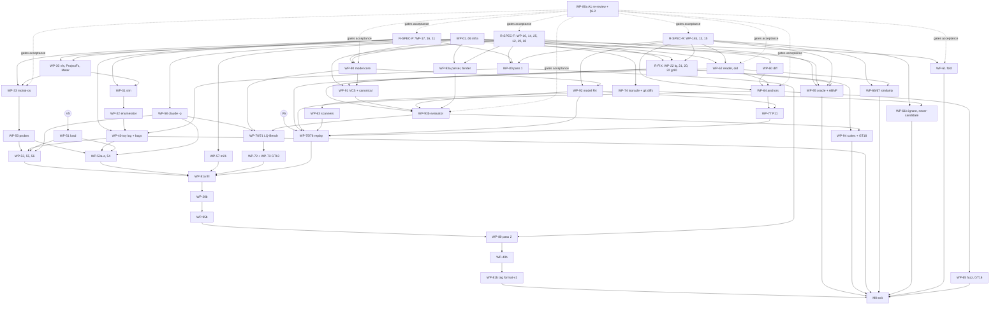

# M0 execution plan: Contract and evidence

Issue 2, 2026-09-27. It answers the review of issue 1. This is the plan of record for milestone M0 of [60 §3.1]. It sets
out the crates, the work packages, the order of work, who authors what, and what waits on the owner. [60 §3.1] owns the
scope and the exit criteria. The design documents own every rule and byte. If this file disagrees with one of them, the
design document wins and this file is corrected. §6.2 lists the open points this plan settles itself. The phase-0 review
WP-80a confirms each one before any work that rests on it is accepted.

Legend:
- **u**: units of [22 §7.1], ≈ 3 per 1,000 lines including tests. The model is sized on [60 §4.6]'s basis of ≈ 2 per 1,000 lines. The rate is 5–8 u a week per lane; it is not yet measured.
- **Lane**: one owner-supervised stream with one shared target directory (§2.1). A lane runs several sessions at once, but together they deliver the lane's 5–8 u a week. Running sessions in parallel shortens dependency waits; it does not raise the lane's total.
- **V2–V10, A1–A8**: the owner-review items of 2026-09-27. In the approval checklist they are В2–В10 and А1–А8.
- **E1–E11**: the M0 exit criteria (§7).
- **S1–S6**: the author-separation rules (§3.1).

## 1. Purpose and sources

M0 freezes format version 1 and the contract, and it gathers the evidence behind them. In one sentence: every byte layout,
the `Vfs` fault model and protocol, the store parameters, the query surface and the R4 reservations are frozen and reviewed.
They rest on:
- a complete reference model and an independent format oracle;
- a validated crash harness;
- FL-1;
- the M0 measurements.

No engine or product code is written other than FL-1, the `moirai-vfs` seam and the Windows OS layer that the M0
measurements need (§6.2 R1). R1 changes the approved scope, so the owner confirms it on day 1 (§8).

| Ref | Document | What M0 takes from it |
|---|---|---|
| [AR] | [../ARCHITECTURE-RESEARCH.md](../ARCHITECTURE-RESEARCH.md) | Design of record: §4 format, §5a–§5e VCS/image/R4, §7.7 LQ, §8.2 measurements, §8.3 gates, §13 configuration, §14 OS layer, binding inputs |
| [40] | [../research/design/40-file-links-design.md](../research/design/40-file-links-design.md) | R-1…R-18 (§2.11, authoritative), FL-0/FL-1 (§8.1), replay corpora (§8.3.4), measurement 15 extension (§8.3.6) |
| [50] | [../research/design/50-query-language-design.md](../research/design/50-query-language-design.md) | LQ-0 contract (§2–§6), LQ-Bench (§7.4), F1–F18 (§8.1), LQ-3 (§8.2) |
| [60] | [../research/design/60-roadmap.md](../research/design/60-roadmap.md) | §2.5 freeze checklist, §3.1 M0, §3.13 gates, §3.14 policy keys, §3.15 owner hours, §4 reference model, §5.1–§5.2 protocol and measurements |
| [80] | [../research/design/80-cross-platform-design.md](../research/design/80-cross-platform-design.md) | OS layer §2, X-F1–X-F12 §3, shell rules §4, M0 row §5.4, GT20 (e) §5.5 |
| [90] | [../research/design/90-harness-agnostic-design.md](../research/design/90-harness-agnostic-design.md) | M0 freezes §10.1, placement §10.2, Codex probes §10.5, LQ-Bench runner §8.3, crates and lints §11 |
| [Fnn], [OS/<file>] | [../spec/README.md](../spec/README.md) | The specification's chapter keys ([F01 §2.2]): [Fnn] is `spec/format/NN-*.md`, [OS/<file>] is `spec/os/<file>.md` |
| Checklist | [../architecture-approval-ru/15-approval-checklist.md](../architecture-approval-ru/15-approval-checklist.md) | Owner resource items V2–V10, A8 |

## 2. Cargo workspace

### 2.1 Rules

- **Toolchain.** `rust-toolchain.toml` pins 1.98.1 MSVC with rustfmt, clippy and the three cross targets. The edition is 2024 and `rust-version = "1.98"`. `Cargo.lock` is committed, because every gate runs `--locked`. Every crate is `publish = false`.
- **Composition roots.** Only a composition root depends on `moirai-os`. The roots are listed in `xtask/roots.toml`: `moirai` (created in M8) and `moirai-probes-bin` (M0). This generalises [90 §11.1]'s "the binary crate" (§6.2 R17). Each root:
  - is excluded from the cross-target set and checked with `cargo check -p <root> --locked --target x86_64-pc-windows-msvc`;
  - stays in the GT20 (b) lint for all four targets;
  - is bound by the composition-root lint: binaries only, a line cap, and a list of allowed dependencies. `moirai` keeps [90 §11.1]'s rule: `main.rs`, ≤ 200 lines, `moirai-app` and `moirai-os`. `moirai-probes-bin` holds only `src/bin/*.rs` wiring and depends only on `moirai-probes`, `moirai-os`, `moirai-toylog` and `moirai-harness-stub`.

  No checked crate depends on a root. Shared crates are generic over `V: Vfs` (and `M: Meter` for probes), with no `dyn` on the commit path ([80] X4).
- **GT20 scopes** (§6.2 R18). [60] makes (d) mandatory only from M1; this plan enforces it from M0, because M0 already writes `moirai-os`.
  - (d), `cfg(target_os)`, `cfg(windows)`, `cfg(unix)`, `std::os::*` and direct `windows-sys`/`libc` dependencies: forbidden in every crate except `moirai-os`, tests included.
  - (d), `File::lock` and `std::fs::rename`: forbidden in product crates only.
  - (a), process spawn: forbidden in the non-test code of product crates. It is provisioned now and mandatory from M1. At M0 the one allowed spawn site is `moirai-os`'s `spawn` module, built on Windows because `ProcHost`, a `Vfs` supertrait complete at M0, carries `spawn_gc_child` and `enter_background` ([OS/README §3] row `os::spawn`, [OS/proc §11]); no other product crate spawns anything. FL-1's git-CLI differential tests live in `moirai-replay`.
  - Test-only and tool crates that use these calls are listed in `osdeps-allow.toml`, each with its reason.
- **Gate exclusions.** `xtask gate` runs [90 §11.1]'s command with one `--exclude` for each entry of `host-only.toml` and `roots.toml`, plus the `-p <root>` Windows checks. fmt, `clippy --workspace --all-targets` and `test --workspace` use the same exclusions under the same poisoned environment. `moirai-tsoracle` is built only by the replay job, unpoisoned, and the MSVC `cl.exe` version is recorded in `docs/m0/tools.md`.
- **Unsafe code.** Every crate has `#![forbid(unsafe_code)]` except `moirai-os`, which needs it for FFI, mapping, the vectored handler and `CountingAlloc`. Each `unsafe` block there carries a safety comment.
- **Target directories.** Each lane has one shared `CARGO_TARGET_DIR` outside the repository, two in all, and `xtask worktree` sets it. Cargo's build-directory lock then doubles as the lane's build semaphore, and crates.io dependencies are built once per lane. fuzz/ and cargo-mutants each get their own capped directory. WP-05's disk guard counts all four.
- **Test tiers.** `MOIRAI_TEST_TIER` is `pr` (hosted CI, short seeds, synthetic data), `nightly` (laptop windows) or `exit` (24 h fuzzing, full GT16).

### 2.2 Crates M0 creates

Product crates are built to their final specification. Test-only crates are never linked into a product binary. Tool
crates run on the host only. "(e)" means the crate is in the GT20 (e) cross-target check.

| Crate | Kind | Purpose | Allowed dependencies | (e) | Author |
|---|---|---|---|---|---|
| `moirai-vfs` | product | The seam. `Vfs` trait (durability classes, `sync_dir`, `sync_group`, `rename_noreplace`/`_replace`, `swap_dirs`, `map_sealed` contract, environment-guard types). The complete `ProjectFs` trait. The `Meter` trait (free space, available physical memory, child peak, heap high-water). `LockBytes` with the target-independent in-process grant table. Clock (wall, mono, boot). `ProcId`, `BootId`, `Liveness`, `OsFileId`, `VolumeCaps`. | none | yes | R-HARN |
| `moirai-os` | product, the only OS crate | Windows modules at M0: `fs` (with `free_space`), `lock`, `map`, `env`, `proc` (with `peak_of_child`), `spawn` (`spawn_gc_child`, `enter_background`; GT20 (a)'s one allowed spawn site), `mem` (`available_physical`, `CountingAlloc`), the complete `project` (`ProjectFs`, read and write side), `path` with `canonical_root`, the `Meter` implementation, and `test_host` behind a test feature. The Unix modules are configured out and export nothing. | `moirai-vfs`; `windows-sys` (cfg windows); `blake3` | yes | R-HARN |
| `moirai-diff` | product | Myers bit-parallel matcher and histogram line diff. Anchors use it now; M3's diff3 uses it later. | none | yes | R-FL1B |
| `moirai-files` | product | FL-1: path rules and `fold_v1` (generated Unicode 17.0.0 tables); `is_text`/EOL/`oid`; normalised lines; uid derivations; chapter 20's R-14 constant module; anchor capture and resolve; scope scanners; gitignore and never-candidate matchers; sketch, winnowing, similarity and containment. It spawns no process. | `moirai-diff`; `sha1`, `sha2`, `blake3`, `xxhash-rust` | yes | R-FL1A, R-FL1B |
| `moirai-vfs-sim` | test-only | In-memory `Vfs` that enforces fault-model items 1–12, plus the crash enumerator | `moirai-vfs`; dev: `proptest` | yes | R-HARN |
| `moirai-toylog` | test-only | Toy log, generic over `V: Vfs`: group commit, two-slot `HEAD`, barrier, recovery. Carries the seeded-bug switches in its own module. It is also the vehicle for measurements 1, 2, 12 and T2 on the real Windows `Vfs`. | `moirai-vfs`, `xxhash-rust`; dev: `moirai-vfs-sim`, `proptest` | yes | R-TOY |
| `moirai-model` | test-only | The reference model of [60 §4], including LQ-3 and the independent canonical-form encoder. Rule tables are data. No JSON code. `fold_v1` is derived at test time from `fixtures/ucd/17.0.0/` by its own algorithm (§3.2 item 9). | `blake3`, `sha1`, `sha2`, `xxhash-rust` (§6.2 R5); no workspace crate | yes | R-MODEL |
| `moirai-format-oracle` | test-only | Independent decoder and test-only re-encoder of every frozen structure, and the `.moi`/carrier ABNF conformance check (E3). Compressed payloads are opaque at M0 (§6.2 R3). | `blake3`, `xxhash-rust`; no workspace crate | yes | R-ORA |
| `moirai-lqbench` | test-only | Fixture-store generator, corpus, scorer, JSON IR → model AST converter, reference renderer, `q`/`tx`-shaped CLI shims, MCP-shaped server, the headless Claude Code runner and the generic stdio client | `moirai-model`, `moirai-harness-stub`, `moirai-tokcount`; `serde_json` | yes | R-BENCH |
| `moirai-replay` | test-only | Replay-corpora harness: manifests, git CLI extraction as a test-only data source, targets report. FL-1's differential tests against `git hash-object`, `git check-ignore` and tsoracle's JSON output, and the P11 differential (WP-74, WP-77). | `moirai-files`, `moirai-model`; `serde_json` | yes | R-REPLAY |
| `moirai-probes` | test-only library | Measurement-protocol framework and statistics; the permanent layout micro-benchmarks and the probe bodies of measurements 1–16 and 18–22, generic over `V: Vfs` and `M: Meter` | `moirai-vfs`, `moirai-toylog`, `moirai-harness-stub`, `moirai-tokcount`; `blake3`, `xxhash-rust`, `serde_json`, and the measurement candidates of §2.4 | yes | R-HARN |
| `moirai-probes-bin` | test-only composition root (Windows only, `roots.toml`) | Wiring only: `guard`, `peak`, `empty`, `probe-p7`, `loadgen` and the measurement drivers | `moirai-probes`, `moirai-os`, `moirai-toylog`, `moirai-harness-stub` | no (`-p` Windows check) | R-HARN |
| `moirai-harness-stub` | test-only, permanent probe and conformance fixture | Hand-written dual-era MCP stdio loop, with `initialize` for 2025-03-26, 2025-06-18 and 2025-11-25 and `server/discover` for 2026-07-28. Stub tools with sized results, `_meta` logging, hidden `hook_*` handlers, argv/stdin echo, and Claude and Codex plugin wrappers. | `serde_json` | yes | R-HARN |
| `moirai-tokcount` | tool | Offline o200k counts. The headless Claude Code invocation (WP-58) and the parse of its reported usage. | `tiktoken-rs`, `serde_json` | yes | R-HARN |
| `moirai-tsoracle` | host-only | tree-sitter-rust oracle for the Rust scope scanner, emitting scope items as JSON. Listed in `xtask/host-only.toml`. No crate depends on it. | `tree-sitter`, `tree-sitter-rust`, `serde_json` | **no** | R-REPLAY |
| `xtask` | tool | `gate` (with `--branch`), `hook`, `host-only --list`, `coverage`, `hex` (the generic fixture assembler), `ucd` (table generator), `worktree`, `authors`, `private index`, `loadrec`, `nightly` | `serde_json`, `blake3`, `xxhash-rust`, `sha2` | yes | R-HARN (`ucd`: R-FL1A) |
| `fuzz/` | separate workspace, not a member | libFuzzer targets for FL-1: anchor selectors, path specs, the authoring-spec parser, the Rust, Markdown and TOML scanners, the gitignore and never-candidate pattern parser, and the part-2 inputs. It has its own `Cargo.lock`, which the lints scan, and a pinned nightly (WP-06). | `libfuzzer-sys`, `moirai-files` | **no** | R-FL1A, R-FL1B |

`moirai` and `moirai-app` are not created at M0 (§6.2 R9). The gate skips `-p moirai` and its lint while the crate is
absent, and a fixture workspace self-tests both. The only host-only crate is `moirai-tsoracle`. GT20 (b) rule 3 forbids
any checked crate to depend on it or on a root, dev-dependencies included.

### 2.3 Crates later milestones add (named here; not created at M0)

These names are provisional. Each milestone's plan confirms its own crates.

| Crate | Milestone | Purpose |
|---|---|---|
| `moirai-config` | M1 | Hand-written config parser (≈ 300 lines) and the typed registry ([AR §13]) |
| `moirai-format` | M1 | The product codec (`zerocopy` views), written once against the hex fixtures and the oracle. Its author is neither R-FIX nor R-ORA (S1). The oracle gains its codec decoder (an own LZ4 block decoder, the `zstd` CLI for zstd frames) at M1 ([90 §10.2]). |
| `moirai-store` | M1 | Log, `HEAD`, group commit, recovery, segments, overlay, checkpoints, GC, generic over `V: Vfs` |
| `moirai-testkit` | M1 (grows in M3, M6) | Storage driver, generic producers, the model comparison harness of [60 §4.4] and the model-result → `--json v1` converter. Later the VCS driver (M3) and the file-link driver (M6). |
| `moirai-projfs-sim` | FL-2, lane B from M0 exit | The `ProjectFs` simulator. The trait (WP-30) and its Windows implementation (WP-33) already exist. |
| `moirai-graph` | M2 | Graph core, derived state, schema, FL-3 |
| `moirai-vcs` | M3 | Refs, merge engine, diff3 (built on `moirai-diff`), FL-7 |
| `moirai-git` | M4 | Git object layer, with the deflate crate chosen by measurement 9 |
| `moirai-image` | M5 | `.moi` codec generated from the ABNF; image export and import; FL-8 |
| `moirai-links` | M6 | The target-independent FL-4 resolver ([80 §2.11.1]) |
| `moirai-lq` | M7 | LQ-1, LQ-2 and LQ-4 to LQ-10 |
| `moirai-app` | M8 | CLI, rendering and the MCP front end (M10, a module, [90 §11.1]); all other product code |
| `moirai` | M8 | The binary composition root |

### 2.4 External dependencies

The set is kept small. Every crate in a checked graph is pure Rust. Every crate anywhere has a licence that
`xtask/licence-allow.toml` allows. WP-02's lints check both before a crate is adopted. The host-only crates (tree-sitter,
libfuzzer-sys) are not pure Rust, so they stay outside every checked graph.

| Crate | Features | Used by | Why |
|---|---|---|---|
| `blake3` 1.8 | `default-features = false, ["std", "pure"]` (#44) | files, os, model, oracle, probes, xtask | Commit ids, uid derivations, digests, `BootId`/`vol_key`, manifests |
| `xxhash-rust` | `xxh3` | files, toylog, model, oracle, probes, xtask | Record and section checksums, chain trailer, `span_hash`, `xtask hex`'s `{xxh3_64}` |
| `sha1`, `sha2` 0.11 | defaults (0.11 has no `asm` feature) | files, model; `sha2` also xtask | git `oid` (SHA-1/SHA-256 object formats); the UCD SHA-256 pins |
| `windows-sys` | the minimal Win32 and Wdk feature set; prefer a `windows-link` release (no import-library build script) | os | FFI |
| `serde_json` | default | lqbench, replay, probes, harness-stub, tokcount, tsoracle, xtask | Test and tool I/O. The product decides about it separately (M8/M10). |
| `proptest` | `default-features = false, ["std"]`, dev only | test crates | Property suites |
| `lz4_flex` 0.14, `ruzstd` 0.9 | as measured | probes (measurement 6) | Codec candidates ([90 §11.3]). The losers leave the lockfile after WP-81a. |
| `zlib-rs`, `miniz_oxide` | `zlib-rs`: `default-features = false, ["std"]` (the default `c-allocator` would skew RSS) | probes (measurement 9) | Deflate candidates. The loser leaves the lockfile. |
| `rmcp` 3.4 + `tokio` | `default-features = false, ["server", "transport-io"]`; `current_thread` | probes (measurement 19) | Runtime-shape comparison against the hand-written loop. Removed if measurement 19 rejects rmcp. Its `native-allow.toml` entry records that its build script runs `git config core.hooksPath .githooks` when it finds `../../.git`; it is never vendored. |
| `tiktoken-rs` | default | tokcount | o200k counts. If its licence or pure-Rust status fails the lints, the fallback is a 150-line BPE over the public o200k vocabulary. |
| `tree-sitter`, `tree-sitter-rust` | default | tsoracle (host-only) | Scanner oracle; test-only by decision #9. `native-allow.toml` lists `tree-sitter`, `tree-sitter-language` and `tree-sitter-rust` as host-only. |
| `libfuzzer-sys` | default | `fuzz/` only | GT5 |

- **Licences.** `licence-allow.toml` allows MIT, MIT-0, Apache-2.0, Apache-2.0 WITH LLVM-exception, BSD-2-Clause, BSD-3-Clause, ISC, Zlib, BSL-1.0 (xxhash-rust), CC0-1.0 and Unicode-3.0 (unicode-ident, the UCD). NCSA is allowed in `fuzz/Cargo.lock` only (libfuzzer-sys). The lint evaluates SPDX expressions: every AND term must be allowed, and at least one OR alternative. It fails closed on a crate with only `license-file` or no licence. BSL-1.0, Unicode-3.0, CC0-1.0, MIT-0 and NCSA are shown to the owner as AGENTS.md's "similar" licences (§8).
- **Build scripts.** WP-01 seeds `native-allow.toml` with every build-script package of the resolved graph. That is ≈ 15 at M0 (among them anyhow, blake3, getrandom, libc, num-traits, proc-macro2, quote, rmcp, serde, serde_json, thiserror, zerocopy), not the 3 that [90] cites. Each package gets a reviewed entry before WP-02 turns rule 1 on.
- **Unicode data.** The UCD 17.0.0 inputs live in `fixtures/ucd/17.0.0/` (`-text`, SHA-256 pinned in its `INDEX.md`). The Unicode-3.0 licence text goes in `LICENSES/`. A third-party section is appended to NOTICE, and the existing NOTICE text is not changed.
- **Not used in product crates:** `zerocopy` (until M1), Unicode crates (`fold_v1` comes from our own generated tables, §6.2 R6), `regex`, `clap`, `anyhow`/`thiserror`, `rand` (only through proptest), `criterion` (the protocol of [60 §5.1] has its own statistics) and `tempfile`.
- **Not used anywhere:** `zstd`/`zstd-sys`, and every crate GT20 (b) forbids.

External programs are not dependencies. Each is installed once with the owner's approval (WP-06):
- git CLI (present), hyperfine, cargo-mutants, the `zstd` CLI (oracle and proxy), Sysinternals VMMap, a pinned nightly with cargo-fuzz;
- built in to Windows: `typeperf`, and WPR only with a counters-only profile (WP-51);
- Claude Code (headless, native `claude.exe`), Codex 0.157.

### 2.5 Directory tree

```
Cargo.toml  Cargo.lock  rust-toolchain.toml  .cargo/config.toml  .gitattributes  .gitignore  LICENSE  NOTICE  LICENSES/
crates/<the crates of §2.2>/
xtask/  (src/, host-only.toml, roots.toml, native-allow.toml, osdeps-allow.toml, licence-allow.toml,
         tests/fixtures/ = seeded violations: synthetic metadata JSON and *.lock.txt, and scratch-built workspaces)
fuzz/   (separate workspace: fuzz_targets/, rust-toolchain.toml, Cargo.lock)
docs/
  m0/        PLAN.md, authors.md (WP -> role ledger, path precedence, residual risks), tools.md (pinned tool versions)
  spec/      format/01..21-*.md (chapter map in WP-10..19; 21 from spec sync 2a, OQ-R-2), COVERAGE.md,
             os/ (OS-layer spec + mapping appendix per OS),
             lq/ (grammar-v1.ebnf, errors.md, envelope.md, std.md, canonical-ast.md, json-ir.md, card.md),
             store-api.md, store-api/examples/*.json, config.md, measurement-protocol.md,
             rules/ (the model's rule tables as signable documents + SIGNED.md digests), reviews/
  measurements/m0/  (per-measurement summaries: aggregates only, scrubbed by pre-commit)
fixtures/    hex/ (+ INDEX.md), canonical/, carrier/, moi/, r4/, lq/ (+ std/*.lq), gt10/, lqbench/, ucd/17.0.0/
.githooks/   pre-commit, commit-msg
.github/workflows/  pr.yml (PR and master-push checks), noise.yml (manual: hosted-runner noise band, idle or synthetic load)
.claude/settings.json  (tracked; attribution off, A2)
private/     gitignored owner data: corpora/r4/, lqbench/, gt10/, hdr/, load/, codec-bodies/, measurements/, nightly/,
             windows.toml (agreed windows), MANIFEST.b3 (file BLAKE3, 8-word shingle hashes of text files, tree digest)
```

- **Hook installation.** The owner runs two commands once per clone: `git config core.hooksPath <absolute path of the main worktree>/.githooks` and `git config moirai.private-guard true`.
- **`.gitattributes`.** It holds `* text=auto eol=lf`, `fixtures/** -text`, `**/testdata/** -text` and `*.cmd *.bat *.ps1 text eol=crlf`. Byte-exact test inputs (CRLF, `^Z`) live only under `fixtures/` or a `testdata/` directory. The gate checks that every non-ASCII `.ps1` carries a UTF-8 BOM.
- **`.gitignore` additions.** `mutants.out*/`, `fuzz/corpus/`, `fuzz/artifacts/`, `fuzz/target/`, `*.etl`, `graphify-out/`, and `/.claude/*` with `!/.claude/settings.json`.

## 3. Work packages

### 3.1 Author roles and separation rules

| Role (sessions) | Writes | Must not |
|---|---|---|
| R-SPEC (-F format and contract, -P protocol and OS, -R R4 chapters) | `docs/spec/**` except `rules/` and `reviews/`. `docs/ARCHITECTURE-RESEARCH.md` and `docs/research/design/**` for WP-81a and WP-99, with owner review. | write fixtures, the oracle, or (in M1) the product codec |
| R-FIX | `fixtures/**` except `lqbench/` and `ucd/` | read `moirai-format-oracle`, `moirai-model`, `moirai-toylog` or any product crate (`moirai-vfs`, `moirai-os`, `moirai-files`, `moirai-diff`); write the M1 codec |
| R-HARN (-I infrastructure and lane-A measurements, -S seam, simulator and enumerator, -O `moirai-os`, -M lane-B probes and WP-58) | `xtask` (except `ucd`), `.githooks`, `.github`, `.cargo`, `.gitattributes`, `.gitignore`, `.claude/settings.json`, `moirai-vfs`, `moirai-vfs-sim`, `moirai-os`, `moirai-probes`, `moirai-probes-bin`, `moirai-harness-stub`, `moirai-tokcount`, `docs/m0/**` except PLAN.md, `docs/measurements/**` | read `moirai-model` or `moirai-format-oracle`; read `moirai-toylog`'s bug module before WP-32 is accepted |
| R-TOY | `moirai-toylog` | read `moirai-model`; be the enumerator's author |
| R-FL1A | `moirai-files` path, fold, `oid`, uid, R-14 and anchor modules; `xtask ucd`; `fixtures/ucd/**`; `LICENSES/`; NOTICE's third-party section; their fuzz targets | read `moirai-model` |
| R-FL1B | `moirai-diff`; `moirai-files` scanners, gitignore and never-candidate matchers, sketch, winnowing and similarity; their fuzz targets | read `moirai-model`; be R-MODEL |
| R-MODEL | `moirai-model`, `docs/spec/rules/**` | read any product crate, `moirai-toylog` or `moirai-vfs-sim`; write engine code in any milestone |
| R-ORA | `moirai-format-oracle` | read `moirai-toylog`, `moirai-model` or any product crate; read a chapter's fixtures before its decoder for that chapter is complete (mismatches are then triaged as spec findings); be R-FIX or the M1 codec author |
| R-BENCH | `moirai-lqbench`, `fixtures/lqbench/**` | edit `moirai-model` (findings go to the review); be R-MODEL |
| R-REPLAY | `moirai-replay`, `moirai-tsoracle` | be R-MODEL |
| R-REV-P, R-REV-S, R-REV-A | `docs/spec/reviews/**` | review a chapter it wrote |

For paths claimed by two roles, the most specific path wins. `docs/m0/authors.md` lists the precedence.

- **S1** ([60 §3.1] item 1): fixture author, oracle author and product-codec author are three different authors.
- **S2** ([60 §4.5], size basis): the model's author never reads engine code or FL-1's anchor resolver, and engine authors never read the model.
- **S3** ([60 §3.13] GT10): the non-core GT10 fixtures are written by an author who sees neither engine nor model code. The owner verifies the core set.
- **S4** (plan rule): the seeded-bug author is not the enumerator's author, so the harness cannot be tuned to its own bugs. The detectors are the enumerator author's, or reviewed by that author. Any enumerator change after a missed bug cites a fault-model item.
- **S5** (plan rule): each review lens is a separate session and never reviews its own text.
- **S6** (plan rule): gold queries and gold results are written from the task text by R-BENCH, not R-MODEL.

**Mechanics.**
- **Roles and sessions.** A role is a named agent context. Several sessions of one role may run at once (§4 gives each session's queue). `docs/m0/authors.md` maps each WP to its role. M0's authoring sessions run in Claude Code.
- **Worktrees.** `cargo xtask worktree <role>` makes a full checkout on branch `m0/<role>` and writes its `.claude/settings.local.json`:
  - `permissions.deny` blocks Read, Grep and Glob on the role's forbidden paths, in this worktree, in the main checkout and in every other worktree;
  - `env.CARGO_TARGET_DIR` is the lane's shared directory.

  It then makes a seeded AI-trailer commit and a seeded private-file commit. It hands the worktree over only if both are refused.
- **Builds and reads.** A role builds only its own crates (`cargo check -p <own crates> --locked`). Its brief states that compiling a crate is not reading it. A role that needs a forbidden file has found a gap in the specification: it files a review finding and does not read the file.
- **The gate worktree.** The full gate runs only in a neutral, non-authoring gate worktree, as `cargo xtask gate --branch m0/<role>`, with the target directory of that branch's lane. It reports pass or fail per lint. It shows diagnostics only for paths the role may read and reduces the others to "crate X: n errors, file a review finding". It is the only place `Cargo.lock` is updated. Every merge into local `master` passes it.
- **Writes.** Commit subjects start `WP-xx:`. `xtask authors` (inside the gate) checks that every path a commit touches may be written by that WP's role.
- **Residual risk**, recorded in `authors.md`. The deny rules do not stop reads through Bash (`cat`, `git show m0/r-model:…`); briefs forbid them. A non-Claude-Code authoring session would need an equivalent rule, so M0 uses none.

### 3.2 Work packages by roadmap item

Each WP has an id, lane, role (session), outputs, inputs, acceptance, size (u) and dependencies. The lane is given in each
item's heading, with per-WP exceptions. Acceptance is tied to E1–E11 (§7) and to the gates of [60 §3.13].

#### Item 7: Infrastructure (lane A, R-HARN-I; "provisioning is M0's first task", [60 §3.1])

| WP | Outputs | Inputs | Acceptance | u | Deps |
|---|---|---|---|---|---|
| WP-01 | Workspace root, `rust-toolchain.toml`, `.cargo/config.toml` (`xtask` alias, jobs cap), `.gitattributes` and `.gitignore` (§2.5). Manifests with explicit `[lib]`/`[[bin]]` paths for the §2.2 crates. `xtask/host-only.toml` (`moirai-tsoracle`), `xtask/roots.toml` (`moirai`, `moirai-probes-bin`), `native-allow.toml` seeded as in §2.4. `docs/m0/authors.md` with path precedence. `xtask worktree` (§3.1). | §2 | [90 §11.1]'s command with the §2.1 exclusions passes on all four targets. `cargo check -p moirai-probes-bin --locked --target x86_64-pc-windows-msvc` passes. A new worktree refuses its seeded commits. The tree matches §2.5. | 0.5–0.75 | —; downloads |
| WP-02 | `xtask gate`: fmt, clippy `-D warnings`, tier-`pr` tests, GT20 (e) and the `-p <root>` checks, all with the §2.1 exclusions under the poisoned `CC_/CXX_/AR_<t>` and `HOST_CC/CXX`. GT20 (b) rules 1–4 and the base list, as a pure function over `cargo metadata` JSON and lockfile text; it scans exactly `Cargo.lock` and `fuzz/Cargo.lock` and refuses any other `Cargo.lock`. GT20 (d) and (a) with the §2.1 scopes. The composition-root lint (live for `moirai-probes-bin`, dormant for `moirai`). The licence lint (§2.4). An AI-marker scan of every commit in `master..HEAD`, with the `commit-msg` rules. The `.ps1` BOM rule. `xtask coverage` (§3.2 item 1). `--branch` mode with filtered diagnostics. `host-only --list`. | [90 §11.1–§11.2], [60 §3.13] GT20, [80 §5.5] | Each lint refuses its seeded violation. **Metadata and lockfile cases** are synthetic JSON or `*.lock.txt`, never resolved or downloaded: a git library (once in each lockfile), an embedded-DB crate, `blake3` without `pure`, `sha2` with `asm`, a checked → host-only edge, a checked → root edge, a disallowed licence, a `license-file`-only crate, an unlisted `Cargo.lock`. **Source cases**, each on both sides of its scope boundary: `cfg(windows)` outside `moirai-os`, `std::fs::rename` in a product crate, a spawn in product non-test code. **Build cases**, each with its own empty `[workspace]` and built in a scratch copy: a `cc` build dependency, C source under the poisoned compiler. A branch with an AI trailer. The incremental gate takes ≤ 90 s. | 1.25–1.75 | WP-01, WP-03 |
| WP-03 | Hooks, self-contained or calling the gate worktree's prebuilt `xtask`. **`commit-msg`** refuses, case-insensitively: any `Co-authored-by:` trailer; "Generated with" or "Generated by" followed by an AI tool; `noreply@anthropic.com` and other AI-vendor addresses; Claude, Anthropic, Codex, OpenAI or Copilot in a trailer or attribution line; the robot emoji. A bare "Generated with", and "Claude Code" or "Codex" as a commit's topic, pass. **`pre-commit`** finds `/private/` through `git rev-parse --path-format=absolute --git-common-dir`. It refuses: `private/**`; a stale manifest (the tree digest ≠ `/private/`); a file whose BLAKE3 is listed; a staged added line that contains a listed 8-word shingle; a file over 1 MiB outside `fixtures/`; and, in `docs/measurements/**` and reports, absolute user paths, user and host names, volume serials, machine GUIDs, `BootId`s and process command lines. With `moirai.private-guard=true` and no manifest it fails closed. **`xtask private index`** rebuilds `MANIFEST.b3`. Also: `xtask hook pr-body`, the tracked `.claude/settings.json` (A2), and a record of Codex's commit-attribution behaviour. | [60 §3.1] item 7, AGENTS.md | E10: each check refuses its seeded violation in a scratch-repository test. The cases include a partial copy (one pasted line of a private file), a stale manifest, and a linked worktree with no `/private/` of its own. The legitimate subjects above pass. | 0.75–1 | WP-01 |
| WP-04 | `pr.yml` on hosted Windows. Runs on `pull_request` (opened, edited, synchronize, reopened) and on `push` to `master` (checks `before..after` and fails loudly). `permissions: contents: read`; never `pull_request_target`. The PR body is read from `$GITHUB_EVENT_PATH`, never interpolated into a `run:` step. Toolchain and targets, `cargo xtask gate --ci`, the tier-`pr` suites. The AI-marker check over the body and every commit. The `private/**` and > 1 MiB rules over the diff. Each commit's GitHub-resolved author login equals `github.repository_owner`; the committer is the owner, or `web-flow` for a merge made in the UI. No secrets and no owner data. Never a timing, RAM, floor, crash or kill gate. | [60 §3.1] item 7 | Green on a real PR. A seeded AI-marker body, a body edited after the checks went green, and a foreign-author commit each fail. | 0.5–0.75 | WP-02, WP-03; V10 |
| WP-05 | `xtask nightly` for profile L. Pre-checks through `probes guard`: refuse below 1.5 GB free RAM, or below 25 GB free disk counted after the two lane directories and the fuzz and mutants directories; gate jobs beside agents stay ≤ 1 GB. The lane directory locks and the `CARGO_BUILD_JOBS` cap. The window calendar from `/private/windows.toml`. The job list: GT1 full, GT18 long, fuzz ≤ 2 targets sanitizer-off `-rss_limit_mb=256`, GT16 sample. Raw results to `/private/nightly/`. | [60 §3.15], [AR §8.3] | E10: a nightly run completes inside an agreed window; the refusals are tested with injected values | 0.5–0.75 | WP-02, WP-50 (`guard`); A8 |
| WP-06 | Tool spikes and pins in `docs/m0/tools.md`: cargo-fuzz with libFuzzer on MSVC under the pinned nightly, cargo-mutants, hyperfine, the `zstd` CLI, VMMap, `typeperf` (and a checked-in counters-only `.wprp` if WPR is needed), the Claude Code version and the native `claude.exe` path, the MSVC `cl.exe` version | [60 §3.13] GT5/GT16 | A 60 s fuzz run and a cargo-mutants run on a toy crate both work. If libFuzzer on MSVC fails, the fallback goes to the owner before WP-65. | 0.25 | WP-01; downloads |

#### Item 1: Format specification v1, contract texts, golden fixtures (lane A)

Shared acceptance for WP-10 to WP-19:
- Every [60 §2.5] row the chapter covers is specified at byte level, with an offset table (offset, width, endianness, padding) for every fixed structure.
- The chapter closes its gaps from §3.3.
- Its rows in `docs/spec/COVERAGE.md` name their section.
- WP-80a has closed (for WP-11 to WP-15 and WP-19).
- Review pass 1 leaves no open blocker or major finding on the chapter (E1).

Values that measurements decide are written as **named holes**, which WP-81a fills. `COVERAGE.md` has one row for every
[60 §2.5] row, R-1…R-18, F1–F18, X-F1–X-F12 and [90 §10.1] item. Its columns are chapter §, fixture and model function.
`xtask coverage` checks that each cited fixture exists and that a model function carries the row's `spec:` tag.

| WP | Session | Outputs (`docs/spec/…`) | Inputs | u | Deps |
|---|---|---|---|---|---|
| WP-10 | F | `format/01-conventions.md`: X1–X9, integer encodings, the hash set, `lp()`, the symbol-width rule, the offset-table convention. `format/02-store-layout.md`: discovery, pointer file, directory contents, X-F10 names, X-F11 user-scope config paths. The `COVERAGE.md` skeleton. | [AR §2.14, §4.1, §14], [80 §3] | 0.75–1 | — |
| WP-11 | P | `03-lock.md`: X-F1, X-F2 with the [90 §10.1] amendment, `LockHdr`, `SlotRec`, `ProcId`, `Anchor`. `04-head.md`: slot layout with R-6 `next_anchor`, the audit rows, the home of init-fixed parameters. `05-log.md`: extents, `RecHdr`, groups and chain (X-F3), the rotation-padding rule, and every record kind with its payload and durability class (base, R-7, audit kinds, F9's `append_hlc` in `Checkpoint` records). | [AR §4.1–§4.3], [80 §2.2, §2.4.3, §2.7], [40 §2.11] | 1–1.5 | WP-10 |
| WP-12 | F | `06-commit.md`: body with presence bitmap; ops with before-images and `prev`; the closed value set including R-1; bulk commits; the unhashed header fields F10 (`stmt_origin`, `stmt_sym`, `stmt_hash`), F14 (`append_hlc`), F16 (`affected_len` u32, `affected_complete`) and [90 §10.1]'s `actor_src`. `07-canonical-form.md`: items 1–10, `changeset_digest`, the R-10 anchor selector block, the commit-kind enum including import-checkpoint, message normalisation. `12-vcs.md`: the recursive-virtual-base addendum to [AR §5a.7], ref names, revisions, the conflict-class enum. | [AR §4.3, §4.6, §5a], [40 §2.11], [50 §8.1], [90 §10.1] | 1.25–1.75 | WP-10 |
| WP-13 | R | `09-segments.md`: `SegHdr`, every section including R-8, F4–F7 and F11–F13, frozen bitsets, delta and branch segments. `10-sealed-files.md`: `hist` (F8), `blobs` with R-9's fingerprint class, `dict.D`, `gitmap`, `cs` frames; codec bytes and the body-compression placement are holes. `11-runtime-tables.md`: `REFS`, `PINS`, `HEADS`, `LEASES` ([90 §10.1]), `MARKERS` (reconciled), `IDEM`, `FILEOBS` (R-18), `OsFileId`, `JOURNALCUR`, `DIRMAP`, `TREES`/`VolumeCaps`, `ALLOC` (F17)/`UIDX`, `CONFLICTS`. | [AR §4.1, §4.4, §4.9, §5d], [80] X-F6/X-F8, [50 §8.1] | 1.25–1.75 | WP-10 |
| WP-14 | F | `08-data-model.md`: `NodeHdr`, cold columns, field block, the 13 kinds and 25 edge kinds, schema as data (F1–F3), the R-2/R-3/R-5 fields and the uid derivations of [40 §2.3, §2.7]. `18-file-links.md`: R-12 (I-F1…I-F14, cross-listed in `13-invariants.md`), R-15 (the binding-row extension, I-F12), R-16 (the frozen state, detail and header strings), R-17 (the `relink` provenance vocabulary). | [AR §3, §2.12], [40 §2.2–§2.9, §2.11] | 1.25–1.5 | WP-10 |
| WP-14b | R | `20-r4-resolver-constants.md`, R-14's appendix: `is_text`, EOL normalisation and `oid`; `fold_v1`; normalised and non-trivial lines; the window hash, sketch line hash, winnowing k and w, LCS tokenisation; the capture and resolve thresholds; the 50 ms quiescence; the E6 window bounds; the E3d rule; the never-candidate list with the X-F8 additions; the per-OS rules of [80 §2.11.4]. Replay-derived values are named holes, which WP-76 proposes. | [40 §2.5, §2.7, §4.3–§4.5, §2.11], [80 §2.11.4] | 0.75–1 | — (reconciled with WP-10) |
| WP-15 | R | `14-image.md`: tree, `.moirai-image`, the `.moi` v1 ABNF (R-11 anchor lines with digests, `pathmove` blocks, F3 query files), the side ref, commit mapping and trailer order, the gate-0 carrier table | [AR §5b], [40 §5.7], [50 §4.4] | 0.75–1 | WP-12, WP-14 |
| WP-16 | P | `15-fault-model.md` (items 1–12) first. Then `16-protocol.md`: durability class per protocol point; decisions (a)–(m); group-commit phases; I-G1 to I-G6; barrier; boot recovery; three-phase write; the `MOVEFILE_WRITE_THROUGH` rule (§6.1 #3). `17-store-parameters.md`: every threshold, init-fixed or tunable, production values as holes, the test profile. `13-invariants.md`: each invariant with its enforcement point, model function and at least one gate. Derived-state semantics (F15). | [60 §2.5], [AR §2.8, §4.5, §4.10], [80 §2.3–§2.4] | 1–1.5 | WP-10; WP-11 for `16-protocol.md` |
| WP-17 | P | `os/`: the 12 modules with signatures, including the complete `ProjectFs` (read and write side) and the `Meter` calls (`fs::free_space`, `mem::available_physical`, `mem::peak_of_child`, `mem::CountingAlloc`); the X-F4 lock contract; X-F5 to X-F9; T1–T10 (X-F12); the mapping appendix for Windows, Linux and macOS | [80 §2–§4] | 1.5–2 | — (reconciled with WP-10) |
| WP-18 | F | `config.md`: syntax, precedence, the unknown-key rule, registry format, `HEAD.config_gen`, and the key registry rows ([AR §13], R-13, [90 §10.8], X-F11, [50] budgets). `format/19-errors-and-output.md`: exit codes 0–10; the v1 envelope; byte units, both-ends, ASCII and `--ids` rules; header limits; F18's violation classes `QueryInvalid` and `QueryCycle` with the named-query merge validator; the error codes the format and [90 §10.1] need, including the unknown-model write code and the two exit-5 texts. | [AR §7.1, §13], [90 §6, §10.1], [50 §8.1] | 0.5–1 | WP-10 |
| WP-19 | F | `lq/`: grammar v1 EBNF with its trace; lexical rules; the error, warning and notice table with texts (≤ 600 B, ASCII); envelope and shapes; std and tx signatures; the LQ text of every std query and pack/brief class that M0 needs; canonical-AST encoding; JSON IR schema; strict-GQL spelling table; card draft. It is frozen only after WP-72. | [50 §2–§7] | 0.75–1 | WP-10 |

Golden fixtures are written by hand from the specification text only (S1, S3). R-FIX works in this order: WP-22's `lq/`
part, then WP-21, then WP-20, then WP-22's `gt10/` part.

| WP | Outputs (`fixtures/…`) | Acceptance | u | Deps |
|---|---|---|---|---|
| WP-20 | `hex/**.hex`: every record kind, op, value type, section and sealed header. `LOCK`/`HEAD`, a torn slot, the 9 two-slot states, Unknown-boot, and chain cases (first group, chained group, `Noop` pad, wrong-position same-epoch record, lazy tail). Compressed payloads: codec byte `none` cases decode fully; frames of a real codec carry payloads the M0 oracle treats as opaque (§6.2 R3). `INDEX.md` maps each [60 §2.5] row to its fixtures. `xtask hex` is generic: hex, labels, and `{xxh3_64 a..b}`, `{blake3_256 a..b}` and `{len a..b}` directives, with no knowledge of any structure. | E3 (WP-95 decodes and re-encodes every one) | 1.5–2 | WP-11–14 |
| WP-21 | `canonical/` and `r4/` first. `canonical/`: byte stream, `changeset_digest` and `commit_id` for ordinary, merge, sync, revert, cherry-pick, foreign and import-checkpoint commits; anchor full and hash-only giving the same id; normalisation; key order. `r4/`: derivations, predecessor order, P1–P12, `fold_v1`, the scanner constructs of [F21 §8]. After WP-15: `carrier/`, one exported commit per kind; `moi/`, every node kind, tombstone, conflicts, ledger, block strings, body edge cases, file and root nodes, anchors (full, hash-only, text-unavailable), query file, schema, meta, refs, superset inputs, `ImageParse` negatives. | E3: WP-91 reproduces every id, and WP-95's ABNF check passes every `moi/` and `carrier/` file. Carrier fixtures are frozen for M5. | 1–1.5 | WP-12, WP-14, WP-14b; WP-15 for `moi/`, `carrier/` |
| WP-22 | `lq/`: the 47 conformance fixtures re-authored as token/AST streams or error codes, the 44 [50] code blocks, the ten §2.9 mistakes, error and envelope goldens. `gt10/`: the node-40 table on one branch and across branches, the [AR §7.6] walk-through, the counter merge. Register-incident expectations go to `/private/gt10/`. | GT10; E1 (the owner verifies the core set); E5 | 0.75–1.25 | WP-19 (`lq/`); WP-14 (`gt10/`) |
| WP-20b | After the fill: fixtures for every filled hole (codec bytes and frames, store-parameter values in `HEAD`, the R-14 layout, `DOCLEN` kept or dropped) | WP-95b's E3 re-run | 0.25–0.5 | WP-81a |

#### Item 2: Logical `Store` API (lane A, R-SPEC-F)

| WP | Outputs | Inputs | Acceptance | u | Deps |
|---|---|---|---|---|---|
| WP-25 | `docs/spec/store-api.md`: typed commands (the semantic core of every write, VCS and maintenance verb); typed results in the `--json v1` data shape; the `state(ref)` form and digest; the injected deterministic clock; which fields the comparison excludes. `docs/spec/store-api/examples/*.json`. There is no shared Rust type (§6.2 R4). | [60 §3.1] item 2, §4.4; [AR §2.13] | WP-90 implements every command; review pass 1 clean | 0.75–1.25 | WP-14 |

#### Item 3: `Vfs` seam, simulator, crash enumerator, Windows OS layer (lane A)

| WP | Session | Outputs | Inputs | Acceptance | u | Deps |
|---|---|---|---|---|---|---|
| WP-30 | S | `moirai-vfs`: the traits and types of §2.2, including the complete `ProjectFs` and the `Meter` trait, and the grant table | [80 §2.1–§2.3, §2.7, §2.11] | Signatures equal WP-17's. Property tests on the grant table: non-reentrancy, oldest-first grant, order slot < leader < maintenance < flush < writer. | 1–1.25 | WP-01; WP-17 draft |
| WP-31 | S | `moirai-vfs-sim`, enforcing: per-4-KiB-sector unflushed state; one torn 512-B sector; namespace ops lost unless `sync_dir`; failed-flush indeterminacy, including reads that change; disk-full on any write, flush, create or namespace operation (FM-5); pauses; wall, mono and boot clocks with steps; lock-release delay from measurement 12 plus a heavy tail; mapping-fault crash; external truncation; read errors. Several clients per process; seeded determinism. | WP-16 | A unit test per fault-model item shows the adverse behaviour; a seed replays byte-identically | 2–2.5 | WP-30, WP-16 (fault model) |
| WP-32 | S (S4) | Crash enumerator. Crash points at every write, flush, publish, create, rename and unlink. Every subset while there are ≤ 12 unflushed sectors, and ≥ 10⁴ random subsets beyond. Every subset of unsynced namespace operations (create, rename, unlink) lost, in any order, bounded as for sectors. Disk-full injected at every write, flush, create and namespace operation. Both `HEAD` slots, with the 9 states per barrier, less (torn, torn) when both slots are dirty. Bounded cross-file products. "Flush error, more commits, crash". Several pending groups and flush holders, with reverted, invalidated or evicted pages while appends continue. Reads: transient and persistent read errors, mapping-fault deaths, external truncation of a sealed file. PR tier: per-file prefixes plus one torn sector. Assertion hooks for acknowledged-durable effects, read freshness, markers and leases. **Follow-up** (OQ-A-2, 2026-10-06), which WP-40's acceptance depends on: in `moirai-vfs-sim`, the generic predicates I-G4 and I-G6 (over the simulator's lock, flush and namespace events and the decoded `HEAD` slot writes) and the ns check of [F16 §17.2]; avail joins ack, fresh and chain as a verdict of the enumerator. | [60 §3.1] item 3, §3.13 GT1, [80 §2.4.4], [F15 §6.4] as a whole | A unit case per dimension shows the adverse state reached. The PR tier takes ≤ 10 min on a hosted runner. The nightly tier reports its state counts. Follow-up: a unit case per generic predicate (I-G4, I-G6), for the ns check and for the avail verdict shows it fires on a synthetic violating trace. | 2–2.5 | WP-31 |
| WP-33 | O | `moirai-os` for Windows, to final specification: `fs`; `lock` (overlapped `LockFileEx`, per-role handles, identity check); `map` (read-only mapping, registry, vectored `EXCEPTION_IN_PAGE_ERROR` handler, exit 7); `env` (classification, NTFS allow-list, refusals); `proc` (`ProcId`, `BootId`, `QueryInterruptTimePrecise`, `peak_of_child`); `spawn` (`spawn_gc_child`, `enter_background`; GT20 (a)'s one allowed spawn site, [OS/proc §11]); `mem`; the complete `project` and `path::canonical_root`; the `Meter` implementation; `test_host` (kill, suspend, resume, clock offset; `small_volume` is not built at M0: it needs elevation and serves only WP-57's deferred measurement 18, [OS/proc §13]). The Unix modules are configured out. | [80 §2.1–§2.7, §2.10–§2.11], [AR §14] | Windows tests, including the in-process two-client case. GT20 (e) green. Measurement 22 runs on it. | 3.5–5 | WP-30, WP-17 |

#### Item 4: Harness validation (lane A, R-TOY, S4)

| WP | Outputs | Acceptance | u | Deps |
|---|---|---|---|---|
| WP-40 | `moirai-toylog`: `RecHdr` and chain; group commit phases 2a/2b through the flush and writer bytes; two-slot `HEAD` read-modify-write publish with the identity check; epoch; checkpoint, two-slot barrier and deletion; ref moves; idempotency; minimal markers and leases; recovery. `Bug` switches cover the 13 bugs of [60 §3.1] item 4 (both [61 B2] scenarios among them), the 13 group-commit bugs of [80 §2.4.4], the lost-group scenario, decision (f)'s acknowledgement after `ERROR_DISK_FULL`, and one bug per protocol decision of `16-protocol.md`, pass 1's additions included (≥ 28 in all). | E4. With every switch off, the full tier passes. With each switch on, the enumerator reports a violation: in the PR tier where the bug is prefix-reachable, otherwise nightly. The exception is a bug whose [F16 §17.3] row carries a disposition accepted under E4 (§7); it is handled as that row says (G5: the unit test of its ig6 detector, P-45). Each bug has one test. R-HARN-S reviews the toy's own checks (`doctor --verify`, the read check against the operations acknowledged before the read began, and the kept-view check against the replayed log, [F16] P-56; S4), and WP-32's detector follow-up is accepted. | 2–3 | WP-30, WP-16, WP-32 |
| WP-40b | One bug per protocol decision that WP-80 pass 2 added; E4 re-run | The bug list equals `16-protocol.md`'s decision list at the tag | 0.25 | WP-80 pass 2 |

#### Item 5: Measurements under the protocol (lane A except WP-53, WP-54 and WP-58; runs in V4 windows)

Shared acceptance for WP-50 to WP-58:
- Each measurement is recorded idle and loaded, per `docs/spec/measurement-protocol.md`: sample-size tiers, 5 or 3 repetitions, the median, interleaved floors, and the Windows build and Defender versions.
- Raw data goes to `/private/measurements/`. Aggregates go to `docs/measurements/m0/<n>.md`.
- Each measurement's decision is drafted for WP-81a (E8).
- Every `claude -p` call goes through WP-58's invocation.

| WP | Session | Outputs | Decides | u | Deps |
|---|---|---|---|---|---|
| WP-50 | I | `measurement-protocol.md` (freezes [60 §5.1]). The `moirai-probes` framework: tiers, repetitions, JSON results, noise band. The `moirai-probes-bin` binaries `empty` and `guard`. | the protocol | 0.5 | WP-30; WP-33 (binaries) |
| WP-51 | I | **Measurement 16.** WP-51a comes first: `xtask loadrec` records only `typeperf`'s system-wide `_Total` counters (Processor, PhysicalDisk, Memory, Paging File, Process(_Total)). WPR is used only with WP-06's counters-only profile, and its ETL is reduced to per-second aggregates and deleted in the same run. Only aggregate series are stored, in `/private/load/`. `probes loadgen` replays them with free RAM held at ≈ 1.8 GB, and the replay is validated against the profile. Noise bands on the laptop and on hosted runners; `noise.yml` runs idle or under synthetic load, never with the fixture. Acceptance adds: the stored fixture contains no string except counter names. | the load of every "loaded" row; CI noise bands | 0.75–1 | WP-01 (recorder), WP-50; V5, V10 |
| WP-52 | I | **Measurements 1, 2, 11, 12, 13, 22**, and the allocator measurement restricted to pure-Rust candidates ([90 §10.2], [80 §2.9]). Measurements 1 and 2 run `moirai-toylog` on `moirai-os` with 16 processes. Measurement 11 covers floors, spawn signed and unsigned, VMMap and the heap-only high-water mark through `CountingAlloc`. Measurement 12 is the `TerminateProcess` release delay, which feeds the simulator's parameters. Measurement 13 is BLAKE3 `pure` and xxh3. Measurement 22 covers `LOCK` v1 bytes, the two-client case, the seal attribute, the in-page-error handler, `total_len`, the environment guard on NTFS, ReFS, exFAT, `subst`, UNC and OneDrive, the boot clock across a sleep, and `BootId` across a clock step, sleep, hibernation and reboot. | leader in or out (with 14); `lock.*-wait-ms`; the lock-delay injection parameters; [60 §5.3] floors; #39; hashing budgets; the system allocator confirmed; the `BootId` source or Unknown-boot mode (E2) | 0.75–1.25 | WP-33, WP-40, WP-50, WP-51; V4, V8 |
| WP-53a–e | M (lane B) | **Measurements 3, 4, 5, 10, 14**, one WP each (table below) | see below | 2–3 | see below |
| WP-54 | M (lane B) | **Measurements 6, 8, 9.** Measurement 6 compares `lz4_flex` with and without a raw dictionary, `ruzstd` at Fastest, and the `zstd` CLI at level 1 as proxy. It runs on bodies from `/private/codec-bodies/` and on `hist`-sized frames. It also takes token ratios of five synthetic classes, the four of [90 §9.1] plus Cyrillic prose: Claude from `claude -p` usage deltas, o200k from `moirai-tokcount`, and the Codex model's reported usage. Measurement 8 covers loose objects under Defender (n = 1,000) and git gc on a synthetic 1e5-commit repository built with the git CLI. Measurement 9 is `zlib-rs` against `miniz_oxide`. | codec, dictionary form, codec bytes and frames (the rule of [90 §11.3]); where bodies are compressed (log tail raw or compressed); deflate crate; loose/pack threshold; the [90 §9.1] conversion table, including the Cyrillic-prose cell | 0.75 | WP-50, WP-58; V6, V9 |
| WP-55 | I | **Measurement 15** with [40 §8.3.6]. Stat, enumeration with ids, and rename of one file and of a 1,000-file directory under Defender. `OpenFileById` on directories. Creation-time behaviour of `mv`, `cp`, Claude Code's tools and Codex `apply_patch`, and NTFS tunnelling, on D:. Directory-id stability. OneDrive placeholder bits read without hydration. | R4 budgets; copy-rule and tunnelling facts for R-14 | 0.25 | WP-33, WP-50; V4, V6, V9 |
| WP-56 | I | **Measurement 7:** git on PATH, exec-form PATH resolution, `${CLAUDE_PLUGIN_DATA}`, `SubagentStart`/`SubagentStop`/`PostToolUse(Agent)` for Workflow `agent()`, the `mcp_tool` experiment, Bash caps. **Codex P1–P7, P10, P11** through `moirai-harness-stub`, with `probe-p7` copied into a scratch directory as `moirai.exe`. **Measurement 19:** the hand-written loop against rmcp on `current_thread`. **Measurement 20:** the token baseline over ≥ 20 recorded dispatches, and the default-config token ledger of a BoykoEngine-style session. | hook design and entry path; stamp route; the `integrate.codex.store-writes` default (P7); P2, P5 and P6 outcomes; MCP runtime shape; M9 token baselines | 1.25–1.75 | WP-50, WP-58; V6, V9 |
| WP-57 | I | **Measurement 21**, first run early and re-run as the workspace grows: peak RAM and CPU of one lane and of both lanes during a build-and-test cycle. **Measurement 18**, only if the owner keeps the VHDX (§8): flush failure on a VHDX taken offline mid-flush (owner-run). | the lane build cap and windows, or lane B pauses (§4 contingency) (E10); fault-model item (3) parameters (the spec keeps the widest reading) | 0.25 | WP-01 (21); WP-33 and V8 (18) |
| WP-58 | M (lane B) | The headless Claude Code invocation in `moirai-tokcount`. It runs the native `claude.exe` (never a `.cmd` shim) with `--model` pinned to Opus 5.5 and records the model id. It works from a scratch directory outside the repository, with a runner-owned `CLAUDE_CONFIG_DIR` (the owner logs in there once, V9) and `--strict-mcp-config`. Prompts and appended system text go through files or stdin, never argv. It parses the usage. A fake `claude` replays recorded JSON for tier-`pr` tests. | — | 0.25–0.5 | WP-01 |

Acceptance for WP-58: the tier-`pr` tests pass on the fake. One real call records Opus 5.5, and its transcript carries no
project or user CLAUDE.md and no memory text.

The WP-53 probes are permanent, test-only code in `moirai-probes`. R-HARN writes them from the specification, and none of
it is ever shared with a product crate. They are re-run against the product structures in M1–M3. Each decision reaches
WP-81a before the freeze.

| WP | Measurement | Probe structure | Decides | u | Deps |
|---|---|---|---|---|---|
| WP-53a | 3 | The overlay and per-ref index of chapters 09 and 11; 50 writers; the 14-day daily-sync fixture | G15/G16; `store.promotion.overlay-ops` | 0.5–0.75 | WP-12, WP-13, WP-50 |
| WP-53b | 4 | Merge-by-reference sync bytes per lane per day | confirms G17 sizing | 0.25 | WP-12, WP-13, WP-50 |
| WP-53c | 5 | Pins and checkpoints: 50 branches forked over 40 checkpoints | pin and GC policy | 0.25–0.5 | WP-13, WP-16, WP-50 |
| WP-53d | 10 | A log-tail record decoder for chapters 05 and 06, replaying a full tail at candidate thresholds | checkpoint thresholds (open at 1e6 ≤ 3 ms) | 0.5–0.75 | WP-11, WP-12, WP-33, WP-50 |
| WP-53e | 14 | CSR, frozen bitsets, column scans, and the overlay probe at 1e5/1e6. T1: a point read after a full tail, and a delta checkpoint at 0.5 M nodes. T2: the 16-writer wait on the toy log over `moirai-os`, and MCP overlay catch-up. | the §2.5 layouts; T1 Option A or B; leader (with 1, 2) | 0.5–0.75 | WP-11, WP-13, WP-33, WP-40, WP-50 |

#### Item 6: FL-1 part 1 (lane A, except WP-60, WP-61b, WP-63 and WP-65 in lane B, §6.2 R15)

| WP | Role | Outputs | Inputs | Acceptance | u | Deps |
|---|---|---|---|---|---|---|
| WP-60 | R-FL1B | `moirai-diff`: the k-bounded Myers bit-parallel matcher and the histogram line diff, with the API that M3's diff3 needs | [40 §4.5, §8.1] | Unit and property tests against a naive reference diff inside the tests; GT16 ≥ 90 % | 1–1.5 | WP-01 |
| WP-61 | R-FL1A | `xtask ucd` generates the `fold_v1` tables (NFD + full case folding, C+F) from the UCD 17.0.0 files in `fixtures/ucd/17.0.0/`. The generated tables are committed; the Unicode-3.0 text and NOTICE section follow §2.4. P1, P2 and P4–P12 as pure functions (P3 is the port phase's, [OS/path §3] and open point 2). Portable-name check. Twin detection by fold equivalence over data. | [40 §2.4, §5.8], [80 §2.10, §2.11.4] | `fold_v1` matches the UCD test data over every scalar value; the `r4/` fixtures pass, except `paths.cases` p3-01 … p3-06, which no M0–M11 crate runs; the macOS port runs them | 2–2.5 | WP-01; downloads |
| WP-61b | R-FL1B | Gitignore matcher (git's semantics and the `files.ignore` defaults). Never-candidate matcher over chapter 20's list, including the X-F8 additions. | [40 §4.3], WP-14b | WP-74's differential agrees with `git check-ignore` on synthetic trees | 1–1.25 | WP-14b, WP-74 |
| WP-62 | R-FL1A | Two-pass streaming reader over one 128 KiB buffer (`is_text` stats, normalised length, capped line hashes; pass 2 hashes), with a pass-1 hook for WP-66. `oid` for SHA-1 and SHA-256. Normalised lines. File, root and anchor uid derivations. Predecessor order. Chapter 20's R-14 constant module. | [40 §2.3, §2.5, §2.7], WP-14b | WP-74's differential shows `oid` equals `git hash-object` on synthetic CRLF, binary and `^Z` cases; ≤ 0.5 MB extra RSS on a 16 MiB file | 1.5–2 | WP-01, WP-14b |
| WP-63 | R-FL1B | Scope scanners, hand-written with no C: a Rust tokenizer emitting `mod`, `impl [Trait for] T`, `fn`, `struct`, `enum`, `trait`, `const`, `static`, `macro_rules!`; fence-aware Markdown (ATX and setext); TOML tables and keys | [40 §2.7, §2.7.1], [F21] | The [F21 §8] fixtures; agreement with `moirai-tsoracle` on the repository's own Rust code (WP-74); row 8 in WP-76 | 2–2.5 | WP-01, WP-74 |
| WP-64 | R-FL1A (S2) | Anchor capture: authoring forms, BOM and U+FFFD rules, span skips, the uniqueness ladder, window, hint, blob, git, `span_hash`, `captured`, resolver version, dedup. Resolve cascade: hint; exact quote with prefix/suffix and window tie-breaks; fuzzy via Myers with the score and margins; scope-only; lines; orphaned; watch semantics; `text-unavailable`; chunked streaming. Steps that need `PATHIDX` or `ProjectFs` stay in M2/M6. | [40 §2.7, §4.5], WP-14b | Property tests and fixtures. P11 is WP-77; row 2 is in WP-76. | 2.75–3.25 | WP-60, WP-62, WP-14b |
| WP-65 | R-FL1A (lane B) | `fuzz/` targets for anchor selectors, path specs and the authoring-spec parser. GT16 configuration (cargo-mutants over `moirai-diff` and `moirai-files`). | [60 §3.13] GT5, GT16 | E7: 24 h fuzzing clean; kill rate ≥ 90 % with a lower 95 % bound ≥ 88 % | 0.5–1 | WP-06, WP-64 |

#### Item 8: Independent specification review and the freeze (lane A)

The freeze runs in this order: WP-81a fills the holes; WP-20b and WP-95b follow it; WP-80 pass 2 reviews the integrated
specification; WP-40b follows the review; WP-81b tags.

| WP | Role | Outputs | Acceptance | u | Deps |
|---|---|---|---|---|---|
| WP-80a | R-REV-P, -S, -A (S5) | Phase 0, needing no chapter. First the A1 re-review of [40] and [50] revision 2; then each §6.2 resolution, confirmed or overturned. Findings go to `docs/spec/reviews/a1-<lens>.md`. | Zero open blocker or major findings on [40]/[50] revision 2. Closes before WP-11–15, WP-19, WP-33, WP-61–64 and WP-90–93 are accepted. | 0.5–1 | — |
| WP-80 | R-REV-P, -S, -A (S5); owner (V2) | **Pass 1** reviews each chapter as it lands. **Pass 2** reviews the integrated specification after WP-81a, WP-20b and WP-95b. Coverage: format, fault model, protocol decisions, the frozen query surface, the R4 reservations, [80] revision 2, [90 §14.6]'s three items, 100 % invariant coverage, and `COVERAGE.md` with no unmapped row. Findings go to `docs/spec/reviews/<lens>-<pass>.md` with severity and disposition. Every protocol decision a pass adds becomes a WP-40 (pass 1) or WP-40b (pass 2) bug. | E1, E2, E9: zero open blocker or major findings; the owner signs off the dispositions | 1–2 | chapters; pass 2: WP-81a, WP-20b, WP-95b |
| WP-81a | R-SPEC | Fill every named hole from the measured decisions. Codec bytes, frames and dictionary form; where bodies are compressed; the deflate crate; store-parameter values and checkpoint thresholds; G15/G16; `store.promotion.overlay-ops`; loose/pack; R-14 constants and anchor layout; `DOCLEN` kept or dropped; lock bounds and lock-delay injection parameters; leader; T1; MCP runtime shape; stamp route; `integrate.codex.store-writes`; display spelling; BM25 or the statistics-free scorer. Record them in [AR §8.2], [AR §13] and [60 §2.5]. | E8: no hole is left. Every entry of [60 §3.1]'s "Decisions fixed at M0 exit" is recorded, checked against an 18-item checklist. [AR §4.7] states the open gate at the chosen checkpoint threshold. | 0.5–0.75 | WP-52–57, WP-72, WP-76 |
| WP-81b | R-SPEC with the owner | Tag `format-v1` | Pass 2 closed with zero open blocker or major findings; the owner has signed the dispositions; WP-40b and WP-95b are green | 0.25 | WP-80 pass 2, WP-40b, WP-95b |

#### Item 9: Reference model and format oracle (lane B)

Shared rules for the model:
- **Dependencies.** `std` plus `blake3`, `sha1`, `sha2` and `xxhash-rust`; no `unsafe`.
- **No JSON code.** `moirai-lqbench` converts the JSON IR into the model's AST, and M1's testkit converts model results into `--json v1` data.
- **`fold_v1`.** The model derives it at test time from `fixtures/ucd/17.0.0/` by its own algorithm: direct UnicodeData decomposition and CaseFolding lookups, with no generated tables (sized in WP-92).
- **One function per rule**, tagged with its spec section (`spec: [AR §5a.7]`).
- **Rule tables are data** under `crates/moirai-model/rules/`, published as `docs/spec/rules/*.md` for V3. `SIGNED.md` records the owner-committed BLAKE3 digest of each table, so any later edit visibly breaks the signature.

| WP | Role | Outputs | Acceptance | u | Deps |
|---|---|---|---|---|---|
| WP-90 | R-MODEL (S2) | State as a `BTreeMap<#N, Node>` folded from net changesets. The Store API commands, the deterministic clock and schema as data. Derived predicates by definition; I5′ by DFS. Delete policies, the role write policy, idempotency. Leases (kinds, anchors, `bound`, [90 §4.1]'s order of record), fencing (`HEAD.fence`), the change feed with its relevance filters by definition, markers, `next_id` and uid→`#N`. As data tables: the merge table, status machines, the delete-policy matrix, pack classes, the I26′ state definition with its marker-cache rules, and `rules/policy-keys`. That last table maps every operational-policy key and policy-data row of WP-18's registry to a model function, the 25 former owner questions of [60 §3.14] among them. | Rule tables published for signing (E1); a test per allowed value of every policy key and row | 5.5–7 | WP-01; WP-25 (commands); WP-18 (policy keys) |
| WP-91 | R-MODEL | Commit DAG; `state_at` memoised within ≤ 512 MB per case; ahead/behind; LCAs and the recursive virtual base; merge and sync over three materialised states with validators in I37′ order; revert, cherry-pick, undo and op restore through state diffs and `cleared` markers; the conflict taxonomy; the independent canonical-form encoder (≈ 300 lines) and commit ids | E3: reproduces every commit-id fixture, in `canonical/` and in `carrier/` (every `changeset-digest` and `commit-id`); E5: RVB cases | 3–4 | WP-90, WP-12, WP-21 (`canonical/`, `carrier/`) |
| WP-92 | R-MODEL (S2) | R4: link intent as data. Exact-evidence resolution over a simulated tree (path → bytes, creation times, file ids, `VolumeCaps` as input). Derived uids, predecessor, `#N` reuse, re-key, the copy rule by definition. R-16 states. The link merge rules as a signable table. `fold_v1` from the UCD text. The brute-force anchor resolver (the P11 oracle). | Ready for WP-77 and for replay rows 1, 3 and 4 | 2.5–3 | WP-90, WP-14b |
| WP-93a | R-MODEL | LQ-3 front end: own lexer and parser for grammar v1 including `TX` and the strict-GQL spelling mode; canonical-AST encoding; the property `parse(print(ast)) == ast`; a binder with every M0-visible diagnostic and the reading echo. It starts in week 1 from [50 §2.3], then follows WP-19. | Passes the `fixtures/lq` token, AST and error cases | 2–3 | WP-01; WP-19, WP-22 (`lq/`) |
| WP-93b | R-MODEL | LQ-3 evaluator: nested loops, bag semantics, walks for `{m,n}`, absent values, total order, derived and runtime state at tips, link states, history relations by replay, aggregates, search with BM25 and with the statistics-free scorer. `TX` semantics with the `DRY` diff and target-set digest. The ablation switches of [50 §7.4] item 7. | Passes `fixtures/lq`; the card's 7 examples run | 3–5 | WP-93a, WP-90–92 |
| WP-94 | R-MODEL | Fixture suites: the delete-policy matrix, status machines, node-40 on one branch and across branches, register incidents (laptop), RVB. **GT18 on the model:** the I26′ state oracle (≥ 10⁶ histories and ≥ 5 refs nightly; 10⁴ in the PR tier), sync residue (≥ 10⁵), uid→`#N` uniqueness, settle concurrency, lease liveness, lease-first branch resolution, `TX` target integrity, verb = named mutation. Each compares the model's incremental rules with its own from-scratch definitions (§6.2 R12). Every case runs under `probes peak` and must stay ≤ 512 MB. A section-tag coverage report. | E5, E10, GT10, GT18. No registry key with model-visible semantics lacks a model function. | 1–1.5 | WP-90–93, WP-22 (`gt10/`) |
| WP-95 | R-ORA (S1) | `moirai-format-oracle`: decodes every frozen structure into typed values with hand-written little-endian parsing (the M1 codec uses `zerocopy`), verifies checksums and footers, and re-encodes as a test-only function; compressed payloads are opaque (§6.2 R3). The ABNF conformance check, written from `14-image.md`: every `moi/` and `carrier/` file parses, or fails as its name says; carrier trailers re-derive the canonical items. Tier `pr`. | E3: every hex fixture decodes and re-encodes byte-identically; the ABNF check passes; hosted CI green | 2.5–3 | WP-10–15, WP-20, WP-21 |
| WP-95b | R-ORA | After the fill: the decoder for the filled holes; E3 re-run (decode, byte-identical re-encode, ABNF check, WP-91's commit ids) | E3 at the tag | 0.25–0.5 | WP-81a, WP-20b |

#### Item 10: LQ-Bench, GT13 (lane B, R-BENCH)

| WP | Outputs | Acceptance | u | Deps |
|---|---|---|---|---|
| WP-70 (S6) | **Synthetic tasks:** 150 tasks × 3 phrasings with gold queries and gold results, plus 40 adversarial tasks with construct tags. This corpus is committed, and its text is written from day 1. **Seeded fixture-store generator** on `moirai-model`: ≈ 2,000 nodes per [50 §7.4] item 1, 10 % Cyrillic. **Real-session loader:** ≈ 30 questions from `/private/lqbench/`, kept verbatim, with a private referent mapping onto the fixture store. **Scorer** of [50 §7.4] item 4. | The owner samples the gold results (V3); scorer tests | 1.5–2.5 | — (corpus); WP-90 (generator) |
| WP-71a | **Reference renderer:** envelope, shapes, diagnostics (≤ 600 B, ASCII), reading echo, footers. Its golden outputs are the texts M7/M8 must reproduce. | Goldens for every shape and diagnostic | 1.5–2 | WP-19, WP-93a |
| WP-71b | **CLI shims** `lqb q` and `lqb tx`. **MCP server** on the stub loop, with tools `moirai_q` and `moirai_named` (plus `query`/`write` for transport); `explain` and `profile` are refused. **Headless runner** on WP-58's invocation: the card appended from a file, the benchmark server alone through `--strict-mcp-config`, every other tool denied, the 3-turn budget, JSON usage capture. **Generic stdio client** that uses headless Claude Code as its model endpoint. **Quota scheduler** with [50 §7.4] item 5's shrink rule. Every `claude -p` invocation (runner, Claude Code transport arm, generic-client endpoint) pins the model to Opus 5.5 with `--model`, and every result records the model id. Only scores and aggregates are committed; transcripts and per-item real-session rows stay in `/private/`. | A ≤ 10-prompt smoke run, with owner-approved quota, completes end to end; tier-`pr` tests pass on the fake `claude` | 1.5–2.5 | WP-70, WP-71a, WP-58, WP-93b, the stub loop |
| WP-72 | **GT13 runs:** baseline 520; D8, D11, strict-GQL, JSON IR and display spelling on 520; the other ablations, BM25 against the statistics-free scorer among them, on the stratified 260-prompt half; transport 20 × 2. Card ≤ 1,000 tokens (the larger of the Claude usage delta and o200k) and ≤ 3,500 B. | E6. Every gate is reported on Opus 5.5 with its sample size and 95 % interval; a model change re-runs the baseline. It freezes the grammar, errors, lints, card and display spelling, and decides BM25/`DOCLEN`. | 0.5–1 | WP-71b; V6, V9, quota windows |
| WP-73 | **Remedy iteration** for a failed gate, across roles. R-SPEC edits WP-19; R-FIX updates `fixtures/lq`; R-MODEL updates WP-93; R-BENCH updates the renderer or the card; the owner re-signs if a rule table changed; the 520-prompt baseline re-runs in the next quota window. At most one iteration per quota window. A gate still failing after three iterations goes to the owner. | The failed gate passes on the re-run | 1–2 (half in each lane) | WP-72 findings |

#### Item 11: FL-1 part 2 (lane B, R-FL1B)

| WP | Outputs | Acceptance | u | Deps |
|---|---|---|---|---|
| WP-66 | `FPRINT` sketch (bottom-64 u32 over normalised lines) computed in WP-62's pass 1. Token winnowing with chapter 20's k-gram and window. Symmetric similarity and containment both ways. Split, merged, `replaced`, E8 and tiny-file predicates. Stage-1 top-10 and stage-2 re-read scoring. Measured values are proposed back to chapter 20. | Property tests; recall@10 on synthetic rename sets | 5.5–7.5 | WP-62, WP-14b |
| WP-67 | Fuzz targets for part 2, for the Rust, Markdown and TOML scanners (following [F21 §3–§5]), and for the gitignore and never-candidate pattern parser. GT16 over part 2. All run in E7's 24 h. | E7 (GT5 and GT16 on FL-1) | 1.25–1.75 | WP-66, WP-63, WP-61b, WP-06 |

#### Item 12: Replay corpora (lane B, R-REPLAY)

| WP | Outputs | Acceptance | u | Deps |
|---|---|---|---|---|
| WP-74 | `moirai-tsoracle` (host-only). `moirai-replay`'s differential tests of FL-1: `git hash-object` (WP-62), `git check-ignore` (WP-61b), tsoracle's JSON (WP-63). No owner data. | The differentials run in the replay job | 0.5–1 | WP-02 |
| WP-75 | Snapshots frozen by manifest in `/private/corpora/r4/MANIFEST` (commit ids, file lists, BLAKE3). Git CLI extraction: renames at the exact class, rename chains, delete/re-add events, worktree HEADs. The transcript census. All eight [40 §8.3.4] corpora are prepared; rows 5–7 are frozen for M6 (A7). Each extraction runs `xtask private index`. | A re-extraction gives identical manifests | 0.75–1.25 | WP-62; V6 |
| WP-76 | **Row 1:** exact renames, through the model's exact-evidence resolution with git renames as data: 100 % `moved-auto`, 0 wrong. **Row 2:** 1,180 citations captured at authoring and resolved at HEAD: ≥ 96 % resolved, 0 silent wrong at the exact class, window tie-break ≥ 99 % against the full histogram diff. **Row 3:** 188 mentions found through aliases and `path_moves`. **Row 4:** 58 dead paths re-bound through their unique chains. **Row 8:** scanner agreement ≥ 99.5 % on 1,573 files. It proposes the R-14 values and the anchor layout to chapter 20 before WP-81a. The committed report holds counts and rates; per-item rows stay in `/private/`. | E7: the five targets are met on the frozen snapshot | 0.5–1 | WP-63, WP-64, WP-75, WP-77, WP-92 |
| WP-77 | The P11 differential in `moirai-replay`: FL-1's resolver against WP-92's brute force on generated files. The answer must be subset-consistent: the same state or a more conservative one, never a different target. | P11 holds on the PR and nightly seeds | 0.5–0.75 | WP-64, WP-92 |

#### Exit

| WP | Role | Outputs | Acceptance | u |
|---|---|---|---|---|
| WP-99 | R-SPEC with the owner | Velocity (units delivered per WP against the estimate) and the re-issue of [60 §7]. It drops the rig and Luna/floor contingencies and moves WP-33's units out of M1 and FL-2. It records the model's 2 u per 1k lines against 3 u elsewhere as an input; at 3 u, WP-93 alone would grow by 2.5–4 u. | E11 | 0.25 |

**Sums.** Lane A is 42.5–59.25 u and lane B 41.75–59.75 u, 84.25–119 u in all, against the roadmap's 68.5–95.5 u. The
increase comes from:
- WP-33's OS layer, 3.5–5 u moved from M1 and FL-2, so both shrink by that much at the re-issue;
- the re-estimates of WP-53, WP-71 and WP-93;
- the packages this issue adds: `COVERAGE.md`, chapters 18 and 20, WP-80a, WP-20b, WP-95b, WP-40b, WP-81b, WP-58, WP-74, WP-77 and WP-73.

Each lane divided by 5–8 u a week gives 5.3–12 weeks, ≈ 8.5 at P50 with the exit windows (est., not simulated). WP-99
re-runs [60 §7.1]'s Monte Carlo.

### 3.3 Specification gaps and their owners

These are the gaps the extraction notes found in the design documents. Each is closed in the WP's chapter, and the review
confirms it.

| Gap | WP |
|---|---|
| Explicit offsets and padding (`SegRef` 29 B, `HeadSlot` order); one symbol-width rule; pointer-file encoding | WP-10, WP-11 |
| Rotation padding when fewer than 40 B remain ([80] X-F3); the home of `init`-scope parameters in `HEAD`; record kinds for lazy `ANCESTRY`, heartbeat and cursor | WP-11 |
| Import-checkpoint commit-kind value; foreign-commit `hlc` unit (seconds vs ms); the length-prefix scheme and the value encodings of canonical items; F10, F14, F16 and `actor_src` in the commit header | WP-12 |
| `gitmap` entry size (41 vs 50 B); `MARKERS` field set; which sealed files carry `SegHdr`; R-9's fingerprint blob class | WP-13 |
| R-12, R-15, R-16 and R-17, which no chapter held | WP-14 |
| R-14's appendix and the functions [40] leaves unnamed: window hash, sketch line hash, winnowing k and w, "non-trivial line", LCS tokenisation | WP-14b |
| `.moi` anchor-line grammar (digests on every line; `end`, `occurrence`, `marker`, resolver field; meaning of `v=`); fixing the [AR §5b.2] example ids to 64 hex | WP-15 |
| `MOVEFILE_WRITE_THROUGH` rule without measurement 17; the widest reading of fault-model item (3) | WP-16 |
| Placement of `ProjectFs`, `Meter` and the grant table; `os::fs`/`mem`/`proc` additions; Codex `apply_patch` parity in measurement 15 | WP-17, WP-55 |
| The unknown-model write error code number; whether E406's new fix text is frozen; F18's violation classes | WP-18, WP-19 |
| Canonical-AST encoding; JSON IR schema; the LQ text of the std and pack classes M0 needs ([50] g-9); the mapping of real-session gold answers ([50] g-10) | WP-19, WP-70 |
| Stale `[60 §2.5]` copy of R-7, R-8, R-10 and R-11: work from [40 §2.11] | WP-11, WP-12, WP-13, WP-15 |

## 4. Dependency DAG and execution order



**Sessions and phases** (two lanes, profile L; ≈ 8.5 weeks at P50, §3.2 Sums):

| Phase | Lane A | Lane B | Owner |
|---|---|---|---|
| 0: days 1–3 | Wave 1a (§8): R-SPEC-F WP-10 → 14 → 25; R-SPEC-P WP-17 → 16; R-SPEC-R WP-14b; WP-80a; R-HARN-I writes WP-01/03 files. After the day-1 bundle: WP-01 → 03 → 02 → 04, WP-06, WP-05 skeleton, WP-51a, first WP-57 run | Wave 1a: R-MODEL rule-table drafts; R-BENCH's synthetic corpus. After the bundle: WP-93a, WP-90, WP-58, WP-60, WP-74 | the day-1 bundle (§8) |
| 1: weeks 1–3 | R-SPEC-F: 12 → 19 → 18. R-SPEC-P: 11 → rest of 16. R-SPEC-R: 13 → 15. R-HARN-S: 30 → 31 → 32. R-HARN-O: 33 → 50. R-TOY: 40 once 30 and 16 exist. R-FL1A: 61, 62. R-FIX: 22 (`lq/`) → 21 (`canonical/`, `r4/`). | R-MODEL: 90 → 91, with 93a in parallel. R-ORA: 95 per chapter. R-BENCH: 70. R-FL1B: 60 → 63 → 61b. R-REPLAY: 74. | V5 campaign (week 1); V6 paths; V3 tables start |
| 2: weeks 3–6 | R-FIX: 21 (`moi/`, `carrier/`) → 20 → 22 (`gt10/`). WP-80 pass 1. Measurement sessions WP-52, 55, 56. WP-64. WP-40 validation (E4). | WP-92 → 93b → 94. WP-71a, 71b and the smoke run. WP-66. WP-75. WP-77. R-HARN-M: 53a–e, 54. | V4 windows, V8 (measurement 22, VHDX if kept), V9 steps, V3 signing |
| 3: weeks 6–10 | WP-81a → WP-20b; WP-80 pass 2 → WP-40b; WP-81b; WP-99 | WP-72 with WP-73 across quota windows; WP-76; WP-67; WP-65; WP-95b | GT13 quota windows, gold sample, dispositions, final signatures |

**Critical path.** WP-10 → WP-14 → WP-25 (≈ 3 u, R-SPEC-F, week 1) → WP-90 (≈ 6) → WP-91 (≈ 3.5, with WP-12 and WP-21's
`canonical/`) → WP-93b (≈ 4, with WP-93a built in parallel from week 1 and WP-22's `lq/`) → WP-71b (≈ 2, after WP-71a) → WP-72
with WP-73 (quota windows and remedy iterations, ≥ 2–3 weeks of calendar) → WP-81a → WP-20b → WP-95b → WP-80 pass 2 → WP-40b →
WP-81b.

**Resources.** Inside a lane, the sessions on the critical path take the lane's rate first:
- Lane A: R-SPEC-F until WP-25, then R-HARN-S and R-HARN-O.
- Lane B: R-MODEL (≈ 55 % of the lane), then R-BENCH.

At that share, WP-72 starts after ≈ 3.5–7.5 weeks and M0 ends after ≈ 6–12. That matches the lane-capacity bound of
5.3–12 weeks, so lane B has no slack. WP-66 and WP-67 yield first in lane B, and WP-64 and WP-65 in lane A.

Four chains sit close to critical:
1. V5 → WP-51 → every loaded row of WP-52 to WP-56.
2. V6 → WP-75 → WP-76 → the R-14 values → WP-81a.
3. WP-17 → WP-33 → WP-50 → WP-52 and WP-53d/e in the measurement windows → WP-81a.
4. WP-20 → WP-95 (E3).

Mitigations:
- WP-93a, WP-70's corpus and the rule tables start in week 1.
- GT13 quota windows are booked with the owner in phase 0.
- V5 is scheduled for week 1.

**Contingency.** Measurement 21 may show that the two lanes do not fit on the laptop. Then lane B pauses ([60 §3.14] #2):
- its WPs serialise after lane A's critical items (WP-10 → WP-25, the WP-30 → WP-40 harness chain and WP-33);
- R-MODEL's chain runs first inside the single lane;
- WP-99 re-issues the one-lane calendar.

**Parallelism limits.**
- Each lane builds through its shared target directory, so one cargo job per lane runs at a time. The machine-wide cap comes from measurement 21.
- At most 2 fuzz targets run during agent work.
- Gate jobs beside agents stay ≤ 1 GB.
- Measurements, 24 h fuzzing and GT16 run only in agreed agent-free windows.

## 5. What agents can do alone, and what waits on the owner

**Without the owner** (after the day-1 bundle, for anything that builds or commits):
- all spec chapters and fixtures;
- `moirai-vfs`, `moirai-vfs-sim`, the enumerator, the toy log and bugs, and `moirai-os` code with its tests;
- FL-1 parts 1 and 2 on synthetic data;
- the model, the oracle, and the LQ-Bench generator, scorer and harness (without runs);
- the lints, hooks and CI definitions;
- the nightly runner;
- review passes, with the owner signing off dispositions afterwards.

**Commits.** AGENTS.md allows commits only when the owner asks. The day-1 bundle asks for a standing instruction: local
commits on `m0/<role>` branches, and merges into local `master` through the gate worktree. Each push stays a separate
request and goes through a PR under V10's ruleset. Until WP-03 is installed, the owner reviews every commit message.

| Waits on | For | Smallest ask | Needed by |
|---|---|---|---|
| **Day-1 bundle** | Every build, commit and download of wave 1b (§8) | One message covering the ten points of §8 | Day 1 |
| **V5** recorded 16-agent campaign | Measurement 16 and every "loaded" row | Run one normal 16-agent campaign with `xtask loadrec` running. It records system-wide resource counters only. | Week 1, after WP-51a |
| **V6** data in `/private/` | WP-75/76, WP-70 real-session stratum, measurements 6, 15 and 20, GT10 register incidents | Paths to the repositories, transcripts and notes, with consent to read-only walks. Agents then extract into `/private/` under a manifest (`xtask private index`). The owner confirms the ≈ 30 real-session questions. | Corpora by week 3; prompts by week 5; codec bodies and dispatches by the WP-54/56 session |
| **V4** agent-free windows | WP-52–57 idle and loaded (1–2 windows of 4–8 h; profile L budgets 2–4); nightly GT1, GT18 and fuzz; 24 h fuzzing; GT16 (6–29 h) | A calendar in `/private/windows.toml` | First session about week 3–4; 24 h fuzzing and GT16 near exit |
| **V8** owner-run operations | Measurement 18 and the VHDX half of measurement 22, if the owner keeps the VHDX; measurement 22's guard locations (ReFS, exFAT, `subst`, UNC, OneDrive) and its clock step, sleep, hibernation and reboot | Prepare the test locations; create and mount one small VHDX as admin if kept; perform the measurement 22 system actions in the session | The measurement 22 session (week 4–5) |
| **V9** Claude Code and Codex | WP-56 (measurement 7, P1–P7, P10, P11, measurement 20), measurement 15's tool rows, WP-54, WP-58, WP-71/72 | Confirm the versions. Log in once in WP-58's runner `CLAUDE_CONFIG_DIR`. Run the printed plugin-install, `/hooks` trust and `writable_roots` steps. Grant quota windows for a ≤ 10-prompt smoke run and for GT13 on Opus 5.5 (≈ 53 M tokens of mostly cached input, under the shrink rule). | WP-56 in weeks 2–4; GT13 in weeks 6–10 |
| **V3** signatures and verification | E1: rule tables, including the link merge rules, pack classes and `policy-keys`; GT10 core fixtures; a sample of the LQ-Bench gold results; review of the replay-derived constants; re-signing after a WP-73 rule change | Commit `docs/spec/rules/SIGNED.md` with the table digests; verify the `fixtures/gt10` core set | Tables from week 3–4; final before WP-81a |
| **V2** time | Review sign-off (8–16 h), signatures (15–25 h), GT10 and gold sample (10–20 h), profile L (3–7 h), velocity (2–4 h) ([60 §3.15]) | A weekly slot of ≈ 4–6 h from week 3 | Week 3 onward |
| #39 signing | Measurement 11's signed arm | Either a self-signed test certificate (a certificate-store change the owner makes), or dropping the signed arm | The measurement 11 session |
| Push | Publishing the M0 tree | "Push" after reviewing WP-01 to WP-04, as a PR (A3 already accepted the docs) | End of phase 0 |

**Owner decisions of 2026-09-29.** These change the table above:
- **No pull requests.** PR #1 was merged. Work branches now merge straight into `master` after the local gate. The
  `master` ruleset keeps only its deletion and non-fast-forward rules, and `pr.yml` still runs on every push to `master`.
- **Measurements and benchmarks are deferred.** V4, V5 and V9 wait until the owner resumes them. So do the runs of
  WP-51 to WP-57 and WP-72/73, and LQ-Bench's real-session stratum. The tools may still be built, but nothing is run
  or recorded.
- **V6 is delegated, and the owner confirmed the sources.** The replay corpora of [40 §8.3.4] come from the owner's
  repository, its Claude Code transcripts and its auto-memory, as in the research reports. The paths are recorded
  only in the gitignored `/private/sources.toml`. The extraction scripts process file contents mechanically: the
  cited text for row 2 and the Rust sources for row 8. No agent studies the project itself. Extractions stay under
  `/private/`, and only counts and rates are committed.
- **V3 is delegated.** The rule tables and the GT10 core set are verified by independent agent reviews. `SIGNED.md`
  records that the owner delegated the signature on this date.
- **The private guard is on** (`moirai.private-guard`, with `/private/MANIFEST.b3` and `moirai.xtask` set).

**Owner decisions of 2026-10-06.** The owner was asked every open question in chat, each with its options and a
recommendation, and accepted every recommendation ("Зафиксируй везде рекомендуемые варианты", "record the recommended
options everywhere"). This block is the plan issue that records them; the PLAN rows they change are edited in place:
- **OQ-F-4 (a).** The three additions to the closed `unverified` set are signed: `unreadable` (59), `unmapped root` (60)
  and `oid algorithm differs` (61). WP-81a adds them to [40 §2.9].
- **OQ-A-1 (a).** E4 (§7) and WP-40's acceptance count G5 by a unit test of its detector, which the flush byte masks
  ([F16 §17.3] P-45). A catalogue bug that another rule masks in every reachable toy state carries a written
  disposition in its [F16 §17.3] row (re-vehicled to a milestone gate, re-formed into a reachable bug, or covered by a
  unit test of its detector), accepted at WP-80. P-59 and P-79 stay at M1. WP-81a edits [80 §2.4.4] (W-7).
- **OQ-A-2 (a).** The detectors are split: R-HARN-S's WP-32 gains the generic predicates (I-G4, I-G6), the ns check and
  the avail verdict, a follow-up that WP-40's acceptance depends on; WP-40's acceptance gains R-HARN-S's review of the
  toy's own checks; S4 (§3.1) gains the detector rule. Wave 3a already did this in code.
- **OQ-A-3 (a).** This issue applies items (a)–(e) and (g): WP-32's `HEAD`-slot states and [F15 §6.4] obligations
  (with WP-31's disk-full at namespace operations), WP-33's `small_volume`, WP-91's `carrier/`, `os::spawn` in §2.1,
  §2.2, WP-33 and §6.2 R18, and [F21] in WP-21, WP-63, WP-67 and §2.5. R-HARN-I makes item (f), the two
  `[profile.dev.package.*]` opt-levels in the root manifest, in wave 3b.
- **OQ-A-4 (a).** LE-012 stays. WP-81a edits [AR §6.2] (W-5).
- **OQ-A-5 (a).** P3 is the port phase's: WP-61's deliverable and acceptance change. In wave 3b's spec sync, R-SPEC-P
  adds the [OS/path §1] note, R-FIX marks `paths.cases` p3-01 … p3-06 "port phase" (p3-06 provisional) in
  `fixtures/r4/INDEX.md` §3.2 without changing a byte, and WP-81a edits [80 §5.4]'s M0 row to "P4–P12". [OS/path] open
  point 2 stays open.
- **OQ-A-6 (a).** RS-007 takes Option A, with case (i) in its narrow form and (ii) and (iii) as stated. In wave 3b,
  before the merge table's V3 signature and before the engine implements RS-007, R-MODEL changes RS-007, open point 35
  and the model (`move_steps`, pick replay, `kleppmann` undo; three tests flip, one property widens), and R-SPEC-F
  changes the [F12 §7.4] row. Outcome in wave 3b: two of the three named tests flipped; the third case (E2) and a worse
  one found by the review (E1) are OQ-A-11's.
- **OQ-A-7 (a), new.** Owner decision #33 ("no erase: retract and rotate; bodies droppable by hash without changing
  commit ids") is not yet in the format chapters. The spec roles specify it before the format freeze: bodies addressed
  by hash, a record that a body was dropped, readers render the dropped body, commit ids unchanged. Deferring it to a
  later format version was rejected.
- **OQ-A-8 (c), new.** A config key, which the spec names, sets the status of owner-authority knowledge. By default,
  owner-authority knowledge that the orchestrator writes with an owner quote is `active` at once, and knowledge written
  by any other agent or subagent starts `proposed`; a strict value makes owner-authority writes `proposed` until the
  owner confirms. The brief gains a "proposed / needs review" line, and packs do not hide proposed records.
- **OQ-A-9 (a), new.** A provenance field is reserved in the commit header before the format freeze (its presence bits
  19–31 are reserved-zero): the actor kind and the declared model id, declared and not attested ([90 §4.1]), filled
  from M9–M10.
- **OQ-A-10 (a), new: the LLM principle.** moirai is the safe substrate (typed, validated, versioned, crash-safe,
  idempotent commands; leases; branches; statuses; file links; packs and briefs) and never calls an LLM or the network
  itself; its code has no API or command executor (an API path, if ever needed, is a documentation recipe). The
  harness's agent pipeline does the LLM-shaped work (capturing decisions, rules and findings at the end of a task;
  harvesting old transcripts in batches; curating similar records and the proposed queue) through shipped skills and
  instructions that spawn subagents, inline or headless where a harness has no subagents. [AR §12]'s ban on LLM
  rewriting of stored facts stays: pipeline output enters only as normal writes with status `proposed` and provenance.
  Reserved before the freeze, in the next spec sync: the proposed-queue line (OQ-A-8), the provenance field (OQ-A-9),
  deterministic work-list named queries (`std.similar`, stale-link rules, rules without `applies_to`, needs-triage
  notes, long bodies without an abstract, unharvested transcripts), a harvest cursor (transcript file plus byte range
  done) and a curation-task contract (input bundle, answer schema, submission via `apply --from` / `result.v1`);
  implementation M9–M10. The next spec sync also takes, without an owner question: PATCH refuses an ambiguous `$old`
  (it must occur exactly once; an empty `$old` is refused; an E404 reason "occurs N times"), a deterministic "similar"
  notice after knowledge writes, and the token-usage rule (input + cache_read + cache_creation; never double-count
  Codex cached input).
- **OQ-A-11, decided the same day after wave 3b** ("Согласно рекомендации запиши", "record it as recommended"). The
  narrow form of OQ-A-6 leaves spurious stagings on the merge into `main` (open point 35 (v), E1 to E4). 11.1: (A) a
  merge whose dst tip is the base takes src's hierarchy values without a replay, together with (B) a replay that starts
  from a commit every commit of both sides descends from; (A) alone if R-MODEL cannot state (B) exactly before the
  merge table's V3 signature. 11.2: the undo takes only moves that change their node's parent. 11.3: "moved" reads
  "is a step key of", recursively. Wave 3c applies it (R-MODEL: the rules, PR-016 and the model, with tests for E1 to E4
  and the order-only case; R-SPEC-F: [F12 §7.1] and §7.4; a spec arbiter checks (B)) before the V3 signature and before
  the engine implements RS-007. Outcome (wave 3c, `docs/spec/reviews/spec-sync-3c.md`): applied with (B), not the
  fallback; the spec arbiter ruled (B) exact and its use for `--base` and the virtual base within the decision
  (`docs/spec/reviews/wave-3c-arbiter.md`); E1 to E4 and the order-only case land. Three findings stay open for the
  owner before the V3 signature: OQ-A-12 below.
- **OQ-A-12, decided the same day after wave 3c** ("Согласно рекомендации запиши", "record it as recommended";
  `docs/spec/reviews/owner-questions.md`). After OQ-A-11, a `sync`
  after a resolution to `ours` that kept a side's cycle-closing move still stages (E5, on two daily paths), a
  cross-lane merge can stage a key that b, o and t all hold, where the replay from B landed (E6), and [F12 §7.2]'s "a
  key equal in all three keeps its value" disagrees with RS-007 for hierarchy keys. Decided: (b) such a key keeps its
  value, together with (c) a merge's resolved hierarchy keys as derived step keys. Wave 3d applies it before the merge
  table's V3 signature and before the engine implements RS-007: R-MODEL prototypes both in the model, with the
  arbiter's lockstep random search as the acceptance (E5 in both shapes and E6 land, no history stages that the replay
  from B lands, the cycle backstop of (b) never needed or its rule stated), and changes RS-007 and open point 35;
  R-SPEC-F changes [F12 §7.2] and the §7.4 row; a spec arbiter re-runs the search. If (c) cannot be made exact, (d),
  recording those keys, a format addition, is the fallback and is decided before the format freeze (WP-81b).
- **Next steps.** The owner runs a memory test before wave 3b: the host had about ten blue screens from 2026-08-17 to
  2026-09-30 with varied codes, the pattern of faulty RAM or an unstable XMP/EXPO profile. Wave 3b follows. (The owner
  declined the memory test the same day; wave 3b ran and was merged.)

## 6. Changes

### 6.1 Changes to the approved roadmap from the 2026-09-27 decisions

Most of these are already written into the live documents, which another workflow is still editing.

| # | Roadmap element | Change | Recorded in |
|---|---|---|---|
| 1 | Item 7: OS-crash rig (Server 2025 Core guest, VirtualBox/VMware, WSL2/Memory Integrity) | Not provisioned in M0. Its provisioning units stay as contingency until WP-99. | [60 §3.1] item 7, §10.14 |
| 2 | Measurement 17 (rig calibration) and the exit bullet "rig passes calibration" | Deferred. The exit criterion now reads "measurements 1–16 and 18–22". | [60 §3.1] exit, §5.2 row 17 |
| 3 | Protocol decision (h), "measurement 17 decides `MOVEFILE_WRITE_THROUGH`" | Frozen instead: Windows `file mv` uses `MOVEFILE_WRITE_THROUGH` as well as the directory flush on both parents, until a calibration after the release shows it is not needed (WP-16) | [AR §4.10], V7 |
| 4 | Crash evidence for M0–M11 | GT1 (the toy log at M0), GT3 and the GT4 kill loops. Power loss is an explicit unverified residual risk ([AR §10] risk 17). GT15's specification and every field and rule it would test stay frozen. | [AR] V7 entry |
| 5 | M1 exit "≥ 1,000 OS-crash cycles"; RG3 "≥ 5,000" | Leave M0–M11. No M0 spec text may rely on them. | [60 §3.2, §6] |
| 6 | Item 10 runner ("neutral API runner", ≈ $280) | Claude Code headless (`claude -p`) on the subscription; no API key anywhere. Every invocation pins Opus 5.5 (WP-58). The generic stdio client uses headless Claude Code as its model endpoint. Quota is split across windows. [50 §7.4] item 5's shrink rule applies; the gates report sample size and 95 % interval. No TLS or API crate. Dollar figures are a reference only. | [50 §7.4], [90 §8.3], [AR §7.7.5] |
| 7 | Claude token counts for the card gate and measurements 6 and 20 | From Claude Code's reported usage, as the difference with and without the text | [60 §5.2] rows 6, 20 |
| 8 | GT13 executor (A6 (a)) | LQ-3: the model's own parser, binder and evaluator. LQ-1/LQ-2 are M7 and must reproduce the frozen texts. | [60 §3.1] item 10 |
| 9 | GT13 exit gate list (A6) | Adds the real-session stratum, ≤ 5 % confident-wrong per construct, the card ≤ 1,000 tokens and 0 transport failures. Drops "within 5 points of the best candidate". The alternative surfaces become ablations, so the model still parses them (WP-93a). Remedies may also change lints and semantics. | [60 §3.1] exit |
| 10 | FL-1 replay targets (A7) | Five at M0: rows 1–4 and 8. Rows 5–7 are prepared in WP-75 and first gated at M6. | [60 §3.1] item 12, exit; §3.7 |
| 11 | Entry condition "re-review of [40]/[50] rev 2" (A1) | Moves inside the review: WP-80a in phase 0, before the chapters and code built on those revisions are accepted | [60 §3.1] entry |
| 12 | Lane windows (A8) | Agreed at M0 start; measurement 21 only sets the build cap | [60 §3.1] entry, exit |
| 13 | Calendar | The rig's machine time leaves. M0 keeps its 2–4 exit windows. Re-issued at WP-99. | [60 §7], §10.14 |
| 14 | VHDX | Asked on day 1 (§8). The brief lists a "VHDX drill" among the deferred items, but the documents of record keep the owner-run VHDX (V8) for measurements 18 and 22 (the RG7 drill is M1+). If the owner defers it: measurement 18 joins measurement 17 with no format change, because fault-model item (3) already takes the widest reading; and measurement 22 tests the in-page-error handler with an in-process raised `EXCEPTION_IN_PAGE_ERROR`. | [60 §10.14], [AR] V7/V8 |

### 6.2 Resolutions this plan makes

WP-80a confirms or overturns each one in phase 0, before the WPs that rest on it are accepted. R1 (with R2's `ProjectFs`
part) and R17 change the approved scope or [90 §11.1], so the owner also confirms them on day 1 (§8).

**WP-80a outcome (2026-09-27).** The A1 re-review confirmed all nineteen; none is overturned. R2, R10, R16 and R18 are
amended in place below, and the conditions the three lenses attached to the others are listed, with their owners, in
`docs/spec/reviews/a1-dispositions.md` §3.

| # | Open point (source) | Resolution |
|---|---|---|
| R1 | Windows OS code at M0 vs M1 ([80] g-9, [60] G13) | Measurements 1, 2, 11, 12, 15 and 22 probe product functions, so WP-33 builds those `moirai-os` modules to final specification in M0, the complete Windows `ProjectFs` included. M1 certifies them, and neither M1 nor FL-2 rebuilds them. |
| R2 | Where the traits, grant table and evidence types live ([80] g-10) | `moirai-vfs`, shared by the simulator and `moirai-os`. It holds the complete `ProjectFs` trait from WP-30, so no interim form exists, and the `Meter` trait the probes take. **Amended by WP-80a** (A1P-01, A1P-02, A1P-09, A1P-17): `ProjectFs` carries `sync_dir` and no `journal_since` (E2 is not built; a later E2 adds it additively), and needs no copy operation, because a cross-volume `file mv` is refused ([40 §3.4]); `Meter` gains `private_now` and `private_peak` beside the heap high-water mark, because M7's query engine sets `mem` through it ([50 §5.10]); the grant table's move from `moirai-os` ([80 §2.1]'s target-independent part) to `moirai-vfs` is recorded here. |
| R3 | "Oracle re-encodes" vs "oracle only decodes" ([60] G11) | Decoder plus a test-only re-encoder, independent of the M1 codec; hand-written little-endian parsing. At M0, compressed payloads are opaque bytes inside decoded frame structure; re-encoding covers structure and checksums. The codec decoder joins the oracle at M1 ([90 §10.2]). |
| R4 | Shared `Store` API types ([60] G17) | Specification and JSON data shape only; model and engine each have their own types; comparison over `--json v1` data |
| R5 | Model needs xxh3 for `span_hash` ([40] g-6) | Add `xxhash-rust` to the model's allowed set (an amendment to [60 §4.6]). The model has no JSON code, and it derives `fold_v1` from the UCD text itself. |
| R6 | Unicode 17.0.0 source for `fold_v1` ([40] g-7) | Tables generated from the pinned UCD files in `fixtures/ucd/17.0.0/` by `xtask ucd`, committed with the Unicode-3.0 notice |
| R7 | tree-sitter and fuzzing vs the pure-Rust gates ([60] G14) | tree-sitter in the host-only `moirai-tsoracle`; fuzzing in the separate `fuzz/` workspace on a pinned nightly, its lockfile scanned |
| R8 | GT20 (d) timing ([80] g-8) | Enforced from M0, with the scopes of R18 |
| R9 | Binary crate at M0 | `moirai` and `moirai-app` are not created. The gate skips their checks until they exist. |
| R10 | Near-engine measurement vehicles | The toy log runs on the real Windows `Vfs` for measurements 1, 2, 12 and T2. Measurements 3, 4, 5, 10 and 14 are permanent micro-benchmarks, written from the spec, that are re-run against the product. **Amended by WP-80a** (A1P-03, A1P-13): the toy log writes the product's `RecHdr`, chained groups and a spec-derived commit-size distribution, and measurement 2 sweeps an injected in-lock CPU cost from 0 to the hold budget (p99 5 ms, max 20 ms), so "leader out" must hold at the budget, not at the toy's cost (WP-40, WP-52); WP-53d applies every decoded record into an overlay shaped by chapters 09 and 11, with the lazy-record share at the quiet cap, loaded; chapter 17 states both decisions as hole constraints, and each decision names the product re-run that re-checks it (M1's writer, hold and open gates; [60 §3.1], [60 §5.2] items 2 and 10). |
| R11 | Throwaway stub ([90] g-12) | `moirai-harness-stub` is a permanent probe and conformance fixture. Its MCP loop also serves LQ-Bench and measurement 19. |
| R12 | GT18 at M0 ([60] G15) | The model's incremental and marker-cache rules against its own from-scratch definitions |
| R13 | Text rendering at M0 ([50] g-8) | The reference renderer lives in `moirai-lqbench`; its goldens bind M7/M8 |
| R14 | LQ-Bench results as `measurement` nodes ([50] g-7) | Stored as files at M0 and imported once M2 exists |
| R15 | Lane balance | WP-53, WP-54, WP-58, WP-60, WP-61b, WP-63 and WP-65 run in lane B. S2 still holds, because none of them is R-MODEL's. |
| R16 | Replay rows 1, 3 and 4 use resolver vocabulary ([40] g-1) | At M0 they run through the model's exact-evidence resolution, with git-CLI renames as data. **Amended by WP-80a** (A-M4): WP-92's model takes git history as abstract data — commits with parents, committer times and `path → blob id` maps, one HEAD per simulated tree — and implements G1–G4, E6 and the writer-tree, freshness and `main` committed-only rules by definition ([40 §8.3.2], [60 §4.2]); WP-70 generates every [40 §2.9] state from it; +0.5–1 u in lane B, which WP-99 carries. Row 1 at M0 is an oracle check, not FL-1 evidence, and rename matching uses git's blob ids, never moirai `oid`s. |
| R17 | `moirai-probes` calls `moirai-os`, which exports nothing on the cross targets ([90 §11.1] exempts only "the binary crate") | Split into the checked library `moirai-probes` and the Windows-only root `moirai-probes-bin`. [90 §11.1]'s exemption becomes the reviewed list `xtask/roots.toml` (§2.1): an amendment for WP-80a. |
| R18 | Scopes of the GT20 (a) and (d) scans | As §2.1 states. FL-1's git-CLI differentials move to `moirai-replay`, so no product crate spawns except `moirai-os`'s `spawn` module, GT20 (a)'s one allowed site (§2.1; OQ-A-3 (e), 2026-10-06). **Amended by WP-80a** (A1P-10): the (d) scan also refuses direct `std::fs` file I/O (`File::open`, `OpenOptions`, `read_dir`, `metadata`, `remove_file`) in product crates other than `moirai-os`; WP-62's reader consumes a caller-supplied byte source (`ProjectFs::read_for_hash` from M6) and opens nothing; the narrowing of [80 §2.1]'s "never used anywhere" to product crates is recorded in [AR §8.3] GT20 (d). |
| R19 | Licences outside AGENTS.md's named list | The §2.4 allow-list, shown to the owner as "similar" licences |

## 7. Definition of done for M0

- [ ] **E1.** The specification review closes with zero open blocker or major findings before the freeze. That covers WP-80a's A1 re-review and both passes. `COVERAGE.md` has no unmapped row. The owner has signed the rule tables (merge table, status machines, delete-policy matrix, link merge rules, pack classes, `policy-keys`, the I26′ definition with its marker-cache rules) and verified the GT10 core fixtures (register incidents, node-40, the [AR §7.6] walk-through).
- [ ] **E2.** [80] rev 2 passes the review with zero open blocker or major findings. Measurement 22 has verified the Windows boot-identity source, or Windows runs in Unknown-boot mode.
- [ ] **E3.** After the fill (WP-20b, WP-95b), the oracle decodes every hand-written hex fixture and re-encodes it byte-identically, with compressed payloads opaque (R3). Every `moi/` and `carrier/` file passes the ABNF conformance check. The model's encoder reproduces every commit-id fixture.
- [ ] **E4.** The toy-log enumeration finds every seeded bug, including both [61 B2] scenarios, the 13 of [80 §2.4.4] (G5 by a unit test of its detector, which the flush byte masks, [F16 §17.3] P-45) and decision (f)'s. A catalogue bug that another rule masks in every reachable toy state carries a written disposition in its [F16 §17.3] row (re-vehicled to a milestone gate, re-formed into a reachable bug, or covered by a unit test of its detector), accepted at WP-80; P-59 and P-79 stay at M1. The bug list equals `16-protocol.md`'s protocol-decision list at the tag (WP-40b).
- [ ] **E5.** The model passes its suite: the delete-policy matrix, status machines, node-40 on one branch and across branches, register incidents, and the RVB cases.
- [ ] **E6.** GT13, run on LQ-3 with Opus 5.5, meets the normative list of [AR §7.7.5] and [50 §7.4] item 6, and the query surface is frozen.
- [ ] **E7.** The five replay targets are met. FL-1 passes 24 h of fuzzing on every parser target (selectors, path specs, the authoring-spec parser, the three scanners, the ignore patterns, the part-2 inputs). GT16 kills ≥ 90 % of mutants (lower bound ≥ 88 %).
- [ ] **E8.** Measurements 1–16 and 18–22 are recorded idle and loaded. If the owner defers the VHDX, it is 1–16 and 19–22, with measurement 18 deferred. Every entry of [60 §3.1]'s "Decisions fixed at M0 exit" is recorded in [AR §8.2], [AR §13] and [60 §2.5], and [AR §4.7] states the gate at the chosen checkpoint threshold. The configuration registry is specified, and the model implements every allowed value of each policy key. `format-v1` is tagged (WP-81b).
- [ ] **E9.** The review has re-checked the integrated [AR] text.
- [ ] **E10.** Hosted CI is green on the model, the oracle and FL-1. Nightly runs complete in agreed windows. The authorship, AI-marker (hook, gate and CI) and local-corpus checks refuse their seeded violations, a partial copy of a private file included. The model stays ≤ 512 MB per case. Measurement 21 has set the build cap, or shown that lane B must pause.
- [ ] **E11.** Velocity is measured and [60 §7] is re-issued.
- [ ] **Gates green:** GT10, seeded-bug validation, GT13, GT5 and GT16 on FL-1, GT20 (b) on both lockfiles and (e) on every crate (the roots by their Windows check), and GT18 on the model.

## 8. The first wave (start now)

**Wave 1a starts now.** It needs no build, no commit and no approval. Its output stays uncommitted in the role worktrees
until the standing commit instruction arrives.

| Order | WP | Session | Produces | Done when | Waits on |
|---|---|---|---|---|---|
| 1 | WP-10 → WP-14 → WP-25 drafts | R-SPEC-F | Conventions, store layout, `COVERAGE.md` skeleton; data model and file links; the Store API | Enough for WP-90's command layer | — |
| 2 | WP-17 → WP-16 drafts | R-SPEC-P | OS-layer signatures (`ProjectFs`, `Meter`); the fault model | Enough for WP-30, WP-31 and WP-33 | — |
| 3 | WP-14b draft | R-SPEC-R | Chapter 20, the R-14 appendix | Enough for WP-62 and WP-92 | — |
| 4 | WP-80a | R-REV-P, -S, -A | A1 re-review of [40]/[50] rev 2; §6.2 confirmations | Zero open blocker or major findings | — |
| 5 | WP-01 and WP-03 files | R-HARN-I | Manifests, toolchain pin, `.gitattributes`, `.gitignore`, `roots.toml`, `host-only.toml`, hook scripts | Written, not yet built | — |
| 6 | WP-90 rule tables, WP-70 corpus | R-MODEL, R-BENCH | Rule-table drafts as data; the 150 × 3 synthetic tasks with gold queries | First tables ready for V3 | — |

**Wave 1b starts after the day-1 bundle.**

| Order | WP | Session | Produces | Done when | Waits on |
|---|---|---|---|---|---|
| 7 | WP-01 → WP-03 → WP-02, WP-06 | R-HARN-I | Built workspace, hooks, gate, pinned tools | The four-target check passes; seeded violations are refused; the gate is green | commits, downloads, A8, hooks setup |
| 8 | WP-04 | R-HARN-I | `pr.yml` | Green on the first PR | V10 |
| 9 | WP-51a, WP-57 (measurement 21) | R-HARN-I | `xtask loadrec`; a first build-cap reading | The V5 campaign can be recorded; a draft cap exists | A8 |
| 10 | WP-30 → WP-31; WP-33 | R-HARN-S; R-HARN-O | The `moirai-vfs` traits and grant table; the simulator; the Windows OS layer | The property tests pass | commits, A8, R1 |
| 11 | WP-93a, WP-90 | R-MODEL | The LQ lexer and parser; model state and schema | The parser passes the grammar fixtures written so far | commits, A8 |
| 12 | WP-61, WP-62 | R-FL1A | `xtask ucd` and the `fold_v1` tables; the reader and `oid` | Exhaustive agreement with the UCD test data | commits, downloads (UCD), A8 |
| 13 | WP-58, WP-60, WP-74 | R-HARN-M, R-FL1B, R-REPLAY | The headless invocation; `moirai-diff`; tsoracle and the git differentials | Unit and property tests pass | commits, downloads, A8 |

**The day-1 bundle** is one message to the owner with ten points:
1. **A8:** two start windows, and a list of the owner's benchmark and campaign windows.
2. **Commits:** a standing instruction for local commits on `m0/<role>` branches and gated merges into local `master`. Each push stays a separate request.
3. **Downloads:** the crates.io fetches of §2.4; the WP-06 tools (hyperfine, cargo-mutants, the `zstd` CLI, VMMap, a pinned nightly with cargo-fuzz); the UCD 17.0.0 files.
4. **V10:** Actions enabled, and a ruleset on `master`: a PR and the `pr` check required, no bypass actors (admins included), rebase or merge commits with the PR title as the message, and the squash default body off.
5. **Scope:** confirm R1 (WP-33 builds the Windows OS layer, the complete `ProjectFs` included, in M0) and R17 (the composition-roots list, amending [90 §11.1]). Note the calendar effect of R1, R15 and this issue's re-estimates: M0 is ≈ 8.5 weeks at P50, against [60 §7.2]'s ≈ 7.5.
6. **VHDX:** keep it for measurements 18 and 22, or defer it with the rig (§6.1 #14).
7. **Licences:** confirm BSL-1.0, Unicode-3.0, CC0-1.0, MIT-0 and NCSA (fuzz only) as "similar" licences (R19).
8. **Hooks:** the two `git config` commands of §2.5.
9. **V5:** the date of the recorded campaign.
10. **V6:** the paths.
